## 概述

AutoGPT前端组件模块基于Next.js 14和React 18构建，采用现代化的组件化架构设计。模块集成了可视化工作流编辑器、实时状态管理、多层缓存策略和完善的用户体验优化。通过标准化的组件设计模式和状态管理机制，为用户提供直观、高效的AI工作流构建体验。

## 1. 前端架构整体设计

### 1.1 技术栈架构图

```mermaid
graph TB
    subgraph "AutoGPT前端技术栈架构"
        subgraph "框架层 - Framework Layer"
            NextJS[Next.js 14 App Router]
            React[React 18]
            TypeScript[TypeScript 5.x]
        end
        
        subgraph "UI组件层 - UI Component Layer"
            ShadcnUI[shadcn/ui组件库]
            RadixUI[Radix UI原子组件]
            TailwindCSS[Tailwind CSS样式]
            LucideIcons[Lucide图标库]
            FramerMotion[Framer Motion动画]
        end
        
        subgraph "状态管理层 - State Management"
            ReactQuery[React Query数据状态]
            Zustand[Zustand全局状态]
            ReactHooks[React Hooks本地状态]
            ContextAPI[Context API跨组件状态]
        end
        
        subgraph "业务组件层 - Business Components"
            FlowEditor[可视化流程编辑器]
            LibraryManager[智能体库管理]
            MarketplaceUI[应用商店界面]
            DashboardUI[用户仪表板]
        end
        
        subgraph "数据通信层 - Data Communication"
            BackendAPI[后端API客户端]
            WebSocketClient[WebSocket实时通信]
            SupabaseAuth[Supabase认证]
            FeatureFlags[功能开关服务]
        end
        
        subgraph "工具链层 - Toolchain Layer"
            ESLint[代码检查]
            Prettier[代码格式化]
            Playwright[端到端测试]
            Storybook[组件开发环境]
        end
    end
    
    NextJS --> React
    React --> TypeScript
    
    ShadcnUI --> RadixUI
    RadixUI --> TailwindCSS
    TailwindCSS --> LucideIcons
    LucideIcons --> FramerMotion
    
    ReactQuery --> Zustand
    Zustand --> ReactHooks
    ReactHooks --> ContextAPI
    
    FlowEditor --> LibraryManager
    LibraryManager --> MarketplaceUI
    MarketplaceUI --> DashboardUI
    
    BackendAPI --> WebSocketClient
    WebSocketClient --> SupabaseAuth
    SupabaseAuth --> FeatureFlags
    
    ESLint --> Prettier
    Prettier --> Playwright
    Playwright --> Storybook
```



### 1.2 应用入口与提供者配置

```typescript
// /autogpt_platform/frontend/src/app/providers.tsx

export function Providers({ children, ...props }: ThemeProviderProps) {
  const queryClient = getQueryClient();
  return (
    <QueryClientProvider client={queryClient}>
      <NuqsAdapter>
        <NextThemesProvider {...props}>
          <BackendAPIProvider>
            <CredentialsProvider>
              <LaunchDarklyProvider>
                <OnboardingProvider>
                  <TooltipProvider>{children}</TooltipProvider>
                </OnboardingProvider>
              </LaunchDarklyProvider>
            </CredentialsProvider>
          </BackendAPIProvider>
        </NextThemesProvider>
      </NuqsAdapter>
    </QueryClientProvider>
  );
}
```

**提供者层次说明**：
- `QueryClientProvider`: React Query数据缓存和同步
- `NextThemesProvider`: 主题管理（明暗模式切换）
- `BackendAPIProvider`: 后端API客户端实例
- `CredentialsProvider`: 用户凭据和认证状态
- `LaunchDarklyProvider`: 功能开关和A/B测试
- `OnboardingProvider`: 用户引导流程状态

## 2. 可视化流程编辑器

### 2.1 FlowEditor核心架构

```typescript
// /autogpt_platform/frontend/src/app/(platform)/build/components/FlowEditor/Flow.tsx

const FlowEditor: React.FC<{
  flowID?: GraphID;
  flowVersion?: number;
  className?: string;
}> = ({ flowID, flowVersion, className }) => {
  const {
    nodes,
    edges,
    onNodesChange,
    onEdgesChange,
    onConnect,
    addNode,
    deleteNode,
    saveGraph,
    executeGraph,
    isExecuting,
  } = useFlowEditor(flowID, flowVersion);

  const nodeTypes = useMemo(
    () => ({
      custom: CustomNode,
    }),
    [],
  );

  const edgeTypes = useMemo(
    () => ({
      custom: CustomEdge,
    }),
    [],
  );

  return (
    <div className={cn("flex h-full w-full", className)}>
      <ReactFlow
        nodes={nodes}
        edges={edges}
        onNodesChange={onNodesChange}
        onEdgesChange={onEdgesChange}
        onConnect={onConnect}
        nodeTypes={nodeTypes}
        edgeTypes={edgeTypes}
        fitView
      >
        <Controls />
        <Background />
        <ToolPanel onAddNode={addNode} />
      </ReactFlow>
    </div>
  );
};
```

### 2.2 自定义节点组件

```typescript
// 自定义节点组件实现

interface CustomNodeProps {
  id: string;
  data: NodeData;
  selected: boolean;
}

const CustomNode: React.FC<CustomNodeProps> = ({ id, data, selected }) => {
  const [isEditing, setIsEditing] = useState(false);
  const { updateNodeData, deleteNode } = useNodeStore();

  const handleInputChange = (field: string, value: any) => {
    updateNodeData(id, { [field]: value });
  };

  return (
    <div className={cn(
      "bg-white border-2 rounded-lg shadow-lg min-w-[200px]",
      selected && "border-blue-500",
      !selected && "border-gray-300"
    )}>
      <NodeHeader 
        title={data.title}
        onEdit={() => setIsEditing(true)}
        onDelete={() => deleteNode(id)}
      />
      
      <NodeBody>
        {data.inputPorts.map((port) => (
          <InputPort key={port.name} port={port} nodeId={id} />
        ))}
        
        {isEditing && (
          <NodeEditor 
            data={data}
            onChange={handleInputChange}
            onSave={() => setIsEditing(false)}
          />
        )}
        
        {data.outputPorts.map((port) => (
          <OutputPort key={port.name} port={port} nodeId={id} />
        ))}
      </NodeBody>
    </div>
  );
};
```

## 3. 状态管理系统

### 3.1 React Query配置

```typescript
// /autogpt_platform/frontend/src/lib/react-query/queryClient.ts

function makeQueryClient() {
  return new QueryClient({
    defaultOptions: {
      queries: {
        staleTime: 60 * 1000,
        gcTime: 5 * 60 * 1000,
        retry: (failureCount, error) => {
          if (error instanceof Error && error.message.includes('4')) {
            return false;
          }
          return failureCount < 3;
        },
      },
    },
  });
}

export function getQueryClient() {
  if (typeof window === "undefined") {
    return makeQueryClient();
  } else {
    if (!browserQueryClient) browserQueryClient = makeQueryClient();
    return browserQueryClient;
  }
}
```

### 3.2 后端API客户端

```typescript
// /autogpt_platform/frontend/src/lib/autogpt-server-api/context.tsx

export class BackendAPI {
  private baseURL: string;
  private wsClient: WebSocketClient | null = null;

  constructor() {
    this.baseURL = getApiBaseUrl();
  }

  async listGraphs(): Promise<GraphMeta[]> {
    const response = await fetch(`${this.baseURL}/api/v1/graphs`, {
      method: 'GET',
      credentials: 'include',
      headers: { 'Content-Type': 'application/json' },
    });

    if (!response.ok) {
      throw new Error(`Failed to list graphs: ${response.statusText}`);
    }

    return response.json();
  }

  async executeGraph(
    graphId: string,
    version: number,
    request: ExecuteGraphRequest
  ): Promise<GraphExecution> {
    const response = await fetch(
      `${this.baseURL}/api/v1/graphs/${graphId}/execute/${version}`,
      {
        method: 'POST',
        credentials: 'include',
        headers: { 'Content-Type': 'application/json' },
        body: JSON.stringify(request),
      }
    );

    return response.json();
  }
}
```

## 总结

AutoGPT前端组件模块通过现代化的React生态系统和精心设计的组件架构，实现了高性能、可维护、用户友好的智能体构建界面。核心特性包括：

1. **模块化组件设计**：清晰的组件层次和职责分离
2. **强大的可视化编辑器**：基于React Flow的图形化工作流构建
3. **高效的状态管理**：React Query + Zustand的混合状态管理策略
4. **实时通信能力**：WebSocket集成的状态实时同步
5. **优秀的用户体验**：响应式设计和交互优化

---
