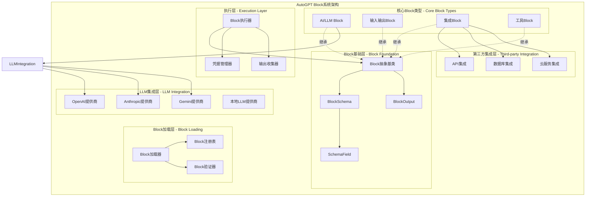

## 概述

AutoGPT Block系统是平台的功能扩展核心，采用插件化架构设计。每个Block封装一个特定功能，通过标准化的输入输出接口与其他Block连接，形成复杂的工作流。系统支持动态Block加载、类型安全的Schema定义、异步执行模型和完善的错误处理机制。

<!--more-->

## 1. Block系统整体架构

### 1.1 Block系统设计原则

- **插件化架构**：每个Block独立封装功能，支持热插拔
- **标准化接口**：统一的输入输出Schema定义
- **类型安全**：基于Pydantic的强类型验证
- **异步执行**：支持同步和异步两种执行模式
- **可组合性**：Block通过连接组合成复杂工作流

### 1.2 Block系统架构图



**图1-1: AutoGPT Block系统架构图**

## 2. Block基类设计

### 2.1 Block抽象基类

```python
# /autogpt_platform/backend/backend/data/block.py

class Block(ABC):
    """
    Block抽象基类
    
    核心属性:
    - id: Block的唯一UUID标识符
    - name: Block的类名
    - description: Block的功能描述
    - categories: Block所属的分类集合
    - input_schema: 输入数据的Pydantic模型
    - output_schema: 输出数据的Pydantic模型
    - test_input/test_output: 测试用例数据
    
    核心方法:
    - run(): Block的执行逻辑（子类必须实现）
    - execute(): 执行包装器，处理输入输出和错误
    """
    
    def __init__(
        self,
        id: str,
        description: str,
        categories: set[BlockCategory],
        input_schema: Type[BlockSchema],
        output_schema: Type[BlockSchema],
        test_input: Optional[dict] = None,
        test_output: Optional[list] = None,
        disabled: bool = False,
        static_output: bool = False,
    ):
        self.id = id
        self.description = description
        self.categories = categories
        self.input_schema = input_schema
        self.output_schema = output_schema
        self.test_input = test_input
        self.test_output = test_output
        self.disabled = disabled
        self.static_output = static_output
    
    @property
    def name(self) -> str:
        """获取Block类名"""
        return self.__class__.__name__
    
    @abstractmethod
    async def run(
        self, 
        input_data: BlockSchema, 
        **kwargs
    ) -> BlockOutput:
        """
        Block执行的核心方法（子类必须实现）
        
        参数:
            input_data: 经过验证的输入数据
            **kwargs: 额外参数（credentials、user_context等）
            
        返回:
            BlockOutput: 输出数据生成器
        """
        pass
    
    async def execute(
        self,
        input_data: dict,
        credentials: dict = {},
        user_context: UserContext = None,
        **kwargs
    ) -> AsyncGenerator[tuple[str, Any], None]:
        """
        Block执行的包装方法
        
        执行流程:
        1. 验证输入数据
        2. 调用run方法执行逻辑
        3. 收集并验证输出数据
        4. 处理异常和错误
        
        参数:
            input_data: 原始输入数据字典
            credentials: 凭据字典
            user_context: 用户上下文
            
        生成:
            tuple[str, Any]: (输出名称, 输出数据)元组
        """
        try:
            # 验证并解析输入
            validated_input = self.input_schema.model_validate(input_data)
            
            # 执行Block逻辑
            async for output_name, output_data in self.run(
                validated_input,
                credentials=credentials,
                user_context=user_context,
                **kwargs
            ):
                # 验证输出
                if output_name in self.output_schema.model_fields:
                    yield output_name, output_data
                else:
                    yield "error", f"Invalid output field: {output_name}"
                    
        except ValidationError as e:
            yield "error", f"Input validation failed: {str(e)}"
        except Exception as e:
            yield "error", f"Block execution failed: {str(e)}"
```

### 2.2 BlockSchema定义

```python
class BlockSchema(BaseModel):
    """
    Block输入输出Schema基类
    
    所有Block的输入和输出模型都必须继承此类。
    提供统一的验证、序列化和文档生成能力。
    """
    
    model_config = ConfigDict(
        extra="forbid",  # 禁止额外字段
        validate_assignment=True,  # 赋值时验证
        use_enum_values=True,  # 枚举使用值
    )
    
    def model_dump_json_safe(self) -> dict:
        """
        安全的JSON序列化
        
        处理特殊类型如datetime、UUID等
        """
        return json.loads(
            self.model_dump_json(exclude_none=True)
        )

def SchemaField(
    description: str,
    placeholder: str = "",
    title: str = "",
    default: Any = ...,
    advanced: bool = False,
    secret: bool = False,
    **kwargs
) -> Any:
    """
    Schema字段定义辅助函数
    
    参数:
        description: 字段描述
        placeholder: 占位符文本
        title: 字段标题
        default: 默认值
        advanced: 是否为高级选项
        secret: 是否为敏感信息
        
    返回:
        Pydantic Field对象
    """
    json_extra = {
        "description": description,
        "placeholder": placeholder,
        "title": title or description,
        "advanced": advanced,
        "secret": secret,
    }
    
    return Field(
        default=default,
        json_schema_extra=json_extra,
        **kwargs
    )
```

## 3. Block动态加载机制

### 3.1 Block自动发现与加载

```python
# /autogpt_platform/backend/backend/blocks/__init__.py

@cached()
def load_all_blocks() -> dict[str, type["Block"]]:
    """
    自动加载所有Block类
    
    加载流程:
    1. 扫描blocks目录下的所有Python文件
    2. 动态导入模块
    3. 收集Block子类
    4. 验证Block定义
    5. 注册到全局字典
    
    返回:
        dict[str, type[Block]]: Block ID到Block类的映射
    """
    from backend.data.block import Block
    from backend.util.settings import Config
    
    config = Config()
    load_examples = config.enable_example_blocks
    
    # 扫描blocks目录
    current_dir = Path(__file__).parent
    modules = []
    
    for f in current_dir.rglob("*.py"):
        if not f.is_file() or f.name == "__init__.py":
            continue
        
        if f.name.startswith("test_"):
            continue
        
        # 跳过示例Block（如果未启用）
        relative_path = f.relative_to(current_dir)
        if not load_examples and relative_path.parts[0] == "examples":
            continue
        
        # 构建模块路径
        module_path = str(relative_path)[:-3].replace(os.path.sep, ".")
        modules.append(module_path)
    
    # 动态导入所有模块
    for module in modules:
        if not re.match("^[a-z0-9_.]+$", module):
            raise ValueError(
                f"Block module {module} error: module name must be lowercase"
            )
        
        importlib.import_module(f".{module}", package=__name__)
    
    # 收集所有Block子类
    available_blocks: dict[str, type[Block]] = {}
    
    for block_cls in all_subclasses(Block):
        class_name = block_cls.__name__
        
        # 跳过抽象基类
        if class_name.endswith("Base"):
            continue
        
        # 验证命名规范
        if not class_name.endswith("Block"):
            raise ValueError(
                f"Block class {class_name} must end with 'Block'"
            )
        
        # 创建Block实例
        block = block_cls.create()
        
        # 验证UUID
        if not isinstance(block.id, str) or len(block.id) != 36:
            raise ValueError(
                f"Block ID {block.name} error: {block.id} is not a valid UUID"
            )
        
        # 检查ID唯一性
        if block.id in available_blocks:
            raise ValueError(
                f"Block ID {block.name} error: {block.id} is already in use"
            )
        
        # 验证Schema定义
        validate_block_schema(block)
        
        available_blocks[block.id] = block_cls
    
    return available_blocks

def validate_block_schema(block: Block):
    """
    验证Block的Schema定义
    
    验证规则:
    1. 所有字段必须有类型注解
    2. 所有字段必须使用SchemaField定义
    3. error字段必须是字符串类型
    4. 输入输出Schema必须继承BlockSchema
    """
    input_schema = block.input_schema.model_fields
    output_schema = block.output_schema.model_fields
    
    # 验证error字段类型
    if "error" in output_schema:
        if output_schema["error"].annotation is not str:
            raise ValueError(
                f"{block.name} `error` field must be a string"
            )
    
    # 验证字段注解和SchemaField
    for field_name, field in [*input_schema.items(), *output_schema.items()]:
        if field.annotation is None:
            raise ValueError(
                f"{block.name} field {field_name} is not annotated"
            )
        
        if field.json_schema_extra is None:
            raise ValueError(
                f"{block.name} field {field_name} not defined as SchemaField"
            )
```

## 4. 核心Block类型实现

### 4.1 AI/LLM Block实现

```python
# /autogpt_platform/backend/backend/blocks/llm.py

class AIBlockBase(Block, ABC):
    """
    AI Block基类
    
    提供LLM调用的通用功能:
    - 统一的凭据处理
    - Prompt管理
    - 统计信息收集
    - 错误处理
    """
    
    def __init__(self, *args, **kwargs):
        super().__init__(*args, **kwargs)
        self.prompt = []
        self.execution_stats = {}
    
    def merge_llm_stats(self, block: "AIBlockBase"):
        """合并LLM统计信息"""
        self.merge_stats(block.execution_stats)
        self.prompt = block.prompt

class AITextGeneratorBlock(AIBlockBase):
    """
    AI文本生成Block
    
    功能:
    - 基于Prompt生成文本
    - 支持多种LLM模型
    - 支持流式输出
    """
    
    class Input(BlockSchema):
        prompt: str = SchemaField(
            description="要发送给语言模型的提示词",
            placeholder="输入你的提示词..."
        )
        
        model: LlmModel = SchemaField(
            title="LLM模型",
            default=LlmModel.GPT4O,
            description="使用的语言模型"
        )
        
        credentials: AICredentials = AICredentialsField()
        
        max_tokens: int = SchemaField(
            default=1000,
            description="最大生成token数",
            ge=1,
            le=100000
        )
        
        temperature: float = SchemaField(
            default=0.7,
            description="生成温度，控制随机性",
            ge=0.0,
            le=2.0
        )
    
    class Output(BlockSchema):
        response: str = SchemaField(
            description="模型生成的响应文本"
        )
        
        usage: dict = SchemaField(
            description="Token使用统计"
        )
        
        error: str = SchemaField(
            default="",
            description="错误信息"
        )
    
    def __init__(self):
        super().__init__(
            id="550c8935-69d9-4d94-bce1-8f2a828b2c74",
            description="使用AI语言模型生成文本响应",
            categories={BlockCategory.AI},
            input_schema=AITextGeneratorBlock.Input,
            output_schema=AITextGeneratorBlock.Output,
        )
    
    async def run(
        self, 
        input_data: Input, 
        *, 
        credentials: dict,
        **kwargs
    ) -> BlockOutput:
        """
        执行AI文本生成
        
        执行流程:
        1. 准备LLM调用参数
        2. 构建Prompt列表
        3. 调用LLM API
        4. 处理响应
        5. 收集使用统计
        """
        try:
            # 获取凭据
            api_key = credentials.get(input_data.credentials.provider)
            if not api_key:
                yield "error", f"Missing credentials for {input_data.credentials.provider}"
                return
            
            # 构建Prompt
            messages = [
                {"role": "user", "content": input_data.prompt}
            ]
            
            # 调用LLM
            response = await llm_call(
                credentials=api_key,
                llm_model=input_data.model,
                prompt=messages,
                max_tokens=input_data.max_tokens,
            )
            
            # 输出响应
            yield "response", response.content
            yield "usage", {
                "prompt_tokens": response.usage.prompt_tokens,
                "completion_tokens": response.usage.completion_tokens,
                "total_tokens": response.usage.total_tokens,
            }
            
        except Exception as e:
            yield "error", str(e)

async def llm_call(
    credentials: APIKeyCredentials,
    llm_model: LlmModel,
    prompt: list[dict],
    max_tokens: int | None,
    **kwargs
) -> LLMResponse:
    """
    统一的LLM调用接口
    
    支持的提供商:
    - OpenAI (GPT-3.5, GPT-4, GPT-4O)
    - Anthropic (Claude系列)
    - Google (Gemini系列)
    - Groq (开源模型)
    - 本地Ollama
    
    参数:
        credentials: API凭据
        llm_model: 模型标识
        prompt: 消息列表
        max_tokens: 最大token数
        
    返回:
        LLMResponse: 统一的响应对象
    """
    provider = llm_model.value.split("/")[0]
    
    if provider == "openai":
        return await _call_openai(
            credentials, llm_model, prompt, max_tokens, **kwargs
        )
    elif provider == "anthropic":
        return await _call_anthropic(
            credentials, llm_model, prompt, max_tokens, **kwargs
        )
    elif provider == "google":
        return await _call_gemini(
            credentials, llm_model, prompt, max_tokens, **kwargs
        )
    else:
        raise ValueError(f"Unsupported LLM provider: {provider}")
```

### 4.2 输入输出Block

```python
# /autogpt_platform/backend/backend/blocks/io.py

class AgentInputBlock(Block):
    """
    智能体输入Block
    
    功能:
    - 作为工作流的入口点
    - 接收用户输入数据
    - 支持多种数据类型
    """
    
    class Input(BlockSchema):
        name: str = SchemaField(
            description="输入参数名称"
        )
        
        value: Any = SchemaField(
            description="输入值"
        )
        
        title: str = SchemaField(
            default="",
            description="输入标题"
        )
        
        description: str = SchemaField(
            default="",
            description="输入描述"
        )
    
    class Output(BlockSchema):
        result: Any = SchemaField(
            description="输入值"
        )
        
        error: str = SchemaField(
            default="",
            description="错误信息"
        )
    
    def __init__(self):
        super().__init__(
            id="c0a8e994-ebf1-4a9c-a4d8-89d09c86741b",
            description="智能体的输入节点",
            categories={BlockCategory.INPUT},
            input_schema=AgentInputBlock.Input,
            output_schema=AgentInputBlock.Output,
        )
    
    async def run(self, input_data: Input, **kwargs) -> BlockOutput:
        """直接传递输入值"""
        yield "result", input_data.value

class AgentOutputBlock(Block):
    """
    智能体输出Block
    
    功能:
    - 作为工作流的出口点
    - 收集最终输出数据
    - 格式化输出结果
    """
    
    class Input(BlockSchema):
        value: Any = SchemaField(
            description="要输出的值"
        )
        
        output_name: str = SchemaField(
            default="result",
            description="输出名称"
        )
    
    class Output(BlockSchema):
        output: Any = SchemaField(
            description="输出值"
        )
        
        error: str = SchemaField(
            default="",
            description="错误信息"
        )
    
    def __init__(self):
        super().__init__(
            id="363ae599-353e-4804-937e-b2ee3cef3da4",
            description="智能体的输出节点",
            categories={BlockCategory.OUTPUT},
            input_schema=AgentOutputBlock.Input,
            output_schema=AgentOutputBlock.Output,
        )
    
    async def run(self, input_data: Input, **kwargs) -> BlockOutput:
        """输出数据"""
        yield "output", input_data.value
```

### 4.3 第三方集成Block

```python
# /autogpt_platform/backend/backend/blocks/airtable/bases.py

class AirtableCreateBaseBlock(Block):
    """
    Airtable创建Base Block
    
    功能:
    - 创建新的Airtable Base
    - 配置Base设置
    - 返回Base ID
    """
    
    class Input(BlockSchema):
        credentials: AirtableCredentials = AirtableCredentialsField()
        
        name: str = SchemaField(
            description="Base名称"
        )
        
        workspace_id: str = SchemaField(
            description="工作空间ID"
        )
    
    class Output(BlockSchema):
        base_id: str = SchemaField(
            description="创建的Base ID"
        )
        
        error: str = SchemaField(
            default="",
            description="错误信息"
        )
    
    def __init__(self):
        super().__init__(
            id="airtable-create-base-block",
            description="在Airtable中创建新的Base",
            categories={BlockCategory.INTEGRATION},
            input_schema=AirtableCreateBaseBlock.Input,
            output_schema=AirtableCreateBaseBlock.Output,
        )
    
    async def run(
        self, 
        input_data: Input, 
        *, 
        credentials: dict,
        **kwargs
    ) -> BlockOutput:
        """
        执行Airtable Base创建
        
        执行步骤:
        1. 获取Airtable凭据
        2. 构建API请求
        3. 调用Airtable API
        4. 处理响应
        """
        try:
            # 获取凭据
            api_key = credentials.get("airtable")
            if not api_key:
                yield "error", "Missing Airtable credentials"
                return
            
            # 调用API
            async with httpx.AsyncClient() as client:
                response = await client.post(
                    f"https://api.airtable.com/v0/meta/bases",
                    headers={
                        "Authorization": f"Bearer {api_key}",
                        "Content-Type": "application/json",
                    },
                    json={
                        "name": input_data.name,
                        "workspaceId": input_data.workspace_id,
                    }
                )
                
                response.raise_for_status()
                data = response.json()
                
                yield "base_id", data["id"]
                
        except Exception as e:
            yield "error", str(e)
```

## 5. Block执行与测试

### 5.1 Block单元测试框架

```python
# /autogpt_platform/backend/backend/blocks/test_helpers.py

async def test_block_execution(
    block: Block,
    test_input: dict,
    expected_output: dict,
    credentials: dict = {},
):
    """
    Block执行测试辅助函数
    
    测试步骤:
    1. 执行Block
    2. 收集输出
    3. 验证输出符合预期
    4. 检查错误处理
    
    参数:
        block: 要测试的Block实例
        test_input: 测试输入数据
        expected_output: 预期输出
        credentials: 测试凭据
    """
    outputs = {}
    
    # 执行Block
    async for output_name, output_data in block.execute(
        test_input,
        credentials=credentials
    ):
        outputs[output_name] = output_data
    
    # 验证输出
    assert "error" not in outputs or not outputs["error"], \
        f"Block execution failed: {outputs.get('error')}"
    
    for key, expected_value in expected_output.items():
        assert key in outputs, \
            f"Expected output '{key}' not found"
        
        assert outputs[key] == expected_value, \
            f"Output '{key}' mismatch: {outputs[key]} != {expected_value}"
```

### 5.2 Block性能基准测试

```python
async def benchmark_block_execution(
    block: Block,
    test_input: dict,
    iterations: int = 100,
):
    """
    Block性能基准测试
    
    测试指标:
    - 平均执行时间
    - 最大/最小执行时间
    - 吞吐量
    - 内存使用
    
    参数:
        block: 要测试的Block
        test_input: 测试输入
        iterations: 测试迭代次数
    """
    import time
    import statistics
    
    execution_times = []
    
    for _ in range(iterations):
        start_time = time.time()
        
        # 执行Block
        async for _ in block.execute(test_input):
            pass
        
        execution_time = time.time() - start_time
        execution_times.append(execution_time)
    
    # 计算统计信息
    return {
        "avg_time": statistics.mean(execution_times),
        "min_time": min(execution_times),
        "max_time": max(execution_times),
        "std_dev": statistics.stdev(execution_times),
        "throughput": iterations / sum(execution_times),
    }
```

## 6. Block最佳实践

### 6.1 Block设计指南

1. **单一职责原则**：每个Block只做一件事
2. **明确的输入输出**：清晰定义Schema
3. **错误处理**：总是yield error输出
4. **幂等性**：相同输入产生相同输出
5. **性能考虑**：避免阻塞操作，使用异步

### 6.2 常见Block实现模式

```python
class TemplateBlock(Block):
    """Block实现模板"""
    
    class Input(BlockSchema):
        # 必需字段
        required_field: str = SchemaField(
            description="必需输入字段"
        )
        
        # 可选字段with默认值
        optional_field: int = SchemaField(
            default=0,
            description="可选输入字段"
        )
        
        # 高级选项
        advanced_option: bool = SchemaField(
            default=False,
            description="高级选项",
            advanced=True
        )
    
    class Output(BlockSchema):
        result: Any = SchemaField(
            description="处理结果"
        )
        
        metadata: dict = SchemaField(
            default_factory=dict,
            description="元数据"
        )
        
        error: str = SchemaField(
            default="",
            description="错误信息"
        )
    
    def __init__(self):
        super().__init__(
            id="unique-uuid-here",
            description="Block功能描述",
            categories={BlockCategory.BASIC},
            input_schema=TemplateBlock.Input,
            output_schema=TemplateBlock.Output,
        )
    
    async def run(self, input_data: Input, **kwargs) -> BlockOutput:
        try:
            # 1. 输入验证
            # 2. 业务逻辑处理
            # 3. 输出结果
            yield "result", processed_data
            yield "metadata", metadata
            
        except Exception as e:
            yield "error", str(e)
```

## 总结

AutoGPT Block系统通过精心设计的插件化架构，为平台提供了强大的功能扩展能力。核心优势包括：

1. **标准化接口**：统一的Block基类和Schema定义
2. **动态加载机制**：自动发现和注册Block
3. **类型安全**：基于Pydantic的强类型验证
4. **异步执行模型**：高效的异步执行支持
5. **丰富的Block生态**：AI、集成、工具等多种Block类型

通过Block系统，开发者可以快速扩展AutoGPT的功能，构建复杂的AI工作流。

---


