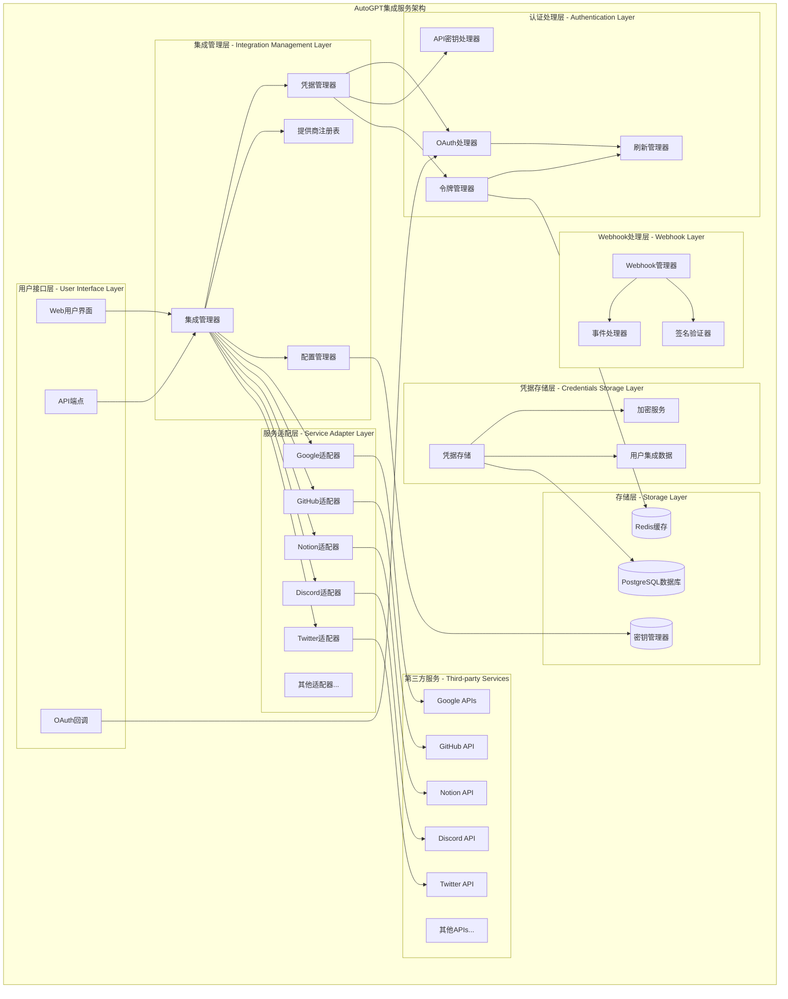
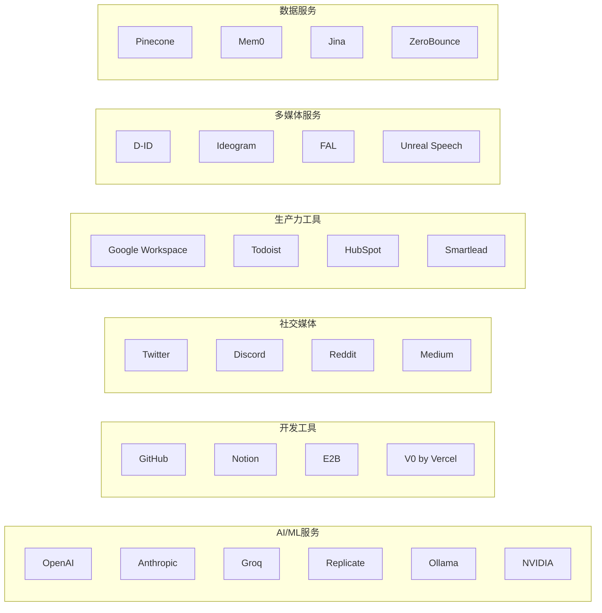

## 概述

AutoGPT集成服务模块提供了与第三方服务的完整集成能力，支持50+种主流服务的API集成。模块采用插件化架构设计，包含OAuth认证流程、API密钥管理、凭据存储、Webhook处理等核心功能。通过标准化的集成接口和安全的凭据管理机制，为用户提供了便捷的第三方服务接入能力。

<!--more-->

## 1. 集成服务整体架构

### 1.1 集成服务设计原则

AutoGPT集成服务模块遵循以下核心设计原则：

- **插件化架构**：每个第三方服务独立封装，支持动态加载
- **标准化接口**：统一的OAuth和API密钥认证接口
- **安全凭据管理**：加密存储和安全传输用户凭据
- **灵活配置**：支持环境变量和动态配置
- **扩展性设计**：易于添加新的第三方服务集成

### 1.2 集成服务架构图



**图1-1: AutoGPT集成服务架构图**

此架构图展示了集成服务模块的完整分层结构。用户接口层提供OAuth认证和API管理界面，集成管理层协调各种集成服务，认证处理层处理OAuth和API密钥认证，服务适配层封装具体的第三方服务API，Webhook处理层处理第三方服务的回调事件，凭据存储层安全管理用户凭据。

### 1.3 集成服务提供商总览



**图1-2: 支持的第三方服务提供商**

AutoGPT平台支持50+种第三方服务，涵盖AI/ML、开发工具、社交媒体、生产力工具、多媒体服务和数据服务等多个领域。

## 2. 提供商注册与管理

### 2.1 提供商枚举定义

```python
# /autogpt_platform/backend/backend/integrations/providers.py

from enum import Enum
from typing import Any

class ProviderName(str, Enum):
    """
    集成服务提供商名称枚举
    
    此枚举扩展了str类型，支持接受任何字符串值，
    同时保持与现有提供商常量的向后兼容性。
    
    特性:
    1. 预定义常用提供商
    2. 支持动态添加自定义提供商
    3. 类型安全的字符串枚举
    4. Pydantic集成支持
    """
    
    # AI/ML服务提供商
    OPENAI = "openai"
    ANTHROPIC = "anthropic"
    GROQ = "groq"
    REPLICATE = "replicate"
    OLLAMA = "ollama"
    NVIDIA = "nvidia"
    AIML_API = "aiml_api"
    LLAMA_API = "llama_api"
    OPEN_ROUTER = "open_router"
    
    # 开发工具
    GITHUB = "github"
    NOTION = "notion"
    E2B = "e2b"
    V0 = "v0"
    
    # 社交媒体
    TWITTER = "twitter"
    DISCORD = "discord"
    REDDIT = "reddit"
    MEDIUM = "medium"
    
    # 生产力工具
    GOOGLE = "google"
    GOOGLE_MAPS = "google_maps"
    TODOIST = "todoist"
    HUBSPOT = "hubspot"
    SMARTLEAD = "smartlead"
    
    # 多媒体服务
    D_ID = "d_id"
    IDEOGRAM = "ideogram"
    FAL = "fal"
    UNREAL_SPEECH = "unreal_speech"
    REVID = "revid"
    SCREENSHOTONE = "screenshotone"
    
    # 数据服务
    PINECONE = "pinecone"
    MEM0 = "mem0"
    JINA = "jina"
    ZEROBOUNCE = "zerobounce"
    ENRICHLAYER = "enrichlayer"
    
    # 其他服务
    HTTP = "http"
    SMTP = "smtp"
    APOLLO = "apollo"
    COMPASS = "compass"
    SLANT3D = "slant3d"
    OPENWEATHERMAP = "openweathermap"
    
    @classmethod
    def _missing_(cls, value: Any) -> "ProviderName":
        """
        允许任何字符串值作为ProviderName使用
        
        这使得SDK用户可以定义自定义提供商，
        而无需修改枚举定义。
        
        参数:
            value: 要创建的提供商名称
            
        返回:
            ProviderName: 伪枚举成员
        """
        if isinstance(value, str):
            # 创建一个行为类似枚举成员的伪成员
            pseudo_member = str.__new__(cls, value)
            pseudo_member._name_ = value.upper()
            pseudo_member._value_ = value
            return pseudo_member
        return None  # type: ignore
    
    @classmethod
    def __get_pydantic_json_schema__(cls, schema, handler):
        """
        为Pydantic提供JSON Schema定义
        
        允许在API文档中正确显示提供商选项
        """
        # 获取所有预定义的提供商值
        enum_values = [member.value for member in cls]
        
        return {
            "type": "string",
            "enum": enum_values,
            "description": "集成服务提供商名称",
            "examples": ["openai", "github", "notion", "discord"]
        }
    
    def is_ai_provider(self) -> bool:
        """检查是否为AI服务提供商"""
        ai_providers = {
            self.OPENAI, self.ANTHROPIC, self.GROQ, 
            self.REPLICATE, self.OLLAMA, self.NVIDIA,
            self.AIML_API, self.LLAMA_API, self.OPEN_ROUTER
        }
        return self in ai_providers
    
    def is_oauth_provider(self) -> bool:
        """检查是否支持OAuth认证"""
        oauth_providers = {
            self.GOOGLE, self.GITHUB, self.TWITTER,
            self.DISCORD, self.NOTION, self.TODOIST
        }
        return self in oauth_providers
    
    def get_display_name(self) -> str:
        """获取用户友好的显示名称"""
        display_names = {
            self.OPENAI: "OpenAI",
            self.ANTHROPIC: "Anthropic",
            self.GITHUB: "GitHub",
            self.GOOGLE: "Google",
            self.GOOGLE_MAPS: "Google Maps",
            self.D_ID: "D-ID",
            self.E2B: "E2B",
            self.V0: "v0 by Vercel",
            self.AIML_API: "AI/ML API",
            self.LLAMA_API: "Llama API",
            self.OPEN_ROUTER: "OpenRouter",
            self.UNREAL_SPEECH: "Unreal Speech",
            self.SCREENSHOTONE: "ScreenshotOne",
            self.ZEROBOUNCE: "ZeroBounce",
            self.ENRICHLAYER: "EnrichLayer",
            self.OPENWEATHERMAP: "OpenWeatherMap",
            self.SLANT3D: "Slant 3D",
        }
        return display_names.get(self, self.value.title())

class ProviderCategory(str, Enum):
    """提供商分类枚举"""
    
    AI_ML = "ai_ml"
    DEVELOPMENT = "development"
    SOCIAL_MEDIA = "social_media"
    PRODUCTIVITY = "productivity"
    MULTIMEDIA = "multimedia"
    DATA_SERVICES = "data_services"
    COMMUNICATION = "communication"
    ECOMMERCE = "ecommerce"
    ANALYTICS = "analytics"
    OTHER = "other"

def get_provider_category(provider: ProviderName) -> ProviderCategory:
    """
    获取提供商所属分类
    
    参数:
        provider: 提供商名称
        
    返回:
        ProviderCategory: 提供商分类
    """
    category_mapping = {
        # AI/ML服务
        ProviderName.OPENAI: ProviderCategory.AI_ML,
        ProviderName.ANTHROPIC: ProviderCategory.AI_ML,
        ProviderName.GROQ: ProviderCategory.AI_ML,
        ProviderName.REPLICATE: ProviderCategory.AI_ML,
        ProviderName.OLLAMA: ProviderCategory.AI_ML,
        ProviderName.NVIDIA: ProviderCategory.AI_ML,
        
        # 开发工具
        ProviderName.GITHUB: ProviderCategory.DEVELOPMENT,
        ProviderName.NOTION: ProviderCategory.DEVELOPMENT,
        ProviderName.E2B: ProviderCategory.DEVELOPMENT,
        ProviderName.V0: ProviderCategory.DEVELOPMENT,
        
        # 社交媒体
        ProviderName.TWITTER: ProviderCategory.SOCIAL_MEDIA,
        ProviderName.DISCORD: ProviderCategory.SOCIAL_MEDIA,
        ProviderName.REDDIT: ProviderCategory.SOCIAL_MEDIA,
        ProviderName.MEDIUM: ProviderCategory.SOCIAL_MEDIA,
        
        # 生产力工具
        ProviderName.GOOGLE: ProviderCategory.PRODUCTIVITY,
        ProviderName.TODOIST: ProviderCategory.PRODUCTIVITY,
        ProviderName.HUBSPOT: ProviderCategory.PRODUCTIVITY,
        ProviderName.SMARTLEAD: ProviderCategory.PRODUCTIVITY,
        
        # 多媒体服务
        ProviderName.D_ID: ProviderCategory.MULTIMEDIA,
        ProviderName.IDEOGRAM: ProviderCategory.MULTIMEDIA,
        ProviderName.FAL: ProviderCategory.MULTIMEDIA,
        ProviderName.UNREAL_SPEECH: ProviderCategory.MULTIMEDIA,
        
        # 数据服务
        ProviderName.PINECONE: ProviderCategory.DATA_SERVICES,
        ProviderName.MEM0: ProviderCategory.DATA_SERVICES,
        ProviderName.JINA: ProviderCategory.DATA_SERVICES,
        ProviderName.ZEROBOUNCE: ProviderCategory.DATA_SERVICES,
    }
    
    return category_mapping.get(provider, ProviderCategory.OTHER)
```

### 2.2 提供商注册表

```python
# 提供商注册表实现

from typing import Dict, List, Optional, Type
from dataclasses import dataclass

@dataclass
class ProviderInfo:
    """
    提供商信息数据类
    
    包含提供商的基本信息和配置
    """
    name: ProviderName
    display_name: str
    category: ProviderCategory
    description: str
    auth_type: str  # "oauth", "api_key", "both"
    website_url: str
    documentation_url: str
    logo_url: Optional[str] = None
    is_enabled: bool = True
    requires_approval: bool = False
    rate_limits: Optional[Dict[str, int]] = None

class ProviderRegistry:
    """
    提供商注册表
    
    管理所有集成服务提供商的信息和配置
    """
    
    def __init__(self):
        self._providers: Dict[ProviderName, ProviderInfo] = {}
        self._initialize_default_providers()
    
    def _initialize_default_providers(self):
        """初始化默认提供商信息"""
        default_providers = [
            ProviderInfo(
                name=ProviderName.OPENAI,
                display_name="OpenAI",
                category=ProviderCategory.AI_ML,
                description="OpenAI GPT models and APIs",
                auth_type="api_key",
                website_url="https://openai.com",
                documentation_url="https://platform.openai.com/docs",
                logo_url="https://openai.com/favicon.ico",
                rate_limits={"requests_per_minute": 60}
            ),
            ProviderInfo(
                name=ProviderName.GITHUB,
                display_name="GitHub",
                category=ProviderCategory.DEVELOPMENT,
                description="GitHub repositories and APIs",
                auth_type="oauth",
                website_url="https://github.com",
                documentation_url="https://docs.github.com/en/rest",
                logo_url="https://github.com/favicon.ico",
                rate_limits={"requests_per_hour": 5000}
            ),
            ProviderInfo(
                name=ProviderName.GOOGLE,
                display_name="Google",
                category=ProviderCategory.PRODUCTIVITY,
                description="Google Workspace APIs",
                auth_type="oauth",
                website_url="https://google.com",
                documentation_url="https://developers.google.com",
                logo_url="https://google.com/favicon.ico",
                rate_limits={"requests_per_day": 100000}
            ),
            ProviderInfo(
                name=ProviderName.DISCORD,
                display_name="Discord",
                category=ProviderCategory.SOCIAL_MEDIA,
                description="Discord bot and API integration",
                auth_type="both",
                website_url="https://discord.com",
                documentation_url="https://discord.com/developers/docs",
                logo_url="https://discord.com/assets/favicon.ico",
                rate_limits={"requests_per_second": 50}
            ),
            # 添加更多默认提供商...
        ]
        
        for provider in default_providers:
            self._providers[provider.name] = provider
    
    def register_provider(self, provider_info: ProviderInfo):
        """
        注册新的提供商
        
        参数:
            provider_info: 提供商信息
        """
        self._providers[provider_info.name] = provider_info
    
    def get_provider(self, name: ProviderName) -> Optional[ProviderInfo]:
        """
        获取提供商信息
        
        参数:
            name: 提供商名称
            
        返回:
            Optional[ProviderInfo]: 提供商信息，如果不存在则返回None
        """
        return self._providers.get(name)
    
    def get_providers_by_category(self, category: ProviderCategory) -> List[ProviderInfo]:
        """
        按分类获取提供商列表
        
        参数:
            category: 提供商分类
            
        返回:
            List[ProviderInfo]: 该分类下的提供商列表
        """
        return [
            provider for provider in self._providers.values()
            if provider.category == category and provider.is_enabled
        ]
    
    def get_oauth_providers(self) -> List[ProviderInfo]:
        """获取支持OAuth的提供商列表"""
        return [
            provider for provider in self._providers.values()
            if provider.auth_type in ["oauth", "both"] and provider.is_enabled
        ]
    
    def get_api_key_providers(self) -> List[ProviderInfo]:
        """获取支持API密钥的提供商列表"""
        return [
            provider for provider in self._providers.values()
            if provider.auth_type in ["api_key", "both"] and provider.is_enabled
        ]
    
    def search_providers(self, query: str) -> List[ProviderInfo]:
        """
        搜索提供商
        
        参数:
            query: 搜索关键词
            
        返回:
            List[ProviderInfo]: 匹配的提供商列表
        """
        query_lower = query.lower()
        results = []
        
        for provider in self._providers.values():
            if not provider.is_enabled:
                continue
            
            # 搜索名称、显示名称和描述
            if (query_lower in provider.name.value.lower() or
                query_lower in provider.display_name.lower() or
                query_lower in provider.description.lower()):
                results.append(provider)
        
        return results
    
    def get_all_providers(self) -> List[ProviderInfo]:
        """获取所有启用的提供商"""
        return [
            provider for provider in self._providers.values()
            if provider.is_enabled
        ]

# 全局提供商注册表实例
provider_registry = ProviderRegistry()
```

## 3. OAuth认证处理

### 3.1 OAuth基础处理器

```python
# /autogpt_platform/backend/backend/integrations/oauth/base.py

from abc import ABC, abstractmethod
from typing import Any, Dict, Optional
from urllib.parse import urlencode
import httpx
from pydantic import BaseModel

from autogpt_libs.supabase_integration_credentials_store.types import (
    OAuth2Credentials,
    OAuthState,
)
from backend.integrations.providers import ProviderName

class OAuthConfig(BaseModel):
    """OAuth配置模型"""
    
    client_id: str
    client_secret: str
    redirect_uri: str
    scope: Optional[str] = None
    additional_params: Dict[str, str] = {}

class BaseOAuthHandler(ABC):
    """
    OAuth处理器基类
    
    定义了OAuth认证流程的标准接口，
    所有OAuth提供商都必须实现这些方法。
    
    OAuth流程:
    1. 生成授权URL
    2. 处理授权回调
    3. 交换访问令牌
    4. 刷新访问令牌
    5. 撤销访问令牌
    """
    
    PROVIDER_NAME: ProviderName
    
    def __init__(self, config: OAuthConfig):
        self.config = config
        self.client = httpx.AsyncClient()
    
    @property
    @abstractmethod
    def authorization_url(self) -> str:
        """授权服务器URL"""
        pass
    
    @property
    @abstractmethod
    def token_url(self) -> str:
        """令牌交换URL"""
        pass
    
    @property
    @abstractmethod
    def revoke_url(self) -> Optional[str]:
        """令牌撤销URL（可选）"""
        pass
    
    def get_authorization_url(
        self, 
        state: str, 
        extra_params: Optional[Dict[str, str]] = None
    ) -> str:
        """
        生成OAuth授权URL
        
        参数:
            state: 状态参数，用于防止CSRF攻击
            extra_params: 额外的查询参数
            
        返回:
            str: 完整的授权URL
        """
        params = {
            "client_id": self.config.client_id,
            "redirect_uri": self.config.redirect_uri,
            "response_type": "code",
            "state": state,
        }
        
        # 添加scope参数
        if self.config.scope:
            params["scope"] = self.config.scope
        
        # 添加额外参数
        if extra_params:
            params.update(extra_params)
        
        # 添加提供商特定参数
        params.update(self.config.additional_params)
        
        return f"{self.authorization_url}?{urlencode(params)}"
    
    async def exchange_code_for_tokens(
        self, 
        code: str, 
        state: str
    ) -> OAuth2Credentials:
        """
        交换授权码获取访问令牌
        
        参数:
            code: 授权码
            state: 状态参数
            
        返回:
            OAuth2Credentials: OAuth2凭据对象
            
        异常:
            OAuthError: 令牌交换失败时抛出
        """
        token_data = {
            "client_id": self.config.client_id,
            "client_secret": self.config.client_secret,
            "code": code,
            "grant_type": "authorization_code",
            "redirect_uri": self.config.redirect_uri,
        }
        
        try:
            response = await self.client.post(
                self.token_url,
                data=token_data,
                headers={"Accept": "application/json"}
            )
            response.raise_for_status()
            
            token_response = response.json()
            
            # 获取用户信息
            user_info = await self.get_user_info(token_response["access_token"])
            
            # 创建OAuth2凭据
            credentials = OAuth2Credentials(
                provider=self.PROVIDER_NAME.value,
                access_token=token_response["access_token"],
                refresh_token=token_response.get("refresh_token"),
                access_token_expires_at=self._calculate_expiry(
                    token_response.get("expires_in")
                ),
                scopes=self._parse_scopes(token_response.get("scope")),
                username=user_info.get("username"),
                metadata={
                    "user_info": user_info,
                    "token_type": token_response.get("token_type", "Bearer"),
                }
            )
            
            return credentials
            
        except httpx.HTTPStatusError as e:
            error_detail = e.response.text
            raise OAuthError(f"Token exchange failed: {error_detail}")
        except Exception as e:
            raise OAuthError(f"Unexpected error during token exchange: {str(e)}")
    
    async def refresh_access_token(
        self, 
        credentials: OAuth2Credentials
    ) -> OAuth2Credentials:
        """
        刷新访问令牌
        
        参数:
            credentials: 现有的OAuth2凭据
            
        返回:
            OAuth2Credentials: 更新后的凭据
            
        异常:
            OAuthError: 令牌刷新失败时抛出
        """
        if not credentials.refresh_token:
            raise OAuthError("No refresh token available")
        
        refresh_data = {
            "client_id": self.config.client_id,
            "client_secret": self.config.client_secret,
            "refresh_token": credentials.refresh_token.get_secret_value(),
            "grant_type": "refresh_token",
        }
        
        try:
            response = await self.client.post(
                self.token_url,
                data=refresh_data,
                headers={"Accept": "application/json"}
            )
            response.raise_for_status()
            
            token_response = response.json()
            
            # 更新凭据
            credentials.access_token = token_response["access_token"]
            if "refresh_token" in token_response:
                credentials.refresh_token = token_response["refresh_token"]
            
            credentials.access_token_expires_at = self._calculate_expiry(
                token_response.get("expires_in")
            )
            
            return credentials
            
        except httpx.HTTPStatusError as e:
            error_detail = e.response.text
            raise OAuthError(f"Token refresh failed: {error_detail}")
        except Exception as e:
            raise OAuthError(f"Unexpected error during token refresh: {str(e)}")
    
    async def revoke_token(self, credentials: OAuth2Credentials) -> bool:
        """
        撤销访问令牌
        
        参数:
            credentials: 要撤销的凭据
            
        返回:
            bool: 是否成功撤销
        """
        if not self.revoke_url:
            return True  # 如果不支持撤销，认为成功
        
        try:
            revoke_data = {
                "token": credentials.access_token.get_secret_value(),
                "client_id": self.config.client_id,
                "client_secret": self.config.client_secret,
            }
            
            response = await self.client.post(
                self.revoke_url,
                data=revoke_data
            )
            
            return response.status_code in [200, 204]
            
        except Exception as e:
            logger.error(f"Token revocation failed: {e}")
            return False
    
    @abstractmethod
    async def get_user_info(self, access_token: str) -> Dict[str, Any]:
        """
        获取用户信息
        
        参数:
            access_token: 访问令牌
            
        返回:
            Dict[str, Any]: 用户信息字典
        """
        pass
    
    def _calculate_expiry(self, expires_in: Optional[int]) -> Optional[int]:
        """计算令牌过期时间"""
        if expires_in is None:
            return None
        
        import time
        return int(time.time()) + expires_in
    
    def _parse_scopes(self, scope_string: Optional[str]) -> List[str]:
        """解析权限范围字符串"""
        if not scope_string:
            return []
        
        return scope_string.split()
    
    async def __aenter__(self):
        return self
    
    async def __aexit__(self, exc_type, exc_val, exc_tb):
        await self.client.aclose()

class OAuthError(Exception):
    """OAuth认证异常"""
    pass
```

### 3.2 具体OAuth处理器实现

```python
# GitHub OAuth处理器实现

from backend.integrations.oauth.base import BaseOAuthHandler, OAuthConfig
from backend.integrations.providers import ProviderName

class GitHubOAuthHandler(BaseOAuthHandler):
    """
    GitHub OAuth处理器
    
    实现GitHub OAuth 2.0认证流程
    """
    
    PROVIDER_NAME = ProviderName.GITHUB
    
    @property
    def authorization_url(self) -> str:
        return "https://github.com/login/oauth/authorize"
    
    @property
    def token_url(self) -> str:
        return "https://github.com/login/oauth/access_token"
    
    @property
    def revoke_url(self) -> Optional[str]:
        return None  # GitHub不支持令牌撤销
    
    async def get_user_info(self, access_token: str) -> Dict[str, Any]:
        """
        获取GitHub用户信息
        
        参数:
            access_token: GitHub访问令牌
            
        返回:
            Dict[str, Any]: 用户信息
        """
        headers = {
            "Authorization": f"Bearer {access_token}",
            "Accept": "application/vnd.github.v3+json",
        }
        
        try:
            response = await self.client.get(
                "https://api.github.com/user",
                headers=headers
            )
            response.raise_for_status()
            
            user_data = response.json()
            
            return {
                "id": str(user_data["id"]),
                "username": user_data["login"],
                "name": user_data.get("name"),
                "email": user_data.get("email"),
                "avatar_url": user_data.get("avatar_url"),
                "profile_url": user_data.get("html_url"),
                "company": user_data.get("company"),
                "location": user_data.get("location"),
                "bio": user_data.get("bio"),
                "public_repos": user_data.get("public_repos"),
                "followers": user_data.get("followers"),
                "following": user_data.get("following"),
            }
            
        except httpx.HTTPStatusError as e:
            raise OAuthError(f"Failed to get GitHub user info: {e.response.text}")

# Google OAuth处理器实现

class GoogleOAuthHandler(BaseOAuthHandler):
    """
    Google OAuth处理器
    
    实现Google OAuth 2.0认证流程
    """
    
    PROVIDER_NAME = ProviderName.GOOGLE
    
    @property
    def authorization_url(self) -> str:
        return "https://accounts.google.com/o/oauth2/v2/auth"
    
    @property
    def token_url(self) -> str:
        return "https://oauth2.googleapis.com/token"
    
    @property
    def revoke_url(self) -> Optional[str]:
        return "https://oauth2.googleapis.com/revoke"
    
    def get_authorization_url(
        self, 
        state: str, 
        extra_params: Optional[Dict[str, str]] = None
    ) -> str:
        """Google特定的授权URL生成"""
        # Google需要access_type=offline来获取refresh_token
        google_params = {
            "access_type": "offline",
            "prompt": "consent",  # 强制显示同意屏幕以获取refresh_token
        }
        
        if extra_params:
            google_params.update(extra_params)
        
        return super().get_authorization_url(state, google_params)
    
    async def get_user_info(self, access_token: str) -> Dict[str, Any]:
        """
        获取Google用户信息
        
        参数:
            access_token: Google访问令牌
            
        返回:
            Dict[str, Any]: 用户信息
        """
        headers = {
            "Authorization": f"Bearer {access_token}",
        }
        
        try:
            response = await self.client.get(
                "https://www.googleapis.com/oauth2/v2/userinfo",
                headers=headers
            )
            response.raise_for_status()
            
            user_data = response.json()
            
            return {
                "id": user_data["id"],
                "username": user_data.get("email"),
                "name": user_data.get("name"),
                "email": user_data.get("email"),
                "avatar_url": user_data.get("picture"),
                "verified_email": user_data.get("verified_email"),
                "locale": user_data.get("locale"),
                "given_name": user_data.get("given_name"),
                "family_name": user_data.get("family_name"),
            }
            
        except httpx.HTTPStatusError as e:
            raise OAuthError(f"Failed to get Google user info: {e.response.text}")

# Discord OAuth处理器实现

class DiscordOAuthHandler(BaseOAuthHandler):
    """
    Discord OAuth处理器
    
    实现Discord OAuth 2.0认证流程
    """
    
    PROVIDER_NAME = ProviderName.DISCORD
    
    @property
    def authorization_url(self) -> str:
        return "https://discord.com/api/oauth2/authorize"
    
    @property
    def token_url(self) -> str:
        return "https://discord.com/api/oauth2/token"
    
    @property
    def revoke_url(self) -> Optional[str]:
        return "https://discord.com/api/oauth2/token/revoke"
    
    async def get_user_info(self, access_token: str) -> Dict[str, Any]:
        """
        获取Discord用户信息
        
        参数:
            access_token: Discord访问令牌
            
        返回:
            Dict[str, Any]: 用户信息
        """
        headers = {
            "Authorization": f"Bearer {access_token}",
        }
        
        try:
            response = await self.client.get(
                "https://discord.com/api/users/@me",
                headers=headers
            )
            response.raise_for_status()
            
            user_data = response.json()
            
            return {
                "id": user_data["id"],
                "username": user_data["username"],
                "discriminator": user_data.get("discriminator"),
                "email": user_data.get("email"),
                "avatar": user_data.get("avatar"),
                "verified": user_data.get("verified"),
                "locale": user_data.get("locale"),
                "mfa_enabled": user_data.get("mfa_enabled"),
                "premium_type": user_data.get("premium_type"),
            }
            
        except httpx.HTTPStatusError as e:
            raise OAuthError(f"Failed to get Discord user info: {e.response.text}")
```

## 4. 凭据管理系统

### 4.1 集成凭据管理器

```python
# /autogpt_platform/backend/backend/integrations/creds_manager.py

import logging
from typing import Dict, List, Optional
from uuid import uuid4

from autogpt_libs.supabase_integration_credentials_store.types import (
    Credentials,
    OAuth2Credentials,
    APIKeyCredentials,
    OAuthState,
)
from backend.integrations.credentials_store import IntegrationCredentialsStore
from backend.integrations.oauth import get_oauth_handler
from backend.integrations.providers import ProviderName

logger = logging.getLogger(__name__)

class IntegrationCredentialsManager:
    """
    集成凭据管理器
    
    负责管理用户的第三方服务凭据，包括：
    1. OAuth认证流程管理
    2. API密钥存储和验证
    3. 凭据的增删改查操作
    4. 凭据的加密存储
    5. 凭据的自动刷新
    """
    
    def __init__(self):
        self.store = IntegrationCredentialsStore()
    
    async def initiate_oauth_flow(
        self, 
        user_id: str, 
        provider: ProviderName,
        redirect_uri: str,
        scopes: Optional[List[str]] = None
    ) -> tuple[str, str]:
        """
        启动OAuth认证流程
        
        参数:
            user_id: 用户ID
            provider: 服务提供商
            redirect_uri: 重定向URI
            scopes: 权限范围列表
            
        返回:
            tuple[str, str]: (授权URL, 状态参数)
            
        异常:
            ValueError: 不支持的提供商或配置错误
        """
        try:
            # 获取OAuth处理器
            oauth_handler = await get_oauth_handler(provider)
            
            # 生成状态参数
            state = str(uuid4())
            
            # 创建OAuth状态记录
            oauth_state = OAuthState(
                state=state,
                provider=provider.value,
                user_id=user_id,
                redirect_uri=redirect_uri,
                scopes=scopes or [],
                created_at=datetime.utcnow(),
            )
            
            # 存储OAuth状态
            await self.store.store_oauth_state(user_id, oauth_state)
            
            # 生成授权URL
            extra_params = {}
            if scopes:
                extra_params["scope"] = " ".join(scopes)
            
            auth_url = oauth_handler.get_authorization_url(state, extra_params)
            
            logger.info(f"OAuth flow initiated for user {user_id}, provider {provider}")
            return auth_url, state
            
        except Exception as e:
            logger.error(f"Failed to initiate OAuth flow: {e}")
            raise ValueError(f"OAuth flow initiation failed: {str(e)}")
    
    async def complete_oauth_flow(
        self, 
        user_id: str, 
        code: str, 
        state: str
    ) -> Credentials:
        """
        完成OAuth认证流程
        
        参数:
            user_id: 用户ID
            code: 授权码
            state: 状态参数
            
        返回:
            Credentials: 创建的凭据对象
            
        异常:
            ValueError: 状态验证失败或令牌交换失败
        """
        try:
            # 验证并获取OAuth状态
            oauth_state = await self.store.get_oauth_state(user_id, state)
            if not oauth_state:
                raise ValueError("Invalid or expired OAuth state")
            
            # 获取OAuth处理器
            oauth_handler = await get_oauth_handler(oauth_state.provider)
            
            # 交换授权码获取令牌
            credentials = await oauth_handler.exchange_code_for_tokens(code, state)
            
            # 设置凭据ID和用户ID
            credentials.id = str(uuid4())
            credentials.user_id = user_id
            
            # 存储凭据
            await self.store.add_creds(user_id, credentials)
            
            # 清理OAuth状态
            await self.store.delete_oauth_state(user_id, state)
            
            logger.info(f"OAuth flow completed for user {user_id}, provider {oauth_state.provider}")
            return credentials
            
        except Exception as e:
            logger.error(f"Failed to complete OAuth flow: {e}")
            raise ValueError(f"OAuth flow completion failed: {str(e)}")
    
    async def add_api_key_credentials(
        self,
        user_id: str,
        provider: ProviderName,
        api_key: str,
        title: Optional[str] = None,
        metadata: Optional[Dict] = None
    ) -> APIKeyCredentials:
        """
        添加API密钥凭据
        
        参数:
            user_id: 用户ID
            provider: 服务提供商
            api_key: API密钥
            title: 凭据标题
            metadata: 额外元数据
            
        返回:
            APIKeyCredentials: 创建的API密钥凭据
        """
        try:
            # 创建API密钥凭据
            credentials = APIKeyCredentials(
                id=str(uuid4()),
                user_id=user_id,
                provider=provider.value,
                api_key=api_key,
                title=title or f"{provider.get_display_name()} API Key",
                metadata=metadata or {},
                created_at=datetime.utcnow(),
            )
            
            # 验证API密钥（如果提供商支持）
            if await self._validate_api_key(provider, api_key):
                credentials.is_valid = True
            
            # 存储凭据
            await self.store.add_creds(user_id, credentials)
            
            logger.info(f"API key credentials added for user {user_id}, provider {provider}")
            return credentials
            
        except Exception as e:
            logger.error(f"Failed to add API key credentials: {e}")
            raise ValueError(f"API key addition failed: {str(e)}")
    
    async def get_user_credentials(
        self, 
        user_id: str, 
        provider: Optional[ProviderName] = None
    ) -> List[Credentials]:
        """
        获取用户凭据列表
        
        参数:
            user_id: 用户ID
            provider: 可选的提供商过滤
            
        返回:
            List[Credentials]: 凭据列表
        """
        try:
            all_credentials = await self.store.get_all_creds(user_id)
            
            if provider:
                # 过滤特定提供商的凭据
                filtered_credentials = [
                    cred for cred in all_credentials
                    if cred.provider == provider.value
                ]
                return filtered_credentials
            
            return all_credentials
            
        except Exception as e:
            logger.error(f"Failed to get user credentials: {e}")
            return []
    
    async def get_credentials_by_id(
        self, 
        user_id: str, 
        credentials_id: str
    ) -> Optional[Credentials]:
        """
        根据ID获取特定凭据
        
        参数:
            user_id: 用户ID
            credentials_id: 凭据ID
            
        返回:
            Optional[Credentials]: 凭据对象，如果不存在则返回None
        """
        try:
            all_credentials = await self.store.get_all_creds(user_id)
            
            for cred in all_credentials:
                if cred.id == credentials_id:
                    return cred
            
            return None
            
        except Exception as e:
            logger.error(f"Failed to get credentials by ID: {e}")
            return None
    
    async def update_credentials(
        self, 
        user_id: str, 
        credentials_id: str,
        updates: Dict
    ) -> Optional[Credentials]:
        """
        更新凭据信息
        
        参数:
            user_id: 用户ID
            credentials_id: 凭据ID
            updates: 要更新的字段
            
        返回:
            Optional[Credentials]: 更新后的凭据对象
        """
        try:
            # 获取现有凭据
            credentials = await self.get_credentials_by_id(user_id, credentials_id)
            if not credentials:
                return None
            
            # 应用更新
            for key, value in updates.items():
                if hasattr(credentials, key):
                    setattr(credentials, key, value)
            
            # 更新时间戳
            credentials.updated_at = datetime.utcnow()
            
            # 保存更新
            await self.store.update_creds(user_id, credentials)
            
            logger.info(f"Credentials updated for user {user_id}, ID {credentials_id}")
            return credentials
            
        except Exception as e:
            logger.error(f"Failed to update credentials: {e}")
            return None
    
    async def delete_credentials(
        self, 
        user_id: str, 
        credentials_id: str
    ) -> bool:
        """
        删除凭据
        
        参数:
            user_id: 用户ID
            credentials_id: 凭据ID
            
        返回:
            bool: 是否删除成功
        """
        try:
            # 获取凭据
            credentials = await self.get_credentials_by_id(user_id, credentials_id)
            if not credentials:
                return False
            
            # 如果是OAuth凭据，尝试撤销令牌
            if isinstance(credentials, OAuth2Credentials):
                try:
                    oauth_handler = await get_oauth_handler(credentials.provider)
                    await oauth_handler.revoke_token(credentials)
                except Exception as e:
                    logger.warning(f"Failed to revoke OAuth token: {e}")
            
            # 从存储中删除
            await self.store.delete_creds(user_id, credentials_id)
            
            logger.info(f"Credentials deleted for user {user_id}, ID {credentials_id}")
            return True
            
        except Exception as e:
            logger.error(f"Failed to delete credentials: {e}")
            return False
    
    async def refresh_oauth_credentials(
        self, 
        user_id: str, 
        credentials_id: str
    ) -> Optional[OAuth2Credentials]:
        """
        刷新OAuth凭据
        
        参数:
            user_id: 用户ID
            credentials_id: 凭据ID
            
        返回:
            Optional[OAuth2Credentials]: 刷新后的凭据
        """
        try:
            # 获取凭据
            credentials = await self.get_credentials_by_id(user_id, credentials_id)
            if not isinstance(credentials, OAuth2Credentials):
                return None
            
            # 检查是否需要刷新
            if not credentials.is_expired():
                return credentials
            
            # 获取OAuth处理器并刷新令牌
            oauth_handler = await get_oauth_handler(credentials.provider)
            refreshed_credentials = await oauth_handler.refresh_access_token(credentials)
            
            # 更新存储
            await self.store.update_creds(user_id, refreshed_credentials)
            
            logger.info(f"OAuth credentials refreshed for user {user_id}, ID {credentials_id}")
            return refreshed_credentials
            
        except Exception as e:
            logger.error(f"Failed to refresh OAuth credentials: {e}")
            return None
    
    async def _validate_api_key(self, provider: ProviderName, api_key: str) -> bool:
        """
        验证API密钥有效性
        
        参数:
            provider: 服务提供商
            api_key: API密钥
            
        返回:
            bool: 是否有效
        """
        # 这里可以实现具体的API密钥验证逻辑
        # 例如调用提供商的验证端点
        try:
            # 示例：OpenAI API密钥验证
            if provider == ProviderName.OPENAI:
                headers = {"Authorization": f"Bearer {api_key}"}
                async with httpx.AsyncClient() as client:
                    response = await client.get(
                        "https://api.openai.com/v1/models",
                        headers=headers,
                        timeout=10
                    )
                    return response.status_code == 200
            
            # 其他提供商的验证逻辑...
            
            return True  # 默认认为有效
            
        except Exception as e:
            logger.warning(f"API key validation failed for {provider}: {e}")
            return False
    
    async def cleanup_expired_states(self):
        """清理过期的OAuth状态"""
        try:
            await self.store.cleanup_expired_oauth_states()
            logger.info("Expired OAuth states cleaned up")
        except Exception as e:
            logger.error(f"Failed to cleanup expired OAuth states: {e}")
    
    async def get_provider_statistics(self, user_id: str) -> Dict[str, int]:
        """
        获取用户的提供商使用统计
        
        参数:
            user_id: 用户ID
            
        返回:
            Dict[str, int]: 提供商使用统计
        """
        try:
            credentials = await self.get_user_credentials(user_id)
            
            stats = {}
            for cred in credentials:
                provider = cred.provider
                if provider not in stats:
                    stats[provider] = 0
                stats[provider] += 1
            
            return stats
            
        except Exception as e:
            logger.error(f"Failed to get provider statistics: {e}")
            return {}
```

## 5. Webhook处理系统

### 5.1 Webhook基础管理器

```python
# /autogpt_platform/backend/backend/integrations/webhooks/_base.py

from abc import ABC, abstractmethod
from typing import Any, Dict, Generic, List, Optional, TypeVar
import hashlib
import hmac
import logging
from fastapi import Request, HTTPException

from backend.integrations.providers import ProviderName

logger = logging.getLogger(__name__)

# Webhook事件类型变量
WT = TypeVar('WT')

class WebhookEvent:
    """
    Webhook事件基类
    
    所有Webhook事件都应该继承此类
    """
    
    def __init__(
        self, 
        provider: str, 
        event_type: str, 
        data: Dict[str, Any],
        timestamp: Optional[int] = None
    ):
        self.provider = provider
        self.event_type = event_type
        self.data = data
        self.timestamp = timestamp or int(time.time())
        self.id = self._generate_event_id()
    
    def _generate_event_id(self) -> str:
        """生成事件唯一ID"""
        import time
        import uuid
        return f"{self.provider}_{self.event_type}_{uuid.uuid4().hex[:8]}_{int(time.time())}"
    
    def to_dict(self) -> Dict[str, Any]:
        """转换为字典格式"""
        return {
            "id": self.id,
            "provider": self.provider,
            "event_type": self.event_type,
            "data": self.data,
            "timestamp": self.timestamp,
        }

class BaseWebhooksManager(ABC, Generic[WT]):
    """
    Webhook管理器基类
    
    定义了处理第三方服务Webhook的标准接口
    
    功能:
    1. 验证Webhook签名
    2. 解析Webhook事件
    3. 处理Webhook事件
    4. 管理Webhook订阅
    """
    
    PROVIDER_NAME: ProviderName
    
    def __init__(self, webhook_secret: Optional[str] = None):
        self.webhook_secret = webhook_secret
    
    @abstractmethod
    async def verify_webhook_signature(
        self, 
        request: Request, 
        payload: bytes
    ) -> bool:
        """
        验证Webhook签名
        
        参数:
            request: FastAPI请求对象
            payload: 请求载荷
            
        返回:
            bool: 签名是否有效
        """
        pass
    
    @abstractmethod
    async def parse_webhook_event(
        self, 
        request: Request, 
        payload: Dict[str, Any]
    ) -> Optional[WT]:
        """
        解析Webhook事件
        
        参数:
            request: FastAPI请求对象
            payload: 解析后的载荷
            
        返回:
            Optional[WT]: 解析后的事件对象，如果无法解析则返回None
        """
        pass
    
    @abstractmethod
    async def handle_webhook_event(self, event: WT) -> Dict[str, Any]:
        """
        处理Webhook事件
        
        参数:
            event: Webhook事件对象
            
        返回:
            Dict[str, Any]: 处理结果
        """
        pass
    
    async def process_webhook(self, request: Request) -> Dict[str, Any]:
        """
        处理Webhook请求的完整流程
        
        参数:
            request: FastAPI请求对象
            
        返回:
            Dict[str, Any]: 处理结果
            
        异常:
            HTTPException: 请求验证失败或处理错误时抛出
        """
        try:
            # 读取请求载荷
            payload_bytes = await request.body()
            
            # 验证签名
            if not await self.verify_webhook_signature(request, payload_bytes):
                logger.warning(f"Invalid webhook signature from {self.PROVIDER_NAME}")
                raise HTTPException(status_code=401, detail="Invalid signature")
            
            # 解析JSON载荷
            try:
                import json
                payload_dict = json.loads(payload_bytes.decode('utf-8'))
            except (json.JSONDecodeError, UnicodeDecodeError) as e:
                logger.error(f"Failed to parse webhook payload: {e}")
                raise HTTPException(status_code=400, detail="Invalid JSON payload")
            
            # 解析事件
            event = await self.parse_webhook_event(request, payload_dict)
            if not event:
                logger.warning(f"Failed to parse webhook event from {self.PROVIDER_NAME}")
                raise HTTPException(status_code=400, detail="Invalid event format")
            
            # 处理事件
            result = await self.handle_webhook_event(event)
            
            logger.info(f"Successfully processed webhook from {self.PROVIDER_NAME}")
            return result
            
        except HTTPException:
            raise
        except Exception as e:
            logger.error(f"Unexpected error processing webhook: {e}")
            raise HTTPException(status_code=500, detail="Internal server error")
    
    def _verify_hmac_signature(
        self, 
        payload: bytes, 
        signature: str, 
        secret: str,
        algorithm: str = "sha256"
    ) -> bool:
        """
        验证HMAC签名
        
        参数:
            payload: 请求载荷
            signature: 提供的签名
            secret: 密钥
            algorithm: 哈希算法
            
        返回:
            bool: 签名是否有效
        """
        if not secret:
            logger.warning("No webhook secret configured")
            return False
        
        try:
            # 计算期望的签名
            expected_signature = hmac.new(
                secret.encode('utf-8'),
                payload,
                getattr(hashlib, algorithm)
            ).hexdigest()
            
            # 安全比较签名
            return hmac.compare_digest(signature, expected_signature)
            
        except Exception as e:
            logger.error(f"Error verifying HMAC signature: {e}")
            return False
    
    async def get_webhook_url(self, base_url: str) -> str:
        """
        获取Webhook URL
        
        参数:
            base_url: 基础URL
            
        返回:
            str: 完整的Webhook URL
        """
        return f"{base_url}/webhooks/{self.PROVIDER_NAME.value}"
    
    async def subscribe_to_events(
        self, 
        events: List[str], 
        webhook_url: str,
        credentials: Any
    ) -> Dict[str, Any]:
        """
        订阅Webhook事件
        
        参数:
            events: 要订阅的事件类型列表
            webhook_url: Webhook URL
            credentials: 认证凭据
            
        返回:
            Dict[str, Any]: 订阅结果
        """
        # 默认实现，子类可以重写
        return {
            "success": True,
            "message": "Webhook subscription not implemented for this provider"
        }
    
    async def unsubscribe_from_events(
        self, 
        subscription_id: str,
        credentials: Any
    ) -> Dict[str, Any]:
        """
        取消订阅Webhook事件
        
        参数:
            subscription_id: 订阅ID
            credentials: 认证凭据
            
        返回:
            Dict[str, Any]: 取消订阅结果
        """
        # 默认实现，子类可以重写
        return {
            "success": True,
            "message": "Webhook unsubscription not implemented for this provider"
        }
```

### 5.2 具体Webhook管理器实现

```python
# GitHub Webhook管理器实现

from backend.integrations.webhooks._base import BaseWebhooksManager, WebhookEvent
from backend.integrations.providers import ProviderName

class GitHubWebhookEvent(WebhookEvent):
    """GitHub Webhook事件"""
    
    def __init__(self, event_type: str, data: Dict[str, Any], delivery_id: str):
        super().__init__("github", event_type, data)
        self.delivery_id = delivery_id
        self.repository = data.get("repository", {}).get("full_name")
        self.sender = data.get("sender", {}).get("login")

class GithubWebhooksManager(BaseWebhooksManager[GitHubWebhookEvent]):
    """
    GitHub Webhook管理器
    
    处理GitHub的Webhook事件，包括：
    - push事件
    - pull request事件
    - issue事件
    - release事件
    等
    """
    
    PROVIDER_NAME = ProviderName.GITHUB
    
    async def verify_webhook_signature(
        self, 
        request: Request, 
        payload: bytes
    ) -> bool:
        """
        验证GitHub Webhook签名
        
        GitHub使用HMAC-SHA256签名
        """
        signature_header = request.headers.get("X-Hub-Signature-256")
        if not signature_header:
            return False
        
        # GitHub签名格式: "sha256=<signature>"
        if not signature_header.startswith("sha256="):
            return False
        
        signature = signature_header[7:]  # 移除"sha256="前缀
        
        return self._verify_hmac_signature(
            payload, 
            signature, 
            self.webhook_secret,
            "sha256"
        )
    
    async def parse_webhook_event(
        self, 
        request: Request, 
        payload: Dict[str, Any]
    ) -> Optional[GitHubWebhookEvent]:
        """
        解析GitHub Webhook事件
        """
        event_type = request.headers.get("X-GitHub-Event")
        delivery_id = request.headers.get("X-GitHub-Delivery")
        
        if not event_type or not delivery_id:
            return None
        
        return GitHubWebhookEvent(
            event_type=event_type,
            data=payload,
            delivery_id=delivery_id
        )
    
    async def handle_webhook_event(self, event: GitHubWebhookEvent) -> Dict[str, Any]:
        """
        处理GitHub Webhook事件
        """
        try:
            if event.event_type == "push":
                return await self._handle_push_event(event)
            elif event.event_type == "pull_request":
                return await self._handle_pull_request_event(event)
            elif event.event_type == "issues":
                return await self._handle_issues_event(event)
            elif event.event_type == "release":
                return await self._handle_release_event(event)
            else:
                logger.info(f"Unhandled GitHub event type: {event.event_type}")
                return {"success": True, "message": "Event received but not processed"}
                
        except Exception as e:
            logger.error(f"Error handling GitHub webhook event: {e}")
            return {"success": False, "error": str(e)}
    
    async def _handle_push_event(self, event: GitHubWebhookEvent) -> Dict[str, Any]:
        """处理push事件"""
        data = event.data
        repository = data.get("repository", {})
        commits = data.get("commits", [])
        
        logger.info(
            f"Push event: {len(commits)} commits to {repository.get('full_name')} "
            f"on branch {data.get('ref', '').replace('refs/heads/', '')}"
        )
        
        # 这里可以触发相关的自动化流程
        # 例如：触发CI/CD、更新项目状态等
        
        return {
            "success": True,
            "event_type": "push",
            "repository": repository.get("full_name"),
            "commits_count": len(commits),
            "branch": data.get("ref", "").replace("refs/heads/", "")
        }
    
    async def _handle_pull_request_event(self, event: GitHubWebhookEvent) -> Dict[str, Any]:
        """处理pull request事件"""
        data = event.data
        action = data.get("action")
        pull_request = data.get("pull_request", {})
        
        logger.info(
            f"Pull request {action}: #{pull_request.get('number')} "
            f"in {event.repository}"
        )
        
        return {
            "success": True,
            "event_type": "pull_request",
            "action": action,
            "pr_number": pull_request.get("number"),
            "repository": event.repository
        }
    
    async def _handle_issues_event(self, event: GitHubWebhookEvent) -> Dict[str, Any]:
        """处理issues事件"""
        data = event.data
        action = data.get("action")
        issue = data.get("issue", {})
        
        logger.info(
            f"Issue {action}: #{issue.get('number')} "
            f"in {event.repository}"
        )
        
        return {
            "success": True,
            "event_type": "issues",
            "action": action,
            "issue_number": issue.get("number"),
            "repository": event.repository
        }
    
    async def _handle_release_event(self, event: GitHubWebhookEvent) -> Dict[str, Any]:
        """处理release事件"""
        data = event.data
        action = data.get("action")
        release = data.get("release", {})
        
        logger.info(
            f"Release {action}: {release.get('tag_name')} "
            f"in {event.repository}"
        )
        
        return {
            "success": True,
            "event_type": "release",
            "action": action,
            "tag_name": release.get("tag_name"),
            "repository": event.repository
        }

# Slack Webhook管理器实现（示例）

class SlackWebhookEvent(WebhookEvent):
    """Slack Webhook事件"""
    
    def __init__(self, event_type: str, data: Dict[str, Any]):
        super().__init__("slack", event_type, data)
        self.team_id = data.get("team_id")
        self.user_id = data.get("event", {}).get("user")
        self.channel_id = data.get("event", {}).get("channel")

class SlackWebhooksManager(BaseWebhooksManager[SlackWebhookEvent]):
    """
    Slack Webhook管理器
    
    处理Slack的事件API Webhook
    """
    
    PROVIDER_NAME = ProviderName.SLACK  # 假设已添加到ProviderName
    
    async def verify_webhook_signature(
        self, 
        request: Request, 
        payload: bytes
    ) -> bool:
        """
        验证Slack Webhook签名
        
        Slack使用时间戳和签名验证
        """
        timestamp = request.headers.get("X-Slack-Request-Timestamp")
        signature = request.headers.get("X-Slack-Signature")
        
        if not timestamp or not signature:
            return False
        
        # 检查时间戳是否在5分钟内
        import time
        if abs(time.time() - int(timestamp)) > 60 * 5:
            return False
        
        # 构建签名字符串
        sig_basestring = f"v0:{timestamp}:{payload.decode('utf-8')}"
        
        # 计算期望签名
        expected_signature = f"v0={hmac.new(self.webhook_secret.encode(), sig_basestring.encode(), hashlib.sha256).hexdigest()}"
        
        return hmac.compare_digest(signature, expected_signature)
    
    async def parse_webhook_event(
        self, 
        request: Request, 
        payload: Dict[str, Any]
    ) -> Optional[SlackWebhookEvent]:
        """
        解析Slack Webhook事件
        """
        # Slack URL验证
        if payload.get("type") == "url_verification":
            return SlackWebhookEvent("url_verification", payload)
        
        # 事件回调
        if payload.get("type") == "event_callback":
            event_data = payload.get("event", {})
            event_type = event_data.get("type")
            
            if event_type:
                return SlackWebhookEvent(event_type, payload)
        
        return None
    
    async def handle_webhook_event(self, event: SlackWebhookEvent) -> Dict[str, Any]:
        """
        处理Slack Webhook事件
        """
        if event.event_type == "url_verification":
            # URL验证响应
            return {"challenge": event.data.get("challenge")}
        
        elif event.event_type == "message":
            return await self._handle_message_event(event)
        
        elif event.event_type == "app_mention":
            return await self._handle_mention_event(event)
        
        else:
            logger.info(f"Unhandled Slack event type: {event.event_type}")
            return {"success": True}
    
    async def _handle_message_event(self, event: SlackWebhookEvent) -> Dict[str, Any]:
        """处理消息事件"""
        event_data = event.data.get("event", {})
        text = event_data.get("text", "")
        user = event_data.get("user")
        channel = event_data.get("channel")
        
        logger.info(f"Slack message from {user} in {channel}: {text[:50]}...")
        
        return {"success": True, "event_type": "message"}
    
    async def _handle_mention_event(self, event: SlackWebhookEvent) -> Dict[str, Any]:
        """处理@提及事件"""
        event_data = event.data.get("event", {})
        text = event_data.get("text", "")
        user = event_data.get("user")
        channel = event_data.get("channel")
        
        logger.info(f"Slack mention from {user} in {channel}: {text[:50]}...")
        
        # 这里可以触发自动回复或其他操作
        
        return {"success": True, "event_type": "app_mention"}
```

## 6. 集成服务API端点

### 6.1 OAuth认证端点

```python
# OAuth认证相关的API端点

from fastapi import APIRouter, Depends, HTTPException, Query, Request
from fastapi.responses import RedirectResponse
from typing import List, Optional

from backend.integrations.creds_manager import IntegrationCredentialsManager
from backend.integrations.providers import ProviderName
from autogpt_libs.auth.dependencies import requires_user
from backend.data.model import User

router = APIRouter(prefix="/integrations", tags=["integrations"])

@router.get("/oauth/authorize")
async def initiate_oauth_flow(
    provider: ProviderName,
    redirect_uri: str = Query(..., description="OAuth重定向URI"),
    scopes: Optional[str] = Query(None, description="权限范围，空格分隔"),
    user: User = Depends(requires_user),
    creds_manager: IntegrationCredentialsManager = Depends()
):
    """
    启动OAuth认证流程
    
    参数:
        provider: 服务提供商
        redirect_uri: 重定向URI
        scopes: 权限范围
        user: 当前用户
        
    返回:
        重定向到OAuth授权页面
    """
    try:
        # 解析权限范围
        scope_list = scopes.split() if scopes else None
        
        # 启动OAuth流程
        auth_url, state = await creds_manager.initiate_oauth_flow(
            user_id=user.id,
            provider=provider,
            redirect_uri=redirect_uri,
            scopes=scope_list
        )
        
        # 重定向到授权页面
        return RedirectResponse(url=auth_url)
        
    except Exception as e:
        raise HTTPException(status_code=400, detail=str(e))

@router.get("/oauth/callback")
async def oauth_callback(
    code: str = Query(..., description="授权码"),
    state: str = Query(..., description="状态参数"),
    error: Optional[str] = Query(None, description="错误信息"),
    user: User = Depends(requires_user),
    creds_manager: IntegrationCredentialsManager = Depends()
):
    """
    处理OAuth回调
    
    参数:
        code: 授权码
        state: 状态参数
        error: 错误信息（如果有）
        user: 当前用户
        
    返回:
        认证结果
    """
    if error:
        raise HTTPException(
            status_code=400, 
            detail=f"OAuth authorization failed: {error}"
        )
    
    try:
        # 完成OAuth流程
        credentials = await creds_manager.complete_oauth_flow(
            user_id=user.id,
            code=code,
            state=state
        )
        
        return {
            "success": True,
            "message": "OAuth authentication completed successfully",
            "credentials_id": credentials.id,
            "provider": credentials.provider,
        }
        
    except Exception as e:
        raise HTTPException(status_code=400, detail=str(e))

@router.post("/api-key")
async def add_api_key_credentials(
    provider: ProviderName,
    api_key: str,
    title: Optional[str] = None,
    user: User = Depends(requires_user),
    creds_manager: IntegrationCredentialsManager = Depends()
):
    """
    添加API密钥凭据
    
    参数:
        provider: 服务提供商
        api_key: API密钥
        title: 凭据标题
        user: 当前用户
        
    返回:
        创建的凭据信息
    """
    try:
        credentials = await creds_manager.add_api_key_credentials(
            user_id=user.id,
            provider=provider,
            api_key=api_key,
            title=title
        )
        
        return {
            "success": True,
            "message": "API key credentials added successfully",
            "credentials_id": credentials.id,
            "provider": credentials.provider,
            "title": credentials.title,
        }
        
    except Exception as e:
        raise HTTPException(status_code=400, detail=str(e))

@router.get("/credentials")
async def get_user_credentials(
    provider: Optional[ProviderName] = Query(None, description="过滤特定提供商"),
    user: User = Depends(requires_user),
    creds_manager: IntegrationCredentialsManager = Depends()
):
    """
    获取用户凭据列表
    
    参数:
        provider: 可选的提供商过滤
        user: 当前用户
        
    返回:
        凭据列表
    """
    try:
        credentials = await creds_manager.get_user_credentials(
            user_id=user.id,
            provider=provider
        )
        
        # 脱敏处理，不返回敏感信息
        safe_credentials = []
        for cred in credentials:
            safe_cred = {
                "id": cred.id,
                "provider": cred.provider,
                "title": getattr(cred, 'title', ''),
                "created_at": cred.created_at,
                "expires_at": getattr(cred, 'expires_at', None),
                "is_valid": getattr(cred, 'is_valid', True),
                "type": "oauth" if hasattr(cred, 'access_token') else "api_key"
            }
            
            # 添加OAuth特定信息
            if hasattr(cred, 'scopes'):
                safe_cred["scopes"] = cred.scopes
            if hasattr(cred, 'username'):
                safe_cred["username"] = cred.username
            
            safe_credentials.append(safe_cred)
        
        return {
            "success": True,
            "credentials": safe_credentials,
            "total": len(safe_credentials)
        }
        
    except Exception as e:
        raise HTTPException(status_code=500, detail=str(e))

@router.delete("/credentials/{credentials_id}")
async def delete_credentials(
    credentials_id: str,
    user: User = Depends(requires_user),
    creds_manager: IntegrationCredentialsManager = Depends()
):
    """
    删除凭据
    
    参数:
        credentials_id: 凭据ID
        user: 当前用户
        
    返回:
        删除结果
    """
    try:
        success = await creds_manager.delete_credentials(
            user_id=user.id,
            credentials_id=credentials_id
        )
        
        if success:
            return {
                "success": True,
                "message": "Credentials deleted successfully"
            }
        else:
            raise HTTPException(status_code=404, detail="Credentials not found")
            
    except HTTPException:
        raise
    except Exception as e:
        raise HTTPException(status_code=500, detail=str(e))

@router.post("/credentials/{credentials_id}/refresh")
async def refresh_oauth_credentials(
    credentials_id: str,
    user: User = Depends(requires_user),
    creds_manager: IntegrationCredentialsManager = Depends()
):
    """
    刷新OAuth凭据
    
    参数:
        credentials_id: 凭据ID
        user: 当前用户
        
    返回:
        刷新结果
    """
    try:
        credentials = await creds_manager.refresh_oauth_credentials(
            user_id=user.id,
            credentials_id=credentials_id
        )
        
        if credentials:
            return {
                "success": True,
                "message": "OAuth credentials refreshed successfully",
                "expires_at": credentials.access_token_expires_at
            }
        else:
            raise HTTPException(
                status_code=404, 
                detail="Credentials not found or not OAuth credentials"
            )
            
    except HTTPException:
        raise
    except Exception as e:
        raise HTTPException(status_code=500, detail=str(e))
```

## 总结

AutoGPT集成服务模块通过精心设计的插件化架构和完善的认证机制，为平台提供了强大的第三方服务集成能力。核心优势包括：

1. **丰富的服务支持**：支持50+种主流第三方服务，涵盖AI、开发、社交等多个领域
2. **标准化认证流程**：统一的OAuth和API密钥认证接口，简化集成复杂度
3. **安全凭据管理**：加密存储、自动刷新和安全传输用户凭据
4. **灵活的Webhook处理**：支持第三方服务的事件回调和实时通知
5. **插件化扩展**：易于添加新的服务提供商和认证方式
6. **完善的错误处理**：详细的错误信息和优雅的降级策略

通过这些设计和实现，AutoGPT集成服务模块为用户提供了便捷、安全、可靠的第三方服务接入能力，大大扩展了平台的功能边界。

---
