## 概述

AutoGPT平台采用现代化的微服务架构设计，通过模块化、分层化的架构模式，实现了高可扩展、高可用、高性能的AI智能体开发和运行平台。本文档从系统架构的全局视角，深度解析各个模块之间的交互关系、数据流向、服务通信机制，以及整个平台的技术架构设计理念。

<!--more-->

## 1. 平台整体架构概览

### 1.1 架构设计原则

AutoGPT平台的架构设计遵循以下核心原则：

- **微服务架构**：模块化设计，服务独立部署和扩展
- **分层架构**：清晰的分层结构，职责分离
- **事件驱动**：基于事件的异步通信机制
- **云原生**：容器化部署，支持Kubernetes编排
- **高可用性**：多实例部署，故障自动恢复
- **可观测性**：全面的监控、日志和链路追踪

### 1.2 平台整体架构图

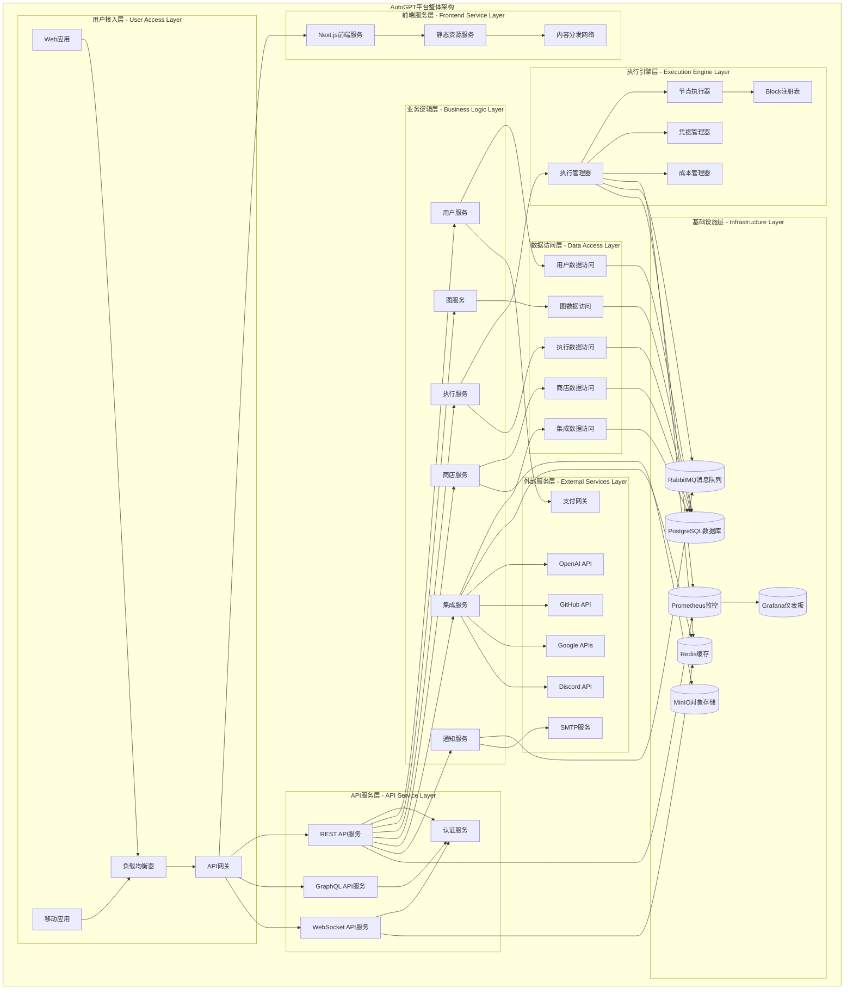

**图1-1: AutoGPT平台整体架构图**

此架构图展示了AutoGPT平台的完整技术架构，从用户接入到基础设施的全栈技术栈。各层之间通过标准化的接口进行通信，实现了高内聚、低耦合的架构设计。

### 1.3 架构分层详解

#### 1.3.1 用户接入层 (User Access Layer)

**职责**：处理用户请求的接入和分发

**核心组件**：
- **负载均衡器**：分发用户请求，实现高可用
- **API网关**：统一入口，处理认证、限流、路由
- **Web应用**：浏览器端用户界面
- **移动应用**：移动端用户界面

**关键特性**：
- 支持多种客户端类型
- 自动负载均衡和故障转移
- 统一的安全策略和访问控制
- 请求路由和协议转换

#### 1.3.2 前端服务层 (Frontend Service Layer)

**职责**：提供用户界面和静态资源服务

**核心组件**：
- **Next.js前端服务**：React-based的前端应用
- **静态资源服务**：CSS、JS、图片等静态文件
- **CDN**：全球内容分发网络

**关键特性**：
- 服务端渲染(SSR)和静态生成(SSG)
- 响应式设计，支持多设备
- 前端路由和状态管理
- 静态资源优化和缓存

#### 1.3.3 API服务层 (API Service Layer)

**职责**：提供标准化的API接口服务

**核心组件**：
- **REST API服务**：标准的RESTful API
- **GraphQL API服务**：灵活的查询API
- **WebSocket API服务**：实时通信API
- **认证服务**：用户认证和授权

**关键特性**：
- 多种API协议支持
- 统一的认证和授权机制
- API版本管理和向后兼容
- 请求验证和响应格式化

#### 1.3.4 业务逻辑层 (Business Logic Layer)

**职责**：实现核心业务逻辑和规则

**核心组件**：
- **用户服务**：用户管理和配置
- **图服务**：智能体图的CRUD操作
- **执行服务**：图执行的调度和管理
- **商店服务**：智能体商店功能
- **集成服务**：第三方服务集成
- **通知服务**：消息通知和推送

**关键特性**：
- 业务逻辑封装和复用
- 服务间通信和协调
- 事务管理和数据一致性
- 业务规则和策略配置

#### 1.3.5 执行引擎层 (Execution Engine Layer)

**职责**：智能体图的执行和调度

**核心组件**：
- **执行管理器**：执行任务的调度和管理
- **节点执行器**：单个节点的执行逻辑
- **Block注册表**：可用Block的注册和管理
- **凭据管理器**：执行时的凭据管理
- **成本管理器**：执行成本的计算和控制

**关键特性**：
- 分布式任务调度
- 并发执行和资源管理
- 错误处理和重试机制
- 成本控制和限额管理

#### 1.3.6 数据访问层 (Data Access Layer)

**职责**：数据持久化和访问抽象

**核心组件**：
- **各种DAO**：数据访问对象，封装数据库操作
- **ORM映射**：对象关系映射
- **缓存管理**：数据缓存和失效策略
- **连接池管理**：数据库连接的管理和优化

**关键特性**：
- 数据访问抽象和封装
- 缓存策略和性能优化
- 事务管理和数据一致性
- 数据库连接池和资源管理

#### 1.3.7 基础设施层 (Infrastructure Layer)

**职责**：提供基础的技术设施和服务

**核心组件**：
- **PostgreSQL**：主数据库，存储结构化数据
- **Redis**：缓存和会话存储
- **RabbitMQ**：消息队列和异步通信
- **MinIO**：对象存储，存储文件和媒体
- **Prometheus/Grafana**：监控和可视化

**关键特性**：
- 高可用和数据持久化
- 分布式缓存和会话管理
- 异步消息处理
- 文件存储和管理
- 全面的监控和告警

## 2. 核心模块交互关系

### 2.1 用户认证与授权流程

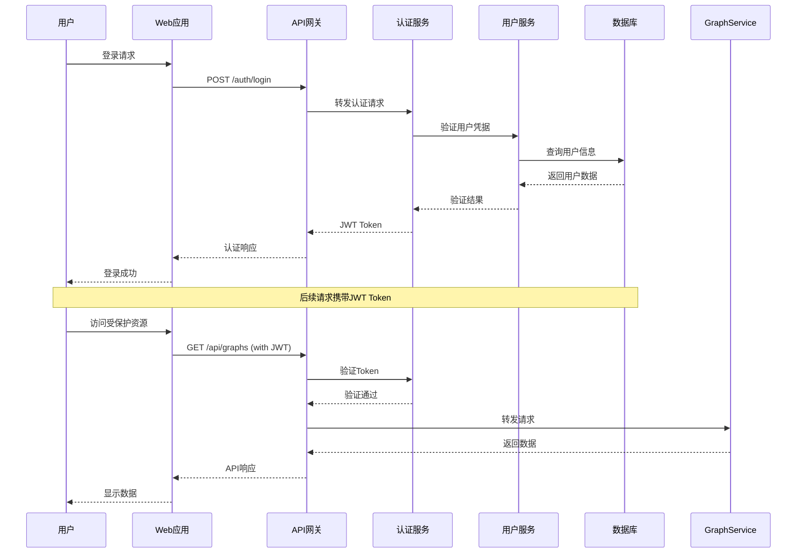

**图2-1: 用户认证与授权流程**

### 2.2 智能体图创建与执行流程

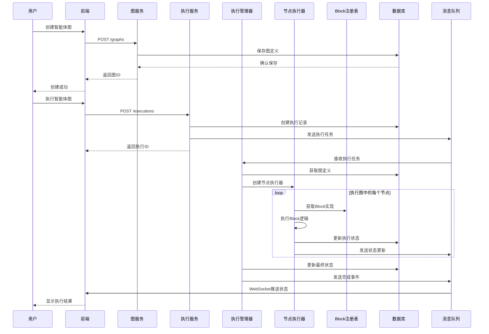

**图2-2: 智能体图创建与执行流程**

### 2.3 第三方服务集成流程

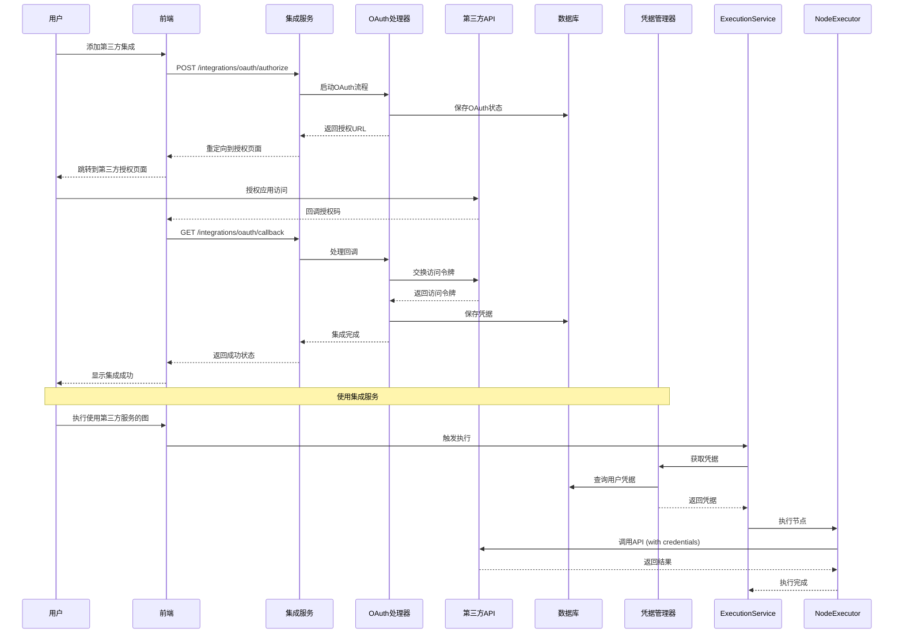

**图2-3: 第三方服务集成流程**

### 2.4 实时通信与状态同步

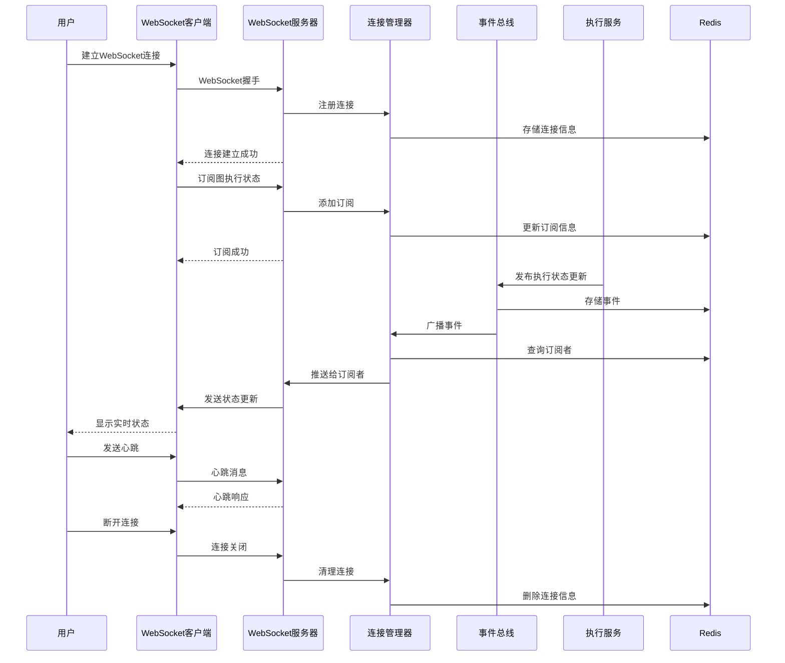

**图2-4: 实时通信与状态同步流程**

## 3. 数据流向分析

### 3.1 核心数据流向图

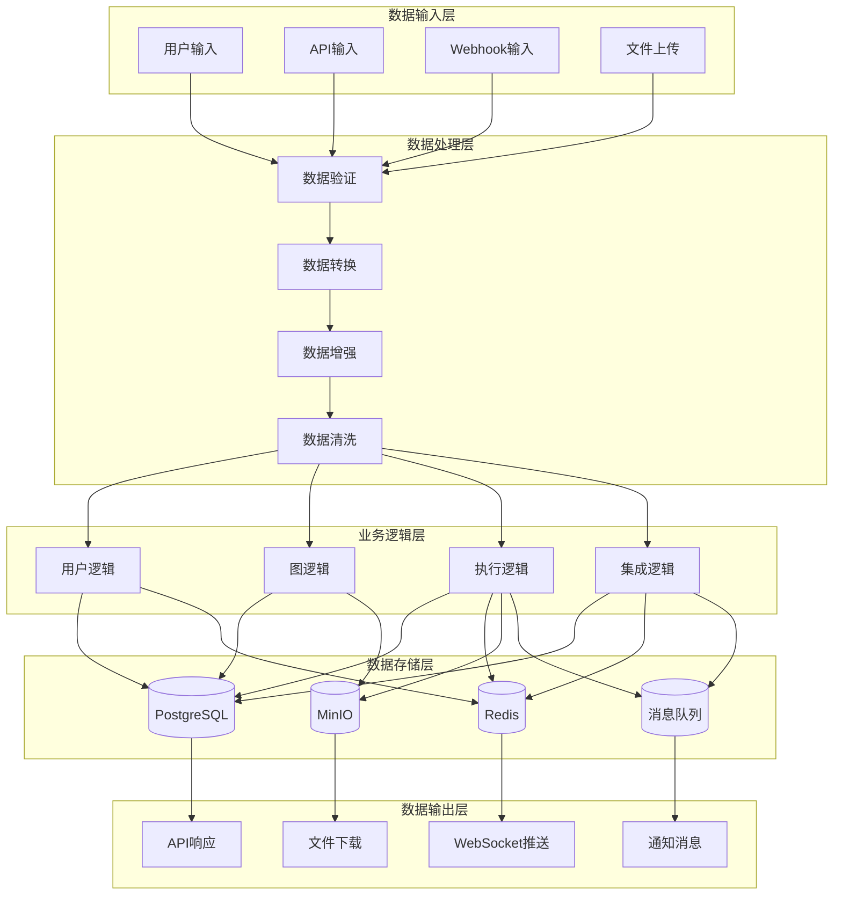

**图3-1: 核心数据流向图**

### 3.2 数据存储策略

#### 3.2.1 PostgreSQL - 主数据存储

**存储内容**：
- 用户账户和配置信息
- 智能体图定义和版本
- 执行记录和结果
- 商店内容和评价
- 集成配置和凭据

**特点**：
- ACID事务保证
- 复杂查询支持
- 数据一致性
- 备份和恢复

#### 3.2.2 Redis - 缓存和会话存储

**存储内容**：
- 用户会话信息
- API响应缓存
- 执行状态缓存
- 实时通信数据
- 分布式锁

**特点**：
- 高性能读写
- 数据过期机制
- 发布订阅功能
- 分布式锁支持

#### 3.2.3 MinIO - 对象存储

**存储内容**：
- 用户上传文件
- 图执行产生的文件
- 静态资源文件
- 备份文件

**特点**：
- S3兼容API
- 分布式存储
- 数据冗余
- 访问控制

#### 3.2.4 RabbitMQ - 消息队列

**消息类型**：
- 执行任务消息
- 状态更新事件
- 通知消息
- 系统事件

**特点**：
- 可靠消息传递
- 消息持久化
- 路由和过滤
- 死信队列

## 4. 服务通信机制

### 4.1 同步通信

#### 4.1.1 HTTP/REST API

**使用场景**：
- 用户界面交互
- 服务间直接调用
- 第三方API集成
- 管理操作

**特点**：
- 请求-响应模式
- 状态码标准化
- 缓存支持
- 幂等性保证

#### 4.1.2 GraphQL API

**使用场景**：
- 复杂数据查询
- 前端数据获取
- 移动应用优化
- 实时数据订阅

**特点**：
- 灵活查询语言
- 类型系统
- 实时订阅
- 单一端点

### 4.2 异步通信

#### 4.2.1 消息队列

**使用场景**：
- 任务异步处理
- 服务解耦
- 事件驱动架构
- 系统集成

**特点**：
- 异步处理
- 消息持久化
- 负载均衡
- 故障恢复

#### 4.2.2 WebSocket

**使用场景**：
- 实时状态更新
- 双向通信
- 推送通知
- 协作功能

**特点**：
- 全双工通信
- 低延迟
- 持久连接
- 事件驱动

### 4.3 服务发现与负载均衡

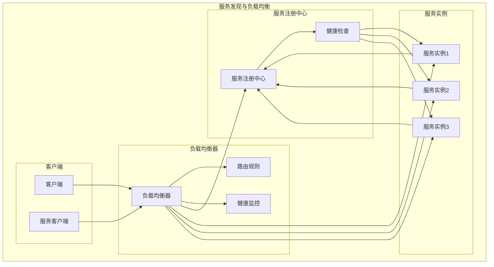

**图4-1: 服务发现与负载均衡架构**

## 5. 系统可扩展性设计

### 5.1 水平扩展策略

#### 5.1.1 无状态服务设计

**设计原则**：
- 服务实例无状态
- 状态外部化存储
- 会话数据集中管理
- 配置动态加载

**实现方式**：
- 将状态存储在Redis中
- 使用JWT进行无状态认证
- 配置中心统一管理
- 数据库连接池共享

#### 5.1.2 数据库分片策略

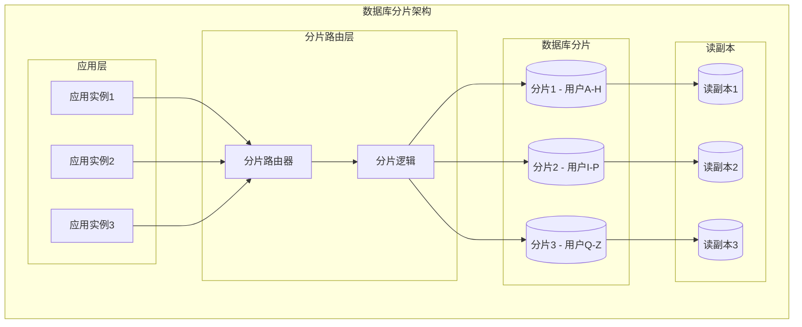

**图5-1: 数据库分片架构**

#### 5.1.3 缓存分层策略

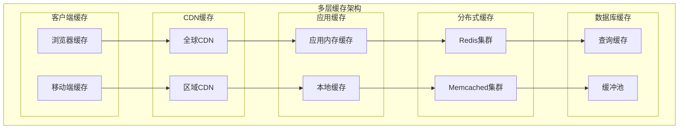

**图5-2: 多层缓存架构**

### 5.2 垂直扩展策略

#### 5.2.1 资源优化

**CPU优化**：
- 异步处理模式
- 连接池复用
- 算法优化
- 并发控制

**内存优化**：
- 对象池管理
- 内存泄漏检测
- 垃圾回收优化
- 缓存策略调优

**I/O优化**：
- 异步I/O操作
- 批量操作
- 连接复用
- 数据压缩

#### 5.2.2 性能监控

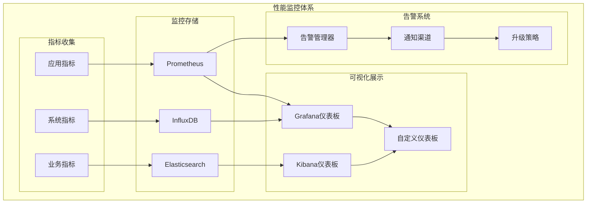

**图5-3: 性能监控体系**

## 6. 安全架构设计

### 6.1 多层安全防护

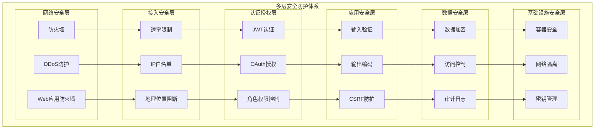

**图6-1: 多层安全防护体系**

### 6.2 数据安全与隐私保护

#### 6.2.1 数据加密策略

**传输加密**：
- TLS 1.3协议
- 证书管理
- 密钥轮换
- 完美前向保密

**存储加密**：
- 数据库透明加密
- 文件系统加密
- 密钥分离存储
- 加密算法选择

#### 6.2.2 隐私保护机制

**数据最小化**：
- 按需收集数据
- 数据生命周期管理
- 自动删除策略
- 匿名化处理

**访问控制**：
- 细粒度权限控制
- 数据访问审计
- 用户同意管理
- 数据导出功能

## 7. 容灾与高可用设计

### 7.1 高可用架构

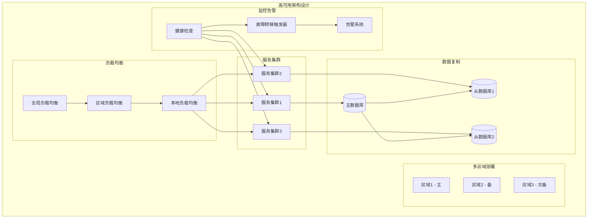

**图7-1: 高可用架构设计**

### 7.2 容灾恢复策略

#### 7.2.1 备份策略

**数据备份**：
- 全量备份 + 增量备份
- 跨区域备份复制
- 备份数据验证
- 恢复时间目标(RTO)

**配置备份**：
- 配置版本管理
- 环境配置同步
- 部署脚本备份
- 基础设施即代码

#### 7.2.2 故障恢复流程

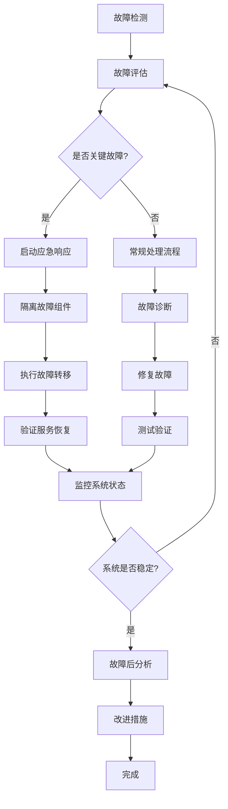

**图7-2: 故障恢复流程**

## 8. 部署与运维架构

### 8.1 容器化部署

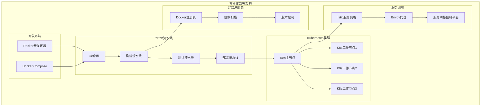

**图8-1: 容器化部署架构**

### 8.2 运维监控体系

#### 8.2.1 可观测性三支柱

**指标监控 (Metrics)**：
- 系统性能指标
- 业务指标监控
- 自定义指标收集
- 实时告警机制

**日志管理 (Logging)**：
- 结构化日志
- 集中日志收集
- 日志分析和搜索
- 日志保留策略

**链路追踪 (Tracing)**：
- 分布式链路追踪
- 性能瓶颈分析
- 服务依赖关系
- 错误定位分析

#### 8.2.2 自动化运维

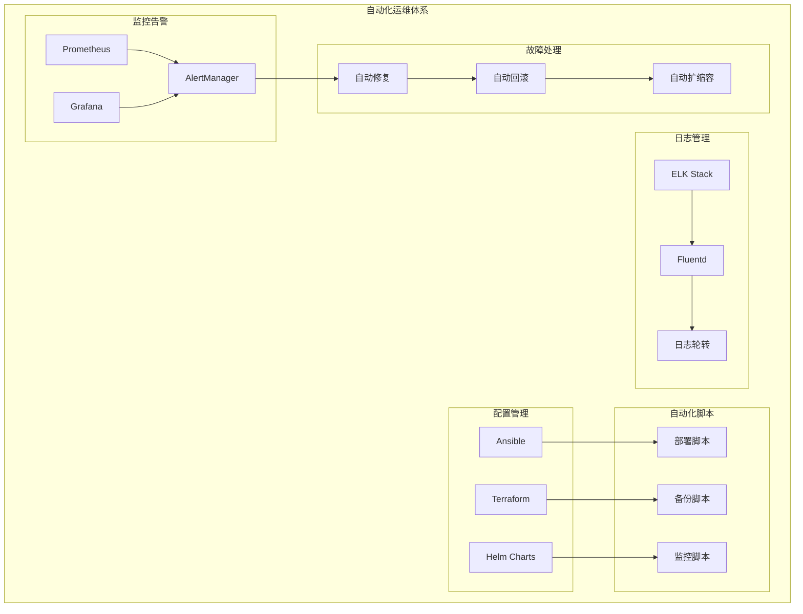

**图8-2: 自动化运维体系**

## 总结

AutoGPT平台通过精心设计的微服务架构和现代化的技术栈，实现了高可扩展、高可用、高性能的AI智能体开发和运行平台。核心架构优势包括：

1. **模块化设计**：清晰的分层架构和模块划分，便于开发和维护
2. **微服务架构**：服务独立部署和扩展，提高系统灵活性
3. **事件驱动**：异步消息处理，提高系统响应性和吞吐量
4. **多层缓存**：从客户端到数据库的全链路缓存优化
5. **安全防护**：多层安全防护体系，保障数据和系统安全
6. **高可用设计**：多区域部署和故障自动恢复机制
7. **容器化部署**：基于Kubernetes的云原生部署方案
8. **全面监控**：指标、日志、链路追踪的完整可观测性

通过这些架构设计和技术选型，AutoGPT平台为用户提供了稳定、可靠、高效的AI智能体开发和运行环境，支持平台的持续发展和规模化扩展。

---
