# Dify-00-总览

## 0. 摘要

### 项目目标与问题域

Dify 是一个开源的 LLM 应用开发平台，致力于简化大语言模型应用的构建流程。通过直观的界面，结合智能体(Agent)工作流、RAG(检索增强生成)管道、模型管理、可观测性等功能，帮助开发者快速从原型转向生产环境。

**核心能力边界：**
- 可视化工作流构建与编排
- 多模型提供商集成与管理
- 知识库构建与检索(RAG)
- 智能体(Agent)能力与工具调用
- 提示词工程与优化
- LLMOps 监控与分析
- Backend-as-a-Service API

**非目标：**
- 不提供自有 LLM 训练能力
- 不包含底层模型推理优化
- 不涉及硬件层面的性能调优

### 运行环境

**Backend (Python/Flask):**
- 语言：Python 3.11+
- 框架：Flask
- 依赖管理：uv
- 数据库：PostgreSQL
- 缓存：Redis
- 向量数据库：Weaviate/Qdrant/Milvus等
- 异步任务：Celery
- 架构模式：领域驱动设计(DDD) + 清洁架构

**Frontend (Next.js/TypeScript):**
- 语言：TypeScript
- 框架：Next.js 15 + React 19
- 包管理：pnpm
- 状态管理：Zustand
- UI组件：自研组件库
- 国际化：i18n

**部署形态：**
- Docker Compose 单机部署
- Kubernetes 集群部署
- 云服务托管部署(AWS/Azure/GCP)
- 支持微服务架构拆分

## 1. 整体架构图

```mermaid
flowchart TB
    subgraph "客户端层 Client Layer"
        WebUI[Web UI<br/>Next.js Frontend]
        API_Client[API Client<br/>SDK/HTTP]
    end

    subgraph "API网关层 Gateway Layer"
        Console_API[Console API<br/>/console/api]
        Service_API[Service API<br/>/v1]
        Web_API[Web API<br/>/api]
    end

    subgraph "应用服务层 Application Layer"
        AppRunner[App Runner<br/>应用运行器]
        WorkflowRunner[Workflow Runner<br/>工作流运行器]
        AgentRunner[Agent Runner<br/>智能体运行器]
        RAGPipeline[RAG Pipeline<br/>检索管道]
    end

    subgraph "核心领域层 Core Domain Layer"
        subgraph "Workflow引擎"
            GraphEngine[Graph Engine<br/>图引擎]
            NodeExecutor[Node Executor<br/>节点执行器]
            EventBus[Event Bus<br/>事件总线]
        end
        
        subgraph "RAG系统"
            Retrieval[Retrieval Service<br/>检索服务]
            Embedding[Embedding<br/>向量化]
            Rerank[Rerank<br/>重排序]
        end
        
        subgraph "Agent系统"
            CoT_Agent[CoT Agent<br/>思维链智能体]
            FC_Agent[Function Call Agent<br/>函数调用智能体]
            ToolEngine[Tool Engine<br/>工具引擎]
        end
        
        subgraph "模型运行时"
            ModelManager[Model Manager<br/>模型管理器]
            LLMInvoker[LLM Invoker<br/>模型调用器]
            ProviderRegistry[Provider Registry<br/>提供商注册表]
        end
    end

    subgraph "基础设施层 Infrastructure Layer"
        subgraph "数据存储"
            PostgreSQL[(PostgreSQL<br/>关系数据库)]
            VectorDB[(Vector DB<br/>向量数据库)]
            Redis[(Redis<br/>缓存&队列)]
        end
        
        subgraph "外部服务"
            LLM_Providers[LLM Providers<br/>OpenAI/Anthropic等]
            Storage[Storage<br/>文件存储]
            Monitoring[Monitoring<br/>可观测性]
        end
        
        subgraph "异步任务"
            Celery_Worker[Celery Worker<br/>异步工作进程]
            Celery_Beat[Celery Beat<br/>定时任务]
        end
    end

    WebUI --> Console_API
    WebUI --> Web_API
    API_Client --> Service_API
    
    Console_API --> AppRunner
    Service_API --> AppRunner
    Web_API --> AppRunner
    
    AppRunner --> WorkflowRunner
    AppRunner --> AgentRunner
    AppRunner --> RAGPipeline
    
    WorkflowRunner --> GraphEngine
    GraphEngine --> NodeExecutor
    NodeExecutor --> EventBus
    
    AgentRunner --> CoT_Agent
    AgentRunner --> FC_Agent
    CoT_Agent --> ToolEngine
    FC_Agent --> ToolEngine
    
    RAGPipeline --> Retrieval
    Retrieval --> Embedding
    Retrieval --> Rerank
    
    NodeExecutor --> LLMInvoker
    ToolEngine --> LLMInvoker
    LLMInvoker --> ModelManager
    ModelManager --> ProviderRegistry
    
    ProviderRegistry -.调用.-> LLM_Providers
    
    GraphEngine --> PostgreSQL
    Retrieval --> VectorDB
    NodeExecutor --> Redis
    
    AppRunner --> Celery_Worker
    Celery_Worker --> Celery_Beat
    
    NodeExecutor --> Storage
    GraphEngine --> Monitoring
```



### 图解与要点

**分层职责：**

1. **客户端层**：提供用户交互界面，包括管理控制台和终端用户应用
2. **API网关层**：三套API系统，分别服务于不同场景
   - Console API：管理控制台使用，包含应用配置、数据集管理等
   - Service API：对外服务API，供第三方应用调用
   - Web API：Web应用公共API，处理聊天、文件上传等
3. **应用服务层**：应用运行编排层，根据应用类型分发到不同的运行器
4. **核心领域层**：业务逻辑核心，包含四大子系统
   - Workflow引擎：基于队列的分布式工作流执行系统
   - RAG系统：文档检索与知识增强
   - Agent系统：智能体任务规划与工具调用
   - 模型运行时：统一的模型调用抽象层
5. **基础设施层**：底层资源与外部依赖

**数据流与控制流：**

- **同步调用**：API → App Runner → Core Domain（用于快速响应场景）
- **异步调用**：通过 Celery 处理耗时任务（数据集处理、批量操作）
- **事件驱动**：Workflow 引擎内部使用事件总线进行节点间通信
- **流式响应**：LLM 调用支持 Server-Sent Events (SSE) 流式输出

**跨进程/线程/协程路径：**

- **Gunicorn/Flask**：多进程模式处理 HTTP 请求 (gevent worker)
- **Celery Worker**：独立进程池处理异步任务
- **Graph Engine**：WorkerPool 动态扩缩容处理并发节点执行
- **前端**：Next.js SSR + CSR 混合渲染

**高可用与扩展性：**

- **无状态设计**：API 服务可水平扩展
- **状态持久化**：Workflow 状态存储在 PostgreSQL，支持暂停/恢复
- **缓存策略**：Redis 缓存模型配置、提示词模板等热数据
- **队列解耦**：Celery 队列按业务类型分组 (dataset, generation, workflow_storage等)

**状态管理位置：**

- **会话状态**：Redis (用户 session、临时数据)
- **持久化状态**：PostgreSQL (应用配置、对话历史、数据集元数据)
- **向量数据**：VectorDB (文档向量、Embedding)
- **工作流运行时状态**：PostgreSQL + Redis (支持断点续传)

## 2. 全局时序图（主要业务闭环）

### 场景一：对话型应用完整调用链路


**图解与要点：**

- **入口**：Web API `/api/chat-messages` 端点
- **鉴权**：通过 JWT token 或 API key 验证身份
- **幂等性**：Message ID 保证消息不重复处理
- **回退策略**：
  - LLM 调用失败：重试 3 次，指数退避
  - 工具调用失败：记录错误，继续下一轮迭代
  - 超时处理：单次 LLM 调用 200s 超时
- **重试点**：仅在 LLM 调用层重试，工具调用失败不重试
- **超时设定**：
  - API 请求：200s (Gunicorn timeout)
  - LLM 单次调用：120s
  - 工具调用：30s per tool
- **资源上界**：
  - Agent 最大迭代次数：10次（可配置）
  - 单次对话历史：最近20轮
  - Token 限制：根据模型 context window 动态计算

### 场景二：Workflow 工作流执行链路


**图解与要点：**

- **入口**：Console API `/console/api/workflows/{id}/run`
- **鉴权**：Account token + 工作区权限验证
- **幂等性**：WorkflowRun ID 作为幂等键，相同请求返回已有运行
- **回退策略**：
  - 节点失败：根据配置决定继续或终止
  - 保存检查点：每个节点执行后保存状态
  - 断点续传：从最后成功节点恢复
- **重试点**：
  - 节点级别：支持配置重试次数和策略
  - 网络请求：HTTP节点自动重试
- **超时设定**：
  - 整体工作流：无限制（可外部停止）
  - 单节点执行：60s 默认超时（可配置）
  - Worker空闲超时：5s后回收
- **性能要点**：
  - 并行执行：无依赖节点自动并行
  - Worker动态扩缩容：根据队列长度自动调整
  - 事件流式输出：SSE实时推送执行状态

## 3. 模块边界与交互图

### 模块清单

**Backend 核心模块 (api/core/)：**

| 模块 | 路径 | 对外API | 职责 |
|------|------|---------|------|
| Workflow 工作流引擎 | `core/workflow/` | WorkflowEntry, GraphEngine | 图引擎、节点编排、状态管理 |
| RAG 检索增强生成 | `core/rag/` | RetrievalService, DatasetRetrieval | 文档索引、向量检索、重排序 |
| Agent 智能体系统 | `core/agent/` | CotAgentRunner, FcAgentRunner | 任务规划、工具调用、思维链 |
| Tools 工具系统 | `core/tools/` | ToolEngine, ToolManager | 工具注册、参数校验、执行 |
| App 应用核心 | `core/app/` | WorkflowAppRunner, AgentChatAppRunner | 应用编排、会话管理 |
| Model Runtime 模型运行时 | `core/model_runtime/` | ModelInstance, ModelManager | 模型抽象、提供商适配 |
| Plugin 插件系统 | `core/plugin/` | PluginManager, PluginInvoker | 插件加载、反向调用 |
| MCP 协议支持 | `core/mcp/` | MCPClient, MCPServer | Model Context Protocol |
| Datasource 数据源 | `core/datasource/` | DatasourceManager | 多源数据接入 |
| Ops 可观测性 | `core/ops/` | TraceManager | Langfuse/LangSmith 追踪 |

**Backend 控制器模块 (api/controllers/)：**

| 模块 | 路径 | API前缀 | 职责 |
|------|------|---------|------|
| Console API | `controllers/console/` | `/console/api` | 管理控制台API |
| Service API | `controllers/service_api/` | `/v1` | 对外服务API |
| Web API | `controllers/web/` | `/api` | Web应用API |
| File API | `controllers/files/` | `/files` | 文件上传下载 |
| MCP API | `controllers/mcp/` | `/mcp` | MCP协议端点 |

**Frontend 核心模块 (web/)：**

| 模块 | 路径 | 职责 |
|------|------|------|
| App Pages | `app/` | Next.js 页面路由 |
| Components | `app/components/` | React 组件库 |
| Workflow Editor | `app/components/workflow/` | 工作流可视化编辑器 |
| Dataset Manager | `app/components/datasets/` | 数据集管理界面 |
| Service Layer | `service/` | API 调用封装 |
| Context | `context/` | React Context 状态管理 |
| Hooks | `hooks/` | 自定义 React Hooks |
| i18n | `i18n/` | 国际化资源 |

### 模块交互矩阵

| 调用方 ↓ 被调方 → | Workflow | RAG | Agent | Tools | Model Runtime | App | Plugin |
|------------------|----------|-----|-------|-------|---------------|-----|--------|
| **App Runner** | 直接调用 | 直接调用 | 直接调用 | - | 间接调用 | - | - |
| **Workflow** | - | 通过节点调用 | 通过节点调用 | 通过节点调用 | 间接调用 | - | 通过节点调用 |
| **Agent** | - | 工具形式 | - | 直接调用 | 直接调用 | - | - |
| **RAG** | - | - | - | - | 调用Embedding模型 | - | - |
| **Tools** | - | - | - | - | 部分工具调用LLM | - | 可能调用 |
| **Console API** | 间接调用 | 直接调用 | 间接调用 | 直接调用 | 直接调用 | 直接调用 | 直接调用 |

**交互说明：**

- **同步调用**：Console API → Services → Core Domain (HTTP请求-响应)
- **异步消息**：通过 Celery 队列处理耗时任务（数据集索引、批量导入）
- **共享存储**：所有模块共享 PostgreSQL 数据库和 Redis 缓存
- **订阅/发布**：Workflow 引擎内部使用事件总线，外部通过 SSE 推送

## 4. 关键设计与权衡

### 数据一致性

**强一致性场景：**
- 应用配置修改：使用数据库事务保证
- 对话消息创建：单表原子写入
- 工作流运行状态：悲观锁防止并发修改

**最终一致性场景：**
- 数据集文档索引：异步任务处理，允许延迟
- 缓存失效：Redis TTL + 主动失效策略
- 统计数据：通过定时任务聚合，容忍滞后

**事务边界：**
- 单个 HTTP 请求内操作：数据库事务
- 跨请求操作：通过幂等性+状态机保证
- 分布式事务：避免使用，改用补偿机制

### 并发策略

**锁机制：**
- **悲观锁**：Workflow 运行状态更新 (`SELECT ... FOR UPDATE`)
- **乐观锁**：应用配置更新（基于 version 字段）
- **分布式锁**：Redis 锁保护资源配额检查

**并发控制：**
- Gunicorn worker 数量：CPU 核数 * 2 + 1
- Celery worker 并发：gevent pool, 可配置
- Graph Engine Worker Pool：动态扩缩容 (1-10 workers)

### 性能关键路径

**P95 延迟优化：**
- LLM 调用：流式输出，TTFT (Time To First Token) < 2s
- 向量检索：ANN 算法，100ms 内返回
- 数据库查询：索引优化，单查询 < 50ms

**内存峰值：**
- 单个 Workflow 运行：< 500MB
- 向量批量导入：分批处理，单批 < 1000 条
- 模型响应缓存：LRU，最大 1GB

**I/O 热点：**
- Vector DB 查询：通过 connection pool 复用连接
- Redis 访问：Pipeline 批量操作
- 文件上传：直接传至对象存储，不经过应用服务器

### 可观测性指标

**应用级指标：**
- QPS：按 API 端点统计
- P50/P95/P99 延迟：按端点和操作类型
- 错误率：4xx/5xx 分类统计
- Token 消耗：按应用/用户/模型维度

**业务级指标：**
- Workflow 成功率：总运行/成功运行
- Agent 迭代次数分布：优化提示词参考
- RAG 检索相关性：人工标注+自动评估
- 模型调用成本：Token 计费统计

### 配置项与可变参数

**影响行为的关键配置：**

```python
# Workflow 引擎
WORKFLOW_CALL_MAX_DEPTH = 5  # 嵌套工作流最大深度
WORKFLOW_NODE_EXECUTION_MAX_TIMEOUT = 300  # 节点执行超时

# RAG 检索
RETRIEVAL_SERVICE_EXECUTORS = 3  # 并行检索线程数
INDEXING_MAX_SEGMENTATION_TOKENS_LENGTH = 1000  # 分段最大token数

# Agent
MAX_AGENT_ITERATION = 10  # Agent 最大迭代次数

# Celery
CELERY_WORKER_AMOUNT = 1  # Worker 数量
CELERY_MAX_WORKERS = 4  # 自动扩容上限
```

## 5. 典型使用示例与最佳实践

### 示例 1：最小可运行入口 - 创建简单聊天应用

**场景：**创建一个基础的对话型应用，接入 OpenAI GPT-4。

**步骤：**

```python
# 1. 创建应用 (通过 Console API)
POST /console/api/apps
{
    "name": "My Chat App",
    "mode": "agent-chat",  # agent-chat / chat / workflow
    "description": "A simple chatbot"
}

# 2. 配置模型
POST /console/api/apps/{app_id}/model-config
{
    "provider": "openai",
    "model": "gpt-4",
    "parameters": {
        "temperature": 0.7,
        "max_tokens": 2000
    }
}

# 3. 配置提示词
POST /console/api/apps/{app_id}/model-config
{
    "prompt_template": {
        "simple_prompt_template": "You are a helpful assistant. {query}"
    }
}

# 4. 发布应用
POST /console/api/apps/{app_id}/publish

# 5. 调用应用 (Service API)
POST /v1/chat-messages
Headers:
    Authorization: Bearer {API_KEY}
Body:
{
    "inputs": {},
    "query": "Hello, how are you?",
    "response_mode": "streaming",  # streaming / blocking
    "user": "user-123"
}
```

**返回示例（流式）：**

```
event: message
data: {"event": "message", "message_id": "msg-xxx", "conversation_id": "conv-xxx", "answer": "Hello"}

event: message
data: {"event": "message", "message_id": "msg-xxx", "answer": "!"}

event: message_end
data: {"event": "message_end", "metadata": {"usage": {"prompt_tokens": 20, "completion_tokens": 10}}}
```

**最佳实践：**
- 使用流式模式 (`streaming`) 提升用户体验
- 设置合理的 `temperature`：创意任务 0.7-0.9，事实性任务 0.1-0.3
- 启用 `conversation_id` 保持多轮对话上下文
- 监控 token 消耗，设置用户配额

### 示例 2：构建 RAG 知识库应用

**场景：**上传文档构建知识库，实现企业文档问答。

**步骤：**

```python
# 1. 创建知识库
POST /console/api/datasets
{
    "name": "Company Docs",
    "indexing_technique": "high_quality"  # high_quality / economy
}

# 2. 上传文档
POST /console/api/datasets/{dataset_id}/document/create_by_file
Headers:
    Content-Type: multipart/form-data
Body:
    file: <PDF文件>
    data: {
        "indexing_technique": "high_quality",
        "process_rule": {
            "mode": "automatic",
            "rules": {
                "segmentation": {
                    "max_tokens": 500,
                    "separator": "\n"
                }
            }
        }
    }

# 3. 等待索引完成 (异步)
GET /console/api/datasets/{dataset_id}/documents/{document_id}/indexing-status

# 4. 创建应用并关联知识库
POST /console/api/apps
{
    "name": "Doc QA App",
    "mode": "chat",
    "dataset_configs": {
        "retrieval_model": "multiple",  # single / multiple
        "datasets": {
            "datasets": [
                {"id": "{dataset_id}"}
            ]
        },
        "top_k": 3,
        "score_threshold": 0.7,
        "reranking_model": {
            "provider": "cohere",
            "model": "rerank-english-v2.0"
        }
    }
}

# 5. 测试检索
POST /console/api/datasets/{dataset_id}/hit-testing
{
    "query": "What is the company policy?",
    "retrieval_model": "hybrid",  # vector / full_text / hybrid
    "top_k": 5
}
```

**关键参数说明：**

| 参数 | 说明 | 推荐值 |
|------|------|--------|
| `indexing_technique` | 索引策略 | `high_quality`（使用向量） |
| `max_tokens` | 分段最大token数 | 500-1000 |
| `top_k` | 检索返回数量 | 3-5 |
| `score_threshold` | 相关性阈值 | 0.7 (高精度) / 0.5 (高召回) |
| `reranking_model` | 重排序模型 | cohere/jina |

**最佳实践：**
- 使用 `hybrid` 混合检索提升召回率
- 启用 reranking 提升精确度
- 定期评估检索效果，调整 `score_threshold`
- 文档预处理：清洗、分段、元数据标注

### 示例 3：Workflow 工作流编排

**场景：**构建一个多步骤工作流：接收用户输入 → 知识库检索 → LLM 生成 → 代码执行 → 返回结果。

**工作流 DSL 示例：**

```yaml
graph:
  nodes:
    - id: start
      type: start
      data:
        title: 开始
        variables:
          - variable: query
            type: string
            label: 用户问题
    
    - id: knowledge_retrieval
      type: knowledge-retrieval
      data:
        title: 知识库检索
        dataset_ids: ["dataset-xxx"]
        query_variable_selector: ["start", "query"]
        retrieval_mode: multiple
        top_k: 3
    
    - id: llm
      type: llm
      data:
        title: LLM 生成代码
        model:
          provider: openai
          name: gpt-4
          mode: chat
        prompt_template:
          - role: system
            text: "You are a code generator."
          - role: user
            text: "Based on: {{#knowledge_retrieval.result#}}\nQuestion: {{#start.query#}}\nGenerate Python code."
    
    - id: code
      type: code
      data:
        title: 执行代码
        code_language: python3
        code: "{{#llm.text#}}"
        variables:
          - variable: input_data
            value_selector: ["start", "query"]
    
    - id: end
      type: end
      data:
        outputs:
          - variable: result
            value_selector: ["code", "result"]
  
  edges:
    - source: start
      target: knowledge_retrieval
    - source: knowledge_retrieval
      target: llm
    - source: llm
      target: code
    - source: code
      target: end
```

**执行工作流：**

```python
POST /console/api/workflows/{workflow_id}/run
{
    "inputs": {
        "query": "Calculate factorial of 5"
    },
    "response_mode": "streaming"
}
```

**最佳实践：**
- 使用变量选择器 `{{#node_id.field#}}` 引用上游节点输出
- 合理设置节点超时，避免长时间挂起
- 代码节点启用沙箱，限制资源使用
- 使用条件分支节点实现复杂逻辑
- 迭代节点处理批量数据

### 示例 4：Agent 工具调用

**场景：**创建一个 Agent 应用，集成搜索、天气、计算器工具。

**配置 Agent：**

```python
POST /console/api/apps
{
    "name": "Multi-Tool Agent",
    "mode": "agent-chat",
    "agent_mode": "function_call",  # function_call / chain_of_thought
    "agent_config": {
        "max_iteration": 5,
        "tools": [
            {
                "provider_type": "builtin",
                "provider_id": "google",
                "tool_name": "google_search",
                "tool_parameters": {
                    "query": "",
                    "result_type": "link"
                }
            },
            {
                "provider_type": "builtin",
                "provider_id": "wolframalpha",
                "tool_name": "calculate"
            },
            {
                "provider_type": "api",
                "provider_id": "custom_api",
                "tool_name": "get_weather",
                "tool_parameters": {}
            }
        ],
        "strategy": {
            "enabled": true
        }
    }
}
```

**工具调用示例对话：**

```
User: "What's the weather in San Francisco and how much is 25% tip on $80?"

Agent 迭代过程:
1. Thought: Need to get weather and calculate tip
2. Action: call get_weather(city="San Francisco")
   Observation: "Sunny, 72°F"
3. Action: call calculate(expression="80 * 0.25")
   Observation: "20"
4. Final Answer: "The weather in San Francisco is sunny and 72°F. 
   The 25% tip on $80 is $20."
```

**最佳实践：**
- 选择合适的 Agent 模式：
  - `function_call`：支持并行工具调用，适合明确任务
  - `chain_of_thought`：支持复杂推理，适合开放式任务
- 限制 `max_iteration` 防止无限循环
- 提供清晰的工具描述和参数说明
- 监控工具调用成功率和延迟

### 示例 5：规模化部署注意事项

**生产环境配置清单：**

**1. 数据库优化：**
```bash
# PostgreSQL 配置
max_connections = 200
shared_buffers = 4GB
effective_cache_size = 12GB
work_mem = 16MB
maintenance_work_mem = 1GB
```

**2. Redis 配置：**
```bash
maxmemory 4gb
maxmemory-policy allkeys-lru
```

**3. 向量数据库：**
- 选择：Qdrant/Weaviate/Pgvector
- 分片策略：按 tenant 分片
- 副本数：3 (高可用)

**4. 应用服务器：**
```bash
# Gunicorn
workers = (CPU_CORES * 2) + 1
worker_class = gevent
worker_connections = 1000
timeout = 200
```

**5. Celery Worker：**
```bash
# 按队列类型分组部署
celery -A celery_entrypoint worker -Q dataset -c 2
celery -A celery_entrypoint worker -Q generation -c 4
```

**6. 监控指标：**
- APM：接入 Langfuse / LangSmith
- Metrics：Prometheus + Grafana
- Logging：ELK Stack
- Tracing：OpenTelemetry

**7. 安全加固：**
- 启用 HTTPS
- API Rate Limiting
- JWT token 过期时间：1小时
- Refresh token 过期时间：30天
- SSRF 防护：代理所有外部请求

**8. 备份策略：**
- PostgreSQL：每日全量 + WAL 归档
- 向量数据库：快照备份
- 文件存储：对象存储自动备份

**扩容策略：**

| 瓶颈 | 扩容方案 |
|------|----------|
| API 请求量大 | 增加 Gunicorn worker 实例 |
| LLM 调用慢 | 启用流式输出 + 缓存 |
| 向量检索慢 | 增加 Vector DB 节点 |
| 异步任务积压 | 增加 Celery worker |

**成本优化：**
- 使用 Embedding 缓存减少重复计算
- 小模型 + Reranking 代替大模型
- Token 使用监控与配额管理
- 按需启用功能（关闭不用的插件）

---

**下一步：**

本总览文档提供了 Dify 平台的整体架构视图。具体各模块的详细剖析见：

- [Dify-01-Workflow工作流引擎-概览](./Dify-01-Workflow工作流引擎-概览.md)
- [Dify-02-RAG检索增强生成-概览](./Dify-02-RAG检索增强生成-概览.md)
- [Dify-03-Agent智能体系统-概览](./Dify-03-Agent智能体系统-概览.md)
- [Dify-04-Tools工具系统-概览](./Dify-04-Tools工具系统-概览.md)
- [Dify-05-ModelRuntime模型运行时-概览](./Dify-05-ModelRuntime模型运行时-概览.md)
- [Dify-06-App应用核心-概览](./Dify-06-App应用核心-概览.md)
- [Dify-07-Plugin插件系统-概览](./Dify-07-Plugin插件系统-概览.md)
- [Dify-08-Frontend前端架构-概览](./Dify-08-Frontend前端架构-概览.md)
- [Dify-09-API接口层-概览](./Dify-09-API接口层-概览.md)
- [Dify-10-基础设施层-概览](./Dify-10-基础设施层-概览.md)

