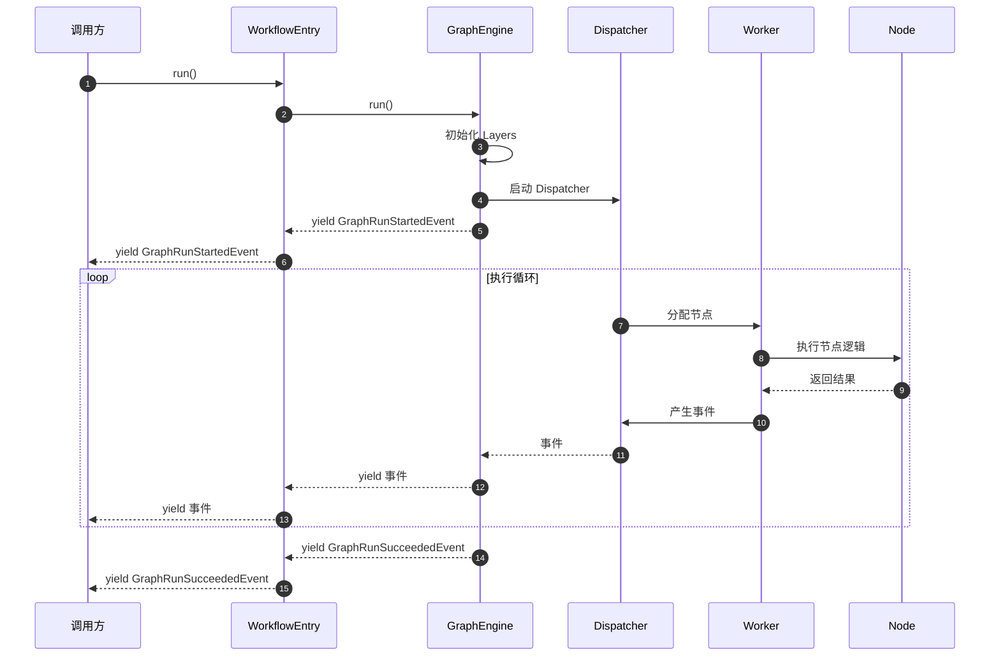
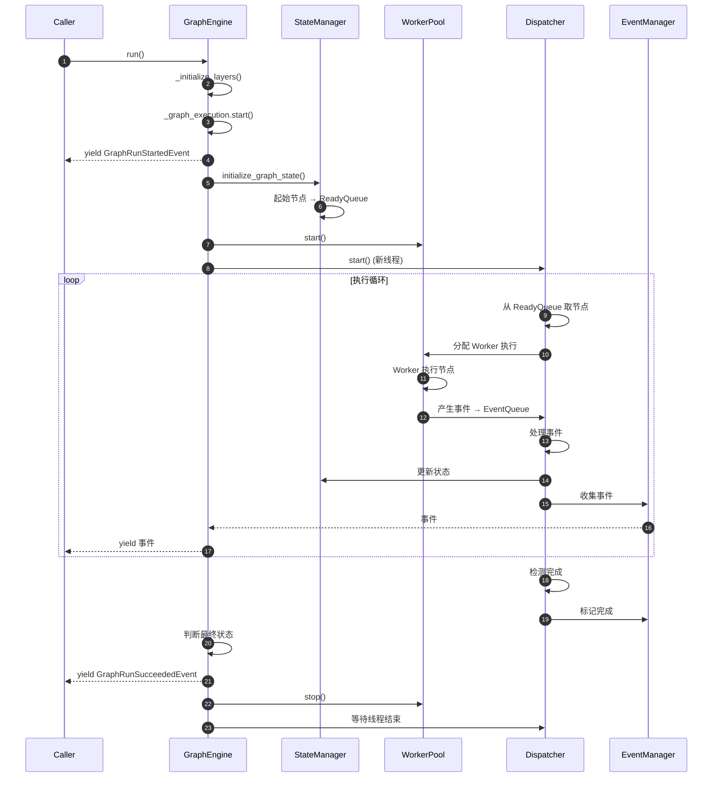

# Dify-01-Workflow工作流引擎-API

本文档详细描述 Workflow 工作流引擎对外提供的核心 API，包括接口签名、参数说明、使用示例、调用链路和最佳实践。

## API 概览

Workflow 模块对外提供的核心 API：

| API 类/方法 | 用途 | 调用方 |
|------------|------|--------|
| `WorkflowEntry.__init__()` | 创建工作流入口 | WorkflowAppRunner |
| `WorkflowEntry.run()` | 执行工作流 | WorkflowAppRunner |
| `WorkflowEntry.single_step_run()` | 单节点调试执行 | Console API |
| `GraphEngine.__init__()` | 创建图引擎实例 | WorkflowEntry |
| `GraphEngine.run()` | 运行图引擎 | WorkflowEntry |
| `GraphEngine.layer()` | 添加扩展层 | WorkflowEntry |
| `Graph.add_node()` | 添加节点到图 | Graph 构建器 |
| `Graph.add_edge()` | 添加边到图 | Graph 构建器 |
| `VariablePool.add()` | 添加变量 | 节点执行器 |
| `VariablePool.get()` | 获取变量 | 节点执行器 |

---

## API 详细规格

### 1. WorkflowEntry

#### 1.1 `WorkflowEntry.__init__()`

**基本信息**

- **名称**：`WorkflowEntry.__init__()`
- **用途**：创建工作流入口实例，初始化 GraphEngine 和相关上下文
- **调用场景**：工作流应用启动时、工作流调试时

**请求结构体**

```python
def __init__(
    self,
    tenant_id: str,              # 租户 ID
    app_id: str,                 # 应用 ID
    workflow_id: str,            # 工作流 ID
    graph_config: Mapping[str, Any],  # 图配置（节点+边）
    graph: Graph,                # Graph 对象实例
    user_id: str,                # 用户 ID
    user_from: UserFrom,         # 用户来源（Account/EndUser）
    invoke_from: InvokeFrom,     # 调用来源（Service/Debugger/WebApp等）
    call_depth: int,             # 嵌套调用深度
    variable_pool: VariablePool, # 变量池
    graph_runtime_state: GraphRuntimeState,  # 运行时状态
    command_channel: CommandChannel | None = None,  # 命令通道（可选）
) -> None:
```

**参数表**

| 参数 | 类型 | 必填 | 默认值 | 约束/说明 |
|------|------|------|--------|----------|
| `tenant_id` | str | 是 | - | 租户标识符，用于多租户隔离 |
| `app_id` | str | 是 | - | 应用标识符 |
| `workflow_id` | str | 是 | - | 工作流标识符 |
| `graph_config` | Mapping | 是 | - | 图的 JSON 配置，包含 nodes 和 edges |
| `graph` | Graph | 是 | - | 已构建的 Graph 实例 |
| `user_id` | str | 是 | - | 执行用户 ID |
| `user_from` | UserFrom | 是 | - | ACCOUNT 或 END_USER |
| `invoke_from` | InvokeFrom | 是 | - | SERVICE / DEBUGGER / WEB_APP 等 |
| `call_depth` | int | 是 | - | 当前嵌套深度，最大值受 `WORKFLOW_CALL_MAX_DEPTH` 限制（默认5） |
| `variable_pool` | VariablePool | 是 | - | 预填充的变量池 |
| `graph_runtime_state` | GraphRuntimeState | 是 | - | 运行时状态容器 |
| `command_channel` | CommandChannel | 否 | InMemoryChannel | 外部控制通道，分布式场景使用 RedisChannel |

**返回值**

无（构造函数）

**核心代码**

```python
class WorkflowEntry:
    def __init__(
        self,
        tenant_id: str,
        app_id: str,
        workflow_id: str,
        graph_config: Mapping[str, Any],
        graph: Graph,
        user_id: str,
        user_from: UserFrom,
        invoke_from: InvokeFrom,
        call_depth: int,
        variable_pool: VariablePool,
        graph_runtime_state: GraphRuntimeState,
        command_channel: CommandChannel | None = None,
    ) -> None:
        # 1. 校验调用深度，防止无限递归
        workflow_call_max_depth = dify_config.WORKFLOW_CALL_MAX_DEPTH
        if call_depth > workflow_call_max_depth:
            raise ValueError(f"Max workflow call depth {workflow_call_max_depth} reached.")

        # 2. 初始化命令通道（默认内存通道）
        if command_channel is None:
            command_channel = InMemoryChannel()

        self.command_channel = command_channel
        
        # 3. 创建 GraphEngine 核心引擎
        self.graph_engine = GraphEngine(
            workflow_id=workflow_id,
            graph=graph,
            graph_runtime_state=graph_runtime_state,
            command_channel=command_channel,
        )

        # 4. 添加调试日志层（开发模式）
        if dify_config.DEBUG:
            debug_layer = DebugLoggingLayer(
                level="DEBUG",
                include_inputs=True,
                include_outputs=True,
                include_process_data=False,
                logger_name=f"GraphEngine.Debug.{workflow_id[:8]}",
            )
            self.graph_engine.layer(debug_layer)

        # 5. 添加执行限制层（防止无限执行）
        limits_layer = ExecutionLimitsLayer(
            max_steps=dify_config.WORKFLOW_MAX_EXECUTION_STEPS,
            max_time=dify_config.WORKFLOW_MAX_EXECUTION_TIME,
        )
        self.graph_engine.layer(limits_layer)
```

**代码说明：**

1. **调用深度校验**：
   - 防止嵌套工作流无限递归
   - 每次调用子工作流时 `call_depth + 1`
   - 超过限制抛出 `ValueError`

2. **命令通道初始化**：
   - 默认使用 `InMemoryChannel`（单进程内存通道）
   - 分布式场景传入 `RedisChannel`（跨进程通信）

3. **GraphEngine 创建**：
   - 传入核心依赖：graph、state、command_channel
   - GraphEngine 内部初始化所有子系统

4. **添加扩展层**：
   - `DebugLoggingLayer`：记录每个节点的输入/输出（仅 DEBUG 模式）
   - `ExecutionLimitsLayer`：限制最大步数和执行时间，防止死循环

**异常处理**

| 异常类型 | 触发条件 | 处理建议 |
|---------|---------|---------|
| `ValueError` | `call_depth` 超过限制 | 检查工作流嵌套层级，避免循环调用 |
| `TypeError` | 参数类型错误 | 检查参数类型是否符合签名 |

**最佳实践**

1. **命令通道选择**：
   - 单机部署：使用默认 `InMemoryChannel`
   - 分布式部署：使用 `RedisChannel` 支持跨进程停止

2. **调用深度管理**：
   - 记录每次调用的 `call_depth`
   - 在子工作流调用时传递 `parent_depth + 1`

3. **变量池预填充**：
   - 在创建 `WorkflowEntry` 前，预先填充用户输入变量
   - 使用 `variable_pool.add(('start', 'var_name'), value)`

---

#### 1.2 `WorkflowEntry.run()`

**基本信息**

- **名称**：`WorkflowEntry.run()`
- **用途**：启动工作流执行，流式输出执行事件
- **调用场景**：应用运行时调用

**方法签名**

```python
def run(self) -> Generator[GraphEngineEvent, None, None]:
    """运行工作流，生成器返回事件流"""
    ...
```

**返回值**

`Generator[GraphEngineEvent, None, None]`：生成器，逐个产出事件

**事件类型：**

| 事件类 | 说明 | 包含信息 |
|--------|------|---------|
| `GraphRunStartedEvent` | 工作流开始 | 开始时间 |
| `GraphNodeRunStartedEvent` | 节点开始执行 | node_id, node_type, inputs |
| `GraphNodeRunSucceededEvent` | 节点成功完成 | node_id, outputs, elapsed_time |
| `GraphNodeRunFailedEvent` | 节点执行失败 | node_id, error |
| `GraphRunSucceededEvent` | 工作流成功完成 | outputs |
| `GraphRunFailedEvent` | 工作流失败 | error, exceptions_count |
| `GraphRunAbortedEvent` | 工作流中断 | reason |
| `GraphRunPartialSucceededEvent` | 部分成功 | exceptions_count, outputs |

**核心代码**

```python
def run(self) -> Generator[GraphEngineEvent, None, None]:
    graph_engine = self.graph_engine

    try:
        # 运行图引擎，yield 所有事件
        generator = graph_engine.run()
        yield from generator
    except GenerateTaskStoppedError:
        # 任务被外部停止，正常退出
        pass
    except Exception as e:
        logger.exception("Unknown Error when workflow entry running")
        yield GraphRunFailedEvent(error=str(e))
        return
```

**代码说明：**

- 直接委托给 `GraphEngine.run()`
- 捕获 `GenerateTaskStoppedError`（外部停止）
- 其他异常包装为 `GraphRunFailedEvent`

**调用示例**

```python
# 创建 WorkflowEntry
workflow_entry = WorkflowEntry(
    tenant_id="tenant-123",
    app_id="app-456",
    workflow_id="wf-789",
    graph_config=graph_config,
    graph=graph,
    user_id="user-001",
    user_from=UserFrom.ACCOUNT,
    invoke_from=InvokeFrom.SERVICE,
    call_depth=0,
    variable_pool=variable_pool,
    graph_runtime_state=graph_runtime_state,
)

# 执行工作流并处理事件
for event in workflow_entry.run():
    if isinstance(event, GraphRunStartedEvent):
        print("Workflow started")
    elif isinstance(event, GraphNodeRunSucceededEvent):
        print(f"Node {event.node_id} completed: {event.outputs}")
    elif isinstance(event, GraphRunSucceededEvent):
        print(f"Workflow succeeded: {event.outputs}")
    elif isinstance(event, GraphRunFailedEvent):
        print(f"Workflow failed: {event.error}")
        break
```

**时序图**



**边界与异常**

| 场景 | 行为 | 建议 |
|------|------|------|
| 正常完成 | yield `GraphRunSucceededEvent` | 处理 outputs |
| 节点失败 | 根据 `error_strategy` 决定 | 配置 TERMINATE / CONTINUE |
| 外部停止 | yield `GraphRunAbortedEvent` | 检查 reason |
| 超时 | `ExecutionLimitsLayer` 触发停止 | 调整 `max_time` 配置 |
| 资源不足 | 可能抛出系统异常 | 监控内存/CPU 使用 |

**性能要点**

- **流式处理**：事件逐个 yield，支持 SSE 实时推送
- **内存占用**：每个节点执行后立即清理临时数据
- **并发控制**：Worker Pool 动态扩缩容，避免资源耗尽

---

#### 1.3 `WorkflowEntry.single_step_run()`

**基本信息**

- **名称**：`WorkflowEntry.single_step_run()`
- **用途**：单独执行某个节点，用于调试和测试
- **调用场景**：控制台单节点调试

**方法签名**

```python
@classmethod
def single_step_run(
    cls,
    *,
    workflow: Workflow,             # 工作流模型实例
    node_id: str,                   # 要执行的节点 ID
    user_id: str,                   # 用户 ID
    user_inputs: Mapping[str, Any], # 用户输入
    variable_pool: VariablePool,    # 变量池
    variable_loader: VariableLoader = DUMMY_VARIABLE_LOADER,  # 变量加载器
) -> tuple[Node, Generator[GraphNodeEventBase, None, None]]:
```

**参数表**

| 参数 | 类型 | 必填 | 说明 |
|------|------|------|------|
| `workflow` | Workflow | 是 | Workflow 数据库模型实例 |
| `node_id` | str | 是 | 节点配置中的 ID (非执行ID) |
| `user_id` | str | 是 | 执行用户 ID |
| `user_inputs` | Mapping | 是 | 用户输入的变量字典 |
| `variable_pool` | VariablePool | 是 | 预填充的变量池 |
| `variable_loader` | VariableLoader | 否 | 从草稿变量加载缺失变量 |

**返回值**

`tuple[Node, Generator[GraphNodeEventBase, None, None]]`

- `Node`：节点实例对象
- `Generator`：节点执行事件流

**核心代码**

```python
@classmethod
def single_step_run(
    cls,
    *,
    workflow: Workflow,
    node_id: str,
    user_id: str,
    user_inputs: Mapping[str, Any],
    variable_pool: VariablePool,
    variable_loader: VariableLoader = DUMMY_VARIABLE_LOADER,
) -> tuple[Node, Generator[GraphNodeEventBase, None, None]]:
    # 1. 获取节点配置
    node_config = workflow.get_node_config_by_id(node_id)
    node_config_data = node_config.get("data", {})

    # 2. 获取节点类
    node_type = NodeType(node_config_data.get("type"))
    node_version = node_config_data.get("version", "1")
    node_cls = NODE_TYPE_CLASSES_MAPPING[node_type][node_version]

    # 3. 初始化图参数和运行时状态
    graph_init_params = GraphInitParams(
        tenant_id=workflow.tenant_id,
        app_id=workflow.app_id,
        workflow_id=workflow.id,
        graph_config=workflow.graph_dict,
        user_id=user_id,
        user_from=UserFrom.ACCOUNT,
        invoke_from=InvokeFrom.DEBUGGER,
        call_depth=0,
    )
    graph_runtime_state = GraphRuntimeState(
        variable_pool=variable_pool,
        start_at=time.perf_counter()
    )

    # 4. 创建节点实例
    node = node_cls(
        id=str(uuid.uuid4()),
        config=node_config,
        graph_init_params=graph_init_params,
        graph_runtime_state=graph_runtime_state,
    )
    node.init_node_data(node_config_data)

    # 5. 提取变量选择器映射
    try:
        variable_mapping = node_cls.extract_variable_selector_to_variable_mapping(
            graph_config=workflow.graph_dict,
            config=node_config
        )
    except NotImplementedError:
        variable_mapping = {}

    # 6. 加载缺失变量到变量池
    load_into_variable_pool(
        variable_loader=variable_loader,
        variable_pool=variable_pool,
        variable_mapping=variable_mapping,
        user_inputs=user_inputs,
    )
    
    # 7. 映射用户输入到变量池
    if node_type != NodeType.DATASOURCE:
        cls.mapping_user_inputs_to_variable_pool(
            variable_mapping=variable_mapping,
            user_inputs=user_inputs,
            variable_pool=variable_pool,
            tenant_id=workflow.tenant_id,
        )

    # 8. 运行节点
    try:
        generator = node.run()
    except Exception as e:
        logger.exception("error while running node")
        raise WorkflowNodeRunFailedError(node=node, err_msg=str(e))
    
    return node, generator
```

**代码说明：**

1. **节点配置解析**：从 workflow.graph_dict 中提取节点配置
2. **节点类查找**：根据 node_type 和 version 从映射表获取类
3. **参数初始化**：创建 `GraphInitParams` 和 `GraphRuntimeState`
4. **节点实例化**：调用节点构造函数和 `init_node_data()`
5. **变量映射**：提取节点依赖的变量选择器
6. **变量加载**：从草稿变量或其他来源加载缺失变量
7. **用户输入映射**：将用户提供的输入值注入变量池
8. **执行节点**：调用 `node.run()`，返回事件生成器

**调用示例**

```python
# 准备变量池
variable_pool = VariablePool.empty()
variable_pool.add(('start', 'query'), "What is AI?")

# 单步执行 LLM 节点
node, generator = WorkflowEntry.single_step_run(
    workflow=workflow_instance,
    node_id="llm-node-1",
    user_id="user-123",
    user_inputs={"query": "What is AI?"},
    variable_pool=variable_pool,
)

# 处理节点事件
for event in generator:
    if isinstance(event, StreamChunkEvent):
        print(event.chunk, end="")
    elif isinstance(event, NodeRunSucceededEvent):
        print(f"\n节点完成：{event.outputs}")
```

**最佳实践**

1. **调试场景**：
   - 单独测试节点逻辑，无需运行完整工作流
   - 快速验证节点配置和参数

2. **变量准备**：
   - 预先填充节点依赖的所有上游变量
   - 使用 `variable_loader` 从草稿变量加载

3. **错误处理**：
   - 捕获 `WorkflowNodeRunFailedError` 异常
   - 检查节点配置是否正确

---

### 2. GraphEngine

#### 2.1 `GraphEngine.__init__()`

**基本信息**

- **名称**：`GraphEngine.__init__()`
- **用途**：创建图引擎实例，初始化所有子系统
- **调用场景**：WorkflowEntry 初始化时

**方法签名**

```python
def __init__(
    self,
    workflow_id: str,
    graph: Graph,
    graph_runtime_state: GraphRuntimeState,
    command_channel: CommandChannel,
    min_workers: int | None = None,
    max_workers: int | None = None,
    scale_up_threshold: int | None = None,
    scale_down_idle_time: float | None = None,
) -> None:
```

**参数表**

| 参数 | 类型 | 默认值 | 说明 |
|------|------|--------|------|
| `workflow_id` | str | 必填 | 工作流唯一标识 |
| `graph` | Graph | 必填 | 图结构对象 |
| `graph_runtime_state` | GraphRuntimeState | 必填 | 运行时状态容器 |
| `command_channel` | CommandChannel | 必填 | 命令通道 |
| `min_workers` | int | None (默认1) | Worker 最小数量 |
| `max_workers` | int | None (默认10) | Worker 最大数量 |
| `scale_up_threshold` | int | None (默认5) | 队列长度超过此值时扩容 |
| `scale_down_idle_time` | float | None (默认5.0) | Worker 空闲超过此时间(秒)后缩容 |

**核心初始化步骤**

```python
def __init__(self, ...):
    # 1. 核心依赖注入
    self._workflow_id = workflow_id
    self._graph = graph
    self._graph_runtime_state = graph_runtime_state
    self._command_channel = command_channel
    
    # 2. 执行聚合根（DDD）
    self._graph_execution = GraphExecution(workflow_id=workflow_id)
    if graph_runtime_state.graph_execution_json != "":
        self._graph_execution.loads(graph_runtime_state.graph_execution_json)
    
    # 3. 就绪队列（从状态恢复或新建）
    if self._graph_runtime_state.ready_queue_json == "":
        self._ready_queue = InMemoryReadyQueue()
    else:
        ready_queue_state = ReadyQueueState.model_validate_json(
            self._graph_runtime_state.ready_queue_json
        )
        self._ready_queue = create_ready_queue_from_state(ready_queue_state)
    
    # 4. 事件队列
    self._event_queue: queue.Queue[GraphNodeEventBase] = queue.Queue()
    
    # 5. 状态管理器
    self._state_manager = GraphStateManager(self._graph, self._ready_queue)
    
    # 6. 响应协调器
    self._response_coordinator = ResponseStreamCoordinator(
        variable_pool=self._graph_runtime_state.variable_pool,
        graph=self._graph
    )
    
    # 7. 事件管理器
    self._event_manager = EventManager()
    
    # 8. 错误处理器
    self._error_handler = ErrorHandler(self._graph, self._graph_execution)
    
    # 9. 图遍历组件
    self._skip_propagator = SkipPropagator(
        graph=self._graph,
        state_manager=self._state_manager,
    )
    self._edge_processor = EdgeProcessor(
        graph=self._graph,
        state_manager=self._state_manager,
        response_coordinator=self._response_coordinator,
        skip_propagator=self._skip_propagator,
    )
    
    # 10. 事件处理器注册表
    self._event_handler_registry = EventHandler(
        graph=self._graph,
        graph_runtime_state=self._graph_runtime_state,
        graph_execution=self._graph_execution,
        response_coordinator=self._response_coordinator,
        event_collector=self._event_manager,
        edge_processor=self._edge_processor,
        state_manager=self._state_manager,
        error_handler=self._error_handler,
    )
    
    # 11. 命令处理器
    self._command_processor = CommandProcessor(
        command_channel=self._command_channel,
        graph_execution=self._graph_execution,
    )
    self._command_processor.register_handler(
        AbortCommand,
        AbortCommandHandler(),
    )
    
    # 12. Worker 池
    flask_app = self._get_flask_app()
    context_vars = contextvars.copy_context()
    self._worker_pool = WorkerPool(
        ready_queue=self._ready_queue,
        event_queue=self._event_queue,
        graph=self._graph,
        flask_app=flask_app,
        context_vars=context_vars,
        min_workers=min_workers,
        max_workers=max_workers,
        scale_up_threshold=scale_up_threshold,
        scale_down_idle_time=scale_down_idle_time,
    )
    
    # 13. 执行协调器
    self._execution_coordinator = ExecutionCoordinator(
        graph_execution=self._graph_execution,
        state_manager=self._state_manager,
        event_handler=self._event_handler_registry,
        event_collector=self._event_manager,
        command_processor=self._command_processor,
        worker_pool=self._worker_pool,
    )
    
    # 14. 事件分发器
    self._dispatcher = Dispatcher(
        event_queue=self._event_queue,
        event_handler=self._event_handler_registry,
        event_collector=self._event_manager,
        execution_coordinator=self._execution_coordinator,
        event_emitter=self._event_manager,
    )
    
    # 15. 扩展层列表
    self._layers: list[GraphEngineLayer] = []
    
    # 16. 验证状态一致性
    self._validate_graph_state_consistency()
```

**架构说明：**

GraphEngine 初始化遵循严格的依赖注入和单一职责原则，14 个子系统各司其职：

1. **GraphExecution**：聚合根，维护工作流级别状态
2. **ReadyQueue**：存储就绪节点，支持并发调度
3. **EventQueue**：节点执行事件的临时缓冲
4. **StateManager**：统一状态管理门面
5. **ResponseCoordinator**：响应流协调（Answer/End节点）
6. **EventManager**：事件收集和发布
7. **ErrorHandler**：错误处理和传播
8. **SkipPropagator**：跳过状态传播
9. **EdgeProcessor**：边处理和条件判断
10. **EventHandler**：事件处理器注册表
11. **CommandProcessor**：外部命令处理
12. **WorkerPool**：并发执行节点
13. **ExecutionCoordinator**：执行协调
14. **Dispatcher**：事件分发主循环

---

#### 2.2 `GraphEngine.run()`

**基本信息**

- **名称**：`GraphEngine.run()`
- **用途**：执行图引擎主循环，驱动整个工作流执行
- **调用场景**：WorkflowEntry.run() 调用

**方法签名**

```python
def run(self) -> Generator[GraphEngineEvent, None, None]:
    """执行图引擎，生成器返回事件流"""
    ...
```

**核心执行流程**

```python
def run(self) -> Generator[GraphEngineEvent, None, None]:
    try:
        # 1. 初始化扩展层
        self._initialize_layers()

        # 2. 标记开始执行
        self._graph_execution.start()
        start_event = GraphRunStartedEvent()
        yield start_event

        # 3. 启动子系统
        self._start_execution()

        # 4. 流式输出事件（核心循环）
        yield from self._event_manager.emit_events()

        # 5. 处理完成状态
        if self._graph_execution.aborted:
            # 中断
            abort_reason = "Workflow execution aborted by user command"
            if self._graph_execution.error:
                abort_reason = str(self._graph_execution.error)
            yield GraphRunAbortedEvent(
                reason=abort_reason,
                outputs=self._graph_runtime_state.outputs,
            )
        elif self._graph_execution.has_error:
            # 失败
            if self._graph_execution.error:
                raise self._graph_execution.error
        else:
            # 成功或部分成功
            outputs = self._graph_runtime_state.outputs
            exceptions_count = self._graph_execution.exceptions_count
            if exceptions_count > 0:
                yield GraphRunPartialSucceededEvent(
                    exceptions_count=exceptions_count,
                    outputs=outputs,
                )
            else:
                yield GraphRunSucceededEvent(
                    outputs=outputs,
                )

    except Exception as e:
        yield GraphRunFailedEvent(
            error=str(e),
            exceptions_count=self._graph_execution.exceptions_count,
        )
        raise

    finally:
        # 6. 停止子系统
        self._stop_execution()
```

**执行步骤详解：**

1. **初始化扩展层**：
   - 调用所有 Layer 的 `on_graph_start()` 钩子
   - 例如：DebugLoggingLayer 记录开始日志

2. **标记开始**：
   - `GraphExecution.start()` 记录开始时间
   - yield `GraphRunStartedEvent` 通知外部

3. **启动子系统**：
   ```python
   def _start_execution(self):
       # 初始化图状态（将起始节点加入就绪队列）
       self._state_manager.initialize_graph_state()
       
       # 启动 Worker Pool
       self._worker_pool.start()
       
       # 启动 Dispatcher 主循环（在单独线程中）
       self._dispatcher_thread = threading.Thread(
           target=self._dispatcher.run,
           daemon=True
       )
       self._dispatcher_thread.start()
   ```

4. **事件流式输出**：
   - `EventManager.emit_events()` 阻塞等待事件
   - 逐个 yield 给外部调用方
   - 直到 Dispatcher 标记完成

5. **处理完成状态**：
   - **Aborted**：检测到 `AbortCommand`
   - **Failed**：有未恢复的错误
   - **PartialSucceeded**：有节点失败但工作流完成
   - **Succeeded**：所有节点成功

6. **停止子系统**：
   ```python
   def _stop_execution(self):
       # 停止 Worker Pool
       self._worker_pool.stop()
       
       # 等待 Dispatcher 线程结束
       if self._dispatcher_thread:
           self._dispatcher_thread.join(timeout=5)
       
       # 调用 Layer 钩子
       for layer in self._layers:
           layer.on_graph_end()
   ```

**时序图**



**最佳实践**

1. **事件处理**：
   - 及时消费事件，避免 EventQueue 积压
   - 使用 `isinstance()` 区分事件类型

2. **错误恢复**：
   - 配置节点 `error_strategy`：
     - `TERMINATE`：立即终止
     - `CONTINUE`：继续执行其他分支

3. **性能监控**：
   - 监控事件延迟（事件产生到 yield 的时间）
   - Worker 利用率（活跃 Worker / 总 Worker）

---

#### 2.3 `GraphEngine.layer()`

**基本信息**

- **名称**：`GraphEngine.layer()`
- **用途**：添加扩展层，增强引擎功能
- **调用场景**：WorkflowEntry 初始化时添加 DebugLoggingLayer、ExecutionLimitsLayer

**方法签名**

```python
def layer(self, layer: GraphEngineLayer) -> "GraphEngine":
    """添加扩展层，支持链式调用"""
    self._layers.append(layer)
    return self
```

**参数表**

| 参数 | 类型 | 说明 |
|------|------|------|
| `layer` | GraphEngineLayer | 扩展层实例，需实现钩子方法 |

**返回值**

`GraphEngine`：self，支持链式调用

**使用示例**

```python
# 链式添加多个 Layer
graph_engine = GraphEngine(...) \\
    .layer(DebugLoggingLayer()) \\
    .layer(ExecutionLimitsLayer(max_steps=100)) \\
    .layer(MetricsCollectionLayer())
```

**内置 Layer**

| Layer 名称 | 用途 | 钩子方法 |
|-----------|------|---------|
| `DebugLoggingLayer` | 调试日志记录 | `on_node_start`, `on_node_end` |
| `ExecutionLimitsLayer` | 限制执行步数/时间 | `on_node_start`, `on_graph_end` |
| `TracingLayer` | 分布式追踪 | `on_graph_start`, `on_node_start`, `on_graph_end` |
| `MetricsLayer` | 指标收集 | 所有钩子 |

**自定义 Layer 示例**

```python
class CustomLayer(GraphEngineLayer):
    def on_graph_start(self, context: LayerContext):
        print("Graph started!")
    
    def on_node_start(self, context: LayerContext, node_id: str):
        print(f"Node {node_id} starting...")
    
    def on_node_end(self, context: LayerContext, node_id: str, result: NodeRunResult):
        print(f"Node {node_id} finished: {result.status}")
    
    def on_graph_end(self, context: LayerContext):
        print("Graph ended!")
```

---

### 3. VariablePool

VariablePool 是工作流中节点间数据传递的核心数据结构。

#### 3.1 `VariablePool.add()`

**基本信息**

- **名称**：`VariablePool.add()`
- **用途**：添加变量到变量池
- **调用场景**：节点执行后输出变量、用户输入注入

**方法签名**

```python
def add(self, selector: Sequence[str], value: Any, /) -> None:
    """
    添加变量到变量池
    
    Args:
        selector: 变量选择器，格式：[node_id, variable_name]
        value: 变量值，支持 str/int/float/dict/list/File
    """
    ...
```

**参数表**

| 参数 | 类型 | 约束 | 说明 |
|------|------|------|------|
| `selector` | Sequence[str] | 长度必须为 2 | [node_id, variable_name] |
| `value` | Any | - | 任意可序列化的值 |

**核心代码**

```python
def add(self, selector: Sequence[str], value: Any, /):
    # 1. 校验选择器长度
    if len(selector) != SELECTORS_LENGTH:  # SELECTORS_LENGTH = 2
        raise ValueError(
            f"Invalid selector: expected {SELECTORS_LENGTH} elements "
            f"(node_id, variable_name), got {len(selector)} elements"
        )

    # 2. 转换为 Variable 对象
    if isinstance(value, Variable):
        variable = value
    elif isinstance(value, Segment):
        variable = variable_factory.segment_to_variable(
            segment=value,
            selector=selector
        )
    else:
        # 自动包装为 Segment
        segment = variable_factory.build_segment(value)
        variable = variable_factory.segment_to_variable(
            segment=segment,
            selector=selector
        )

    # 3. 存储到二级字典
    node_id, name = self._selector_to_keys(selector)
    self.variable_dictionary[node_id][name] = cast(VariableUnion, variable)
```

**使用示例**

```python
# 添加字符串变量
variable_pool.add(('llm', 'text'), "Hello, world!")

# 添加数字变量
variable_pool.add(('calculator', 'result'), 42)

# 添加对象变量
variable_pool.add(('api', 'response'), {"status": "ok", "data": {...}})

# 添加文件变量
variable_pool.add(('upload', 'file'), File(...))
```

---

#### 3.2 `VariablePool.get()`

**基本信息**

- **名称**：`VariablePool.get()`
- **用途**：从变量池获取变量值
- **调用场景**：节点获取上游节点输出

**方法签名**

```python
def get(self, selector: Sequence[str], /) -> Segment | None:
    """
    获取变量值
    
    Args:
        selector: 变量选择器
            - [node_id, variable_name]：获取完整变量
            - [node_id, variable_name, attr, ...]：获取嵌套属性
    
    Returns:
        Segment 或 None（未找到）
    """
    ...
```

**支持的选择器格式**

| 格式 | 示例 | 说明 |
|------|------|------|
| 基础选择器 | `['llm', 'text']` | 获取完整变量 |
| 对象属性 | `['api', 'response', 'status']` | 获取对象的 status 字段 |
| 嵌套属性 | `['api', 'response', 'data', 'user', 'name']` | 多层嵌套 |
| 文件属性 | `['upload', 'file', 'url']` | 获取文件的 url 属性 |

**核心代码**

```python
def get(self, selector: Sequence[str], /) -> Segment | None:
    # 1. 校验选择器长度
    if len(selector) < SELECTORS_LENGTH:
        return None

    # 2. 获取基础变量
    node_id, name = self._selector_to_keys(selector)
    segment: Segment | None = self.variable_dictionary[node_id].get(name)

    if segment is None:
        return None

    # 3. 如果只有 2 个元素，直接返回
    if len(selector) == 2:
        return segment

    # 4. 处理文件属性
    if isinstance(segment, FileSegment):
        attr = selector[2]
        if attr not in {item.value for item in FileAttribute}:
            return None
        attr = FileAttribute(attr)
        attr_value = file_manager.get_attr(file=segment.value, attr=attr)
        return variable_factory.build_segment(attr_value)

    # 5. 处理对象嵌套属性
    result: Any = segment
    for attr in selector[2:]:
        result = self._extract_value(result)
        result = self._get_nested_attribute(result, attr)
        if result is None:
            return None

    # 6. 返回 Segment
    return result if isinstance(result, Segment) else variable_factory.build_segment(result)
```

**使用示例**

```python
# 获取字符串变量
text = variable_pool.get(['llm', 'text'])
print(text.value)  # "Hello, world!"

# 获取对象属性
status = variable_pool.get(['api', 'response', 'status'])
print(status.value)  # "ok"

# 获取文件 URL
file_url = variable_pool.get(['upload', 'file', 'url'])
print(file_url.value)  # "https://..."

# 未找到返回 None
missing = variable_pool.get(['not', 'exist'])
print(missing)  # None
```

---

## 完整使用示例

### 示例 1：创建并运行简单工作流

```python
from core.workflow import WorkflowEntry, Graph
from core.workflow.entities import GraphInitParams, GraphRuntimeState, VariablePool
from core.workflow.enums import UserFrom, InvokeFrom

# 1. 准备图配置
graph_config = {
    "nodes": [
        {"id": "start", "data": {"type": "start", "title": "开始"}},
        {"id": "llm", "data": {"type": "llm", "title": "LLM", "model": {...}}},
        {"id": "end", "data": {"type": "end", "title": "结束"}},
    ],
    "edges": [
        {"source": "start", "target": "llm"},
        {"source": "llm", "target": "end"},
    ],
}

# 2. 构建 Graph 对象
graph = Graph.init(
    graph_config=graph_config,
    graph_init_params=GraphInitParams(...),
    graph_runtime_state=GraphRuntimeState(...),
)

# 3. 准备变量池
variable_pool = VariablePool.empty()
variable_pool.add(('start', 'query'), "What is AI?")

# 4. 创建 WorkflowEntry
workflow_entry = WorkflowEntry(
    tenant_id="tenant-123",
    app_id="app-456",
    workflow_id="wf-789",
    graph_config=graph_config,
    graph=graph,
    user_id="user-001",
    user_from=UserFrom.ACCOUNT,
    invoke_from=InvokeFrom.SERVICE,
    call_depth=0,
    variable_pool=variable_pool,
    graph_runtime_state=GraphRuntimeState(
        variable_pool=variable_pool,
        start_at=time.perf_counter()
    ),
)

# 5. 执行工作流
for event in workflow_entry.run():
    if isinstance(event, GraphRunStartedEvent):
        print("Workflow started")
    elif isinstance(event, GraphNodeRunStartedEvent):
        print(f"Node {event.node_id} started")
    elif isinstance(event, GraphNodeRunSucceededEvent):
        print(f"Node {event.node_id} succeeded: {event.outputs}")
    elif isinstance(event, GraphRunSucceededEvent):
        print(f"Workflow succeeded!")
        print(f"Final outputs: {event.outputs}")
    elif isinstance(event, GraphRunFailedEvent):
        print(f"Workflow failed: {event.error}")
```

### 示例 2：外部停止工作流

```python
from core.workflow.graph_engine.protocols.command_channel import RedisChannel
from core.workflow.graph_engine.entities.commands import AbortCommand

# 1. 创建 Redis 命令通道
redis_channel = RedisChannel(
    redis_client=redis_client,
    channel_key=f"workflow:{workflow_run_id}:commands"
)

# 2. 创建 WorkflowEntry（传入 Redis 通道）
workflow_entry = WorkflowEntry(
    ...,
    command_channel=redis_channel,
)

# 3. 在另一个进程/线程中发送停止命令
redis_channel.send_command(AbortCommand(reason="User requested stop"))

# 4. 工作流会在下一轮循环检测到命令并停止
# 输出 GraphRunAbortedEvent
```

### 示例 3：单步调试节点

```python
# 1. 准备变量池（模拟上游节点输出）
variable_pool = VariablePool.empty()
variable_pool.add(('start', 'query'), "Calculate 25% tip on $80")
variable_pool.add(('knowledge_retrieval', 'result'), [
    {"content": "Tip calculation: multiply by tip percentage"}
])

# 2. 单步执行 LLM 节点
node, generator = WorkflowEntry.single_step_run(
    workflow=workflow_instance,
    node_id="llm-node-1",
    user_id="user-123",
    user_inputs={"query": "Calculate 25% tip on $80"},
    variable_pool=variable_pool,
)

# 3. 处理节点事件
for event in generator:
    if isinstance(event, StreamChunkEvent):
        print(event.chunk, end="", flush=True)
    elif isinstance(event, NodeRunSucceededEvent):
        print(f"\\nNode outputs: {event.outputs}")
        
        # 输出会被自动添加到 variable_pool
        llm_text = variable_pool.get(['llm-node-1', 'text'])
        print(f"LLM output: {llm_text.value}")
```

---

## API 最佳实践

### 1. 性能优化

**减少变量池查找**：
```python
# 不推荐：多次查找相同变量
for i in range(100):
    value = variable_pool.get(['node', 'var'])
    process(value)

# 推荐：缓存变量引用
cached_value = variable_pool.get(['node', 'var'])
for i in range(100):
    process(cached_value)
```

**批量添加变量**：
```python
# 推荐：使用对象变量存储批量数据
variable_pool.add(('batch_processor', 'results'), {
    'item1': result1,
    'item2': result2,
    'item3': result3,
})

# 访问：
result1 = variable_pool.get(['batch_processor', 'results', 'item1'])
```

### 2. 错误处理

**捕获节点执行失败**：
```python
try:
    for event in workflow_entry.run():
        if isinstance(event, GraphRunFailedEvent):
            logger.error(f"Workflow failed: {event.error}")
            # 记录失败信息到数据库
            save_failure_record(event)
except Exception as e:
    logger.exception("Unexpected error")
    # 处理意外异常
```

**节点级别错误策略**：
```yaml
# 配置节点错误策略
nodes:
  - id: risky-node
    data:
      error_strategy: continue  # continue / terminate / skip
      retry:
        enabled: true
        max_attempts: 3
        backoff_factor: 2
```

### 3. 监控与可观测性

**添加追踪 Layer**：
```python
from core.workflow.graph_engine.layers import TracingLayer

tracing_layer = TracingLayer(
    trace_provider="langfuse",
    trace_config={"api_key": "..."}
)

workflow_entry.graph_engine.layer(tracing_layer)
```

**收集执行指标**：
```python
metrics = {
    'total_nodes': 0,
    'succeeded_nodes': 0,
    'failed_nodes': 0,
    'total_time': 0,
}

start_time = time.time()
for event in workflow_entry.run():
    if isinstance(event, GraphNodeRunStartedEvent):
        metrics['total_nodes'] += 1
    elif isinstance(event, GraphNodeRunSucceededEvent):
        metrics['succeeded_nodes'] += 1
    elif isinstance(event, GraphNodeRunFailedEvent):
        metrics['failed_nodes'] += 1

metrics['total_time'] = time.time() - start_time
```

---

**下一步：**

- [Dify-01-Workflow工作流引擎-数据结构](./Dify-01-Workflow工作流引擎-数据结构.md)
- [Dify-01-Workflow工作流引擎-时序图](./Dify-01-Workflow工作流引擎-时序图.md)

