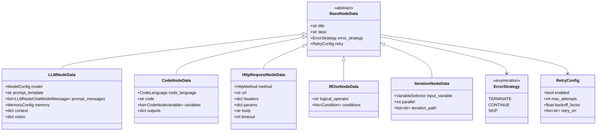

# Dify-01-Workflow工作流引擎-数据结构

本文档详细描述 Workflow 工作流引擎的核心数据结构，包括 UML 类图、字段说明、设计理由和使用示例。

## 数据结构总览

Workflow 模块的数据结构按职责分为以下几类：

| 类别 | 核心类 | 职责 |
|------|--------|------|
| **图结构** | Graph, Edge, Node | 工作流的拓扑结构定义 |
| **运行时状态** | GraphRuntimeState, VariablePool | 执行过程中的动态状态 |
| **执行聚合** | GraphExecution, NodeExecution | DDD 聚合根，执行状态管理 |
| **初始化参数** | GraphInitParams | 创建工作流所需的上下文信息 |
| **节点数据** | BaseNodeData, LLMNodeData等 | 各类节点的配置数据 |
| **事件** | GraphEngineEvent, NodeEventBase | 事件驱动架构的消息载体 |

## 核心数据结构 UML

### 1. 图结构核心类


**类图说明：**

**Graph（图）**
- **职责**：维护工作流的拓扑结构，管理节点和边的关系
- **关键字段**：
  - `nodes`：节点字典，key 为 node_id
  - `edges`：边字典，key 为 edge_id
  - `in_edges`：入边映射，记录每个节点的所有入边
  - `out_edges`：出边映射，记录每个节点的所有出边
  - `root_node`：根节点（通常是 StartNode）
- **设计理由**：使用邻接表结构，支持快速查找节点的前驱和后继

**Node（节点）**
- **职责**：抽象基类，定义节点的通用行为
- **关键字段**：
  - `id`：节点执行实例ID（运行时生成的 UUID）
  - `_node_id`：节点配置ID（图定义中的节点ID）
  - `state`：节点执行状态（UNKNOWN/RUNNING/SUCCEEDED/FAILED/SKIPPED）
  - `graph_runtime_state`：共享的运行时状态引用
- **设计理由**：模板方法模式，`run()` 提供统一执行流程，子类实现 `_run()`

**Edge（边）**
- **职责**：连接两个节点，支持条件分支
- **关键字段**：
  - `tail`：源节点ID
  - `head`：目标节点ID
  - `source_handle`：源句柄，用于条件分支（如 if-else 的 true/false 分支）
- **设计理由**：简洁的边模型，条件判断逻辑在 EdgeProcessor 中实现

### 2. 运行时状态类


**类图说明：**

**GraphRuntimeState（运行时状态）**
- **职责**：持有工作流执行过程中的所有可变状态
- **关键字段**：
  - `variable_pool`：变量池，存储所有节点的输入输出变量
  - `start_at`：工作流开始时间（性能计时基准）
  - `total_tokens`：累计消耗的 Token 数
  - `llm_usage`：LLM 使用统计（prompt/completion tokens, 成本）
  - `outputs`：最终输出变量（来自 End 节点）
  - `node_run_steps`：已执行的节点步数
  - `ready_queue_json`, `graph_execution_json`：可序列化的快照（用于暂停/恢复）
- **设计理由**：
  - 使用私有属性 + 属性装饰器，防止外部直接修改
  - 支持序列化为 JSON，实现暂停/恢复功能
  - 所有返回值使用 `deepcopy`，防止外部修改影响内部状态

**VariablePool（变量池）**
- **职责**：管理节点间的数据传递，支持变量引用和嵌套访问
- **关键字段**：
  - `variable_dictionary`：二级字典 `{node_id: {variable_name: Variable}}`
  - `user_inputs`：用户输入的原始数据（用于 StartNode）
  - `system_variables`：系统变量（user_id, conversation_id 等）
  - `environment_variables`：环境变量（从应用配置注入）
  - `conversation_variables`：对话变量（多轮对话上下文）
- **核心方法**：
  - `add(selector, value)`：添加变量，selector 格式 `[node_id, variable_name]`
  - `get(selector)`：获取变量，支持嵌套访问如 `[node_id, var, field, subfield]`
  - `convert_template(template)`：转换模板字符串 `{{#node_id.var#}}` 为 SegmentGroup
- **设计理由**：
  - 二级字典结构提供 O(1) 查找性能
  - 命名空间隔离：不同节点的同名变量不冲突
  - 支持对象属性访问：`{{#api.response.data.user.name#}}`

**Variable & Segment（变量与片段）**
- **Variable**：变量元数据容器，包含 id, name, selector, value_type
- **Segment**：实际值的载体，支持多种类型
  - `StringSegment`：文本值
  - `NumberSegment`：数值
  - `ObjectSegment`：JSON 对象
  - `ArraySegment`：数组/列表
  - `FileSegment`：文件对象（图片、文档等）
- **设计理由**：
  - 分离元数据和值，便于序列化和类型安全
  - Segment 多态设计，统一处理不同类型的值
  - FileSegment 特殊处理，支持访问文件属性（url, name, mime_type）

### 3. 执行聚合类（DDD）


**类图说明：**

**GraphExecution（图执行聚合根）**
- **职责**：DDD 聚合根，维护工作流级别的执行状态
- **关键字段**：
  - `workflow_id`：工作流标识
  - `started_at`, `completed_at`：时间戳
  - `status`：执行状态（枚举）
  - `error`：错误信息（失败时记录）
  - `exceptions_count`：节点失败计数（部分成功场景）
  - `aborted`：是否被外部中断
- **核心方法**：
  - `start()`：标记开始，记录时间
  - `mark_succeeded()`, `mark_failed()`, `mark_aborted()`：状态转换
  - `dumps()`, `loads()`：序列化/反序列化，支持暂停/恢复
- **设计理由**：
  - 聚合根封装状态转换逻辑，保证一致性
  - 支持序列化，实现断点续传
  - 不依赖数据库模型，纯领域对象

**NodeExecution（节点执行）**
- **职责**：跟踪单个节点的执行状态
- **关键字段**：
  - `node_id`：节点配置ID
  - `node_execution_id`：节点执行实例ID
  - `retry_count`：重试次数
  - `status`, `error`：执行状态和错误
- **核心方法**：
  - `increment_retry()`：重试计数
  - 状态转换方法同 GraphExecution
- **设计理由**：
  - 独立管理节点状态，支持重试机制
  - 与 WorkflowNodeExecution 映射，但不耦合数据库

**WorkflowNodeExecution（持久化模型）**
- **职责**：节点执行的持久化表示（映射到数据库）
- **关键字段**：
  - `id`：数据库主键（UUID）
  - `workflow_execution_id`：关联的工作流运行记录
  - `index`：执行序号（用于追踪可视化）
  - `inputs`, `process_data`, `outputs`：节点的输入/中间数据/输出
  - `execution_metadata`：元数据（如 LLM token 消耗）
- **设计理由**：
  - 分离领域模型和持久化模型
  - 包含数据库特定字段（created_at, finished_at）
  - 支持详细的执行追踪和审计

### 4. 初始化参数类


**类图说明：**

**GraphInitParams（初始化参数）**
- **职责**：封装创建工作流所需的上下文信息
- **关键字段**：
  - `tenant_id`, `app_id`, `workflow_id`：多租户隔离标识
  - `graph_config`：图的 JSON 配置（节点+边）
  - `user_id`：执行用户ID
  - `user_from`：用户类型（管理员账户 / 终端用户）
  - `invoke_from`：调用来源（Service API / 调试器 / Web App / 探索）
  - `call_depth`：嵌套调用深度（防止无限递归）
- **设计理由**：
  - 值对象，不可变
  - 封装所有初始化依赖，避免参数传递混乱
  - 支持多种调用场景（API/调试/探索）

### 5. 节点数据结构



**类图说明：**

**BaseNodeData（节点数据基类）**
- **职责**：所有节点配置数据的基类
- **关键字段**：
  - `title`, `desc`：节点标题和描述
  - `error_strategy`：错误处理策略
    - `TERMINATE`：终止整个工作流
    - `CONTINUE`：继续执行其他分支
    - `SKIP`：跳过后续依赖节点
  - `retry`：重试配置
- **设计理由**：
  - 统一的错误处理和重试机制
  - Pydantic BaseModel，自动校验和序列化

**LLMNodeData（LLM 节点配置）**
- **职责**：配置 LLM 节点的模型、提示词、上下文等
- **关键字段**：
  - `model`：模型配置（provider, name, parameters）
  - `prompt_template`：Completion 模式的提示词模板
  - `prompt_messages`：Chat 模式的消息列表
  - `memory`：记忆配置（对话历史轮数）
  - `context`：知识库检索配置
  - `vision`：多模态配置（图片输入）
- **设计理由**：
  - 支持两种提示词模式（Completion / Chat）
  - 集成知识库检索和多模态能力

**CodeNodeData（代码节点配置）**
- **职责**：配置代码执行节点
- **关键字段**：
  - `code_language`：Python3 / JavaScript / Jinja2
  - `code`：代码字符串
  - `variables`：输入变量映射
  - `outputs`：输出变量定义
- **设计理由**：
  - 支持多语言代码执行
  - 沙箱隔离，限制资源使用

**其他节点数据类**
- **HttpRequestNodeData**：HTTP 请求配置
- **IfElseNodeData**：条件分支逻辑
- **IterationNodeData**：迭代循环配置

## 关键数据结构详解

### 1. Graph（图）

**完整定义**

```python
@final
class Graph:
    """图表示，包含节点和边，用于工作流执行"""

    def __init__(
        self,
        *,
        nodes: dict[str, Node] | None = None,
        edges: dict[str, Edge] | None = None,
        in_edges: dict[str, list[str]] | None = None,
        out_edges: dict[str, list[str]] | None = None,
        root_node: Node,
    ):
        self.nodes = nodes or {}
        self.edges = edges or {}
        self.in_edges = in_edges or {}
        self.out_edges = out_edges or {}
        self.root_node = root_node
```

**字段说明**

| 字段 | 类型 | 说明 | 示例 |
|------|------|------|------|
| `nodes` | dict[str, Node] | 节点字典，key 为 node_id | `{"start-1": StartNode, "llm-1": LLMNode}` |
| `edges` | dict[str, Edge] | 边字典，key 为 edge_id | `{"edge-1": Edge(tail="start-1", head="llm-1")}` |
| `in_edges` | dict[str, list[str]] | 入边映射，记录每个节点的入边ID列表 | `{"llm-1": ["edge-1", "edge-2"]}` |
| `out_edges` | dict[str, list[str]] | 出边映射，记录每个节点的出边ID列表 | `{"start-1": ["edge-1"]}` |
| `root_node` | Node | 根节点（起始节点） | StartNode 实例 |

**约束条件**

- 图必须有至少一个根节点（无入边的节点）
- 边的 tail 和 head 必须指向存在的节点
- 不允许自环（节点指向自己）
- 支持有向无环图（DAG）和有向图（允许循环，但通过迭代节点控制）

**构建示例**

```python
# 1. 准备节点配置
graph_config = {
    "nodes": [
        {"id": "start", "data": {"type": "start", "title": "开始"}},
        {"id": "llm", "data": {"type": "llm", "title": "LLM", ...}},
        {"id": "end", "data": {"type": "end", "title": "结束"}},
    ],
    "edges": [
        {"source": "start", "target": "llm"},
        {"source": "llm", "target": "end"},
    ],
}

# 2. 使用 Graph.init() 构建
graph = Graph.init(
    graph_config=graph_config,
    graph_init_params=graph_init_params,
    graph_runtime_state=graph_runtime_state,
)

# 3. 访问节点和边
start_node = graph.nodes["start"]
out_edges_of_start = [graph.edges[edge_id] for edge_id in graph.out_edges["start"]]
```

---

### 2. VariablePool（变量池）

**完整定义**

```python
class VariablePool(BaseModel):
    variable_dictionary: defaultdict[str, dict[str, VariableUnion]] = Field(
        description="变量字典",
        default=defaultdict(dict),
    )
    user_inputs: Mapping[str, Any] = Field(
        description="用户输入",
        default_factory=dict,
    )
    system_variables: SystemVariable = Field(
        description="系统变量",
        default_factory=SystemVariable.empty,
    )
    environment_variables: Sequence[VariableUnion] = Field(
        description="环境变量",
        default_factory=list,
    )
    conversation_variables: Sequence[VariableUnion] = Field(
        description="对话变量",
        default_factory=list,
    )
```

**字段说明**

| 字段 | 类型 | 说明 |
|------|------|------|
| `variable_dictionary` | defaultdict | 二级字典，第一层 key 为 node_id，第二层 key 为 variable_name |
| `user_inputs` | dict | 用户输入的原始数据，仅用于 StartNode 构建输入 |
| `system_variables` | SystemVariable | 系统变量（user_id, conversation_id, files 等） |
| `environment_variables` | list | 环境变量（从应用配置注入） |
| `conversation_variables` | list | 对话变量（多轮对话上下文） |

**核心方法**

```python
# 添加变量
def add(self, selector: Sequence[str], value: Any, /) -> None:
    """
    参数:
        selector: [node_id, variable_name]
        value: 任意可序列化的值（str, int, dict, list, File）
    """
    ...

# 获取变量
def get(self, selector: Sequence[str], /) -> Segment | None:
    """
    参数:
        selector: 支持多种格式
            - [node_id, var_name]：获取完整变量
            - [node_id, var_name, field]：获取对象字段
            - [node_id, var_name, field, subfield]：嵌套访问
    返回:
        Segment 对象或 None
    """
    ...

# 转换模板
def convert_template(self, template: str, /) -> SegmentGroup:
    """
    将模板字符串转换为 SegmentGroup
    
    示例:
        "Hello {{#start.query#}}, result: {{#llm.text#}}"
        → SegmentGroup([
            StringSegment("Hello "),
            StringSegment("What is AI?"),  # 从 start.query 获取
            StringSegment(", result: "),
            StringSegment("AI is..."),  # 从 llm.text 获取
        ])
    """
    ...
```

**使用示例**

```python
# 创建空变量池
variable_pool = VariablePool.empty()

# 添加简单变量
variable_pool.add(['start', 'query'], "What is AI?")
variable_pool.add(['calculator', 'result'], 42)

# 添加对象变量
variable_pool.add(['api', 'response'], {
    "status": "success",
    "data": {
        "user": {"name": "Alice", "age": 30}
    }
})

# 添加文件变量
from core.file import File
file = File(...)
variable_pool.add(['upload', 'file'], file)

# 获取变量
query = variable_pool.get(['start', 'query'])
print(query.value)  # "What is AI?"

# 获取嵌套字段
user_name = variable_pool.get(['api', 'response', 'data', 'user', 'name'])
print(user_name.value)  # "Alice"

# 获取文件属性
file_url = variable_pool.get(['upload', 'file', 'url'])
print(file_url.value)  # "https://..."

# 转换模板
template = "User {{#api.response.data.user.name#}} asked: {{#start.query#}}"
segment_group = variable_pool.convert_template(template)
text = segment_group.to_text()
print(text)  # "User Alice asked: What is AI?"
```

**命名空间隔离**

不同节点可以有同名变量：

```python
variable_pool.add(['llm1', 'text'], "Response from LLM 1")
variable_pool.add(['llm2', 'text'], "Response from LLM 2")

# 不会冲突
text1 = variable_pool.get(['llm1', 'text'])  # "Response from LLM 1"
text2 = variable_pool.get(['llm2', 'text'])  # "Response from LLM 2"
```

---

### 3. GraphRuntimeState（运行时状态）

**完整定义**

```python
class GraphRuntimeState(BaseModel):
    # 私有属性（使用属性装饰器访问）
    _variable_pool: VariablePool
    _start_at: float
    _total_tokens: int
    _llm_usage: LLMUsage
    _outputs: dict[str, object]
    _node_run_steps: int
    _ready_queue_json: str
    _graph_execution_json: str
    _response_coordinator_json: str

    def __init__(
        self,
        *,
        variable_pool: VariablePool,
        start_at: float,
        total_tokens: int = 0,
        llm_usage: LLMUsage | None = None,
        outputs: dict[str, object] | None = None,
        node_run_steps: int = 0,
        ready_queue_json: str = "",
        graph_execution_json: str = "",
        response_coordinator_json: str = "",
    ):
        ...
```

**字段说明**

| 字段 | 类型 | 访问方式 | 说明 |
|------|------|---------|------|
| `variable_pool` | VariablePool | 属性（只读） | 变量池 |
| `start_at` | float | 属性（读写） | 工作流开始时间（time.perf_counter()） |
| `total_tokens` | int | 属性（读写） | 累计消耗的 Token 数 |
| `llm_usage` | LLMUsage | 属性（读写） | LLM 使用统计（prompt/completion tokens, 成本） |
| `outputs` | dict | 属性（读写） | 最终输出（来自 End 节点） |
| `node_run_steps` | int | 属性（读写） | 已执行的节点步数 |
| `ready_queue_json` | str | 属性（只读） | 就绪队列的 JSON 快照（用于恢复） |
| `graph_execution_json` | str | 属性（只读） | 执行聚合根的 JSON 快照 |
| `response_coordinator_json` | str | 属性（只读） | 响应协调器的 JSON 快照 |

**核心方法**

```python
# 设置单个输出
def set_output(self, key: str, value: object) -> None:
    ...

# 获取单个输出（带默认值）
def get_output(self, key: str, default: object = None) -> object:
    ...

# 批量更新输出
def update_outputs(self, updates: dict[str, object]) -> None:
    ...

# 增加 Token 数
def add_tokens(self, tokens: int) -> None:
    ...

# 增加节点步数
def increment_node_run_steps(self) -> None:
    ...
```

**设计理由**

1. **私有属性**：使用 `_` 前缀 + 属性装饰器，防止外部直接修改
2. **深拷贝**：所有返回值使用 `deepcopy`，防止外部修改影响内部状态
3. **验证**：setter 方法包含参数校验（如 tokens 必须非负）
4. **可序列化**：关键状态可导出为 JSON，支持暂停/恢复

**使用示例**

```python
import time

# 创建运行时状态
variable_pool = VariablePool.empty()
graph_runtime_state = GraphRuntimeState(
    variable_pool=variable_pool,
    start_at=time.perf_counter(),
)

# 添加输出
graph_runtime_state.set_output('result', "Success")
graph_runtime_state.update_outputs({
    'elapsed_time': 1.234,
    'total_steps': 5,
})

# 累计 Token
graph_runtime_state.add_tokens(150)
graph_runtime_state.add_tokens(200)
print(graph_runtime_state.total_tokens)  # 350

# 增加步数
for _ in range(5):
    graph_runtime_state.increment_node_run_steps()
print(graph_runtime_state.node_run_steps)  # 5

# 获取输出
result = graph_runtime_state.get_output('result')
print(result)  # "Success"

# 获取所有输出（深拷贝）
all_outputs = graph_runtime_state.outputs
print(all_outputs)  # {'result': 'Success', 'elapsed_time': 1.234, ...}
```

---

### 4. Node（节点）

**抽象基类定义**

```python
class Node:
    node_type: ClassVar[NodeType]  # 类变量，子类必须定义
    execution_type: NodeExecutionType = NodeExecutionType.EXECUTABLE

    def __init__(
        self,
        id: str,  # 节点执行实例ID（UUID）
        config: Mapping[str, Any],  # 节点配置
        graph_init_params: GraphInitParams,  # 初始化参数
        graph_runtime_state: GraphRuntimeState,  # 运行时状态
    ) -> None:
        self.id = id
        self.tenant_id = graph_init_params.tenant_id
        self.app_id = graph_init_params.app_id
        self.workflow_id = graph_init_params.workflow_id
        self.user_id = graph_init_params.user_id
        self.graph_runtime_state = graph_runtime_state
        self.state: NodeState = NodeState.UNKNOWN
        
        self._node_id = config.get("id")  # 节点配置ID
        self._node_execution_id: str = ""  # 数据库记录ID
        ...

    @abstractmethod
    def init_node_data(self, data: Mapping[str, Any]) -> None:
        """初始化节点数据，子类必须实现"""
        ...

    @abstractmethod
    def _run(self) -> NodeRunResult | Generator[NodeEventBase, None, None]:
        """执行节点逻辑，子类必须实现"""
        ...

    def run(self) -> Generator[GraphNodeEventBase, None, None]:
        """统一的执行流程，模板方法"""
        # 1. 生成执行ID
        # 2. 发送 NodeRunStartedEvent
        # 3. 调用 _run()
        # 4. 发送 NodeRunSucceededEvent 或 NodeRunFailedEvent
        ...
```

**字段说明**

| 字段 | 类型 | 说明 |
|------|------|------|
| `node_type` | NodeType | 节点类型（START/LLM/CODE/IF_ELSE等） |
| `execution_type` | NodeExecutionType | 执行类型（EXECUTABLE/VIRTUAL） |
| `id` | str | 节点执行实例ID（运行时生成的 UUID） |
| `_node_id` | str | 节点配置ID（图定义中的节点ID） |
| `_node_execution_id` | str | 数据库记录ID（持久化后分配） |
| `state` | NodeState | 节点执行状态 |
| `graph_runtime_state` | GraphRuntimeState | 共享的运行时状态引用 |

**节点类型枚举**

```python
class NodeType(StrEnum):
    START = "start"                    # 起始节点
    END = "end"                        # 结束节点
    ANSWER = "answer"                  # 答案节点（流式输出）
    LLM = "llm"                        # LLM 节点
    KNOWLEDGE_RETRIEVAL = "knowledge-retrieval"  # 知识库检索
    IF_ELSE = "if-else"                # 条件分支
    CODE = "code"                      # 代码执行
    TEMPLATE_TRANSFORM = "template-transform"  # 模板转换
    QUESTION_CLASSIFIER = "question-classifier"  # 问题分类
    HTTP_REQUEST = "http-request"      # HTTP 请求
    TOOL = "tool"                      # 工具调用
    VARIABLE_AGGREGATOR = "variable-aggregator"  # 变量聚合
    VARIABLE_ASSIGNER = "variable-assigner"  # 变量赋值
    ITERATION = "iteration"            # 迭代循环
    LOOP = "loop"                      # 条件循环
    PARAMETER_EXTRACTOR = "parameter-extractor"  # 参数提取
    AGENT = "agent"                    # 智能体
    DATASOURCE = "datasource"          # 数据源
    KNOWLEDGE_INDEX = "knowledge-index"  # 知识索引
```

**节点状态枚举**

```python
class NodeState(StrEnum):
    UNKNOWN = "unknown"         # 未知（初始状态）
    READY = "ready"             # 就绪（等待执行）
    RUNNING = "running"         # 运行中
    SUCCEEDED = "succeeded"     # 成功
    FAILED = "failed"           # 失败
    SKIPPED = "skipped"         # 跳过
```

**节点实现示例：StartNode**

```python
class StartNode(Node):
    node_type: ClassVar[NodeType] = NodeType.START
    
    def init_node_data(self, data: Mapping[str, Any]) -> None:
        """StartNode 无需额外配置"""
        pass
    
    def _run(self) -> NodeRunResult:
        """从变量池中收集用户输入"""
        # 获取用户输入
        user_inputs = self.graph_runtime_state.variable_pool.user_inputs
        
        # 构建节点输入
        node_inputs = {}
        for key, value in user_inputs.items():
            segment = variable_factory.build_segment(value)
            node_inputs[key] = segment
        
        # 输出与输入相同
        outputs = node_inputs.copy()
        
        return NodeRunResult(
            status=WorkflowNodeExecutionStatus.SUCCEEDED,
            inputs=node_inputs,
            outputs=outputs,
        )
```

---

## 数据流转示例

### 示例：完整的变量流转

```python
# 1. 初始化变量池
variable_pool = VariablePool.empty()
variable_pool.add(['start', 'query'], "Calculate 10 + 20")

# 2. LLM 节点执行，输出结果
variable_pool.add(['llm', 'text'], "The result is 30")
variable_pool.add(['llm', 'usage'], {
    "prompt_tokens": 20,
    "completion_tokens": 10,
})

# 3. 代码节点获取上游变量
llm_output = variable_pool.get(['llm', 'text'])
print(llm_output.value)  # "The result is 30"

# 4. 代码节点执行，输出数值
variable_pool.add(['code', 'result'], 30)

# 5. End 节点收集最终输出
result = variable_pool.get(['code', 'result'])
graph_runtime_state.set_output('final_result', result.value)

# 6. 获取最终输出
final_outputs = graph_runtime_state.outputs
print(final_outputs)  # {'final_result': 30}
```

---

## 最佳实践

### 1. 变量命名规范

- **节点ID**：使用描述性名称 + 序号，如 `llm-summarize-1`, `code-calculate-2`
- **变量名**：使用蛇形命名，如 `user_query`, `api_response`, `calculation_result`
- **避免冲突**：不同节点可以有同名变量，利用命名空间隔离

### 2. 数据序列化

- **支持的类型**：str, int, float, dict, list, File
- **避免循环引用**：对象变量不要包含循环引用
- **大数据处理**：使用文件引用而非直接存储大数据

### 3. 状态持久化

```python
# 保存状态（暂停场景）
ready_queue_json = ready_queue.dumps()
graph_execution_json = graph_execution.dumps()

graph_runtime_state._ready_queue_json = ready_queue_json
graph_runtime_state._graph_execution_json = graph_execution_json

# 存入数据库
save_workflow_state(workflow_run_id, graph_runtime_state)

# 恢复状态
loaded_state = load_workflow_state(workflow_run_id)
graph_engine = GraphEngine(
    workflow_id=workflow_id,
    graph=graph,
    graph_runtime_state=loaded_state,
    command_channel=command_channel,
)
```

### 4. 内存优化

- **清理临时数据**：节点执行后清理 `process_data`
- **限制历史记录**：对话历史保留最近 N 轮
- **文件引用**：文件通过 URL 引用，避免存储大文件内容

---

**下一步：**

- [Dify-01-Workflow工作流引擎-时序图](./Dify-01-Workflow工作流引擎-时序图.md)

