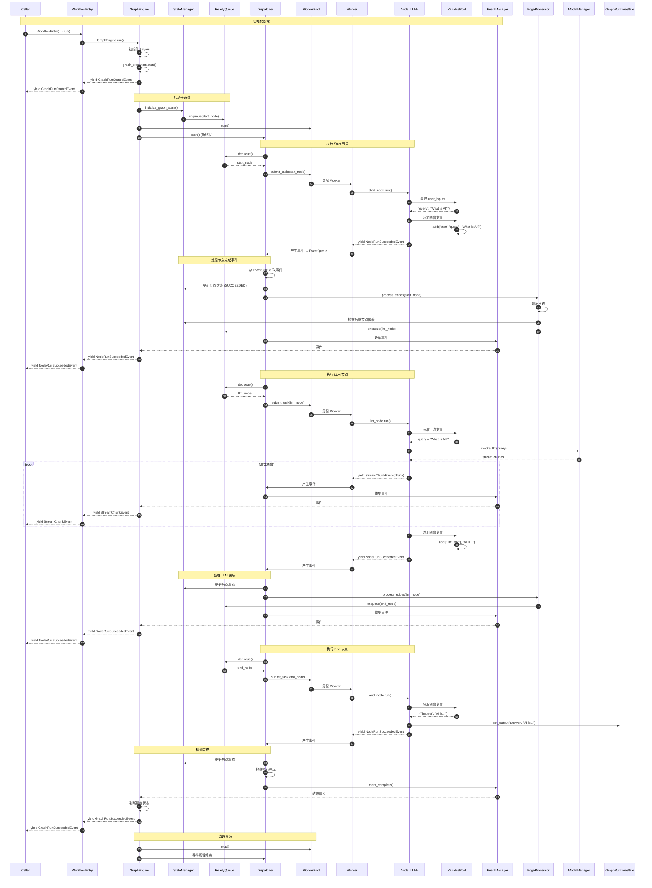
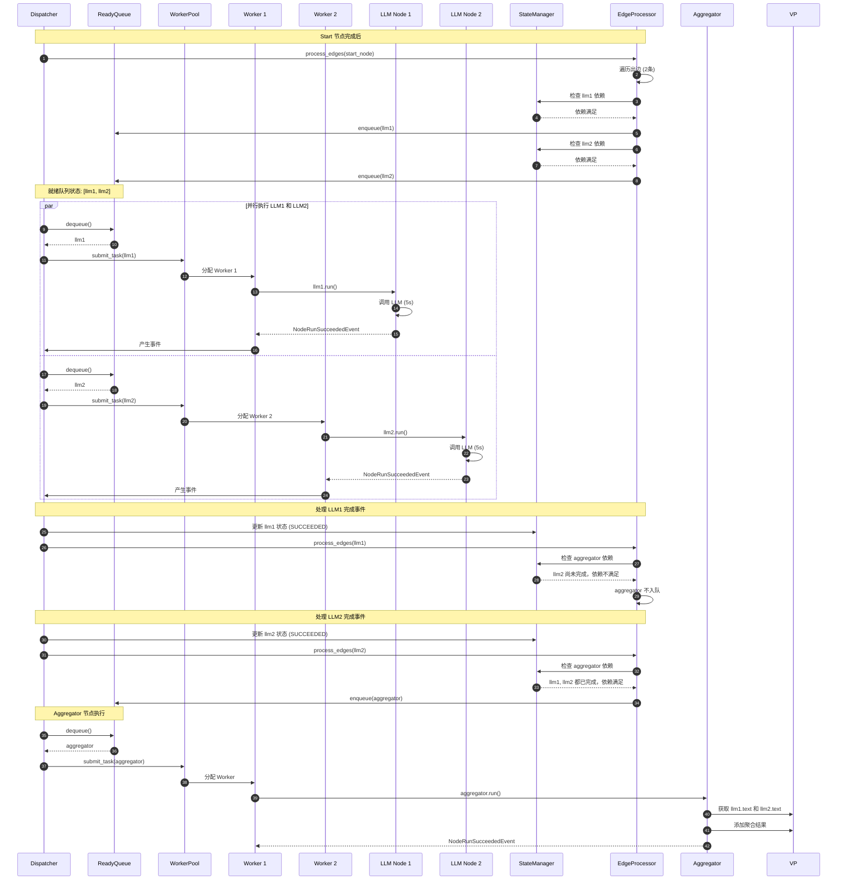
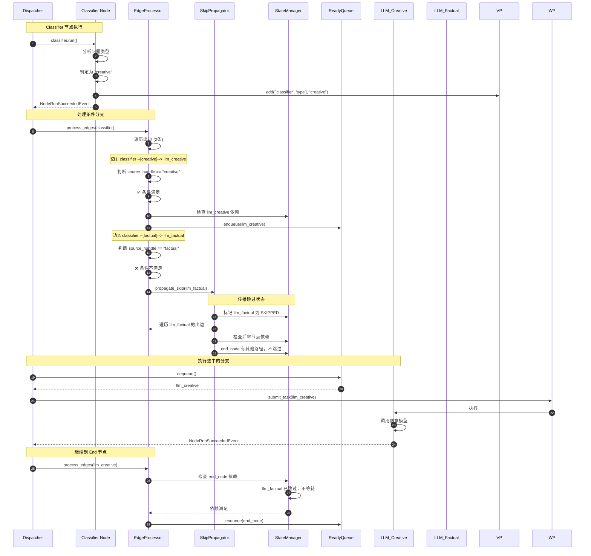
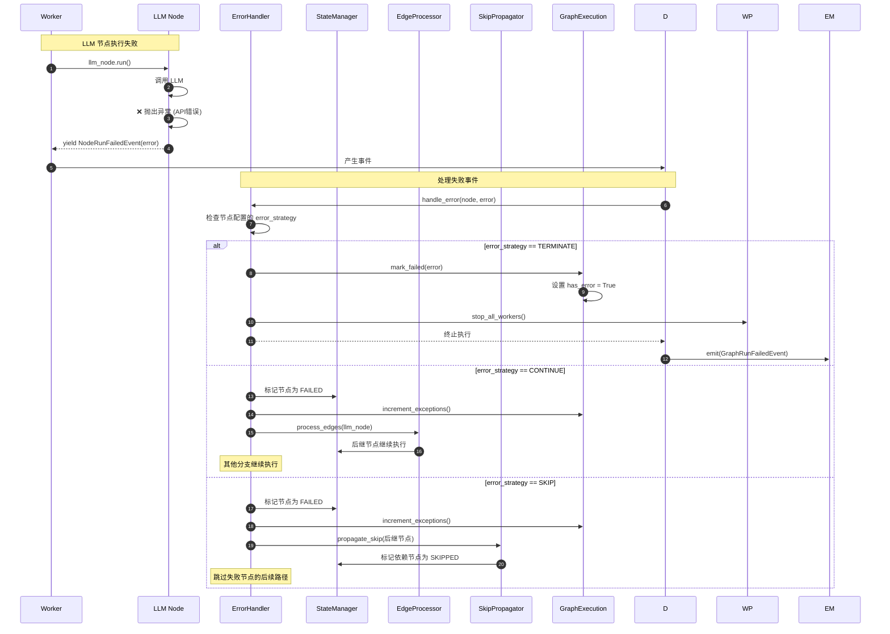
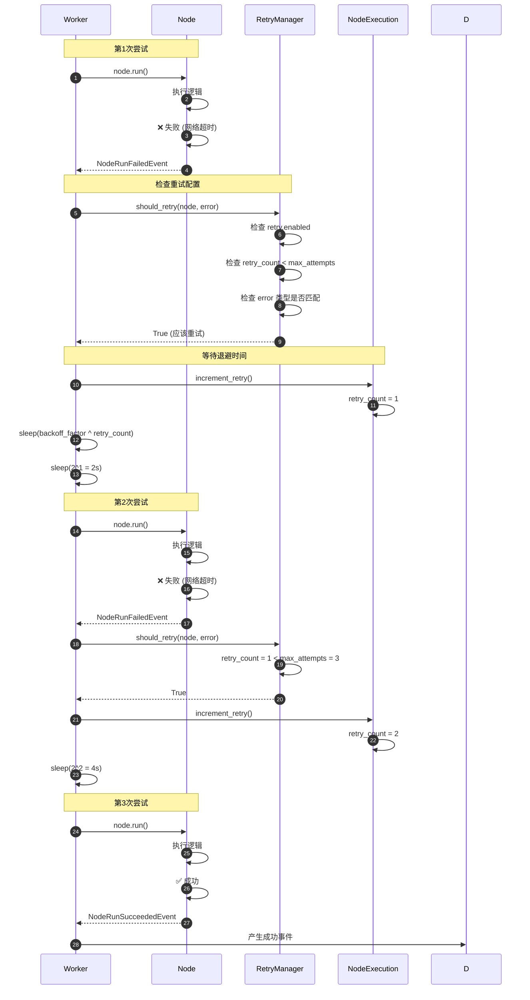

# Dify-01-Workflow工作流引擎-时序图

本文档通过时序图详细展示 Workflow 工作流引擎的典型执行流程，包括节点调度、事件流转、错误处理等关键场景。

## 场景一：基础工作流执行完整流程

### 场景描述

执行一个简单的线性工作流：Start → LLM → End

### 时序图



### 流程说明

**阶段 1：初始化（步骤 1-9）**

1. **Caller 调用**：外部调用 `WorkflowEntry.run()`
2. **引擎启动**：`GraphEngine.run()` 初始化扩展层
3. **执行开始**：`graph_execution.start()` 记录开始时间
4. **事件通知**：yield `GraphRunStartedEvent` 通知外部
5. **状态初始化**：`StateManager.initialize_graph_state()` 将起始节点加入就绪队列
6. **工作池启动**：`WorkerPool.start()` 创建 Worker 线程
7. **分发器启动**：`Dispatcher.start()` 在独立线程中运行主循环

**阶段 2：Start 节点执行（步骤 10-20）**

8. **节点调度**：Dispatcher 从就绪队列取出 start_node
9. **任务提交**：提交给 WorkerPool，分配 Worker 执行
10. **节点运行**：Worker 调用 `start_node.run()`
11. **变量获取**：从 VariablePool 获取用户输入
12. **变量输出**：将输入作为输出添加到变量池
13. **事件产生**：yield `NodeRunSucceededEvent`
14. **事件处理**：Dispatcher 更新节点状态
15. **边遍历**：EdgeProcessor 处理出边，检查后继节点
16. **后继入队**：llm_node 加入就绪队列
17. **事件发布**：EventManager 发布事件给外部

**阶段 3：LLM 节点执行（步骤 21-35）**

18. **节点调度**：取出 llm_node
19. **任务分配**：分配 Worker 执行
20. **变量获取**：从变量池获取上游变量（start.query）
21. **LLM 调用**：通过 ModelManager 调用大语言模型
22. **流式输出**：逐 token yield `StreamChunkEvent`
23. **事件流转**：每个 chunk 实时发布给外部调用方
24. **结果存储**：完整响应存入变量池
25. **节点完成**：yield `NodeRunSucceededEvent`
26. **边处理**：处理 llm → end 边
27. **End 节点入队**

**阶段 4：End 节点执行（步骤 36-43）**

28. **节点调度**：取出 end_node
29. **输出收集**：从变量池收集最终输出
30. **状态更新**：将输出写入 GraphRuntimeState.outputs
31. **节点完成**

**阶段 5：完成与清理（步骤 44-50）**

32. **完成检测**：Dispatcher 检测所有节点完成且队列为空
33. **标记完成**：EventManager 标记完成
34. **状态判断**：GraphEngine 判断最终状态（成功/失败/中断）
35. **完成事件**：yield `GraphRunSucceededEvent`
36. **资源清理**：停止 WorkerPool，等待线程结束

---

## 场景二：并行节点执行流程

### 场景描述

执行一个并行工作流：Start → (LLM1, LLM2) → Aggregator → End

两个 LLM 节点并行执行，Aggregator 等待两者都完成后才执行。

### 时序图



### 关键点说明

1. **依赖检查**：
   - EdgeProcessor 处理每个完成节点的出边
   - StateManager 检查后继节点的所有入边是否都已完成
   - 只有当所有前驱节点都完成时，后继节点才入队

2. **并行度**：
   - llm1 和 llm2 同时在就绪队列中
   - WorkerPool 分配不同的 Worker 并行执行
   - 实际并行度受 Worker 数量限制

3. **性能提升**：
   - 串行执行：5s (llm1) + 5s (llm2) = 10s
   - 并行执行：max(5s, 5s) = 5s
   - 提升 50% 执行效率

---

## 场景三：条件分支执行流程

### 场景描述

执行条件分支工作流：Start → Classifier → (LLM_Creative | LLM_Factual) → End

Classifier 根据问题类型选择执行路径。

### 时序图



### 关键点说明

**1. 条件判断逻辑**

```python
# EdgeProcessor 处理边时的条件检查
for edge in graph.out_edges[node_id]:
    if edge.source_handle:
        # 获取节点输出中的分支标识
        branch = variable_pool.get([node_id, 'branch'])
        if branch.value != edge.source_handle:
            # 条件不满足，触发跳过传播
            skip_propagator.propagate_skip(edge.head)
            continue
    # 条件满足或无条件，检查后继节点依赖
    ...
```

**2. 跳过传播机制**

- **触发条件**：条件分支未选中、If-Else 条件不满足
- **传播规则**：
  - 标记节点为 SKIPPED 状态
  - 递归检查该节点的后继节点
  - 如果后继节点的所有前驱都被跳过，则继续传播
  - 如果后继节点有其他活跃路径，则停止传播

**3. 依赖满足判断**

```python
def is_dependency_satisfied(node_id: str) -> bool:
    """检查节点的所有前驱是否满足执行条件"""
    in_edge_ids = graph.in_edges[node_id]
    for edge_id in in_edge_ids:
        edge = graph.edges[edge_id]
        predecessor_state = state_manager.get_node_state(edge.tail)
        if predecessor_state not in [NodeState.SUCCEEDED, NodeState.SKIPPED]:
            return False  # 有前驱未完成
    return True
```

---

## 场景四：节点失败与错误处理

### 场景描述

LLM 节点执行失败，根据 error_strategy 决定后续行为。

### 时序图



### 错误策略详解

**1. TERMINATE（终止）**

- **行为**：立即停止整个工作流
- **适用场景**：关键节点失败，无法继续执行
- **示例**：鉴权失败、必需参数缺失

```yaml
nodes:
  - id: auth_check
    data:
      error_strategy: terminate
```

**2. CONTINUE（继续）**

- **行为**：记录失败，继续执行其他分支
- **适用场景**：可选节点失败，不影响主流程
- **示例**：发送通知失败、记录日志失败
- **结果**：工作流标记为"部分成功"（GraphRunPartialSucceededEvent）

```yaml
nodes:
  - id: send_notification
    data:
      error_strategy: continue
```

**3. SKIP（跳过）**

- **行为**：标记失败，跳过依赖该节点的后续节点
- **适用场景**：某条路径失败，但不影响其他路径
- **示例**：多路检索中某个数据源失败

```yaml
nodes:
  - id: external_api_call
    data:
      error_strategy: skip
```

---

## 场景五：节点重试机制

### 时序图



### 重试配置示例

```yaml
nodes:
  - id: http_request
    data:
      title: "调用外部 API"
      error_strategy: continue
      retry:
        enabled: true
        max_attempts: 3
        backoff_factor: 2
        retry_on:
          - TimeoutError
          - ConnectionError
          - HTTPError
```

**配置说明：**

| 字段 | 类型 | 说明 |
|------|------|------|
| `enabled` | bool | 是否启用重试 |
| `max_attempts` | int | 最大重试次数（不含首次尝试） |
| `backoff_factor` | float | 退避因子，等待时间 = backoff^retry_count 秒 |
| `retry_on` | list[str] | 仅对指定异常类型重试 |

**退避时间计算：**

- 第1次重试：`2^1 = 2s`
- 第2次重试：`2^2 = 4s`
- 第3次重试：`2^3 = 8s`

---

## 场景六：外部命令控制（停止工作流）

### 时序图

```mermaid
sequenceDiagram
    autonumber
    participant Ext as External (User)
    participant CC as CommandChannel (Redis)
    participant D as Dispatcher
    participant CP as CommandProcessor
    participant GE as GraphExecution
    participant WP as WorkerPool
    
    Note over Ext,CC: 用户请求停止
    Ext->>CC: send_command(AbortCommand)
    CC->>CC: 写入 Redis 队列
    
    Note over D,CP: Dispatcher 主循环检查命令
    D->>CP: check_commands()
    CP->>CC: receive_command()
    CC-->>CP: AbortCommand(reason="User requested")
    
    Note over CP,GE: 处理停止命令
    CP->>GE: mark_aborted(reason)
    GE->>GE: aborted = True
    GE->>GE: error = reason
    
    Note over D,WP: 停止执行
    D->>WP: stop()
    WP->>WP: 终止所有 Worker
    WP->>WP: 等待当前任务完成
    
    Note over D,GE: 保存状态（可选）
    D->>DB: save_workflow_state(
        ready_queue_json,
        graph_execution_json,
        variable_pool
    )
    
    Note over D: 退出主循环
    D->>EM: mark_complete()
    EM-->>GE: 结束信号
    GE-->>C: yield GraphRunAbortedEvent(reason)
```

### 命令通道实现

**Redis 通道（分布式场景）**

```python
from redis import Redis

class RedisChannel(CommandChannel):
    def __init__(self, redis_client: Redis, channel_key: str):
        self.redis = redis_client
        self.channel_key = channel_key
    
    def send_command(self, command: Command) -> None:
        """发送命令到 Redis 队列"""
        command_json = command.model_dump_json()
        self.redis.rpush(self.channel_key, command_json)
    
    def receive_command(self) -> Command | None:
        """从 Redis 队列接收命令（非阻塞）"""
        command_json = self.redis.lpop(self.channel_key)
        if not command_json:
            return None
        return Command.model_validate_json(command_json)
```

**内存通道（单进程场景）**

```python
import queue

class InMemoryChannel(CommandChannel):
    def __init__(self):
        self.queue = queue.Queue()
    
    def send_command(self, command: Command) -> None:
        self.queue.put(command)
    
    def receive_command(self) -> Command | None:
        try:
            return self.queue.get_nowait()
        except queue.Empty:
            return None
```

### 使用示例

```python
# 发送停止命令（在另一个进程/线程）
redis_channel = RedisChannel(redis_client, f"workflow:{run_id}:commands")
redis_channel.send_command(AbortCommand(reason="User requested stop"))

# 工作流会在下一轮循环检测到命令并停止
# 输出 GraphRunAbortedEvent
```

---

## 性能优化要点

### 1. 事件队列优化

**问题**：事件队列积压导致延迟

**解决方案**：
- 及时消费事件，避免 `EventQueue` 积压
- 使用有界队列，防止内存溢出
- 批量发布事件，减少线程切换

```python
# 批量发布事件
events_batch = []
for node in completed_nodes:
    events_batch.append(NodeRunSucceededEvent(...))
event_manager.emit_batch(events_batch)
```

### 2. Worker Pool 扩缩容

**动态扩容规则**：
- 就绪队列长度 > `scale_up_threshold` 时扩容
- Worker 空闲时间 > `scale_down_idle_time` 时缩容
- Worker 数量限制在 `[min_workers, max_workers]`

```python
worker_pool = WorkerPool(
    min_workers=1,
    max_workers=10,
    scale_up_threshold=5,     # 队列长度超过5时扩容
    scale_down_idle_time=5.0, # 空闲5秒后缩容
)
```

### 3. 变量池访问优化

**问题**：频繁查找相同变量

**解决方案**：
- 缓存变量引用
- 批量获取变量

```python
# 不推荐
for i in range(100):
    value = variable_pool.get(['node', 'var'])
    process(value)

# 推荐
cached_value = variable_pool.get(['node', 'var'])
for i in range(100):
    process(cached_value)
```

---

## 最佳实践

### 1. 事件处理

```python
for event in workflow_entry.run():
    # 使用 isinstance 判断事件类型
    if isinstance(event, GraphRunStartedEvent):
        start_time = time.time()
    elif isinstance(event, StreamChunkEvent):
        print(event.chunk, end="", flush=True)
    elif isinstance(event, NodeRunSucceededEvent):
        logger.info(f"Node {event.node_id} completed")
    elif isinstance(event, GraphRunSucceededEvent):
        elapsed = time.time() - start_time
        logger.info(f"Workflow completed in {elapsed:.2f}s")
```

### 2. 错误处理

```python
try:
    for event in workflow_entry.run():
        if isinstance(event, GraphRunFailedEvent):
            # 记录失败信息
            save_failure_log(event.error)
            break
except Exception as e:
    # 处理意外异常
    logger.exception("Unexpected error")
```

### 3. 监控指标

```python
metrics = {
    'total_nodes': 0,
    'succeeded': 0,
    'failed': 0,
    'skipped': 0,
    'total_time': 0,
    'llm_tokens': 0,
}

for event in workflow_entry.run():
    if isinstance(event, NodeRunSucceededEvent):
        metrics['succeeded'] += 1
        metrics['total_nodes'] += 1
    elif isinstance(event, NodeRunFailedEvent):
        metrics['failed'] += 1
        metrics['total_nodes'] += 1
    elif isinstance(event, GraphRunSucceededEvent):
        metrics['llm_tokens'] = event.total_tokens
```

---

**下一步：**

- [Dify-02-RAG检索增强生成-概览](./Dify-02-RAG检索增强生成-概览.md)

