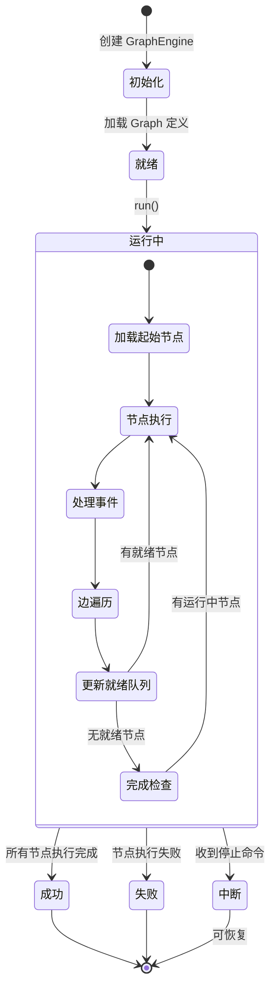
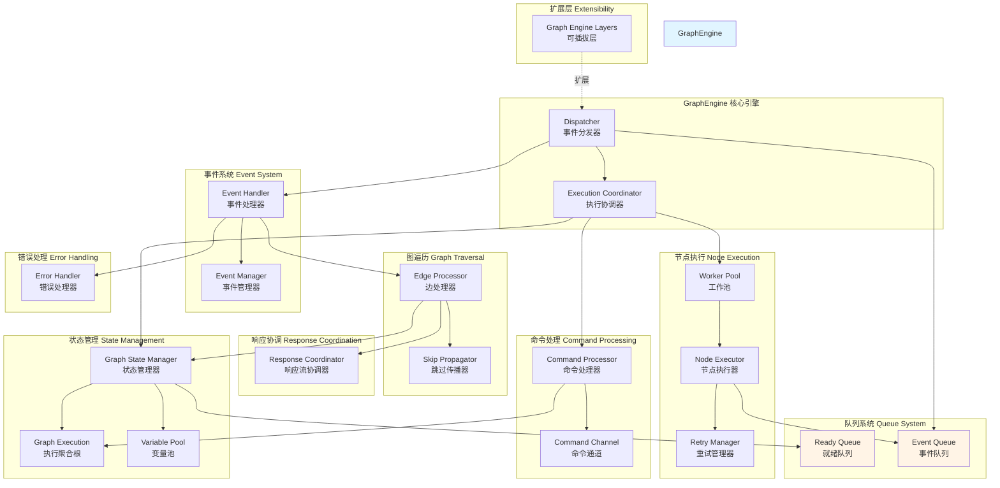

# Dify-01-Workflow工作流引擎-概览

## 模块职责

Workflow工作流引擎是 Dify 平台的核心编排系统，负责将复杂的 AI 任务分解为可视化的节点图，并按照依赖关系和条件逻辑进行调度执行。

**核心职责：**
- 图结构定义与验证：支持 DAG（有向无环图）和有条件分支的工作流
- 节点编排与调度：根据节点依赖关系动态调度执行
- 并行执行：无依赖节点自动并行，提升执行效率
- 状态管理：支持暂停/恢复/停止，状态持久化
- 事件驱动：通过事件总线实现节点间解耦
- 变量传递：全局变量池支持节点间数据流转
- 错误处理：支持节点级别重试和失败处理策略
- 外部控制：通过命令通道实现外部实时控制

**输入/输出：**

**输入：**
- Graph 定义（节点+边）
- 用户输入变量
- 系统变量（用户ID、租户ID等）
- 环境变量

**输出：**
- GraphEngineEvent 流：节点执行事件、错误事件、完成事件
- 变量池：最终的所有变量值
- 执行状态：成功/失败/中断
- 执行元数据：耗时、Token 消耗等

**上下游依赖：**

**上游调用方：**
- `WorkflowAppRunner`：工作流应用运行器
- `Console API`：控制台手动触发
- `Service API`：外部 API 调用

**下游依赖：**
- **节点执行器**：各类节点实现（LLM、Code、HTTP等）
- **Model Runtime**：LLM 调用
- **PostgreSQL**：状态持久化
- **Redis**：命令通道（分布式场景）

## 生命周期



**生命周期阶段说明：**

1. **初始化阶段** (`__init__`)
   - 创建 GraphEngine 实例
   - 初始化所有子系统（StateManager、EventManager、WorkerPool等）
   - 从持久化状态恢复（如果是断点续传）
   - 验证 Graph 一致性

2. **就绪阶段**
   - 等待外部调用 `run()` 方法
   - 此时可以添加 Layer 扩展功能

3. **运行阶段** (`run()`)
   - 发送 `GraphRunStartedEvent`
   - 循环处理节点执行
   - 实时响应外部命令
   - 流式输出事件

4. **终止阶段**
   - 正常完成：`GraphRunSucceededEvent`
   - 失败：`GraphRunFailedEvent`
   - 中断：`GraphRunAbortedEvent`
   - 保存最终状态到数据库

## 模块架构图



### 架构说明

**1. 核心引擎层 (GraphEngine)**

`GraphEngine` 是整个工作流引擎的门面，对外提供简单的 `run()` 接口。内部通过模块化设计，将职责分配给各个专门的子系统。

- **Dispatcher（事件分发器）**：核心调度循环，负责从事件队列中取出事件，分发给对应的处理器，驱动整个执行流程
- **ExecutionCoordinator（执行协调器）**：高层协调逻辑，检查命令、触发 Worker 扩缩容、判断执行完成

**2. 状态管理层 (State Management)**

负责工作流执行过程中所有状态的维护和变更。

- **GraphExecution（执行聚合根）**：DDD 聚合根，维护工作流运行级别的状态（开始时间、结束时间、状态、错误信息）
- **GraphStateManager（状态管理器）**：统一的状态管理门面，协调节点状态变更、队列操作、变量池更新
- **VariablePool（变量池）**：全局变量存储，支持节点间数据传递，使用 `{{#node_id.variable#}}` 语法引用

**3. 队列系统 (Queue System)**

解耦节点依赖，支持并行执行。

- **ReadyQueue（就绪队列）**：存储可立即执行的节点，支持优先级调度
  - 内存实现：`InMemoryReadyQueue`（单机场景）
  - 可扩展为分布式队列（Redis/RabbitMQ）
- **EventQueue（事件队列）**：节点执行产生的事件临时缓冲，Dispatcher 从中消费

**4. 节点执行层 (Node Execution)**

负责节点的实际执行。

- **WorkerPool（工作池）**：线程池管理，动态扩缩容
  - 根据队列长度自动扩容 (`scale_up_threshold`)
  - Worker 空闲超时自动缩容 (`scale_down_idle_time`)
- **NodeExecutor（节点执行器）**：在 Worker 线程中运行，调用节点的 `_run()` 方法
- **RetryManager（重试管理器）**：节点失败时根据配置执行重试逻辑

**5. 事件系统 (Event System)**

事件驱动架构，解耦各模块。

- **EventManager（事件管理器）**：收集和发布事件，支持流式输出给外部调用方
- **EventHandler（事件处理器）**：注册各类事件的处理逻辑
  - `NodeRunStartedEvent` → 记录开始时间
  - `NodeRunSucceededEvent` → 触发边遍历
  - `NodeRunFailedEvent` → 错误处理和传播

**6. 图遍历层 (Graph Traversal)**

负责根据执行结果决定下一步执行路径。

- **EdgeProcessor（边处理器）**：处理节点执行后的出边，判断条件分支
  - 条件判断（If-Else 节点）
  - 路由选择（多分支节点）
  - 收集后继节点依赖满足情况
- **SkipPropagator（跳过传播器）**：传播跳过状态
  - 当节点被跳过时，沿着依赖链传播跳过状态
  - 避免后续节点等待永远不会到来的前置依赖

**7. 响应协调层 (Response Coordination)**

管理流式响应的生成和路径追踪。

- **ResponseCoordinator（响应流协调器）**：
  - 跟踪 Answer 节点和 End 节点的输出路径
  - 协调多个分支的响应合并
  - 支持 SSE 流式输出

**8. 命令处理层 (Command Processing)**

接收外部控制命令。

- **CommandChannel（命令通道）**：命令传输通道
  - `InMemoryChannel`：单进程内存通道（默认）
  - `RedisChannel`：跨进程分布式通道
- **CommandProcessor（命令处理器）**：处理命令
  - `AbortCommand`：停止执行
  - `PauseCommand`：暂停执行（未来支持）
  - `ResumeCommand`：恢复执行（未来支持）

**9. 错误处理层 (Error Handling)**

统一的错误处理和恢复。

- **ErrorHandler（错误处理器）**：
  - 节点执行失败处理
  - 根据 `error_strategy` 决定：
    - `TERMINATE`：终止整个工作流
    - `CONTINUE`：继续执行其他分支
    - `SKIP`：跳过后续依赖节点

**10. 扩展层 (Extensibility)**

通过 Layer 模式扩展功能。

- **GraphEngineLayer**：可插拔的扩展点
  - `DebugLoggingLayer`：调试日志记录
  - `TracingLayer`：分布式追踪
  - `MetricsLayer`：指标收集

### 边界与约束

**扩展点：**
- **Layer 系统**：通过 `.layer(custom_layer)` 添加自定义逻辑
- **Command Channel**：自定义通道实现（如 Kafka、NATS）
- **ReadyQueue**：自定义队列实现（如分布式优先队列）

**状态持有位置：**
- **GraphRuntimeState**：所有运行时状态的容器
  - `variable_pool`：变量池
  - `node_execution_states`：节点执行状态映射
  - `ready_queue_json`：就绪队列快照（JSON）
  - `graph_execution_json`：执行聚合根快照（JSON）
- **PostgreSQL**：持久化存储
  - `workflow_run` 表：工作流运行记录
  - `workflow_node_execution` 表：节点执行记录

**资源占用要点：**

| 资源类型 | 估算 | 优化策略 |
|---------|------|---------|
| 内存 | 100MB (基础) + 10MB * 节点数 | 大变量使用引用，避免复制 |
| 线程 | 1-10 Worker 线程 | 动态扩缩容 |
| 数据库连接 | 1 连接（通过连接池） | 复用连接 |
| CPU | 中等（主要在节点执行） | 并行执行无依赖节点 |

### 关键设计决策

**1. 为什么使用队列驱动而非递归执行？**

- **并行性**：队列模式天然支持并发执行多个无依赖节点
- **可恢复性**：队列状态可序列化，支持暂停/恢复
- **动态调度**：可以根据运行时条件动态调整执行顺序
- **资源控制**：通过 Worker Pool 控制并发度，避免资源耗尽

**2. 为什么事件驱动而非直接调用？**

- **解耦**：节点执行与状态管理解耦，降低模块耦合度
- **可观测性**：所有操作都产生事件，便于监控和调试
- **可扩展性**：通过订阅事件可以无侵入式添加功能
- **流式输出**：事件可以实时流式输出给外部调用方

**3. 变量池的设计**

变量池使用二级字典结构 `{node_id: {variable_name: Variable}}`：
- **快速查找**：O(1) 时间复杂度
- **命名空间隔离**：不同节点的同名变量不冲突
- **支持嵌套访问**：`{{#node_id.obj.field#}}` 访问对象属性

## 典型调用场景

### 场景 1：简单线性工作流

```yaml
graph:
  nodes:
    - id: start
      type: start
    - id: llm
      type: llm
    - id: end
      type: end
  edges:
    - source: start
      target: llm
    - source: llm
      target: end
```

**执行流程：**
1. 起始节点进入就绪队列
2. Worker 执行 start 节点 → 输出变量
3. 边处理器处理 start → llm 边 → llm 节点进入就绪队列
4. Worker 执行 llm 节点（调用 LLM） → 输出文本
5. 边处理器处理 llm → end 边 → end 节点进入就绪队列
6. Worker 执行 end 节点 → 收集最终输出
7. 工作流完成

**并发度**：最大 1（线性依赖）

### 场景 2：并行执行工作流

```yaml
graph:
  nodes:
    - id: start
      type: start
    - id: llm1
      type: llm
    - id: llm2
      type: llm
    - id: aggregator
      type: variable_aggregator
    - id: end
      type: end
  edges:
    - source: start
      target: llm1
    - source: start
      target: llm2
    - source: llm1
      target: aggregator
    - source: llm2
      target: aggregator
    - source: aggregator
      target: end
```

**执行流程：**
1. start 节点执行完成
2. llm1 和 llm2 同时进入就绪队列
3. 两个 Worker 并行执行 llm1 和 llm2
4. 当两者都完成后，aggregator 节点才进入就绪队列
5. aggregator 合并结果 → end 节点
6. 工作流完成

**并发度**：最大 2（llm1 和 llm2 并行）

**性能提升**：如果 llm1 和 llm2 各需 5s，串行需 10s，并行只需 5s

### 场景 3：条件分支工作流

```yaml
graph:
  nodes:
    - id: start
      type: start
    - id: classifier
      type: question_classifier
    - id: llm_creative
      type: llm
    - id: llm_factual
      type: llm
    - id: end
      type: end
  edges:
    - source: start
      target: classifier
    - source: classifier
      source_handle: creative
      target: llm_creative
    - source: classifier
      source_handle: factual
      target: llm_factual
    - source: llm_creative
      target: end
    - source: llm_factual
      target: end
```

**执行流程：**
1. classifier 节点根据用户输入分类
2. 边处理器根据分类结果选择路径：
   - 如果是创意类问题 → llm_creative 进入就绪队列
   - 如果是事实类问题 → llm_factual 进入就绪队列
   - 另一分支的节点被标记为 SKIPPED
3. 跳过传播器传播跳过状态
4. 执行选中的 LLM 节点 → end 节点
5. 工作流完成

**跳过机制**：未选中的分支不会执行，节省资源

### 场景 4：迭代执行工作流

```yaml
graph:
  nodes:
    - id: start
      type: start
    - id: iteration
      type: iteration
    - id: iteration-start
      type: iteration-start
    - id: llm_process
      type: llm
    - id: end
      type: end
  edges:
    - source: start
      target: iteration
    - source: iteration
      target: iteration-start
    - source: iteration-start
      target: llm_process
    - source: llm_process
      target: iteration  # 回到迭代节点
    - source: iteration
      source_handle: output
      target: end
```

**执行流程：**
1. iteration 节点拆分输入列表为多个迭代项
2. 对每个迭代项：
   - iteration-start 作为子图起点
   - llm_process 处理当前项
   - 结果返回 iteration 节点
3. 所有迭代完成后，iteration 节点输出聚合结果
4. end 节点接收最终输出

**并发控制**：迭代节点可配置并行度，例如每次并行处理 3 个项目

### 场景 5：暂停与恢复

**暂停场景：**
- 用户手动停止运行中的工作流
- 触发成本限制
- 检测到无限循环风险

**暂停过程：**
```python
# 发送停止命令
command_channel.send_command(AbortCommand(reason="User requested"))

# GraphEngine 在下一轮循环检测到命令
# 停止 Worker Pool，保存当前状态
{
    "graph_execution_json": "...",
    "ready_queue_json": "...",
    "node_execution_states": {...},
    "variable_pool": {...}
}
```

**恢复过程：**
```python
# 从数据库加载状态
graph_runtime_state = load_state_from_db(workflow_run_id)

# 重新创建 GraphEngine，自动恢复状态
graph_engine = GraphEngine(
    workflow_id=workflow_id,
    graph=graph,
    graph_runtime_state=graph_runtime_state,
    command_channel=command_channel
)

# 继续执行
for event in graph_engine.run():
    ...
```

**注意事项：**
- 正在执行的节点需要重新执行（幂等性要求）
- 已完成的节点状态保留，不会重复执行
- 外部资源（LLM 调用、HTTP 请求）需要幂等设计

---

**下一步：**

详细了解各个子模块的实现：
- [Dify-01-Workflow工作流引擎-API](./Dify-01-Workflow工作流引擎-API.md)
- [Dify-01-Workflow工作流引擎-数据结构](./Dify-01-Workflow工作流引擎-数据结构.md)
- [Dify-01-Workflow工作流引擎-时序图](./Dify-01-Workflow工作流引擎-时序图.md)

