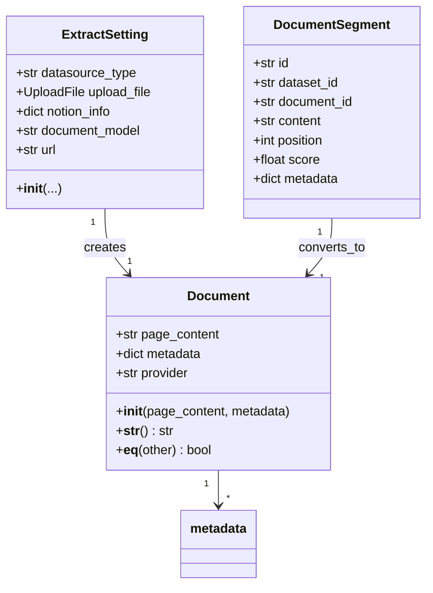
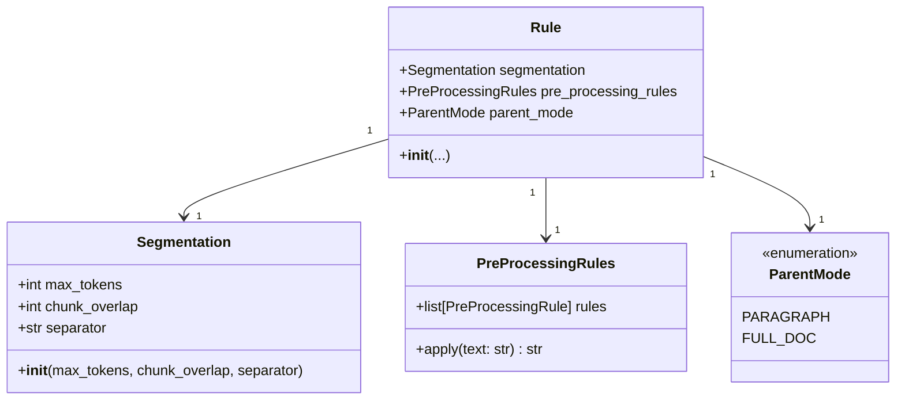
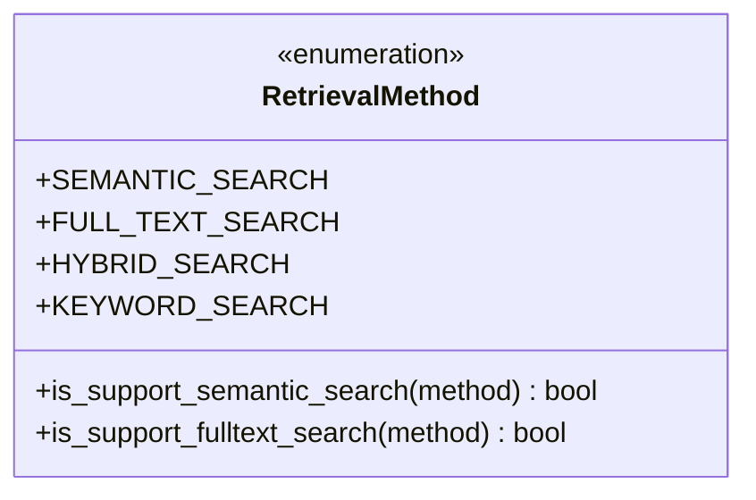
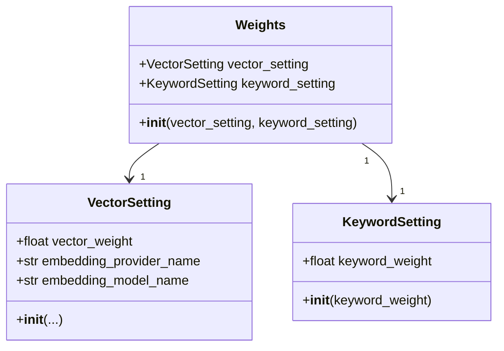
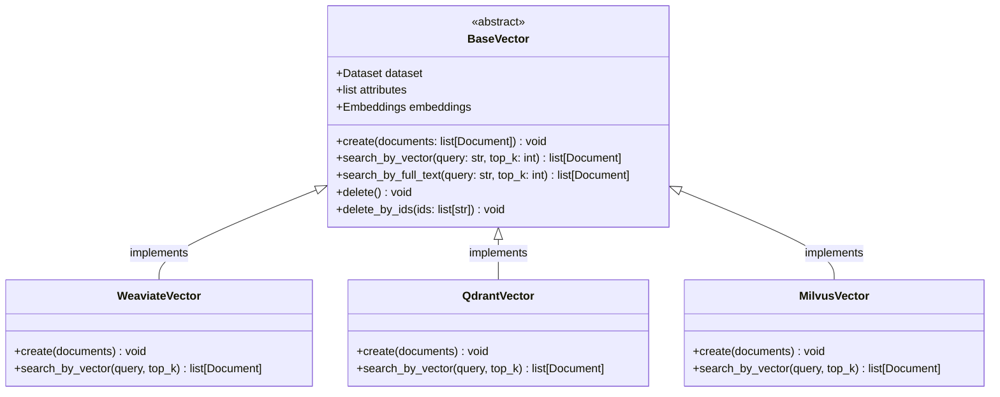
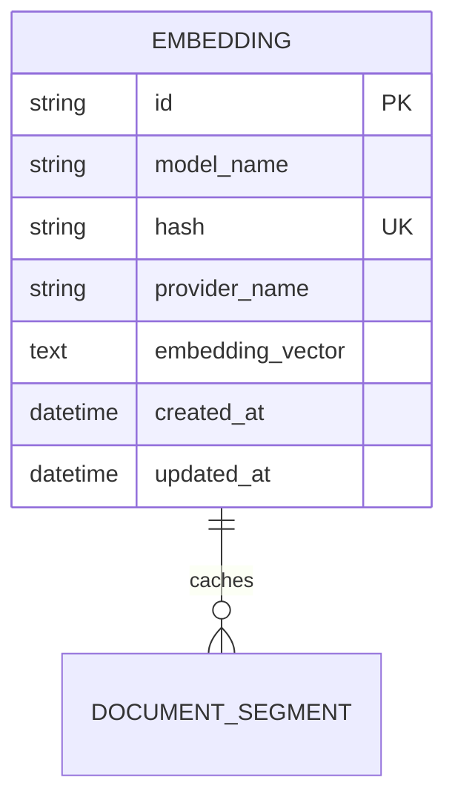
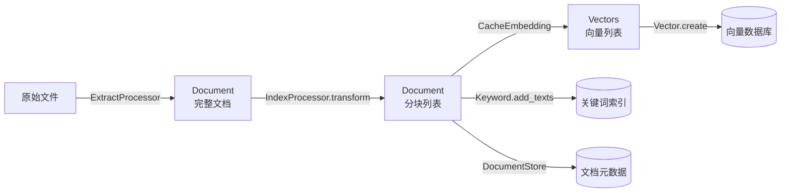
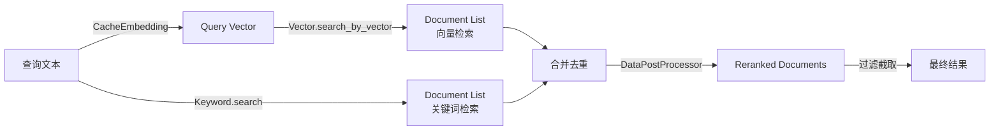

# Dify-02-RAG检索增强生成-数据结构

本文档详细描述 RAG 模块的核心数据结构，包括 UML 类图、字段说明、约束条件和使用示例。

---

## 数据结构概览

RAG 模块的核心数据结构分为以下几类：

1. **文档类**：`Document`、`ExtractSetting`、`DocumentSegment`
2. **检索类**：`RetrievalMethod`、`MetadataCondition`、`RetrievalSegments`
3. **Embedding 类**：`CacheEmbedding`、`Embeddings`、`EmbeddingInputType`
4. **向量存储类**：`BaseVector`、`VectorType`、`Field`
5. **重排序类**：`Weights`、`VectorSetting`、`KeywordSetting`、`RerankMode`
6. **处理规则类**：`Rule`、`Segmentation`、`ProcessRule`

---

## 1. Document 文档对象

### UML 类图



### Document 字段说明

| 字段 | 类型 | 必填 | 约束 | 说明 |
|------|------|------|------|------|
| `page_content` | str | 是 | 非空，最长 100,000 字符 | 文档或分块的文本内容 |
| `metadata` | dict | 否 | 默认 {} | 元数据（包含 doc_id、dataset_id、score 等） |
| `provider` | str | 否 | 默认 "dify" | 数据提供方（"dify" 或 "external"） |

**metadata 常见字段**：

| 键 | 类型 | 说明 |
|-----|------|------|
| `doc_id` | str | 分块唯一 ID（UUID） |
| `doc_hash` | str | 内容哈希（MD5） |
| `dataset_id` | str | 所属数据集 ID |
| `document_id` | str | 所属文档 ID |
| `position` | int | 在文档中的位置（0-based） |
| `score` | float | 相关性分数（0-1） |
| `source` | str | 文档来源（文件路径或 URL） |
| `page` | int | PDF 页码 |
| `title` | str | 文档标题 |

### 核心代码

```python
# api/core/rag/models/document.py

from typing import Any

class Document:
    """文档对象，表示一个完整文档或文档分块"""
    
    def __init__(
        self,
        page_content: str,
        metadata: dict[str, Any] | None = None
    ):
        """
        初始化文档对象
        
        参数:
            page_content: 文档文本内容
            metadata: 元数据字典
        """
        self.page_content = page_content
        self.metadata = metadata or {}
        self.provider = self.metadata.get("provider", "dify")
    
    def __str__(self) -> str:
        """字符串表示"""
        return f"Document(content={self.page_content[:50]}..., metadata={self.metadata})"
    
    def __eq__(self, other: object) -> bool:
        """相等性比较"""
        if not isinstance(other, Document):
            return False
        return (
            self.page_content == other.page_content
            and self.metadata == other.metadata
        )
    
    def __repr__(self) -> str:
        """调试表示"""
        return self.__str__()
```

**设计理由**：
- 简单的数据容器，不包含业务逻辑
- 通过 `metadata` 携带任意扩展信息
- 实现 `__eq__` 支持去重操作

### 使用示例

```python
# 创建文档对象
doc = Document(
    page_content="Dify 是一个开源的 LLM 应用开发平台。",
    metadata={
        "source": "README.md",
        "title": "Dify 简介",
        "doc_id": "uuid-1234",
        "dataset_id": "dataset-5678"
    }
)

# 访问字段
print(doc.page_content)  # "Dify 是一个开源的 LLM 应用开发平台。"
print(doc.metadata["source"])  # "README.md"

# 比较相等性
doc2 = Document(
    page_content="Dify 是一个开源的 LLM 应用开发平台。",
    metadata={"source": "README.md"}
)
print(doc == doc2)  # False（metadata 不同）
```

---

## 2. ExtractSetting 提取配置

### 字段说明

| 字段 | 类型 | 必填 | 约束 | 说明 |
|------|------|------|------|------|
| `datasource_type` | str | 是 | `"upload_file"` / `"notion_import"` / `"website_crawl"` | 数据源类型 |
| `upload_file` | UploadFile | 条件 | 仅 `upload_file` 时必填 | 上传文件对象 |
| `notion_info` | dict | 条件 | 仅 `notion_import` 时必填 | Notion 页面信息 |
| `document_model` | str | 否 | 默认 `"parse_by_server"` | 文档解析模型 |
| `url` | str | 条件 | 仅 `website_crawl` 时必填 | 网页 URL |

### 核心代码

```python
# api/core/rag/extractor/entity/extract_setting.py

from dataclasses import dataclass
from typing import Optional

@dataclass
class ExtractSetting:
    """文档提取配置"""
    
    datasource_type: str
    upload_file: Optional[Any] = None
    notion_info: Optional[dict] = None
    document_model: Optional[str] = "parse_by_server"
    url: Optional[str] = None
    
    def __post_init__(self):
        """参数校验"""
        if self.datasource_type == "upload_file" and not self.upload_file:
            raise ValueError("upload_file is required for datasource_type 'upload_file'")
        
        if self.datasource_type == "notion_import" and not self.notion_info:
            raise ValueError("notion_info is required for datasource_type 'notion_import'")
        
        if self.datasource_type == "website_crawl" and not self.url:
            raise ValueError("url is required for datasource_type 'website_crawl'")
```

**设计理由**：
- 使用 `dataclass` 简化数据类定义
- 通过 `__post_init__` 进行参数校验
- 支持多种数据源类型的统一配置

---

## 3. Rule 处理规则

### UML 类图



### 字段说明

**Rule**：

| 字段 | 类型 | 必填 | 约束 | 说明 |
|------|------|------|------|------|
| `segmentation` | Segmentation | 是 | - | 分块规则 |
| `pre_processing_rules` | list | 否 | 默认 [] | 预处理规则列表 |
| `parent_mode` | str | 否 | 默认 "paragraph" | 父子模式（仅父子索引器使用） |

**Segmentation**：

| 字段 | 类型 | 必填 | 约束 | 说明 |
|------|------|------|------|------|
| `max_tokens` | int | 是 | 50-2000 | 分块最大 token 数 |
| `chunk_overlap` | int | 是 | 0-max_tokens*0.5 | 分块重叠 token 数 |
| `separator` | str | 是 | 非空字符串 | 分隔符（`\n\n`、`\n`、`. ` 等） |

### 核心代码

```python
# api/services/entities/knowledge_entities/knowledge_entities.py

from dataclasses import dataclass
from typing import Optional, List

@dataclass
class Segmentation:
    """分块规则"""
    max_tokens: int
    chunk_overlap: int
    separator: str = "\n\n"
    
    def __post_init__(self):
        """参数校验"""
        if self.max_tokens < 50 or self.max_tokens > 2000:
            raise ValueError("max_tokens must be between 50 and 2000")
        
        if self.chunk_overlap < 0 or self.chunk_overlap > self.max_tokens * 0.5:
            raise ValueError("chunk_overlap must be between 0 and max_tokens * 0.5")

@dataclass
class Rule:
    """文档处理规则"""
    segmentation: Optional[Segmentation] = None
    pre_processing_rules: Optional[List[dict]] = None
    parent_mode: str = "paragraph"
    
    def __post_init__(self):
        """初始化后处理"""
        if self.pre_processing_rules is None:
            self.pre_processing_rules = []
```

---

## 4. RetrievalMethod 检索方法

### UML 类图



### 核心代码

```python
# api/core/rag/retrieval/retrieval_methods.py

from enum import Enum

class RetrievalMethod(Enum):
    """检索方法枚举"""
    SEMANTIC_SEARCH = "semantic_search"         # 语义检索（向量检索）
    FULL_TEXT_SEARCH = "full_text_search"       # 全文检索
    HYBRID_SEARCH = "hybrid_search"             # 混合检索
    KEYWORD_SEARCH = "keyword_search"           # 关键词检索
    
    @staticmethod
    def is_support_semantic_search(retrieval_method: str) -> bool:
        """是否支持语义检索"""
        return retrieval_method in {
            RetrievalMethod.SEMANTIC_SEARCH.value,
            RetrievalMethod.HYBRID_SEARCH.value
        }
    
    @staticmethod
    def is_support_fulltext_search(retrieval_method: str) -> bool:
        """是否支持全文检索"""
        return retrieval_method in {
            RetrievalMethod.FULL_TEXT_SEARCH.value,
            RetrievalMethod.HYBRID_SEARCH.value
        }
```

**使用示例**：

```python
# 判断检索方法是否需要向量化
method = "hybrid_search"
if RetrievalMethod.is_support_semantic_search(method):
    query_vector = embed_query(query)
    # 执行向量检索
```

---

## 5. Weights 权重配置

### UML 类图



### 字段说明

**Weights**：

| 字段 | 类型 | 必填 | 约束 | 说明 |
|------|------|------|------|------|
| `vector_setting` | VectorSetting | 是 | - | 向量权重配置 |
| `keyword_setting` | KeywordSetting | 是 | - | 关键词权重配置 |

**VectorSetting**：

| 字段 | 类型 | 必填 | 约束 | 说明 |
|------|------|------|------|------|
| `vector_weight` | float | 是 | 0.0-1.0 | 向量权重（与 keyword_weight 之和为 1） |
| `embedding_provider_name` | str | 是 | 非空 | Embedding 模型提供商 |
| `embedding_model_name` | str | 是 | 非空 | Embedding 模型名称 |

**KeywordSetting**：

| 字段 | 类型 | 必填 | 约束 | 说明 |
|------|------|------|------|------|
| `keyword_weight` | float | 是 | 0.0-1.0 | 关键词权重 |

### 核心代码

```python
# api/core/rag/rerank/entity/weight.py

from dataclasses import dataclass

@dataclass
class VectorSetting:
    """向量权重配置"""
    vector_weight: float
    embedding_provider_name: str
    embedding_model_name: str
    
    def __post_init__(self):
        if not (0.0 <= self.vector_weight <= 1.0):
            raise ValueError("vector_weight must be between 0.0 and 1.0")

@dataclass
class KeywordSetting:
    """关键词权重配置"""
    keyword_weight: float
    
    def __post_init__(self):
        if not (0.0 <= self.keyword_weight <= 1.0):
            raise ValueError("keyword_weight must be between 0.0 and 1.0")

@dataclass
class Weights:
    """混合检索权重配置"""
    vector_setting: VectorSetting
    keyword_setting: KeywordSetting
    
    def __post_init__(self):
        total_weight = self.vector_setting.vector_weight + self.keyword_setting.keyword_weight
        if not abs(total_weight - 1.0) < 1e-6:
            raise ValueError("Sum of vector_weight and keyword_weight must be 1.0")
```

**使用示例**：

```python
# 创建权重配置（70% 向量，30% 关键词）
weights = Weights(
    vector_setting=VectorSetting(
        vector_weight=0.7,
        embedding_provider_name="openai",
        embedding_model_name="text-embedding-3-small"
    ),
    keyword_setting=KeywordSetting(
        keyword_weight=0.3
    )
)

# 计算加权分数
final_score = (
    vector_score * weights.vector_setting.vector_weight +
    keyword_score * weights.keyword_setting.keyword_weight
)
```

---

## 6. BaseVector 向量存储接口

### UML 类图



### 核心方法

| 方法 | 参数 | 返回值 | 说明 |
|------|------|--------|------|
| `create()` | `documents: list[Document]` | `void` | 批量插入向量 |
| `search_by_vector()` | `query: str, top_k: int, score_threshold: float` | `list[Document]` | 向量相似度检索 |
| `search_by_full_text()` | `query: str, top_k: int` | `list[Document]` | 全文检索 |
| `delete()` | 无 | `void` | 删除所有向量 |
| `delete_by_ids()` | `ids: list[str]` | `void` | 按 ID 删除向量 |

### 核心代码

```python
# api/core/rag/datasource/vdb/vector_base.py

from abc import ABC, abstractmethod
from typing import Any
from core.rag.models.document import Document
from models.dataset import Dataset

class BaseVector(ABC):
    """向量存储接口基类"""
    
    def __init__(
        self,
        dataset: Dataset,
        attributes: list[str],
        embeddings: Any
    ):
        self.dataset = dataset
        self.attributes = attributes
        self.embeddings = embeddings
    
    @abstractmethod
    def create(self, documents: list[Document]) -> None:
        """
        批量插入向量
        
        参数:
            documents: 文档列表（需包含 page_content 和 metadata）
        """
        raise NotImplementedError
    
    @abstractmethod
    def search_by_vector(
        self,
        query: str,
        top_k: int,
        score_threshold: float | None = None,
        **kwargs
    ) -> list[Document]:
        """
        向量相似度检索
        
        参数:
            query: 查询文本
            top_k: 返回数量
            score_threshold: 分数阈值
        
        返回:
            检索结果列表
        """
        raise NotImplementedError
    
    @abstractmethod
    def delete(self) -> None:
        """删除所有向量"""
        raise NotImplementedError
    
    @abstractmethod
    def delete_by_ids(self, ids: list[str]) -> None:
        """
        按 ID 删除向量
        
        参数:
            ids: 文档 ID 列表
        """
        raise NotImplementedError
```

---

## 7. Embedding 缓存表结构

### 数据库表设计



### 表字段说明

| 字段 | 类型 | 约束 | 索引 | 说明 |
|------|------|------|------|------|
| `id` | UUID | PRIMARY KEY | - | 主键 |
| `model_name` | VARCHAR(255) | NOT NULL | 复合索引 | Embedding 模型名称 |
| `hash` | VARCHAR(255) | NOT NULL | 复合唯一索引 | 文本内容哈希（MD5） |
| `provider_name` | VARCHAR(255) | NOT NULL | 复合索引 | 模型提供商名称 |
| `embedding_vector` | TEXT | NOT NULL | - | Base64 编码的向量数据 |
| `created_at` | TIMESTAMP | NOT NULL | - | 创建时间 |
| `updated_at` | TIMESTAMP | NOT NULL | - | 更新时间 |

**索引设计**：
- 复合唯一索引：`(model_name, hash, provider_name)`
- 用途：快速查找特定文本和模型的缓存向量

### 核心代码

```python
# api/models/dataset.py

from sqlalchemy import Column, String, Text, DateTime
from extensions.ext_database import db
import base64
import numpy as np

class Embedding(db.Model):
    """Embedding 缓存表"""
    __tablename__ = 'embeddings'
    __table_args__ = (
        db.UniqueConstraint('model_name', 'hash', 'provider_name', name='embedding_hash_idx'),
    )
    
    id = Column(String(255), primary_key=True)
    model_name = Column(String(255), nullable=False)
    hash = Column(String(255), nullable=False)
    provider_name = Column(String(255), nullable=False)
    embedding_vector = Column(Text, nullable=False)
    created_at = Column(DateTime, nullable=False, server_default=db.func.now())
    updated_at = Column(DateTime, nullable=False, server_default=db.func.now(), onupdate=db.func.now())
    
    def set_embedding(self, embedding: list[float]) -> None:
        """设置向量（编码为 Base64）"""
        embedding_array = np.array(embedding, dtype=np.float32)
        self.embedding_vector = base64.b64encode(embedding_array.tobytes()).decode('utf-8')
    
    def get_embedding(self) -> list[float]:
        """获取向量（从 Base64 解码）"""
        embedding_bytes = base64.b64decode(self.embedding_vector.encode('utf-8'))
        embedding_array = np.frombuffer(embedding_bytes, dtype=np.float32)
        return embedding_array.tolist()
```

**设计理由**：
- 使用 `hash` 而非完整文本作为查询键，节省存储和索引空间
- 向量数据使用 Base64 编码存储，便于跨数据库迁移
- 复合唯一索引确保同一文本和模型只缓存一次

---

## 8. 数据流转关系

### 索引流程数据转换



### 检索流程数据转换



---

## 9. 约束与不变式

### 数据一致性约束

1. **分块唯一性**：
   - 每个 `Document` 的 `metadata.doc_id` 全局唯一
   - 相同内容的分块具有相同的 `doc_hash`

2. **向量维度一致性**：
   - 同一数据集的所有向量维度必须相同
   - 维度由 Embedding 模型决定（通常 384-1536）

3. **权重和为 1**：
   - 混合检索时，`vector_weight + keyword_weight = 1.0`

4. **分数范围**：
   - 相关性分数 `score` 范围为 [0, 1]
   - 0 表示完全不相关，1 表示完全相关

### 业务不变式

1. **分块长度约束**：
   - `50 <= max_tokens <= 2000`
   - `0 <= chunk_overlap <= max_tokens * 0.5`

2. **检索数量约束**：
   - `1 <= top_k <= 100`

3. **缓存一致性**：
   - 相同文本和模型的向量必须相同
   - 缓存失效后重新生成的向量与原向量一致

---

## 10. 扩展与演进

### 版本兼容性

**向量数据版本**：
- V1：不支持全文检索
- V2：支持全文检索（当前版本）
- V3（计划）：支持稀疏向量混合检索

**元数据扩展**：
- 通过 `metadata` 字段添加自定义字段
- 向后兼容：旧版本数据缺少的字段使用默认值

### 扩展点

1. **自定义向量数据库**：
   - 实现 `BaseVector` 接口
   - 注册到 `Vector.get_vector_factory()`

2. **自定义 Embedding 模型**：
   - 实现 `Embeddings` 接口
   - 通过 `ModelManager` 注册

3. **自定义重排序算法**：
   - 实现 `BaseRerankRunner` 接口
   - 注册到 `RerankRunnerFactory`

---

## 总结

RAG 模块的数据结构设计遵循以下原则：

1. **简单性**：核心数据类（如 `Document`）保持简单，不包含复杂业务逻辑
2. **扩展性**：通过 `metadata` 和接口抽象支持灵活扩展
3. **一致性**：严格的约束和不变式确保数据一致性
4. **性能**：合理的索引和缓存设计确保高性能

这些数据结构支撑了 RAG 模块从文档提取、分块索引、向量化到检索重排序的完整流程。

