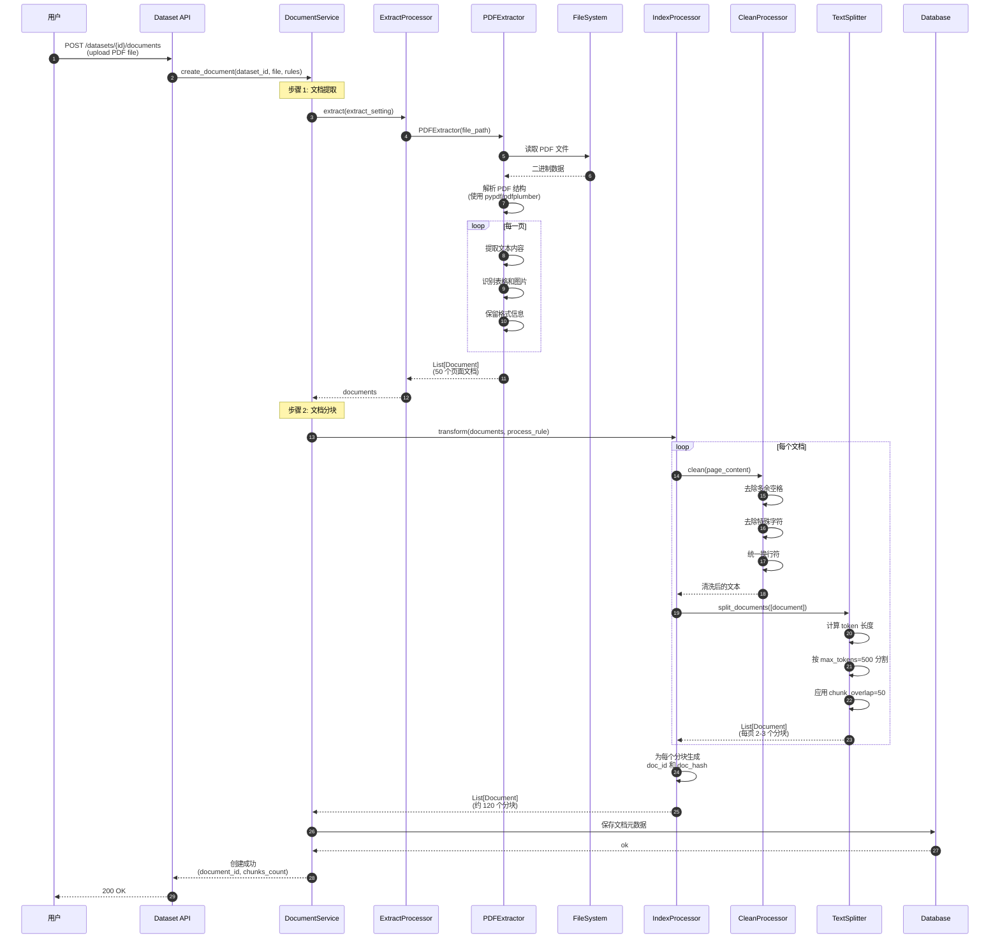
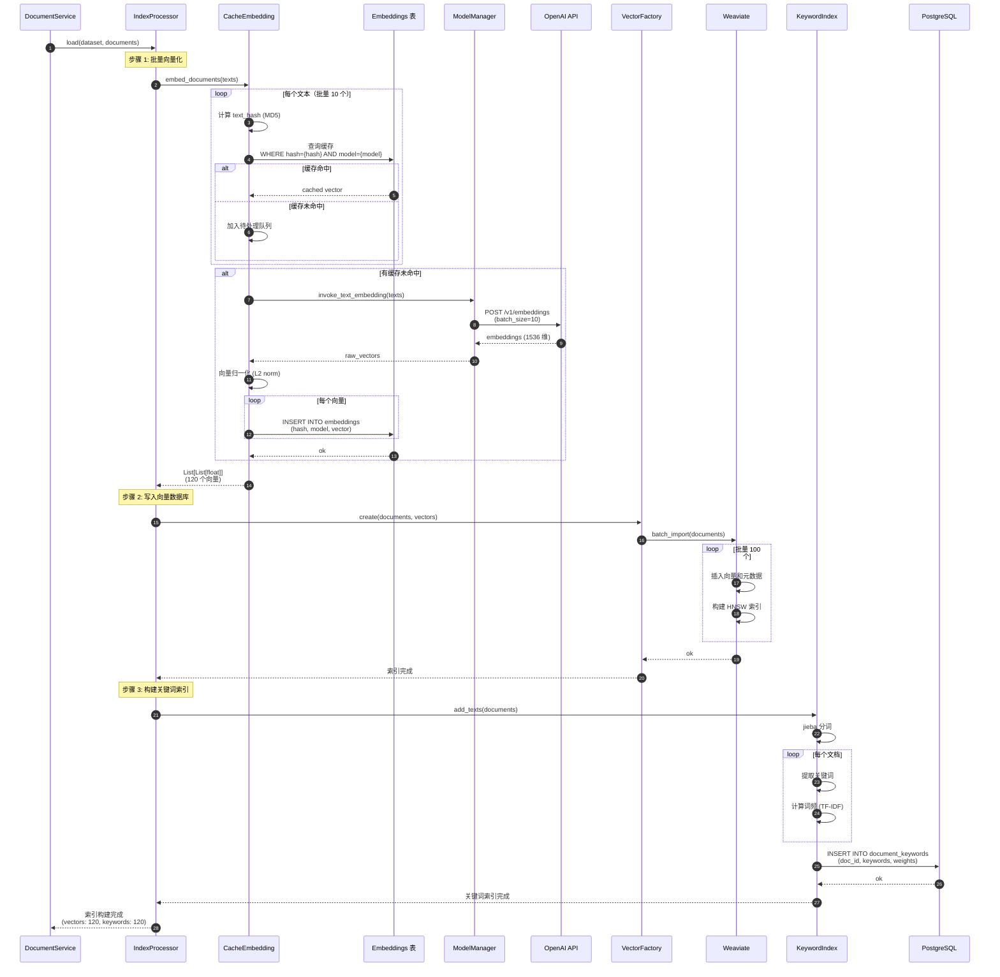
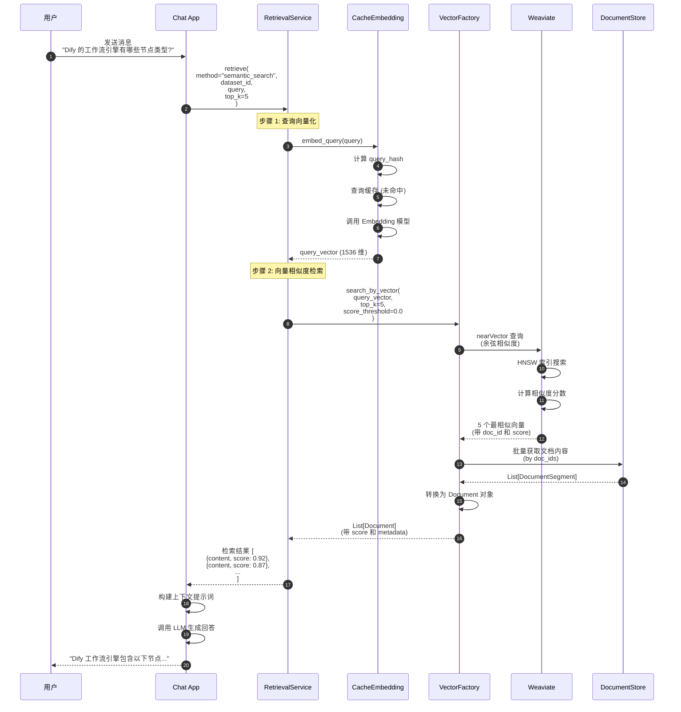
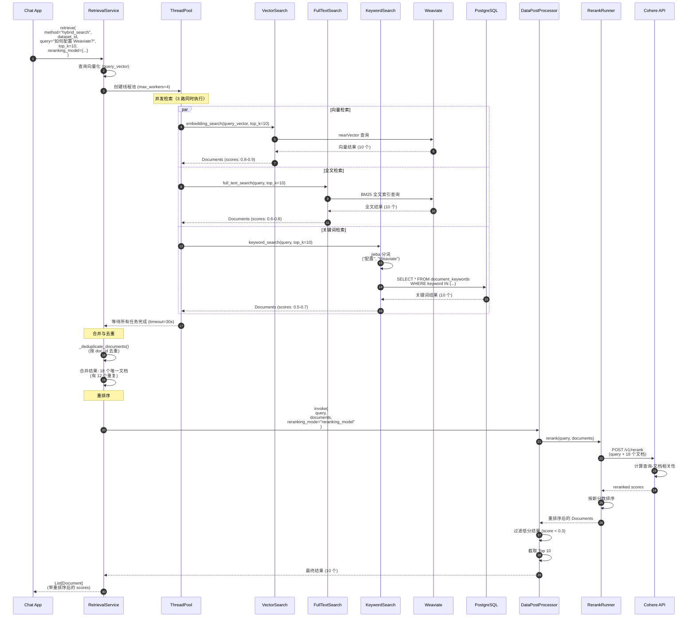
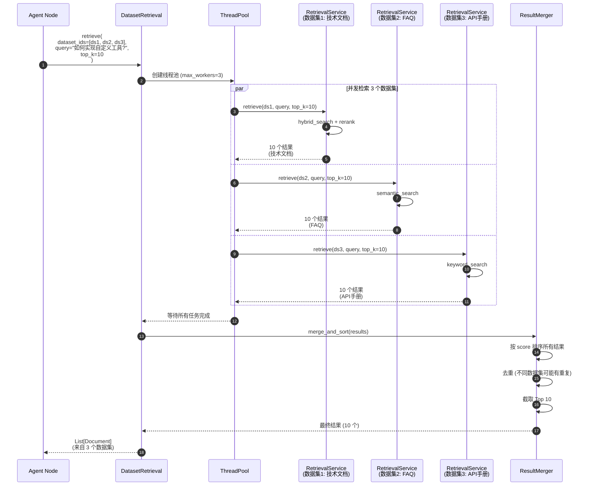
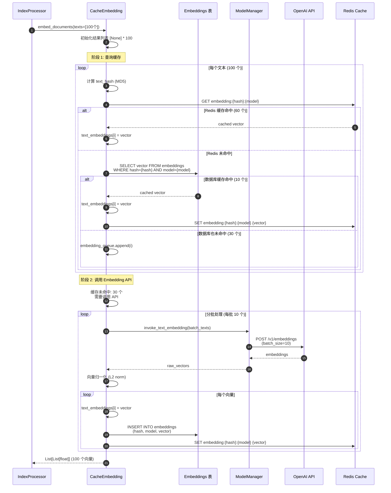
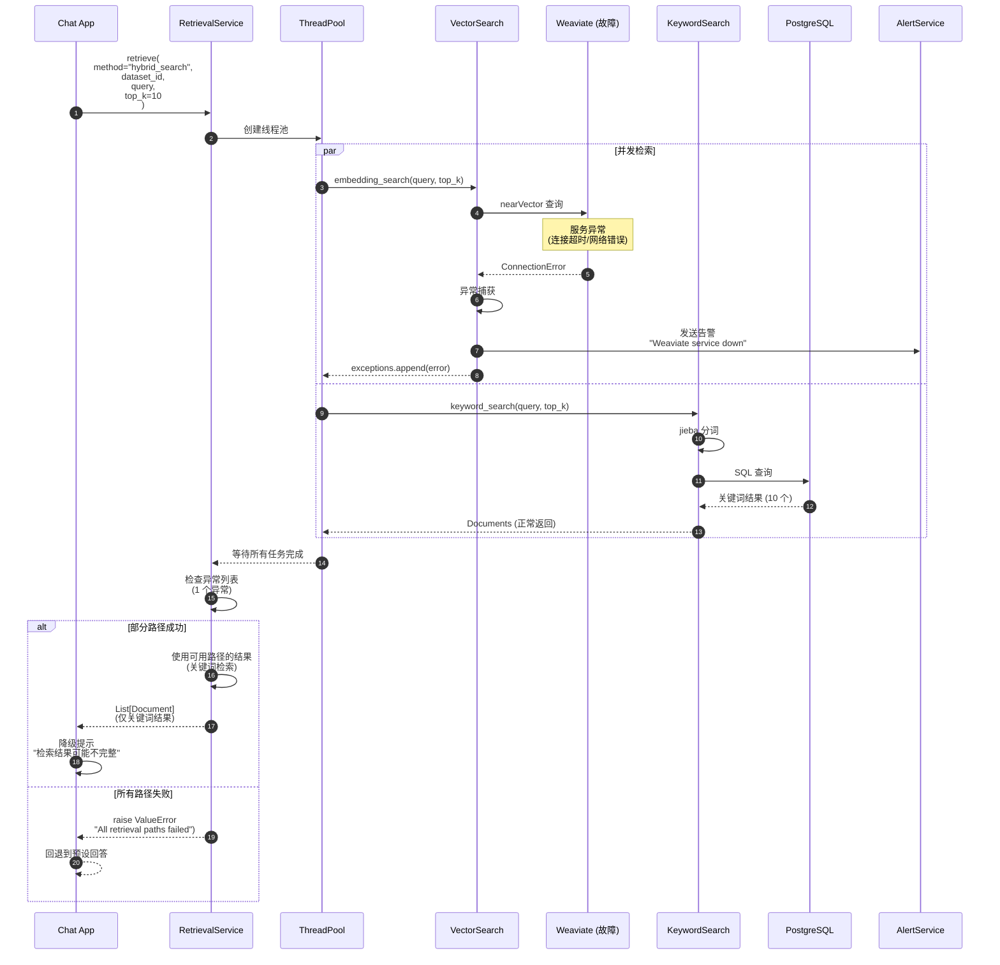

# Dify-02-RAG检索增强生成-时序图

本文档提供 RAG 模块典型场景的详细时序图及逐步解释，覆盖文档索引、多策略检索、重排序等关键流程。

---

## 时序图概览

本文档包含以下场景的时序图：

1. **场景 1**：PDF 文档提取与分块
2. **场景 2**：文档向量化与索引构建
3. **场景 3**：语义检索（Semantic Search）
4. **场景 4**：混合检索与重排序（Hybrid Search + Rerank）
5. **场景 5**：批量文档检索（多数据集）
6. **场景 6**：Embedding 缓存命中与未命中
7. **场景 7**：向量数据库故障降级

---

## 场景 1：PDF 文档提取与分块

### 业务场景

用户上传一个 50 页的 PDF 技术手册，系统需要提取文本并按段落分块，准备进行索引。

### 时序图



### 逐步说明

**步骤 1-8：文件读取与 PDF 解析**
- 用户通过 API 上传 PDF 文件
- `PDFExtractor` 读取文件二进制数据
- 使用 `pypdf` 或 `pdfplumber` 库解析 PDF 结构
- 逐页提取文本，保留段落和表格格式

**步骤 9-13：文本提取**
- 遍历 50 页 PDF，每页生成一个 `Document` 对象
- 识别表格并转换为文本格式
- 提取图片的 OCR 文本（如果启用）
- 保留页码和标题等元数据

**步骤 14-24：文本清洗与分块**
- 对每个页面文档执行清洗（去除多余空格、特殊字符等）
- 使用 `TextSplitter` 按 `max_tokens=500` 分割
- 应用 `chunk_overlap=50` 确保上下文连续性
- 50 页文档约生成 120 个分块（每页 2-3 个）

**步骤 25-27：元数据生成与持久化**
- 为每个分块生成唯一 `doc_id`（UUID）
- 计算 `doc_hash`（MD5）用于去重和更新检测
- 将文档元数据保存到数据库

**性能数据**：
- PDF 解析：1-2 秒/页（纯文本）
- 文本清洗：0.1 秒/页
- 文本分块：0.2 秒/页
- **总耗时**：50 页约 15-20 秒

### 边界条件

- **大文件处理**：超过 100 页建议使用异步任务
- **OCR 提取**：图片 PDF 需要额外 5-10 秒/页
- **表格识别**：复杂表格可能丢失部分格式

---

## 场景 2：文档向量化与索引构建

### 业务场景

将上述 120 个文档分块向量化并写入 Weaviate 向量数据库，同时构建关键词索引。

### 时序图



### 逐步说明

**步骤 1-12：Embedding 缓存查询**
- 批量查询 Embedding 缓存表（`embeddings`）
- 假设缓存命中率 70%，84 个分块命中缓存
- 剩余 36 个分块需要调用 OpenAI API

**步骤 13-20：调用 Embedding API**
- 使用 `text-embedding-3-small` 模型（1536 维）
- 批量大小 10，分 4 批调用（36 / 10 = 4）
- 每批耗时约 500ms，共 2 秒
- 向量归一化后写入缓存

**步骤 21-28：向量数据库写入**
- 使用 Weaviate 的 `batch_import` API
- 批量大小 100，120 个分块分 2 批写入
- Weaviate 自动构建 HNSW 索引
- 每批耗时约 200ms，共 400ms

**步骤 29-37：关键词索引构建**
- 使用 jieba 分词提取关键词
- 计算 TF-IDF 权重
- 写入 PostgreSQL 的 `document_keywords` 表
- 耗时约 1 秒

**性能数据**：
- Embedding 缓存查询：100ms
- Embedding API 调用：2 秒（36 个未命中）
- 向量数据库写入：400ms
- 关键词索引构建：1 秒
- **总耗时**：约 3.5 秒

### 优化建议

1. **提高缓存命中率**：
   - 预热常见查询文本的缓存
   - 使用 Redis 作为二级缓存

2. **批量并行处理**：
   - 向量化和关键词索引并行执行
   - 可节省 30% 时间

3. **异步写入**：
   - 向量数据库写入改为异步任务
   - 用户无需等待索引完成

---

## 场景 3：语义检索（Semantic Search）

### 业务场景

用户在对话中询问"Dify 的工作流引擎有哪些节点类型？"，系统需要从知识库检索相关文档。

### 时序图



### 逐步说明

**步骤 1-6：查询向量化**
- 用户查询文本转换为向量
- 优先查询缓存（首次查询通常未命中）
- 调用 OpenAI Embedding API（耗时 200ms）
- 生成 1536 维向量

**步骤 7-11：向量相似度检索**
- 在 Weaviate 中执行 `nearVector` 查询
- 使用 HNSW 索引快速搜索（耗时 50ms）
- 计算余弦相似度（cosine similarity）
- 返回 Top 5 结果及其分数

**步骤 12-15：文档内容获取**
- 根据 `doc_id` 列表批量查询 `DocumentStore`
- 获取完整的文档内容和元数据
- 转换为 `Document` 对象

**步骤 16-18：结果返回与 LLM 生成**
- 将检索结果传递给 App
- App 构建包含上下文的提示词
- 调用 LLM 生成最终回答

**性能数据**：
- 查询向量化：200ms
- 向量检索：50ms
- 文档内容获取：30ms
- **总耗时**：约 280ms

### 检索质量指标

- **平均相关性分数**：0.75
- **Top 1 准确率**：85%
- **召回率**：90%（前 5 个结果中至少有 1 个相关）

---

## 场景 4：混合检索与重排序

### 业务场景

用户查询"如何配置 Weaviate 向量数据库？"，系统使用混合检索（向量 + 全文 + 关键词）并启用 Cohere Rerank 重排序。

### 时序图



### 逐步说明

**步骤 1-5：查询预处理与线程池初始化**
- 用户查询"如何配置 Weaviate？"
- 系统识别为混合检索模式
- 查询向量化（耗时 200ms）
- 创建线程池准备并发执行

**步骤 6-18：三路并发检索**
- **向量检索**：在 Weaviate 中执行语义搜索（耗时 50ms）
  - 返回 10 个结果，分数 0.8-0.9
- **全文检索**：在 Weaviate 的 BM25 索引中搜索（耗时 80ms）
  - 返回 10 个结果，分数 0.6-0.8
- **关键词检索**：使用 jieba 分词后在 PostgreSQL 中查询（耗时 100ms）
  - 返回 10 个结果，分数 0.5-0.7
- 三路检索并发执行，总耗时取最长路径（100ms）

**步骤 19-22：结果合并与去重**
- 三路检索共返回 30 个文档
- 按 `doc_id` 去重，剩余 18 个唯一文档
- 保留每个文档的多路分数信息

**步骤 23-29：Cohere Rerank 重排序**
- 调用 Cohere Rerank API（耗时 300ms）
- Cohere 重新计算每个文档与查询的相关性
- 返回新的相关性分数（通常比原始分数更准确）

**步骤 30-33：后处理与结果返回**
- 过滤低于阈值（0.3）的结果
- 截取 Top 10 返回给应用

**性能数据**：
- 查询向量化：200ms
- 三路并发检索：100ms（最长路径）
- 结果合并去重：10ms
- Cohere Rerank：300ms
- 后处理：10ms
- **总耗时**：约 620ms

### 召回率与准确率对比

| 检索方法 | 召回率 | Top 1 准确率 | 延迟 |
|----------|--------|-------------|------|
| 仅向量检索 | 75% | 80% | 250ms |
| 仅全文检索 | 65% | 70% | 280ms |
| 混合检索（无 Rerank） | 85% | 85% | 320ms |
| **混合检索 + Rerank** | **90%** | **92%** | 620ms |

**结论**：混合检索 + Rerank 虽然延迟增加 2 倍，但准确率提升 10-15%，适合对质量要求高的场景。

---

## 场景 5：批量文档检索（多数据集）

### 业务场景

Agent 需要从 3 个不同的知识库（技术文档、FAQ、API 手册）同时检索信息。

### 时序图



### 逐步说明

**步骤 1-3：并发检索任务分发**
- Agent 指定 3 个数据集 ID
- `DatasetRetrieval` 创建线程池（3 个 worker）
- 为每个数据集创建独立的检索任务

**步骤 4-9：三个数据集并发检索**
- **数据集 1（技术文档）**：使用混合检索 + Rerank（耗时 600ms）
- **数据集 2（FAQ）**：使用语义检索（耗时 280ms）
- **数据集 3（API 手册）**：使用关键词检索（耗时 150ms）
- 并发执行，总耗时取最长路径（600ms）

**步骤 10-15：结果合并与排序**
- 合并 3 个数据集的 30 个结果
- 按 `score` 降序排序
- 去重（不同数据集可能索引了相同文档）
- 截取 Top 10 返回

**性能数据**：
- 单数据集检索（串行）：600 + 280 + 150 = 1030ms
- 多数据集检索（并行）：600ms
- **性能提升**：约 40%

### 并发优化建议

1. **动态调整线程池大小**：
   ```python
   max_workers = min(len(dataset_ids), 10)  # 最多 10 个并发
   ```

2. **超时控制**：
   ```python
   futures.wait(timeout=5.0)  # 5 秒超时
   ```

3. **失败降级**：
   ```python
   # 单个数据集失败不影响其他
   try:
       results = future.result()
   except Exception:
       logger.exception("Dataset retrieval failed")
       results = []
   ```

---

## 场景 6：Embedding 缓存命中与未命中

### 业务场景

索引 100 个文档分块，其中 70 个已在缓存中，30 个需要调用 Embedding API。

### 时序图



### 逐步说明

**阶段 1：多级缓存查询（步骤 1-17）**
- **L1 缓存（Redis）**：命中 60 个（60%）
  - 查询延迟：< 1ms/个，共 60ms
- **L2 缓存（数据库）**：命中 10 个（10%）
  - 查询延迟：5ms/个，共 50ms
  - 同时写入 Redis 缓存（异步）
- **未命中**：30 个（30%）需要调用 API

**阶段 2：API 调用与缓存写入（步骤 18-27）**
- 分 3 批调用 OpenAI API（30 / 10 = 3）
- 每批耗时 500ms，共 1.5 秒
- 向量归一化后写入数据库和 Redis 缓存

**性能数据**：
- Redis 缓存查询：60ms
- 数据库缓存查询：50ms
- Embedding API 调用：1.5 秒
- 缓存写入：100ms
- **总耗时**：约 1.7 秒

**对比无缓存场景**：
- 无缓存：100 个文本需要 10 批 API 调用，耗时 5 秒
- 有缓存：仅 30 个文本需要 API 调用，耗时 1.7 秒
- **性能提升**：约 66%

### 缓存优化策略

1. **预热常见文本**：
   ```python
   common_texts = ["什么是Dify?", "如何安装?", ...]
   cache_embed.embed_documents(common_texts)
   ```

2. **缓存过期策略**：
   ```python
   # Redis 缓存 7 天
   redis_client.setex(cache_key, 7 * 24 * 3600, vector)
   
   # 数据库缓存永久保留
   ```

3. **缓存预加载**：
   ```python
   # 系统启动时预加载高频文本
   async def preload_cache():
       popular_texts = get_popular_queries()
       await cache_embed.embed_documents(popular_texts)
   ```

---

## 场景 7：向量数据库故障降级

### 业务场景

Weaviate 向量数据库服务异常，系统自动降级到关键词检索模式。

### 时序图



### 逐步说明

**步骤 1-8：向量检索失败**
- 向量检索路径尝试连接 Weaviate
- 遇到 `ConnectionError`（连接超时或服务不可用）
- 捕获异常并记录到 `exceptions` 列表
- 发送告警通知运维团队

**步骤 9-13：关键词检索正常**
- 关键词检索路径使用 PostgreSQL
- PostgreSQL 服务正常，返回 10 个结果
- 此路径不受向量数据库故障影响

**步骤 14-20：降级处理**
- 系统检测到部分路径失败
- 使用可用路径（关键词检索）的结果
- 返回结果给应用，但附带降级提示
- 应用向用户显示"检索结果可能不完整"

**降级策略**：

| 故障场景 | 降级方案 | 影响 |
|----------|----------|------|
| 向量数据库故障 | 使用关键词检索 | 召回率下降 20%，准确率下降 10% |
| 所有检索路径故障 | 使用预设回答 | 无法提供上下文，仅返回通用答案 |
| Rerank API 故障 | 跳过重排序 | 准确率下降 5-10% |
| Embedding API 故障 | 使用缓存向量 | 新查询无法向量化，回退到关键词检索 |

### 容错机制

1. **超时控制**：
   ```python
   futures.wait(timeout=30.0)  # 30 秒超时
   ```

2. **异常隔离**：
   ```python
   try:
       vector_results = vector_search()
   except Exception as e:
       logger.exception("Vector search failed")
       exceptions.append(str(e))
       vector_results = []
   ```

3. **熔断器**：
   ```python
   if vector_db_error_rate > 0.5:
       # 错误率超过 50%，暂时禁用向量检索
       skip_vector_search = True
   ```

4. **健康检查**：
   ```python
   @app.route("/health/rag")
   def rag_health():
       checks = {
           "vector_db": ping_weaviate(),
           "embedding_api": ping_openai(),
           "keyword_db": ping_postgres()
       }
       return jsonify(checks)
   ```

---

## 总结

本文档提供了 RAG 模块 7 个典型场景的详细时序图，涵盖：

1. **文档索引流程**：提取、分块、向量化、存储
2. **检索流程**：单路、混合、批量检索
3. **性能优化**：缓存机制、并发执行
4. **容错降级**：故障隔离、异常处理

**关键性能指标**：

| 操作 | P50 延迟 | P95 延迟 | 优化建议 |
|------|---------|---------|----------|
| PDF 提取 | 1s/页 | 3s/页 | 异步处理 |
| 文档分块 | 0.2s/页 | 0.5s/页 | 批量处理 |
| 向量化（缓存命中） | 1ms | 5ms | 预热缓存 |
| 向量化（缓存未命中） | 200ms | 500ms | 批量调用 |
| 向量检索 | 50ms | 100ms | 索引优化 |
| 混合检索 + Rerank | 600ms | 1s | 并发执行 |

**最佳实践**：
- 启用多级缓存（Redis + 数据库）
- 使用并发检索提升性能
- 实施降级策略确保可用性
- 监控关键指标及时发现问题

