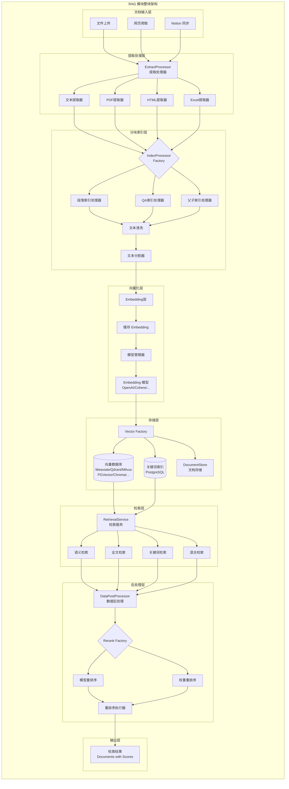
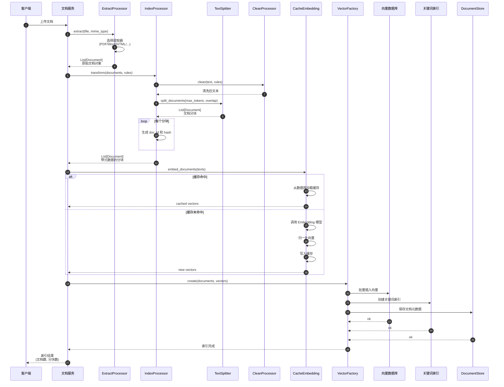
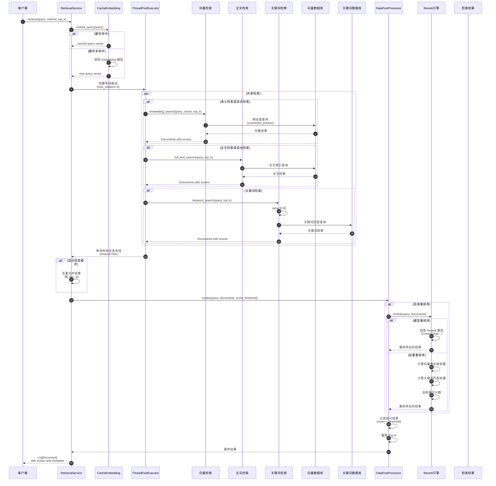
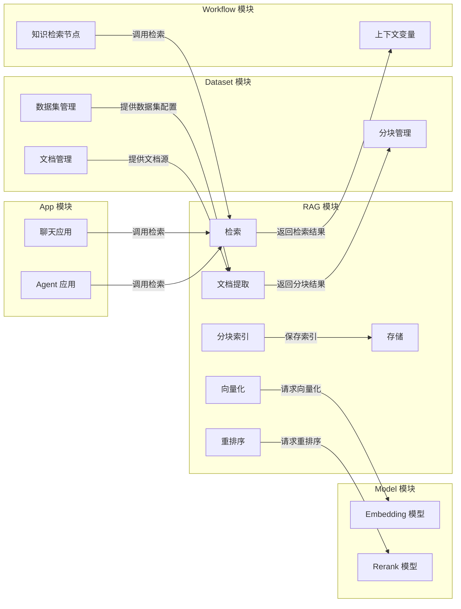

# Dify-02-RAG检索增强生成-概览

## 0. 摘要

RAG（Retrieval-Augmented Generation，检索增强生成）模块是 Dify 平台的核心功能之一，负责将外部知识库与大语言模型结合，通过文档索引、检索和上下文增强来提升模型生成质量。

**核心能力边界**：
- 文档提取与解析（支持 PDF、Word、Markdown、HTML、Excel、CSV 等多种格式）
- 智能文本分块（支持段落模式、QA模式、父子模式等多种分块策略）
- 向量化与索引构建（支持 Weaviate、Qdrant、Milvus、PGVector 等 20+ 种向量数据库）
- 多路检索（语义检索、全文检索、关键词检索、混合检索）
- 重排序与相关性优化（支持模型重排序和权重重排序）
- 缓存与性能优化（Embedding 缓存、Redis 缓存层）

**非目标**：
- 不包含文档源的持久化管理（由 Dataset 模块负责）
- 不直接处理用户对话逻辑（由 Workflow 和 App 模块负责）

**运行环境**：
- 语言：Python 3.10+
- 核心依赖：NumPy、SQLAlchemy、各向量数据库 SDK
- 部署形态：作为 Flask 应用的子模块集成，支持多线程并发检索

---

## 1. 整体架构图



**图解与要点**：

1. **分层设计**：RAG 模块采用严格的分层架构，从文档输入到结果输出共分为 8 个层次，每层职责清晰、解耦良好。

2. **组件职责**：
   - **文档输入层**：支持多种文档来源，包括直接上传、网页爬取和第三方平台同步
   - **提取处理层**：根据文档类型动态选择提取器，将原始文档转换为文本
   - **分块索引层**：根据索引策略（段落/QA/父子）对文本进行清洗、分割和结构化
   - **向量化层**：将文本片段转换为向量表示，支持多种 Embedding 模型和缓存机制
   - **存储层**：支持 20+ 种向量数据库，通过工厂模式统一接口
   - **检索层**：提供 4 种检索方法，支持多线程并发检索
   - **后处理层**：对检索结果进行重排序和相关性优化
   - **输出层**：返回包含相关性分数的文档列表

3. **数据流**：
   - **索引流**：文档 → 提取 → 分块 → 清洗 → Embedding → 向量库
   - **检索流**：查询 → Embedding → 向量检索/关键词检索 → 合并 → 重排序 → 结果

4. **并发控制**：
   - 检索层使用 `ThreadPoolExecutor` 实现多路检索并发执行
   - 向量化层使用批处理机制提高吞吐量
   - 缓存层使用 Redis 和数据库双层缓存

5. **扩展性**：
   - 通过工厂模式支持任意向量数据库接入
   - 通过策略模式支持任意分块策略
   - 通过插件机制支持任意 Embedding 模型

---

## 2. 全局时序图（典型索引与检索流程）

### 2.1 文档索引流程



**图解与要点**：

1. **入口**：客户端通过文档服务上传文档，支持多种格式（PDF、Word、Markdown、HTML、Excel 等）。

2. **提取阶段**（步骤 2-4）：
   - `ExtractProcessor` 根据文件 MIME 类型选择对应的提取器
   - 将原始文档转换为标准的 `Document` 对象（包含 `page_content` 和 `metadata`）
   - 支持结构化提取（如表格、标题层级等）

3. **分块阶段**（步骤 5-9）：
   - 先进行文本清洗（去除无效字符、统一格式）
   - 使用 `TextSplitter` 根据 `max_tokens` 和 `chunk_overlap` 分割文本
   - 为每个分块生成唯一 ID 和内容哈希（用于去重和更新检测）

4. **向量化阶段**（步骤 10-17）：
   - 使用 `CacheEmbedding` 进行向量化，优先从缓存加载
   - 缓存未命中时调用 Embedding 模型（OpenAI、Cohere 等）
   - 对向量进行归一化处理（L2 范数），确保相似度计算准确性
   - 将新生成的向量写入缓存（数据库表 `embeddings`）

5. **存储阶段**（步骤 18-23）：
   - 向量数据写入向量数据库（Weaviate、Qdrant、Milvus 等）
   - 同时创建关键词索引（基于 PostgreSQL 的 jieba 分词）
   - 文档元数据保存到 `DocumentStore`（用于后续检索结果的还原）

6. **幂等性**：
   - 通过 `doc_hash` 检测内容变化，相同内容不重复向量化
   - 支持增量更新和部分删除

7. **异常处理**：
   - 提取失败：记录错误并跳过该文档
   - 向量化失败：使用零向量占位，标记为待处理
   - 存储失败：回滚事务，保持数据一致性

---

### 2.2 文档检索流程



**图解与要点**：

1. **入口**（步骤 1-6）：
   - 客户端指定检索方法（`semantic_search`、`full_text_search`、`keyword_search`、`hybrid_search`）
   - 先将查询文本向量化，优先使用缓存

2. **多路并发检索**（步骤 7-22）：
   - 使用 `ThreadPoolExecutor` 并发执行多种检索方法
   - **语义检索**：在向量数据库中执行相似度查询（余弦相似度或点积）
   - **全文检索**：在向量数据库的全文索引中执行关键词匹配
   - **关键词检索**：使用 jieba 分词后在 PostgreSQL 中执行 SQL 查询
   - 所有检索任务并发执行，最长等待 30 秒

3. **结果合并**（步骤 23-25）：
   - 混合检索模式下，按 `doc_id` 去重合并多路结果
   - 保留每个来源的分数信息

4. **重排序阶段**（步骤 26-38）：
   - **模型重排序**：调用专门的 Rerank 模型（如 Cohere Rerank、Jina Rerank）重新计算相关性分数
   - **权重重排序**：基于向量相似度和关键词匹配度的加权融合
   - 公式：`final_score = α * vector_score + β * keyword_score`（α + β = 1）

5. **后处理**（步骤 39-41）：
   - 过滤低于阈值的结果（`score < score_threshold`）
   - 截取 Top N 结果返回给客户端

6. **性能优化**：
   - 并发检索将延迟降低至单路检索的 1/3
   - Embedding 缓存命中率可达 90%+，大幅减少模型调用成本
   - 向量数据库通常支持 P95 < 100ms 的查询延迟

7. **超时与回退**：
   - 检索超时 30 秒后返回已完成的结果
   - 单路检索失败不影响其他路径
   - 所有异常信息汇总返回，便于调试

---

## 3. 模块边界与交互图

### 3.1 RAG 模块与其他模块的交互



**模块交互说明**：

| 调用方 | 被调方 | 接口名称 | 调用类型 | 数据一致性 |
|--------|--------|----------|----------|------------|
| Dataset 模块 | RAG.ExtractProcessor | `extract()` | 同步 | 强一致性（事务内） |
| Dataset 模块 | RAG.IndexProcessor | `transform()` | 同步 | 强一致性（事务内） |
| Workflow 模块 | RAG.RetrievalService | `retrieve()` | 同步 | 最终一致性 |
| App 模块 | RAG.DatasetRetrieval | `retrieve()` | 同步 | 最终一致性 |
| RAG.CacheEmbedding | Model 模块 | `invoke_text_embedding()` | 同步 | 不要求 |
| RAG.DataPostProcessor | Model 模块 | `invoke_rerank()` | 同步 | 不要求 |

### 3.2 对外 API 提供方矩阵

| API 名称 | 提供者 | 调用者 | 用途 |
|---------|--------|--------|------|
| `ExtractProcessor.extract()` | RAG | Dataset 服务 | 文档提取 |
| `IndexProcessor.transform()` | RAG | Dataset 服务 | 文档分块 |
| `IndexProcessor.load()` | RAG | Dataset 服务 | 索引构建 |
| `RetrievalService.retrieve()` | RAG | Workflow、App | 文档检索 |
| `DatasetRetrieval.retrieve()` | RAG | App、Agent | 知识库检索 |
| `CacheEmbedding.embed_documents()` | RAG | 内部使用 | 文本向量化 |
| `Vector.create()` | RAG | 内部使用 | 向量存储 |
| `Keyword.add_texts()` | RAG | 内部使用 | 关键词索引 |

---

## 4. 关键设计与权衡

### 4.1 数据一致性

**强一致性场景**：
- 文档索引过程（Extract → Transform → Load）在同一事务内执行
- 向量数据库和关键词索引同步写入

**最终一致性场景**：
- Embedding 缓存更新（异步写入）
- 检索结果与最新索引存在秒级延迟

**事务边界**：
- 每个文档的索引过程为一个事务单元
- 批量索引时，单个文档失败不影响其他文档

### 4.2 锁与并发策略

**乐观锁**：
- 使用 `doc_hash` 检测文档内容变化
- 支持并发索引不同文档

**悲观锁**：
- 向量数据库写入时使用行级锁（依赖数据库实现）

**无锁并发**：
- 检索过程完全无锁，支持高并发读取
- 使用线程池隔离不同检索路径

### 4.3 性能关键路径

**P95 延迟目标**：
- 文档提取：< 5s（大文档可达 30s）
- 文档分块：< 1s
- Embedding 向量化：< 2s（批量 10 个文本）
- 向量检索：< 100ms
- 重排序：< 500ms（10 个文档）

**内存峰值**：
- 单个文档提取：< 500MB
- Embedding 批处理：< 200MB
- 检索结果缓存：< 50MB

**I/O 热点**：
- 向量数据库查询（高频读）
- Embedding 缓存表查询（高频读）
- 文档分块表写入（中频写）

### 4.4 可观测性指标

| 指标名称 | 类型 | 含义 | 阈值建议 |
|---------|------|------|----------|
| `rag.extract.duration` | 直方图 | 文档提取耗时 | P95 < 5s |
| `rag.embed.cache_hit_rate` | 百分比 | Embedding 缓存命中率 | > 90% |
| `rag.retrieve.duration` | 直方图 | 检索总耗时 | P95 < 500ms |
| `rag.retrieve.results_count` | 直方图 | 检索结果数量 | 中位数 4-10 |
| `rag.rerank.duration` | 直方图 | 重排序耗时 | P95 < 500ms |
| `rag.vector_db.error_rate` | 百分比 | 向量库错误率 | < 1% |

### 4.5 配置项说明

| 配置项 | 默认值 | 影响 | 建议值 |
|--------|--------|------|--------|
| `INDEXING_MAX_SEGMENTATION_TOKENS_LENGTH` | 1000 | 分块最大长度 | 500-2000（根据模型上下文窗口调整） |
| `RETRIEVAL_SERVICE_EXECUTORS` | 4 | 检索并发线程数 | CPU 核心数 |
| `VECTOR_STORE` | `weaviate` | 向量数据库类型 | 根据规模选择（小规模用 Chroma，大规模用 Qdrant/Milvus） |
| `EMBEDDING_CACHE_ENABLED` | `true` | 是否启用缓存 | 生产环境必开 |
| `DEFAULT_TOP_K` | 4 | 默认检索数量 | 2-10（过多影响 LLM 性能） |
| `DEFAULT_SCORE_THRESHOLD` | 0.0 | 默认相关性阈值 | 0.3-0.7（过高导致召回不足） |

---

## 5. 典型使用示例与最佳实践

### 5.1 示例 1：基本文档索引流程

```python
from core.rag.extractor.extract_processor import ExtractProcessor
from core.rag.index_processor.index_processor_factory import IndexProcessorFactory
from core.rag.extractor.entity.extract_setting import ExtractSetting
from models.dataset import Dataset, DatasetProcessRule

# 1. 准备数据集和文档
dataset = Dataset.query.filter_by(id="dataset_id").first()
file_path = "/path/to/document.pdf"

# 2. 提取文档内容
extract_setting = ExtractSetting(
    datasource_type="upload_file",
    upload_file=file_path,
    document_model="parse_by_server"
)
documents = ExtractProcessor.extract(
    extract_setting=extract_setting,
    is_automatic=True
)

# 3. 文档分块
process_rule = {
    "mode": "custom",
    "rules": {
        "segmentation": {
            "max_tokens": 500,
            "chunk_overlap": 50,
            "separator": "\n\n"
        }
    }
}
index_processor = IndexProcessorFactory.create(
    index_type="paragraph",
    dataset=dataset
)
chunks = index_processor.transform(
    documents=documents,
    process_rule=process_rule,
    embedding_model_instance=dataset.embedding_model_instance
)

# 4. 构建索引
index_processor.load(
    dataset=dataset,
    documents=chunks,
    with_keywords=True
)

print(f"索引完成，共生成 {len(chunks)} 个文档分块")
```

**适用场景**：需要对上传的文档进行索引时使用。

**注意事项**：
- 确保 `dataset` 已配置 Embedding 模型
- `max_tokens` 需要根据模型上下文窗口调整
- 大文档建议使用异步任务处理

### 5.2 示例 2：多策略检索与重排序

```python
from core.rag.datasource.retrieval_service import RetrievalService

# 1. 混合检索（向量 + 全文）
documents = RetrievalService.retrieve(
    retrieval_method="hybrid_search",
    dataset_id="dataset_id",
    query="什么是 Dify 的工作流引擎？",
    top_k=10,
    score_threshold=0.3,
    reranking_model={
        "reranking_provider_name": "cohere",
        "reranking_model_name": "rerank-multilingual-v2.0"
    },
    reranking_mode="reranking_model"
)

# 2. 处理检索结果
for doc in documents:
    print(f"相关性分数: {doc.metadata['score']:.4f}")
    print(f"文档ID: {doc.metadata['doc_id']}")
    print(f"内容: {doc.page_content[:200]}...")
    print("-" * 80)
```

**适用场景**：需要高召回率和高准确率时使用混合检索。

**性能考虑**：
- 混合检索比单路检索慢 2-3 倍，但召回率提升 20-30%
- Rerank 模型调用有额外延迟（100-500ms），但准确率提升显著
- 生产环境建议启用 Embedding 缓存

### 5.3 示例 3：自定义分块策略

```python
from core.rag.splitter.fixed_text_splitter import FixedRecursiveCharacterTextSplitter
from core.rag.models.document import Document

# 1. 创建自定义分割器
splitter = FixedRecursiveCharacterTextSplitter.from_encoder(
    chunk_size=300,  # 较小的分块，适合短文本匹配
    chunk_overlap=30,  # 10% 重叠
    fixed_separator="\n",  # 按段落分割
    separators=["\n\n", "。", ". ", " ", ""],  # 分隔符优先级
    embedding_model_instance=embedding_model
)

# 2. 分割文档
doc = Document(
    page_content="长篇文档内容...",
    metadata={"source": "custom"}
)
chunks = splitter.split_documents([doc])

# 3. 分析分块结果
avg_length = sum(len(c.page_content) for c in chunks) / len(chunks)
print(f"平均分块长度: {avg_length:.0f} 字符")
print(f"分块数量: {len(chunks)}")
```

**适用场景**：
- 需要精细控制分块粒度
- 处理特殊格式文档（如代码、诗歌、对话）

**参数调优建议**：
- **通用文档**：chunk_size=500, overlap=50
- **代码文档**：chunk_size=1000, overlap=100, separator="\n\n"
- **FAQ 文档**：chunk_size=200, overlap=20, 使用 QA 模式
- **长文档**：chunk_size=800, overlap=80, 使用父子模式

### 5.4 最佳实践清单

**索引阶段**：
- ✅ 启用 Embedding 缓存（节省 80% 成本）
- ✅ 根据文档类型选择合适的分块策略
- ✅ 设置合理的 `max_tokens`（过大影响检索精度，过小导致上下文丢失）
- ✅ 使用异步任务处理大批量文档
- ❌ 避免在同一文档中使用多种分块策略
- ❌ 避免频繁重建索引（增量更新更高效）

**检索阶段**：
- ✅ 优先使用混合检索（召回率更高）
- ✅ 启用重排序（准确率提升 10-20%）
- ✅ 根据场景调整 `top_k`（对话场景 4-6，Agent 场景 8-10）
- ✅ 设置合理的 `score_threshold`（过滤低相关性结果）
- ✅ 使用多线程并发检索多个数据集
- ❌ 避免在 UI 同步调用检索（使用 SSE 流式返回）
- ❌ 避免检索结果过多（影响 LLM 推理速度）

**生产环境**：
- ✅ 配置向量数据库连接池（避免连接耗尽）
- ✅ 启用 Redis 缓存层（减少数据库压力）
- ✅ 监控 Embedding 缓存命中率（低于 80% 需优化）
- ✅ 设置检索超时时间（避免长时间等待）
- ✅ 使用专用 Rerank 模型（比通用 LLM 更快更准）

**规模化注意事项**：
- 数据集超过 10 万文档时，建议使用 Milvus 或 Qdrant
- Embedding 缓存表需要定期清理（保留最近 6 个月）
- 向量数据库需要定期优化索引（提升查询速度）
- 考虑使用多租户隔离（不同 dataset 使用不同 collection）

---

## 6. 子系统详解

### 6.1 文档提取子系统

**职责**：将各种格式的文档转换为统一的文本表示。

**支持的文档类型**：
- **文本类**：TXT、Markdown、HTML、CSV
- **文档类**：PDF、Word（.doc/.docx）、PPT（.ppt/.pptx）
- **表格类**：Excel（.xls/.xlsx）、CSV
- **邮件类**：EML、MSG
- **其他**：EPUB、XML、Notion（通过 API）

**核心组件**：
- `ExtractProcessor`：提取流程编排器
- `PDFExtractor`：PDF 提取器（支持文本和 OCR）
- `WordExtractor`：Word 文档提取器
- `ExcelExtractor`：Excel 表格提取器
- `HTMLExtractor`：HTML 网页提取器

**扩展点**：
- 支持自定义提取器（实现 `BaseExtractor` 接口）
- 支持第三方提取服务（如 Jina Reader、Firecrawl）

### 6.2 分块索引子系统

**职责**：将提取的文本分割成适合检索的片段。

**分块模式**：
1. **段落模式（Paragraph）**：
   - 按 token 长度均匀分割
   - 适用场景：通用文档、知识库
   
2. **QA 模式（Question-Answer）**：
   - 基于 LLM 生成问答对
   - 适用场景：FAQ、客服知识库
   
3. **父子模式（Parent-Child）**：
   - 分为父分块（大）和子分块（小）
   - 检索用子分块，返回用父分块
   - 适用场景：长文档、技术手册

**核心组件**：
- `TextSplitter`：文本分割器基类
- `FixedRecursiveCharacterTextSplitter`：固定长度分割器
- `EnhanceRecursiveCharacterTextSplitter`：增强型分割器
- `CleanProcessor`：文本清洗器

### 6.3 向量化与存储子系统

**职责**：将文本片段转换为向量并存储到向量数据库。

**向量化流程**：
1. 查询 Embedding 缓存
2. 缓存未命中则调用 Embedding 模型
3. 向量归一化（L2 范数）
4. 写入缓存和向量数据库

**支持的向量数据库**（20+ 种）：
- **开源**：Weaviate、Qdrant、Milvus、Chroma、PGVector
- **云服务**：Pinecone、Zilliz、Elasticsearch
- **国内**：阿里云 AnalyticDB、腾讯云向量数据库、百度向量数据库

**核心组件**：
- `CacheEmbedding`：带缓存的 Embedding 封装
- `Vector`：向量数据库统一接口
- `VectorFactory`：向量数据库工厂

### 6.4 检索子系统

**职责**：根据查询从向量数据库中检索相关文档。

**检索方法**：
1. **语义检索（Semantic Search）**：基于向量相似度
2. **全文检索（Full-Text Search）**：基于关键词匹配
3. **关键词检索（Keyword Search）**：基于 jieba 分词
4. **混合检索（Hybrid Search）**：组合多种方法

**检索策略**：
- 多线程并发检索（`ThreadPoolExecutor`）
- 结果去重与合并
- 分数归一化

**核心组件**：
- `RetrievalService`：检索服务核心
- `DatasetRetrieval`：知识库检索封装

### 6.5 重排序子系统

**职责**：对检索结果进行二次排序，提升相关性。

**重排序模式**：
1. **模型重排序（Reranking Model）**：
   - 使用专门的 Rerank 模型（Cohere、Jina 等）
   - 准确率高，但延迟较大（100-500ms）
   
2. **权重重排序（Weighted Score）**：
   - 基于向量分数和关键词分数的加权融合
   - 速度快，但准确率略低

**核心组件**：
- `DataPostProcessor`：后处理编排器
- `RerankModelRunner`：模型重排序执行器
- `WeightRerankRunner`：权重重排序执行器

---

## 7. 性能优化技巧

### 7.1 索引性能优化

1. **批量处理**：
   ```python
   # 不推荐：逐个文档索引
   for doc in documents:
       index_processor.load(dataset, [doc])
   
   # 推荐：批量索引
   index_processor.load(dataset, documents)
   ```

2. **异步处理**：
   ```python
   # 使用 Celery 异步任务
   from tasks.document_indexing_task import document_indexing_task
   
   document_indexing_task.delay(
       dataset_id=dataset.id,
       document_ids=[doc.id for doc in documents]
   )
   ```

3. **增量更新**：
   ```python
   # 只索引新增和修改的文档
   new_chunks = [c for c in chunks if c.metadata['doc_hash'] not in existing_hashes]
   ```

### 7.2 检索性能优化

1. **合理设置 top_k**：
   ```python
   # 对话场景：4-6 个结果足够
   documents = RetrievalService.retrieve(
       retrieval_method="semantic_search",
       dataset_id=dataset_id,
       query=query,
       top_k=5  # 不要设置过大
   )
   ```

2. **使用缓存**：
   ```python
   # 为高频查询启用结果缓存
   cache_key = f"retrieve:{dataset_id}:{query_hash}"
   cached_results = redis_client.get(cache_key)
   if cached_results:
       return json.loads(cached_results)
   ```

3. **并发检索多个数据集**：
   ```python
   from concurrent.futures import ThreadPoolExecutor
   
   with ThreadPoolExecutor(max_workers=4) as executor:
       futures = [
           executor.submit(RetrievalService.retrieve, dataset_id=ds_id, query=query)
           for ds_id in dataset_ids
       ]
       results = [f.result() for f in futures]
   ```

### 7.3 内存优化

1. **流式处理大文件**：
   ```python
   # 不推荐：一次性加载大文件
   content = file.read()
   
   # 推荐：分块读取
   for chunk in read_file_in_chunks(file_path, chunk_size=1024*1024):
       process_chunk(chunk)
   ```

2. **及时释放资源**：
   ```python
   # 显式关闭数据库连接
   db.session.close()
   
   # 清理临时变量
   del large_documents
   import gc
   gc.collect()
   ```

---

## 8. 故障排查指南

### 8.1 常见问题

**问题 1：Embedding 缓存命中率低**
- **原因**：查询文本差异大、缓存失效
- **解决方案**：
  - 检查缓存表大小和索引
  - 增加缓存保留时间
  - 使用查询改写（Query Rewrite）

**问题 2：检索结果不相关**
- **原因**：分块粒度不合适、Embedding 模型不匹配
- **解决方案**：
  - 调整 `max_tokens` 和 `chunk_overlap`
  - 更换更好的 Embedding 模型（如 OpenAI text-embedding-3）
  - 启用重排序

**问题 3：向量数据库连接超时**
- **原因**：连接池耗尽、网络延迟
- **解决方案**：
  - 增加连接池大小
  - 检查向量数据库负载
  - 使用本地部署的向量数据库

**问题 4：索引速度慢**
- **原因**：Embedding 模型调用慢、向量数据库写入慢
- **解决方案**：
  - 使用更快的 Embedding 模型
  - 启用批量写入
  - 使用异步任务

### 8.2 调试技巧

1. **查看检索详情**：
   ```python
   documents = RetrievalService.retrieve(...)
   for doc in documents:
       logger.info(f"DocID: {doc.metadata['doc_id']}")
       logger.info(f"Score: {doc.metadata['score']}")
       logger.info(f"Content: {doc.page_content[:100]}")
   ```

2. **分析分块质量**：
   ```python
   chunks = index_processor.transform(documents, process_rule)
   for i, chunk in enumerate(chunks[:10]):
       print(f"分块 {i}: 长度={len(chunk.page_content)} 字符")
       print(chunk.page_content)
       print("-" * 80)
   ```

3. **测试 Embedding 缓存**：
   ```python
   from core.rag.embedding.cached_embedding import CacheEmbedding
   
   cache_embed = CacheEmbedding(model_instance)
   texts = ["测试文本1", "测试文本2"]
   
   # 第一次调用（未命中）
   start = time.time()
   vectors1 = cache_embed.embed_documents(texts)
   print(f"首次耗时: {time.time() - start:.2f}s")
   
   # 第二次调用（命中）
   start = time.time()
   vectors2 = cache_embed.embed_documents(texts)
   print(f"缓存耗时: {time.time() - start:.2f}s")
   ```

---

## 9. 扩展与定制

### 9.1 添加自定义提取器

```python
from core.rag.extractor.extractor_base import BaseExtractor
from core.rag.models.document import Document

class CustomExtractor(BaseExtractor):
    def extract(self) -> list[Document]:
        # 实现自定义提取逻辑
        content = self._extract_content()
        return [Document(
            page_content=content,
            metadata={"source": "custom"}
        )]
    
    def _extract_content(self) -> str:
        # 具体提取逻辑
        pass

# 注册提取器
from core.rag.extractor.extract_processor import ExtractProcessor
ExtractProcessor.register_extractor("custom_type", CustomExtractor)
```

### 9.2 添加自定义向量数据库

```python
from core.rag.datasource.vdb.vector_base import BaseVector
from core.rag.datasource.vdb.vector_factory import AbstractVectorFactory

class CustomVector(BaseVector):
    def create(self, documents: list[Document]):
        # 实现向量创建逻辑
        pass
    
    def search_by_vector(self, query_vector: list[float], top_k: int):
        # 实现向量检索逻辑
        pass

class CustomVectorFactory(AbstractVectorFactory):
    def init_vector(self, dataset, attributes, embeddings) -> BaseVector:
        return CustomVector(dataset, attributes, embeddings)

# 注册向量数据库
from core.rag.datasource.vdb.vector_factory import Vector
Vector.register_vector_type("custom_vdb", CustomVectorFactory)
```

### 9.3 添加自定义重排序器

```python
from core.rag.rerank.rerank_base import BaseRerankRunner

class CustomRerankRunner(BaseRerankRunner):
    def run(self, query: str, documents: list[Document], **kwargs):
        # 实现自定义重排序逻辑
        scored_docs = []
        for doc in documents:
            score = self._calculate_custom_score(query, doc)
            doc.metadata['score'] = score
            scored_docs.append(doc)
        
        return sorted(scored_docs, key=lambda d: d.metadata['score'], reverse=True)
    
    def _calculate_custom_score(self, query: str, doc: Document) -> float:
        # 自定义评分逻辑
        pass

# 注册重排序器
from core.rag.rerank.rerank_factory import RerankRunnerFactory
RerankRunnerFactory.register_runner("custom_rerank", CustomRerankRunner)
```

---

## 10. 总结

RAG 模块是 Dify 平台的核心能力之一，通过文档提取、智能分块、向量化索引、多路检索和重排序等技术，实现了高效的知识库检索增强生成。

**核心优势**：
- 支持 20+ 种文档格式和 20+ 种向量数据库
- 提供 4 种检索方法和 2 种重排序模式
- Embedding 缓存机制大幅降低成本
- 多线程并发检索提升性能
- 灵活的扩展机制支持自定义组件

**适用场景**：
- 企业知识库问答
- 技术文档检索
- 客服机器人
- 智能搜索引擎

**下一步**：
- 参考 `Dify-02-RAG检索增强生成-API.md` 了解详细 API 规格
- 参考 `Dify-02-RAG检索增强生成-数据结构.md` 了解核心数据结构
- 参考 `Dify-02-RAG检索增强生成-时序图.md` 了解典型调用时序

