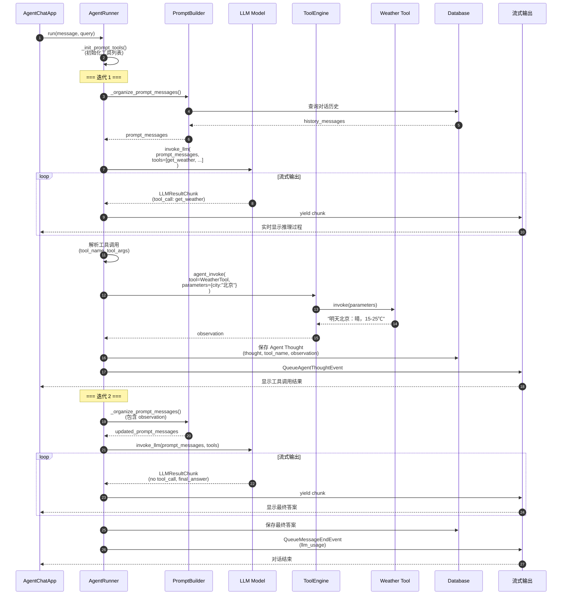
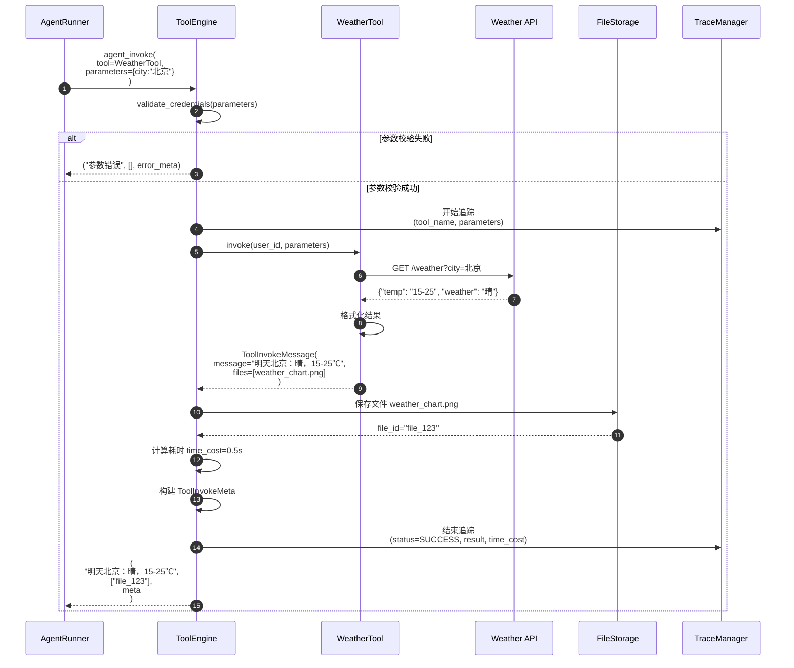

# Dify-03-Agent智能体系统-API

本文档详细描述 Agent 模块对外提供的核心 API，包括请求/响应结构、入口函数、调用链、时序图和最佳实践。

---

## API 概览

| API 名称 | 功能 | 调用者 | 幂等性 |
|----------|------|--------|--------|
| `AgentRunner.run()` | Agent 推理执行 | AgentChat App | 否 |
| `BaseAgentRunner._init_prompt_tools()` | 初始化工具列表 | 内部使用 | 是 |
| `BaseAgentRunner._organize_prompt_messages()` | 构建提示词 | 内部使用 | 是 |
| `ToolEngine.agent_invoke()` | 执行工具调用 | AgentRunner | 否 |
| `CotOutputParser.parse()` | 解析 CoT 输出 | CotAgentRunner | 是 |
| `AgentHistoryPromptTransform.transform()` | 转换对话历史 | BaseAgentRunner | 是 |

---

## API 1: AgentRunner.run()

### 基本信息

- **名称**：`AgentRunner.run()`
- **功能**：执行 Agent 推理循环，自主调用工具完成任务
- **调用类型**：同步生成器（Generator）
- **幂等性**：否（每次执行可能产生不同结果）

### 请求结构体

```python
run(
    message: Message,           # 消息对象
    query: str,                # 用户查询文本
    inputs: dict = {}          # 额外输入参数
) -> Generator[LLMResultChunk, None, None]
```

**字段表**：

| 字段 | 类型 | 必填 | 约束/默认 | 说明 |
|------|------|------|-----------|------|
| `message` | Message | 是 | 非空 | 当前消息对象（包含 conversation_id） |
| `query` | str | 是 | 非空字符串 | 用户查询文本 |
| `inputs` | dict | 否 | 默认 {} | 外部输入参数（用于填充提示词变量） |

### 响应结构体

```python
# 生成器返回的事件类型
Union[
    LLMResultChunk,              # LLM 流式输出片段
    QueueAgentThoughtEvent,      # Agent 推理步骤事件
    QueueMessageEndEvent         # 消息结束事件
]
```

**事件字段表**：

| 事件类型 | 字段 | 说明 |
|----------|------|------|
| `LLMResultChunk` | `delta.message.content` | LLM 生成的文本片段 |
| `QueueAgentThoughtEvent` | `agent_thought_id` | 推理步骤唯一 ID |
| `QueueAgentThoughtEvent` | `thought` | LLM 的思考内容 |
| `QueueAgentThoughtEvent` | `tool_name` | 调用的工具名称 |
| `QueueAgentThoughtEvent` | `tool_input` | 工具调用参数 |
| `QueueAgentThoughtEvent` | `observation` | 工具返回结果 |
| `QueueMessageEndEvent` | `llm_usage` | LLM Token 用量统计 |

### 入口函数与核心代码

```python
# api/core/agent/fc_agent_runner.py

class FunctionCallAgentRunner(BaseAgentRunner):
    def run(
        self, 
        message: Message, 
        query: str, 
        **kwargs
    ) -> Generator[LLMResultChunk, None, None]:
        """
        执行 Function Call Agent 推理
        
        参数:
            message: 消息对象
            query: 用户查询
        
        返回:
            生成器（流式返回推理结果）
        """
        self.query = query
        app_config = self.app_config
        
        # 1. 初始化工具
        tool_instances, prompt_messages_tools = self._init_prompt_tools()
        
        # 2. 初始化迭代参数
        iteration_step = 1
        max_iteration_steps = min(app_config.agent.max_iteration, 99) + 1
        function_call_state = True
        llm_usage = {"usage": None}
        final_answer = ""
        
        # 3. 推理循环
        while function_call_state and iteration_step <= max_iteration_steps:
            function_call_state = False
            
            # 3.1 最后一轮移除工具（强制输出答案）
            if iteration_step == max_iteration_steps:
                prompt_messages_tools = []
            
            # 3.2 创建推理步骤记录
            agent_thought_id = self.create_agent_thought(
                message_id=message.id,
                message="",
                tool_name="",
                tool_input="",
                messages_ids=[]
            )
            
            # 3.3 构建提示词
            prompt_messages = self._organize_prompt_messages()
            self.recalc_llm_max_tokens(self.model_config, prompt_messages)
            
            # 3.4 调用 LLM
            chunks = self.model_instance.invoke_llm(
                prompt_messages=prompt_messages,
                model_parameters=self.application_generate_entity.model_conf.parameters,
                tools=prompt_messages_tools,
                stop=self.application_generate_entity.model_conf.stop,
                stream=self.stream_tool_call,
                user=self.user_id,
                callbacks=[],
            )
            
            # 3.5 处理 LLM 输出
            tool_calls = []
            response = ""
            current_llm_usage = None
            
            if isinstance(chunks, Generator):
                # 流式处理
                for chunk in chunks:
                    if isinstance(chunk, LLMResultChunk):
                        # 解析工具调用
                        if chunk.delta.message.tool_calls:
                            for tool_call in chunk.delta.message.tool_calls:
                                tool_calls.append((
                                    tool_call.function.name,
                                    tool_call.id,
                                    tool_call.function.arguments
                                ))
                        
                        # 累积响应文本
                        if chunk.delta.message.content:
                            response += chunk.delta.message.content
                            yield chunk
                        
                        # 记录 Token 用量
                        if chunk.delta.usage:
                            current_llm_usage = chunk.delta.usage
            
            # 3.6 执行工具调用
            if tool_calls:
                function_call_state = True
                
                for tool_name, tool_call_id, tool_call_args in tool_calls:
                    # 获取工具实例
                    tool_instance = tool_instances.get(tool_name)
                    if not tool_instance:
                        observation = f"Tool {tool_name} not found"
                    else:
                        # 解析参数
                        try:
                            tool_parameters = json.loads(tool_call_args)
                        except json.JSONDecodeError:
                            observation = f"Invalid tool arguments: {tool_call_args}"
                            continue
                        
                        # 调用工具
                        observation, message_files, tool_invoke_meta = ToolEngine.agent_invoke(
                            tool=tool_instance,
                            tool_parameters=tool_parameters,
                            user_id=self.user_id,
                            tenant_id=self.tenant_id,
                            message=message,
                            invoke_from=self.application_generate_entity.invoke_from,
                            agent_tool_callback=self.agent_callback,
                            trace_manager=self.application_generate_entity.trace_manager,
                        )
                    
                    # 发布推理步骤事件
                    self.queue_manager.publish(
                        QueueAgentThoughtEvent(
                            agent_thought_id=agent_thought_id,
                            thought=response,
                            tool_name=tool_name,
                            tool_input=tool_call_args,
                            observation=observation,
                        ),
                        PublishFrom.APPLICATION_MANAGER
                    )
                    
                    # 更新 Agent Scratchpad
                    self.update_agent_thought(
                        agent_thought_id=agent_thought_id,
                        tool_name=tool_name,
                        tool_input=tool_call_args,
                        observation=observation,
                    )
            else:
                # 无工具调用，输出最终答案
                final_answer = response
            
            # 3.7 累积 Token 用量
            if current_llm_usage:
                self.increase_usage(llm_usage, current_llm_usage)
            
            # 3.8 下一轮迭代
            iteration_step += 1
        
        # 4. 发布结束事件
        yield QueueMessageEndEvent(
            llm_usage=llm_usage["usage"],
        )
```

**逐步说明**：
1. **步骤 1**：初始化工具列表（从配置中加载）
2. **步骤 2**：初始化迭代参数（最大迭代次数、状态标志）
3. **步骤 3**：进入推理循环，直到无工具调用或达到最大迭代次数
4. **步骤 3.1**：最后一轮移除工具，强制 LLM 输出答案
5. **步骤 3.2-3.4**：构建提示词并调用 LLM
6. **步骤 3.5**：流式处理 LLM 输出，解析工具调用
7. **步骤 3.6**：执行工具调用，发布推理步骤事件
8. **步骤 3.7-3.8**：累积用量，进入下一轮迭代

### 调用链与上游函数

```python
# api/core/app/apps/agent_chat/agent_chat_app_runner.py

class AgentChatAppRunner(AppRunner):
    def run(
        self,
        conversation: Conversation,
        message: Message,
        query: str,
    ) -> Generator:
        """AgentChat App 运行器（上游调用方）"""
        # 1. 初始化 Agent Runner
        if self.app_config.agent.strategy == AgentStrategy.FUNCTION_CALL:
            agent_runner = FunctionCallAgentRunner(
                tenant_id=self.application_generate_entity.tenant_id,
                application_generate_entity=self.application_generate_entity,
                conversation=conversation,
                app_config=self.app_config,
                model_config=self.model_config,
                config=self.app_config.agent,
                queue_manager=self.queue_manager,
                message=message,
                user_id=self.application_generate_entity.user_id,
                model_instance=self.model_instance,
                memory=self.memory,
            )
        else:
            # CoT Agent Runner
            agent_runner = CotAgentRunner(...)
        
        # 2. 执行 Agent 推理
        for chunk in agent_runner.run(message, query):
            yield chunk
```

**上游适配说明**：
- `AgentChatAppRunner` 负责选择 Agent 模式（Function Call 或 CoT）
- 初始化 Agent Runner 并传递配置参数
- 流式转发 Agent 推理结果

### 时序图



### 边界与异常

**边界条件**：
- `max_iteration` 范围：1-99
- 单次对话最大 Token 数：取决于模型限制（通常 4000-128000）
- 工具调用超时：30 秒（可配置）

**异常处理**：
- **工具不存在**：返回错误信息，LLM 可重试其他工具
- **工具参数错误**：记录错误日志，返回错误信息给 LLM
- **LLM 超时**：等待 30 秒后抛出 `TimeoutError`
- **达到最大迭代**：强制输出当前结果

**错误返回**：
```python
try:
    for chunk in agent_runner.run(message, query):
        yield chunk
except ToolInvokeError as e:
    yield QueueErrorEvent(error=str(e))
except LLMTimeoutError as e:
    yield QueueErrorEvent(error="LLM timeout")
```

### 实践与最佳实践

**最佳实践**：
1. **设置合理的 max_iteration**：
   ```python
   agent_config = AgentConfig(
       strategy="function_call",
       max_iteration=5,  # 简单任务 3，复杂任务 10
   )
   ```

2. **启用流式输出**：
   ```python
   agent_runner = FunctionCallAgentRunner(
       stream_tool_call=True,  # 实时展示推理过程
       # ...
   )
   ```

3. **限制工具数量**：
   ```python
   # 不推荐：注册过多工具（影响 LLM 准确率）
   tools = get_all_tools()  # 可能有 50+ 个工具
   
   # 推荐：只注册相关工具
   tools = [
       WeatherTool(),
       SearchTool(),
       DatasetTool(dataset_ids=["dataset_1"]),
   ]  # 3-10 个工具
   ```

**性能要点**：
- 单轮迭代：LLM 调用 1-2s + 工具调用 0.5-1s = 1.5-3s
- 完整对话：2-3 轮迭代，约 3-9s
- Token 用量：500-2000 tokens/轮（取决于工具数量和历史长度）

---

## API 2: ToolEngine.agent_invoke()

### 基本信息

- **名称**：`ToolEngine.agent_invoke()`
- **功能**：在 Agent 上下文中执行工具调用
- **调用类型**：同步方法
- **幂等性**：取决于具体工具（大部分工具非幂等）

### 请求结构体

```python
agent_invoke(
    tool: Tool,                           # 工具实例
    tool_parameters: dict,                # 工具参数
    user_id: str,                         # 用户 ID
    tenant_id: str,                       # 租户 ID
    message: Message,                     # 消息对象
    invoke_from: InvokeFrom,              # 调用来源
    agent_tool_callback: AgentToolCallback,  # 回调处理器
    trace_manager: TraceQueueManager | None = None  # 追踪管理器
) -> tuple[str, list[str], ToolInvokeMeta]
```

**字段表**：

| 字段 | 类型 | 必填 | 说明 |
|------|------|------|------|
| `tool` | Tool | 是 | 工具实例 |
| `tool_parameters` | dict | 是 | 工具调用参数 |
| `user_id` | str | 是 | 用户唯一标识 |
| `tenant_id` | str | 是 | 租户唯一标识 |
| `message` | Message | 是 | 当前消息对象 |
| `invoke_from` | InvokeFrom | 是 | 调用来源（Agent/Workflow） |
| `agent_tool_callback` | AgentToolCallback | 是 | 回调处理器 |
| `trace_manager` | TraceQueueManager | 否 | 追踪管理器（可选） |

### 响应结构体

```python
tuple[
    str,              # 工具返回结果（observation）
    list[str],        # 生成的文件 ID 列表
    ToolInvokeMeta    # 工具调用元数据
]

# ToolInvokeMeta 结构
class ToolInvokeMeta:
    time_cost: float           # 耗时（秒）
    error: str | None          # 错误信息
    tool_config: dict          # 工具配置
```

### 入口函数与核心代码

```python
# api/core/tools/tool_engine.py

class ToolEngine:
    @staticmethod
    def agent_invoke(
        tool: Tool,
        tool_parameters: dict,
        user_id: str,
        tenant_id: str,
        message: Message,
        invoke_from: InvokeFrom,
        agent_tool_callback: AgentToolCallback,
        trace_manager: TraceQueueManager | None = None,
    ) -> tuple[str, list[str], ToolInvokeMeta]:
        """
        在 Agent 上下文中执行工具调用
        
        参数:
            tool: 工具实例
            tool_parameters: 工具参数
            user_id: 用户 ID
            tenant_id: 租户 ID
            message: 消息对象
            invoke_from: 调用来源
            agent_tool_callback: 回调处理器
            trace_manager: 追踪管理器
        
        返回:
            (工具结果, 文件ID列表, 元数据)
        """
        started_at = time.time()
        
        # 1. 参数校验
        try:
            tool.validate_credentials(tool_parameters)
        except ToolParameterValidationError as e:
            return (
                f"Tool parameter validation error: {str(e)}",
                [],
                ToolInvokeMeta.error_instance(str(e))
            )
        
        # 2. 开始追踪
        if trace_manager:
            trace_manager.add_trace_task(
                TraceTask(
                    TraceTaskName.TOOL_INVOKE,
                    tool_name=tool.identity.name,
                    tool_parameters=tool_parameters,
                )
            )
        
        # 3. 调用工具
        try:
            # 设置回调
            tool.set_callback(agent_tool_callback)
            
            # 执行工具
            result = tool.invoke(
                user_id=user_id,
                tool_parameters=tool_parameters,
            )
            
            # 处理结果
            if isinstance(result, ToolInvokeMessage):
                observation = result.message
                message_files = result.message_files or []
            else:
                observation = str(result)
                message_files = []
            
            # 保存文件
            file_ids = []
            for message_file in message_files:
                file_id = self._save_message_file(
                    tenant_id=tenant_id,
                    conversation_id=message.conversation_id,
                    message_file=message_file,
                )
                file_ids.append(file_id)
            
            # 4. 记录元数据
            time_cost = time.time() - started_at
            meta = ToolInvokeMeta(
                time_cost=time_cost,
                error=None,
                tool_config=tool.get_runtime_parameters(),
            )
            
            # 5. 结束追踪
            if trace_manager:
                trace_manager.add_trace_task(
                    TraceTask(
                        TraceTaskName.TOOL_INVOKE,
                        status=TraceTaskStatus.SUCCESS,
                        tool_result=observation,
                        time_cost=time_cost,
                    )
                )
            
            return observation, file_ids, meta
        
        except Exception as e:
            # 异常处理
            logger.exception(f"Tool {tool.identity.name} invoke error")
            time_cost = time.time() - started_at
            error_msg = str(e)
            
            if trace_manager:
                trace_manager.add_trace_task(
                    TraceTask(
                        TraceTaskName.TOOL_INVOKE,
                        status=TraceTaskStatus.ERROR,
                        error=error_msg,
                        time_cost=time_cost,
                    )
                )
            
            return (
                f"Tool invoke error: {error_msg}",
                [],
                ToolInvokeMeta.error_instance(error_msg)
            )
```

**逐步说明**：
1. **步骤 1**：校验工具参数（类型、必填项、格式等）
2. **步骤 2**：开始追踪（记录工具名称、参数）
3. **步骤 3**：执行工具调用，处理返回结果和文件
4. **步骤 4**：记录元数据（耗时、配置等）
5. **步骤 5**：结束追踪，返回结果

### 时序图



### 实践与最佳实践

**最佳实践**：
1. **设置工具超时**：
   ```python
   tool.set_timeout(30)  # 30 秒超时
   ```

2. **处理文件返回**：
   ```python
   observation, file_ids, meta = ToolEngine.agent_invoke(...)
   
   # 向用户展示文件
   for file_id in file_ids:
       display_file(file_id)
   ```

3. **错误重试**：
   ```python
   max_retries = 3
   for attempt in range(max_retries):
       try:
           result = ToolEngine.agent_invoke(...)
           if "error" not in result[0].lower():
               break
       except Exception as e:
           if attempt == max_retries - 1:
               raise
           time.sleep(2 ** attempt)  # 指数退避
   ```

---

## API 3: OutputParser.parse()

### 基本信息

- **名称**：`CotOutputParser.parse()`
- **功能**：解析 CoT Agent 的 LLM 输出，提取 Action 或 Final Answer
- **调用类型**：同步方法
- **幂等性**：是

### 请求结构体

```python
parse(
    text: str                              # LLM 输出文本
) -> Union[AgentAction, AgentFinish]
```

### 响应结构体

```python
# AgentAction 结构（需要调用工具）
AgentAction(
    tool: str,                # 工具名称
    tool_input: dict | str,   # 工具参数
    thought: str              # LLM 思考过程
)

# AgentFinish 结构（最终答案）
AgentFinish(
    return_values: dict,      # 返回值 {"output": "答案"}
    thought: str              # LLM 思考过程
)
```

### 核心代码

```python
# api/core/agent/output_parser/cot_output_parser.py

class CotAgentOutputParser:
    @staticmethod
    def parse(text: str) -> Union[AgentAction, AgentFinish]:
        """
        解析 CoT Agent 输出
        
        参数:
            text: LLM 输出文本
        
        返回:
            AgentAction 或 AgentFinish
        """
        # 1. 检查是否包含 Final Answer
        if "Final Answer:" in text:
            # 提取最终答案
            final_answer = text.split("Final Answer:")[-1].strip()
            return AgentFinish(
                return_values={"output": final_answer},
                thought=text
            )
        
        # 2. 解析 Action
        # 格式：Action: tool_name\nAction Input: {parameters}
        action_match = re.search(r"Action:\s*(.+?)\n", text)
        action_input_match = re.search(r"Action Input:\s*(.+?)(?:\n|$)", text, re.DOTALL)
        
        if action_match and action_input_match:
            tool_name = action_match.group(1).strip()
            tool_input_str = action_input_match.group(1).strip()
            
            # 解析参数（JSON 或纯文本）
            try:
                tool_input = json.loads(tool_input_str)
            except json.JSONDecodeError:
                tool_input = tool_input_str
            
            return AgentAction(
                tool=tool_name,
                tool_input=tool_input,
                thought=text
            )
        
        # 3. 无法解析，返回错误
        raise OutputParserException(f"Cannot parse output: {text}")
```

---

## 总结

Agent 模块的核心 API 实现了自主推理和工具调用的完整流程：

1. **AgentRunner.run()**：推理循环主入口，管理迭代和状态
2. **ToolEngine.agent_invoke()**：工具执行引擎，处理参数校验和结果
3. **OutputParser.parse()**：输出解析器，提取工具调用或最终答案

**关键特性**：
- 流式输出：实时展示推理过程
- 多轮迭代：自动调用多个工具完成任务
- 异常处理：优雅处理工具调用失败
- 可观测性：完整的追踪和监控支持

**性能优化**：
- 启用流式输出提升体验
- 限制工具数量提高准确率
- 设置合理的迭代次数避免超时
- 使用缓存减少重复调用

**下一步**：
- 参考 `Dify-03-Agent智能体系统-数据结构.md` 了解核心数据结构
- 参考 `Dify-03-Agent智能体系统-时序图.md` 了解典型调用时序

