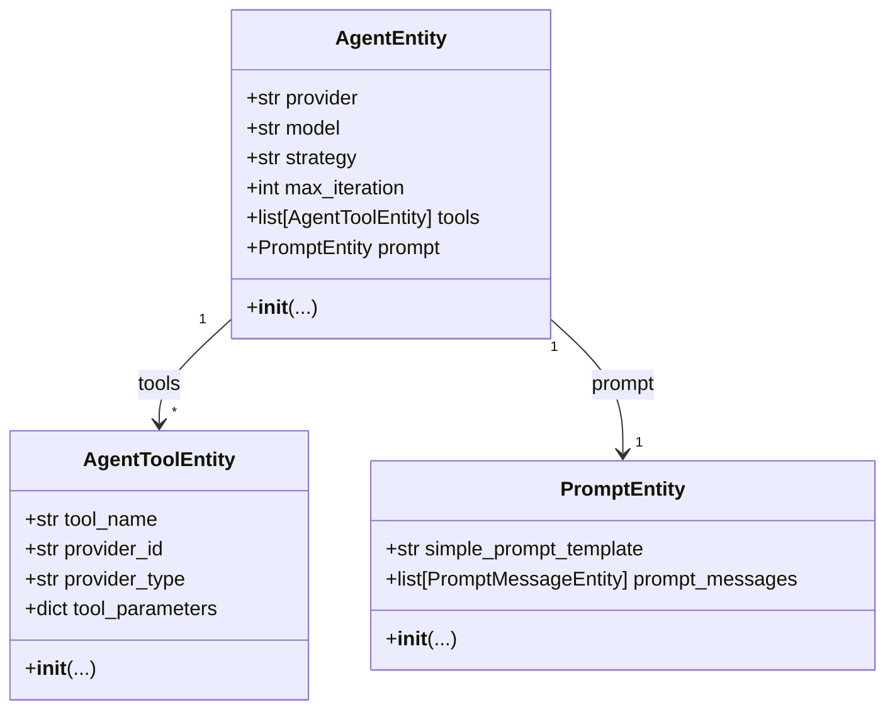
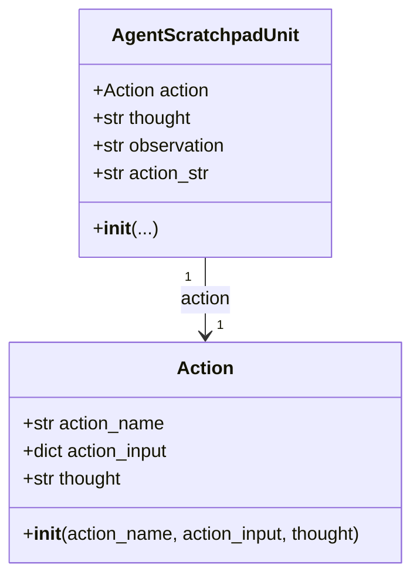
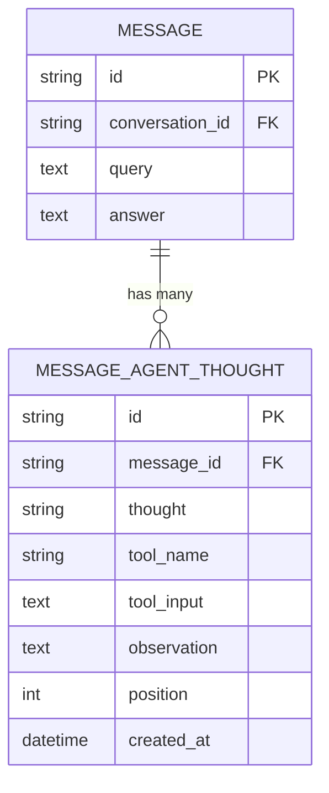
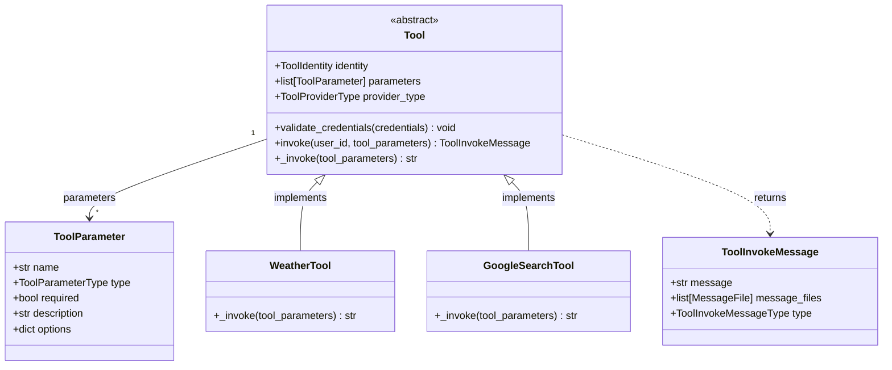
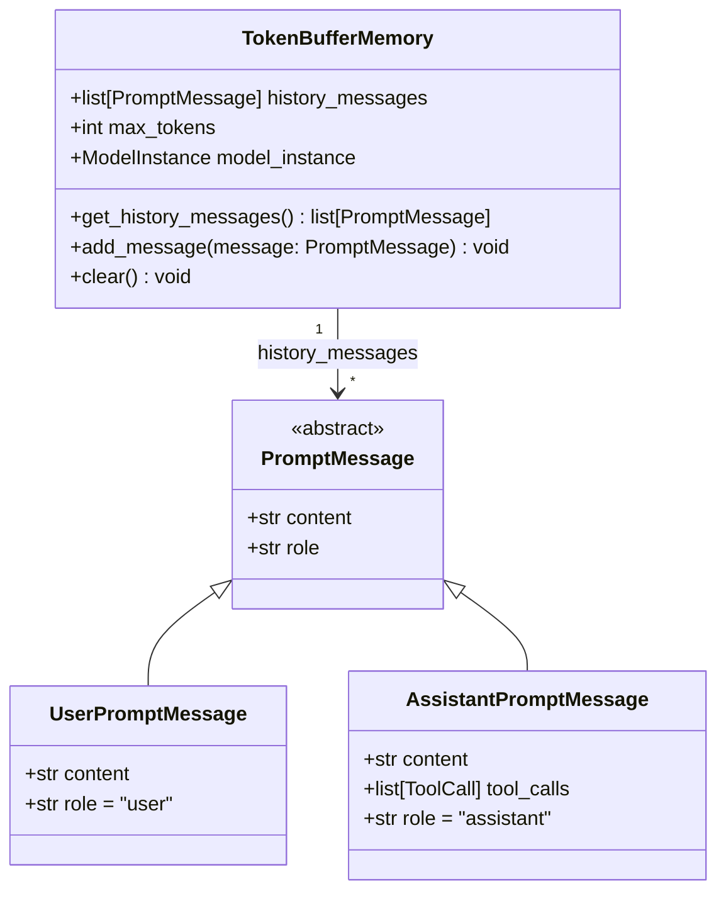
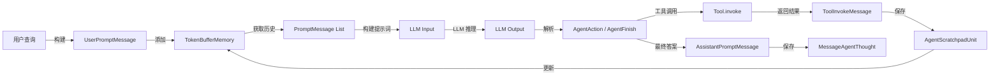

# Dify-03-Agent智能体系统-数据结构

本文档详细描述 Agent 模块的核心数据结构，包括 UML 类图、字段说明、约束条件和使用示例。

---

## 数据结构概览

Agent 模块的核心数据结构分为以下几类：

1. **Agent 配置类**：`AgentEntity`、`AgentToolEntity`
2. **推理记录类**：`AgentScratchpadUnit`、`MessageAgentThought`
3. **工具类**：`Tool`、`ToolParameter`、`ToolInvokeMeta`
4. **输出类**：`AgentAction`、`AgentFinish`
5. **记忆类**：`TokenBufferMemory`、`PromptMessage`

---

## 1. AgentEntity 配置实体

### UML 类图



### AgentEntity 字段说明

| 字段 | 类型 | 必填 | 约束 | 说明 |
|------|------|------|------|------|
| `provider` | str | 是 | 非空 | LLM 提供商（openai、anthropic 等） |
| `model` | str | 是 | 非空 | LLM 模型名称（gpt-4、claude-3 等） |
| `strategy` | str | 是 | `"function_call"` / `"cot"` | Agent 策略 |
| `max_iteration` | int | 是 | 1-99 | 最大迭代次数 |
| `tools` | list[AgentToolEntity] | 否 | 默认 [] | 工具列表 |
| `prompt` | PromptEntity | 否 | - | 提示词配置 |

### 核心代码

```python
# api/core/agent/entities.py

from dataclasses import dataclass
from typing import Optional

@dataclass
class AgentToolEntity:
    """Agent 工具配置"""
    tool_name: str                    # 工具名称
    provider_id: str                  # 提供商 ID
    provider_type: str                # 提供商类型（builtin/api）
    tool_parameters: dict             # 工具参数

@dataclass
class AgentEntity:
    """Agent 配置实体"""
    provider: str                     # LLM 提供商
    model: str                        # LLM 模型
    strategy: str                     # Agent 策略
    max_iteration: int                # 最大迭代次数
    tools: list[AgentToolEntity]      # 工具列表
    prompt: Optional[PromptEntity] = None  # 提示词配置
    
    def __post_init__(self):
        """参数校验"""
        if self.max_iteration < 1 or self.max_iteration > 99:
            raise ValueError("max_iteration must be between 1 and 99")
        
        if self.strategy not in ["function_call", "cot"]:
            raise ValueError("strategy must be 'function_call' or 'cot'")
```

### 使用示例

```python
# 创建 Agent 配置
agent_config = AgentEntity(
    provider="openai",
    model="gpt-4",
    strategy="function_call",
    max_iteration=5,
    tools=[
        AgentToolEntity(
            tool_name="google_search",
            provider_id="google",
            provider_type="builtin",
            tool_parameters={"api_key": "xxx"}
        ),
        AgentToolEntity(
            tool_name="weather",
            provider_id="weather_api",
            provider_type="api",
            tool_parameters={"endpoint": "https://api.weather.com"}
        ),
    ],
    prompt=PromptEntity(
        simple_prompt_template="你是一个智能助手，可以使用工具帮助用户..."
    )
)
```

---

## 2. AgentScratchpadUnit 推理记录单元

### UML 类图



### 字段说明

**AgentScratchpadUnit**：

| 字段 | 类型 | 说明 |
|------|------|------|
| `action` | Action | 执行的动作（工具调用） |
| `thought` | str | LLM 的思考过程 |
| `observation` | str | 工具返回的结果 |
| `action_str` | str | 动作的字符串表示 |

**Action**：

| 字段 | 类型 | 说明 |
|------|------|------|
| `action_name` | str | 工具名称 |
| `action_input` | dict | 工具参数 |
| `thought` | str | 执行该动作的原因 |

### 核心代码

```python
# api/core/agent/entities.py

@dataclass
class AgentScratchpadUnit:
    """Agent 推理记录单元（一轮推理的完整记录）"""
    
    @dataclass
    class Action:
        """动作（工具调用）"""
        action_name: str          # 工具名称
        action_input: dict        # 工具参数
        thought: str              # 思考过程
    
    action: Action                # 执行的动作
    thought: str                  # LLM 的思考
    observation: str              # 工具返回结果
    action_str: str               # 动作字符串表示
    
    def __str__(self) -> str:
        """格式化输出（用于构建提示词）"""
        return f"""Thought: {self.thought}
Action: {self.action.action_name}
Action Input: {json.dumps(self.action.action_input)}
Observation: {self.observation}"""
    
    def to_prompt_message(self) -> str:
        """转换为提示词消息"""
        return self.__str__()
```

### 使用示例

```python
# 创建推理记录
scratchpad_unit = AgentScratchpadUnit(
    action=AgentScratchpadUnit.Action(
        action_name="google_search",
        action_input={"query": "Dify 是什么"},
        thought="我需要搜索 Dify 的相关信息"
    ),
    thought="我需要搜索 Dify 的相关信息",
    observation="Dify 是一个开源的 LLM 应用开发平台...",
    action_str="google_search(query='Dify 是什么')"
)

# 转换为提示词
prompt_text = scratchpad_unit.to_prompt_message()
print(prompt_text)
# 输出：
# Thought: 我需要搜索 Dify 的相关信息
# Action: google_search
# Action Input: {"query": "Dify 是什么"}
# Observation: Dify 是一个开源的 LLM 应用开发平台...
```

---

## 3. MessageAgentThought 数据库记录

### 数据库表设计



### 表字段说明

| 字段 | 类型 | 约束 | 索引 | 说明 |
|------|------|------|------|------|
| `id` | UUID | PRIMARY KEY | - | 主键 |
| `message_id` | UUID | NOT NULL, FK | 索引 | 所属消息 ID |
| `thought` | TEXT | - | - | LLM 思考过程 |
| `tool_name` | VARCHAR(255) | - | - | 调用的工具名称 |
| `tool_input` | TEXT | - | - | 工具参数（JSON 字符串） |
| `observation` | TEXT | - | - | 工具返回结果 |
| `position` | INT | NOT NULL | - | 在消息中的位置（迭代序号） |
| `created_at` | TIMESTAMP | NOT NULL | - | 创建时间 |

### 核心代码

```python
# api/models/model.py

class MessageAgentThought(db.Model):
    """Agent 推理步骤表"""
    __tablename__ = 'message_agent_thoughts'
    __table_args__ = (
        db.Index('message_agent_thought_message_id_idx', 'message_id'),
    )
    
    id = db.Column(db.String(255), primary_key=True)
    message_id = db.Column(db.String(255), nullable=False)
    thought = db.Column(db.Text)
    tool_name = db.Column(db.String(255))
    tool_input = db.Column(db.Text)  # JSON 字符串
    observation = db.Column(db.Text)
    position = db.Column(db.Integer, nullable=False)
    created_at = db.Column(db.DateTime, nullable=False, server_default=db.func.now())
    
    def to_dict(self) -> dict:
        """转换为字典"""
        return {
            'id': self.id,
            'message_id': self.message_id,
            'thought': self.thought,
            'tool_name': self.tool_name,
            'tool_input': json.loads(self.tool_input) if self.tool_input else None,
            'observation': self.observation,
            'position': self.position,
            'created_at': self.created_at.isoformat(),
        }
```

---

## 4. Tool 工具接口

### UML 类图



### 字段说明

**Tool**：

| 字段 | 类型 | 说明 |
|------|------|------|
| `identity` | ToolIdentity | 工具标识（名称、作者、标签） |
| `parameters` | list[ToolParameter] | 参数列表 |
| `provider_type` | ToolProviderType | 提供商类型（BUILTIN/API/PLUGIN） |

**ToolParameter**：

| 字段 | 类型 | 说明 |
|------|------|------|
| `name` | str | 参数名称 |
| `type` | ToolParameterType | 参数类型（STRING/NUMBER/BOOLEAN 等） |
| `required` | bool | 是否必填 |
| `description` | str | 参数描述 |
| `options` | dict | 额外选项（枚举值、默认值等） |

### 核心代码

```python
# api/core/tools/__base/tool.py

from abc import ABC, abstractmethod

class Tool(ABC):
    """工具基类"""
    
    identity: ToolIdentity        # 工具标识
    parameters: list[ToolParameter]  # 参数定义
    
    def validate_credentials(self, credentials: dict) -> None:
        """
        校验工具凭证
        
        参数:
            credentials: 凭证字典
        
        抛出:
            ToolCredentialsValidateError: 凭证无效
        """
        pass
    
    @abstractmethod
    def _invoke(self, tool_parameters: dict) -> str | ToolInvokeMessage:
        """
        工具实现（子类需要实现）
        
        参数:
            tool_parameters: 工具参数
        
        返回:
            工具执行结果
        """
        raise NotImplementedError
    
    def invoke(
        self, 
        user_id: str, 
        tool_parameters: dict
    ) -> ToolInvokeMessage:
        """
        调用工具（包含参数校验和日志记录）
        
        参数:
            user_id: 用户 ID
            tool_parameters: 工具参数
        
        返回:
            工具调用消息
        """
        # 1. 参数校验
        self._validate_parameters(tool_parameters)
        
        # 2. 调用工具实现
        result = self._invoke(tool_parameters)
        
        # 3. 格式化结果
        if isinstance(result, str):
            return ToolInvokeMessage(
                message=result,
                message_files=[],
                type=ToolInvokeMessageType.TEXT
            )
        else:
            return result
```

### 使用示例

```python
# 定义自定义工具
class MyCustomTool(Tool):
    identity = ToolIdentity(
        name="my_custom_tool",
        author="me",
        label=I18nObject(en_US="My Custom Tool", zh_Hans="我的自定义工具")
    )
    
    parameters = [
        ToolParameter(
            name="query",
            type=ToolParameterType.STRING,
            required=True,
            description="查询参数"
        )
    ]
    
    def _invoke(self, tool_parameters: dict) -> str:
        query = tool_parameters.get("query")
        # 实现工具逻辑
        result = f"处理结果: {query}"
        return result

# 调用工具
tool = MyCustomTool()
result = tool.invoke(
    user_id="user_123",
    tool_parameters={"query": "测试查询"}
)
print(result.message)  # "处理结果: 测试查询"
```

---

## 5. TokenBufferMemory 记忆管理

### UML 类图



### 字段说明

| 字段 | 类型 | 说明 |
|------|------|------|
| `history_messages` | list[PromptMessage] | 对话历史消息列表 |
| `max_tokens` | int | 最大 Token 数（超出则截断） |
| `model_instance` | ModelInstance | 用于计算 Token 数的模型实例 |

### 核心代码

```python
# api/core/memory/token_buffer_memory.py

class TokenBufferMemory:
    """基于 Token 的缓冲记忆"""
    
    def __init__(
        self,
        model_instance: ModelInstance,
        max_tokens: int = 2000
    ):
        self.model_instance = model_instance
        self.max_tokens = max_tokens
        self.history_messages: list[PromptMessage] = []
    
    def get_history_messages(self) -> list[PromptMessage]:
        """
        获取对话历史（自动截断到 max_tokens）
        
        返回:
            历史消息列表
        """
        # 1. 计算总 Token 数
        total_tokens = 0
        result_messages = []
        
        # 2. 从最新消息向前遍历
        for message in reversed(self.history_messages):
            message_tokens = self._calculate_tokens(message)
            
            if total_tokens + message_tokens > self.max_tokens:
                break
            
            total_tokens += message_tokens
            result_messages.insert(0, message)
        
        return result_messages
    
    def add_message(self, message: PromptMessage) -> None:
        """
        添加消息到历史
        
        参数:
            message: 提示词消息
        """
        self.history_messages.append(message)
    
    def clear(self) -> None:
        """清空历史"""
        self.history_messages = []
    
    def _calculate_tokens(self, message: PromptMessage) -> int:
        """计算消息的 Token 数"""
        return self.model_instance.get_num_tokens([message])
```

### 使用示例

```python
# 创建记忆管理器
memory = TokenBufferMemory(
    model_instance=model_instance,
    max_tokens=2000
)

# 添加消息
memory.add_message(UserPromptMessage(content="你好"))
memory.add_message(AssistantPromptMessage(content="你好！有什么可以帮你的吗？"))
memory.add_message(UserPromptMessage(content="今天天气怎么样？"))

# 获取历史（自动截断）
history = memory.get_history_messages()
print(f"历史消息数: {len(history)}")

# 清空历史
memory.clear()
```

---

## 6. 数据流转关系

### 推理流程数据转换



---

## 7. 约束与不变式

### 数据一致性约束

1. **迭代序号唯一性**：
   - 同一 `message_id` 下的 `position` 必须唯一且连续（1, 2, 3, ...）

2. **工具参数完整性**：
   - 必填参数必须存在
   - 参数类型必须匹配定义

3. **记忆 Token 限制**：
   - 对话历史总 Token 数不超过 `max_tokens`
   - 超出部分自动截断最旧的消息

### 业务不变式

1. **推理步骤记录完整性**：
   - 每轮推理必须有 `thought`、`tool_name`（如果调用工具）、`observation`（如果调用工具）

2. **工具调用幂等性**：
   - 相同参数多次调用应产生一致的结果（取决于具体工具）

3. **Agent 配置有效性**：
   - `strategy` 必须是 `"function_call"` 或 `"cot"`
   - `max_iteration` 必须在 1-99 范围内

---

## 8. 扩展与演进

### 版本兼容性

**工具接口版本**：
- V1：仅支持文本返回
- V2：支持文件返回（当前版本）
- V3（计划）：支持流式返回

**元数据扩展**：
- 通过 `tool_parameters` 字段添加自定义参数
- 向后兼容：旧版本数据缺少的字段使用默认值

### 扩展点

1. **自定义工具**：
   - 实现 `Tool` 基类
   - 定义 `identity` 和 `parameters`
   - 实现 `_invoke()` 方法

2. **自定义记忆策略**：
   - 实现自定义记忆管理器
   - 替换 `TokenBufferMemory`

3. **自定义输出解析器**：
   - 实现 `OutputParser` 接口
   - 支持自定义输出格式

---

## 总结

Agent 模块的数据结构设计遵循以下原则：

1. **清晰的分层**：配置、推理、工具、记忆各层职责明确
2. **灵活的扩展**：通过接口和基类支持自定义实现
3. **完整的记录**：每轮推理步骤都有详细记录
4. **高效的记忆**：基于 Token 的自动截断确保性能

这些数据结构支撑了 Agent 从配置初始化、推理执行、工具调用到结果保存的完整流程。

