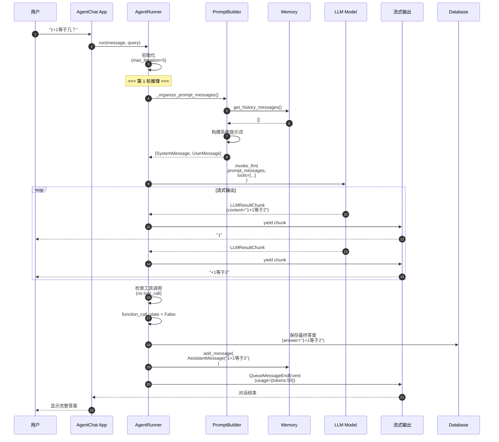
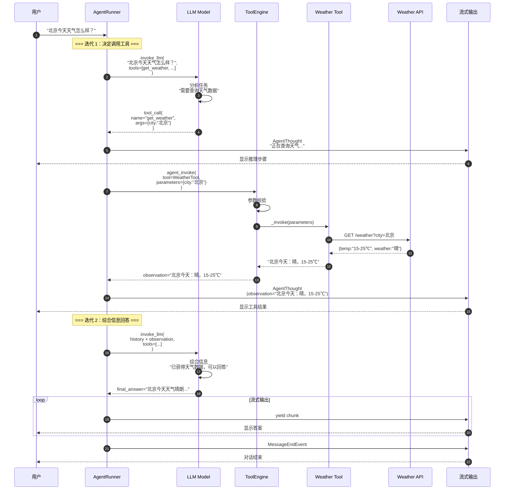
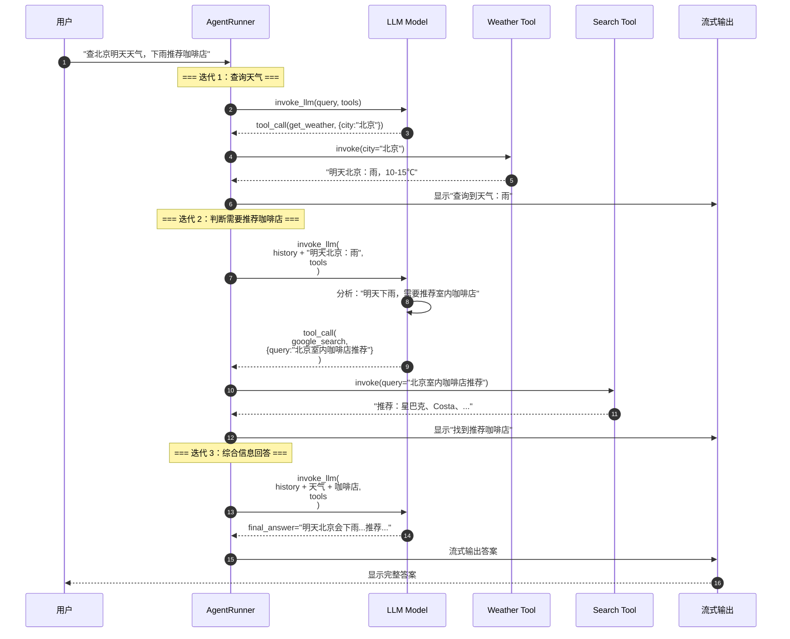
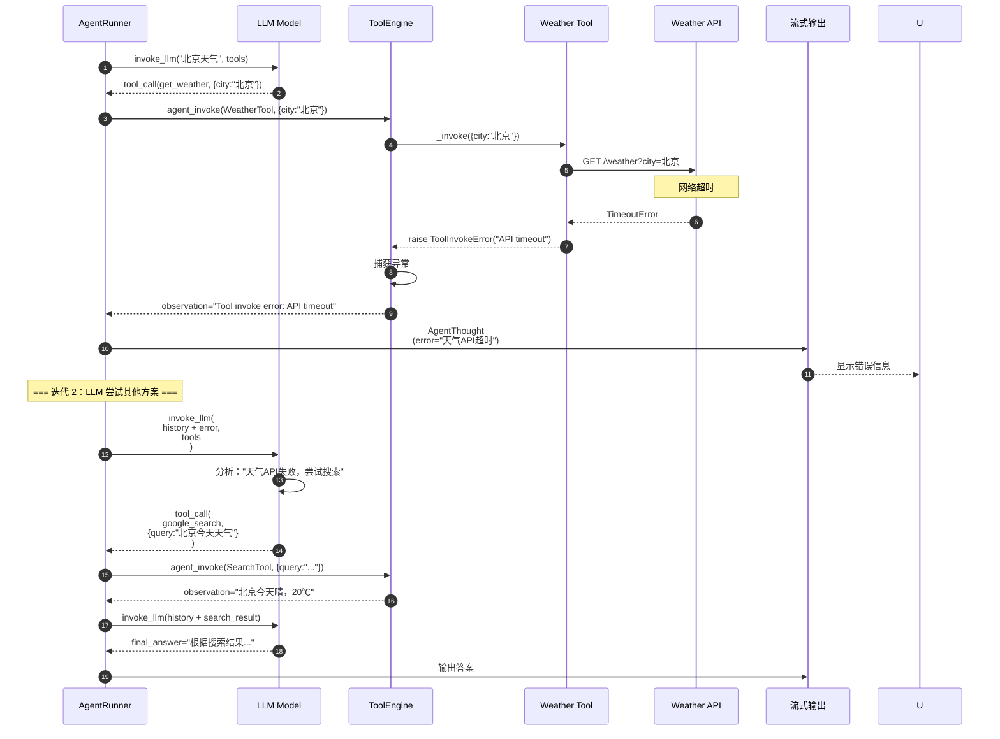
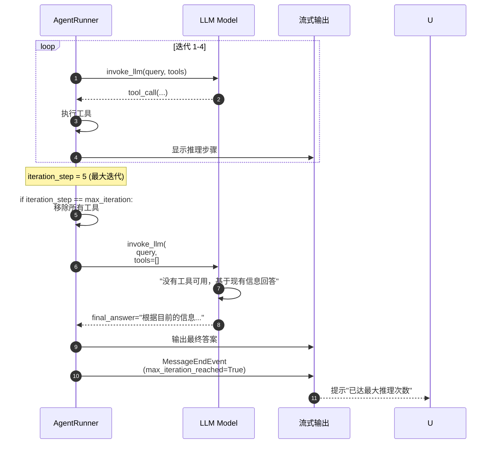
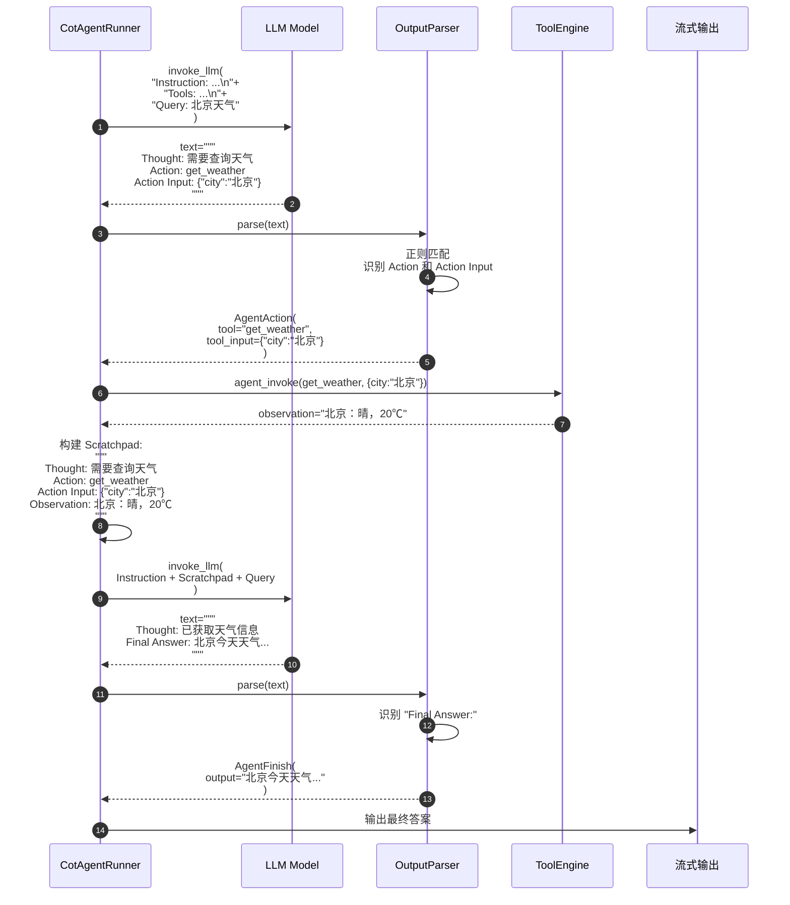
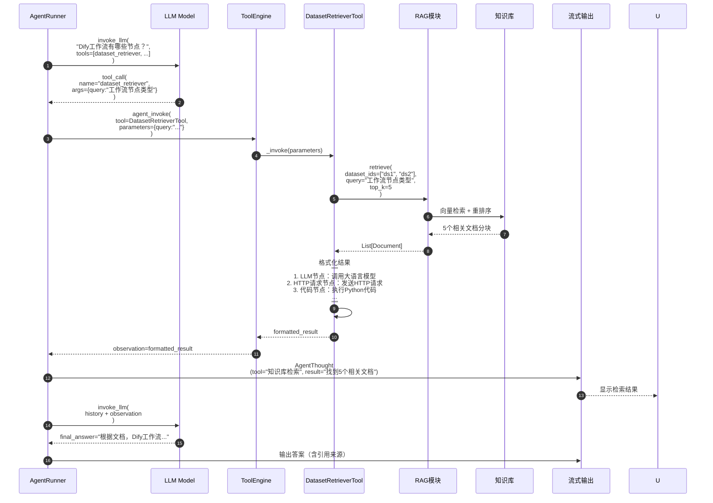

# Dify-03-Agent智能体系统-时序图

本文档提供 Agent 模块典型场景的详细时序图及逐步解释，覆盖推理循环、工具调用、错误处理等关键流程。

---

## 时序图概览

本文档包含以下场景的时序图：

1. **场景 1**：简单查询（无工具调用）
2. **场景 2**：单次工具调用推理
3. **场景 3**：多次工具调用推理（复杂任务）
4. **场景 4**：工具调用失败与重试
5. **场景 5**：达到最大迭代次数
6. **场景 6**：CoT Agent 推理流程
7. **场景 7**：知识库工具调用

---

## 场景 1：简单查询（无工具调用）

### 业务场景

用户询问"1+1等于几？"，Agent 直接回答，无需调用工具。

### 时序图

### 逐步说明

**步骤 1-5**：初始化
- 用户发送简单查询
- Agent Runner 初始化，设置最大迭代次数为 5

**步骤 6-10**：构建提示词
- 获取对话历史（首次查询，历史为空）
- 构建系统提示词（包含工具列表）
- 组装完整的 prompt_messages

**步骤 11-18**：LLM 推理与流式输出
- 调用 LLM（GPT-4）
- LLM 判断无需调用工具，直接回答
- 流式返回文本片段"1"、"+1等于2"
- 用户实时看到答案生成过程

**步骤 19-22**：检查工具调用
- Agent 检测到无工具调用（`tool_calls` 为空）
- 设置 `function_call_state = False`，终止循环
- 保存最终答案到数据库

**步骤 23-26**：结束对话
- 保存消息到记忆
- 发布结束事件（包含 Token 用量）
- 用户看到完整答案

**性能数据**：
- LLM 调用：0.8s
- Token 用量：50 tokens
- 迭代次数：1 次
- **总耗时**：约 0.8s

---

## 场景 2：单次工具调用推理

### 业务场景

用户询问"北京今天天气怎么样？"，Agent 调用天气工具获取信息后回答。

### 时序图

### 逐步说明

**迭代 1：决定调用工具**（步骤 1-13）
- LLM 分析任务，判断需要查询天气
- 返回工具调用指令：`get_weather(city="北京")`
- Agent 调用 ToolEngine 执行工具
- 工具调用天气 API，返回结果
- 向用户展示推理步骤和工具结果

**迭代 2：综合信息回答**（步骤 14-20）
- 将工具结果（observation）添加到上下文
- LLM 看到天气数据，综合信息生成回答
- 无工具调用，输出最终答案
- 流式返回答案给用户

**性能数据**：
- 迭代 1：LLM 调用 1s + 工具调用 0.5s = 1.5s
- 迭代 2：LLM 调用 1s = 1s
- **总耗时**：约 2.5s
- **Token 用量**：约 500 tokens

---

## 场景 3：多次工具调用推理（复杂任务）

### 业务场景

用户询问"帮我查一下北京明天的天气，如果下雨的话，推荐一家室内咖啡店。"

### 时序图

### 逐步说明

**迭代 1**：查询天气（步骤 1-6）
- LLM 判断需要先查询天气
- 调用 `get_weather` 工具
- 获取结果："明天北京：雨，10-15℃"

**迭代 2**：推荐咖啡店（步骤 7-12）
- LLM 看到天气数据，判断明天会下雨
- 决定调用搜索工具查找室内咖啡店
- 获取搜索结果

**迭代 3**：综合回答（步骤 13-16）
- LLM 综合天气和咖啡店信息
- 生成自然语言回答
- 流式输出给用户

**性能数据**：
- 3 轮迭代，每轮 1.5-2s
- **总耗时**：约 5-6s
- **Token 用量**：约 1500 tokens

---

## 场景 4：工具调用失败与重试

### 业务场景

调用天气 API 失败（网络超时），Agent 尝试其他方案或告知用户。

### 时序图

### 逐步说明

**步骤 1-10**：工具调用失败
- LLM 决定调用天气工具
- 天气 API 超时（网络问题）
- ToolEngine 捕获异常，返回错误信息
- 向用户展示工具调用失败

**步骤 11-18**：LLM 调整策略
- LLM 看到天气 API 失败的错误信息
- 决定尝试其他方案：使用搜索工具
- 调用搜索工具成功获取天气信息
- 综合信息生成回答

**容错机制**：
- 工具失败不终止对话
- LLM 可以尝试其他工具或方案
- 向用户透明地展示错误信息

---

## 场景 5：达到最大迭代次数

### 业务场景

Agent 在多次工具调用后仍未完成任务，达到最大迭代次数限制（`max_iteration=5`）。

### 时序图

### 逐步说明

**步骤 1-4**：前 4 轮推理
- Agent 正常执行工具调用
- 每轮推理都调用工具获取信息

**步骤 5-11**：第 5 轮强制输出
- 检测到达最大迭代次数
- **关键**：移除所有工具（`tools=[]`）
- LLM 无法再调用工具，只能基于现有信息回答
- 输出最终答案（可能不完整）

**步骤 12-14**：结束对话
- 向用户展示答案
- 附加提示"已达最大推理次数，答案可能不完整"

**防护机制**：
- 避免无限循环
- 确保用户始终能得到回答
- 透明地告知限制

---

## 场景 6：CoT Agent 推理流程

### 业务场景

使用 Chain-of-Thought Agent（ReAct 模式）执行推理。

### 时序图

### 逐步说明

**CoT Agent 与 Function Call Agent 的区别**：
- **提示词格式**：CoT 使用文本格式（Thought/Action/Observation），Function Call 使用 JSON Schema
- **输出解析**：CoT 使用正则匹配，Function Call 使用 LLM 原生能力
- **灵活性**：CoT 更灵活但依赖提示词工程，Function Call 更稳定但受限于模型能力

**步骤 1-3**：LLM 生成 Thought 和 Action
- LLM 输出文本格式的推理过程
- 包含 `Thought`、`Action`、`Action Input`

**步骤 4-6**：解析输出
- `OutputParser` 使用正则匹配提取工具名称和参数
- 返回 `AgentAction` 对象

**步骤 7-11**：执行工具并更新 Scratchpad
- 调用工具，获取 `observation`
- 将整个推理过程（Thought + Action + Observation）添加到 Scratchpad
- Scratchpad 作为上下文传递给下一轮 LLM 调用

**步骤 12-18**：生成最终答案
- LLM 看到 Scratchpad 中的 Observation
- 输出包含 `Final Answer:` 的文本
- `OutputParser` 识别并提取最终答案

---

## 场景 7：知识库工具调用

### 业务场景

用户询问"Dify 的工作流引擎有哪些节点类型？"，Agent 调用知识库工具检索相关文档。

### 时序图

### 逐步说明

**步骤 1-3**：LLM 决定调用知识库工具
- LLM 分析查询，判断需要从知识库检索信息
- 返回工具调用指令：`dataset_retriever(query="工作流节点类型")`

**步骤 4-11**：知识库检索
- `DatasetRetrieverTool` 调用 RAG 模块
- RAG 模块执行向量检索（语义搜索）
- 应用重排序提高相关性
- 返回 Top 5 相关文档分块

**步骤 12-14**：格式化结果
- 工具将文档分块格式化为易读的文本
- 包含文档内容和元数据（来源、相关性分数）

**步骤 15-20**：综合信息回答
- LLM 看到检索结果
- 综合信息生成回答
- **重要**：答案中包含文档引用（可追溯来源）

**性能数据**：
- 知识库检索：200-500ms
- LLM 推理：1-2s
- **总耗时**：约 2-3s

---

## 总结

Agent 模块的时序图展示了 7 个典型场景，涵盖：

1. **简单查询**：无工具调用，直接回答（0.8s）
2. **单次工具调用**：查询天气等简单任务（2.5s）
3. **多次工具调用**：复杂任务分解为多步骤（5-6s）
4. **错误处理**：工具失败后尝试其他方案
5. **迭代限制**：达到最大次数后强制输出
6. **CoT模式**：基于ReAct的推理流程
7. **知识库检索**：集成RAG能力（2-3s）

**关键性能指标**：

| 场景 | 迭代次数 | 工具调用次数 | 耗时（P50） | Token用量 |
|------|---------|-------------|-----------|----------|
| 简单查询 | 1 | 0 | 0.8s | 50 |
| 单次工具 | 2 | 1 | 2.5s | 500 |
| 多次工具 | 3-5 | 2-4 | 5-8s | 1500 |
| 知识库检索 | 2 | 1 | 2-3s | 800 |

**最佳实践**：
- 简单任务使用低迭代次数（3次）
- 复杂任务增加迭代次数（10次）
- 启用流式输出提升体验
- 设置工具超时避免长时间等待
- 优雅处理工具失败，提供降级方案

