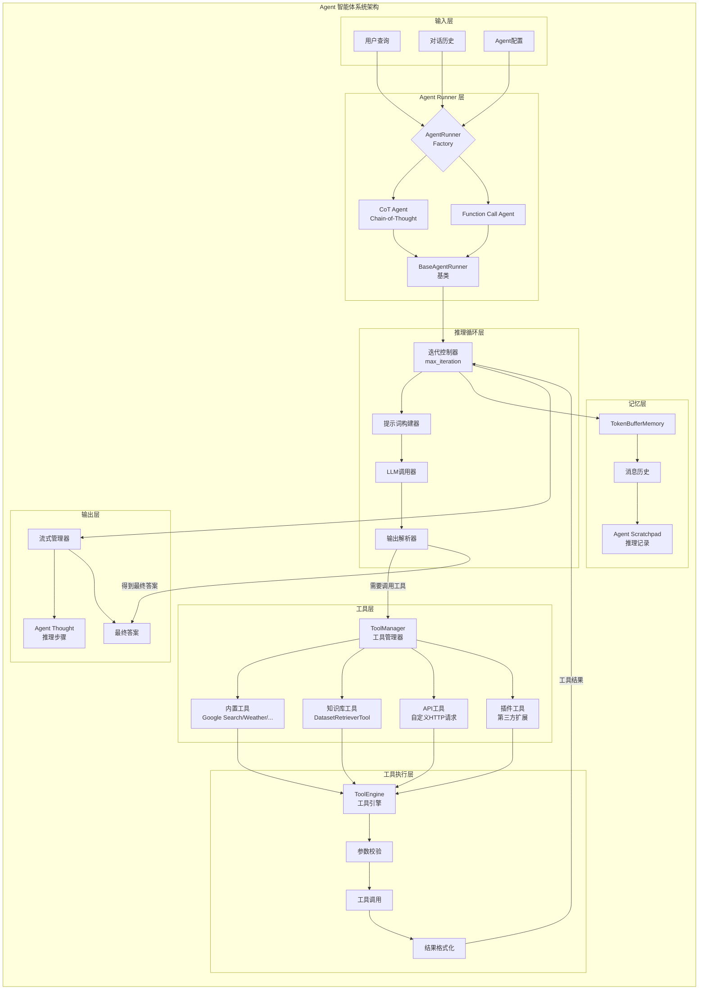
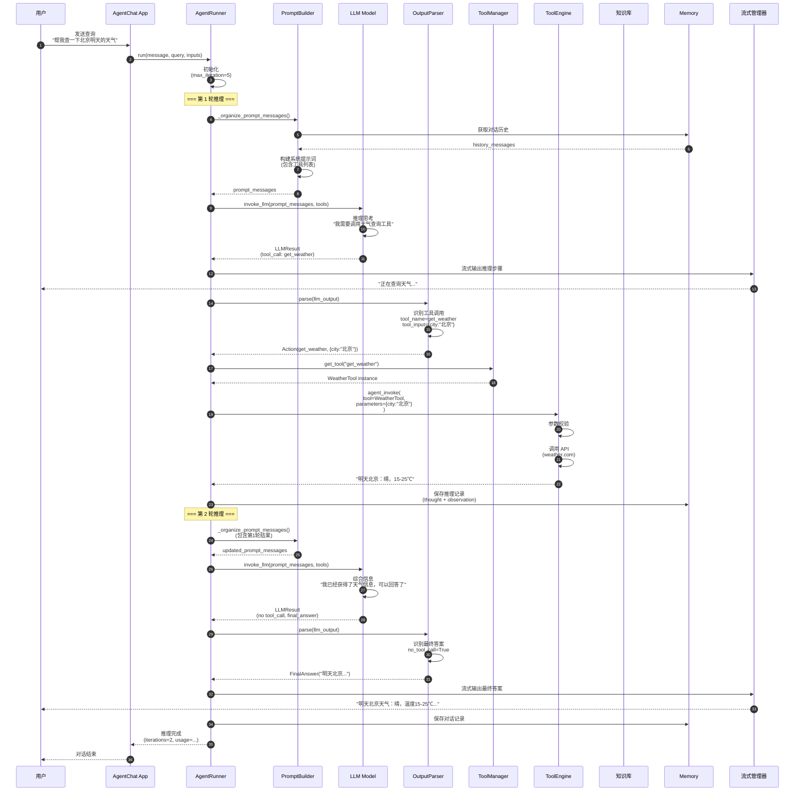
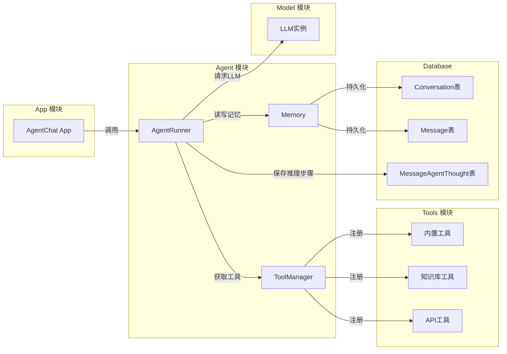

# Dify-03-Agent智能体系统-概览

## 0. 摘要

Agent 智能体系统是 Dify 平台的核心能力之一，通过 ReAct（Reasoning + Acting）框架和 Function Calling 机制，使 LLM 能够自主调用工具、访问知识库，并通过多轮推理解决复杂问题。

**核心能力边界**：
- 多种 Agent 模式（CoT Agent、Function Call Agent）
- 工具调用与编排（内置工具、自定义工具、API 工具、知识库工具）
- 多轮推理与迭代执行（最多 99 轮迭代）
- 记忆管理（Token Buffer Memory）
- 流式输出与实时反馈

**非目标**：
- 不包含工具的具体实现（由 Tools 模块负责）
- 不直接处理工作流编排（由 Workflow 模块负责）

**运行环境**：
- 语言：Python 3.10+
- 核心依赖：大语言模型（支持 Function Calling）、ToolManager、MemoryManager
- 部署形态：作为 Flask 应用的子模块，支持流式和非流式两种模式

---

## 1. 整体架构图



**图解与要点**：

1. **分层设计**：Agent 系统采用 7 层架构，从用户输入到最终输出职责清晰。

2. **组件职责**：
   - **输入层**：接收用户查询、对话历史和配置参数
   - **Agent Runner 层**：根据模式选择 Agent 实现（CoT 或 Function Call）
   - **推理循环层**：控制迭代次数，构建提示词，调用 LLM，解析输出
   - **工具层**：管理和提供各种工具（内置、知识库、API、插件）
   - **工具执行层**：校验参数、执行工具、格式化结果
   - **记忆层**：管理对话历史和推理记录
   - **输出层**：流式输出推理步骤和最终答案

3. **数据流**：
   - **推理流**：用户查询 → 构建提示词 → LLM 推理 → 解析输出 → 工具调用 → 继续推理 → 最终答案
   - **记忆流**：每轮推理结果保存到 Scratchpad，历史对话保存到 TokenBuffer

4. **并发与性能**：
   - 单个 Agent 串行执行（保证推理逻辑连贯性）
   - 支持流式输出（实时展示推理过程）
   - 工具调用可并发执行（未来优化）

5. **扩展性**：
   - 通过工厂模式支持多种 Agent 模式
   - 通过 ToolManager 支持任意工具接入
   - 通过 OutputParser 支持自定义解析逻辑

---

## 2. 全局时序图（典型Agent推理流程）



**图解与要点**：

1. **入口**（步骤 1-3）：
   - 用户发送查询"帮我查一下北京明天的天气"
   - `AgentRunner` 初始化，设置最大迭代次数（默认 5 次）

2. **第 1 轮推理**（步骤 4-20）：
   - **步骤 4-7**：构建提示词
     - 获取对话历史
     - 构建系统提示词（包含工具列表和使用说明）
     - 组装完整的 prompt_messages
   
   - **步骤 8-10**：LLM 推理
     - 调用 LLM（如 GPT-4）
     - LLM 分析任务，决定调用 `get_weather` 工具
     - 返回工具调用指令
   
   - **步骤 11-12**：流式输出
     - 实时向用户展示"正在查询天气..."
   
   - **步骤 13-15**：解析输出
     - `OutputParser` 解析 LLM 输出
     - 识别工具名称（`get_weather`）和参数（`{city:"北京"}`）
     - 返回 `Action` 对象
   
   - **步骤 16-20**：工具调用
     - 从 `ToolManager` 获取工具实例
     - `ToolEngine` 执行工具（调用天气 API）
     - 返回结果"明天北京：晴，15-25℃"
     - 保存到推理记录（Scratchpad）

3. **第 2 轮推理**（步骤 21-28）：
   - **步骤 21-24**：再次构建提示词
     - 包含第 1 轮的推理结果和工具返回值
     - LLM 看到 Observation："明天北京：晴，15-25℃"
   
   - **步骤 25-26**：LLM 生成最终答案
     - LLM 判断已获得足够信息，不再需要调用工具
     - 生成自然语言回答
   
   - **步骤 27-28**：解析并输出
     - `OutputParser` 识别最终答案（无工具调用）
     - 流式输出最终答案给用户

4. **迭代终止条件**：
   - LLM 不再调用工具（生成最终答案）
   - 达到最大迭代次数（`max_iteration`）
   - 发生错误（工具调用失败、LLM 超时等）

5. **性能数据**（典型场景）：
   - 第 1 轮推理：LLM 调用 1s + 工具调用 0.5s = 1.5s
   - 第 2 轮推理：LLM 调用 1s = 1s
   - **总耗时**：约 2.5s（2 轮迭代）

---

## 3. 模块边界与交互图

### 3.1 Agent 模块与其他模块的交互



**模块交互说明**：

| 调用方 | 被调方 | 接口名称 | 调用类型 | 数据一致性 |
|--------|--------|----------|----------|------------|
| AgentChat App | Agent.AgentRunner | `run()` | 同步 | 强一致性（事务内） |
| AgentRunner | Model.LLM | `invoke_llm()` | 同步 | 不要求 |
| AgentRunner | Tools.ToolManager | `get_tool()` | 同步 | 不要求 |
| AgentRunner | Tools.ToolEngine | `agent_invoke()` | 同步 | 不要求 |
| AgentRunner | Memory.TokenBufferMemory | `get_history()` | 同步 | 最终一致性 |
| AgentRunner | Database | `save_agent_thought()` | 同步 | 强一致性（事务内） |

### 3.2 对外 API 提供方矩阵

| API 名称 | 提供者 | 调用者 | 用途 |
|---------|--------|--------|------|
| `AgentRunner.run()` | Agent | AgentChat App | 执行 Agent 推理 |
| `CotAgentRunner.run()` | Agent | 内部使用 | CoT 模式推理 |
| `FCAgentRunner.run()` | Agent | 内部使用 | Function Call 模式推理 |
| `ToolManager.get_tool()` | Agent | 内部使用 | 获取工具实例 |
| `ToolEngine.agent_invoke()` | Agent | 内部使用 | 执行工具 |
| `OutputParser.parse()` | Agent | 内部使用 | 解析 LLM 输出 |

---

## 4. 关键设计与权衡

### 4.1 数据一致性

**强一致性场景**：
- 推理步骤保存（每轮推理的 thought 和 observation 写入数据库）
- 对话消息保存（保证消息顺序和完整性）

**最终一致性场景**：
- 对话历史加载（允许短暂延迟）
- 工具调用结果（异步工具返回后再更新）

**事务边界**：
- 每轮推理为一个事务单元
- 推理失败时回滚当前轮次

### 4.2 迭代控制策略

**最大迭代次数**：
- 默认：5 次
- 范围：1-99 次
- 超过限制后强制输出当前结果

**提前终止条件**：
- LLM 输出最终答案（无工具调用）
- 连续 3 次工具调用失败
- Token 用量超过预算

### 4.3 性能关键路径

**P95 延迟目标**：
- 单轮推理：< 2s（LLM 调用 1s + 工具调用 1s）
- 完整对话：< 10s（平均 2-3 轮迭代）

**内存峰值**：
- 对话历史：< 100KB（20 轮对话）
- Agent Scratchpad：< 50KB（5 轮推理）

**I/O 热点**：
- LLM API 调用（高频）
- 工具 API 调用（中频）
- 数据库写入（中频）

### 4.4 可观测性指标

| 指标名称 | 类型 | 含义 | 阈值建议 |
|---------|------|------|----------|
| `agent.iteration_count` | 直方图 | 推理迭代次数 | 中位数 2-3 |
| `agent.llm.duration` | 直方图 | LLM 调用耗时 | P95 < 2s |
| `agent.tool.duration` | 直方图 | 工具调用耗时 | P95 < 1s |
| `agent.tool.error_rate` | 百分比 | 工具调用错误率 | < 5% |
| `agent.token_usage` | 计数器 | Token 用量 | 单次对话 < 5000 tokens |

### 4.5 配置项说明

| 配置项 | 默认值 | 影响 | 建议值 |
|--------|--------|------|--------|
| `max_iteration` | 5 | 最大推理次数 | 3-10（复杂任务可增加） |
| `stream_tool_call` | `true` | 是否流式输出工具调用 | 建议开启（更好的用户体验） |
| `memory.max_tokens` | 2000 | 对话历史最大 token 数 | 1000-4000 |
| `agent_mode` | `function_call` | Agent 模式 | `function_call`（更稳定）或 `cot`（更灵活） |

---

## 5. 典型使用示例与最佳实践

### 5.1 示例 1：基本 Agent 对话

```python
from core.agent.fc_agent_runner import FunctionCallAgentRunner
from models.model import Conversation, Message

# 1. 创建对话和消息
conversation = Conversation.query.filter_by(id="conv_id").first()
message = Message(
    conversation_id=conversation.id,
    query="帮我查一下北京明天的天气"
)

# 2. 初始化 Agent Runner
agent_runner = FunctionCallAgentRunner(
    tenant_id=tenant_id,
    application_generate_entity=app_entity,
    conversation=conversation,
    app_config=app_config,
    model_config=model_config,
    config=agent_config,
    queue_manager=queue_manager,
    message=message,
    user_id=user_id,
    model_instance=model_instance,
)

# 3. 执行推理
for chunk in agent_runner.run(message, query="帮我查一下北京明天的天气"):
    if isinstance(chunk, AgentThought):
        print(f"推理步骤: {chunk.thought}")
        print(f"工具调用: {chunk.tool_name}({chunk.tool_input})")
        print(f"工具结果: {chunk.observation}")
    elif isinstance(chunk, FinalAnswer):
        print(f"最终答案: {chunk.answer}")
```

**适用场景**：单次 Agent 对话，需要实时展示推理过程。

**注意事项**：
- 确保配置了至少一个工具
- 设置合理的 `max_iteration`（过小可能无法完成任务）
- 启用流式输出以提升用户体验

### 5.2 示例 2：Agent 使用知识库工具

```python
from core.agent.cot_agent_runner import CotAgentRunner
from core.tools.utils.dataset_retriever_tool import DatasetRetrieverTool

# 1. 初始化知识库工具
dataset_tools = DatasetRetrieverTool.get_dataset_tools(
    tenant_id=tenant_id,
    dataset_ids=["dataset_1", "dataset_2"],
    retrieve_config={
        "top_k": 5,
        "score_threshold": 0.7,
        "reranking_enable": True
    },
    user_id=user_id
)

# 2. 配置 Agent
agent_config = AgentConfig(
    strategy="cot",  # Chain-of-Thought 模式
    max_iteration=5,
    tools=[*dataset_tools, *other_tools]
)

# 3. 创建 CoT Agent Runner
cot_agent = CotAgentRunner(
    tenant_id=tenant_id,
    app_config=app_config,
    model_config=model_config,
    config=agent_config,
    # ... 其他参数
)

# 4. 执行推理
query = "Dify 的工作流引擎有哪些节点类型？"
for chunk in cot_agent.run(message, query, inputs={}):
    # 处理输出...
    pass
```

**适用场景**：需要从知识库检索信息的 Agent 对话。

**最佳实践**：
- 使用 CoT 模式更适合复杂推理任务
- 设置合理的检索参数（`top_k`、`score_threshold`）
- 启用重排序提高检索准确率

### 5.3 示例 3：Agent 调用自定义工具

```python
from core.tools import Tool, ToolParameter

# 1. 定义自定义工具
class MyCustomTool(Tool):
    name = "my_custom_tool"
    description = "这是一个自定义工具示例"
    parameters = [
        ToolParameter(
            name="param1",
            type=ToolParameter.ToolParameterType.STRING,
            required=True,
            description="参数1说明"
        )
    ]
    
    def _invoke(self, parameters: dict) -> str:
        # 实现工具逻辑
        param1 = parameters.get("param1")
        result = f"处理结果: {param1}"
        return result

# 2. 注册工具
from core.tools.tool_manager import ToolManager
ToolManager.register_tool(MyCustomTool)

# 3. Agent 会自动发现并使用该工具
agent_runner.run(message, query="使用 my_custom_tool 处理数据")
```

**适用场景**：需要扩展 Agent 能力，集成第三方 API 或自定义逻辑。

**参数说明**：
- `name`：工具唯一标识
- `description`：工具功能描述（LLM 会读取以决定是否调用）
- `parameters`：工具参数定义（类型、是否必填、描述）
- `_invoke()`：工具实现逻辑

### 5.4 最佳实践清单

**Agent 配置**：
- ✅ 根据任务复杂度设置 `max_iteration`（简单任务 3 次，复杂任务 10 次）
- ✅ 优先使用 Function Call 模式（更稳定，错误率更低）
- ✅ 为工具提供清晰的描述（帮助 LLM 正确选择工具）
- ✅ 限制工具数量（过多工具会降低 LLM 准确率，建议 < 20 个）
- ❌ 避免嵌套 Agent（性能和可控性差）
- ❌ 避免在 Agent 中执行长时间操作（使用异步工具）

**工具设计**：
- ✅ 工具功能单一（一个工具只做一件事）
- ✅ 参数命名清晰（避免歧义）
- ✅ 提供详细的错误信息（帮助 Agent 重试或调整策略）
- ✅ 实现幂等性（同样的参数多次调用结果一致）
- ❌ 避免工具之间有复杂依赖关系
- ❌ 避免工具返回过长的内容（影响 Token 用量）

**性能优化**：
- ✅ 启用流式输出（提升用户体验）
- ✅ 缓存工具调用结果（相同参数直接返回缓存）
- ✅ 使用更快的 LLM 模型（如 GPT-4-turbo）
- ✅ 限制对话历史长度（避免 Token 超限）
- ❌ 避免在每轮推理中重新初始化工具
- ❌ 避免频繁的数据库写入（批量保存推理步骤）

**错误处理**：
- ✅ 捕获工具调用异常（提供回退方案）
- ✅ 记录详细的推理日志（便于调试）
- ✅ 设置合理的超时时间（避免无限等待）
- ✅ 对 LLM 输出进行验证（防止格式错误）
- ❌ 避免直接向用户暴露内部错误
- ❌ 避免在错误后直接终止对话（尝试恢复）

---

## 6. Agent 模式对比

### 6.1 Function Call Agent vs CoT Agent

| 特性 | Function Call Agent | CoT Agent |
|------|---------------------|-----------|
| **原理** | 使用 LLM 的 Function Calling 能力 | 基于 ReAct（Reasoning + Acting）框架 |
| **提示词** | 工具以 JSON Schema 形式传递给 LLM | 工具以文本描述嵌入提示词 |
| **输出格式** | 结构化（JSON） | 半结构化（文本） |
| **稳定性** | 高（LLM 原生支持） | 中（依赖提示词工程） |
| **灵活性** | 中（受限于 Function Calling 格式） | 高（可自定义推理流程） |
| **Token 用量** | 较低 | 较高 |
| **适用场景** | 生产环境、稳定任务 | 复杂推理、研究实验 |
| **LLM 要求** | 必须支持 Function Calling | 无特殊要求 |
| **推荐模型** | GPT-4, Claude, Gemini | 任意 LLM |

**选择建议**：
- **生产环境**：优先使用 Function Call Agent（更稳定）
- **复杂推理**：使用 CoT Agent（更灵活）
- **Token 敏感**：使用 Function Call Agent（更节省）
- **LLM 限制**：如果模型不支持 Function Calling，使用 CoT Agent

### 6.2 迭代次数配置建议

| 任务类型 | 推荐迭代次数 | 示例 |
|----------|--------------|------|
| 简单查询 | 1-2 | "今天几号？"、"1+1等于几？" |
| 单步工具调用 | 2-3 | "查询北京天气"、"搜索Dify文档" |
| 多步推理 | 3-5 | "帮我规划一次北京旅行"、"分析这段代码的问题" |
| 复杂任务 | 5-10 | "编写一个完整的API接口"、"制定营销策略" |

---

## 7. 性能与监控

### 7.1 性能基准

| 场景 | 迭代次数 | Token 用量 | 耗时（P50） | 耗时（P95） |
|------|---------|-----------|-----------|-----------|
| 简单查询（无工具） | 1 | 200 | 0.8s | 1.5s |
| 单次工具调用 | 2 | 500 | 2s | 3s |
| 多次工具调用（3次） | 4 | 1500 | 5s | 8s |
| 知识库检索+推理 | 3 | 1200 | 4s | 6s |

### 7.2 监控指标

**关键指标**：
```python
# 迭代次数分布
agent.iteration_count.histogram(
    tags=["app_id", "model_provider"]
)

# 工具调用成功率
agent.tool.success_rate.gauge(
    tags=["tool_name", "app_id"]
)

# 平均响应时间
agent.response_time.histogram(
    tags=["app_id", "iteration_count"]
)

# Token 用量
agent.token_usage.counter(
    tags=["model_provider", "app_id"]
)
```

**告警规则**：
- 迭代次数 > 8：可能陷入循环
- 工具错误率 > 10%：工具配置或 API 异常
- 响应时间 P95 > 10s：性能下降
- Token 用量 > 10000/对话：成本异常

---

## 总结

Agent 智能体系统是 Dify 平台实现自主任务执行的核心模块。通过 ReAct 框架和 Function Calling 机制，Agent 能够：

1. **自主推理**：根据用户查询制定行动计划
2. **工具调用**：调用各种工具获取信息或执行操作
3. **多轮迭代**：通过多轮推理逐步完成复杂任务
4. **流式输出**：实时展示推理过程，提升用户体验

**核心优势**：
- 支持多种 Agent 模式（Function Call、CoT）
- 灵活的工具系统（内置、知识库、API、插件）
- 完善的记忆管理（对话历史、推理记录）
- 丰富的可观测性（推理步骤、Token 用量、性能指标）

**适用场景**：
- 客服机器人（查询订单、解答问题）
- 个人助理（日程管理、信息检索）
- 数据分析（查询数据库、生成报表）
- 内容创作（搜集资料、撰写文章）

**下一步**：
- 参考 `Dify-03-Agent智能体系统-API.md` 了解详细 API 规格
- 参考 `Dify-03-Agent智能体系统-数据结构.md` 了解核心数据结构
- 参考 `Dify-03-Agent智能体系统-时序图.md` 了解典型调用时序

