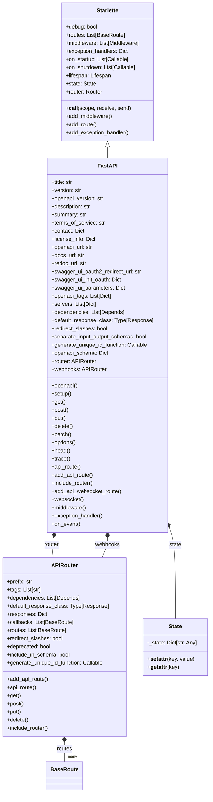
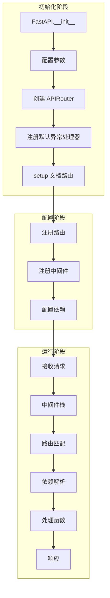
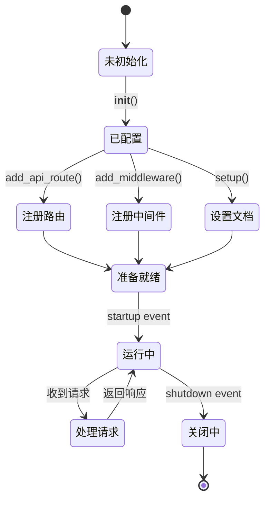

# FastAPI 源码剖析 - 01 应用层 - 数据结构

## 核心数据结构

应用层的核心数据结构主要围绕 `FastAPI` 类及其相关的配置和状态管理。

## 1. FastAPI 类结构

### 类定义

```python
class FastAPI(Starlette):
    """
    FastAPI 应用类，继承自 Starlette
    
    主要扩展：
    - OpenAPI 文档生成
    - 自动请求验证
    - 依赖注入系统
    - 类型提示驱动的路由定义
    """
```

### UML 类图



### 字段说明

#### OpenAPI 相关字段

| 字段 | 类型 | 默认值 | 说明 |
|------|------|--------|------|
| title | str | "FastAPI" | API 标题，显示在文档中 |
| version | str | "0.1.0" | API 版本号 |
| openapi_version | str | "3.1.0" | 使用的 OpenAPI 规范版本 |
| description | str | "" | API 详细描述，支持 Markdown |
| summary | str | None | API 简短摘要 |
| terms_of_service | str | None | 服务条款 URL |
| contact | Dict | None | 联系信息 {"name": "", "url": "", "email": ""} |
| license_info | Dict | None | 许可证信息 {"name": "", "url": ""} |
| openapi_tags | List[Dict] | None | OpenAPI 标签元数据 |
| servers | List[Dict] | None | API 服务器列表 |
| openapi_schema | Dict | None | 生成的 OpenAPI schema（缓存） |

#### 文档 URL 配置

| 字段 | 类型 | 默认值 | 说明 |
|------|------|--------|------|
| openapi_url | str | "/openapi.json" | OpenAPI JSON 文档路径，None 禁用 |
| docs_url | str | "/docs" | Swagger UI 文档路径，None 禁用 |
| redoc_url | str | "/redoc" | ReDoc 文档路径，None 禁用 |
| swagger_ui_oauth2_redirect_url | str | "/docs/oauth2-redirect" | OAuth2 重定向 URL |
| swagger_ui_init_oauth | Dict | None | Swagger UI OAuth2 初始化参数 |
| swagger_ui_parameters | Dict | None | 自定义 Swagger UI 参数 |

#### 应用配置

| 字段 | 类型 | 默认值 | 说明 |
|------|------|--------|------|
| debug | bool | False | 调试模式，返回详细错误堆栈 |
| dependencies | List[Depends] | None | 全局依赖项，应用于所有路由 |
| default_response_class | Type[Response] | JSONResponse | 默认响应类 |
| redirect_slashes | bool | True | 是否自动重定向尾部斜杠 |
| separate_input_output_schemas | bool | True | 是否分离输入输出 schema（OpenAPI 3.1+） |
| generate_unique_id_function | Callable | generate_unique_id | 生成唯一 operation ID 的函数 |

#### 路由管理

| 字段 | 类型 | 说明 |
|------|------|------|
| router | APIRouter | 内部路由器，管理所有路由 |
| webhooks | APIRouter | Webhooks 路由器 |
| routes | List[BaseRoute] | 所有注册的路由（从 router 获取） |

#### 状态管理

| 字段 | 类型 | 说明 |
|------|------|------|
| state | State | 应用级共享状态，可存储任意数据 |

## 2. State 数据结构

### 定义

```python
@dataclass
class State:
    """
    应用或请求级别的状态容器
    
    用法：
    app.state.db_pool = create_pool()
    request.state.user = current_user
    """
    _state: Dict[str, Any] = field(default_factory=dict)
    
    def __setattr__(self, name: str, value: Any) -> None:
        self._state[name] = value
    
    def __getattr__(self, name: str) -> Any:
        try:
            return self._state[name]
        except KeyError:
            raise AttributeError(f"'{self.__class__.__name__}' has no attribute '{name}'")
```

### 使用场景

**应用级状态**：
```python
from fastapi import FastAPI

app = FastAPI()

# 存储数据库连接池
app.state.db_pool = create_database_pool()

# 存储 Redis 客户端
app.state.redis = redis.Redis()

# 存储配置
app.state.config = load_config()

# 在路由中访问
@app.get("/")
async def root(request: Request):
    db_pool = request.app.state.db_pool
    return {"status": "ok"}
```

**请求级状态**：
```python
from fastapi import Request

@app.middleware("http")
async def add_request_id(request: Request, call_next):
    # 为每个请求生成唯一 ID
    request.state.request_id = generate_unique_id()
    response = await call_next(request)
    response.headers["X-Request-ID"] = request.state.request_id
    return response

@app.get("/items/")
async def read_items(request: Request):
    # 访问请求 ID
    request_id = request.state.request_id
    return {"request_id": request_id}
```

## 3. 配置数据结构

### OpenAPI 联系信息

```python
contact = {
    "name": "API Support",
    "url": "https://example.com/support",
    "email": "support@example.com"
}
```

| 字段 | 类型 | 必填 | 说明 |
|------|------|------|------|
| name | str | 否 | 联系人或组织名称 |
| url | str | 否 | 联系页面 URL |
| email | str | 否 | 联系邮箱 |

### OpenAPI 许可证信息

```python
license_info = {
    "name": "Apache 2.0",
    "url": "https://www.apache.org/licenses/LICENSE-2.0.html"
}
```

| 字段 | 类型 | 必填 | 说明 |
|------|------|------|------|
| name | str | 是 | 许可证名称 |
| url | str | 否 | 许可证 URL |

### OpenAPI 标签元数据

```python
tags_metadata = [
    {
        "name": "users",
        "description": "Operations with users.",
        "externalDocs": {
            "description": "Users external docs",
            "url": "https://example.com/docs/users"
        }
    },
    {
        "name": "items",
        "description": "Manage items."
    }
]
```

| 字段 | 类型 | 必填 | 说明 |
|------|------|------|------|
| name | str | 是 | 标签名称，与路由的 tags 匹配 |
| description | str | 否 | 标签描述 |
| externalDocs | Dict | 否 | 外部文档链接 |

### OpenAPI 服务器列表

```python
servers = [
    {
        "url": "https://api.example.com",
        "description": "Production server"
    },
    {
        "url": "https://staging.example.com",
        "description": "Staging server"
    }
]
```

| 字段 | 类型 | 必填 | 说明 |
|------|------|------|------|
| url | str | 是 | 服务器 URL |
| description | str | 否 | 服务器描述 |
| variables | Dict | 否 | URL 模板变量 |

## 4. 中间件数据结构

### Middleware 配置

```python
from starlette.middleware import Middleware

middleware = [
    Middleware(
        CORSMiddleware,
        allow_origins=["*"],
        allow_methods=["*"]
    ),
    Middleware(
        GZIPMiddleware,
        minimum_size=1000
    )
]

app = FastAPI(middleware=middleware)
```

**Middleware 结构**：
```python
@dataclass
class Middleware:
    cls: Type[BaseMiddleware]  # 中间件类
    args: Tuple = ()           # 位置参数
    kwargs: Dict = {}          # 关键字参数
```

## 5. 异常处理器数据结构

### 异常处理器映射

```python
exception_handlers: Dict[Union[int, Type[Exception]], ExceptionHandler]
```

**ExceptionHandler 类型**：
```python
ExceptionHandler = Callable[[Request, Exception], Union[Response, Awaitable[Response]]]
```

**示例**：
```python
from fastapi import Request, HTTPException
from fastapi.responses import JSONResponse

async def custom_http_exception_handler(request: Request, exc: HTTPException):
    return JSONResponse(
        status_code=exc.status_code,
        content={
            "message": exc.detail,
            "path": str(request.url),
            "method": request.method
        }
    )

app = FastAPI()
app.add_exception_handler(HTTPException, custom_http_exception_handler)

# 或使用装饰器
@app.exception_handler(HTTPException)
async def http_exception_handler(request: Request, exc: HTTPException):
    return JSONResponse(...)
```

## 6. 生命周期数据结构

### Lifespan 上下文管理器

```python
from contextlib import asynccontextmanager
from typing import AsyncIterator

@asynccontextmanager
async def lifespan(app: FastAPI) -> AsyncIterator[None]:
    # 启动时执行
    print("Application starting...")
    db_pool = await create_database_pool()
    app.state.db_pool = db_pool
    
    yield  # 应用运行中
    
    # 关闭时执行
    print("Application shutting down...")
    await db_pool.close()

app = FastAPI(lifespan=lifespan)
```

**Lifespan 类型定义**：
```python
Lifespan = Callable[[AppType], AsyncContextManager[None]]
```

### 已废弃的事件处理器（on_event）

```python
# 已废弃，不推荐使用
on_startup: List[Callable[[], Any]] = []
on_shutdown: List[Callable[[], Any]] = []

@app.on_event("startup")
async def startup_event():
    print("Starting up...")

@app.on_event("shutdown")
async def shutdown_event():
    print("Shutting down...")
```

## 7. 响应类配置

### 默认响应类

```python
from fastapi.responses import (
    JSONResponse,      # 默认
    HTMLResponse,
    PlainTextResponse,
    RedirectResponse,
    StreamingResponse,
    FileResponse,
    ORJSONResponse,    # 需要安装 orjson
    UJSONResponse      # 需要安装 ujson
)

# 全局配置
app = FastAPI(default_response_class=ORJSONResponse)

# 路由级配置
@app.get("/html", response_class=HTMLResponse)
async def html_response():
    return "<html><body>Hello</body></html>"
```

## 8. 完整配置示例

```python
from fastapi import FastAPI, Depends
from fastapi.middleware.cors import CORSMiddleware
from fastapi.responses import ORJSONResponse
from contextlib import asynccontextmanager

@asynccontextmanager
async def lifespan(app: FastAPI):
    # 启动
    app.state.db = await create_db_pool()
    yield
    # 关闭
    await app.state.db.close()

app = FastAPI(
    # OpenAPI 配置
    title="My Advanced API",
    version="2.0.0",
    description="Advanced API with all features",
    summary="Production-ready API",
    terms_of_service="https://example.com/terms",
    contact={
        "name": "API Team",
        "url": "https://example.com/contact",
        "email": "api@example.com"
    },
    license_info={
        "name": "MIT",
        "url": "https://opensource.org/licenses/MIT"
    },
    
    # 文档配置
    openapi_url="/api/v2/openapi.json",
    docs_url="/api/v2/docs",
    redoc_url="/api/v2/redoc",
    swagger_ui_parameters={
        "defaultModelsExpandDepth": -1,
        "syntaxHighlight.theme": "monokai"
    },
    
    # 应用配置
    debug=False,
    default_response_class=ORJSONResponse,
    separate_input_output_schemas=True,
    
    # 生命周期
    lifespan=lifespan,
    
    # OpenAPI 标签
    openapi_tags=[
        {
            "name": "users",
            "description": "User management"
        },
        {
            "name": "items",
            "description": "Item operations"
        }
    ],
    
    # 服务器列表
    servers=[
        {"url": "https://api.example.com", "description": "Production"},
        {"url": "https://staging.example.com", "description": "Staging"}
    ]
)

# 添加中间件
app.add_middleware(
    CORSMiddleware,
    allow_origins=["https://example.com"],
    allow_credentials=True,
    allow_methods=["*"],
    allow_headers=["*"]
)
```

## 9. 类型定义总结

### 主要类型

```python
from typing import (
    Any, Callable, Dict, List, Optional, Sequence, Type, Union
)
from starlette.types import ASGIApp, Lifespan, Receive, Scope, Send
from starlette.responses import Response
from starlette.routing import BaseRoute
from starlette.middleware import Middleware

# FastAPI 特有类型
DecoratedCallable = TypeVar("DecoratedCallable", bound=Callable[..., Any])
IncEx = Union[Set[int], Set[str], Dict[int, Any], Dict[str, Any]]
```

### 路由装饰器返回类型

```python
RouteDecorator = Callable[[DecoratedCallable], DecoratedCallable]

# 使用示例
def get(path: str, **kwargs) -> RouteDecorator:
    def decorator(func: DecoratedCallable) -> DecoratedCallable:
        # 注册路由
        return func
    return decorator
```

## 10. 数据流转示意图



## 11. 状态生命周期



## 总结

FastAPI 应用层的数据结构围绕以下核心概念：

1. **FastAPI 类**：主应用类，继承 Starlette 并扩展功能
2. **State**：应用和请求级状态容器
3. **配置结构**：OpenAPI、文档、服务器等配置
4. **中间件配置**：Middleware 元组
5. **异常处理器**：映射异常类型到处理函数
6. **生命周期管理**：Lifespan 上下文管理器
7. **响应类配置**：自定义默认响应类型

这些数据结构共同构成了 FastAPI 应用的配置和状态管理系统。

