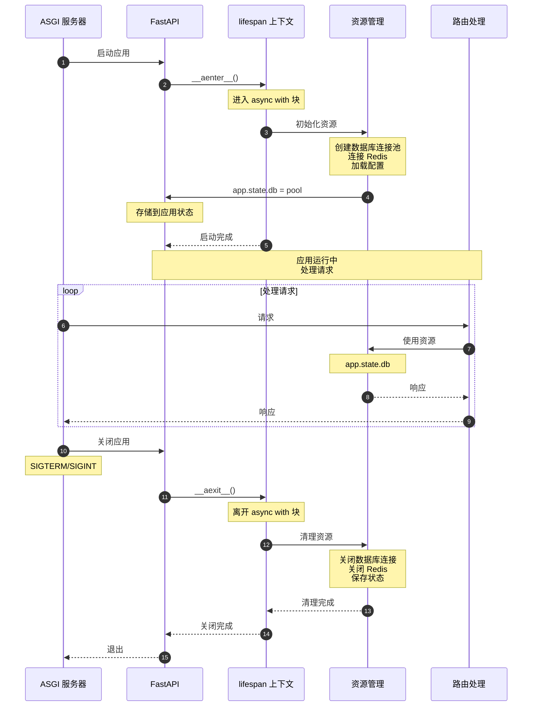

# FastAPI 源码剖析 - 01 应用层 - 时序图

## 概述

本文档详细展示 FastAPI 应用层各个关键流程的时序图，包括应用初始化、路由注册、请求处理等核心流程。

---

## 1. 应用初始化时序

### 完整初始化流程

### 初始化步骤说明

**步骤 1-2：创建实例**
- 开发者调用 `FastAPI()` 构造函数
- 传递 OpenAPI 配置参数（title、version 等）

**步骤 3-7：父类初始化**
- 调用 Starlette 的 `__init__` 方法
- 初始化 ASGI 应用基础属性
- 设置 debug 模式、routes、middleware、state 等

**步骤 8-11：创建路由器**
- 创建内部 `APIRouter` 实例（`self.router`）
- 创建 webhooks 路由器（`self.webhooks`）
- 路由器继承应用级配置（dependencies、default_response_class 等）

**步骤 12-13：OpenAPI 初始化**
- 将 `openapi_schema` 设置为 `None`
- 采用延迟生成策略（首次访问时生成）

**步骤 14-16：注册默认异常处理器**
- `HTTPException` → `http_exception_handler`
- `RequestValidationError` → `request_validation_exception_handler`
- `WebSocketRequestValidationError` → `websocket_request_validation_exception_handler`

**步骤 17-25：设置文档路由**
- 调用 `setup()` 方法
- 根据配置注册文档相关路由：
  - `/openapi.json`：返回 OpenAPI JSON schema
  - `/docs`：Swagger UI 文档界面
  - `/redoc`：ReDoc 文档界面
  - `/docs/oauth2-redirect`：OAuth2 重定向页面

---

## 2. 路由注册时序

### 使用装饰器注册路由

### 直接调用方法注册

---

## 3. 路由包含时序（include_router）

---

## 4. 中间件注册时序

### 使用 add_middleware

### 使用 @app.middleware 装饰器

---

## 5. 异常处理器注册时序

---

## 6. OpenAPI Schema 生成时序

### 首次访问文档时生成

---

## 7. 完整请求处理时序

---

## 8. 应用生命周期时序

### 使用 Lifespan 上下文管理器

### 已废弃的 on_event 方式

---

## 9. 中间件栈构建时序

### 首次请求时构建

---

## 总结

FastAPI 应用层的时序流程包括：

1. **初始化**：创建 FastAPI 实例，设置配置，注册默认处理器
2. **路由注册**：通过装饰器或方法注册路由，构建依赖树
3. **路由包含**：合并子路由器到主应用
4. **中间件注册**：添加中间件到列表
5. **异常处理器**：注册自定义异常处理器
6. **OpenAPI 生成**：延迟生成并缓存 schema
7. **请求处理**：完整的请求-响应生命周期
8. **应用生命周期**：启动和关闭资源管理
9. **中间件栈**：首次请求时构建洋葱模型

这些时序图展示了 FastAPI 应用层的核心工作流程和组件交互。

