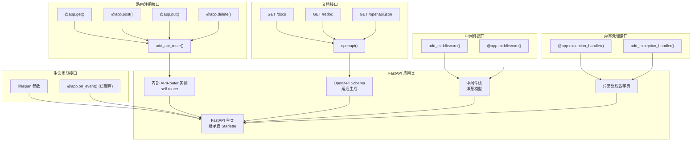

# FastAPI 源码剖析 - 01 应用层 - 概览

## 模块职责

应用层（`applications.py`）是 FastAPI 框架的核心入口模块，提供 `FastAPI` 主应用类。该模块的核心职责包括：

### 主要职责

1. **应用初始化与配置**
   - 管理应用级配置（标题、版本、描述等）
   - 初始化路由系统
   - 配置 OpenAPI 文档参数
   - 设置生命周期事件处理

2. **路由管理**
   - 提供路由注册装饰器（`@app.get`、`@app.post` 等）
   - 管理路由分组（通过 `APIRouter`）
   - 支持路径参数、查询参数、请求体等多种参数类型
   - 路由级别的依赖注入配置

3. **中间件管理**
   - 注册和管理中间件栈
   - 内置核心中间件（异常处理、异步上下文管理）
   - 支持自定义中间件

4. **OpenAPI 文档生成**
   - 自动生成 OpenAPI 3.1 规范
   - 提供 Swagger UI 和 ReDoc 交互式文档
   - 支持自定义 OpenAPI schema

5. **异常处理**
   - 注册全局异常处理器
   - 内置请求验证异常处理
   - 支持自定义异常处理器

6. **ASGI 应用接口**
   - 实现 ASGI 规范的 `__call__` 方法
   - 处理 HTTP 和 WebSocket 连接
   - 构建中间件栈

## 输入与输出

### 输入
- **应用配置参数**：初始化时的配置参数（title、version、debug 等）
- **路由定义**：通过装饰器或方法注册的路由处理函数
- **中间件**：通过 `add_middleware` 或 `@app.middleware` 注册的中间件
- **ASGI 请求**：来自 ASGI 服务器的 `(scope, receive, send)` 三元组

### 输出
- **ASGI 应用**：符合 ASGI 规范的可调用对象
- **OpenAPI Schema**：JSON 格式的 API 文档规范
- **HTML 文档页面**：Swagger UI 和 ReDoc 文档页面
- **HTTP 响应**：通过 ASGI send 接口发送的响应数据

## 上下游依赖

### 上游依赖（被调用方）
- **Starlette**：FastAPI 继承自 `Starlette` 类，复用其 ASGI 应用基础能力
- **routing.APIRouter**：委托路由管理给 APIRouter 实例
- **openapi.utils.get_openapi**：调用 OpenAPI 生成工具
- **middleware/**：使用各种中间件组件
- **exception_handlers**：使用内置异常处理器

### 下游依赖（调用方）
- **ASGI 服务器**（Uvicorn、Hypercorn 等）：调用 FastAPI 应用的 `__call__` 方法
- **用户代码**：通过装饰器和方法注册路由、中间件、异常处理器

## 生命周期

### 初始化阶段
1. 创建 FastAPI 实例
2. 设置应用配置参数
3. 创建内部 APIRouter 实例
4. 注册默认异常处理器
5. 初始化空的 OpenAPI schema（延迟生成）

### 配置阶段
1. 注册路由（通过装饰器或方法）
2. 注册中间件
3. 配置依赖注入
4. 设置生命周期事件处理器
5. 配置异常处理器

### 运行阶段
1. ASGI 服务器调用 `app(scope, receive, send)`
2. 构建中间件栈（首次调用时）
3. 请求通过中间件栈
4. 路由匹配与处理
5. 返回响应

### 关闭阶段
1. 触发 shutdown 生命周期事件
2. 清理资源（数据库连接、缓存等）

## 模块架构图



### 架构说明

#### FastAPI 类设计

**继承关系**：
- `FastAPI` 继承自 `Starlette`，复用 ASGI 应用基础能力
- 扩展了 Starlette 的功能，增加了自动文档生成、请求验证、依赖注入等特性

**核心属性**：
```python
class FastAPI(Starlette):
    # OpenAPI 相关
    title: str = "FastAPI"
    version: str = "0.1.0"
    openapi_version: str = "3.1.0"
    openapi_schema: Optional[Dict[str, Any]] = None
    
    # 路由相关
    router: APIRouter  # 内部路由器
    
    # 文档 URL
    docs_url: Optional[str] = "/docs"
    redoc_url: Optional[str] = "/redoc"
    openapi_url: Optional[str] = "/openapi.json"
    
    # 配置
    debug: bool = False
    separate_input_output_schemas: bool = True
```

**委托模式**：
- FastAPI 内部持有一个 `APIRouter` 实例（`self.router`）
- 大部分路由相关的操作委托给 `self.router` 处理
- FastAPI 本身专注于应用级配置和文档生成

#### 路由注册机制

**装饰器方式**（推荐）：
```python
@app.get("/items/{item_id}")
async def read_item(item_id: int):
    return {"item_id": item_id}
```

**方法调用方式**：
```python
app.add_api_route("/items/{item_id}", read_item, methods=["GET"])
```

**内部流程**：
1. 装饰器调用 `app.api_route()` 方法
2. `api_route()` 返回装饰器函数
3. 装饰器函数调用 `self.router.add_api_route()`
4. APIRouter 创建 `APIRoute` 对象并添加到路由列表

#### 中间件栈构建

**中间件顺序**（从外到内）：
1. **ServerErrorMiddleware**：捕获 500 错误
2. **用户自定义中间件**：通过 `app.add_middleware()` 添加
3. **ExceptionMiddleware**：捕获 HTTPException
4. **AsyncExitStackMiddleware**：管理异步上下文（依赖项清理）
5. **Router**：路由处理

**洋葱模型**：
```
请求 → 中间件1(前) → 中间件2(前) → ... → 路由处理 → ... → 中间件2(后) → 中间件1(后) → 响应
```

#### OpenAPI 文档生成

**延迟生成策略**：
- OpenAPI schema 不在应用初始化时生成
- 首次访问 `/docs`、`/redoc` 或 `/openapi.json` 时触发生成
- 生成后缓存在 `app.openapi_schema` 中

**生成流程**：
1. 调用 `app.openapi()` 方法
2. 检查 `self.openapi_schema` 是否已缓存
3. 如未缓存，调用 `get_openapi()` 函数
4. 遍历所有路由，提取参数、模型、响应信息
5. 生成符合 OpenAPI 3.1 规范的 JSON Schema
6. 缓存并返回

#### 异常处理机制

**内置异常处理器**：
- `HTTPException` → `http_exception_handler`
- `RequestValidationError` → `request_validation_exception_handler`
- `WebSocketRequestValidationError` → `websocket_request_validation_exception_handler`

**自定义异常处理器**：
```python
@app.exception_handler(CustomException)
async def custom_exception_handler(request, exc):
    return JSONResponse(
        status_code=500,
        content={"message": str(exc)}
    )
```

## 边界条件

### 并发处理
- **异步路由**：在事件循环中并发执行，单个路由内部可以 await 多个异步操作
- **同步路由**：在线程池中执行，默认线程池大小为 40
- **全局状态**：`app.state` 在并发请求间共享，需注意线程/协程安全

### 资源限制
- **路由数量**：无硬性限制，但过多路由会影响匹配性能（O(n) 复杂度）
- **中间件层数**：建议不超过 10 层，过多层级影响性能
- **OpenAPI Schema 大小**：大型 API（数百个端点）的 schema 可能达到几 MB

### 内存占用
- **应用实例**：每个 FastAPI 实例占用约 1-2 MB 基础内存
- **路由缓存**：每个路由的依赖树在启动时预解析并缓存
- **OpenAPI Schema**：生成后缓存在内存中

## 扩展点

### 自定义 OpenAPI 生成
```python
def custom_openapi():
    if app.openapi_schema:
        return app.openapi_schema
    
    openapi_schema = get_openapi(...)
    # 自定义修改 schema
    openapi_schema["info"]["x-logo"] = {"url": "..."}
    app.openapi_schema = openapi_schema
    return app.openapi_schema

app.openapi = custom_openapi
```

### 自定义文档 UI
```python
@app.get("/docs", include_in_schema=False)
async def custom_swagger_ui_html():
    return get_swagger_ui_html(
        openapi_url=app.openapi_url,
        title=app.title + " - Swagger UI",
        swagger_js_url="自定义 CDN URL",
        swagger_css_url="自定义 CSS URL",
    )
```

### 子应用挂载
```python
# 子应用
sub_app = FastAPI()

@sub_app.get("/hello")
async def sub_hello():
    return {"message": "Hello from sub app"}

# 挂载到主应用
app.mount("/sub", sub_app)

# 访问：GET /sub/hello
```

### 生命周期管理
```python
from contextlib import asynccontextmanager

@asynccontextmanager
async def lifespan(app: FastAPI):
    # 启动时执行
    db_pool = await create_db_pool()
    app.state.db_pool = db_pool
    
    yield
    
    # 关闭时执行
    await db_pool.close()

app = FastAPI(lifespan=lifespan)
```

## 性能要点

### 启动性能
- **依赖树预解析**：所有路由的依赖树在应用启动时预解析，减少运行时开销
- **OpenAPI 延迟生成**：文档在首次访问时生成，避免影响启动速度
- **中间件栈缓存**：中间件栈在首次请求时构建并缓存

### 运行时性能
- **路由匹配**：使用编译后的正则表达式，O(路由数量)
- **依赖缓存**：依赖项结果在同一请求中缓存，避免重复执行
- **响应序列化**：默认使用 `json.dumps`，可替换为 `orjson` 提升性能

### 内存优化
- **响应模型**：使用 `response_model_exclude_unset=True` 减少序列化数据量
- **流式响应**：对于大文件，使用 `StreamingResponse` 避免加载全部到内存
- **连接池**：数据库和 HTTP 客户端使用连接池，避免频繁创建连接

## 最佳实践

### 应用结构
```python
# 推荐的项目结构
# main.py
from fastapi import FastAPI
from .routers import users, items

app = FastAPI(
    title="My API",
    version="1.0.0",
    description="API description",
)

# 注册路由模块
app.include_router(users.router, prefix="/users", tags=["users"])
app.include_router(items.router, prefix="/items", tags=["items"])

# 全局中间件
@app.middleware("http")
async def add_request_id(request, call_next):
    request.state.request_id = generate_id()
    response = await call_next(request)
    response.headers["X-Request-ID"] = request.state.request_id
    return response

# 全局异常处理
@app.exception_handler(Exception)
async def global_exception_handler(request, exc):
    return JSONResponse(
        status_code=500,
        content={"detail": "Internal server error"}
    )
```

### 配置管理
```python
from pydantic_settings import BaseSettings

class Settings(BaseSettings):
    app_name: str = "My API"
    admin_email: str
    database_url: str
    
    class Config:
        env_file = ".env"

settings = Settings()

app = FastAPI(
    title=settings.app_name,
    contact={"email": settings.admin_email}
)
```

### 依赖注入
```python
# 将配置作为依赖注入
def get_settings():
    return settings

@app.get("/info")
async def info(settings: Settings = Depends(get_settings)):
    return {"app_name": settings.app_name}
```

### 文档优化
```python
# 为 OpenAPI 添加标签元数据
tags_metadata = [
    {
        "name": "users",
        "description": "Operations with users.",
    },
    {
        "name": "items",
        "description": "Manage items.",
    },
]

app = FastAPI(openapi_tags=tags_metadata)
```

## 与其他模块的关系

### 与 routing 模块
- FastAPI 内部持有 APIRouter 实例
- 所有路由注册操作委托给 APIRouter
- FastAPI 负责应用级配置，APIRouter 负责路由管理

### 与 openapi 模块
- FastAPI 调用 `openapi.utils.get_openapi()` 生成文档
- FastAPI 提供文档 UI 路由（`/docs`、`/redoc`）
- 文档 URL 可自定义或禁用

### 与 middleware 模块
- FastAPI 注册中间件到 Starlette 的中间件栈
- 添加了 `AsyncExitStackMiddleware` 用于依赖清理
- 中间件按注册顺序反向执行（洋葱模型）

### 与 dependencies 模块
- FastAPI 不直接处理依赖注入
- 依赖注入由 APIRoute 在请求处理时执行
- FastAPI 通过 `dependencies` 参数支持应用级依赖

### 与 exceptions 模块
- FastAPI 注册默认异常处理器
- 支持自定义异常处理器
- 异常处理在 ExceptionMiddleware 中进行

## 常见问题

### Q: FastAPI 和 Starlette 的关系？
A: FastAPI 继承自 Starlette，在其基础上增加了：
- 自动请求验证（基于 Pydantic）
- 自动 OpenAPI 文档生成
- 依赖注入系统
- 更简洁的路由装饰器

### Q: 为什么需要 AsyncExitStackMiddleware？
A: 用于管理依赖项的异步上下文（yield）。当依赖项使用 `yield` 时，需要在请求结束后执行清理逻辑（如关闭数据库连接），这个中间件负责管理这些上下文。

### Q: OpenAPI schema 什么时候生成？
A: 延迟生成。首次访问 `/docs`、`/redoc` 或 `/openapi.json` 时生成，之后缓存在 `app.openapi_schema` 中。可以通过修改 `app.openapi()` 方法自定义生成逻辑。

### Q: 如何禁用自动文档？
A:
```python
app = FastAPI(
    docs_url=None,    # 禁用 Swagger UI
    redoc_url=None,   # 禁用 ReDoc
    openapi_url=None, # 禁用 OpenAPI JSON
)
```

### Q: 多个 FastAPI 实例如何共享状态？
A: 不推荐多个实例共享状态。如需共享，使用外部存储（Redis、数据库）或全局变量（注意线程安全）。

### Q: 如何实现 API 版本控制？
A:
```python
# 方式 1：路由前缀
app.include_router(v1_router, prefix="/api/v1")
app.include_router(v2_router, prefix="/api/v2")

# 方式 2：子应用
v1_app = FastAPI()
v2_app = FastAPI()
app.mount("/api/v1", v1_app)
app.mount("/api/v2", v2_app)
```

