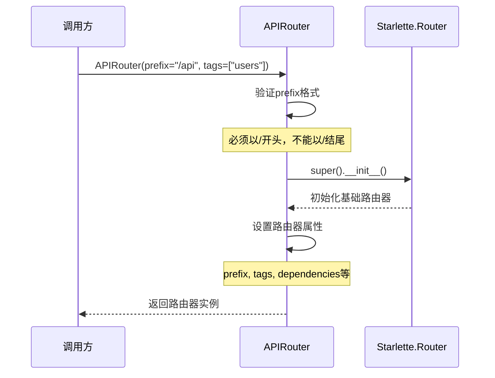
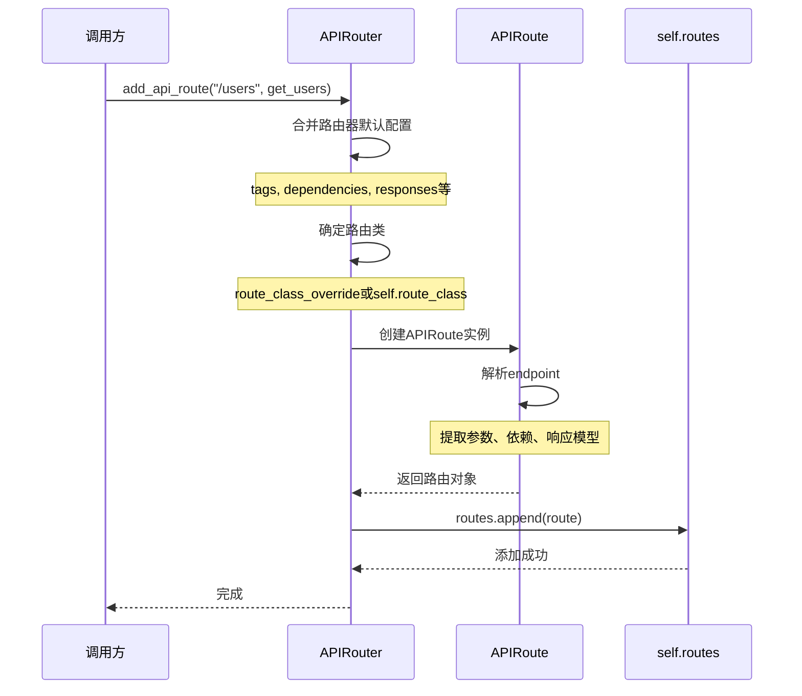
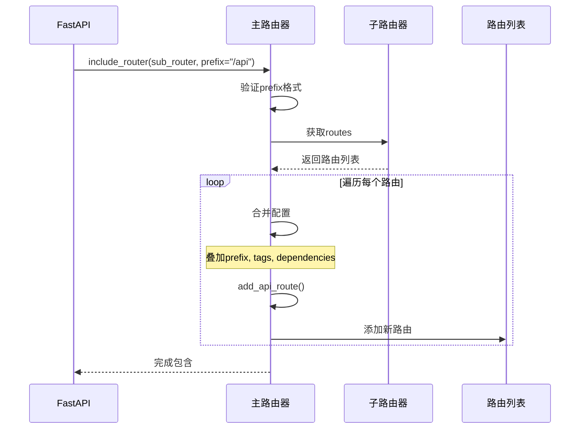
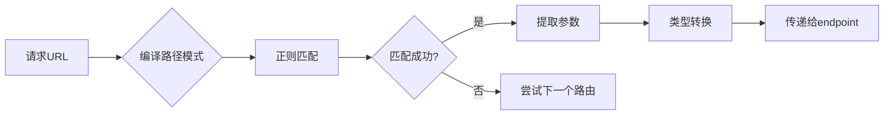

# FastAPI-02-路由系统-API

> **文档版本**: v1.0  
> **FastAPI 版本**: 0.118.0  
> **创建日期**: 2025年10月4日

---

## 📋 目录

1. [模块说明](#模块说明)
2. [核心API概览](#核心API概览)
3. [APIRouter类详解](#apirouter类详解)
4. [路由注册API](#路由注册api)
5. [路由装饰器API](#路由装饰器api)
6. [路由包含API](#路由包含api)
7. [路由匹配API](#路由匹配api)
8. [最佳实践](#最佳实践)

---

## 模块说明

### 模块位置
```
fastapi/routing.py
```

### 职责范围
路由系统是FastAPI的核心模块之一，负责：
- 路由注册与管理
- URL路径匹配与解析
- 路径参数提取
- 路由分组与嵌套
- 路由元数据管理

### 对外API分类

| 分类 | API数量 | 说明 |
|------|---------|------|
| 路由器类 | 1 | `APIRouter` 主类 |
| 路由注册 | 2 | `add_api_route()`, `api_route()` |
| HTTP方法装饰器 | 9 | `get()`, `post()`, `put()`, `delete()` 等 |
| 路由包含 | 1 | `include_router()` |
| 路由匹配 | 内部 | 继承自 Starlette |

---

## 核心API概览

### API清单

| # | API名称 | 类型 | 用途 | 常用度 |
|---|---------|------|------|--------|
| 1 | `APIRouter.__init__()` | 构造器 | 创建路由器实例 | ⭐⭐⭐⭐⭐ |
| 2 | `add_api_route()` | 方法 | 直接注册路由 | ⭐⭐⭐⭐ |
| 3 | `api_route()` | 装饰器 | 通用路由装饰器 | ⭐⭐⭐ |
| 4 | `get()` | 装饰器 | GET请求装饰器 | ⭐⭐⭐⭐⭐ |
| 5 | `post()` | 装饰器 | POST请求装饰器 | ⭐⭐⭐⭐⭐ |
| 6 | `put()` | 装饰器 | PUT请求装饰器 | ⭐⭐⭐⭐ |
| 7 | `delete()` | 装饰器 | DELETE请求装饰器 | ⭐⭐⭐⭐ |
| 8 | `patch()` | 装饰器 | PATCH请求装饰器 | ⭐⭐⭐ |
| 9 | `options()` | 装饰器 | OPTIONS请求装饰器 | ⭐⭐ |
| 10 | `head()` | 装饰器 | HEAD请求装饰器 | ⭐⭐ |
| 11 | `trace()` | 装饰器 | TRACE请求装饰器 | ⭐ |
| 12 | `include_router()` | 方法 | 包含子路由器 | ⭐⭐⭐⭐⭐ |
| 13 | `add_websocket_route()` | 方法 | 注册WebSocket路由 | ⭐⭐⭐ |
| 14 | `websocket()` | 装饰器 | WebSocket装饰器 | ⭐⭐⭐ |

---

## APIRouter类详解

### 1. APIRouter.__init__()

#### 基本信息
- **功能**: 创建路由器实例，支持路由分组、前缀、标签等配置
- **继承**: `starlette.routing.Router`
- **用途**: 构建模块化的路由结构

#### 完整参数列表

```python
def __init__(
    self,
    *,
    prefix: str = "",
    tags: Optional[List[Union[str, Enum]]] = None,
    dependencies: Optional[Sequence[params.Depends]] = None,
    default_response_class: Type[Response] = Default(JSONResponse),
    responses: Optional[Dict[Union[int, str], Dict[str, Any]]] = None,
    callbacks: Optional[List[BaseRoute]] = None,
    routes: Optional[List[BaseRoute]] = None,
    redirect_slashes: bool = True,
    default: Optional[ASGIApp] = None,
    dependency_overrides_provider: Optional[Any] = None,
    route_class: Type[APIRoute] = APIRoute,
    on_startup: Optional[Sequence[Callable[[], Any]]] = None,
    on_shutdown: Optional[Sequence[Callable[[], Any]]] = None,
    lifespan: Optional[Lifespan[Any]] = None,
    deprecated: Optional[bool] = None,
    include_in_schema: bool = True,
    generate_unique_id_function: Callable[[APIRoute], str] = Default(generate_unique_id),
) -> None
```

#### 参数详解

| 参数 | 类型 | 必填 | 默认值 | 说明 |
|------|------|------|--------|------|
| **prefix** | str | 否 | `""` | 路由前缀，必须以`/`开头，不能以`/`结尾 |
| **tags** | List[str\|Enum] | 否 | None | 标签列表，应用于所有路由，用于OpenAPI分组 |
| **dependencies** | Sequence[Depends] | 否 | None | 依赖列表，应用于所有路由 |
| **default_response_class** | Type[Response] | 否 | JSONResponse | 默认响应类 |
| **responses** | Dict | 否 | None | 额外的OpenAPI响应定义 |
| **callbacks** | List[BaseRoute] | 否 | None | OpenAPI回调定义 |
| **routes** | List[BaseRoute] | 否 | None | 初始路由列表（不推荐直接使用） |
| **redirect_slashes** | bool | 否 | True | 是否自动重定向末尾斜杠 |
| **default** | ASGIApp | 否 | None | 404处理器 |
| **dependency_overrides_provider** | Any | 否 | None | 依赖覆盖提供者（内部使用） |
| **route_class** | Type[APIRoute] | 否 | APIRoute | 自定义路由类 |
| **on_startup** | Sequence[Callable] | 否 | None | 启动事件处理器（已废弃，用lifespan） |
| **on_shutdown** | Sequence[Callable] | 否 | None | 关闭事件处理器（已废弃，用lifespan） |
| **lifespan** | Lifespan | 否 | None | 生命周期上下文管理器 |
| **deprecated** | bool | 否 | None | 标记所有路由为废弃 |
| **include_in_schema** | bool | 否 | True | 是否包含在OpenAPI schema中 |
| **generate_unique_id_function** | Callable | 否 | generate_unique_id | 生成路由唯一ID的函数 |

#### 核心代码

```python
class APIRouter(routing.Router):
    def __init__(
        self,
        *,
        prefix: str = "",
        tags: Optional[List[Union[str, Enum]]] = None,
        dependencies: Optional[Sequence[params.Depends]] = None,
        default_response_class: Type[Response] = Default(JSONResponse),
        # ... 其他参数
    ) -> None:
        # 调用父类构造器
        super().__init__(
            routes=routes,
            redirect_slashes=redirect_slashes,
            default=default,
            on_startup=on_startup,
            on_shutdown=on_shutdown,
            lifespan=lifespan,
        )
        
        # 验证prefix格式
        if prefix:
            assert prefix.startswith("/"), "A path prefix must start with '/'"
            assert not prefix.endswith("/"), (
                "A path prefix must not end with '/', as the routes will start with '/'"
            )
        
        # 初始化路由器属性
        self.prefix = prefix
        self.tags: List[Union[str, Enum]] = tags or []
        self.dependencies = list(dependencies or [])
        self.deprecated = deprecated
        self.include_in_schema = include_in_schema
        self.responses = responses or {}
        self.callbacks = callbacks or []
        self.dependency_overrides_provider = dependency_overrides_provider
        self.route_class = route_class
        self.default_response_class = default_response_class
        self.generate_unique_id_function = generate_unique_id_function
```

#### 执行流程



**时序图说明**：
1. **图意概述**: 展示APIRouter实例化的完整流程，包括参数验证和属性初始化
2. **关键字段**: prefix需要格式验证，tags和dependencies应用于所有子路由
3. **边界条件**: prefix格式错误会触发断言失败；空prefix表示无前缀
4. **异常路径**: 格式验证失败抛出AssertionError
5. **性能要点**: 构造器轻量级，仅做属性赋值，无IO操作

#### 使用示例

**示例1：基础路由器**
```python
from fastapi import APIRouter

router = APIRouter()

@router.get("/items")
async def read_items():
    return {"items": []}
```

**示例2：带前缀和标签的路由器**
```python
router = APIRouter(
    prefix="/api/v1",
    tags=["users"],
    responses={404: {"description": "Not found"}},
)

@router.get("/users")
async def get_users():
    return []
```

**示例3：带依赖的路由器**
```python
from fastapi import Depends

async def verify_token(token: str):
    # 验证逻辑
    pass

router = APIRouter(
    prefix="/admin",
    dependencies=[Depends(verify_token)],
)

@router.get("/users")
async def admin_users():
    # 所有路由都会自动应用verify_token依赖
    return []
```

#### 边界与异常

| 场景 | 行为 | 返回/异常 |
|------|------|----------|
| prefix不以`/`开头 | 断言失败 | AssertionError |
| prefix以`/`结尾 | 断言失败 | AssertionError |
| prefix为空字符串 | 正常 | 无前缀 |
| tags为None | 正常 | 转换为空列表 |
| dependencies为None | 正常 | 转换为空列表 |

#### 性能要点
- ✅ 轻量级构造器，O(1)时间复杂度
- ✅ 属性初始化无IO操作
- ✅ 参数验证仅在开发阶段有用（生产环境已验证）

---

## 路由注册API

### 2. add_api_route()

#### 基本信息
- **功能**: 直接注册API路由，不使用装饰器
- **协议**: HTTP
- **幂等性**: 否（重复调用会注册多个路由）

#### 完整参数列表

```python
def add_api_route(
    self,
    path: str,
    endpoint: Callable[..., Any],
    *,
    response_model: Any = Default(None),
    status_code: Optional[int] = None,
    tags: Optional[List[Union[str, Enum]]] = None,
    dependencies: Optional[Sequence[params.Depends]] = None,
    summary: Optional[str] = None,
    description: Optional[str] = None,
    response_description: str = "Successful Response",
    responses: Optional[Dict[Union[int, str], Dict[str, Any]]] = None,
    deprecated: Optional[bool] = None,
    methods: Optional[Union[Set[str], List[str]]] = None,
    operation_id: Optional[str] = None,
    response_model_include: Optional[IncEx] = None,
    response_model_exclude: Optional[IncEx] = None,
    response_model_by_alias: bool = True,
    response_model_exclude_unset: bool = False,
    response_model_exclude_defaults: bool = False,
    response_model_exclude_none: bool = False,
    include_in_schema: bool = True,
    response_class: Union[Type[Response], DefaultPlaceholder] = Default(JSONResponse),
    name: Optional[str] = None,
    route_class_override: Optional[Type[APIRoute]] = None,
    callbacks: Optional[List[BaseRoute]] = None,
    openapi_extra: Optional[Dict[str, Any]] = None,
    generate_unique_id_function: Union[
        Callable[[APIRoute], str], DefaultPlaceholder
    ] = Default(generate_unique_id),
) -> None
```

#### 核心参数详解

| 参数 | 类型 | 必填 | 默认值 | 说明 |
|------|------|------|--------|------|
| **path** | str | 是 | - | 路由路径，可包含路径参数 `{param}` |
| **endpoint** | Callable | 是 | - | 路由处理函数 |
| **response_model** | Any | 否 | None | 响应数据模型（Pydantic） |
| **status_code** | int | 否 | 200 | 默认HTTP状态码 |
| **tags** | List[str] | 否 | None | OpenAPI标签 |
| **dependencies** | Sequence[Depends] | 否 | None | 路由级依赖 |
| **summary** | str | 否 | None | API摘要（OpenAPI） |
| **description** | str | 否 | None | API详细描述（OpenAPI） |
| **methods** | Set[str] | 否 | ["GET"] | HTTP方法列表 |
| **deprecated** | bool | 否 | None | 标记为废弃 |
| **include_in_schema** | bool | 否 | True | 是否包含在OpenAPI中 |
| **response_class** | Type[Response] | 否 | JSONResponse | 响应类 |

#### 核心代码

```python
def add_api_route(
    self,
    path: str,
    endpoint: Callable[..., Any],
    *,
    response_model: Any = Default(None),
    status_code: Optional[int] = None,
    tags: Optional[List[Union[str, Enum]]] = None,
    dependencies: Optional[Sequence[params.Depends]] = None,
    # ... 其他参数
) -> None:
    # 使用当前路由器的配置作为默认值
    current_response_class = get_value_or_default(
        response_class, self.default_response_class
    )
    current_tags = tags if tags is not None else self.tags.copy()
    current_dependencies = dependencies if dependencies is not None else self.dependencies.copy()
    current_callbacks = callbacks if callbacks is not None else self.callbacks.copy()
    current_generate_unique_id = get_value_or_default(
        generate_unique_id_function, self.generate_unique_id_function
    )
    
    # 合并responses配置
    current_responses = self.responses.copy()
    current_responses.update(responses or {})
    
    # 确定路由类
    actual_route_class = route_class_override or self.route_class
    
    # 创建路由对象
    route = actual_route_class(
        self.prefix + path,
        endpoint=endpoint,
        response_model=response_model,
        status_code=status_code,
        tags=current_tags,
        dependencies=current_dependencies,
        # ... 其他参数
    )
    
    # 添加到路由列表
    self.routes.append(route)
```

#### 调用链路



**时序图说明**：
1. **图意概述**: 展示路由注册的完整流程，从参数合并到路由对象创建
2. **关键字段**: path会与router.prefix合并；tags/dependencies会与路由器默认值合并
3. **边界条件**: path可以为空字符串；endpoint必须是可调用对象
4. **异常路径**: endpoint不可调用会在后续请求时报错
5. **性能要点**: 路由注册在启动时完成，对运行时性能无影响

#### 使用示例

**示例1：基本路由注册**
```python
router = APIRouter()

async def get_items():
    return {"items": []}

router.add_api_route("/items", get_items, methods=["GET"])
```

**示例2：带响应模型的注册**
```python
from pydantic import BaseModel

class Item(BaseModel):
    id: int
    name: str

async def create_item(item: Item) -> Item:
    return item

router.add_api_route(
    "/items",
    create_item,
    methods=["POST"],
    response_model=Item,
    status_code=201,
    tags=["items"],
)
```

**示例3：批量注册不同HTTP方法**
```python
async def handle_item(item_id: int):
    return {"id": item_id}

router.add_api_route("/items/{item_id}", handle_item, methods=["GET", "PUT", "DELETE"])
```

---

### 3. api_route()

#### 基本信息
- **功能**: 通用路由装饰器，可指定多个HTTP方法
- **类型**: 装饰器
- **用途**: 灵活的路由注册方式

#### 函数签名

```python
def api_route(
    self,
    path: str,
    *,
    response_model: Any = Default(None),
    status_code: Optional[int] = None,
    tags: Optional[List[Union[str, Enum]]] = None,
    dependencies: Optional[Sequence[params.Depends]] = None,
    summary: Optional[str] = None,
    description: Optional[str] = None,
    # ... 与add_api_route相同的参数
    methods: Optional[List[str]] = None,
) -> Callable[[DecoratedCallable], DecoratedCallable]
```

#### 核心代码

```python
def api_route(
    self,
    path: str,
    *,
    # ... 所有参数
) -> Callable[[DecoratedCallable], DecoratedCallable]:
    def decorator(func: DecoratedCallable) -> DecoratedCallable:
        self.add_api_route(
            path,
            func,
            response_model=response_model,
            status_code=status_code,
            tags=tags,
            dependencies=dependencies,
            # ... 所有参数
        )
        return func
    
    return decorator
```

**实现说明**：
- `api_route()` 是 `add_api_route()` 的装饰器封装
- 接受相同的参数
- 返回原始函数（不修改函数）

#### 使用示例

```python
@router.api_route("/items/{item_id}", methods=["GET", "PUT"])
async def item_operations(item_id: int):
    return {"id": item_id}
```

---

## 路由装饰器API

### 4. HTTP方法装饰器系列

FastAPI为每个HTTP方法提供了专用装饰器，它们都是`api_route()`的特化版本。

#### 4.1 get()

```python
def get(
    self,
    path: str,
    *,
    response_model: Any = Default(None),
    status_code: Optional[int] = None,
    # ... 其他参数（同api_route，但无methods参数）
) -> Callable[[DecoratedCallable], DecoratedCallable]:
    return self.api_route(
        path=path,
        response_model=response_model,
        status_code=status_code,
        # ... 其他参数
        methods=["GET"],
    )
```

**核心实现**：
```python
def get(self, path: str, **kwargs) -> Callable:
    return self.api_route(path, methods=["GET"], **kwargs)
```

**使用示例**：
```python
@router.get("/items")
async def read_items():
    return []

@router.get("/items/{item_id}", response_model=Item)
async def read_item(item_id: int):
    return {"id": item_id, "name": "Item"}
```

#### 4.2 post()

```python
def post(self, path: str, **kwargs) -> Callable:
    return self.api_route(path, methods=["POST"], **kwargs)
```

**常用配置**：
- `status_code=201`（创建资源）
- `response_model`（返回创建的资源）

**使用示例**：
```python
@router.post("/items", status_code=201, response_model=Item)
async def create_item(item: Item):
    return item
```

#### 4.3 put()

```python
def put(self, path: str, **kwargs) -> Callable:
    return self.api_route(path, methods=["PUT"], **kwargs)
```

**使用示例**：
```python
@router.put("/items/{item_id}", response_model=Item)
async def update_item(item_id: int, item: Item):
    item.id = item_id
    return item
```

#### 4.4 delete()

```python
def delete(self, path: str, **kwargs) -> Callable:
    return self.api_route(path, methods=["DELETE"], **kwargs)
```

**常用配置**：
- `status_code=204`（无内容）
- `response_model=None`（无响应体）

**使用示例**：
```python
@router.delete("/items/{item_id}", status_code=204)
async def delete_item(item_id: int):
    return None
```

#### 4.5 其他HTTP方法

| 方法 | 装饰器 | 常见用途 |
|------|--------|----------|
| **PATCH** | `@router.patch()` | 部分更新资源 |
| **OPTIONS** | `@router.options()` | CORS预检请求 |
| **HEAD** | `@router.head()` | 获取响应头 |
| **TRACE** | `@router.trace()` | 调试与诊断 |

#### HTTP方法装饰器对比

```mermaid
graph TB
    A[api_route] --> B[get]
    A --> C[post]
    A --> D[put]
    A --> E[delete]
    A --> F[patch]
    A --> G[options]
    A --> H[head]
    A --> I[trace]
    
    B -->|methods=['GET']| J[add_api_route]
    C -->|methods=['POST']| J
    D -->|methods=['PUT']| J
    E -->|methods=['DELETE']| J
```

**图说明**：
1. **图意**: 所有HTTP方法装饰器都通过`api_route()`最终调用`add_api_route()`
2. **关键点**: 唯一区别是`methods`参数的值
3. **边界条件**: 可以在`api_route()`中指定多个methods
4. **性能**: 所有装饰器性能相同，仅是语法糖

---

## 路由包含API

### 6. include_router()

#### 基本信息
- **功能**: 包含另一个路由器，实现路由嵌套
- **用途**: 模块化路由结构
- **特性**: 支持前缀、标签、依赖继承

#### 完整参数列表

```python
def include_router(
    self,
    router: APIRouter,
    *,
    prefix: str = "",
    tags: Optional[List[Union[str, Enum]]] = None,
    dependencies: Optional[Sequence[params.Depends]] = None,
    responses: Optional[Dict[Union[int, str], Dict[str, Any]]] = None,
    deprecated: Optional[bool] = None,
    include_in_schema: bool = True,
    default_response_class: Type[Response] = Default(JSONResponse),
    callbacks: Optional[List[BaseRoute]] = None,
    generate_unique_id_function: Callable[[APIRoute], str] = Default(generate_unique_id),
) -> None
```

#### 核心参数

| 参数 | 类型 | 说明 |
|------|------|------|
| **router** | APIRouter | 要包含的子路由器 |
| **prefix** | str | 额外的路径前缀（会叠加） |
| **tags** | List[str] | 额外的标签（会叠加） |
| **dependencies** | Sequence[Depends] | 额外的依赖（会叠加） |
| **responses** | Dict | 额外的响应定义（会合并） |

#### 核心代码

```python
def include_router(
    self,
    router: APIRouter,
    *,
    prefix: str = "",
    tags: Optional[List[Union[str, Enum]]] = None,
    dependencies: Optional[Sequence[params.Depends]] = None,
    # ... 其他参数
) -> None:
    # 验证prefix格式
    if prefix:
        assert prefix.startswith("/"), "A path prefix must start with '/'"
        assert not prefix.endswith("/"), "A path prefix must not end with '/'"
    
    # 遍历子路由器的所有路由
    for route in router.routes:
        if isinstance(route, APIRoute):
            # 合并配置
            combined_tags = (tags or []) + (route.tags or [])
            combined_dependencies = list(dependencies or []) + list(route.dependencies or [])
            combined_responses = {**(responses or {}), **(route.responses or {})}
            
            # 重新注册路由到当前路由器
            self.add_api_route(
                prefix + route.path,
                route.endpoint,
                response_model=route.response_model,
                status_code=route.status_code,
                tags=combined_tags,
                dependencies=combined_dependencies,
                responses=combined_responses,
                # ... 其他属性
            )
        elif isinstance(route, routing.Route):
            # 普通路由（非API路由）
            self.add_route(
                prefix + route.path,
                route.endpoint,
                methods=route.methods,
                name=route.name,
                include_in_schema=route.include_in_schema,
            )
        elif isinstance(route, APIWebSocketRoute):
            # WebSocket路由
            self.add_api_websocket_route(
                prefix + route.path,
                route.endpoint,
                name=route.name,
            )
```

#### 执行流程



**时序图说明**：
1. **图意概述**: 展示路由包含的配置合并和路由复制过程
2. **关键字段**: prefix会叠加；tags、dependencies会合并
3. **边界条件**: 空prefix有效；路由可以嵌套多层
4. **异常路径**: prefix格式错误抛出AssertionError
5. **性能要点**: 路由复制在启动时完成，不影响运行时性能

#### 使用示例

**示例1：基本包含**
```python
from fastapi import FastAPI, APIRouter

app = FastAPI()
router = APIRouter()

@router.get("/users")
async def get_users():
    return []

app.include_router(router, prefix="/api/v1")
# 实际路径: /api/v1/users
```

**示例2：多级嵌套**
```python
# users_router.py
users_router = APIRouter()

@users_router.get("/")
async def list_users():
    return []

@users_router.get("/{user_id}")
async def get_user(user_id: int):
    return {"id": user_id}

# api_router.py
api_router = APIRouter(prefix="/api/v1")
api_router.include_router(users_router, prefix="/users", tags=["users"])

# main.py
app = FastAPI()
app.include_router(api_router)
# 实际路径: /api/v1/users/, /api/v1/users/{user_id}
```

**示例3：带共享依赖**
```python
async def verify_token(token: str):
    # 验证逻辑
    pass

users_router = APIRouter()

@users_router.get("/me")
async def get_current_user():
    return {"user": "current"}

app.include_router(
    users_router,
    prefix="/api",
    dependencies=[Depends(verify_token)],
)
# 所有路由都会自动应用token验证
```

#### 配置叠加规则

| 配置项 | 叠加方式 | 示例 |
|--------|----------|------|
| **prefix** | 字符串拼接 | `/api` + `/users` = `/api/users` |
| **tags** | 列表合并 | `["api"]` + `["users"]` = `["api", "users"]` |
| **dependencies** | 列表合并 | `[auth]` + `[rate_limit]` = `[auth, rate_limit]` |
| **responses** | 字典合并 | `{404: ...}` + `{500: ...}` = `{404: ..., 500: ...}` |

---

## 路由匹配API

### 路由匹配机制

FastAPI的路由匹配基于Starlette，使用以下机制：

#### 匹配算法

```python
# 内部实现（简化版）
def match(self, scope: Scope) -> Tuple[Match, Scope]:
    for route in self.routes:
        match, child_scope = route.matches(scope)
        if match == Match.FULL:
            return Match.FULL, child_scope
        elif match == Match.PARTIAL:
            # 部分匹配，继续尝试
            pass
    return Match.NONE, {}
```

#### 匹配优先级

1. **完全匹配** > 参数匹配
2. **注册顺序**：先注册的优先
3. **路径深度**：更具体的路径优先

**示例**：
```python
@router.get("/users/me")  # 优先级1：完全匹配
async def get_current_user():
    pass

@router.get("/users/{user_id}")  # 优先级2：参数匹配
async def get_user(user_id: int):
    pass
```

#### 路径参数解析

```python
# 路径模式
"/users/{user_id}"        # 基本参数
"/users/{user_id:int}"    # 类型约束（Starlette）
"/files/{file_path:path}" # 路径参数（包含/）
```

**解析流程**：


---

## 最佳实践

### 1. 路由组织结构

**推荐结构**：
```
app/
├── main.py
├── routers/
│   ├── __init__.py
│   ├── users.py
│   ├── items.py
│   └── auth.py
```

**main.py**：
```python
from fastapi import FastAPI
from app.routers import users, items, auth

app = FastAPI()

app.include_router(auth.router, prefix="/auth", tags=["authentication"])
app.include_router(users.router, prefix="/users", tags=["users"])
app.include_router(items.router, prefix="/items", tags=["items"])
```

**routers/users.py**：
```python
from fastapi import APIRouter

router = APIRouter()

@router.get("/")
async def list_users():
    return []

@router.get("/{user_id}")
async def get_user(user_id: int):
    return {"id": user_id}
```

### 2. 版本管理

**方案1：前缀版本**
```python
app.include_router(router_v1, prefix="/api/v1")
app.include_router(router_v2, prefix="/api/v2")
```

**方案2：域名版本**
```python
# v1.example.com
# v2.example.com
```

### 3. 共享依赖

```python
# dependencies.py
async def get_db():
    db = Database()
    try:
        yield db
    finally:
        await db.close()

# router.py
router = APIRouter(dependencies=[Depends(get_db)])

@router.get("/items")
async def get_items(db=Depends(get_db)):
    # db自动注入
    return await db.query("SELECT * FROM items")
```

### 4. 路由命名约定

| 操作 | HTTP方法 | 路径 | 函数名 |
|------|----------|------|--------|
| 列表 | GET | `/items` | `list_items()` |
| 详情 | GET | `/items/{id}` | `get_item()` |
| 创建 | POST | `/items` | `create_item()` |
| 更新 | PUT | `/items/{id}` | `update_item()` |
| 删除 | DELETE | `/items/{id}` | `delete_item()` |

### 5. 性能优化

**优化点**：
1. ✅ 静态路由放在参数路由之前
2. ✅ 合理使用依赖缓存
3. ✅ 避免过深的路由嵌套（影响匹配性能）

**示例**：
```python
# ✅ 正确：静态路由在前
@router.get("/users/me")
async def current_user(): pass

@router.get("/users/{user_id}")
async def get_user(user_id: int): pass

# ❌ 错误：参数路由在前（会降低匹配效率）
@router.get("/users/{user_id}")
async def get_user(user_id: int): pass

@router.get("/users/me")  # 永远不会匹配到！
async def current_user(): pass
```

### 6. 错误处理

```python
from fastapi import HTTPException

@router.get("/items/{item_id}")
async def get_item(item_id: int):
    if item_id not in items:
        raise HTTPException(status_code=404, detail="Item not found")
    return items[item_id]
```

### 7. OpenAPI配置

```python
router = APIRouter(
    prefix="/api/v1",
    tags=["v1"],
    responses={
        404: {"description": "Not found"},
        500: {"description": "Internal server error"},
    },
)

@router.get(
    "/items/{item_id}",
    summary="Get an item",
    description="Retrieve a single item by ID",
    response_description="The requested item",
)
async def get_item(item_id: int):
    return {"id": item_id}
```

---

## 📚 相关文档

- [FastAPI-02-路由系统-概览](./FastAPI-02-路由系统-概览.md) - 路由系统整体架构
- [FastAPI-02-路由系统-数据结构](./FastAPI-02-路由系统-数据结构.md) - APIRoute等数据结构
- [FastAPI-02-路由系统-时序图](./FastAPI-02-路由系统-时序图.md) - 路由注册与匹配流程
- [FastAPI-03-依赖注入-概览](./FastAPI-03-依赖注入-概览.md) - 依赖注入机制

---

## 📊 API汇总表

| API | 类型 | 用途 | 复杂度 |
|-----|------|------|--------|
| `APIRouter()` | 构造器 | 创建路由器 | ⭐ |
| `add_api_route()` | 方法 | 注册路由 | ⭐⭐ |
| `api_route()` | 装饰器 | 通用路由装饰器 | ⭐ |
| `get/post/put/delete()` | 装饰器 | HTTP方法装饰器 | ⭐ |
| `include_router()` | 方法 | 包含子路由器 | ⭐⭐ |

---

*本文档生成于 2025年10月4日，基于 FastAPI 0.118.0*

