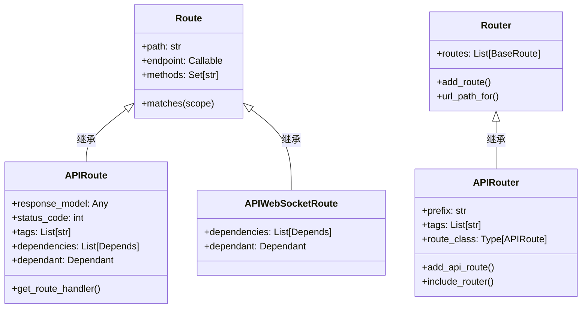
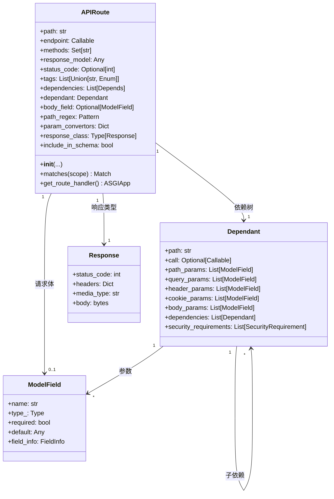
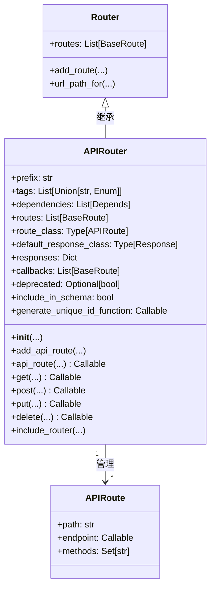
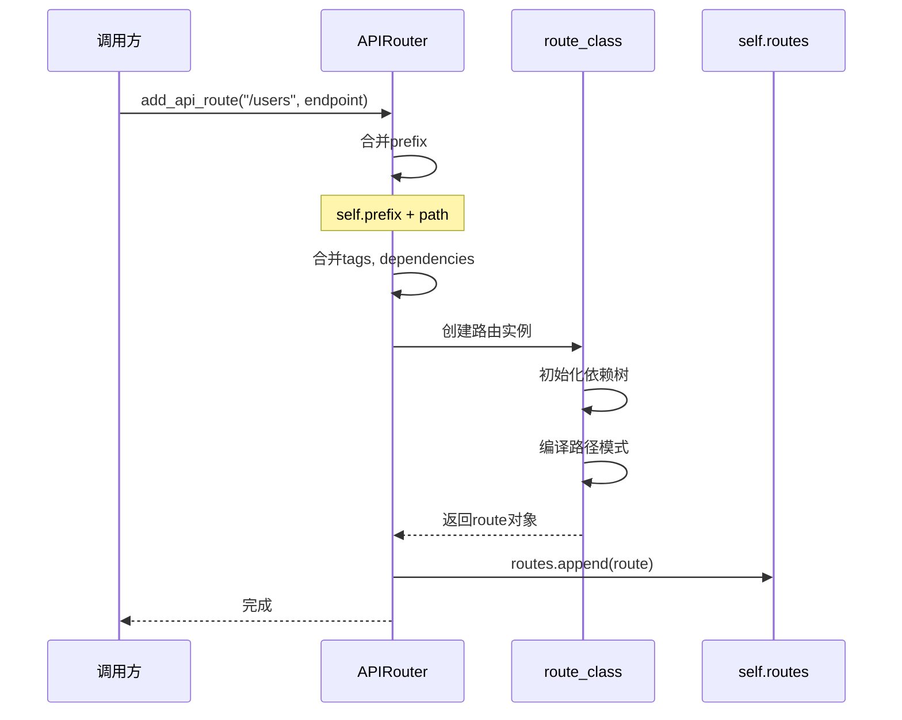
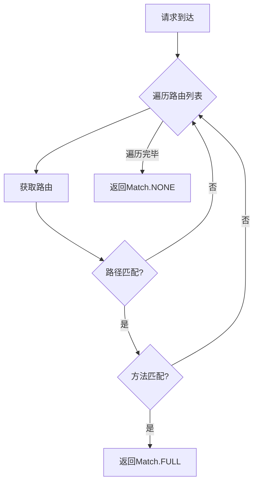
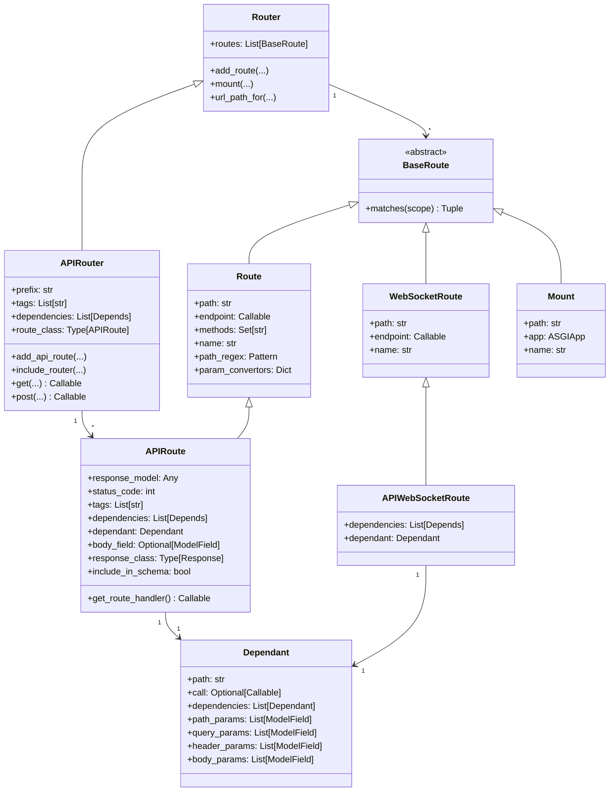
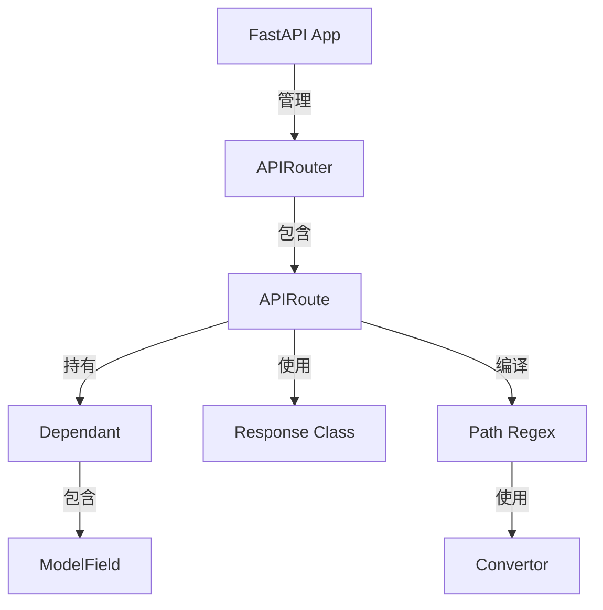
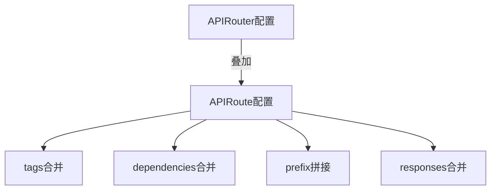

# FastAPI-02-路由系统-数据结构

> **文档版本**: v1.0  
> **FastAPI 版本**: 0.118.0  
> **创建日期**: 2025年10月4日

---

## 📋 目录

1. [数据结构概览](#数据结构概览)
2. [APIRoute类详解](#apiroute类详解)
3. [APIRouter类详解](#apirouter类详解)
4. [APIWebSocketRoute类详解](#apiwebsocketroute类详解)
5. [路径编译结构](#路径编译结构)
6. [路由匹配结构](#路由匹配结构)
7. [UML类图](#uml类图)

---

## 数据结构概览

### 核心数据结构清单

| 类名 | 继承自 | 文件位置 | 职责 |
|------|--------|----------|------|
| **APIRoute** | `starlette.routing.Route` | `routing.py:504` | HTTP路由 |
| **APIRouter** | `starlette.routing.Router` | `routing.py:671` | 路由器/路由分组 |
| **APIWebSocketRoute** | `starlette.routing.WebSocketRoute` | `routing.py:464` | WebSocket路由 |
| **Mount** | `starlette.routing.Mount` | 继承 | 子应用挂载 |
| **Dependant** | - | `dependencies/models.py` | 依赖树节点 |

### 继承关系



**类图说明**：
1. **图意概述**: FastAPI路由体系在Starlette基础上扩展，增加了响应模型、依赖注入等功能
2. **关键字段**: `dependant`字段存储依赖树；`response_model`存储响应类型
3. **边界条件**: APIRoute和APIWebSocketRoute都支持依赖注入
4. **设计演进**: FastAPI保持与Starlette的兼容性，通过继承扩展功能

---

## APIRoute类详解

### 类定义

```python
class APIRoute(routing.Route):
    """
    HTTP API路由，支持依赖注入、响应模型验证、OpenAPI文档生成
    """
```

### 完整属性列表

#### 路径与端点

| 属性 | 类型 | 说明 |
|------|------|------|
| **path** | str | 路由路径（如 `/users/{user_id}`） |
| **endpoint** | Callable | 路由处理函数 |
| **methods** | Set[str] | HTTP方法集合（如 `{"GET", "POST"}`） |
| **name** | Optional[str] | 路由名称，用于`url_path_for()` |

#### 响应配置

| 属性 | 类型 | 说明 |
|------|------|------|
| **response_model** | Any | Pydantic响应模型 |
| **status_code** | Optional[int] | 默认HTTP状态码 |
| **response_class** | Type[Response] | 响应类（默认JSONResponse） |
| **response_description** | str | 响应描述（OpenAPI） |
| **response_model_include** | Optional[IncEx] | 响应字段白名单 |
| **response_model_exclude** | Optional[IncEx] | 响应字段黑名单 |
| **response_model_by_alias** | bool | 使用字段别名 |
| **response_model_exclude_unset** | bool | 排除未设置字段 |
| **response_model_exclude_defaults** | bool | 排除默认值字段 |
| **response_model_exclude_none** | bool | 排除None值字段 |

#### OpenAPI配置

| 属性 | 类型 | 说明 |
|------|------|------|
| **tags** | Optional[List[Union[str, Enum]]] | 标签列表 |
| **summary** | Optional[str] | API摘要 |
| **description** | Optional[str] | API详细描述 |
| **operation_id** | Optional[str] | OpenAPI operation ID |
| **deprecated** | Optional[bool] | 是否标记为废弃 |
| **include_in_schema** | bool | 是否包含在OpenAPI中 |
| **responses** | Optional[Dict] | 额外的响应定义 |
| **callbacks** | Optional[List[BaseRoute]] | OpenAPI callbacks |
| **openapi_extra** | Optional[Dict[str, Any]] | 额外的OpenAPI字段 |

#### 依赖注入

| 属性 | 类型 | 说明 |
|------|------|------|
| **dependencies** | List[params.Depends] | 依赖列表 |
| **dependant** | Dependant | 依赖树根节点 |
| **body_field** | Optional[ModelField] | 请求体字段 |
| **dependency_overrides_provider** | Optional[Any] | 依赖覆盖提供者 |

#### 路径解析

| 属性 | 类型 | 说明 |
|------|------|------|
| **path_regex** | Pattern | 路径正则表达式 |
| **path_format** | str | 格式化后的路径 |
| **param_convertors** | Dict[str, Convertor] | 路径参数转换器 |

### UML类图



**类图说明**：
1. **图意概述**: APIRoute是路由的核心，包含路径、处理函数、依赖树、响应配置等完整信息
2. **关键字段**: `dependant`是依赖树的根节点，包含所有参数和子依赖；`response_model`用于响应验证
3. **边界条件**: response_model为None时不进行响应验证；methods为空时默认为GET
4. **版本演进**: FastAPI 0.100+支持`openapi_extra`扩展OpenAPI字段

### 初始化流程

```python
class APIRoute(routing.Route):
    def __init__(
        self,
        path: str,
        endpoint: Callable[..., Any],
        *,
        response_model: Any = Default(None),
        status_code: Optional[int] = None,
        tags: Optional[List[Union[str, Enum]]] = None,
        dependencies: Optional[Sequence[params.Depends]] = None,
        # ... 其他参数
    ) -> None:
        # 1. 保存基本信息
        self.path = path
        self.endpoint = endpoint
        
        # 2. 推断响应模型（如果未指定）
        if isinstance(response_model, DefaultPlaceholder):
            return_annotation = get_typed_return_annotation(endpoint)
            if lenient_issubclass(return_annotation, Response):
                response_model = None
            else:
                response_model = return_annotation
        self.response_model = response_model
        
        # 3. 保存OpenAPI配置
        self.summary = summary
        self.response_description = response_description
        self.deprecated = deprecated
        self.operation_id = operation_id
        
        # 4. 保存响应模型配置
        self.response_model_include = response_model_include
        self.response_model_exclude = response_model_exclude
        self.response_model_by_alias = response_model_by_alias
        self.response_model_exclude_unset = response_model_exclude_unset
        self.response_model_exclude_defaults = response_model_exclude_defaults
        self.response_model_exclude_none = response_model_exclude_none
        
        # 5. 构建依赖树
        self.dependant = get_dependant(path=path, call=endpoint)
        for depends in (dependencies or [])[::-1]:
            self.dependant.dependencies.insert(
                0,
                get_parameterless_sub_dependant(depends=depends, path=path),
            )
        
        # 6. 提取请求体字段
        self.body_field = get_body_field(
            dependant=self.dependant,
            name=operation_id or self.unique_id,
        )
        
        # 7. 编译路径模式
        self.path_regex, self.path_format, self.param_convertors = compile_path(path)
        
        # 8. 调用父类构造器
        super().__init__(
            path,
            endpoint=self.get_route_handler(),
            methods=methods,
            name=name,
            include_in_schema=include_in_schema,
        )
```

**初始化步骤说明**：
1. **保存基本信息**：路径和端点函数
2. **推断响应模型**：从函数返回类型注解推断
3. **保存OpenAPI配置**：标签、摘要、描述等
4. **构建依赖树**：解析函数参数和依赖
5. **提取请求体**：识别Body参数
6. **编译路径**：生成正则表达式和参数转换器
7. **调用父类**：传递ASGI应用

### get_route_handler()方法

```python
def get_route_handler(self) -> Callable:
    """
    生成实际的ASGI应用，处理请求
    """
    async def app(request: Request) -> Response:
        # 1. 解析依赖
        solved_result = await solve_dependencies(
            request=request,
            dependant=self.dependant,
            body=body,
            dependency_overrides_provider=self.dependency_overrides_provider,
        )
        values, errors, background_tasks, sub_response, _ = solved_result
        
        # 2. 验证错误
        if errors:
            raise RequestValidationError(errors, body=body)
        
        # 3. 调用endpoint
        raw_response = await run_endpoint_function(
            dependant=self.dependant,
            values=values,
            is_coroutine=is_coroutine,
        )
        
        # 4. 处理响应
        if isinstance(raw_response, Response):
            return raw_response
        
        # 5. 验证响应模型
        if self.response_model:
            response_data = _prepare_response_content(
                raw_response,
                exclude_unset=self.response_model_exclude_unset,
                exclude_defaults=self.response_model_exclude_defaults,
                exclude_none=self.response_model_exclude_none,
            )
            validation_error = None
            try:
                response_data = self.response_field.validate(response_data)
            except ValidationError as e:
                validation_error = e
            if validation_error:
                raise ResponseValidationError(validation_error)
        
        # 6. 返回响应
        return self.response_class(
            content=response_data,
            status_code=self.status_code,
            background=background_tasks,
        )
    
    return request_response(app)
```

**核心逻辑说明**：
1. **解析依赖**：递归解析所有依赖，注入到endpoint
2. **验证错误**：如果有验证错误，抛出`RequestValidationError`
3. **调用endpoint**：执行实际的业务逻辑
4. **处理响应**：如果返回Response对象，直接返回
5. **验证响应模型**：使用Pydantic验证响应数据
6. **返回响应**：封装为Response对象

---

## APIRouter类详解

### 类定义

```python
class APIRouter(routing.Router):
    """
    路由器/路由分组，用于组织和模块化路由
    """
```

### 完整属性列表

| 属性 | 类型 | 说明 |
|------|------|------|
| **prefix** | str | 路由前缀 |
| **tags** | List[Union[str, Enum]] | 标签列表 |
| **dependencies** | List[params.Depends] | 依赖列表 |
| **default_response_class** | Type[Response] | 默认响应类 |
| **responses** | Dict | 额外响应定义 |
| **callbacks** | List[BaseRoute] | OpenAPI callbacks |
| **route_class** | Type[APIRoute] | 路由类 |
| **routes** | List[BaseRoute] | 路由列表（继承自Router） |
| **deprecated** | Optional[bool] | 是否废弃 |
| **include_in_schema** | bool | 是否包含在schema中 |
| **generate_unique_id_function** | Callable | 生成唯一ID的函数 |
| **dependency_overrides_provider** | Optional[Any] | 依赖覆盖提供者 |
| **redirect_slashes** | bool | 重定向末尾斜杠 |
| **default** | Optional[ASGIApp] | 404处理器 |

### UML类图



**类图说明**：
1. **图意概述**: APIRouter继承自Starlette Router，管理多个APIRoute
2. **关键字段**: `prefix`和`tags`会应用到所有子路由；`route_class`允许自定义路由类
3. **边界条件**: prefix必须以`/`开头，不能以`/`结尾
4. **性能要点**: routes列表在启动时构建，运行时只读

### 路由注册流程



**时序图说明**：
1. **图意概述**: 路由注册时，prefix、tags、dependencies会叠加到路由上
2. **关键字段**: path与prefix拼接；tags和dependencies合并
3. **边界条件**: 空prefix有效；tags/dependencies为None时使用空列表
4. **性能要点**: 路由注册在启动时完成，O(1)时间复杂度

---

## APIWebSocketRoute类详解

### 类定义

```python
class APIWebSocketRoute(routing.WebSocketRoute):
    """
    WebSocket路由，支持依赖注入
    """
```

### 完整属性列表

| 属性 | 类型 | 说明 |
|------|------|------|
| **path** | str | 路由路径 |
| **endpoint** | Callable | WebSocket处理函数 |
| **name** | Optional[str] | 路由名称 |
| **dependencies** | List[params.Depends] | 依赖列表 |
| **dependant** | Dependant | 依赖树 |
| **path_regex** | Pattern | 路径正则 |
| **path_format** | str | 格式化路径 |
| **param_convertors** | Dict | 参数转换器 |
| **dependency_overrides_provider** | Optional[Any] | 依赖覆盖提供者 |

### 初始化流程

```python
class APIWebSocketRoute(routing.WebSocketRoute):
    def __init__(
        self,
        path: str,
        endpoint: Callable[..., Any],
        *,
        name: Optional[str] = None,
        dependencies: Optional[Sequence[params.Depends]] = None,
        dependency_overrides_provider: Optional[Any] = None,
    ) -> None:
        # 1. 保存基本信息
        self.path = path
        self.endpoint = endpoint
        self.name = get_name(endpoint) if name is None else name
        self.dependencies = list(dependencies or [])
        
        # 2. 编译路径
        self.path_regex, self.path_format, self.param_convertors = compile_path(path)
        
        # 3. 构建依赖树
        self.dependant = get_dependant(path=self.path_format, call=self.endpoint)
        for depends in self.dependencies[::-1]:
            self.dependant.dependencies.insert(
                0,
                get_parameterless_sub_dependant(depends=depends, path=self.path_format),
            )
        
        # 4. 获取扁平化依赖
        self._flat_dependant = get_flat_dependant(self.dependant)
        self._embed_body_fields = _should_embed_body_fields(
            self._flat_dependant.body_params
        )
        
        # 5. 创建ASGI应用
        self.app = websocket_session(
            get_websocket_app(
                dependant=self.dependant,
                dependency_overrides_provider=dependency_overrides_provider,
                embed_body_fields=self._embed_body_fields,
            )
        )
```

---

## 路径编译结构

### compile_path()函数

```python
def compile_path(path: str) -> Tuple[Pattern, str, Dict[str, Convertor]]:
    """
    编译路径模式为正则表达式
    
    参数:
        path: 路径模式，如 "/users/{user_id:int}"
    
    返回:
        (path_regex, path_format, param_convertors)
    """
```

### 路径参数格式

| 格式 | 说明 | 示例 |
|------|------|------|
| `{name}` | 基本参数（匹配非`/`字符） | `/users/{user_id}` |
| `{name:int}` | 整数参数 | `/users/{user_id:int}` |
| `{name:float}` | 浮点数参数 | `/price/{value:float}` |
| `{name:path}` | 路径参数（可包含`/`） | `/files/{file_path:path}` |
| `{name:uuid}` | UUID参数 | `/items/{item_id:uuid}` |

### 参数转换器

```python
class Convertor:
    """参数转换器基类"""
    regex: str  # 正则表达式
    
    def convert(self, value: str) -> Any:
        """将字符串转换为目标类型"""
        raise NotImplementedError
    
    def to_string(self, value: Any) -> str:
        """将值转换为字符串"""
        raise NotImplementedError
```

**内置转换器**：

```mermaid
classDiagram
    class Convertor {
        <<abstract>>
        +regex: str
        +convert(value) Any
        +to_string(value) str
    }
    
    class StringConvertor {
        +regex: "[^/]+"
        +convert(value) str
        +to_string(value) str
    }
    
    class IntConvertor {
        +regex: "[0-9]+"
        +convert(value) int
        +to_string(value) str
    }
    
    class FloatConvertor {
        +regex: "[0-9]+(\\.[0-9]+)?"
        +convert(value) float
        +to_string(value) str
    }
    
    class PathConvertor {
        +regex: ".*"
        +convert(value) str
        +to_string(value) str
    }
    
    class UUIDConvertor {
        +regex: "[0-9a-f]{8}-..."
        +convert(value) UUID
        +to_string(value) str
    }
    
    Convertor <|-- StringConvertor
    Convertor <|-- IntConvertor
    Convertor <|-- FloatConvertor
    Convertor <|-- PathConvertor
    Convertor <|-- UUIDConvertor
```

---

## 路由匹配结构

### Match枚举

```python
class Match(IntEnum):
    NONE = 0    # 不匹配
    PARTIAL = 1 # 部分匹配（用于Mount）
    FULL = 2    # 完全匹配
```

### 匹配流程



**匹配逻辑说明**：
1. **路径匹配**：使用正则表达式匹配路径
2. **方法匹配**：检查HTTP方法是否在允许列表中
3. **参数提取**：使用参数转换器提取并转换路径参数
4. **优先级**：按注册顺序匹配，先注册的优先

### 路由匹配数据结构

```python
@dataclass
class MatchResult:
    """路由匹配结果"""
    match: Match  # 匹配状态
    scope: Scope  # 更新后的ASGI scope
    
    # scope中包含：
    # - "path_params": Dict[str, Any]  # 路径参数
    # - "route": BaseRoute             # 匹配的路由
    # - "endpoint": Callable           # 端点函数
```

---

## UML类图

### 完整类图



**完整类图说明**：
1. **图意概述**: FastAPI路由体系的完整继承关系和组合关系
2. **关键字段**: 所有路由都有path和endpoint；API路由额外有dependant和response_model
3. **边界条件**: Router可以包含任何BaseRoute子类；APIRouter专门管理APIRoute
4. **设计模式**: 使用继承扩展Starlette功能；使用组合管理依赖树
5. **版本兼容**: 保持与Starlette的兼容性，可以混用不同类型的路由

---

## 数据结构关系总结

### 核心关系



### 数据流转


### 配置继承



---

## 📚 相关文档

- [FastAPI-02-路由系统-概览](./FastAPI-02-路由系统-概览.md) - 路由系统架构
- [FastAPI-02-路由系统-API](./FastAPI-02-路由系统-API.md) - 路由API详解
- [FastAPI-02-路由系统-时序图](./FastAPI-02-路由系统-时序图.md) - 路由流程时序图
- [FastAPI-03-依赖注入-数据结构](./FastAPI-03-依赖注入-数据结构.md) - Dependant详解

---

## 📊 数据结构统计

| 类型 | 数量 | 说明 |
|------|------|------|
| 核心类 | 3 | APIRoute, APIRouter, APIWebSocketRoute |
| 属性总数 | 50+ | 包含所有配置属性 |
| 继承层级 | 2-3层 | 基于Starlette扩展 |
| 依赖关系 | 10+ | 与Dependant、ModelField等关联 |

---

*本文档生成于 2025年10月4日，基于 FastAPI 0.118.0*

