# FastAPI-02-路由系统-时序图

> **文档版本**: v1.0  
> **FastAPI 版本**: 0.118.0  
> **创建日期**: 2025年10月4日

---

## 📋 目录

1. [时序图概览](#时序图概览)
2. [路由注册流程](#路由注册流程)
3. [路由匹配流程](#路由匹配流程)
4. [子路由包含流程](#子路由包含流程)
5. [路径参数解析流程](#路径参数解析流程)
6. [请求处理完整流程](#请求处理完整流程)
7. [WebSocket路由处理流程](#websocket路由处理流程)

---

## 时序图概览

### 核心流程清单

| # | 流程名称 | 参与组件 | 复杂度 | 频率 |
|---|---------|----------|--------|------|
| 1 | 路由注册流程 | APIRouter, APIRoute, Dependant | ⭐⭐ | 启动时 |
| 2 | 路由匹配流程 | Router, Route, Path Regex | ⭐⭐⭐ | 每个请求 |
| 3 | 子路由包含流程 | APIRouter, APIRoute | ⭐⭐ | 启动时 |
| 4 | 路径参数解析 | Convertor, Path Regex | ⭐⭐ | 每个请求 |
| 5 | 请求处理完整流程 | 所有组件 | ⭐⭐⭐⭐ | 每个请求 |
| 6 | WebSocket处理流程 | APIWebSocketRoute, Dependant | ⭐⭐⭐ | WS连接 |

---

## 路由注册流程

### 1.1 使用装饰器注册路由

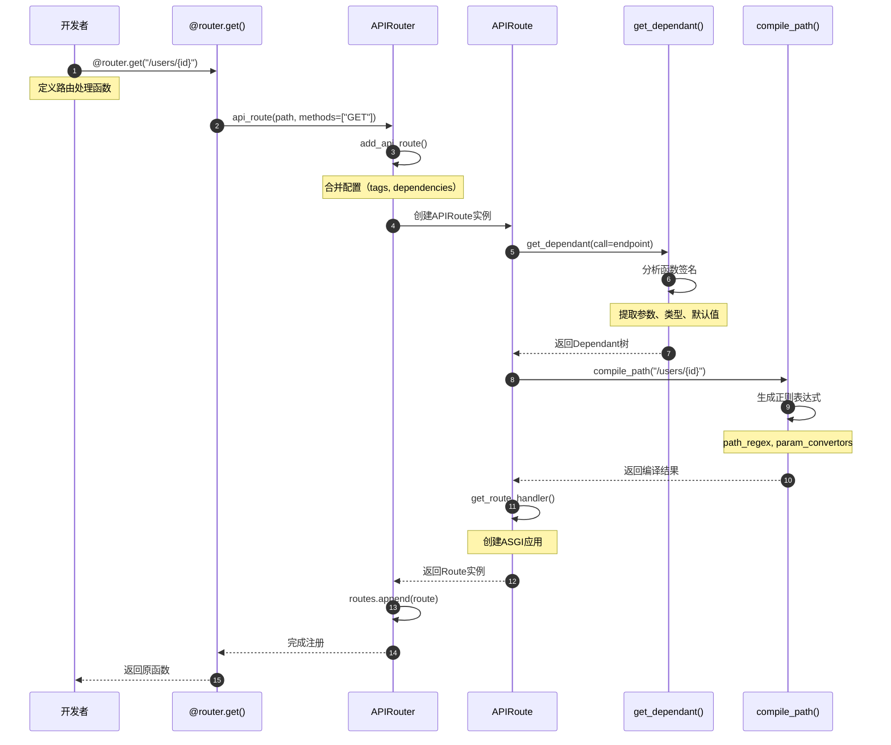

**时序图说明**：
1. **图意概述**: 展示使用装饰器注册路由的完整流程，包括依赖解析和路径编译
2. **关键字段**: `dependant`存储所有参数信息；`path_regex`用于路径匹配
3. **边界条件**: 函数签名错误会在get_dependant()阶段报错；路径格式错误在compile_path()阶段报错
4. **异常路径**: 路径格式错误抛出ValueError；参数类型不支持抛出FastAPIError
5. **性能假设**: 路由注册在启动时完成一次，O(n)复杂度，n为参数数量
6. **版本兼容**: FastAPI 0.100+支持所有类型注解

### 1.2 直接调用add_api_route()注册

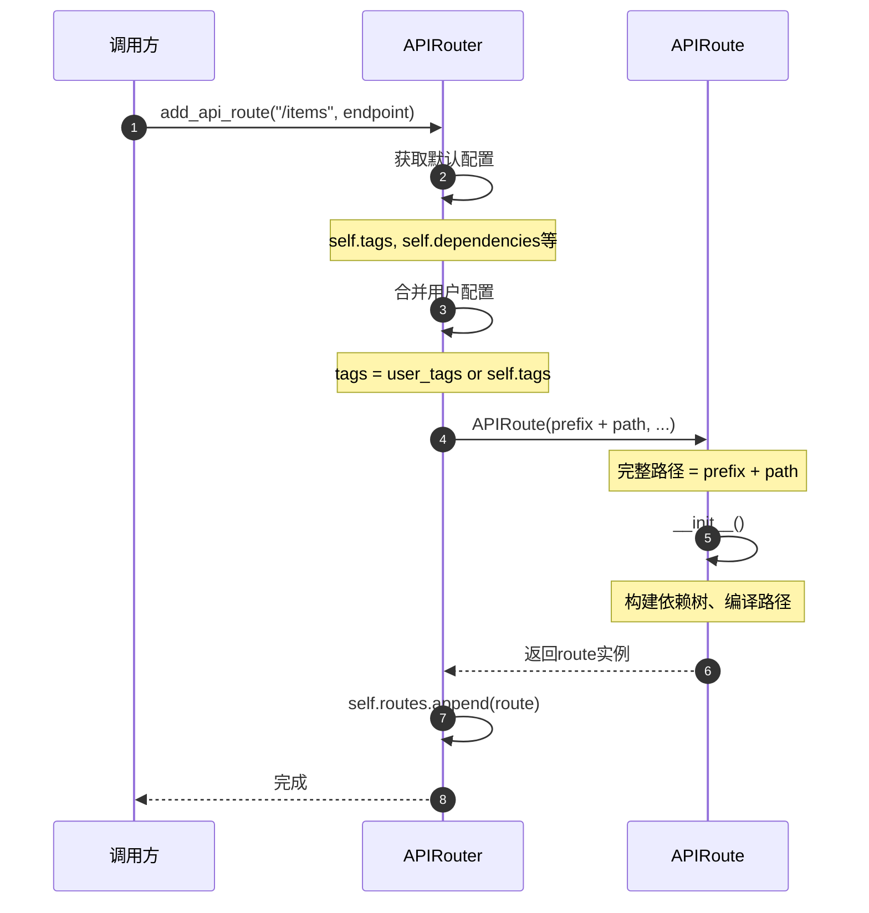

**时序图说明**：
1. **图意概述**: 直接调用add_api_route()的简化流程
2. **关键点**: prefix会自动与path拼接；tags和dependencies会合并
3. **边界条件**: prefix为空时直接使用path；tags为None时使用空列表
4. **性能**: O(1)时间复杂度，仅做列表append操作

---

## 路由匹配流程

### 2.1 完整路由匹配流程

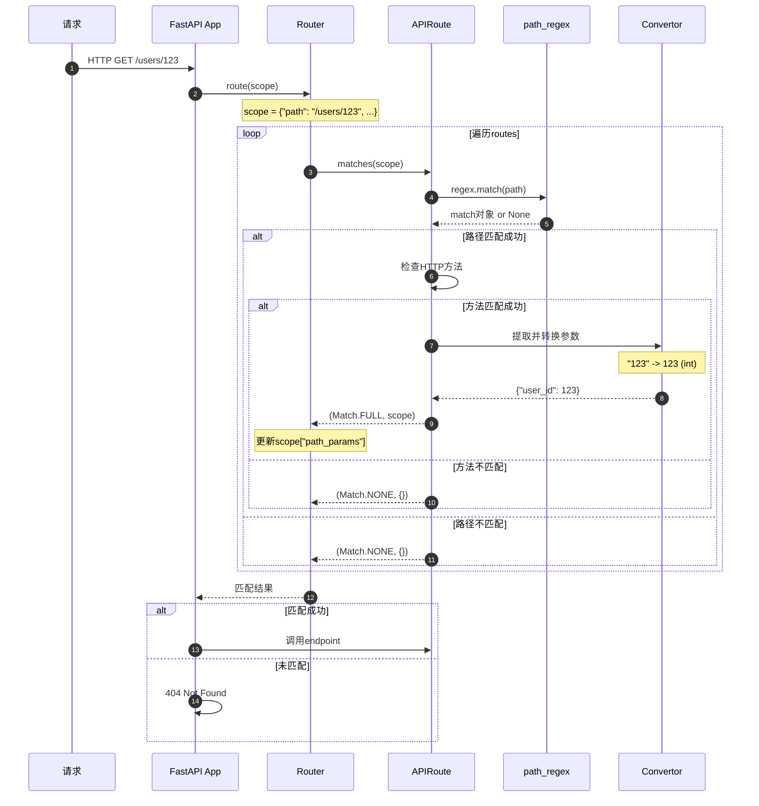

**时序图说明**：
1. **图意概述**: 展示请求到达后，路由匹配的完整流程，包括路径匹配和参数提取
2. **关键字段**: scope["path"]用于匹配；scope["path_params"]存储提取的参数
3. **边界条件**: 按注册顺序匹配，先匹配到的优先；无匹配返回404
4. **异常路径**: 路径匹配成功但参数转换失败，继续尝试下一个路由
5. **性能假设**: 路由数量n，平均匹配时间O(n)；静态路由O(1)
6. **优化点**: 静态路由应放在参数路由之前，可减少匹配次数

### 2.2 路径参数类型转换

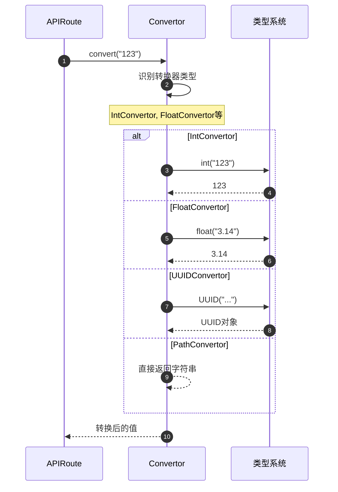

**时序图说明**：
1. **图意概述**: 路径参数的类型转换过程
2. **关键点**: 每种参数类型有对应的Convertor
3. **异常路径**: 转换失败抛出ValueError
4. **性能**: O(1)时间复杂度

---

## 子路由包含流程

### 3.1 include_router()完整流程

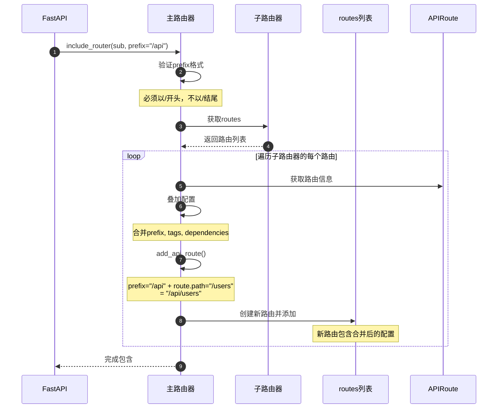

**时序图说明**：
1. **图意概述**: 展示子路由包含的配置合并和路由复制过程
2. **关键字段**: prefix叠加拼接；tags和dependencies列表合并；responses字典合并
3. **边界条件**: 可以多层嵌套包含；空prefix有效
4. **异常路径**: prefix格式错误抛出AssertionError
5. **性能假设**: 子路由数量m，时间复杂度O(m)
6. **设计理由**: 通过复制路由实现配置继承，而不是运行时动态计算

### 3.2 多层嵌套包含

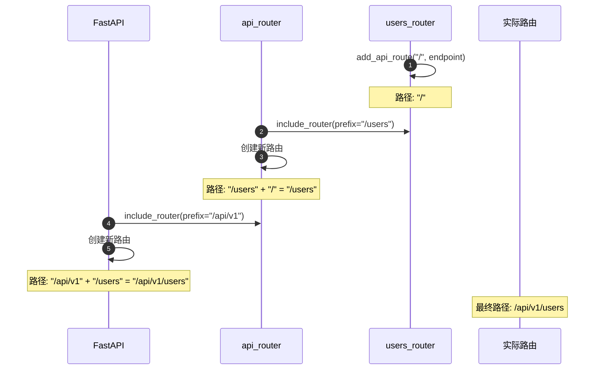

**时序图说明**：
1. **图意概述**: 多层路由嵌套时的prefix叠加过程
2. **关键点**: 每层include_router都会重新注册路由，叠加prefix
3. **边界条件**: 理论上支持无限层嵌套
4. **性能**: 嵌套层数k，路由数n，总复杂度O(k*n)

---

## 路径参数解析流程

### 4.1 compile_path()路径编译

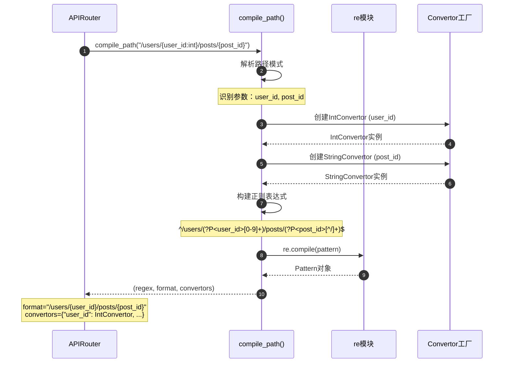

**时序图说明**：
1. **图意概述**: 路径编译过程，将路径模式转换为正则表达式和参数转换器
2. **关键字段**: regex用于匹配；convertors用于类型转换
3. **边界条件**: 支持嵌套参数；支持自定义转换器
4. **性能**: 编译在启动时完成，O(m)复杂度，m为参数数量

### 4.2 请求时参数提取

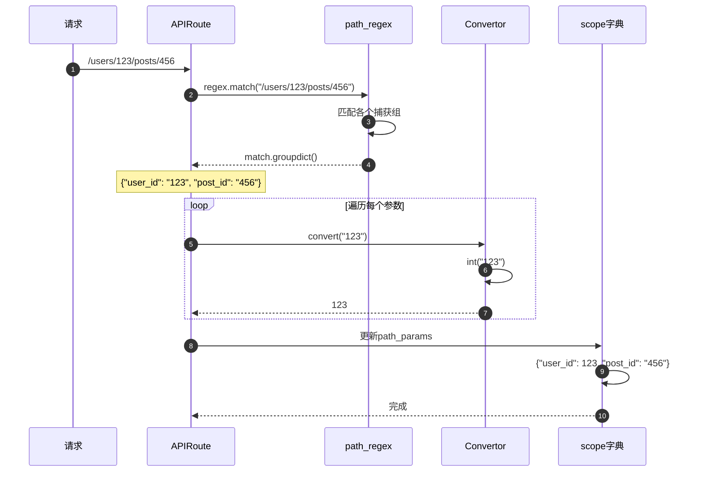

---

## 请求处理完整流程

### 5.1 从请求到响应的完整链路

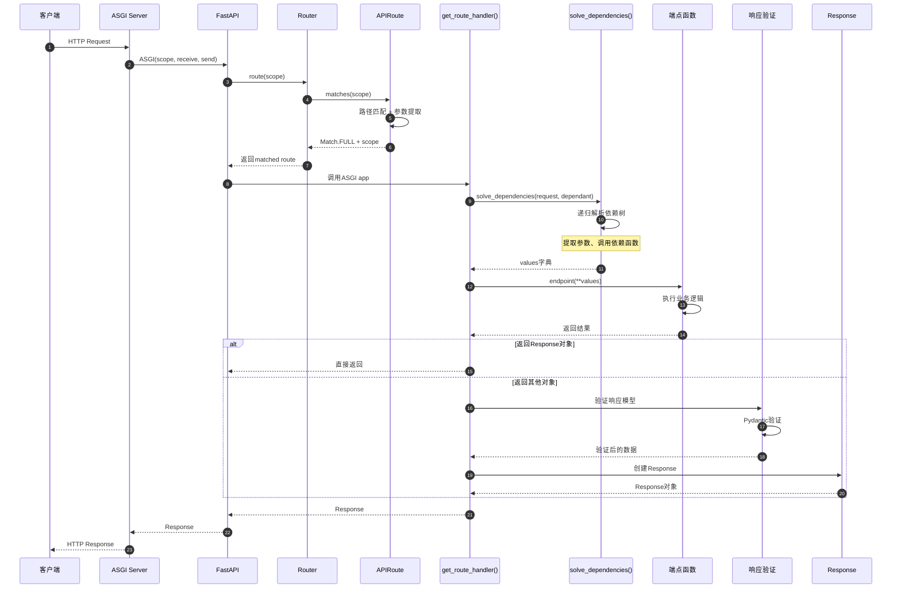

**时序图说明**：
1. **图意概述**: 展示从客户端请求到服务端响应的完整处理链路
2. **关键字段**: scope传递请求信息；values存储解析后的参数
3. **边界条件**: 依赖解析失败返回422；业务逻辑异常返回500
4. **异常路径**: 验证失败→RequestValidationError→422响应
5. **性能假设**: 依赖数量d，参数数量p，复杂度O(d+p)
6. **优化点**: 依赖缓存可减少重复计算；响应模型验证可选

### 5.2 依赖注入详细流程

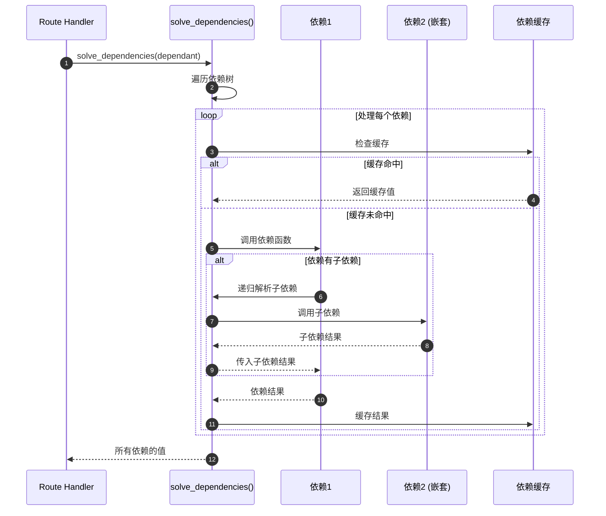

---

## WebSocket路由处理流程

### 6.1 WebSocket连接建立与处理

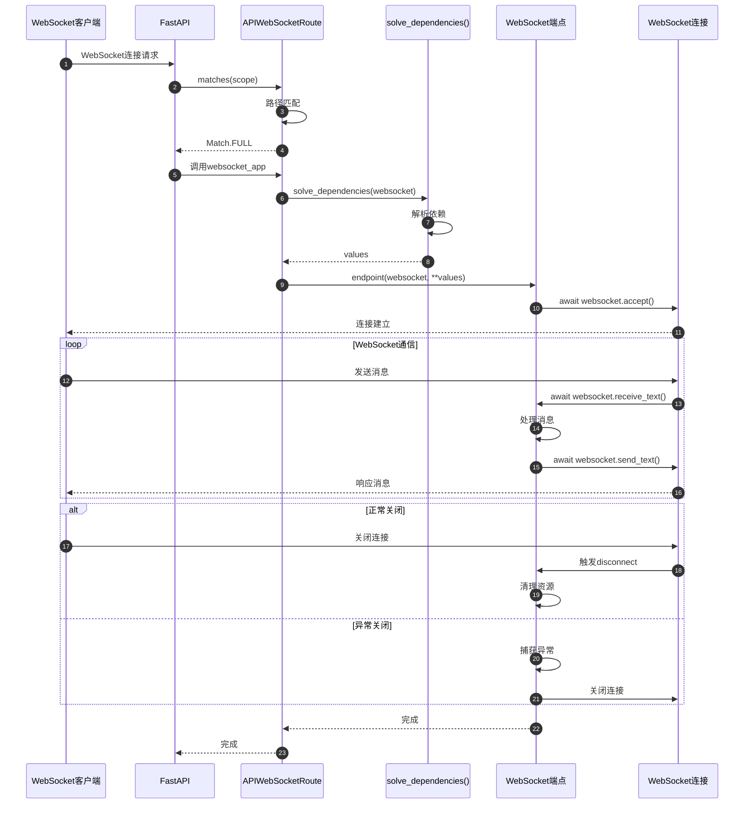

**时序图说明**：
1. **图意概述**: WebSocket从连接建立到关闭的完整生命周期
2. **关键字段**: websocket对象贯穿整个生命周期；依赖在连接建立时解析一次
3. **边界条件**: 依赖解析失败拒绝连接；消息处理异常关闭连接
4. **异常路径**: 连接被拒绝→WebSocketDisconnect；消息格式错误→关闭连接
5. **性能假设**: 连接保持期间，依赖不会重新解析
6. **资源管理**: yield依赖在连接关闭时自动清理

---

## 📊 时序图总结

### 核心流程对比

| 流程 | 执行时机 | 频率 | 复杂度 | 性能影响 |
|------|----------|------|--------|----------|
| 路由注册 | 应用启动 | 一次 | O(n) | 无 |
| 路由匹配 | 每个请求 | 高频 | O(r) | 中 |
| 参数提取 | 匹配成功后 | 高频 | O(p) | 低 |
| 依赖解析 | 每个请求 | 高频 | O(d) | 高 |
| 响应验证 | 返回响应时 | 高频 | O(f) | 中 |

*r=路由数量, p=参数数量, d=依赖数量, f=响应字段数量*

### 性能优化建议

1. **路由匹配优化**
   - ✅ 静态路由放在参数路由之前
   - ✅ 减少路由总数
   - ✅ 使用精确匹配而非模糊匹配

2. **依赖解析优化**
   - ✅ 启用依赖缓存
   - ✅ 减少依赖层级
   - ✅ 避免在依赖中执行IO操作

3. **响应验证优化**
   - ✅ 仅在开发环境启用response_model
   - ✅ 使用exclude_unset减少验证字段
   - ✅ 对大响应使用StreamingResponse

---

## 📚 相关文档

- [FastAPI-02-路由系统-概览](./FastAPI-02-路由系统-概览.md) - 路由系统架构
- [FastAPI-02-路由系统-API](./FastAPI-02-路由系统-API.md) - 路由API详解
- [FastAPI-02-路由系统-数据结构](./FastAPI-02-路由系统-数据结构.md) - 路由数据结构
- [FastAPI-03-依赖注入-时序图](./FastAPI-03-依赖注入-时序图.md) - 依赖解析详细流程

---

*本文档生成于 2025年10月4日，基于 FastAPI 0.118.0*

