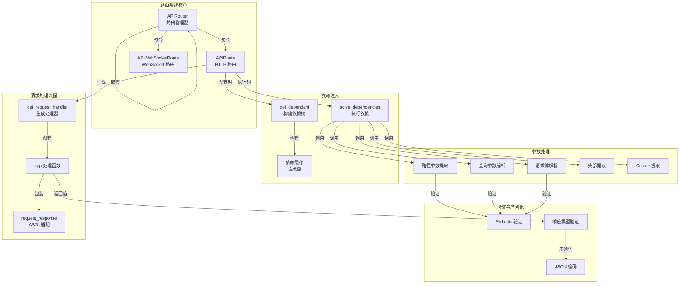
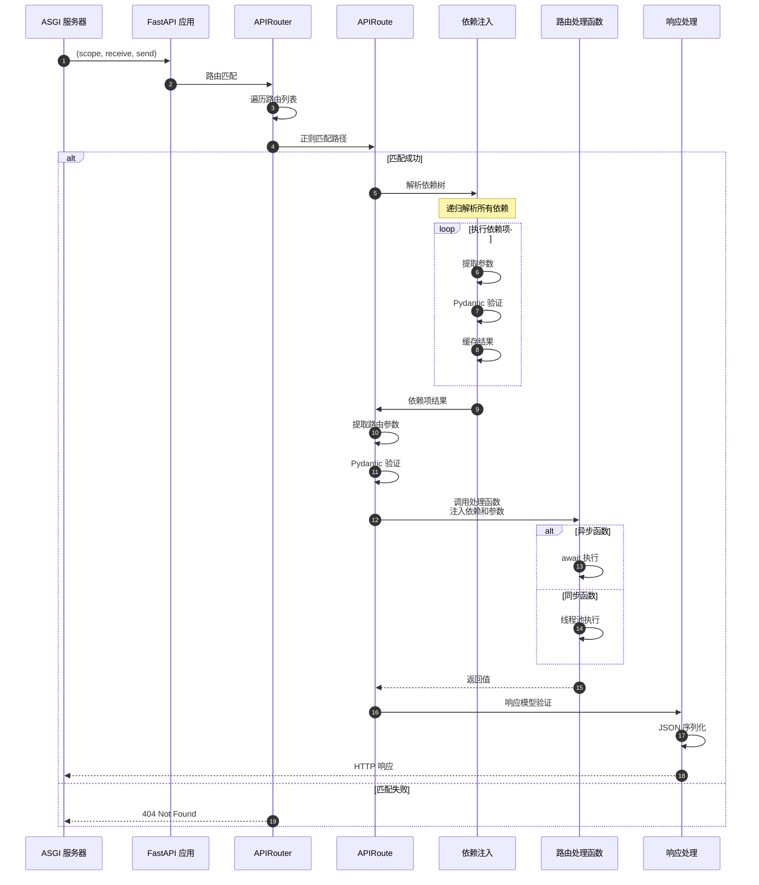
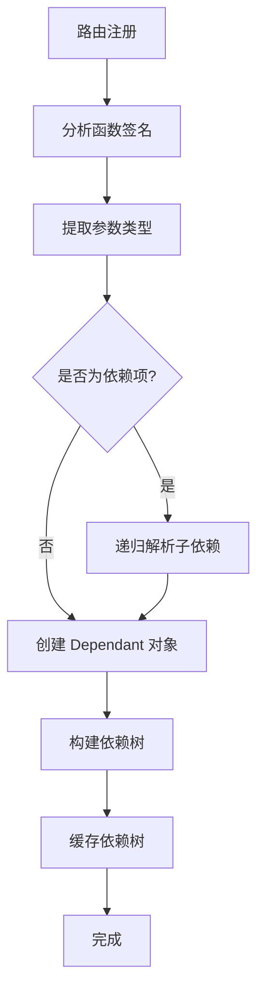
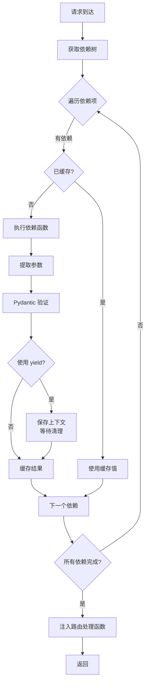

# FastAPI 源码剖析 - 02 路由系统 - 概览

## 模块职责

路由系统（`routing.py`）是 FastAPI 请求处理的核心模块，负责将 HTTP 请求路由到相应的处理函数。主要职责包括：

### 主要职责

1. **路由匹配**
   - URL 路径匹配（支持路径参数）
   - HTTP 方法匹配（GET、POST、PUT、DELETE 等）
   - 正则表达式编译与优化

2. **依赖注入执行**
   - 解析依赖树
   - 执行依赖项函数
   - 缓存依赖结果（请求级）
   - 管理异步上下文（yield 依赖）

3. **参数提取与验证**
   - 路径参数提取
   - 查询参数解析
   - 请求体解析（JSON、表单、文件）
   - 头部和 Cookie 提取
   - Pydantic 模型验证

4. **响应处理**
   - 响应模型验证
   - JSON 序列化
   - 状态码设置
   - 头部和 Cookie 设置

5. **路由组织**
   - APIRouter 实现路由分组
   - 路由前缀管理
   - 路由嵌套与包含

## 核心类与组件

### APIRouter
- **职责**：路由分组管理器，支持路由模块化
- **特性**：
  - 路由注册（get、post、put、delete 等）
  - 路由前缀
  - 标签和依赖项继承
  - 路由嵌套（include_router）

### APIRoute
- **职责**：单个路由的处理逻辑
- **特性**：
  - 路径编译与匹配
  - 依赖注入执行
  - 请求处理流程
  - 响应生成

### APIWebSocketRoute
- **职责**：WebSocket 路由处理
- **特性**：
  - WebSocket 连接管理
  - 消息收发
  - 依赖注入支持

## 模块架构图



## 请求处理流程



## 依赖注入机制

### 依赖树构建（启动时）



### 依赖执行（请求时）



## 参数提取策略

FastAPI 根据参数类型和位置自动确定参数来源：

| 参数声明 | 来源 | 说明 |
|---------|------|------|
| `item_id: int` (路径中) | Path | 路径参数，必填 |
| `q: str = None` | Query | 查询参数，可选 |
| `item: Item` (Pydantic 模型) | Body | 请求体，JSON 解析 |
| `Path(...)` | Path | 显式路径参数 |
| `Query(...)` | Query | 显式查询参数 |
| `Body(...)` | Body | 显式请求体 |
| `Header(...)` | Header | HTTP 头部 |
| `Cookie(...)` | Cookie | Cookie |
| `Form(...)` | Form | 表单数据 |
| `File(...)` | File | 文件上传 |

## 路由匹配算法

### 路径编译

```python
# 原始路径
path = "/items/{item_id}/details"

# 编译为正则表达式
regex = re.compile("^/items/(?P<item_id>[^/]+)/details$")

# 匹配示例
match = regex.match("/items/42/details")
if match:
    path_params = match.groupdict()  # {"item_id": "42"}
```

### 匹配流程

1. **遍历路由列表**：按注册顺序遍历
2. **HTTP 方法过滤**：过滤不匹配的 HTTP 方法
3. **路径正则匹配**：使用预编译的正则表达式
4. **提取路径参数**：从匹配结果提取命名组
5. **返回第一个匹配**：采用首次匹配策略

## 性能优化

### 启动时优化

1. **依赖树预解析**：所有路由的依赖树在启动时构建并缓存
2. **路径正则编译**：路径模式编译为正则表达式
3. **函数签名缓存**：使用 inspect 模块分析函数签名并缓存

### 运行时优化

1. **依赖结果缓存**：同一请求中依赖项只执行一次
2. **参数提取优化**：最小化字符串解析和类型转换
3. **Pydantic 快速路径**：使用 pydantic-core（Rust 实现）

### 内存优化

1. **共享依赖树**：相同依赖项共享 Dependant 对象
2. **响应流式处理**：大响应使用 StreamingResponse
3. **请求体流式解析**：大文件使用 UploadFile（流式）

## 关键设计决策

### 首次匹配 vs 最佳匹配

FastAPI 采用**首次匹配**策略：

**优点**：
- O(n) 时间复杂度（最坏情况）
- 实现简单，性能可预测
- 开发者可控制优先级（通过注册顺序）

**缺点**：
- 需要注意路由注册顺序
- 通用路径应放在后面

**示例**：
```python
@app.get("/items/special")  # 应该先注册
async def read_special():
    ...

@app.get("/items/{item_id}")  # 后注册，避免覆盖 special
async def read_item(item_id: str):
    ...
```

### 同步 vs 异步处理

**异步路由**：
```python
@app.get("/async")
async def async_route():
    data = await async_db_call()
    return data
```
- 在事件循环中执行
- 适合 I/O 密集操作

**同步路由**：
```python
@app.get("/sync")
def sync_route():
    data = blocking_db_call()
    return data
```
- 在线程池中执行（默认 40 线程）
- 适合 CPU 密集或遗留同步代码

### 依赖缓存策略

**默认行为**：依赖项在同一请求中缓存

**使用场景**：
```python
def get_db():
    db = Database()
    try:
        yield db  # 请求结束时自动关闭
    finally:
        db.close()

@app.get("/users/")
async def list_users(db = Depends(get_db)):  # 依赖1
    return db.query_users()

@app.get("/items/")
async def list_items(db = Depends(get_db)):  # 依赖2 (不同请求)
    return db.query_items()
```

**禁用缓存**：
```python
def get_current_time(use_cache: bool = Depends(lambda: True)):
    return datetime.now()

# 如需禁用缓存，设置 use_cache=False
```

## 边界条件与限制

### 并发限制
- **异步路由**：受事件循环和系统资源限制
- **同步路由**：受线程池大小限制（默认 40）
- **依赖递归深度**：建议不超过 10 层

### 路径参数约束
- **路径参数**：默认匹配非 `/` 字符
- **自定义匹配**：使用 `path` 参数类型匹配包含 `/` 的路径
- **类型转换**：路径参数自动转换为声明的类型

### 请求体大小
- **默认无限制**：FastAPI 本身不限制
- **ASGI 服务器限制**：由 Uvicorn 等服务器配置
- **推荐**：在反向代理（Nginx）或中间件中限制

## 最佳实践

### 路由组织

```python
# users.py
from fastapi import APIRouter

router = APIRouter(
    prefix="/users",
    tags=["users"],
    responses={404: {"description": "Not found"}},
)

@router.get("/")
async def list_users():
    ...

@router.get("/{user_id}")
async def get_user(user_id: int):
    ...

# main.py
from fastapi import FastAPI
from .routers import users, items

app = FastAPI()

app.include_router(users.router)
app.include_router(items.router)
```

### 依赖注入

```python
# 数据库会话
async def get_db():
    async with SessionLocal() as session:
        yield session

# 当前用户
async def get_current_user(
    token: str = Depends(oauth2_scheme),
    db: Session = Depends(get_db)
):
    user = await decode_token(token, db)
    if not user:
        raise HTTPException(401)
    return user

# 使用
@app.get("/profile")
async def read_profile(user: User = Depends(get_current_user)):
    return user
```

### 响应模型

```python
class UserOut(BaseModel):
    id: int
    username: str
    # 不包含 password

@app.get("/users/{user_id}", response_model=UserOut)
async def get_user(user_id: int):
    # 从数据库获取用户（包含 password）
    user = db.get_user(user_id)
    # FastAPI 自动过滤掉 password 字段
    return user
```

## 常见问题

### Q: 如何自定义路径参数匹配？
A:
```python
# 匹配包含 / 的路径
@app.get("/files/{file_path:path}")
async def read_file(file_path: str):
    return {"file_path": file_path}

# 访问: GET /files/dir/subdir/file.txt
# file_path = "dir/subdir/file.txt"
```

### Q: 如何处理多个请求体参数？
A:
```python
@app.post("/items/")
async def create_item(
    item: Item,
    user: User,
    importance: int = Body(...)
):
    # FastAPI 自动将三个参数放入请求体
    # JSON: {"item": {...}, "user": {...}, "importance": 5}
    ...
```

### Q: 如何实现条件依赖？
A:
```python
def get_query_or_body(
    q: str = Query(None),
    body: str = Body(None)
):
    return q or body

@app.post("/search")
async def search(data: str = Depends(get_query_or_body)):
    # 优先使用查询参数，否则使用请求体
    ...
```

### Q: 依赖项的执行顺序？
A: 依赖项按照依赖关系执行，被依赖的项先执行。同级依赖按照参数声明顺序执行。

```python
async def dep_a():
    print("A")

async def dep_b(a = Depends(dep_a)):
    print("B")

@app.get("/")
async def route(b = Depends(dep_b), a = Depends(dep_a)):
    # 执行顺序: A -> B (a 被 b 依赖，只执行一次)
    pass
```

