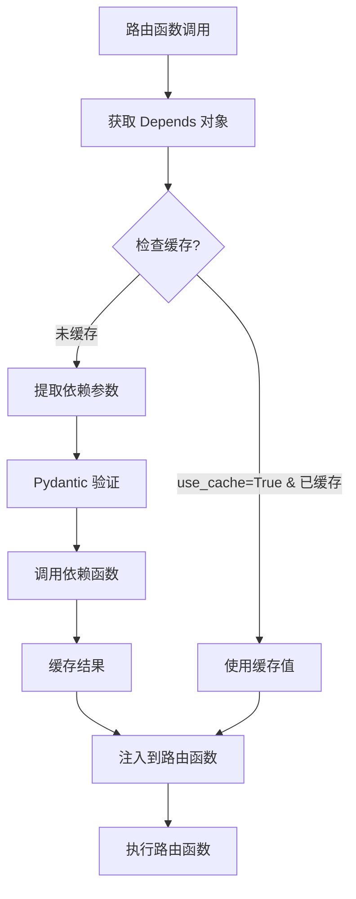
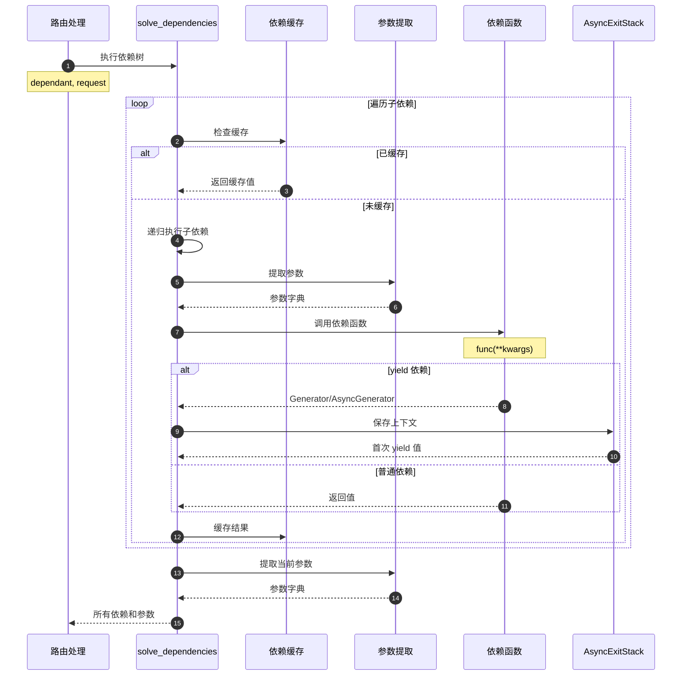

# FastAPI 源码剖析 - 03 依赖注入 - API

## 模块API总览

依赖注入模块（`dependencies/`）提供的核心 API 包括：

### 用户API（param_functions.py）
- `Depends()` - 声明依赖项
- `Security()` - 声明安全依赖项（带作用域）

### 内部API（dependencies/utils.py）
- `get_dependant()` - 构建依赖树
- `get_sub_dependant()` - 构建子依赖
- `solve_dependencies()` - 执行依赖树
- `request_params_to_args()` - 提取请求参数

---

## 1. Depends() - 声明依赖项

### 基本信息
- **名称**：`Depends()`
- **模块**：`fastapi.param_functions`
- **用途**：声明路由函数或其他依赖项的依赖

### 函数签名

```python
def Depends(
    dependency: Optional[Callable[..., Any]] = None,
    *,
    use_cache: bool = True
) -> Any
```

### 参数说明

| 参数 | 类型 | 必填 | 默认值 | 说明 |
|------|------|------|--------|------|
| dependency | Callable | 否 | None | 依赖函数或可调用对象，None 时使用参数类型 |
| use_cache | bool | 否 | True | 是否缓存依赖结果（同一请求中） |

### 核心代码

```python
from fastapi import params

def Depends(
    dependency: Optional[Callable[..., Any]] = None,
    *,
    use_cache: bool = True
) -> Any:
    """
    声明依赖项
    
    参数：
        dependency: 依赖函数，返回值会被注入
        use_cache: 是否缓存结果
    
    返回：
        params.Depends 实例
    """
    return params.Depends(dependency=dependency, use_cache=use_cache)
```

### 使用示例

#### 基础用法

```python
from fastapi import FastAPI, Depends

app = FastAPI()

# 依赖函数
def get_db():
    db = Database()
    try:
        yield db
    finally:
        db.close()

# 使用依赖
@app.get("/items/")
async def read_items(db = Depends(get_db)):
    return db.query("SELECT * FROM items")
```

#### 类作为依赖

```python
class Pagination:
    def __init__(self, skip: int = 0, limit: int = 10):
        self.skip = skip
        self.limit = limit

@app.get("/items/")
async def read_items(pagination: Pagination = Depends()):
    # Depends() 无参数时，使用参数类型作为依赖
    return items[pagination.skip:pagination.skip+pagination.limit]
```

#### 子依赖

```python
# 依赖链
def get_token(authorization: str = Header(...)):
    return authorization.replace("Bearer ", "")

def get_current_user(token: str = Depends(get_token)):
    user = decode_token(token)
    return user

def get_admin_user(user = Depends(get_current_user)):
    if not user.is_admin:
        raise HTTPException(403)
    return user

@app.get("/admin/dashboard")
async def dashboard(admin = Depends(get_admin_user)):
    return {"message": f"Welcome {admin.username}"}
```

#### 禁用缓存

```python
from datetime import datetime

def get_current_time(use_cache: bool = Depends(lambda: False)):
    return datetime.now()

@app.get("/time")
async def get_time(
    time1 = Depends(get_current_time),  # 不缓存，每次都是新值
    time2 = Depends(get_current_time),
):
    return {"time1": time1, "time2": time2}
```

### 依赖执行流程



---

## 2. Security() - 安全依赖项

### 基本信息
- **名称**：`Security()`
- **模块**：`fastapi.param_functions`
- **用途**：声明带安全作用域的依赖项

### 函数签名

```python
def Security(
    dependency: Optional[Callable[..., Any]] = None,
    *,
    scopes: Optional[Sequence[str]] = None,
    use_cache: bool = True
) -> Any
```

### 参数说明

| 参数 | 类型 | 必填 | 默认值 | 说明 |
|------|------|------|--------|------|
| dependency | Callable | 否 | None | 安全方案（如 OAuth2PasswordBearer） |
| scopes | Sequence[str] | 否 | None | 所需的安全作用域列表 |
| use_cache | bool | 否 | True | 是否缓存依赖结果 |

### 核心代码

```python
from fastapi.security.base import SecurityBase

def Security(
    dependency: Optional[Callable[..., Any]] = None,
    *,
    scopes: Optional[Sequence[str]] = None,
    use_cache: bool = True
) -> Any:
    """
    声明安全依赖项
    
    参数：
        dependency: 安全方案实例（SecurityBase）
        scopes: 所需权限作用域
        use_cache: 是否缓存结果
    
    返回：
        params.Security 实例
    """
    return params.Security(
        dependency=dependency,
        scopes=scopes,
        use_cache=use_cache
    )
```

### 使用示例

#### OAuth2 with Scopes

```python
from fastapi.security import OAuth2PasswordBearer, SecurityScopes

oauth2_scheme = OAuth2PasswordBearer(
    tokenUrl="token",
    scopes={
        "items:read": "Read items",
        "items:write": "Write items",
        "users:read": "Read users"
    }
)

async def get_current_user(
    security_scopes: SecurityScopes,
    token: str = Depends(oauth2_scheme)
):
    # 验证 token
    user = decode_token(token)
    
    # 检查权限作用域
    for scope in security_scopes.scopes:
        if scope not in user.scopes:
            raise HTTPException(
                status_code=403,
                detail=f"Not enough permissions. Required: {scope}"
            )
    
    return user

# 需要读权限
@app.get("/items/")
async def read_items(
    user = Security(get_current_user, scopes=["items:read"])
):
    return items

# 需要写权限
@app.post("/items/")
async def create_item(
    item: Item,
    user = Security(get_current_user, scopes=["items:write"])
):
    return create_item_in_db(item)

# 需要多个权限
@app.post("/items/{item_id}/assign")
async def assign_item(
    item_id: int,
    user_id: int,
    user = Security(get_current_user, scopes=["items:write", "users:read"])
):
    return assign_item_to_user(item_id, user_id)
```

#### 自定义安全方案

```python
from fastapi.security.base import SecurityBase
from fastapi.security.utils import get_authorization_scheme_param

class APIKeyHeader(SecurityBase):
    def __init__(self, name: str):
        self.model = APIKeyIn(name=name, **{"in": "header"})
        self.scheme_name = self.__class__.__name__
    
    async def __call__(self, request: Request) -> Optional[str]:
        api_key = request.headers.get(self.model.name)
        if not api_key:
            raise HTTPException(401, "API Key required")
        return api_key

api_key_header = APIKeyHeader(name="X-API-Key")

@app.get("/secure-data")
async def secure_data(api_key: str = Security(api_key_header)):
    # 验证 api_key
    if not validate_api_key(api_key):
        raise HTTPException(403, "Invalid API Key")
    return {"data": "secure"}
```

---

## 3. get_dependant() - 构建依赖树

### 基本信息
- **名称**：`get_dependant()`
- **模块**：`fastapi.dependencies.utils`
- **用途**：分析函数签名，构建依赖树（启动时执行）

### 函数签名

```python
def get_dependant(
    *,
    path: str,
    call: Optional[Callable[..., Any]],
    name: Optional[str] = None,
    security_scopes: Optional[List[str]] = None,
    use_cache: bool = True
) -> Dependant
```

### 参数说明

| 参数 | 类型 | 必填 | 说明 |
|------|------|------|------|
| path | str | 是 | 路由路径（用于路径参数提取） |
| call | Callable | 是 | 要分析的函数 |
| name | str | 否 | 依赖项名称 |
| security_scopes | List[str] | 否 | 安全作用域 |
| use_cache | bool | 否 | 是否缓存依赖结果 |

### 核心代码逻辑

```python
def get_dependant(
    *,
    path: str,
    call: Optional[Callable[..., Any]],
    name: Optional[str] = None,
    security_scopes: Optional[List[str]] = None,
    use_cache: bool = True
) -> Dependant:
    """
    分析函数签名，构建 Dependant 对象
    
    流程：
    1. 获取函数签名
    2. 提取路径参数名
    3. 遍历参数，分类为：
       - 路径参数（在路径中声明）
       - 查询参数（标量类型 + 默认值）
       - 请求体（Pydantic 模型）
       - 头部参数（Header）
       - Cookie 参数（Cookie）
       - 依赖项（Depends）
       - 特殊参数（Request、Response 等）
    4. 递归构建子依赖
    5. 返回 Dependant 对象
    """
    # 获取函数签名
    signature = inspect.signature(call)
    
    # 提取路径参数名
    path_param_names = get_path_param_names(path)
    
    # 初始化 Dependant
    dependant = Dependant(
        path=path,
        call=call,
        name=name,
        security_scopes=security_scopes,
        use_cache=use_cache
    )
    
    # 遍历参数
    for param_name, param in signature.parameters.items():
        # 检查是否为依赖项
        if isinstance(param.default, params.Depends):
            # 递归构建子依赖
            sub_dependant = get_sub_dependant(...)
            dependant.dependencies.append(sub_dependant)
        
        # 检查是否为路径参数
        elif param_name in path_param_names:
            field = create_model_field(param)
            dependant.path_params.append(field)
        
        # 检查是否为查询参数
        elif is_scalar_field(param):
            field = create_model_field(param)
            dependant.query_params.append(field)
        
        # 检查是否为请求体
        elif is_pydantic_model(param.annotation):
            field = create_model_field(param)
            dependant.body_params.append(field)
        
        # 检查是否为特殊参数
        elif param.annotation is Request:
            dependant.request_param_name = param_name
        
        # ... 其他参数类型
    
    return dependant
```

### 返回的 Dependant 结构

```python
@dataclass
class Dependant:
    path_params: List[ModelField]      # 路径参数
    query_params: List[ModelField]     # 查询参数
    header_params: List[ModelField]    # 头部参数
    cookie_params: List[ModelField]    # Cookie 参数
    body_params: List[ModelField]      # 请求体参数
    dependencies: List[Dependant]      # 子依赖列表
    security_requirements: List[SecurityRequirement]  # 安全需求
    name: Optional[str]                # 依赖名称
    call: Optional[Callable]           # 依赖函数
    use_cache: bool                    # 是否缓存
    # ... 其他字段
```

---

## 4. solve_dependencies() - 执行依赖树

### 基本信息
- **名称**：`solve_dependencies()`
- **模块**：`fastapi.dependencies.utils`
- **用途**：执行依赖树，提取和验证参数（请求时执行）

### 函数签名

```python
async def solve_dependencies(
    *,
    request: Union[Request, WebSocket],
    dependant: Dependant,
    body: Optional[Union[Dict[str, Any], FormData]] = None,
    background_tasks: Optional[BackgroundTasks] = None,
    response: Optional[Response] = None,
    dependency_overrides_provider: Optional[Any] = None,
    dependency_cache: Optional[Dict[Tuple[Callable[..., Any], Tuple[str, ...]], Any]] = None,
) -> Tuple[Dict[str, Any], List[ErrorWrapper], Optional[BackgroundTasks], Response, Dict[Tuple[Callable[..., Any], Tuple[str, ...]], Any]]
```

### 核心逻辑

```python
async def solve_dependencies(
    *,
    request: Union[Request, WebSocket],
    dependant: Dependant,
    ...
):
    """
    执行依赖树
    
    流程：
    1. 初始化结果字典和依赖缓存
    2. 遍历子依赖，递归执行
    3. 检查缓存，避免重复执行
    4. 提取依赖参数
    5. 调用依赖函数
    6. 处理 yield 依赖（保存上下文）
    7. 缓存结果
    8. 返回所有依赖的结果
    """
    values: Dict[str, Any] = {}
    errors: List[ErrorWrapper] = []
    
    # 初始化依赖缓存
    if dependency_cache is None:
        dependency_cache = {}
    
    # 遍历子依赖
    for sub_dependant in dependant.dependencies:
        # 检查缓存
        cache_key = sub_dependant.cache_key
        if sub_dependant.use_cache and cache_key in dependency_cache:
            solved = dependency_cache[cache_key]
        else:
            # 递归执行子依赖
            (
                sub_values,
                sub_errors,
                ...
            ) = await solve_dependencies(
                request=request,
                dependant=sub_dependant,
                ...
            )
            
            if sub_errors:
                errors.extend(sub_errors)
                continue
            
            # 提取子依赖参数
            sub_kwargs = {}
            for field in sub_dependant.path_params:
                value = extract_path_param(request, field)
                sub_kwargs[field.name] = value
            
            # ... 提取其他参数
            
            # 调用子依赖函数
            if iscoroutinefunction(sub_dependant.call):
                solved = await sub_dependant.call(**sub_kwargs)
            else:
                solved = await run_in_threadpool(sub_dependant.call, **sub_kwargs)
            
            # 处理 yield 依赖
            if inspect.isgenerator(solved) or inspect.isasyncgen(solved):
                # 保存上下文管理器
                solved = await async_exit_stack.enter_async_context(solved)
            
            # 缓存结果
            if sub_dependant.use_cache:
                dependency_cache[cache_key] = solved
        
        # 存储结果
        if sub_dependant.name:
            values[sub_dependant.name] = solved
    
    # 提取当前 dependant 的参数
    path_values = {}
    for field in dependant.path_params:
        value = extract_path_param(request, field)
        path_values[field.name] = value
    
    # ... 提取查询、请求体等参数
    
    # 合并所有值
    values.update(path_values)
    
    return values, errors, background_tasks, response, dependency_cache
```

### 使用流程



---

## 5. request_params_to_args() - 参数提取

### 基本信息
- **名称**：`request_params_to_args()`
- **模块**：`fastapi.dependencies.utils`
- **用途**：从 Request 对象提取参数并验证

### 核心逻辑

```python
async def request_params_to_args(
    required_params: Sequence[ModelField],
    received_params: Union[Mapping[str, Any], QueryParams, Headers],
) -> Tuple[Dict[str, Any], List[ErrorWrapper]]:
    """
    从请求中提取参数并验证
    
    参数：
        required_params: 需要的参数字段列表
        received_params: 实际接收的参数
    
    返回：
        (验证后的参数字典, 错误列表)
    """
    values = {}
    errors = []
    
    for field in required_params:
        # 获取参数值
        value = received_params.get(field.alias or field.name)
        
        # 使用 Pydantic 验证
        if value is not None:
            validated, error = field.validate(value, values, loc=("query",))
            if error:
                errors.append(error)
            else:
                values[field.name] = validated
        elif field.required:
            errors.append(get_missing_field_error(field))
        else:
            values[field.name] = field.default
    
    return values, errors
```

---

## API 使用最佳实践

### 1. 依赖分层

```python
# 底层：获取原始数据
async def get_token(authorization: str = Header(...)):
    return authorization.replace("Bearer ", "")

# 中层：业务逻辑
async def get_current_user(token: str = Depends(get_token)):
    return decode_token(token)

# 顶层：权限检查
async def get_admin_user(user = Depends(get_current_user)):
    if not user.is_admin:
        raise HTTPException(403)
    return user
```

### 2. 可配置依赖

```python
def create_pagination(default_limit: int = 10):
    def pagination(skip: int = 0, limit: int = default_limit):
        return {"skip": skip, "limit": limit}
    return pagination

# 使用不同默认值
pagination_10 = create_pagination(10)
pagination_50 = create_pagination(50)

@app.get("/items/")
async def read_items(pagination = Depends(pagination_10)):
    return items[pagination["skip"]:pagination["skip"]+pagination["limit"]]
```

### 3. 共享资源

```python
async def get_db():
    async with SessionLocal() as session:
        yield session

@app.get("/users/")
async def list_users(db = Depends(get_db)):
    return db.query(User).all()

@app.get("/items/")
async def list_items(db = Depends(get_db)):
    # 如果在同一请求中多次使用，会使用缓存
    return db.query(Item).all()
```

## 总结

依赖注入 API 的核心功能：

1. **Depends()**：用户声明依赖项
2. **Security()**：声明带权限的依赖
3. **get_dependant()**：启动时构建依赖树
4. **solve_dependencies()**：请求时执行依赖
5. **request_params_to_args()**：提取和验证参数

这些 API 共同实现了 FastAPI 强大的依赖注入系统。

