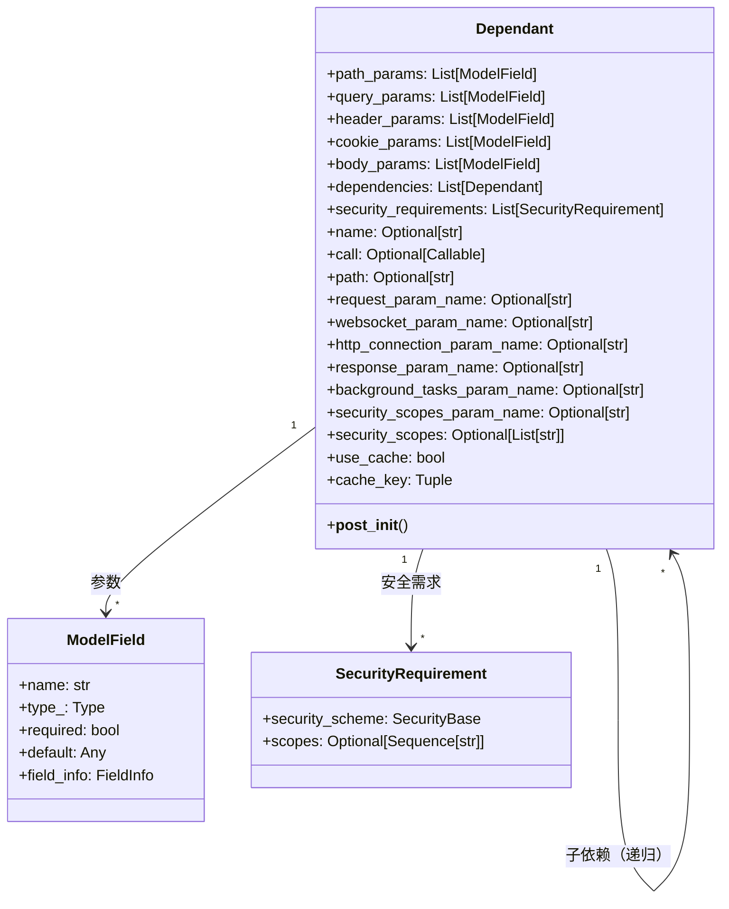
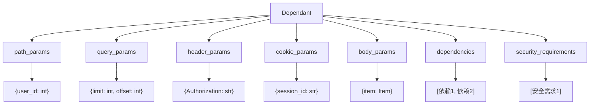
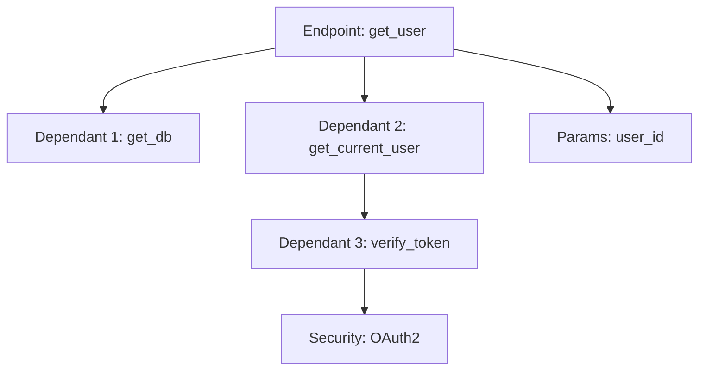
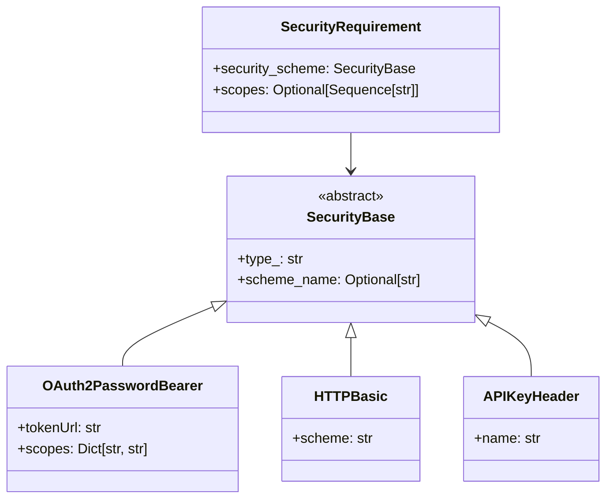
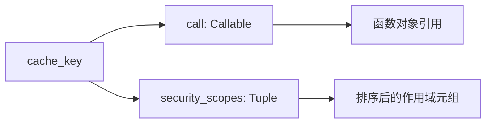
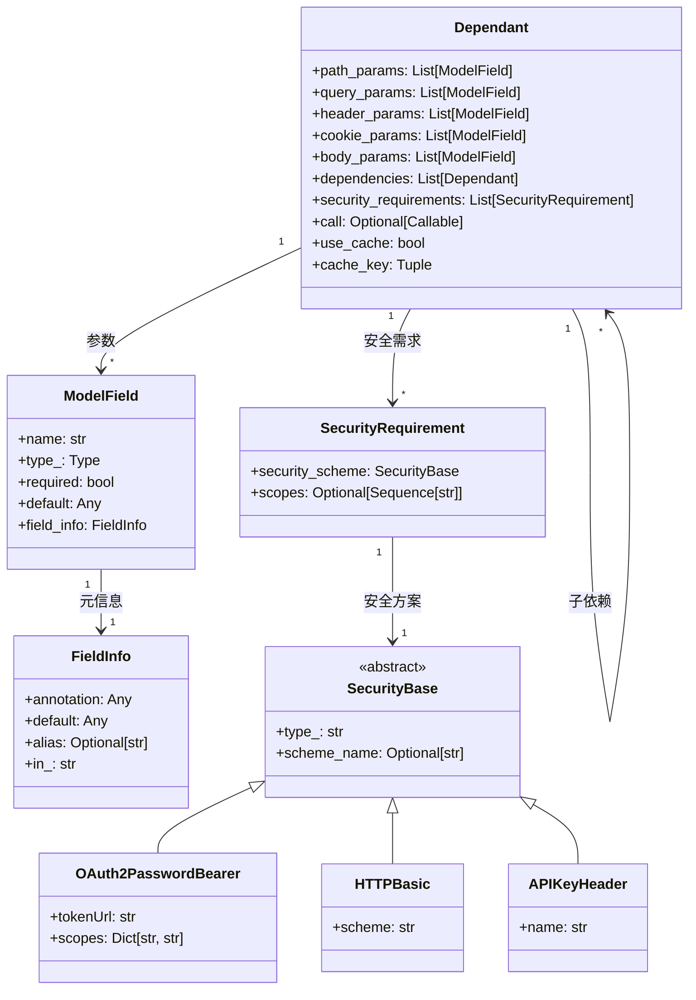
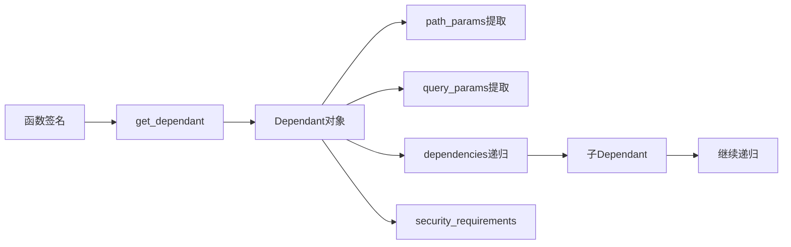

# FastAPI-03-依赖注入-数据结构

> **文档版本**: v1.0  
> **FastAPI 版本**: 0.118.0  
> **创建日期**: 2025年10月4日

---

## 📋 目录

1. [数据结构概览](#数据结构概览)
2. [Dependant类详解](#dependant类详解)
3. [SecurityRequirement类详解](#securityrequirement类详解)
4. [ModelField结构](#modelfield结构)
5. [依赖缓存机制](#依赖缓存机制)
6. [UML类图](#uml类图)

---

## 数据结构概览

### 核心数据结构清单

| 类名 | 类型 | 文件位置 | 职责 |
|------|------|----------|------|
| **Dependant** | dataclass | `dependencies/models.py:15` | 依赖树节点 |
| **SecurityRequirement** | dataclass | `dependencies/models.py:9` | 安全需求 |
| **ModelField** | class | Pydantic兼容层 | 参数字段定义 |

---

## Dependant类详解

### 类定义

```python
@dataclass
class Dependant:
    """
    依赖树的节点，存储一个依赖（函数）的完整信息
    包括参数、子依赖、安全需求等
    """
```

### 完整属性列表

#### 参数字段

| 属性 | 类型 | 默认值 | 说明 |
|------|------|--------|------|
| **path_params** | List[ModelField] | [] | 路径参数列表 |
| **query_params** | List[ModelField] | [] | 查询参数列表 |
| **header_params** | List[ModelField] | [] | 请求头参数列表 |
| **cookie_params** | List[ModelField] | [] | Cookie参数列表 |
| **body_params** | List[ModelField] | [] | 请求体参数列表 |

#### 依赖关系

| 属性 | 类型 | 默认值 | 说明 |
|------|------|--------|------|
| **dependencies** | List[Dependant] | [] | 子依赖列表（递归结构） |
| **security_requirements** | List[SecurityRequirement] | [] | 安全需求列表 |

#### 元信息

| 属性 | 类型 | 默认值 | 说明 |
|------|------|--------|------|
| **name** | Optional[str] | None | 依赖名称 |
| **call** | Optional[Callable] | None | 依赖函数 |
| **path** | Optional[str] | None | 路由路径 |

#### 特殊参数名

| 属性 | 类型 | 默认值 | 说明 |
|------|------|--------|------|
| **request_param_name** | Optional[str] | None | Request参数的变量名 |
| **websocket_param_name** | Optional[str] | None | WebSocket参数的变量名 |
| **http_connection_param_name** | Optional[str] | None | HTTPConnection参数的变量名 |
| **response_param_name** | Optional[str] | None | Response参数的变量名 |
| **background_tasks_param_name** | Optional[str] | None | BackgroundTasks参数的变量名 |
| **security_scopes_param_name** | Optional[str] | None | SecurityScopes参数的变量名 |

#### 缓存控制

| 属性 | 类型 | 默认值 | 说明 |
|------|------|--------|------|
| **use_cache** | bool | True | 是否启用依赖缓存 |
| **cache_key** | Tuple | 自动生成 | 缓存键（call + security_scopes） |
| **security_scopes** | Optional[List[str]] | None | 安全范围列表 |

### 完整源码

```python
@dataclass
class Dependant:
    # 参数字段（按来源分类）
    path_params: List[ModelField] = field(default_factory=list)
    query_params: List[ModelField] = field(default_factory=list)
    header_params: List[ModelField] = field(default_factory=list)
    cookie_params: List[ModelField] = field(default_factory=list)
    body_params: List[ModelField] = field(default_factory=list)
    
    # 依赖关系
    dependencies: List["Dependant"] = field(default_factory=list)
    security_requirements: List[SecurityRequirement] = field(default_factory=list)
    
    # 元信息
    name: Optional[str] = None
    call: Optional[Callable[..., Any]] = None
    path: Optional[str] = None
    
    # 特殊参数名（FastAPI注入的特殊对象）
    request_param_name: Optional[str] = None
    websocket_param_name: Optional[str] = None
    http_connection_param_name: Optional[str] = None
    response_param_name: Optional[str] = None
    background_tasks_param_name: Optional[str] = None
    security_scopes_param_name: Optional[str] = None
    
    # 缓存控制
    security_scopes: Optional[List[str]] = None
    use_cache: bool = True
    cache_key: Tuple[Optional[Callable[..., Any]], Tuple[str, ...]] = field(init=False)
    
    def __post_init__(self) -> None:
        """生成缓存键"""
        self.cache_key = (self.call, tuple(sorted(set(self.security_scopes or []))))
```

### UML类图



**类图说明**：
1. **图意概述**: Dependant是依赖树的节点，采用递归结构，一个Dependant可包含多个子Dependant
2. **关键字段**: dependencies列表实现依赖树；各类params列表分类存储不同来源的参数
3. **边界条件**: dependencies可以为空；call为None表示这是一个纯参数收集节点
4. **设计理由**: 使用dataclass简化代码；分类存储参数便于后续按来源提取
5. **性能考虑**: cache_key在__post_init__中生成一次，避免重复计算

### 参数分类示意图



**示意图说明**：
1. **图意**: 展示Dependant中参数的分类存储结构
2. **关键点**: 每类参数独立存储，便于按来源提取和验证
3. **边界条件**: 所有列表都可以为空
4. **性能**: 分类存储避免运行时按类型筛选

### 依赖树结构示例



**依赖树说明**：
1. **根节点**: Endpoint函数对应的Dependant
2. **子节点**: 每个依赖对应一个Dependant
3. **递归结构**: 依赖可以有自己的依赖
4. **叶子节点**: 参数字段或安全需求

---

## SecurityRequirement类详解

### 类定义

```python
@dataclass
class SecurityRequirement:
    """
    安全需求，表示一个API需要的安全验证
    """
    security_scheme: SecurityBase
    scopes: Optional[Sequence[str]] = None
```

### 属性详解

| 属性 | 类型 | 必填 | 说明 |
|------|------|------|------|
| **security_scheme** | SecurityBase | 是 | 安全方案（OAuth2/API Key/HTTP Auth） |
| **scopes** | Sequence[str] | 否 | OAuth2作用域列表 |

### UML类图



### 使用示例

```python
from fastapi.security import OAuth2PasswordBearer

# 定义安全方案
oauth2_scheme = OAuth2PasswordBearer(
    tokenUrl="token",
    scopes={"read": "Read access", "write": "Write access"}
)

# 在Dependant中存储为SecurityRequirement
security_req = SecurityRequirement(
    security_scheme=oauth2_scheme,
    scopes=["read", "write"]
)
```

---

## ModelField结构

### 概述

`ModelField`是Pydantic v1/v2的兼容层，用于统一处理不同版本的字段定义。

### 核心属性

| 属性 | 类型 | 说明 |
|------|------|------|
| **name** | str | 字段名称 |
| **type_** | Type | 字段类型 |
| **required** | bool | 是否必填 |
| **default** | Any | 默认值 |
| **alias** | Optional[str] | 字段别名 |
| **field_info** | FieldInfo | 字段元信息（来自Pydantic） |

### 字段来源标记

FastAPI使用`field_info`中的特殊标记来识别参数来源：

```python
from fastapi import Query, Path, Body, Header, Cookie

# Path参数
user_id: int = Path(...)  # field_info.in_ = "path"

# Query参数
limit: int = Query(10)    # field_info.in_ = "query"

# Header参数
token: str = Header(...)  # field_info.in_ = "header"

# Cookie参数
session: str = Cookie(...) # field_info.in_ = "cookie"

# Body参数
item: Item = Body(...)    # field_info.in_ = "body"
```

---

## 依赖缓存机制

### cache_key生成

```python
def __post_init__(self) -> None:
    """
    生成缓存键：(call, sorted_security_scopes)
    
    - call: 依赖函数（唯一标识依赖）
    - security_scopes: 安全范围（影响缓存隔离）
    """
    self.cache_key = (
        self.call,
        tuple(sorted(set(self.security_scopes or [])))
    )
```

### 缓存键组成



**缓存键说明**：
1. **call**: 函数对象，确保不同依赖函数不会共享缓存
2. **security_scopes**: 排序后的作用域，确保不同权限要求不会共享缓存
3. **排序**: 保证`["read", "write"]`和`["write", "read"]`生成相同的键
4. **元组**: 不可变类型，可作为字典键

### 缓存使用场景

```python
# 场景1：同一请求中多次使用相同依赖
async def get_db():
    return Database()

@app.get("/users")
async def list_users(db=Depends(get_db)):
    pass

@app.get("/items")
async def list_items(db=Depends(get_db)):
    # get_db() 在同一请求中只会被调用一次
    pass
```

### 缓存控制

```python
# 禁用缓存
async def get_timestamp():
    return time.time()

@app.get("/time")
async def get_time(
    ts=Depends(get_timestamp, use_cache=False)
):
    # 每次都会重新调用 get_timestamp()
    pass
```

---

## UML类图

### 完整依赖注入数据结构关系



**完整类图说明**：
1. **图意概述**: 展示依赖注入系统的所有核心数据结构及其关系
2. **关键字段**: Dependant作为中心节点，连接参数、子依赖和安全需求
3. **边界条件**: 所有关联都可以为空（0个或多个）
4. **设计模式**: 组合模式（Dependant包含Dependant）；策略模式（不同的SecurityBase实现）
5. **扩展性**: 可以添加新的SecurityBase子类支持新的认证方式

### 依赖解析数据流



---

## 📊 数据结构统计

| 项目 | 数量/说明 |
|------|----------|
| 核心类 | 3个（Dependant, SecurityRequirement, ModelField） |
| Dependant属性 | 20+个 |
| 参数分类 | 5种（path/query/header/cookie/body） |
| 特殊参数名 | 6种（request/websocket/response等） |
| 缓存键组成 | 2部分（call + security_scopes） |
| 递归层级 | 无限制（理论上） |

---

## 📚 相关文档

- [FastAPI-03-依赖注入-概览](./FastAPI-03-依赖注入-概览.md) - 依赖注入机制概述
- [FastAPI-03-依赖注入-API](./FastAPI-03-依赖注入-API.md) - Depends()等API详解
- [FastAPI-03-依赖注入-时序图](./FastAPI-03-依赖注入-时序图.md) - 依赖解析流程
- [FastAPI-07-安全-数据结构](./FastAPI-07-安全-数据结构.md) - SecurityBase详解

---

*本文档生成于 2025年10月4日，基于 FastAPI 0.118.0*

