# FastAPI-03-依赖注入-时序图

> **文档版本**: v1.0  
> **FastAPI 版本**: 0.118.0  
> **创建日期**: 2025年10月4日

---

## 📋 目录

1. [时序图概览](#时序图概览)
2. [依赖树构建流程](#依赖树构建流程)
3. [依赖解析执行流程](#依赖解析执行流程)
4. [依赖缓存流程](#依赖缓存流程)
5. [yield依赖生命周期](#yield依赖生命周期)
6. [安全依赖验证流程](#安全依赖验证流程)
7. [完整请求处理流程](#完整请求处理流程)

---

## 时序图概览

### 核心流程清单

| # | 流程名称 | 执行时机 | 复杂度 | 频率 |
|---|---------|----------|--------|------|
| 1 | 依赖树构建 | 路由注册时 | ⭐⭐⭐ | 一次 |
| 2 | 依赖解析执行 | 每个请求 | ⭐⭐⭐⭐ | 高频 |
| 3 | 依赖缓存 | 每个请求 | ⭐⭐ | 高频 |
| 4 | yield依赖管理 | 每个请求 | ⭐⭐⭐ | 中频 |
| 5 | 安全依赖验证 | 有安全需求时 | ⭐⭐⭐ | 中频 |

---

## 依赖树构建流程

### 1.1 get_dependant()构建依赖树

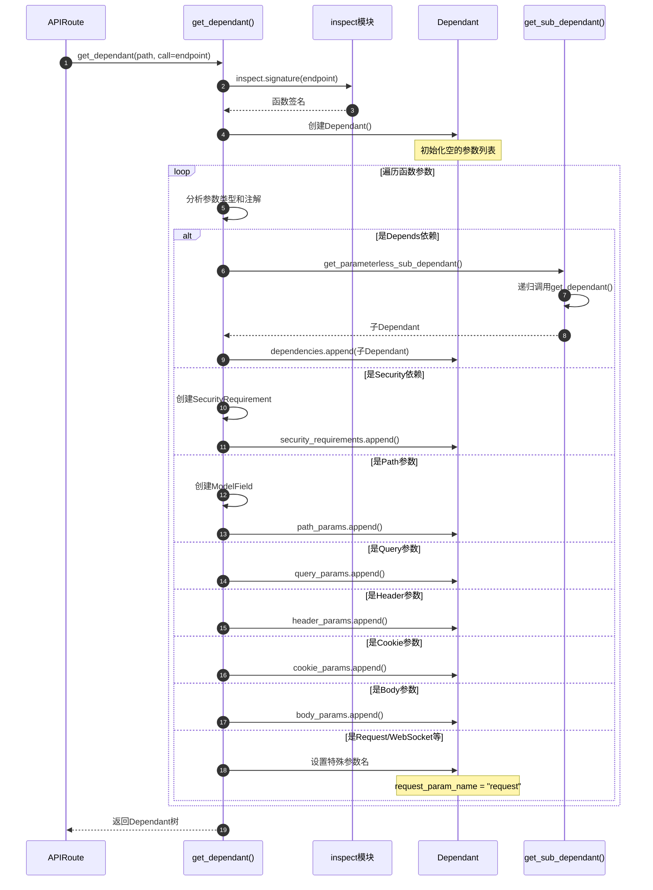

**时序图说明**：
1. **图意概述**: 展示依赖树构建的完整过程，从函数签名分析到Dependant对象创建
2. **关键字段**: signature包含所有参数信息；Dependant各类params列表分类存储参数
3. **边界条件**: 参数可以没有类型注解（使用默认类型）；可以没有依赖
4. **异常路径**: 不支持的参数类型抛出FastAPIError
5. **性能假设**: 参数数量n，子依赖数量d，复杂度O(n+d)
6. **设计理由**: 在启动时构建依赖树，避免运行时重复解析

### 1.2 递归构建子依赖树

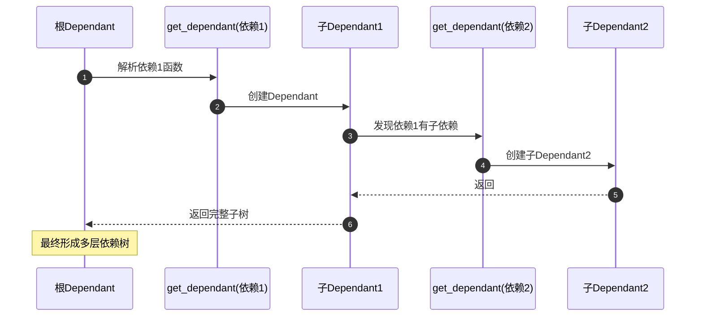

**递归示例**：
```python
# 依赖3（叶子节点）
async def get_config():
    return {"key": "value"}

# 依赖2（中间节点）
async def get_db(config=Depends(get_config)):
    return Database(config)

# 依赖1（根节点的子节点）
async def get_current_user(db=Depends(get_db)):
    return await db.get_user()

# 根节点
@app.get("/users/me")
async def read_user(user=Depends(get_current_user)):
    return user
```

**依赖树结构**：
```
read_user (根Dependant)
└── get_current_user (子Dependant)
    └── get_db (孙Dependant)
        └── get_config (曾孙Dependant)
```

---

## 依赖解析执行流程

### 2.1 solve_dependencies()完整流程

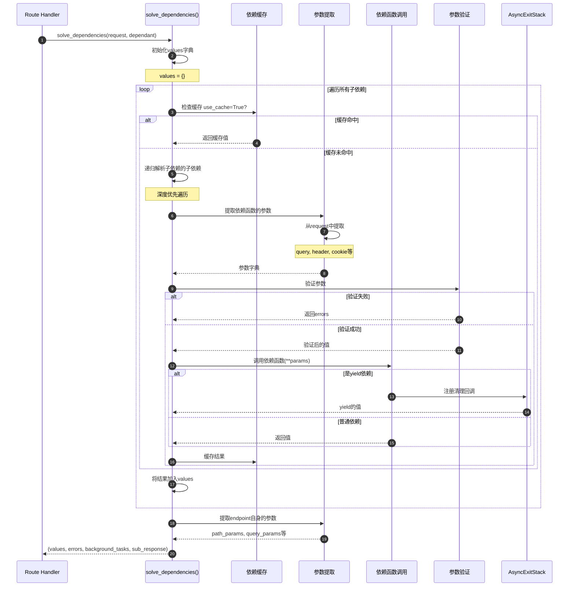

**时序图说明**：
1. **图意概述**: 展示依赖解析的完整执行流程，包括缓存、参数提取、验证、调用
2. **关键字段**: values字典存储所有依赖的结果；errors列表收集验证错误
3. **边界条件**: 依赖可以嵌套任意层；参数验证可能失败
4. **异常路径**: 验证失败收集到errors，不中断后续依赖；依赖函数异常直接抛出
5. **性能假设**: 依赖数量d，参数数量p，复杂度O(d*p)，有缓存时O(d+p)
6. **设计理由**: 深度优先遍历确保子依赖先于父依赖执行

### 2.2 参数提取与验证

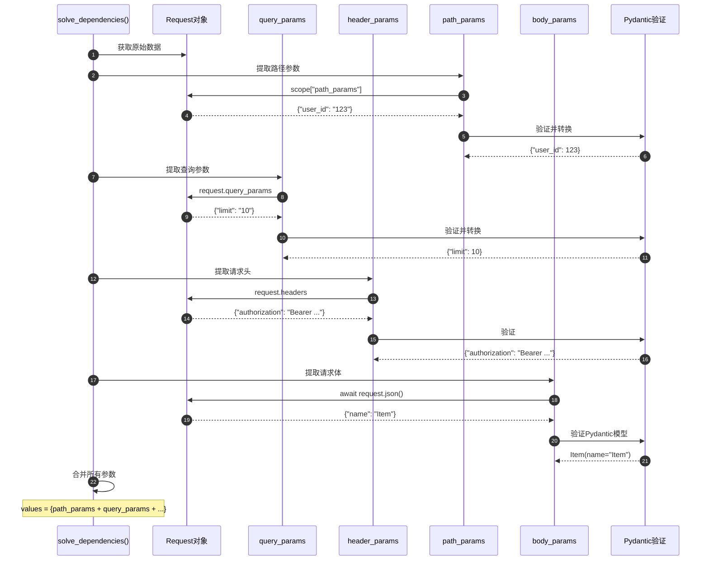

---

## 依赖缓存流程

### 3.1 缓存检查与存储

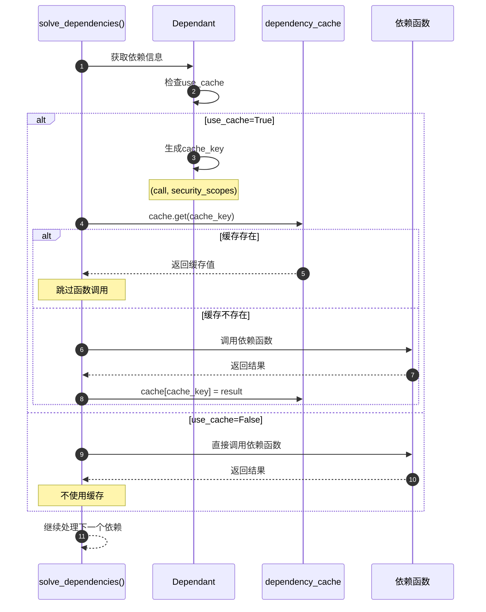

**时序图说明**：
1. **图意概述**: 展示依赖缓存的检查和存储机制
2. **关键字段**: cache_key由(call, security_scopes)组成，确保唯一性
3. **边界条件**: use_cache=False时跳过缓存；每个请求有独立的缓存字典
4. **性能假设**: 缓存查找O(1)；可以显著减少重复计算
5. **设计理由**: 缓存范围限定在单个请求内，避免跨请求污染

### 3.2 缓存键生成

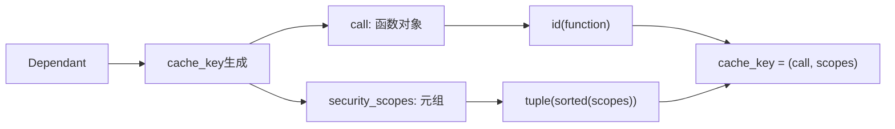

---

## yield依赖生命周期

### 4.1 yield依赖的完整生命周期

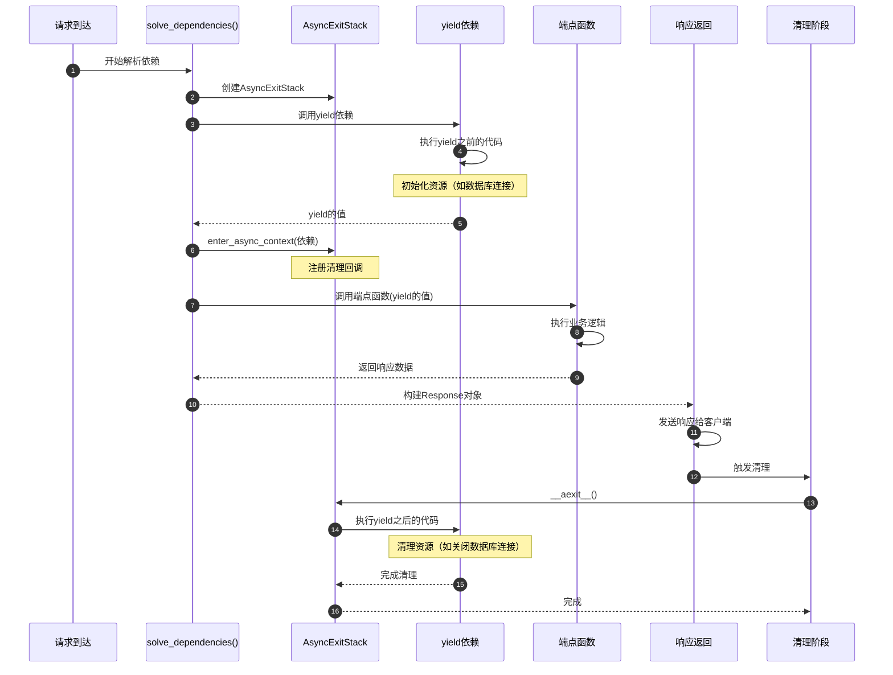

**时序图说明**：
1. **图意概述**: 展示yield依赖的完整生命周期，从资源初始化到清理
2. **关键字段**: AsyncExitStack管理所有yield依赖的清理；yield的值传递给endpoint
3. **边界条件**: yield之后的代码保证在响应发送后执行；异常也会触发清理
4. **异常路径**: endpoint异常→仍然执行清理代码；yield后代码异常→记录日志但不影响响应
5. **性能假设**: 清理代码应该快速执行，避免阻塞其他请求
6. **设计理由**: 使用AsyncExitStack确保资源正确释放，即使发生异常

### 4.2 多个yield依赖的执行顺序

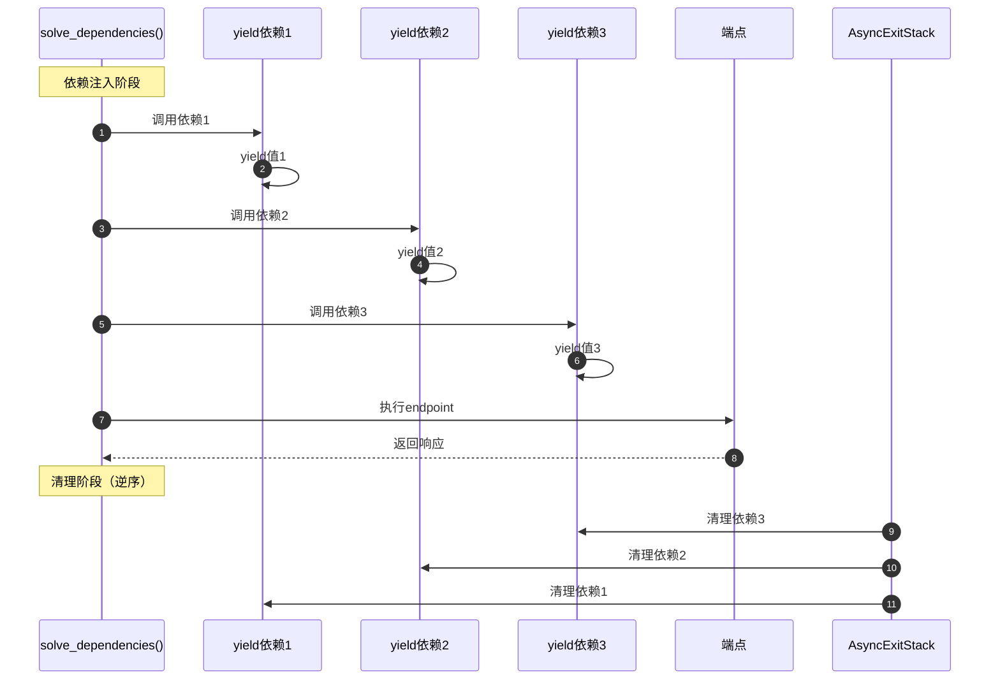

**执行顺序说明**：
- **注入顺序**: 按依赖树深度优先顺序（先注入子依赖，后注入父依赖）
- **清理顺序**: 与注入顺序相反（后进先出，LIFO）
- **设计理由**: 确保依赖关系正确（如先创建连接池，后创建连接；先关闭连接，后关闭连接池）

### 4.3 yield依赖示例

```python
from fastapi import Depends
from typing import AsyncIterator

# yield依赖
async def get_db() -> AsyncIterator[Database]:
    # yield之前：初始化资源
    db = Database()
    await db.connect()
    
    try:
        # yield：提供资源
        yield db
    finally:
        # yield之后：清理资源
        await db.close()

# 使用yield依赖
@app.get("/users")
async def list_users(db: Database = Depends(get_db)):
    return await db.query("SELECT * FROM users")
    # 函数返回后，get_db的finally块会自动执行
```

---

## 安全依赖验证流程

### 5.1 Security()依赖验证

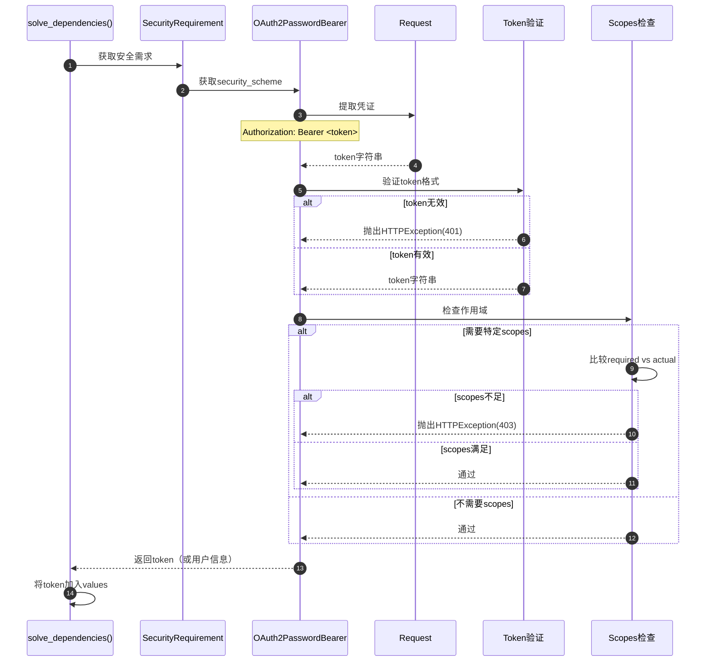

**时序图说明**：
1. **图意概述**: 展示安全依赖的验证流程，包括凭证提取和权限检查
2. **关键字段**: token从Authorization header提取；scopes用于权限检查
3. **边界条件**: token缺失返回401；scopes不足返回403
4. **异常路径**: 验证失败抛出HTTPException，中断请求处理
5. **性能假设**: token验证可能涉及数据库查询或外部API调用
6. **设计理由**: 安全验证优先执行，失败则快速返回错误

### 5.2 OAuth2 scopes检查

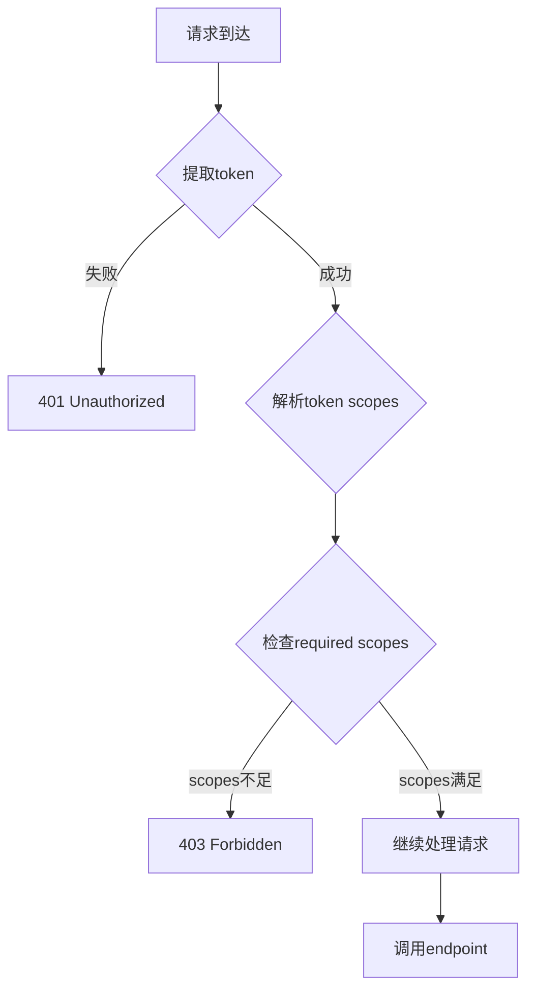

---

## 完整请求处理流程

### 6.1 从请求到响应的依赖注入全流程

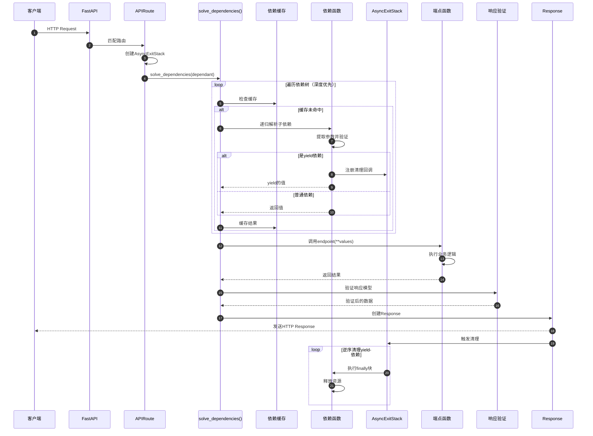

**完整流程说明**：
1. **图意概述**: 展示包含依赖注入的完整请求处理流程
2. **关键阶段**: 路由匹配→依赖解析→endpoint执行→响应验证→资源清理
3. **边界条件**: 任何阶段失败都会跳过后续步骤，直接返回错误响应
4. **异常路径**: 验证失败→422；安全验证失败→401/403；业务逻辑异常→500
5. **性能假设**: 依赖缓存可以显著提升性能；yield依赖清理应该快速
6. **设计理由**: 分阶段处理，清晰的职责划分；使用AsyncExitStack确保资源正确释放

---

## 📊 时序图总结

### 核心流程对比

| 流程 | 执行时机 | 复杂度 | 频率 | 性能影响 |
|------|----------|--------|------|----------|
| 依赖树构建 | 启动时 | O(n+d) | 一次 | 无 |
| 依赖解析 | 每个请求 | O(d*p) | 高频 | 高 |
| 缓存检查 | 每个依赖 | O(1) | 高频 | 低 |
| yield清理 | 请求结束 | O(y) | 中频 | 低 |
| 安全验证 | 有安全需求时 | O(1) | 中频 | 中 |

*n=参数数量, d=依赖数量, p=参数数量, y=yield依赖数量*

### 性能优化建议

1. **依赖缓存**
   - ✅ 默认启用依赖缓存（use_cache=True）
   - ✅ 仅对无副作用的依赖启用缓存
   - ⚠️ 有状态依赖禁用缓存（use_cache=False）

2. **依赖层级**
   - ✅ 减少依赖嵌套层级
   - ✅ 将公共依赖提取到路由器级别
   - ⚠️ 避免循环依赖

3. **参数验证**
   - ✅ 使用Pydantic的验证缓存
   - ✅ 对简单类型使用原生Python类型
   - ⚠️ 复杂模型考虑使用orm_mode

4. **yield依赖**
   - ✅ 清理代码应该快速执行
   - ✅ 避免在清理代码中执行IO操作
   - ⚠️ 清理异常应该被捕获和记录

---

## 📚 相关文档

- [FastAPI-03-依赖注入-概览](./FastAPI-03-依赖注入-概览.md) - 依赖注入机制概述
- [FastAPI-03-依赖注入-API](./FastAPI-03-依赖注入-API.md) - Depends()等API详解
- [FastAPI-03-依赖注入-数据结构](./FastAPI-03-依赖注入-数据结构.md) - Dependant详解
- [FastAPI-02-路由系统-时序图](./FastAPI-02-路由系统-时序图.md) - 路由处理流程

---

*本文档生成于 2025年10月4日，基于 FastAPI 0.118.0*

