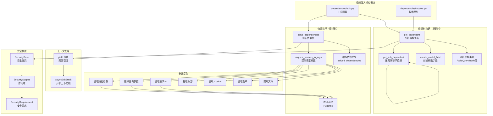
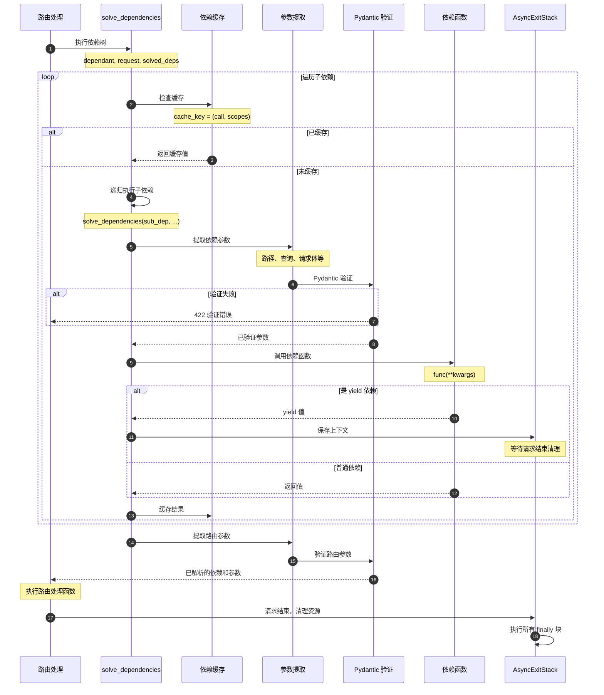
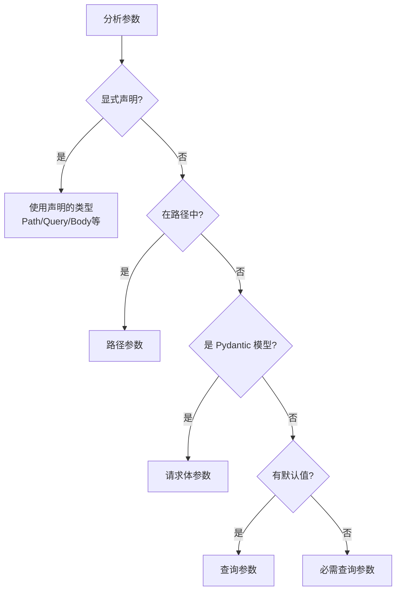
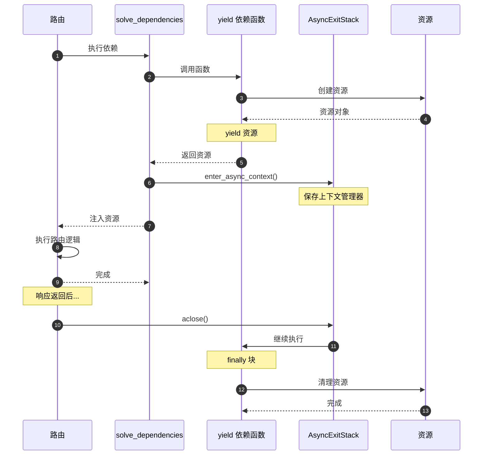

# FastAPI 源码剖析 - 03 依赖注入 - 概览

## 模块职责

依赖注入系统（`dependencies/` 模块）是 FastAPI 最具创新性和核心的特性之一。它负责：

### 主要职责

1. **依赖树构建**
   - 分析函数签名，提取参数类型和注解
   - 递归解析依赖项，构建依赖树
   - 识别参数来源（Path、Query、Body、Header、Cookie 等）
   - 区分普通参数和依赖项

2. **依赖执行**
   - 按依赖关系顺序执行依赖项
   - 处理同步和异步依赖
   - 管理依赖结果缓存（请求级）
   - 处理 yield 依赖的上下文管理

3. **参数解析与验证**
   - 从 Request 对象提取参数
   - 使用 Pydantic 验证参数类型和约束
   - 处理默认值和可选参数
   - 合并多个参数源

4. **安全集成**
   - 支持安全方案作为依赖项
   - 管理安全作用域（Security Scopes）
   - 集成 OAuth2、API Key 等认证机制

## 核心概念

### Dependant（依赖项）

`Dependant` 是依赖注入系统的核心数据结构，表示一个可调用对象（函数、类）及其所有参数信息。

```python
@dataclass
class Dependant:
    # 各类参数
    path_params: List[ModelField]      # 路径参数
    query_params: List[ModelField]     # 查询参数
    header_params: List[ModelField]    # 头部参数
    cookie_params: List[ModelField]    # Cookie 参数
    body_params: List[ModelField]      # 请求体参数
    
    # 子依赖
    dependencies: List[Dependant]      # 子依赖列表
    
    # 安全相关
    security_requirements: List[SecurityRequirement]  # 安全需求
    security_scopes: Optional[List[str]]             # 安全作用域
    
    # 可调用对象
    call: Optional[Callable]           # 依赖函数
    
    # 特殊参数
    request_param_name: Optional[str]            # Request 参数名
    websocket_param_name: Optional[str]          # WebSocket 参数名
    response_param_name: Optional[str]           # Response 参数名
    background_tasks_param_name: Optional[str]   # BackgroundTasks 参数名
    
    # 缓存配置
    use_cache: bool = True             # 是否缓存结果
    cache_key: Tuple                   # 缓存键
```

### 依赖树

依赖树是 `Dependant` 对象的层级结构，表示依赖关系：

```
路由处理函数 (Dependant)
├── 依赖项 A (Dependant)
│   ├── 子依赖 A1 (Dependant)
│   └── 子依赖 A2 (Dependant)
├── 依赖项 B (Dependant)
│   └── 子依赖 B1 (Dependant)
│       └── 子子依赖 B1a (Dependant)
└── 依赖项 C (Dependant)
```

### 依赖缓存

依赖项在同一请求中默认只执行一次，结果被缓存：

- **缓存键**：`(callable, security_scopes)` 元组
- **缓存范围**：单个请求
- **缓存存储**：`solved_dependencies` 字典
- **缓存控制**：通过 `use_cache` 参数控制

### yield 依赖

支持使用 `yield` 的依赖项，实现资源的获取和释放：

```python
async def get_db():
    db = Database()
    try:
        yield db  # 返回资源给路由函数
    finally:
        await db.close()  # 请求结束后自动清理
```

## 模块架构图



## 依赖注入工作流程

### 阶段1：依赖树构建（启动时）

```mermaid
flowchart TB
    Start[路由注册]
    AnalyzeFunc[分析路由函数签名]
    
    LoopParams{遍历参数}
    CheckType{参数类型?}
    
    IsDepends[Depends(...)]
    IsPath[路径参数]
    IsQuery[查询参数]
    IsBody[Body 模型]
    IsHeader[Header(...)]
    IsCookie[Cookie(...)]
    IsSpecial[特殊类型<br/>Request/Response等]
    
    RecursiveParse[递归解析<br/>get_sub_dependant]
    CreateField[创建 ModelField]
    
    AddToDependencies[添加到 dependencies]
    AddToPathParams[添加到 path_params]
    AddToQueryParams[添加到 query_params]
    AddToBodyParams[添加到 body_params]
    AddToHeaderParams[添加到 header_params]
    AddToCookieParams[添加到 cookie_params]
    SaveSpecialParam[保存特殊参数名]
    
    NextParam[下一个参数]
    AllDone{所有参数完成?}
    CreateDependant[创建 Dependant 对象]
    Cache[缓存到路由]
    End[完成]
    
    Start --> AnalyzeFunc
    AnalyzeFunc --> LoopParams
    
    LoopParams -->|有参数| CheckType
    
    CheckType --> IsDepends
    CheckType --> IsPath
    CheckType --> IsQuery
    CheckType --> IsBody
    CheckType --> IsHeader
    CheckType --> IsCookie
    CheckType --> IsSpecial
    
    IsDepends --> RecursiveParse
    RecursiveParse --> AddToDependencies
    
    IsPath --> CreateField
    CreateField --> AddToPathParams
    
    IsQuery --> AddToQueryParams
    IsBody --> AddToBodyParams
    IsHeader --> AddToHeaderParams
    IsCookie --> AddToCookieParams
    IsSpecial --> SaveSpecialParam
    
    AddToDependencies --> NextParam
    AddToPathParams --> NextParam
    AddToQueryParams --> NextParam
    AddToBodyParams --> NextParam
    AddToHeaderParams --> NextParam
    AddToCookieParams --> NextParam
    SaveSpecialParam --> NextParam
    
    NextParam --> AllDone
    AllDone -->|否| LoopParams
    AllDone -->|是| CreateDependant
    
    CreateDependant --> Cache
    Cache --> End
```

### 阶段2：依赖执行（请求时）



## 参数识别规则

FastAPI 自动识别参数来源，规则如下：

### 自动识别

```python
@app.get("/items/{item_id}")
async def read_item(
    item_id: int,              # 路径参数（在路径中声明）
    q: str = None,             # 查询参数（标量类型，有默认值）
    item: Item = Body(...),    # 请求体（显式声明）
    user_agent: str = Header(None),  # 头部（显式声明）
):
    pass
```

### 识别流程



### 规则总结

| 条件 | 参数类型 | 示例 |
|------|----------|------|
| 在路径中声明 | Path | `/items/{item_id}` → `item_id: int` |
| 显式 `Path(...)` | Path | `item_id: int = Path(...)` |
| 显式 `Query(...)` | Query | `q: str = Query(None)` |
| 显式 `Body(...)` | Body | `item: dict = Body(...)` |
| 显式 `Header(...)` | Header | `user_agent: str = Header(...)` |
| 显式 `Cookie(...)` | Cookie | `session: str = Cookie(...)` |
| 显式 `Form(...)` | Form | `username: str = Form(...)` |
| 显式 `File(...)` | File | `file: UploadFile = File(...)` |
| Pydantic 模型 | Body | `item: Item` |
| 标量类型 + 默认值 | Query | `q: str = None` |
| 标量类型 + 无默认值 | Query (必需) | `q: str` |
| `Depends(...)` | 依赖项 | `user = Depends(get_user)` |
| `Request` | 特殊 | `request: Request` |
| `Response` | 特殊 | `response: Response` |
| `BackgroundTasks` | 特殊 | `tasks: BackgroundTasks` |

## 依赖缓存机制

### 缓存策略

```python
# 依赖函数
async def get_db():
    print("Creating database connection")
    return Database()

# 路由1
@app.get("/users/")
async def list_users(db = Depends(get_db)):  # 执行 get_db()
    return db.query("SELECT * FROM users")

# 路由2（不同请求）
@app.get("/items/")
async def list_items(db = Depends(get_db)):  # 重新执行 get_db()
    return db.query("SELECT * FROM items")

# 同一路由中多次依赖
@app.get("/dashboard/")
async def dashboard(
    db1 = Depends(get_db),  # 执行 get_db()
    db2 = Depends(get_db),  # 使用缓存，不重新执行
):
    # db1 和 db2 是同一个对象
    return {"users": db1.count(), "items": db2.count()}
```

### 缓存键生成

```python
@dataclass
class Dependant:
    call: Optional[Callable]
    security_scopes: Optional[List[str]]
    
    def __post_init__(self):
        # 缓存键 = (函数, 排序后的安全作用域)
        self.cache_key = (
            self.call,
            tuple(sorted(set(self.security_scopes or [])))
        )
```

### 禁用缓存

```python
# 使用 use_cache=False
def get_timestamp(use_cache: bool = Depends(lambda: False)):
    return datetime.now()

@app.get("/time")
async def get_time(
    time1 = Depends(get_timestamp),
    time2 = Depends(get_timestamp),
):
    # 如果不禁用缓存，time1 和 time2 会相同
    # 禁用后，每次都重新执行
    return {"time1": time1, "time2": time2}
```

## yield 依赖与资源管理

### 基本用法

```python
async def get_db():
    db = Database()
    try:
        yield db  # 提供资源
    finally:
        await db.close()  # 清理资源

@app.get("/users/")
async def list_users(db = Depends(get_db)):
    # 自动注入 db
    return db.query("SELECT * FROM users")
    # 路由执行完毕后，自动执行 finally 块
```

### 执行流程



### 多个 yield 依赖

```python
async def get_db():
    db = Database()
    try:
        yield db
    finally:
        await db.close()

async def get_cache():
    cache = Redis()
    try:
        yield cache
    finally:
        await cache.close()

@app.get("/data")
async def get_data(
    db = Depends(get_db),
    cache = Depends(get_cache),
):
    # 使用 db 和 cache
    return data

# 清理顺序：后进先出（LIFO）
# 1. cache.close()
# 2. db.close()
```

## 安全集成

### SecurityBase 作为依赖

```python
from fastapi.security import OAuth2PasswordBearer

oauth2_scheme = OAuth2PasswordBearer(tokenUrl="token")

@app.get("/users/me")
async def read_users_me(token: str = Depends(oauth2_scheme)):
    # oauth2_scheme 是 SecurityBase 的实例
    # FastAPI 自动：
    # 1. 从 Authorization header 提取 token
    # 2. 生成 OpenAPI 安全定义
    # 3. 在 Swagger UI 中显示认证按钮
    return decode_token(token)
```

### SecurityScopes

```python
from fastapi.security import OAuth2PasswordBearer, SecurityScopes

oauth2_scheme = OAuth2PasswordBearer(
    tokenUrl="token",
    scopes={
        "items:read": "Read items",
        "items:write": "Write items",
    }
)

async def get_current_user(
    security_scopes: SecurityScopes,
    token: str = Depends(oauth2_scheme)
):
    # security_scopes.scopes 包含所需的权限
    user = decode_token(token)
    for scope in security_scopes.scopes:
        if scope not in user.scopes:
            raise HTTPException(403, "Not enough permissions")
    return user

@app.get("/items/", dependencies=[Security(get_current_user, scopes=["items:read"])])
async def read_items():
    return items
```

## 性能优化

### 启动时优化

1. **依赖树预构建**：所有路由的依赖树在启动时构建，避免运行时开销
2. **函数签名缓存**：使用 `inspect` 模块分析后缓存结果
3. **参数字段缓存**：`ModelField` 对象在构建时创建并缓存

### 运行时优化

1. **依赖结果缓存**：同一请求中依赖只执行一次
2. **最小化参数提取**：只提取声明的参数，不遍历所有可能的参数源
3. **Pydantic 快速路径**：使用 pydantic-core（Rust 实现）加速验证

### 内存优化

1. **共享依赖树**：相同依赖项共享 `Dependant` 对象
2. **弱引用缓存**：使用弱引用避免循环引用
3. **及时清理上下文**：AsyncExitStack 在响应后立即清理

## 最佳实践

### 数据库会话管理

```python
from sqlalchemy.ext.asyncio import AsyncSession, create_async_engine
from sqlalchemy.orm import sessionmaker

engine = create_async_engine("postgresql+asyncpg://...")
SessionLocal = sessionmaker(engine, class_=AsyncSession, expire_on_commit=False)

async def get_db():
    async with SessionLocal() as session:
        yield session
        # 自动提交或回滚
```

### 分层依赖

```python
# 底层：获取 token
async def get_token(authorization: str = Header(...)):
    if not authorization.startswith("Bearer "):
        raise HTTPException(401)
    return authorization[7:]

# 中层：验证 token，获取用户
async def get_current_user(token: str = Depends(get_token)):
    user = decode_token(token)
    if not user:
        raise HTTPException(401, "Invalid token")
    return user

# 顶层：检查用户权限
async def get_admin_user(user: User = Depends(get_current_user)):
    if not user.is_admin:
        raise HTTPException(403, "Not enough permissions")
    return user

# 使用
@app.get("/admin/dashboard")
async def admin_dashboard(admin: User = Depends(get_admin_user)):
    return {"message": f"Welcome, admin {admin.username}"}
```

### 可配置依赖

```python
from functools import partial

def get_items(skip: int = 0, limit: int = 10):
    return items[skip:skip+limit]

# 创建预配置的依赖
get_first_10_items = partial(get_items, skip=0, limit=10)
get_next_10_items = partial(get_items, skip=10, limit=10)

@app.get("/recent-items")
async def recent_items(items = Depends(get_first_10_items)):
    return items
```

## 常见问题

### Q: 依赖项何时执行？
A: 在路由处理函数执行之前，按依赖树的深度优先顺序执行。

### Q: 可以在依赖项中抛出异常吗？
A: 可以。抛出的 `HTTPException` 会被正确捕获并返回相应的错误响应。

### Q: yield 依赖的清理一定会执行吗？
A: 是的。即使路由函数抛出异常，`finally` 块也会执行。

### Q: 如何在测试中覆盖依赖？
A:
```python
app.dependency_overrides[get_db] = lambda: TestDatabase()
```

### Q: 依赖项可以是类吗？
A: 可以。类的 `__init__` 方法会被作为依赖函数：
```python
class Pagination:
    def __init__(self, skip: int = 0, limit: int = 10):
        self.skip = skip
        self.limit = limit

@app.get("/items")
async def list_items(pagination: Pagination = Depends()):
    return items[pagination.skip:pagination.skip+pagination.limit]
```

### Q: 如何传递额外参数给依赖项？
A: 使用函数工厂或 partial：
```python
def get_items_factory(category: str):
    def get_items():
        return filter_by_category(items, category)
    return get_items

@app.get("/electronics")
async def electronics(items = Depends(get_items_factory("electronics"))):
    return items
```

## 边界条件

### 递归深度
- **建议**：依赖树深度不超过 10 层
- **原因**：过深的依赖树影响性能和可维护性

### 循环依赖
- **检测**：FastAPI 会在启动时检测循环依赖
- **处理**：抛出错误，提示开发者修复

### 并发安全
- **依赖缓存**：线程安全（每个请求独立）
- **yield 依赖**：通过 AsyncExitStack 保证清理顺序
- **全局状态**：避免在依赖项中修改全局状态

### 内存泄漏
- **AsyncExitStack**：确保所有上下文管理器被正确清理
- **缓存清理**：请求结束后清理 `solved_dependencies`
- **弱引用**：避免依赖树中的循环引用

