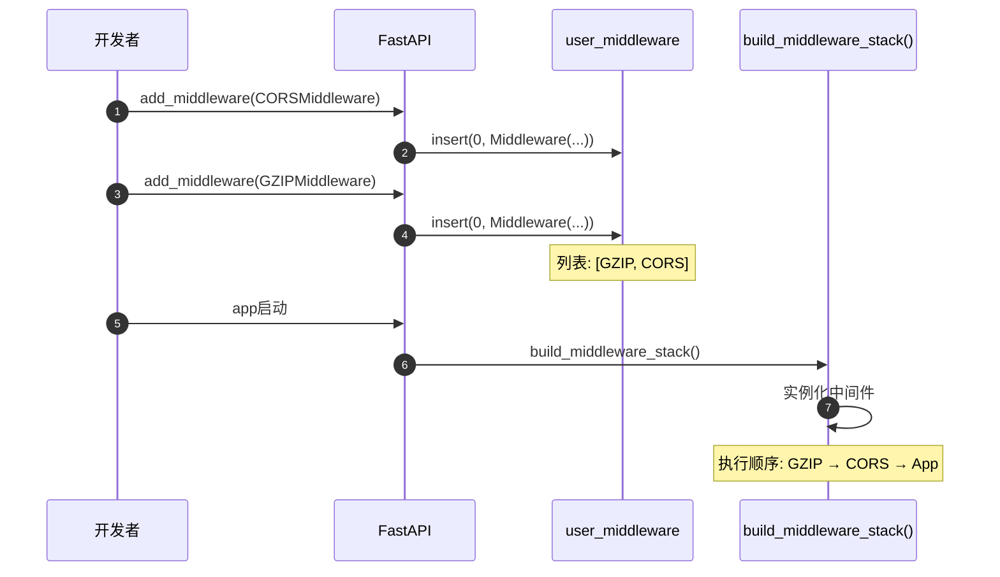
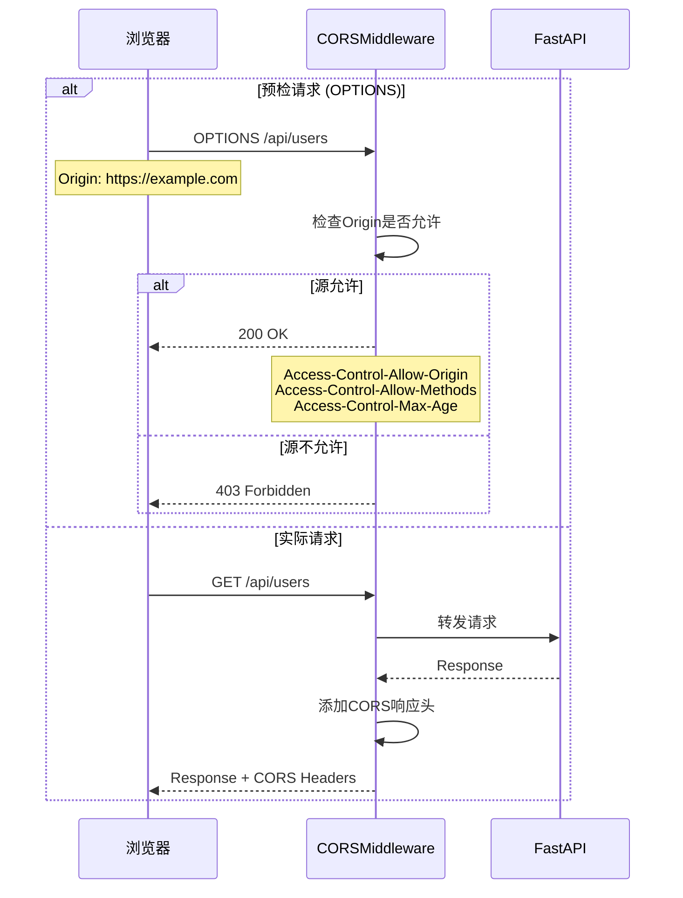
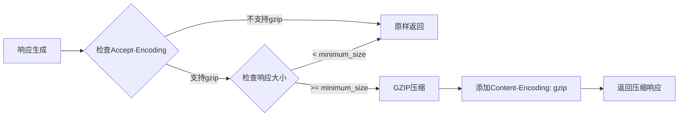
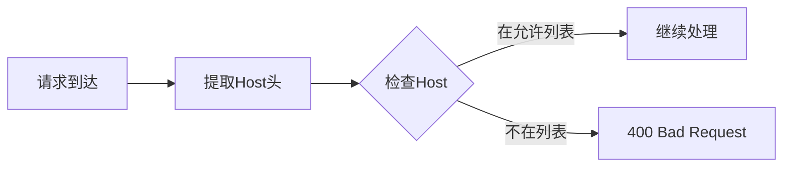
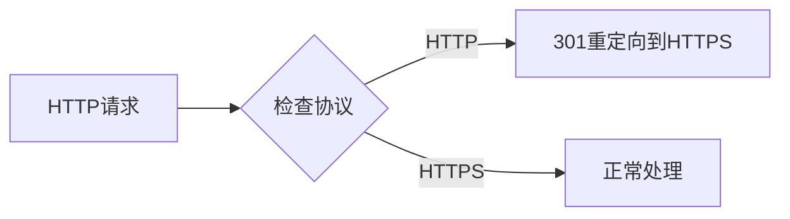

# FastAPI-04-中间件系统-API

> **文档版本**: v1.0  
> **FastAPI 版本**: 0.118.0  
> **创建日期**: 2025年10月4日

---

## 📋 目录

1. [API概览](#api概览)
2. [add_middleware()详解](#addmiddleware详解)
3. [middleware()装饰器](#middleware装饰器)
4. [CORSMiddleware配置](#corsmiddleware配置)
5. [GZIPMiddleware配置](#gzipmiddleware配置)
6. [TrustedHostMiddleware配置](#trustedhostmiddleware配置)
7. [HTTPSRedirectMiddleware配置](#httpsredirectmiddleware配置)
8. [最佳实践](#最佳实践)

---

## API概览

### 核心API清单

| # | API名称 | 类型 | 用途 | 常用度 |
|---|---------|------|------|--------|
| 1 | `add_middleware()` | 方法 | 添加中间件 | ⭐⭐⭐⭐⭐ |
| 2 | `middleware()` | 装饰器 | HTTP中间件装饰器 | ⭐⭐⭐⭐ |
| 3 | `CORSMiddleware` | 类 | CORS跨域支持 | ⭐⭐⭐⭐⭐ |
| 4 | `GZIPMiddleware` | 类 | GZIP压缩 | ⭐⭐⭐⭐ |
| 5 | `TrustedHostMiddleware` | 类 | 主机验证 | ⭐⭐⭐ |
| 6 | `HTTPSRedirectMiddleware` | 类 | HTTPS重定向 | ⭐⭐⭐ |

---

## add_middleware()详解

### 基本信息
- **功能**: 添加ASGI中间件到应用
- **位置**: `FastAPI.add_middleware()`, `APIRouter.add_middleware()`  
- **执行顺序**: 后添加的先执行（栈结构）

### 函数签名

```python
def add_middleware(
    self,
    middleware_class: Type[ASGIMiddleware],
    **options: Any
) -> None:
    """
    添加ASGI中间件
    
    参数:
        middleware_class: 中间件类（必须是ASGI中间件）
        **options: 传递给中间件构造函数的参数
    """
```

### 参数详解

| 参数 | 类型 | 必填 | 说明 |
|------|------|------|------|
| **middleware_class** | Type[ASGIMiddleware] | 是 | 中间件类（不是实例） |
| ****options** | Any | 否 | 中间件配置参数 |

### 核心代码

```python
def add_middleware(
    self,
    middleware_class: Type[ASGIMiddleware],
    **options: Any
) -> None:
    # 将中间件配置添加到列表
    self.user_middleware.insert(0, Middleware(middleware_class, **options))
```

**实现说明**：
- 使用`insert(0, ...)`而不是`append()`，确保后添加的中间件先执行
- 中间件在`build_middleware_stack()`时被实例化
- 配置存储在`Middleware`对象中

### 使用示例

**示例1：添加CORS中间件**
```python
from fastapi import FastAPI
from fastapi.middleware.cors import CORSMiddleware

app = FastAPI()

app.add_middleware(
    CORSMiddleware,
    allow_origins=["https://example.com"],
    allow_credentials=True,
    allow_methods=["*"],
    allow_headers=["*"],
)
```

**示例2：添加GZIP压缩**
```python
from fastapi.middleware.gzip import GZIPMiddleware

app.add_middleware(GZIPMiddleware, minimum_size=1000)
```

**示例3：添加自定义中间件**
```python
class CustomMiddleware:
    def __init__(self, app, custom_param):
        self.app = app
        self.custom_param = custom_param
    
    async def __call__(self, scope, receive, send):
        # 中间件逻辑
        await self.app(scope, receive, send)

app.add_middleware(CustomMiddleware, custom_param="value")
```

### 执行时序图



---

## middleware()装饰器

### 基本信息
- **功能**: HTTP中间件装饰器，简化自定义中间件编写
- **类型**: 装饰器
- **用途**: 快速添加简单的HTTP中间件逻辑

### 函数签名

```python
def middleware(self, middleware_type: str) -> Callable:
    """
    HTTP中间件装饰器
    
    参数:
        middleware_type: 中间件类型，当前仅支持 "http"
    
    返回:
        装饰器函数
    """
```

### 核心代码

```python
def middleware(self, middleware_type: str) -> Callable:
    assert middleware_type == "http", "Only 'http' middleware supported"
    
    def decorator(func: Callable) -> Callable:
        self.add_middleware(BaseHTTPMiddleware, dispatch=func)
        return func
    
    return decorator
```

### 使用示例

**示例1：添加请求计时中间件**
```python
import time
from fastapi import FastAPI, Request

app = FastAPI()

@app.middleware("http")
async def add_process_time_header(request: Request, call_next):
    start_time = time.time()
    response = await call_next(request)
    process_time = time.time() - start_time
    response.headers["X-Process-Time"] = str(process_time)
    return response
```

**示例2：添加请求日志中间件**
```python
@app.middleware("http")
async def log_requests(request: Request, call_next):
    print(f"Request: {request.method} {request.url}")
    response = await call_next(request)
    print(f"Response: {response.status_code}")
    return response
```

**示例3：添加自定义请求头**
```python
@app.middleware("http")
async def add_custom_header(request: Request, call_next):
    response = await call_next(request)
    response.headers["X-Custom-Header"] = "Custom Value"
    return response
```

### call_next参数说明

```python
async def my_middleware(request: Request, call_next):
    # request: 当前请求对象
    # call_next: 调用下一个中间件或应用的函数
    
    # 请求前处理
    print("Before request")
    
    # 调用下一层
    response = await call_next(request)
    
    # 响应后处理
    print("After request")
    
    return response
```

---

## CORSMiddleware配置

### 基本信息
- **功能**: 处理CORS（跨域资源共享）
- **来源**: `fastapi.middleware.cors.CORSMiddleware`
- **用途**: 允许前端跨域访问API

### 完整参数列表

```python
from fastapi.middleware.cors import CORSMiddleware

app.add_middleware(
    CORSMiddleware,
    allow_origins=["*"],                    # 允许的源列表
    allow_credentials=False,                # 是否允许携带凭证
    allow_methods=["*"],                    # 允许的HTTP方法
    allow_headers=["*"],                    # 允许的请求头
    expose_headers=[],                      # 暴露的响应头
    max_age=600,                            # 预检请求缓存时间（秒）
)
```

### 参数详解

| 参数 | 类型 | 默认值 | 说明 |
|------|------|--------|------|
| **allow_origins** | List[str] | [] | 允许的源列表，`["*"]`表示所有 |
| **allow_origin_regex** | Optional[str] | None | 允许的源正则表达式 |
| **allow_credentials** | bool | False | 是否允许携带Cookie |
| **allow_methods** | List[str] | ["GET"] | 允许的HTTP方法，`["*"]`表示所有 |
| **allow_headers** | List[str] | [] | 允许的请求头，`["*"]`表示所有 |
| **expose_headers** | List[str] | [] | 暴露给客户端的响应头 |
| **max_age** | int | 600 | 预检请求(OPTIONS)缓存时间 |

### 使用示例

**示例1：允许特定域名**
```python
app.add_middleware(
    CORSMiddleware,
    allow_origins=[
        "https://example.com",
        "https://www.example.com",
    ],
    allow_credentials=True,
    allow_methods=["*"],
    allow_headers=["*"],
)
```

**示例2：开发环境配置（允许所有）**
```python
app.add_middleware(
    CORSMiddleware,
    allow_origins=["*"],
    allow_credentials=False,  # allow_origins=["*"]时必须为False
    allow_methods=["*"],
    allow_headers=["*"],
)
```

**示例3：使用正则表达式匹配源**
```python
app.add_middleware(
    CORSMiddleware,
    allow_origin_regex=r"https://.*\.example\.com",
    allow_credentials=True,
    allow_methods=["GET", "POST"],
    allow_headers=["Content-Type", "Authorization"],
)
```

**示例4：生产环境配置**
```python
app.add_middleware(
    CORSMiddleware,
    allow_origins=[
        "https://frontend.example.com",
    ],
    allow_credentials=True,
    allow_methods=["GET", "POST", "PUT", "DELETE"],
    allow_headers=["Content-Type", "Authorization"],
    expose_headers=["X-Total-Count"],
    max_age=3600,
)
```

### CORS处理流程



### 安全注意事项

| 配置 | 风险 | 建议 |
|------|------|------|
| `allow_origins=["*"]` | 高风险 | 仅用于开发环境 |
| `allow_credentials=True` + `allow_origins=["*"]` | 禁止 | 浏览器会拒绝 |
| `allow_methods=["*"]` | 中风险 | 生产环境明确指定 |
| `allow_headers=["*"]` | 低风险 | 可用于生产环境 |

---

## GZIPMiddleware配置

### 基本信息
- **功能**: GZIP压缩响应体
- **来源**: `fastapi.middleware.gzip.GZIPMiddleware`
- **用途**: 减少传输数据量，提升性能

### 完整参数列表

```python
from fastapi.middleware.gzip import GZIPMiddleware

app.add_middleware(
    GZIPMiddleware,
    minimum_size=1000,          # 最小压缩大小（字节）
    compresslevel=5,            # 压缩级别 (1-9)
)
```

### 参数详解

| 参数 | 类型 | 默认值 | 说明 |
|------|------|--------|------|
| **minimum_size** | int | 500 | 响应体小于此值时不压缩（字节） |
| **compresslevel** | int | 5 | 压缩级别，1最快但压缩率低，9最慢但压缩率高 |

### 使用示例

**示例1：默认配置**
```python
app.add_middleware(GZIPMiddleware)
# minimum_size=500, compresslevel=5
```

**示例2：自定义压缩阈值**
```python
app.add_middleware(
    GZIPMiddleware,
    minimum_size=2000,  # 只压缩大于2KB的响应
)
```

**示例3：高压缩率配置**
```python
app.add_middleware(
    GZIPMiddleware,
    minimum_size=1000,
    compresslevel=9,  # 最高压缩率（更慢）
)
```

### 压缩级别对比

| 级别 | 压缩率 | 速度 | 适用场景 |
|------|--------|------|----------|
| 1 | 低 | 最快 | 实时性要求高 |
| 5 | 中 | 适中 | **推荐默认值** |
| 9 | 高 | 慢 | 静态文件 |

### 工作流程



---

## TrustedHostMiddleware配置

### 基本信息
- **功能**: 验证请求的Host头，防止Host头攻击
- **来源**: `fastapi.middleware.trustedhost.TrustedHostMiddleware`
- **用途**: 安全防护

### 完整参数列表

```python
from fastapi.middleware.trustedhost import TrustedHostMiddleware

app.add_middleware(
    TrustedHostMiddleware,
    allowed_hosts=["example.com", "*.example.com"],
)
```

### 参数详解

| 参数 | 类型 | 必填 | 说明 |
|------|------|------|------|
| **allowed_hosts** | List[str] | 是 | 允许的主机名列表，支持通配符`*` |

### 使用示例

**示例1：单个域名**
```python
app.add_middleware(
    TrustedHostMiddleware,
    allowed_hosts=["example.com"],
)
```

**示例2：多个域名**
```python
app.add_middleware(
    TrustedHostMiddleware,
    allowed_hosts=[
        "example.com",
        "www.example.com",
        "api.example.com",
    ],
)
```

**示例3：通配符子域名**
```python
app.add_middleware(
    TrustedHostMiddleware,
    allowed_hosts=["*.example.com"],
)
# 允许: api.example.com, www.example.com等
# 不允许: example.com (需要明确添加)
```

**示例4：开发环境配置**
```python
app.add_middleware(
    TrustedHostMiddleware,
    allowed_hosts=["localhost", "127.0.0.1", "*.example.com"],
)
```

### 验证流程



---

## HTTPSRedirectMiddleware配置

### 基本信息
- **功能**: 自动将HTTP请求重定向到HTTPS
- **来源**: `fastapi.middleware.httpsredirect.HTTPSRedirectMiddleware`
- **用途**: 强制HTTPS访问

### 使用方式

```python
from fastapi.middleware.httpsredirect import HTTPSRedirectMiddleware

app.add_middleware(HTTPSRedirectMiddleware)
```

**无参数配置**：此中间件不需要参数。

### 使用示例

**示例：强制HTTPS**
```python
app = FastAPI()

# 仅在生产环境添加
if settings.ENVIRONMENT == "production":
    app.add_middleware(HTTPSRedirectMiddleware)
```

### 工作流程



---

## 最佳实践

### 1. 中间件添加顺序

**推荐顺序**（从外到内）：
```python
app = FastAPI()

# 1. 安全相关（最外层）
app.add_middleware(TrustedHostMiddleware, allowed_hosts=["*.example.com"])
app.add_middleware(HTTPSRedirectMiddleware)

# 2. CORS（需要在压缩之前）
app.add_middleware(
    CORSMiddleware,
    allow_origins=["https://example.com"],
    allow_credentials=True,
)

# 3. 压缩（应该在最后，压缩所有响应）
app.add_middleware(GZIPMiddleware, minimum_size=1000)

# 4. 自定义中间件
@app.middleware("http")
async def custom_middleware(request, call_next):
    response = await call_next(request)
    return response
```

**顺序说明**：
- **安全中间件**：最先执行，快速拒绝非法请求
- **CORS**：在压缩之前处理，避免CORS头被压缩影响
- **GZIP**：最后执行，压缩所有响应

### 2. 性能优化

**GZIP配置**：
```python
# ✅ 推荐：合理的压缩阈值
app.add_middleware(GZIPMiddleware, minimum_size=1000)

# ❌ 不推荐：压缩过小的响应
app.add_middleware(GZIPMiddleware, minimum_size=100)
```

**CORS缓存**：
```python
# ✅ 推荐：增加max_age减少预检请求
app.add_middleware(
    CORSMiddleware,
    allow_origins=["https://example.com"],
    max_age=3600,  # 1小时
)
```

### 3. 安全配置

**生产环境CORS**：
```python
# ✅ 推荐：明确指定允许的源
app.add_middleware(
    CORSMiddleware,
    allow_origins=["https://frontend.example.com"],
    allow_credentials=True,
    allow_methods=["GET", "POST", "PUT", "DELETE"],
    allow_headers=["Content-Type", "Authorization"],
)

# ❌ 不推荐：允许所有源
app.add_middleware(
    CORSMiddleware,
    allow_origins=["*"],
)
```

### 4. 环境配置

```python
from pydantic import BaseSettings

class Settings(BaseSettings):
    environment: str = "development"
    allowed_hosts: List[str] = ["localhost"]
    cors_origins: List[str] = ["http://localhost:3000"]

settings = Settings()

app = FastAPI()

# 根据环境配置中间件
if settings.environment == "production":
    app.add_middleware(HTTPSRedirectMiddleware)
    app.add_middleware(
        TrustedHostMiddleware,
        allowed_hosts=settings.allowed_hosts
    )

app.add_middleware(
    CORSMiddleware,
    allow_origins=settings.cors_origins,
    allow_credentials=True,
)
```

---

## 📚 相关文档

- [FastAPI-04-中间件系统-概览](./FastAPI-04-中间件系统-概览.md) - 中间件系统架构
- [FastAPI-04-中间件系统-数据结构](./FastAPI-04-中间件系统-数据结构.md) - 中间件数据结构
- [FastAPI-04-中间件系统-时序图](./FastAPI-04-中间件系统-时序图.md) - 中间件执行流程

---

## 📊 API汇总表

| API | 参数数量 | 复杂度 | 使用频率 |
|-----|----------|--------|----------|
| `add_middleware()` | 1+ | ⭐ | ⭐⭐⭐⭐⭐ |
| `middleware()` | 1 | ⭐ | ⭐⭐⭐⭐ |
| `CORSMiddleware` | 7 | ⭐⭐ | ⭐⭐⭐⭐⭐ |
| `GZIPMiddleware` | 2 | ⭐ | ⭐⭐⭐⭐ |
| `TrustedHostMiddleware` | 1 | ⭐ | ⭐⭐⭐ |
| `HTTPSRedirectMiddleware` | 0 | ⭐ | ⭐⭐⭐ |

---

*本文档生成于 2025年10月4日，基于 FastAPI 0.118.0*

