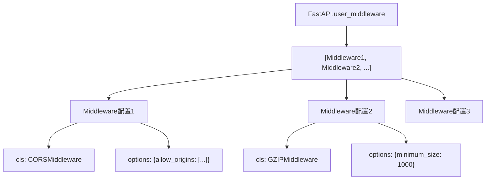
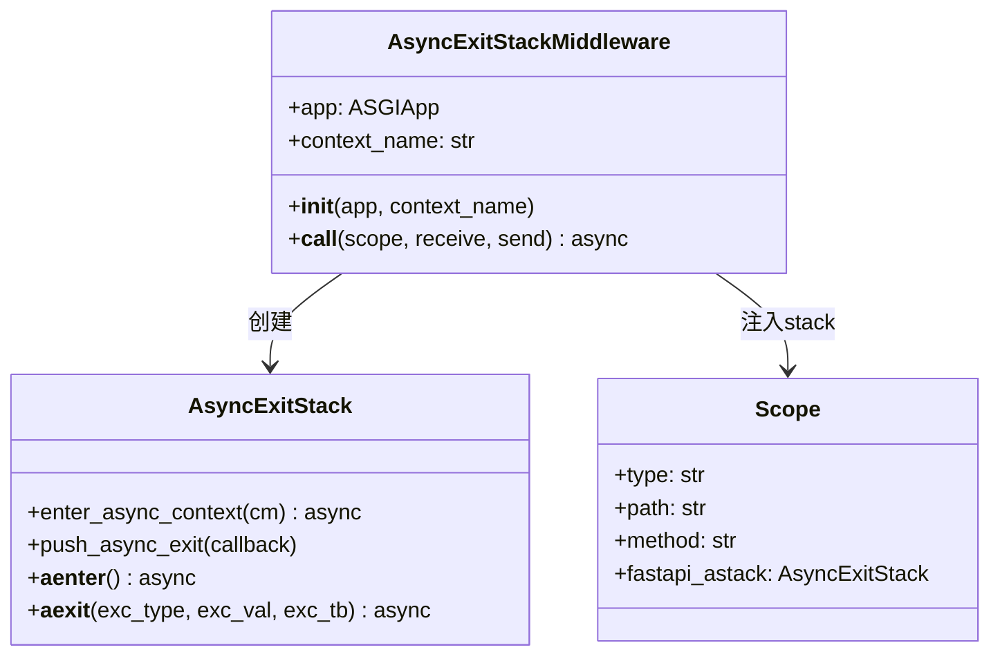
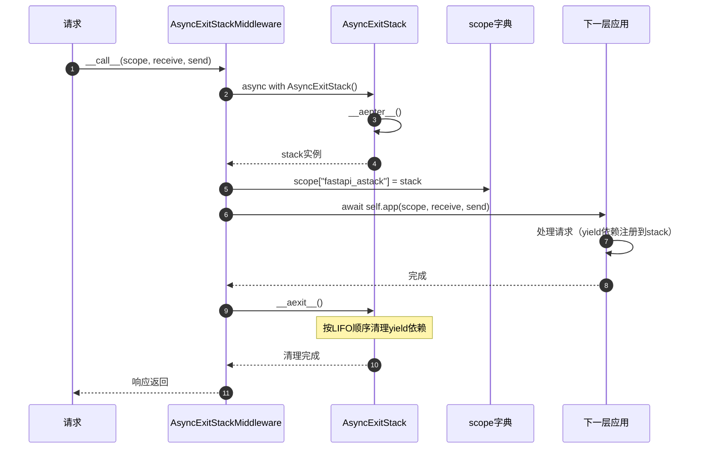
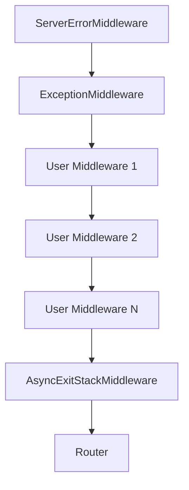
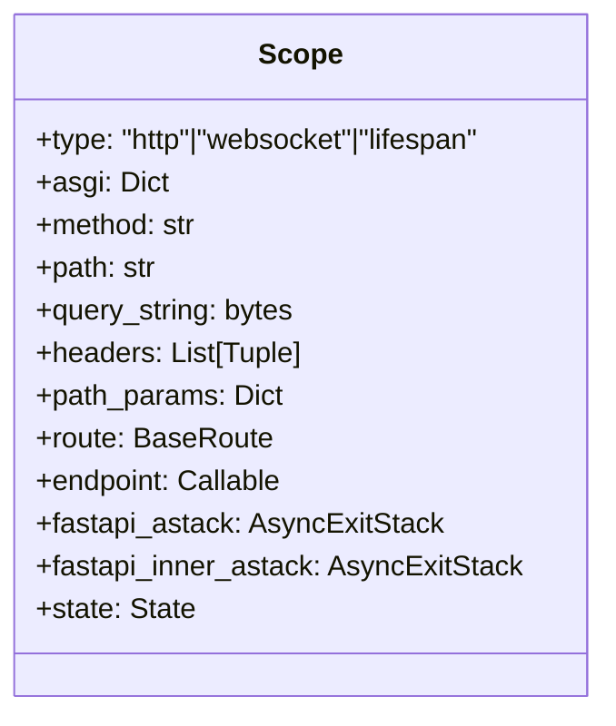
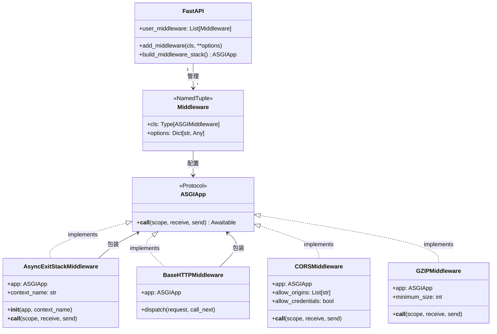
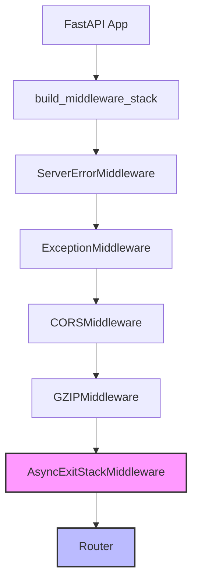

# FastAPI-04-中间件系统-数据结构

> **文档版本**: v1.0  
> **FastAPI 版本**: 0.118.0  
> **创建日期**: 2025年10月4日

---

## 📋 目录

1. [数据结构概览](#数据结构概览)
2. [Middleware配置结构](#middleware配置结构)
3. [AsyncExitStackMiddleware](#asyncexitstackmiddleware)
4. [中间件栈结构](#中间件栈结构)
5. [ASGI应用接口](#asgi应用接口)
6. [UML类图](#uml类图)

---

## 数据结构概览

### 核心数据结构清单

| 结构名称 | 类型 | 文件位置 | 职责 |
|----------|------|----------|------|
| **Middleware** | dataclass/NamedTuple | Starlette | 中间件配置 |
| **AsyncExitStackMiddleware** | class | `middleware/asyncexitstack.py` | 管理AsyncExitStack |
| **BaseHTTPMiddleware** | class | Starlette | HTTP中间件基类 |
| **ASGIApp** | Protocol | typing | ASGI应用接口 |

---

## Middleware配置结构

### 定义

```python
from dataclasses import dataclass
from typing import Any, Type

@dataclass
class Middleware:
    """
    中间件配置，存储中间件类和初始化参数
    """
    cls: Type[ASGIMiddleware]    # 中间件类
    options: Dict[str, Any]       # 初始化参数
```

**Starlette实现**（NamedTuple版本）：
```python
from typing import Any, Awaitable, Callable, Dict, NamedTuple, Type

class Middleware(NamedTuple):
    cls: Type[ASGIMiddleware]
    options: Dict[str, Any]
```

### 属性详解

| 属性 | 类型 | 说明 |
|------|------|------|
| **cls** | Type[ASGIMiddleware] | 中间件类（未实例化） |
| **options** | Dict[str, Any] | 传递给中间件`__init__()`的参数 |

### 使用示例

```python
from fastapi.middleware.cors import CORSMiddleware

# 创建中间件配置
middleware_config = Middleware(
    cls=CORSMiddleware,
    options={
        "allow_origins": ["https://example.com"],
        "allow_credentials": True,
    }
)

# 在build_middleware_stack()时实例化
middleware_instance = middleware_config.cls(
    app=next_app,
    **middleware_config.options
)
```

### 中间件配置列表



---

## AsyncExitStackMiddleware

### 类定义

```python
from contextlib import AsyncExitStack
from typing import TYPE_CHECKING

if TYPE_CHECKING:
    from starlette.types import ASGIApp, Receive, Scope, Send

class AsyncExitStackMiddleware:
    """
    为每个请求创建AsyncExitStack，用于管理yield依赖的生命周期
    """
    def __init__(self, app: "ASGIApp", context_name: str = "fastapi_astack") -> None:
        self.app = app
        self.context_name = context_name
    
    async def __call__(self, scope: "Scope", receive: "Receive", send: "Send") -> None:
        async with AsyncExitStack() as stack:
            scope[self.context_name] = stack
            await self.app(scope, receive, send)
```

### 属性详解

| 属性 | 类型 | 说明 |
|------|------|------|
| **app** | ASGIApp | 下一层ASGI应用 |
| **context_name** | str | 在scope中存储stack的键名 |

### 核心功能

1. **创建AsyncExitStack**: 每个请求创建一个新的stack
2. **注入scope**: 将stack存储在`scope["fastapi_astack"]`中
3. **自动清理**: 请求结束时自动调用stack的`__aexit__()`

### UML类图



### 使用流程



### yield依赖注册

```python
# 在solve_dependencies()中注册yield依赖
async with AsyncExitStack() as stack:
    scope["fastapi_astack"] = stack
    
    # yield依赖
    async def get_db():
        db = Database()
        try:
            yield db
        finally:
            await db.close()
    
    # 注册到stack
    db = await stack.enter_async_context(get_db())
    
    # 请求处理...
    
    # stack.__aexit__()自动调用get_db()的finally块
```

---

## 中间件栈结构

### 栈的构建

```python
def build_middleware_stack(self) -> ASGIApp:
    """
    构建中间件栈（洋葱模型）
    """
    # 从内到外构建
    app = self.router
    
    # 添加AsyncExitStackMiddleware（最内层）
    app = AsyncExitStackMiddleware(app, context_name="fastapi_inner_astack")
    
    # 按user_middleware逆序添加（后添加的中间件在外层）
    for middleware in reversed(self.user_middleware):
        app = middleware.cls(app, **middleware.options)
    
    # 添加ServerErrorMiddleware和ExceptionMiddleware（最外层）
    app = ExceptionMiddleware(app, handlers=self.exception_handlers)
    app = ServerErrorMiddleware(app)
    
    return app
```

### 洋葱模型



**执行顺序**（请求）：
1. ServerErrorMiddleware
2. ExceptionMiddleware
3. User Middleware 1
4. User Middleware 2
5. ...
6. AsyncExitStackMiddleware
7. Router → Routes → Endpoint

**执行顺序**（响应）：逆序返回

### 中间件栈数据结构

```python
from typing import List

@dataclass
class MiddlewareStack:
    """中间件栈（概念模型）"""
    layers: List[ASGIApp]  # 从外到内的中间件列表
    
    def __call__(self, scope, receive, send):
        """从最外层开始调用"""
        return self.layers[0](scope, receive, send)
```

**实际实现**：
```python
# 通过嵌套调用实现栈结构
outer_middleware = Middleware1(
    Middleware2(
        Middleware3(
            Router()
        )
    )
)
```

---

## ASGI应用接口

### ASGIApp Protocol

```python
from typing import Awaitable, Callable, Protocol

class Receive(Protocol):
    """接收消息的可调用对象"""
    def __call__(self) -> Awaitable[Dict[str, Any]]:
        ...

class Send(Protocol):
    """发送消息的可调用对象"""
    def __call__(self, message: Dict[str, Any]) -> Awaitable[None]:
        ...

class Scope(TypedDict):
    """ASGI scope字典"""
    type: str  # "http", "websocket", "lifespan"
    asgi: Dict[str, str]
    http_version: str
    method: str
    path: str
    query_string: bytes
    headers: List[Tuple[bytes, bytes]]
    # ... 更多字段

# ASGI应用类型
ASGIApp = Callable[[Scope, Receive, Send], Awaitable[None]]
```

### 中间件接口

```python
from typing import Any

class ASGIMiddleware:
    """
    ASGI中间件标准接口
    """
    def __init__(self, app: ASGIApp, **options: Any) -> None:
        """
        初始化中间件
        
        Args:
            app: 下一层ASGI应用
            **options: 中间件配置参数
        """
        self.app = app
    
    async def __call__(
        self,
        scope: Scope,
        receive: Receive,
        send: Send
    ) -> None:
        """
        处理ASGI请求
        
        Args:
            scope: ASGI scope字典
            receive: 接收消息的回调
            send: 发送消息的回调
        """
        # 请求前处理
        # ...
        
        # 调用下一层
        await self.app(scope, receive, send)
        
        # 响应后处理
        # ...
```

### Scope字典结构



**Scope字段说明**：

| 字段 | 类型 | 说明 |
|------|------|------|
| **type** | str | 请求类型："http", "websocket", "lifespan" |
| **method** | str | HTTP方法："GET", "POST"等 |
| **path** | str | 请求路径："/api/users" |
| **query_string** | bytes | 查询字符串："limit=10&offset=0" |
| **headers** | List[Tuple] | 请求头：`[(b"host", b"example.com"), ...]` |
| **path_params** | Dict | 路径参数：`{"user_id": 123}` |
| **route** | BaseRoute | 匹配的路由对象 |
| **endpoint** | Callable | 端点函数 |
| **fastapi_astack** | AsyncExitStack | 外层AsyncExitStack |
| **fastapi_inner_astack** | AsyncExitStack | 内层AsyncExitStack |
| **state** | State | 应用状态对象 |

---

## UML类图

### 完整中间件系统类图



### 中间件栈结构图



### 数据流转图


---

## 📊 数据结构统计

| 项目 | 数量/说明 |
|------|----------|
| 核心结构 | 4个（Middleware, AsyncExitStackMiddleware, ASGIApp, Scope） |
| Middleware配置 | 2个字段（cls, options） |
| AsyncExitStackMiddleware | 2个属性（app, context_name） |
| Scope关键字段 | 10+个 |
| 中间件层级 | 无限制（理论上） |

---

## 📚 相关文档

- [FastAPI-04-中间件系统-概览](./FastAPI-04-中间件系统-概览.md) - 中间件系统架构
- [FastAPI-04-中间件系统-API](./FastAPI-04-中间件系统-API.md) - 中间件API详解
- [FastAPI-04-中间件系统-时序图](./FastAPI-04-中间件系统-时序图.md) - 中间件执行流程
- [FastAPI-03-依赖注入-概览](./FastAPI-03-依赖注入-概览.md) - AsyncExitStack与yield依赖

---

*本文档生成于 2025年10月4日，基于 FastAPI 0.118.0*

