# FastAPI-04-中间件系统-时序图

> **文档版本**: v1.0  
> **FastAPI 版本**: 0.118.0  
> **创建日期**: 2025年10月4日

---

## 📋 目录

1. [时序图概览](#时序图概览)
2. [中间件栈构建流程](#中间件栈构建流程)
3. [中间件注册流程](#中间件注册流程)
4. [请求通过中间件链流程](#请求通过中间件链流程)
5. [AsyncExitStack生命周期](#asyncexitstack生命周期)
6. [CORS预检请求流程](#cors预检请求流程)
7. [GZIP压缩流程](#gzip压缩流程)

---

## 时序图概览

### 核心流程清单

| # | 流程名称 | 执行时机 | 复杂度 | 频率 |
|---|---------|----------|--------|------|
| 1 | 中间件栈构建 | 应用启动 | ⭐⭐ | 一次 |
| 2 | 中间件注册 | 启动前配置 | ⭐ | 多次 |
| 3 | 请求处理链 | 每个请求 | ⭐⭐⭐⭐ | 高频 |
| 4 | AsyncExitStack管理 | 每个请求 | ⭐⭐⭐ | 高频 |
| 5 | CORS预检 | OPTIONS请求 | ⭐⭐ | 中频 |
| 6 | GZIP压缩 | 符合条件的响应 | ⭐⭐ | 高频 |

---

## 中间件栈构建流程

### 1.1 build_middleware_stack()完整流程

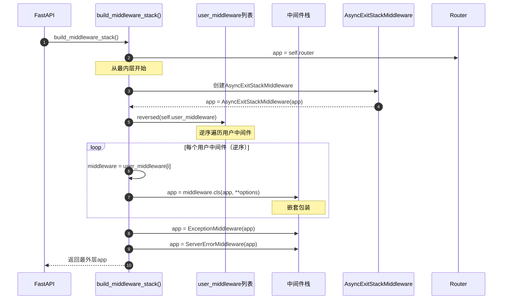

**时序图说明**：
1. **图意概述**: 展示中间件栈的构建过程，从内到外逐层包装
2. **关键字段**: app变量不断被新的中间件包装；user_middleware逆序遍历
3. **边界条件**: user_middleware可以为空；Router是最内层
4. **执行顺序**: Router → AsyncExitStack → 用户中间件(逆序) → 异常处理
5. **性能假设**: 构建在启动时完成一次，O(n)复杂度，n为中间件数量
6. **设计理由**: 通过嵌套调用实现洋葱模型；逆序确保后添加的先执行

### 1.2 中间件嵌套结构

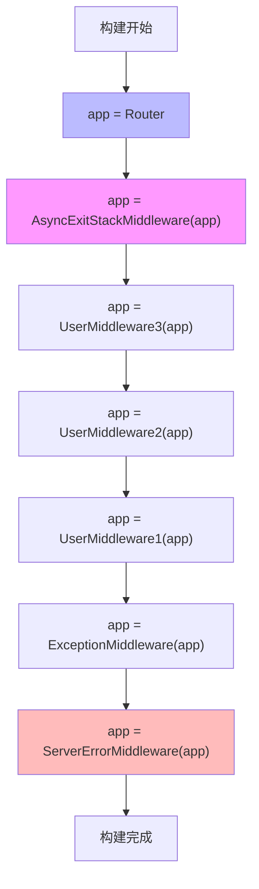

---

## 中间件注册流程

### 2.1 add_middleware()注册流程

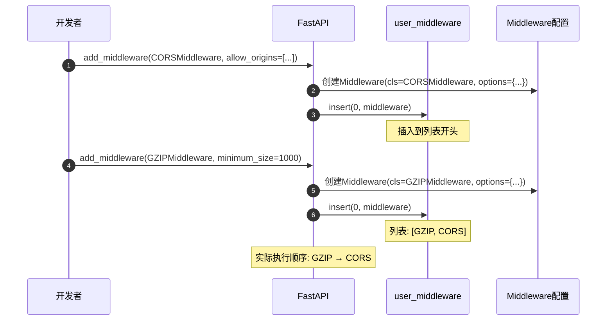

**时序图说明**：
1. **图意概述**: 展示中间件注册时的配置存储过程
2. **关键点**: 使用`insert(0)`而不是`append()`，确保后添加的先执行
3. **边界条件**: 可以多次添加同一个中间件类（不同配置）
4. **性能**: O(1)时间复杂度（列表insert操作）

---

## 请求通过中间件链流程

### 3.1 完整中间件链执行

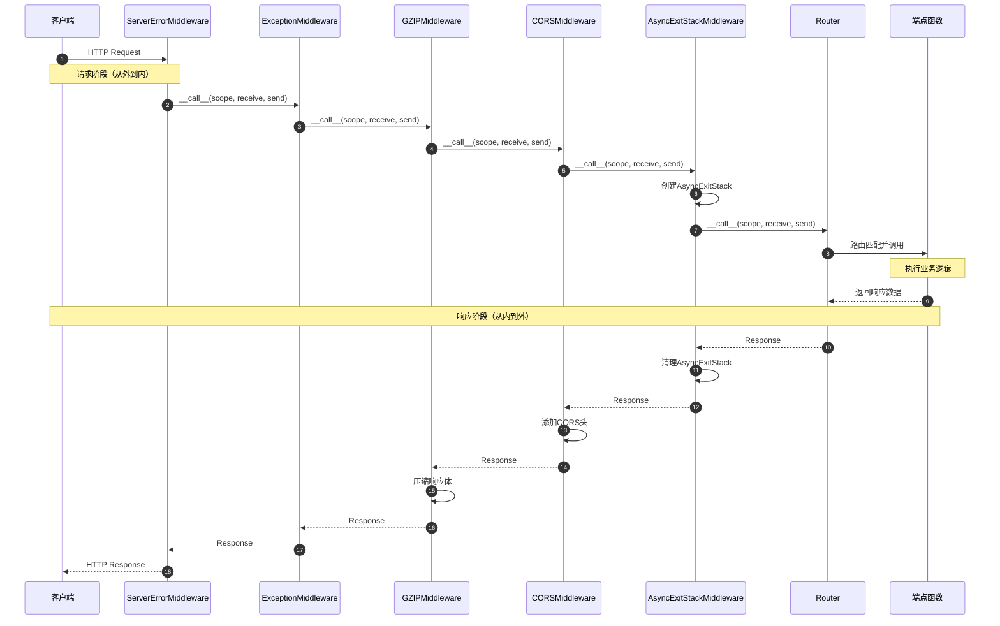

**时序图说明**：
1. **图意概述**: 展示请求从外到内穿过中间件链，响应从内到外返回的完整流程
2. **关键阶段**: 请求阶段（外→内）；业务逻辑；响应阶段（内→外）
3. **边界条件**: 任何中间件可以短路返回；异常会被ExceptionMiddleware捕获
4. **异常路径**: 异常 → ExceptionMiddleware → 转换为HTTP响应 → 返回客户端
5. **性能假设**: 中间件数量n，时间复杂度O(n)
6. **设计理由**: 洋葱模型确保每个中间件都能处理请求和响应

### 3.2 中间件短路返回

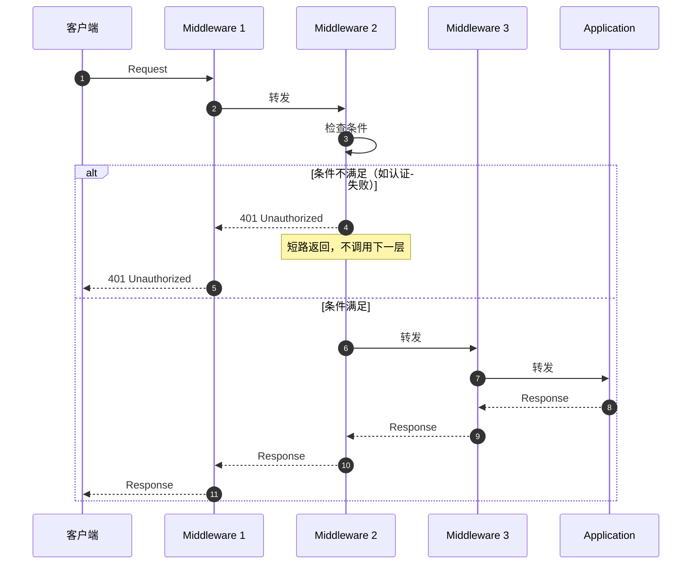

---

## AsyncExitStack生命周期

### 4.1 AsyncExitStackMiddleware完整流程

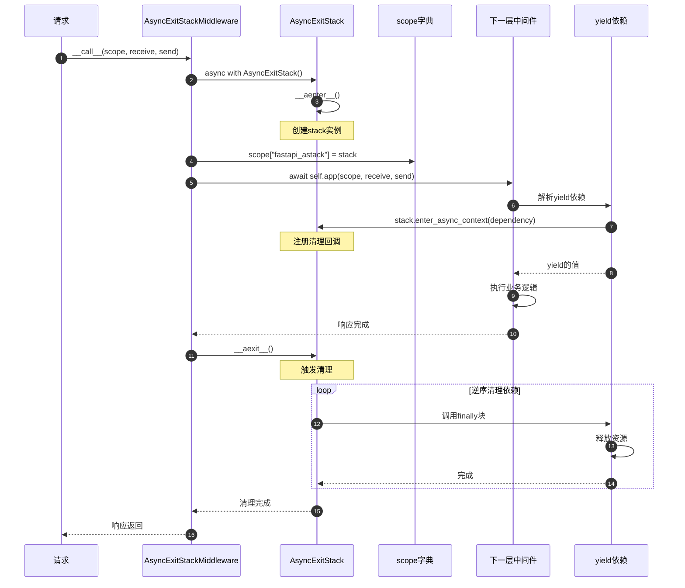

**时序图说明**：
1. **图意概述**: 展示AsyncExitStack的完整生命周期，从创建到清理
2. **关键字段**: scope["fastapi_astack"]存储stack；依赖注册到stack
3. **边界条件**: 即使发生异常，__aexit__()也会执行；清理逆序进行
4. **异常路径**: 异常 → __aexit__()仍然执行 → 清理完成后异常继续传播
5. **性能假设**: 清理操作应该快速完成
6. **设计理由**: 确保资源正确释放，防止内存泄漏

### 4.2 多个yield依赖的清理顺序

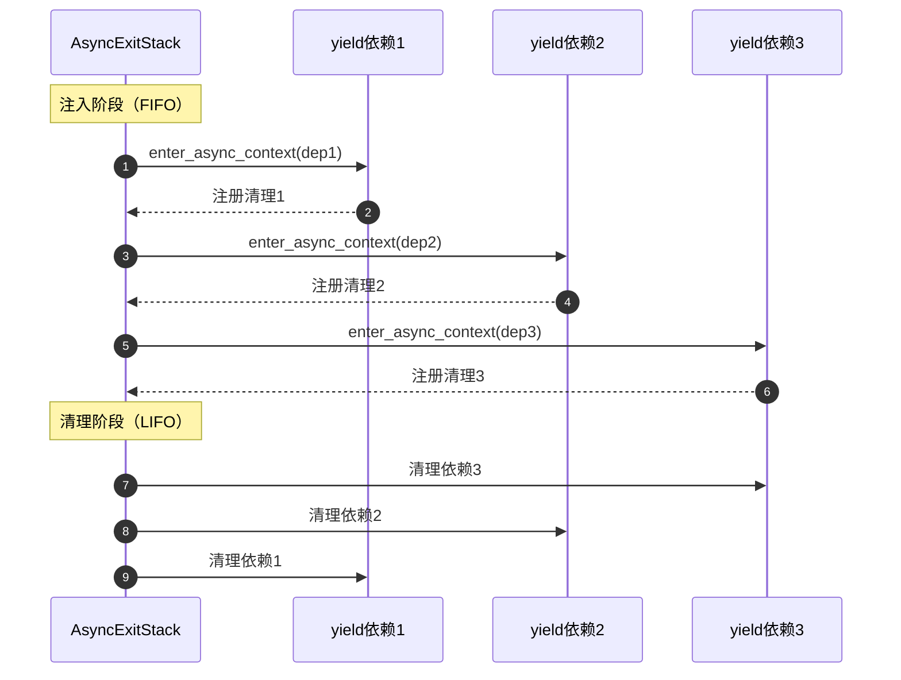

---

## CORS预检请求流程

### 5.1 OPTIONS预检请求处理

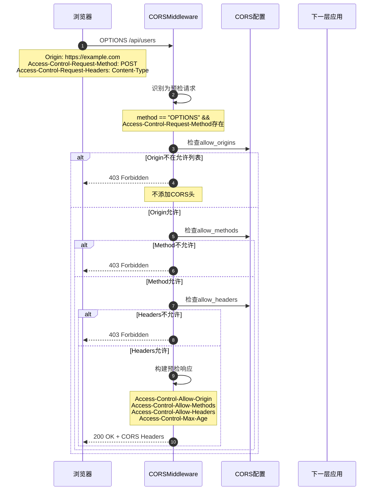

**时序图说明**：
1. **图意概述**: 展示CORS预检请求的完整验证和响应流程
2. **关键字段**: Origin、Access-Control-Request-Method、Access-Control-Request-Headers
3. **边界条件**: 预检请求直接返回，不会到达应用层
4. **异常路径**: 任何验证失败都返回403
5. **性能假设**: 预检请求通常占总请求的10-20%（取决于max_age配置）
6. **设计理由**: 浏览器缓存预检结果，减少不必要的请求

### 5.2 实际请求的CORS处理

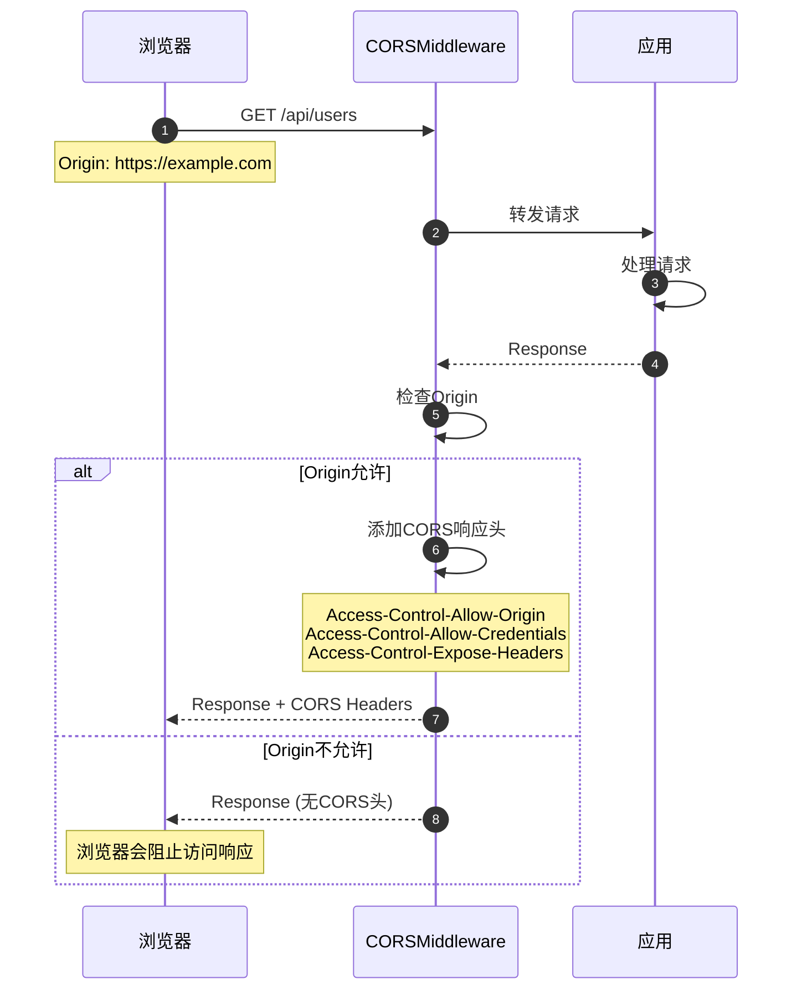

---

## GZIP压缩流程

### 6.1 GZIP中间件处理流程

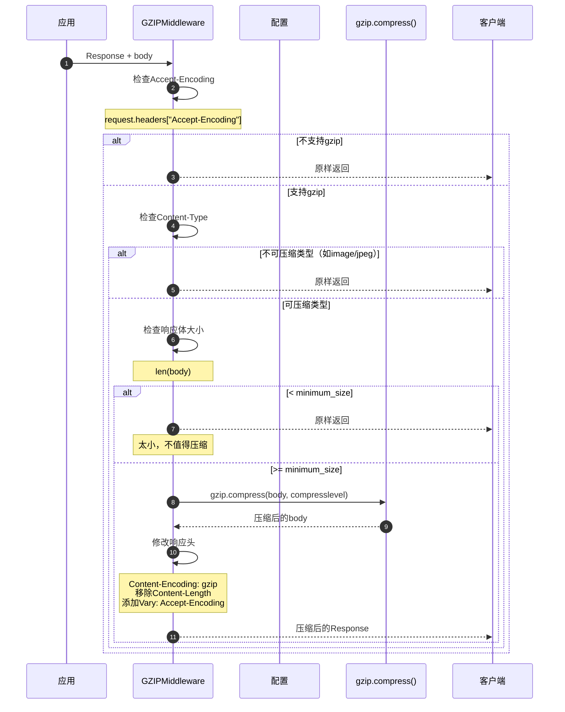

**时序图说明**：
1. **图意概述**: 展示GZIP压缩的完整决策和执行流程
2. **关键字段**: Accept-Encoding决定是否压缩；minimum_size控制压缩阈值
3. **边界条件**: 小响应不压缩；不可压缩类型跳过；客户端不支持时跳过
4. **异常路径**: 压缩失败返回原始响应
5. **性能假设**: 压缩级别越高，CPU消耗越大；通常能减少60-80%传输量
6. **设计理由**: 平衡CPU消耗和带宽节省

### 6.2 压缩率对比

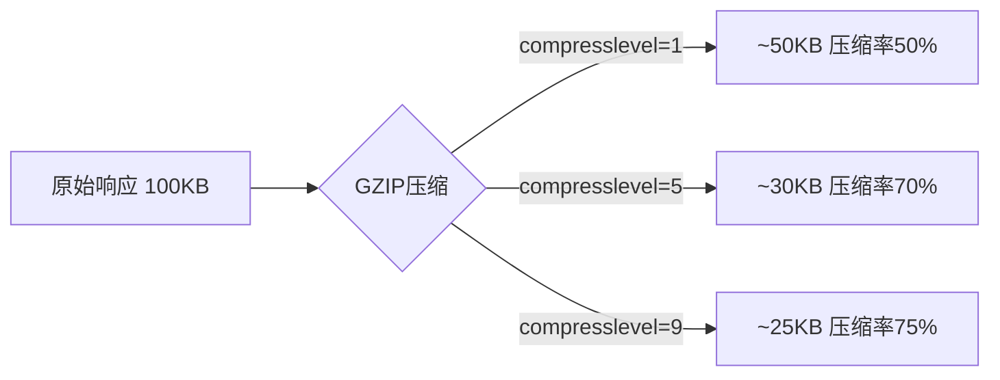

---

## 📊 时序图总结

### 核心流程对比

| 流程 | 执行时机 | 复杂度 | 频率 | 性能影响 |
|------|----------|--------|------|----------|
| 中间件栈构建 | 应用启动 | O(n) | 一次 | 无 |
| 中间件注册 | 配置阶段 | O(1) | 多次 | 无 |
| 请求处理链 | 每个请求 | O(n) | 高频 | 高 |
| AsyncExitStack | 每个请求 | O(d) | 高频 | 中 |
| CORS预检 | OPTIONS请求 | O(1) | 中频 | 低 |
| GZIP压缩 | 大响应 | O(m) | 高频 | 中 |

*n=中间件数量, d=yield依赖数量, m=响应体大小*

### 性能优化建议

1. **减少中间件数量**
   - ✅ 合并功能相似的中间件
   - ✅ 移除不必要的中间件
   - ⚠️ 中间件数量直接影响每个请求的处理时间

2. **CORS配置优化**
   - ✅ 增加max_age减少预检请求频率
   - ✅ 生产环境明确指定allow_origins
   - ⚠️ 避免使用正则表达式匹配（性能较差）

3. **GZIP配置优化**
   - ✅ 设置合理的minimum_size（推荐1000-2000字节）
   - ✅ 使用中等压缩级别（5-6）
   - ⚠️ 对已压缩内容（图片、视频）禁用压缩

4. **AsyncExitStack优化**
   - ✅ 清理代码应该快速执行
   - ✅ 避免在清理代码中执行IO操作
   - ⚠️ yield依赖清理异常应该被捕获

### 中间件顺序最佳实践

```python
# 推荐的中间件添加顺序
app = FastAPI()

# 1. 安全相关（最外层）
app.add_middleware(TrustedHostMiddleware, ...)
app.add_middleware(HTTPSRedirectMiddleware)

# 2. CORS（在压缩之前）
app.add_middleware(CORSMiddleware, ...)

# 3. 压缩（最后，压缩所有响应）
app.add_middleware(GZIPMiddleware, ...)

# 4. 自定义中间件
@app.middleware("http")
async def custom_middleware(request, call_next):
    response = await call_next(request)
    return response
```

---

## 📚 相关文档

- [FastAPI-04-中间件系统-概览](./FastAPI-04-中间件系统-概览.md) - 中间件系统架构
- [FastAPI-04-中间件系统-API](./FastAPI-04-中间件系统-API.md) - 中间件API详解
- [FastAPI-04-中间件系统-数据结构](./FastAPI-04-中间件系统-数据结构.md) - 中间件数据结构
- [FastAPI-03-依赖注入-时序图](./FastAPI-03-依赖注入-时序图.md) - yield依赖详细流程

---

*本文档生成于 2025年10月4日，基于 FastAPI 0.118.0*

