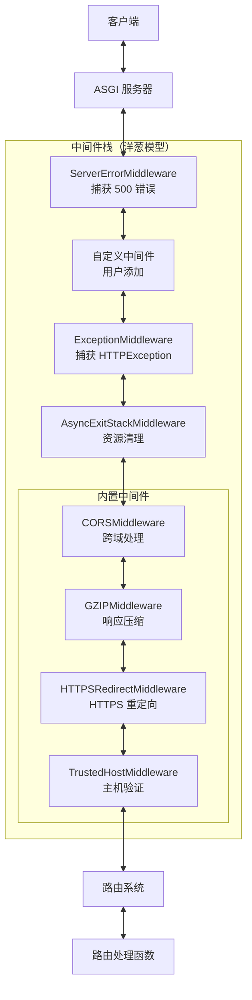
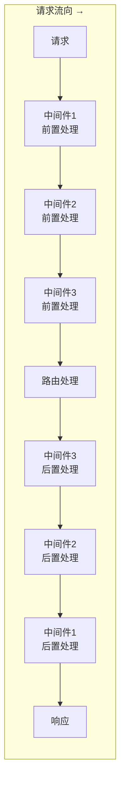
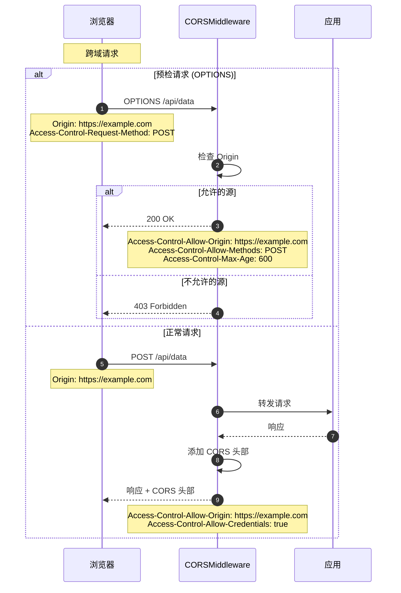

# FastAPI 源码剖析 - 04 中间件系统 - 概览

## 模块职责

中间件系统（`middleware/` 模块）负责在请求到达路由处理函数之前和响应返回客户端之前对它们进行处理。主要职责包括：

### 主要职责

1. **请求预处理**
   - 请求日志记录
   - 请求头部检查和修改
   - 身份认证和授权
   - 请求限流和防护

2. **响应后处理**
   - 响应头部添加（CORS、安全头部等）
   - 响应压缩（GZIP）
   - 响应日志记录
   - 性能监控（处理时间等）

3. **横切关注点**
   - 跨域资源共享（CORS）
   - HTTPS 重定向
   - 可信主机验证
   - 异常处理和错误响应

4. **资源管理**
   - 异步上下文管理（AsyncExitStack）
   - 文件和连接清理
   - 依赖项清理

## 中间件类型

FastAPI 支持两种类型的中间件：

### 1. ASGI 中间件
标准的 ASGI 中间件，直接操作 ASGI 接口：

```python
class CustomMiddleware:
    def __init__(self, app: ASGIApp):
        self.app = app
    
    async def __call__(self, scope: Scope, receive: Receive, send: Send):
        # 请求前处理
        await self.app(scope, receive, send)
        # 响应后处理
```

### 2. HTTP 中间件
FastAPI 提供的简化接口，操作 Request 和 Response 对象：

```python
@app.middleware("http")
async def custom_middleware(request: Request, call_next):
    # 请求前处理
    response = await call_next(request)
    # 响应后处理
    return response
```

## 中间件架构图



## 洋葱模型

中间件采用洋葱模型，后注册的中间件在外层：



### 执行顺序示例

```python
@app.middleware("http")
async def middleware_1(request, call_next):
    print("M1: Before")
    response = await call_next(request)
    print("M1: After")
    return response

@app.middleware("http")
async def middleware_2(request, call_next):
    print("M2: Before")
    response = await call_next(request)
    print("M2: After")
    return response

@app.middleware("http")
async def middleware_3(request, call_next):
    print("M3: Before")
    response = await call_next(request)
    print("M3: After")
    return response

@app.get("/")
async def root():
    print("Route Handler")
    return {"message": "Hello"}

# 输出顺序：
# M3: Before
# M2: Before
# M1: Before
# Route Handler
# M1: After
# M2: After
# M3: After
```

## FastAPI 特有中间件

### AsyncExitStackMiddleware

这是 FastAPI 的核心中间件，负责管理异步上下文（用于 yield 依赖的清理）：

```python
class AsyncExitStackMiddleware:
    def __init__(self, app: ASGIApp, context_name: str = "fastapi_middleware_astack"):
        self.app = app
        self.context_name = context_name
    
    async def __call__(self, scope: Scope, receive: Receive, send: Send):
        # 创建异步上下文栈
        async with AsyncExitStack() as stack:
            # 将栈存储在 scope 中，供依赖注入使用
            scope[self.context_name] = stack
            # 执行下一层
            await self.app(scope, receive, send)
        # 离开上下文时自动清理所有资源
```

**作用**：
- 管理 yield 依赖的生命周期
- 确保资源在请求结束后正确清理
- 支持多个嵌套的上下文管理器

**位置**：
- 在 `ExceptionMiddleware` 之后
- 在路由处理之前
- 确保即使发生异常也能清理资源

## 内置中间件详解

### 1. CORSMiddleware - 跨域资源共享

```python
from fastapi.middleware.cors import CORSMiddleware

app.add_middleware(
    CORSMiddleware,
    allow_origins=["https://example.com"],  # 允许的源
    allow_credentials=True,                 # 允许携带凭证
    allow_methods=["*"],                    # 允许的 HTTP 方法
    allow_headers=["*"],                    # 允许的请求头
    expose_headers=["X-Custom-Header"],     # 暴露的响应头
    max_age=600,                            # 预检请求缓存时间（秒）
)
```

**工作原理**：
1. 检查请求的 `Origin` 头部
2. 如果是预检请求（OPTIONS），返回 CORS 头部
3. 如果是正常请求，添加 CORS 响应头部
4. 支持通配符和动态源验证

**时序图**：



### 2. GZIPMiddleware - 响应压缩

```python
from fastapi.middleware.gzip import GZIPMiddleware

app.add_middleware(
    GZIPMiddleware,
    minimum_size=1000,  # 最小压缩大小（字节）
    compresslevel=5,    # 压缩级别（1-9）
)
```

**工作原理**：
1. 检查响应大小是否超过 `minimum_size`
2. 检查客户端是否支持 gzip（`Accept-Encoding` 头部）
3. 使用 gzip 压缩响应体
4. 添加 `Content-Encoding: gzip` 头部

**压缩效果**：
- JSON 数据：通常压缩 60-80%
- HTML：通常压缩 70-85%
- 已压缩数据（图片、视频）：几乎无效果

**性能考虑**：
- 增加 CPU 开销
- 减少网络传输
- 适合慢速网络场景

### 3. HTTPSRedirectMiddleware - HTTPS 重定向

```python
from fastapi.middleware.httpsredirect import HTTPSRedirectMiddleware

app.add_middleware(HTTPSRedirectMiddleware)
```

**工作原理**：
1. 检查请求协议（`scope["scheme"]`）
2. 如果是 HTTP，返回 307 临时重定向到 HTTPS
3. 如果是 HTTPS，正常处理

**使用场景**：
- 强制使用 HTTPS
- 生产环境安全性
- 通常配合反向代理使用

### 4. TrustedHostMiddleware - 可信主机验证

```python
from fastapi.middleware.trustedhost import TrustedHostMiddleware

app.add_middleware(
    TrustedHostMiddleware,
    allowed_hosts=["example.com", "*.example.com"]  # 允许的主机
)
```

**工作原理**：
1. 检查请求的 `Host` 头部
2. 与 `allowed_hosts` 列表匹配（支持通配符）
3. 如果不匹配，返回 400 Bad Request
4. 如果匹配，正常处理

**防护场景**：
- Host 头部注入攻击
- DNS 重绑定攻击
- 缓存投毒攻击

## 中间件执行流程

### 完整时序图


## 自定义中间件

### 基于函数的中间件

```python
import time
from fastapi import FastAPI, Request

app = FastAPI()

@app.middleware("http")
async def add_process_time_header(request: Request, call_next):
    # 请求前处理
    start_time = time.time()
    
    # 调用下一层（可能是另一个中间件或路由）
    response = await call_next(request)
    
    # 响应后处理
    process_time = time.time() - start_time
    response.headers["X-Process-Time"] = str(process_time)
    
    return response
```

### 基于类的中间件

```python
from starlette.middleware.base import BaseHTTPMiddleware
from starlette.requests import Request

class LoggingMiddleware(BaseHTTPMiddleware):
    async def dispatch(self, request: Request, call_next):
        # 请求前
        print(f"收到请求: {request.method} {request.url}")
        
        # 执行
        response = await call_next(request)
        
        # 响应后
        print(f"返回响应: {response.status_code}")
        
        return response

app.add_middleware(LoggingMiddleware)
```

### ASGI 中间件

```python
class CustomASGIMiddleware:
    def __init__(self, app: ASGIApp):
        self.app = app
    
    async def __call__(self, scope: Scope, receive: Receive, send: Send):
        if scope["type"] != "http":
            await self.app(scope, receive, send)
            return
        
        # 修改 scope
        scope["custom_header"] = "value"
        
        # 包装 send 以修改响应
        async def send_wrapper(message):
            if message["type"] == "http.response.start":
                headers = message.get("headers", [])
                headers.append((b"x-custom", b"value"))
                message["headers"] = headers
            await send(message)
        
        await self.app(scope, receive, send_wrapper)

app.add_middleware(CustomASGIMiddleware)
```

## 实际应用示例

### 示例1：请求限流中间件

```python
from fastapi import HTTPException
import time
from collections import defaultdict

class RateLimitMiddleware(BaseHTTPMiddleware):
    def __init__(self, app, requests_per_minute: int = 60):
        super().__init__(app)
        self.requests_per_minute = requests_per_minute
        self.requests = defaultdict(list)
    
    async def dispatch(self, request: Request, call_next):
        # 获取客户端 IP
        client_ip = request.client.host
        current_time = time.time()
        
        # 清理过期记录
        self.requests[client_ip] = [
            req_time for req_time in self.requests[client_ip]
            if current_time - req_time < 60
        ]
        
        # 检查限流
        if len(self.requests[client_ip]) >= self.requests_per_minute:
            raise HTTPException(
                status_code=429,
                detail="Too many requests"
            )
        
        # 记录请求
        self.requests[client_ip].append(current_time)
        
        # 继续处理
        response = await call_next(request)
        return response

app.add_middleware(RateLimitMiddleware, requests_per_minute=100)
```

### 示例2：请求ID追踪

```python
import uuid

@app.middleware("http")
async def add_request_id(request: Request, call_next):
    # 生成或获取请求ID
    request_id = request.headers.get("X-Request-ID", str(uuid.uuid4()))
    
    # 存储到 request.state
    request.state.request_id = request_id
    
    # 处理请求
    response = await call_next(request)
    
    # 添加到响应头
    response.headers["X-Request-ID"] = request_id
    
    return response

# 在路由中使用
@app.get("/items/")
async def read_items(request: Request):
    request_id = request.state.request_id
    print(f"处理请求 {request_id}")
    return {"items": []}
```

### 示例3：数据库事务中间件

```python
@app.middleware("http")
async def db_session_middleware(request: Request, call_next):
    # 创建数据库会话
    async with SessionLocal() as session:
        # 存储到 request.state
        request.state.db = session
        
        try:
            # 处理请求
            response = await call_next(request)
            
            # 提交事务
            await session.commit()
            
            return response
        except Exception:
            # 回滚事务
            await session.rollback()
            raise
```

### 示例4：性能监控

```python
import time
from prometheus_client import Histogram, Counter

REQUEST_DURATION = Histogram(
    "http_request_duration_seconds",
    "HTTP request duration",
    ["method", "endpoint", "status"]
)

REQUEST_COUNT = Counter(
    "http_requests_total",
    "Total HTTP requests",
    ["method", "endpoint", "status"]
)

@app.middleware("http")
async def metrics_middleware(request: Request, call_next):
    start_time = time.time()
    
    # 处理请求
    response = await call_next(request)
    
    # 记录指标
    duration = time.time() - start_time
    endpoint = request.url.path
    method = request.method
    status = response.status_code
    
    REQUEST_DURATION.labels(
        method=method,
        endpoint=endpoint,
        status=status
    ).observe(duration)
    
    REQUEST_COUNT.labels(
        method=method,
        endpoint=endpoint,
        status=status
    ).inc()
    
    return response
```

## 性能优化

### 中间件性能考虑

1. **顺序优化**：
   - 快速失败的中间件放在外层（如认证、限流）
   - 资源密集的中间件放在内层（如压缩）

2. **异步操作**：
   - 使用异步 I/O 避免阻塞
   - 不要在中间件中使用阻塞操作

3. **避免重复工作**：
   - 使用 `request.state` 共享数据
   - 避免多次解析相同数据

4. **条件执行**：
   - 只在需要时执行中间件逻辑
   - 使用路径前缀过滤

### 中间件数量

- **建议**：不超过 5-7 个中间件
- **原因**：每个中间件都增加延迟
- **优化**：合并相似功能的中间件

## 最佳实践

### 1. 使用 request.state 共享数据

```python
@app.middleware("http")
async def add_user_context(request: Request, call_next):
    # 解析 token 并获取用户
    token = request.headers.get("Authorization")
    user = await get_user_from_token(token)
    
    # 存储到 request.state
    request.state.user = user
    
    response = await call_next(request)
    return response

# 在路由中使用
@app.get("/profile")
async def profile(request: Request):
    user = request.state.user  # 不需要重新解析 token
    return {"username": user.username}
```

### 2. 异常处理

```python
@app.middleware("http")
async def error_handling_middleware(request: Request, call_next):
    try:
        response = await call_next(request)
        return response
    except ValueError as e:
        return JSONResponse(
            status_code=400,
            content={"detail": str(e)}
        )
    except Exception as e:
        # 记录日志
        logger.error(f"Unexpected error: {e}")
        return JSONResponse(
            status_code=500,
            content={"detail": "Internal server error"}
        )
```

### 3. 条件中间件

```python
@app.middleware("http")
async def conditional_middleware(request: Request, call_next):
    # 只对 API 路径启用
    if request.url.path.startswith("/api/"):
        # 中间件逻辑
        start_time = time.time()
        response = await call_next(request)
        duration = time.time() - start_time
        response.headers["X-API-Time"] = str(duration)
        return response
    else:
        # 跳过中间件逻辑
        return await call_next(request)
```

## 常见问题

### Q: 中间件和依赖注入的区别？
A:
- **中间件**：全局，影响所有路由，用于横切关注点
- **依赖注入**：路由级，可选择性应用，用于业务逻辑

### Q: 如何在中间件中访问路由信息？
A:
```python
@app.middleware("http")
async def route_info_middleware(request: Request, call_next):
    # 路由匹配在中间件之后进行
    # 可以通过 request.url.path 获取路径
    # 但无法获取路由处理函数信息
    response = await call_next(request)
    return response
```

### Q: 中间件可以修改请求体吗？
A: 不建议。请求体是流式读取的，修改请求体很复杂。建议在依赖项中处理。

### Q: 如何跳过某些路由的中间件？
A: 在中间件内部检查路径：
```python
@app.middleware("http")
async def skipable_middleware(request: Request, call_next):
    if request.url.path in ["/health", "/metrics"]:
        return await call_next(request)
    
    # 中间件逻辑
    ...
```

### Q: 中间件执行顺序如何控制？
A: 通过注册顺序控制。后注册的在外层（先执行）。

## 边界条件

### WebSocket 支持
- HTTP 中间件不处理 WebSocket
- 需要检查 `scope["type"]` 并跳过 WebSocket 请求

### 流式响应
- 中间件可以处理 `StreamingResponse`
- 不要在中间件中读取响应体（会破坏流式传输）

### 大请求体
- 避免在中间件中读取整个请求体
- 使用流式处理或在路由中处理

### 异步清理
- 使用 `try/finally` 确保清理逻辑执行
- AsyncExitStack 自动管理 yield 依赖的清理

