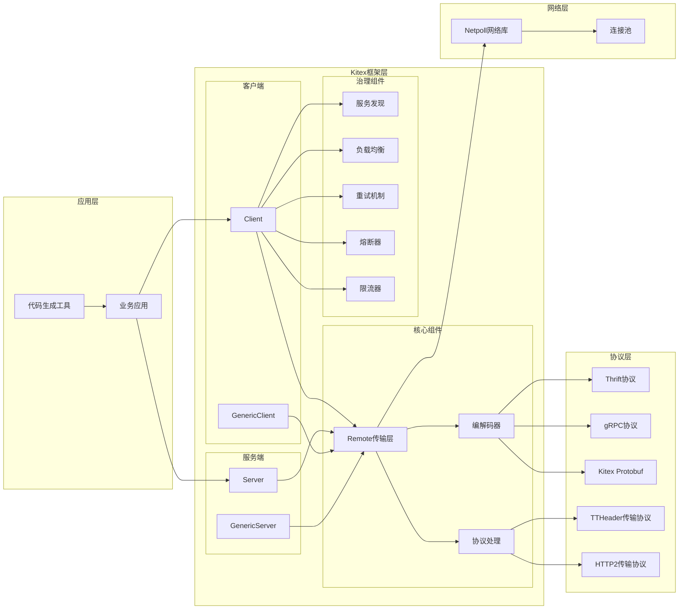
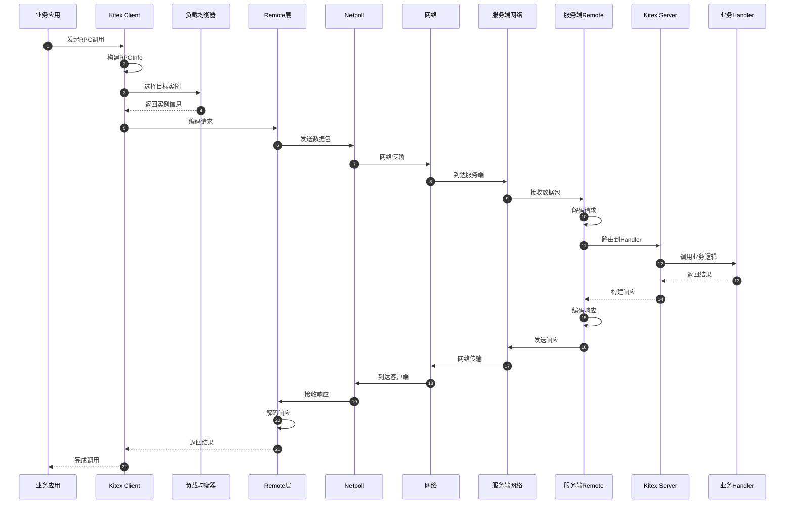

# Kitex源码剖析 - 总览

## 0. 摘要

### 项目目标与边界
Kitex是字节跳动开源的Go微服务RPC框架，专注于高性能和强扩展性。框架核心目标包括：
- **高性能**：集成Netpoll高性能网络库，相比go net具有显著性能优势
- **强扩展性**：提供丰富的扩展接口和默认实现，支持用户自定义扩展
- **多协议支持**：支持Thrift、Kitex Protobuf、gRPC等多种消息协议
- **服务治理**：集成服务发现、负载均衡、熔断、限流、重试等治理模块

### 非目标
- 非通用HTTP框架，专注于RPC通信
- 非数据存储解决方案，专注于服务间通信
- 非完整微服务解决方案，需配合其他组件使用

### 运行环境与部署形态
- **语言**：Go 1.20+
- **运行时**：支持Linux、macOS、Windows
- **依赖**：Netpoll网络库、Thriftgo代码生成工具
- **部署形态**：
  - 单体服务：Client/Server在同一进程
  - 微服务：Client/Server分离部署
  - Sidecar模式：作为代理层部署
  - SDK模式：嵌入业务应用

## 1. 整体架构图



### 架构要点说明

**1. 分层设计**
- **应用层**：业务代码和代码生成工具，通过IDL定义接口
- **框架层**：Kitex核心功能，包括客户端、服务端和治理组件
- **网络层**：基于Netpoll的高性能网络通信
- **协议层**：支持多种消息协议和传输协议

**2. 组件职责**
- **Client/Server**：RPC调用的发起方和接收方，提供类型化接口
- **GenericClient/GenericServer**：泛化调用支持，无需预生成代码
- **Remote**：统一的传输层抽象，处理网络通信和协议转换
- **治理组件**：提供服务发现、负载均衡、容错等企业级特性

**3. 扩展性设计**
- 接口驱动：核心组件都有接口定义，支持用户自定义实现
- 中间件机制：支持请求/响应拦截和处理链
- 插件化架构：治理组件可插拔，按需集成

**4. 高可用特性**
- 连接复用：通过连接池减少连接开销
- 故障隔离：熔断器防止故障传播
- 优雅降级：支持fallback和限流机制

## 2. 全局时序图



### 时序图要点说明

**1. 请求流程**
- 应用层发起RPC调用，Client构建请求上下文(RPCInfo)
- 负载均衡器根据策略选择目标服务实例
- Remote层负责请求编码和网络传输
- 服务端接收请求后解码并路由到业务Handler

**2. 关键节点**
- **RPCInfo构建**：包含方法名、超时、重试等元信息
- **负载均衡**：支持轮询、随机、一致性哈希等策略
- **编解码**：根据协议类型进行序列化/反序列化
- **网络传输**：基于Netpoll的高性能异步I/O

**3. 边界条件**
- **超时控制**：每个环节都有超时检查，防止请求堆积
- **并发安全**：连接池和编解码器都是线程安全的
- **错误处理**：支持重试、熔断、降级等容错机制

**4. 性能优化**
- **连接复用**：减少连接建立开销
- **零拷贝**：Netpoll支持零拷贝优化
- **内存池**：复用编解码缓冲区

## 3. 模块边界与交互矩阵

| 调用方 | 被调方 | 接口类型 | 调用方式 | 错误语义 | 一致性要求 |
|--------|--------|----------|----------|----------|------------|
| 业务应用 | Client | RPC接口 | 同步 | 业务异常+框架异常 | 强一致 |
| Client | Discovery | 服务发现 | 同步 | 降级到静态配置 | 最终一致 |
| Client | LoadBalancer | 实例选择 | 同步 | 返回错误 | 无状态 |
| Client | Remote | 网络传输 | 同步 | 连接异常+超时 | 无状态 |
| Remote | Codec | 编解码 | 同步 | 协议错误 | 无状态 |
| Remote | Netpoll | 网络I/O | 异步 | 网络异常 | 无状态 |
| Server | Remote | 请求接收 | 异步回调 | 协议错误 | 无状态 |
| Server | 业务Handler | 业务调用 | 同步 | 业务异常 | 业务决定 |
| Client | Retry | 重试策略 | 同步 | 重试耗尽 | 幂等性要求 |
| Client | CircuitBreaker | 熔断检查 | 同步 | 熔断拒绝 | 最终一致 |

### 交互说明

**1. 同步调用**
- Client到Server的RPC调用是同步的，支持超时控制
- 服务治理组件(LB、Retry等)的调用都是同步的
- 编解码操作是同步的，但支持流式处理

**2. 异步处理**
- 网络I/O基于Netpoll的事件驱动模型
- 服务端请求处理支持协程池并发
- 连接管理和心跳检测是异步的

**3. 错误处理策略**
- **业务错误**：透传给调用方
- **网络错误**：触发重试或熔断
- **协议错误**：记录日志并返回框架错误
- **超时错误**：根据策略决定重试或快速失败

## 4. 关键设计与权衡

### 4.1 数据一致性设计

**强一致性场景**
- RPC调用的请求-响应语义保证强一致性
- 连接状态管理采用强一致性模型
- 编解码过程保证数据完整性

**最终一致性场景**
- 服务发现的实例信息更新
- 熔断器状态的传播
- 负载均衡权重的调整

### 4.2 并发控制策略

**无锁设计**
- 连接池采用无锁环形队列
- 负载均衡器使用原子操作
- RPCInfo使用不可变对象

**读写分离**
- 配置信息读多写少，采用读写锁
- 服务实例列表使用Copy-on-Write
- 统计信息使用原子计数器

### 4.3 性能关键路径

**热路径优化**
- 编解码器零内存分配
- 连接复用减少握手开销
- 协程池避免频繁创建销毁

**内存管理**
- 对象池复用频繁分配的对象
- 缓冲区池减少GC压力
- 引用计数管理连接生命周期

### 4.4 可观测性设计

**核心指标**
- **QPS**：每秒请求数，按方法和实例统计
- **延迟**：P50/P95/P99延迟分布
- **错误率**：按错误类型分类统计
- **连接数**：活跃连接和连接池使用率

**链路追踪**
- 支持OpenTracing标准
- 自动注入TraceID和SpanID
- 跨服务调用链路完整追踪

**日志规范**
- 结构化日志输出
- 支持日志级别动态调整
- 敏感信息自动脱敏

### 4.5 配置管理

**静态配置**
- 编译时确定的协议类型
- 服务名和版本信息
- 基础网络参数

**动态配置**
- 超时时间和重试策略
- 负载均衡权重
- 限流和熔断阈值

**配置优先级**
```
代码配置 > 环境变量 > 配置文件 > 默认值
```

## 5. 典型使用示例与最佳实践

### 5.1 最小可运行示例

**Thrift IDL定义**
```thrift
namespace go echo

struct EchoRequest {
    1: required string message
}

struct EchoResponse {
    1: required string message
}

service EchoService {
    EchoResponse Echo(1: EchoRequest req)
}
```

**服务端实现**
```go
package main

import (
    "context"
    "github.com/cloudwego/kitex/server"
    echo "your_project/kitex_gen/echo/echoservice"
)

type EchoServiceImpl struct{}

func (s *EchoServiceImpl) Echo(ctx context.Context, req *echo.EchoRequest) (*echo.EchoResponse, error) {
    return &echo.EchoResponse{Message: "Echo: " + req.Message}, nil
}

func main() {
    svr := echo.NewServer(new(EchoServiceImpl))
    err := svr.Run()
    if err != nil {
        panic(err)
    }
}
```

**客户端调用**
```go
package main

import (
    "context"
    "github.com/cloudwego/kitex/client"
    echo "your_project/kitex_gen/echo/echoservice"
)

func main() {
    cli, err := echo.NewClient("echo", client.WithHostPorts("127.0.0.1:8888"))
    if err != nil {
        panic(err)
    }
    
    req := &echo.EchoRequest{Message: "Hello Kitex"}
    resp, err := cli.Echo(context.Background(), req)
    if err != nil {
        panic(err)
    }
    
    println(resp.Message)
}
```

### 5.2 服务治理扩展示例

**集成服务发现**
```go
import (
    "github.com/cloudwego/kitex/client"
    "github.com/cloudwego/kitex/pkg/discovery"
    etcd "github.com/kitex-contrib/registry-etcd"
)

func main() {
    r, err := etcd.NewEtcdResolver([]string{"127.0.0.1:2379"})
    if err != nil {
        panic(err)
    }
    
    cli, err := echo.NewClient(
        "echo",
        client.WithResolver(r),
        client.WithLoadBalancer(loadbalance.NewWeightedRoundRobinBalancer()),
    )
}
```

**配置重试和熔断**
```go
import (
    "github.com/cloudwego/kitex/pkg/retry"
    "github.com/cloudwego/kitex/pkg/circuitbreak"
)

func main() {
    cli, err := echo.NewClient(
        "echo",
        client.WithRetryPolicy(retry.BuildFailurePolicy(retry.NewFailurePolicy())),
        client.WithCircuitBreaker(circuitbreak.NewCBSuite(circuitbreak.RPCInfo2Key)),
    )
}
```

### 5.3 生产环境最佳实践

**1. 优雅停机**
```go
func main() {
    svr := echo.NewServer(new(EchoServiceImpl))
    
    go func() {
        err := svr.Run()
        if err != nil {
            panic(err)
        }
    }()
    
    // 监听停机信号
    quit := make(chan os.Signal, 1)
    signal.Notify(quit, syscall.SIGINT, syscall.SIGTERM)
    <-quit
    
    // 优雅停机
    err := svr.Stop()
    if err != nil {
        log.Printf("Server stop error: %v", err)
    }
}
```

**2. 错误处理策略**
```go
// 业务错误处理
func (s *EchoServiceImpl) Echo(ctx context.Context, req *echo.EchoRequest) (*echo.EchoResponse, error) {
    if req.Message == "" {
        return nil, kerrors.NewBizStatusError(400, "message cannot be empty")
    }
    
    // 业务逻辑处理
    result, err := s.processMessage(req.Message)
    if err != nil {
        // 记录日志但不暴露内部错误
        klog.Errorf("process message failed: %v", err)
        return nil, kerrors.NewBizStatusError(500, "internal server error")
    }
    
    return &echo.EchoResponse{Message: result}, nil
}
```

**3. 性能调优配置**
```go
func main() {
    svr := echo.NewServer(
        new(EchoServiceImpl),
        server.WithLimit(&limit.Option{
            MaxConnections: 10000,
            MaxQPS:        1000,
        }),
        server.WithMuxTransport(),  // 启用连接复用
        server.WithReadWriteTimeout(5*time.Second),
    )
}
```

这个总览文档提供了Kitex框架的整体架构、核心设计理念和使用指南。接下来将详细分析各个核心模块的实现。
