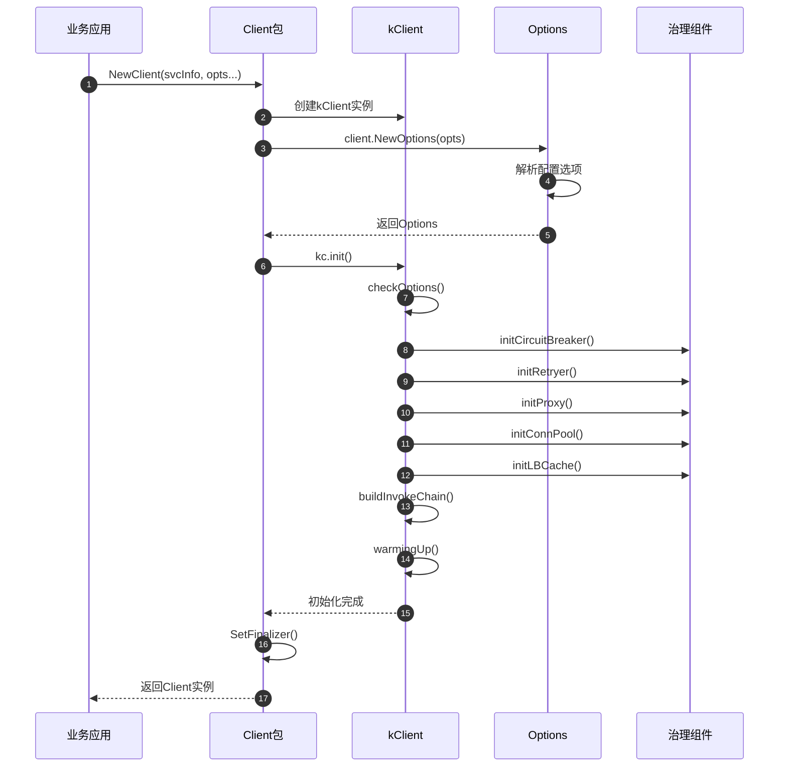
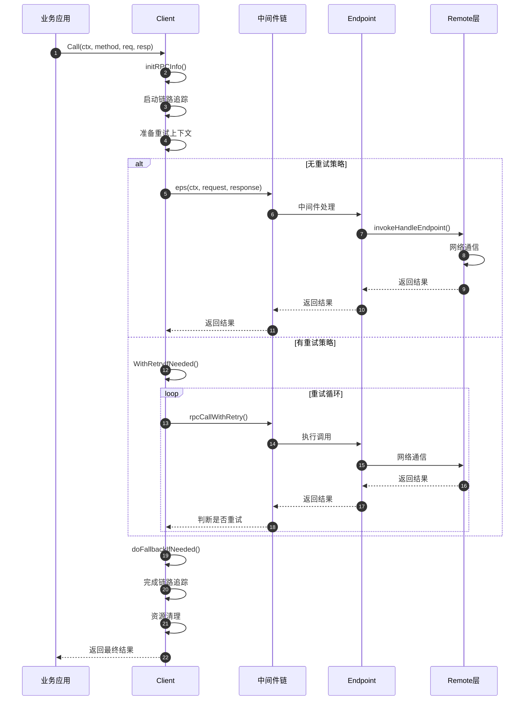

# Kitex-01-Client-API

## 基本接口定义

### Client核心接口

```go
// Client是Kitex客户端的核心接口抽象
// 专为生成代码设计，不应直接使用
type Client interface {
    Call(ctx context.Context, method string, request, response interface{}) error
}
```

| 参数 | 类型 | 必填 | 说明 |
|------|------|------|------|
| ctx | context.Context | 是 | 请求上下文，包含超时、元信息等 |
| method | string | 是 | RPC方法名，对应IDL中定义的方法 |
| request | interface{} | 是 | 请求参数对象 |
| response | interface{} | 是 | 响应结果对象 |

**返回值**：
- error：调用错误，包括网络错误、业务错误、超时错误等

### GenericClient泛化接口

```go
// GenericClient支持泛化调用，无需预生成代码
type Client interface {
    generic.Closer
    
    // GenericCall泛化调用
    GenericCall(ctx context.Context, method string, request interface{}, 
        callOptions ...callopt.Option) (response interface{}, err error)
        
    // 流式调用接口
    ClientStreaming(ctx context.Context, method string, 
        callOptions ...streamcall.Option) (ClientStreamingClient, error)
    ServerStreaming(ctx context.Context, method string, req interface{}, 
        callOptions ...streamcall.Option) (ServerStreamingClient, error)
    BidirectionalStreaming(ctx context.Context, method string, 
        callOptions ...streamcall.Option) (BidiStreamingClient, error)
}
```

## 客户端创建API

### NewClient - 创建类型化客户端

```go
func NewClient(svcInfo *serviceinfo.ServiceInfo, opts ...Option) (Client, error)
```

**功能说明**：
创建标准的Kitex客户端实例，需要预先通过代码生成工具生成ServiceInfo。

**请求参数**：
| 参数 | 类型 | 必填 | 说明 |
|------|------|------|------|
| svcInfo | *serviceinfo.ServiceInfo | 是 | 服务信息，包含方法定义、协议类型等 |
| opts | ...Option | 否 | 客户端配置选项 |

**响应结果**：
| 字段 | 类型 | 说明 |
|------|------|------|
| Client | Client | 客户端实例 |
| error | error | 创建错误 |

**核心实现代码**：
```go
func NewClient(svcInfo *serviceinfo.ServiceInfo, opts ...Option) (Client, error) {
    if svcInfo == nil {
        return nil, errors.New("NewClient: no service info")
    }
    
    // 1. 创建客户端实例
    kc := &kcFinalizerClient{kClient: &kClient{}}
    kc.svcInfo = svcInfo
    kc.opt = client.NewOptions(opts)
    
    // 2. 初始化客户端
    if err := kc.init(); err != nil {
        _ = kc.Close()
        return nil, err
    }
    
    // 3. 设置终结器自动清理资源
    runtime.SetFinalizer(kc, func(c *kcFinalizerClient) {
        _ = c.Close()
    })
    
    return kc, nil
}
```

### NewGenericClient - 创建泛化客户端

```go
func NewClient(destService string, g generic.Generic, opts ...client.Option) (Client, error)
```

**功能说明**：
创建泛化客户端，支持动态调用，无需预生成代码。

**请求参数**：
| 参数 | 类型 | 必填 | 说明 |
|------|------|------|------|
| destService | string | 是 | 目标服务名 |
| g | generic.Generic | 是 | 泛化调用处理器 |
| opts | ...client.Option | 否 | 客户端配置选项 |

**核心实现代码**：
```go
func NewClient(destService string, g generic.Generic, opts ...client.Option) (Client, error) {
    // 1. 生成泛化服务信息
    svcInfo := generic.ServiceInfoWithGeneric(g)
    
    // 2. 组装配置选项
    var options []client.Option
    options = append(options, client.WithGeneric(g))
    options = append(options, client.WithDestService(destService))
    options = append(options, client.WithTransportProtocol(transport.TTHeaderStreaming))
    options = append(options, opts...)
    
    // 3. 创建底层客户端
    kc, err := client.NewClient(svcInfo, options...)
    if err != nil {
        return nil, err
    }
    
    // 4. 封装为泛化客户端
    cli := &genericServiceClient{
        svcInfo: svcInfo,
        kClient: kc,
        sClient: kc.(client.Streaming),
        g:       g,
    }
    
    return cli, nil
}
```

## 配置选项API

### 基础配置选项

#### WithDestService - 设置目标服务

```go
func WithDestService(svr string) Option
```

**功能说明**：设置RPC调用的目标服务名。

**参数说明**：
- svr：目标服务名，用于服务发现和负载均衡

#### WithTransportProtocol - 设置传输协议

```go
func WithTransportProtocol(tp transport.Protocol) Option
```

**功能说明**：设置客户端使用的传输协议。

**支持的协议类型**：
- `transport.TTHeader`：TTHeader协议，支持元信息传递
- `transport.Framed`：Thrift Framed协议
- `transport.TTHeaderFramed`：TTHeader + Framed组合
- `transport.GRPC`：gRPC协议
- `transport.TTHeaderStreaming`：流式TTHeader协议

**核心实现代码**：
```go
func WithTransportProtocol(tp transport.Protocol) Option {
    return Option{F: func(o *client.Options, di *utils.Slice) {
        tpName := tp.String()
        if tpName == transport.Unknown {
            panic(fmt.Errorf("WithTransportProtocol: invalid '%v'", tp))
        }
        rpcinfo.AsMutableRPCConfig(o.Configs).SetTransportProtocol(tp)
    }}
}
```

### 连接管理配置

#### WithHostPorts - 设置目标地址

```go
func WithHostPorts(hostports ...string) Option
```

**功能说明**：设置直连目标地址，不使用服务发现。

**参数格式**：
- "host:port" 格式的地址列表
- 支持IPv4、IPv6和域名

#### WithShortConnection - 短连接模式

```go
func WithShortConnection() Option
```

**功能说明**：强制每次调用后关闭连接，适用于低频调用场景。

#### WithLongConnection - 长连接模式

```go
func WithLongConnection(cfg connpool.IdleConfig) Option
```

**功能说明**：启用长连接池，提高调用性能。

**配置参数**：
```go
type IdleConfig struct {
    MaxIdlePerAddress int           // 每个地址最大空闲连接数
    MaxIdleGlobal     int           // 全局最大空闲连接数  
    MaxIdleTimeout    time.Duration // 空闲连接超时时间
    MinIdlePerAddress int           // 每个地址最小空闲连接数
}
```

#### WithMuxConnection - 多路复用连接

```go
func WithMuxConnection(connNum int) Option
```

**功能说明**：启用连接多路复用，单连接支持并发请求。

**核心实现代码**：
```go
func WithMuxConnection(connNum int) Option {
    return Option{F: func(o *client.Options, di *utils.Slice) {
        // 1. 设置多路复用连接池
        o.RemoteOpt.ConnPool = netpollmux.NewMuxConnPool(connNum)
        
        // 2. 设置传输处理器工厂
        WithTransHandlerFactory(netpollmux.NewCliTransHandlerFactory()).F(o, di)
        
        // 3. 强制使用TTHeader协议
        rpcinfo.AsMutableRPCConfig(o.Configs).SetTransportProtocol(transport.TTHeader)
    }}
}
```

### 超时配置

#### WithRPCTimeout - RPC超时时间

```go
func WithRPCTimeout(d time.Duration) Option
```

**功能说明**：设置RPC调用的总超时时间。

**注意事项**：
- 仅对一元调用有效
- 建议使用WithUnaryOptions(WithUnaryRPCTimeout(d))替代

#### WithConnectTimeout - 连接超时时间

```go
func WithConnectTimeout(d time.Duration) Option
```

**功能说明**：设置建立连接的超时时间。

### 服务治理配置

#### WithResolver - 服务发现

```go
func WithResolver(r discovery.Resolver) Option
```

**功能说明**：设置服务发现解析器，用于获取服务实例列表。

#### WithLoadBalancer - 负载均衡

```go
func WithLoadBalancer(lb loadbalance.Loadbalancer, opts ...*lbcache.Options) Option
```

**功能说明**：设置负载均衡策略。

**支持的负载均衡算法**：
- 轮询（Round Robin）
- 随机（Random）
- 一致性哈希（Consistent Hash）
- 加权轮询（Weighted Round Robin）
- 加权随机（Weighted Random）

#### WithCircuitBreaker - 熔断器

```go
func WithCircuitBreaker(s *circuitbreak.CBSuite) Option
```

**功能说明**：设置熔断器，防止故障传播。

#### WithRetryPolicy - 重试策略

```go
func WithFailureRetry(p *retry.FailurePolicy) Option
func WithBackupRequest(p *retry.BackupPolicy) Option
```

**功能说明**：设置失败重试和备份请求策略。

### 中间件配置

#### WithMiddleware - 添加中间件

```go
func WithMiddleware(mw endpoint.Middleware) Option
```

**功能说明**：添加请求处理中间件。

**中间件签名**：
```go
type Middleware func(endpoint.Endpoint) endpoint.Endpoint
type Endpoint func(ctx context.Context, req, resp interface{}) error
```

**核心实现代码**：
```go
func WithMiddleware(mw endpoint.Middleware) Option {
    mwb := func(ctx context.Context) endpoint.Middleware {
        return mw
    }
    return Option{F: func(o *client.Options, di *utils.Slice) {
        o.MWBs = append(o.MWBs, mwb)
    }}
}
```

#### WithInstanceMW - 实例级中间件

```go
func WithInstanceMW(mw endpoint.Middleware) Option
```

**功能说明**：添加在服务发现和负载均衡之后执行的中间件。

### 链路追踪配置

#### WithTracer - 添加追踪器

```go
func WithTracer(c stats.Tracer) Option
```

**功能说明**：添加分布式链路追踪器。

#### WithStatsLevel - 统计级别

```go
func WithStatsLevel(level stats.Level) Option
```

**功能说明**：设置统计信息收集级别。

**统计级别**：
- `stats.LevelDisabled`：禁用统计
- `stats.LevelBase`：基础统计
- `stats.LevelDetailed`：详细统计

## 调用选项API

### CallOptions - 调用时选项

```go
type CallOptions struct {
    Tags    map[string]string    // 调用标签
    Timeout time.Duration        // 调用超时
    Retry   *retry.Policy        // 重试策略
    // 其他选项...
}
```

### 常用调用选项

#### WithCallTimeout - 调用超时

```go
func WithCallTimeout(d time.Duration) callopt.Option
```

#### WithCallTag - 调用标签

```go
func WithCallTag(key, val string) callopt.Option
```

#### WithCallRetry - 调用重试

```go
func WithCallRetry(p retry.Policy) callopt.Option
```

## 时序图 - 客户端创建流程



## 时序图 - RPC调用流程



## 异常处理与性能要点

### 异常处理策略

**1. 配置验证错误**
- 客户端创建时进行配置验证
- 无效配置直接panic，快速失败
- 必要参数缺失返回明确错误信息

**2. 网络通信错误**
- 连接超时：触发重试或熔断
- 传输错误：根据错误类型决定重试
- 协议错误：记录日志并返回框架错误

**3. 业务逻辑错误**
- 透传业务异常给调用方
- 区分框架错误和业务错误
- 支持自定义错误处理逻辑

### 性能优化要点

**1. 连接管理优化**
- 连接池复用减少握手开销
- 多路复用提高连接利用率
- 空闲连接清理避免资源浪费

**2. 内存管理优化**
- RPCInfo对象池减少分配
- Message对象及时回收
- 避免不必要的内存拷贝

**3. 调用链优化**
- 中间件链预构建
- 端点函数可重复调用
- 减少反射和动态分配

**4. 并发安全优化**
- 无锁数据结构
- 原子操作替代锁
- 上下文隔离避免竞争

这个API文档详细介绍了Client模块的所有公开接口、配置选项和使用方式，为开发者提供了完整的API参考。
