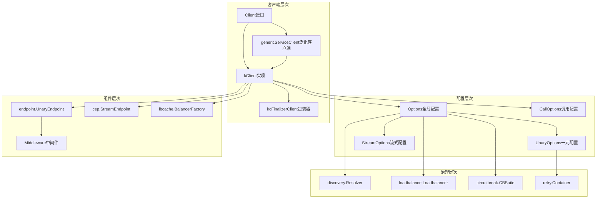

# Kitex-01-Client-数据结构

## 核心数据结构UML图

```mermaid
classDiagram
    class Client {
        <<interface>>
        +Call(ctx context.Context, method string, request, response interface{}) error
    }
    
    class kClient {
        -svcInfo *serviceinfo.ServiceInfo
        -eps endpoint.UnaryEndpoint
        -sEps cep.StreamEndpoint
        -opt *client.Options
        -lbf *lbcache.BalancerFactory
        -inited bool
        -closed bool
        +Call(ctx context.Context, method string, request, response interface{}) error
        +Close() error
        -init() error
        -buildInvokeChain(mw middleware) error
        -invokeHandleEndpoint() endpoint.Endpoint
    }
    
    class kcFinalizerClient {
        -kClient *kClient
        +Call(ctx context.Context, method string, request, response interface{}) error
    }
    
    class Options {
        +Cli *rpcinfo.EndpointBasicInfo
        +Svr *rpcinfo.EndpointBasicInfo
        +Configs rpcinfo.RPCConfig
        +Locks *ConfigLocks
        +UnaryOptions UnaryOptions
        +StreamOptions StreamOptions
        +MetaHandlers []remote.MetaHandler
        +RemoteOpt *remote.ClientOption
        +Proxy proxy.ForwardProxy
        +Resolver discovery.Resolver
        +Balancer loadbalance.Loadbalancer
        +CBSuite *circuitbreak.CBSuite
        +TracerCtl *rpcinfo.TraceController
        +Apply(opts []Option)
    }
    
    class CallOptions {
        -configs rpcinfo.MutableRPCConfig
        -svr remoteinfo.RemoteInfo
        -locks *ConfigLocks
        -httpResolver http.Resolver
        +RetryPolicy retry.Policy
        +Fallback *fallback.Policy
        +CompressorName string
        +StreamOptions StreamOptions
        +Recycle()
    }
    
    class Option {
        +F func(o *Options, di *utils.Slice)
    }
    
    class UnaryOptions {
        -opts *Options
        +UnaryMiddlewares []endpoint.UnaryMiddleware
        +UnaryMiddlewareBuilders []endpoint.UnaryMiddlewareBuilder
        +RetryMethodPolicies map[string]retry.Policy
        +RetryContainer *retry.Container
        +Fallback *fallback.Policy
        +InitMiddlewares(ctx context.Context)
        +SetUnaryRPCTimeout(d time.Duration)
    }
    
    class genericServiceClient {
        -svcInfo *serviceinfo.ServiceInfo
        -kClient client.Client
        -sClient client.Streaming
        -g generic.Generic
        -isBinaryGeneric bool
        -getMethodFunc generic.GetMethodNameByRequestFunc
        +GenericCall(ctx context.Context, method string, request interface{}, callOptions ...callopt.Option) (interface{}, error)
        +Close() error
    }
    
    Client <|-- kClient
    Client <|-- genericServiceClient
    kClient <|-- kcFinalizerClient
    kClient --> Options
    kClient --> CallOptions
    Options --> UnaryOptions
    Options --> StreamOptions
    Options --> Option
    genericServiceClient --> kClient
```

## 主要数据结构详解

### 1. Client接口

```go
// Client是Kitex客户端的核心接口抽象
// 专为生成代码设计，不应直接使用
type Client interface {
    Call(ctx context.Context, method string, request, response interface{}) error
}
```

**字段说明**：
- 这是一个接口定义，所有客户端实现都必须实现Call方法
- 设计为代码生成工具使用，业务代码不直接调用
- 支持同步RPC调用，异步调用通过其他接口实现

### 2. kClient核心实现

```go
type kClient struct {
    svcInfo *serviceinfo.ServiceInfo  // 服务信息，包含方法定义和协议类型
    eps     endpoint.UnaryEndpoint    // 一元调用端点
    sEps    cep.StreamEndpoint        // 流式调用端点
    
    opt *client.Options               // 客户端配置选项
    lbf *lbcache.BalancerFactory     // 负载均衡器工厂
    
    inited bool                      // 初始化状态标记
    closed bool                      // 关闭状态标记
}
```

**字段映射与说明**：

| 字段 | 类型 | 必填 | 默认值 | 约束 | 说明 |
|------|------|------|--------|------|------|
| svcInfo | *serviceinfo.ServiceInfo | 是 | nil | 非空 | 服务元信息，包含IDL定义的方法签名 |
| eps | endpoint.UnaryEndpoint | 否 | nil | - | 一元调用处理链，包含中间件和端点处理器 |
| sEps | cep.StreamEndpoint | 否 | nil | - | 流式调用处理链 |
| opt | *client.Options | 是 | nil | 非空 | 客户端全局配置选项 |
| lbf | *lbcache.BalancerFactory | 否 | nil | - | 负载均衡器工厂，用于创建负载均衡器实例 |
| inited | bool | - | false | - | 标记客户端是否已完成初始化 |
| closed | bool | - | false | - | 标记客户端是否已关闭 |

**生命周期管理**：
- **创建阶段**：通过NewClient函数创建，设置ServiceInfo和Options
- **初始化阶段**：调用init()方法初始化各组件，构建调用链
- **运行阶段**：处理RPC调用，维护连接和状态
- **销毁阶段**：调用Close()方法清理资源，设置closed标记

### 3. kcFinalizerClient包装器

```go
type kcFinalizerClient struct {
    *kClient
}
```

**设计目的**：
- 解决kClient的循环引用问题，确保垃圾回收器能正确回收
- 在invokeHandleEndpoint构建端点时会产生循环引用
- 通过包装器模式，在包装器上设置finalizer实现自动清理

**核心方法**：
```go
func (kf *kcFinalizerClient) Call(ctx context.Context, method string, request, response interface{}) error {
    defer runtime.KeepAlive(kf)  // 确保对象在调用期间不被回收
    return kf.kClient.Call(ctx, method, request, response)
}
```

### 4. Options配置结构

```go
type Options struct {
    // 基础信息
    Cli     *rpcinfo.EndpointBasicInfo  // 客户端端点信息
    Svr     *rpcinfo.EndpointBasicInfo  // 服务端端点信息
    Configs rpcinfo.RPCConfig           // RPC配置信息
    Locks   *ConfigLocks                // 配置锁定状态
    Once    *configutil.OptionOnce      // 一次性配置检查
    
    // 调用选项
    UnaryOptions  UnaryOptions          // 一元调用选项
    StreamOptions StreamOptions         // 流式调用选项
    
    // 扩展组件
    MetaHandlers []remote.MetaHandler   // 元信息处理器
    RemoteOpt    *remote.ClientOption   // 远程调用选项
    Proxy        proxy.ForwardProxy     // 代理配置
    
    // 服务治理
    Resolver         discovery.Resolver      // 服务发现解析器
    HTTPResolver     http.Resolver           // HTTP解析器
    Balancer         loadbalance.Loadbalancer // 负载均衡器
    BalancerCacheOpt *lbcache.Options        // 负载均衡缓存选项
    PoolCfg          *connpool.IdleConfig    // 连接池配置
    CBSuite          *circuitbreak.CBSuite   // 熔断器套件
    Timeouts         rpcinfo.TimeoutProvider // 超时提供器
    
    // 安全控制
    ACLRules []acl.RejectFunc           // 访问控制规则
    
    // 中间件
    MWBs  []endpoint.MiddlewareBuilder  // 中间件构建器
    IMWBs []endpoint.MiddlewareBuilder  // 实例中间件构建器
    
    // 事件系统
    Bus          event.Bus              // 事件总线
    Events       event.Queue            // 事件队列
    ExtraTimeout time.Duration          // 额外超时时间
    
    // 调试与诊断
    DebugInfo    utils.Slice            // 调试信息
    DebugService diagnosis.Service      // 诊断服务
    
    // 可观测性
    TracerCtl  *rpcinfo.TraceController // 链路追踪控制器
    StatsLevel *stats.Level             // 统计级别
    
    // 生命周期
    CloseCallbacks []func() error       // 关闭回调函数
    WarmUpOption   *warmup.ClientOption // 预热选项
    
    // 协议特定选项
    GRPCConnPoolSize         uint32                    // gRPC连接池大小
    GRPCConnectOpts          *grpc.ConnectOptions      // gRPC连接选项
    TTHeaderStreamingOptions TTHeaderStreamingOptions  // TTHeader流式选项
    
    // XDS支持
    XDSEnabled          bool                 // XDS功能开关
    XDSRouterMiddleware endpoint.Middleware  // XDS路由中间件
    
    // 上下文备份
    CtxBackupHandler backup.BackupHandler   // 上下文备份处理器
}
```

**关键字段说明**：

1. **基础配置**：
   - `Cli/Svr`：客户端和服务端的基础信息，包含服务名、地址等
   - `Configs`：RPC配置，包含超时、协议等设置
   - `Locks`：配置锁定机制，防止运行时修改关键配置

2. **服务治理**：
   - `Resolver`：服务发现组件，获取服务实例列表
   - `Balancer`：负载均衡器，选择目标服务实例
   - `CBSuite`：熔断器套件，提供故障隔离能力
   - `Timeouts`：超时管理，支持动态超时配置

3. **扩展机制**：
   - `MWBs`：中间件构建器，支持请求拦截和处理
   - `MetaHandlers`：元信息处理器，处理协议头信息
   - `ACLRules`：访问控制规则，提供安全过滤

### 5. CallOptions调用选项

```go
type CallOptions struct {
    configs      rpcinfo.MutableRPCConfig  // 可变RPC配置
    svr          remoteinfo.RemoteInfo     // 远程服务信息
    locks        *ConfigLocks              // 配置锁
    httpResolver http.Resolver             // HTTP解析器
    
    // 导出字段供客户端使用
    RetryPolicy    retry.Policy            // 重试策略
    Fallback       *fallback.Policy        // 降级策略
    CompressorName string                  // 压缩器名称
    StreamOptions  StreamOptions           // 流式选项
}
```

**字段映射与版本演进**：

| 字段 | 类型 | 版本 | 约束 | 说明 |
|------|------|------|------|------|
| configs | rpcinfo.MutableRPCConfig | v1.0+ | 非空 | 单次调用的RPC配置，可覆盖全局配置 |
| svr | remoteinfo.RemoteInfo | v1.0+ | - | 目标服务的远程信息 |
| RetryPolicy | retry.Policy | v1.2+ | - | 调用级别的重试策略，优先级高于全局策略 |
| Fallback | *fallback.Policy | v1.3+ | - | 降级策略，调用失败时的备选方案 |
| CompressorName | string | v1.4+ | - | 数据压缩器名称，如gzip、snappy等 |
| StreamOptions | StreamOptions | v1.5+ | - | 流式调用相关选项 |

**对象池管理**：
```go
var callOptionsPool = sync.Pool{
    New: newOptions,
}

// 回收CallOptions对象到池中
func (co *CallOptions) Recycle() {
    if co == nil {
        return
    }
    // 清零所有字段
    co.configs = nil
    co.svr = nil
    co.RetryPolicy = retry.Policy{}
    co.Fallback = nil
    co.locks.Zero()
    callOptionsPool.Put(co)
}
```

### 6. UnaryOptions一元调用选项

```go
type UnaryOptions struct {
    opts *Options  // 父级Options引用
    
    // 中间件配置
    UnaryMiddlewares        []endpoint.UnaryMiddleware        // 一元中间件列表
    UnaryMiddlewareBuilders []endpoint.UnaryMiddlewareBuilder // 中间件构建器
    
    // 重试配置
    RetryMethodPolicies map[string]retry.Policy // 按方法的重试策略
    RetryContainer      *retry.Container        // 重试容器
    RetryWithResult     *retry.ShouldResultRetry // 结果重试判断器
    
    // 降级配置
    Fallback *fallback.Policy // 降级策略
}
```

**核心方法实现**：
```go
// 初始化中间件，将构建器转换为实际中间件
func (o *UnaryOptions) InitMiddlewares(ctx context.Context) {
    if len(o.UnaryMiddlewareBuilders) > 0 {
        unaryMiddlewares := make([]endpoint.UnaryMiddleware, 0, len(o.UnaryMiddlewareBuilders))
        for _, mwb := range o.UnaryMiddlewareBuilders {
            unaryMiddlewares = append(unaryMiddlewares, mwb(ctx))
        }
        o.UnaryMiddlewares = append(o.UnaryMiddlewares, unaryMiddlewares...)
    }
}

// 设置一元调用的RPC超时时间
func (o *UnaryOptions) SetUnaryRPCTimeout(d time.Duration) {
    rpcinfo.AsMutableRPCConfig(o.opts.Configs).SetRPCTimeout(d)
    o.opts.Locks.Bits |= rpcinfo.BitRPCTimeout
}
```

### 7. genericServiceClient泛化客户端

```go
type genericServiceClient struct {
    svcInfo *serviceinfo.ServiceInfo  // 服务信息
    kClient client.Client             // 底层客户端
    sClient client.Streaming          // 流式客户端
    g       generic.Generic           // 泛化处理器
    
    // 泛化调用特殊标记
    isBinaryGeneric bool                                    // 是否为二进制泛化
    getMethodFunc   generic.GetMethodNameByRequestFunc     // 从请求获取方法名的函数
}
```

**字段说明**：
- `svcInfo`：通过generic.ServiceInfoWithGeneric()生成的服务信息
- `kClient`：复用标准客户端的底层实现
- `g`：泛化处理器，负责请求/响应的序列化和反序列化
- `isBinaryGeneric`：标记是否为二进制泛化调用模式
- `getMethodFunc`：HTTP泛化中从请求体提取方法名的函数

## 数据结构关系图



## 内存管理与性能优化

### 1. 对象池化设计

**CallOptions对象池**：
```go
var callOptionsPool = sync.Pool{
    New: newOptions,
}
```

- 减少CallOptions对象的频繁分配和GC压力
- 每次调用结束后通过Recycle()方法回收对象
- 支持高并发场景下的内存复用

### 2. 引用管理策略

**循环引用解决**：
- kClient在构建endpoint时会产生循环引用
- 通过kcFinalizerClient包装器解决引用问题
- 使用runtime.SetFinalizer确保资源正确释放

**资源生命周期**：
- Options在客户端创建时分配，生命周期与客户端一致
- CallOptions按调用分配，调用结束后立即回收
- ServiceInfo全局共享，支持多个客户端实例复用

### 3. 并发安全设计

**配置锁机制**：
```go
type ConfigLocks struct {
    Bits rpcinfo.Lockable  // 位标记锁定的配置项
    Tags map[string]struct{} // 锁定的标签键
}
```

- 防止运行时修改关键配置导致的并发问题
- 支持细粒度的配置项锁定
- 通过位操作提高锁检查性能

**无锁数据结构**：
- 中间件列表在初始化后不再修改，支持并发读取
- 使用原子操作管理客户端状态（inited、closed）
- 事件系统采用无锁队列实现高性能事件传递

这个数据结构文档详细介绍了Client模块的核心数据结构、字段含义、版本演进和性能优化策略，为开发者理解和扩展Client功能提供了完整的参考。
