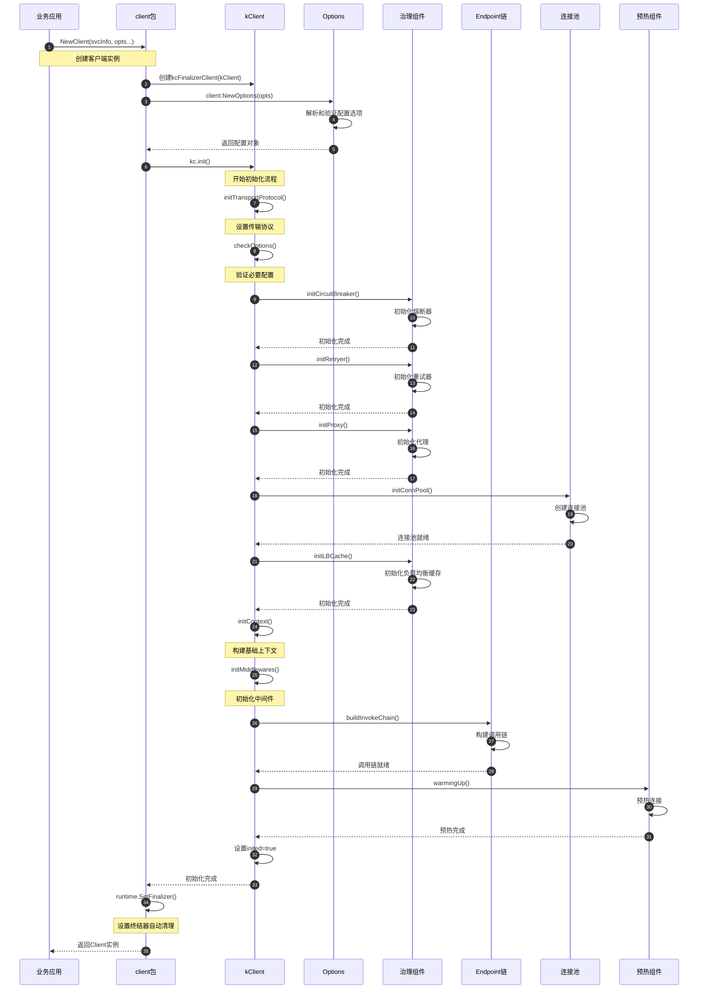
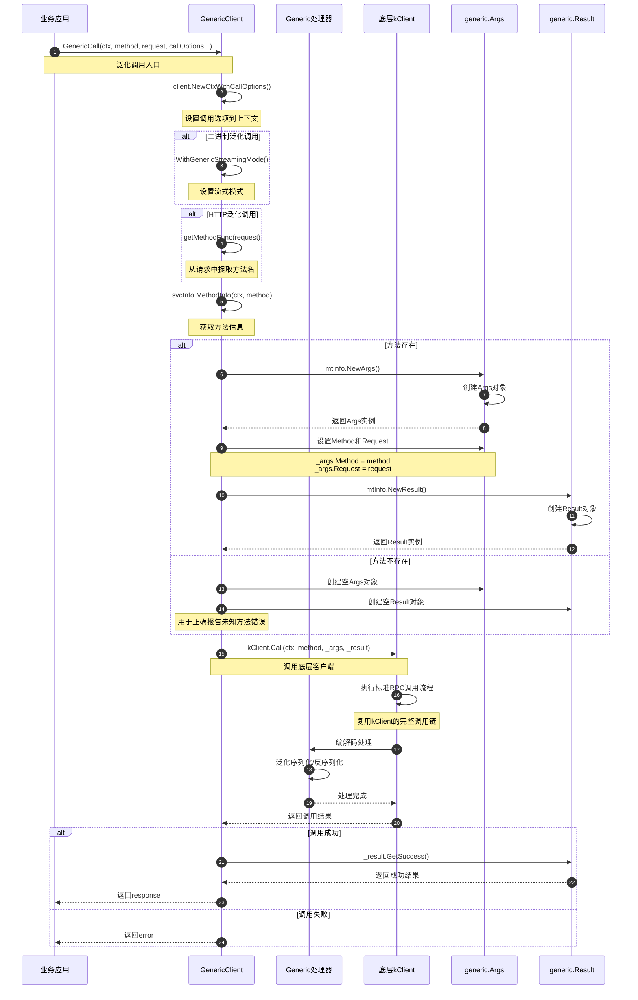
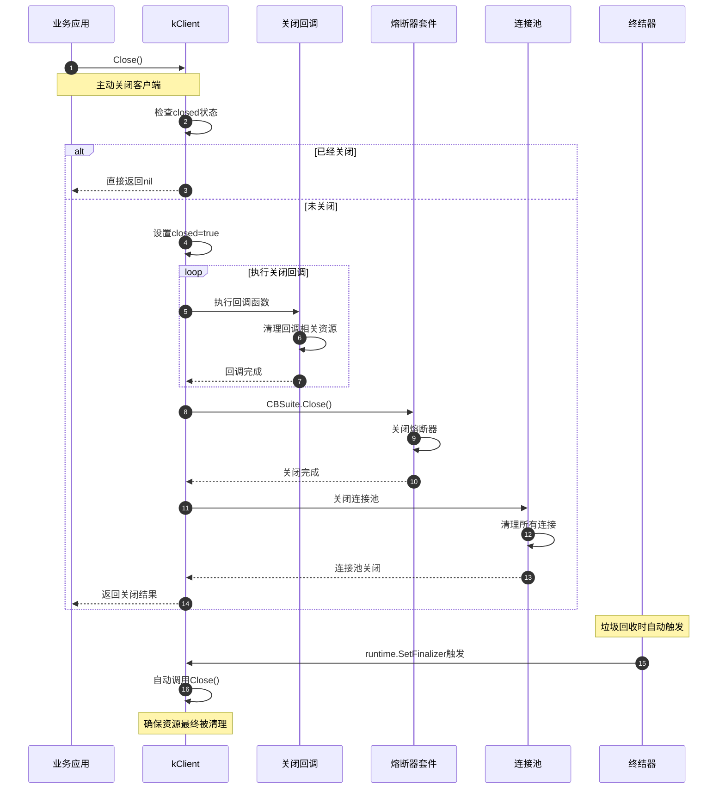

# Kitex-01-Client-时序图

## 1. 客户端创建与初始化时序图



### 初始化时序说明

**1. 配置解析阶段（步骤1-3）**
- 业务应用调用NewClient创建客户端
- 解析传入的配置选项，构建Options对象
- 创建kClient实例并设置基础属性

**2. 组件初始化阶段（步骤4-11）**
- 按依赖顺序初始化各个治理组件
- 熔断器、重试器、代理等组件独立初始化
- 连接池创建并准备接受连接

**3. 调用链构建阶段（步骤12-15）**
- 初始化中间件和上下文
- 构建端点调用链，包含所有中间件
- 设置流式调用端点

**4. 预热与完成阶段（步骤16-19）**
- 执行连接预热，建立初始连接
- 设置初始化完成标记
- 配置终结器确保资源清理

## 2. RPC调用主流程时序图

```mermaid
sequenceDiagram
    autonumber
    participant APP as 业务应用
    participant CLIENT as kClient
    participant CALLOPT as CallOptions
    participant TRACER as 链路追踪
    participant RETRY as 重试容器
    participant ENDPOINT as Endpoint链
    participant MW as 中间件
    participant HANDLER as 端点处理器
    participant REMOTE as Remote层
    participant FALLBACK as 降级处理
    
    APP->>CLIENT: Call(ctx, method, req, resp)
    Note over APP,CLIENT: 发起RPC调用
    
    CLIENT->>CLIENT: backup.RecoverCtxOnDemands()
    Note over CLIENT: 恢复上下文备份
    
    CLIENT->>CLIENT: validateForCall()
    Note over CLIENT: 验证调用状态
    
    CLIENT->>CALLOPT: initRPCInfo()
    CALLOPT->>CALLOPT: 构建RPCInfo和CallOptions
    CALLOPT-->>CLIENT: 返回ctx, ri, callOpts
    
    CLIENT->>TRACER: TracerCtl.DoStart()
    TRACER->>TRACER: 启动链路追踪
    TRACER-->>CLIENT: 追踪上下文
    
    CLIENT->>CLIENT: retry.PrepareRetryContext()
    Note over CLIENT: 准备重试上下文
    
    alt 无重试策略
        CLIENT->>ENDPOINT: eps(ctx, request, response)
        ENDPOINT->>MW: 执行中间件链
        MW->>HANDLER: 调用端点处理器
        HANDLER->>REMOTE: invokeHandleEndpoint()
        REMOTE->>REMOTE: 网络通信处理
        REMOTE-->>HANDLER: 返回结果
        HANDLER-->>MW: 返回结果
        MW-->>ENDPOINT: 返回结果
        ENDPOINT-->>CLIENT: 返回结果
    else 有重试策略
        CLIENT->>RETRY: WithRetryIfNeeded()
        loop 重试循环
            RETRY->>CLIENT: rpcCallWithRetry()
            CLIENT->>ENDPOINT: eps(ctx, request, response)
            ENDPOINT->>MW: 执行中间件链
            MW->>HANDLER: 调用端点处理器
            HANDLER->>REMOTE: invokeHandleEndpoint()
            REMOTE->>REMOTE: 网络通信处理
            REMOTE-->>HANDLER: 返回结果或错误
            HANDLER-->>MW: 返回结果或错误
            MW-->>ENDPOINT: 返回结果或错误
            ENDPOINT-->>CLIENT: 返回结果或错误
            CLIENT->>RETRY: 判断是否需要重试
            alt 需要重试
                RETRY->>RETRY: 准备下次重试
            else 不需要重试
                break 退出重试循环
            end
        end
        RETRY-->>CLIENT: 返回最终结果
    end
    
    CLIENT->>FALLBACK: doFallbackIfNeeded()
    alt 需要降级
        FALLBACK->>FALLBACK: 执行降级逻辑
        FALLBACK-->>CLIENT: 返回降级结果
    else 不需要降级
        FALLBACK-->>CLIENT: 返回原始结果
    end
    
    CLIENT->>TRACER: TracerCtl.DoFinish()
    TRACER->>TRACER: 完成链路追踪
    TRACER-->>CLIENT: 追踪完成
    
    CLIENT->>CALLOPT: callOpts.Recycle()
    CALLOPT->>CALLOPT: 回收对象到池
    CALLOPT-->>CLIENT: 回收完成
    
    CLIENT-->>APP: 返回最终结果
```

### 调用流程说明

**1. 请求准备阶段（步骤1-6）**
- 恢复上下文备份信息，确保元信息传递
- 验证客户端状态，确保已初始化且未关闭
- 构建RPCInfo和CallOptions，包含调用元信息
- 启动分布式链路追踪，记录调用开始

**2. 重试判断与执行阶段（步骤7-15）**
- 根据配置决定是否启用重试机制
- 无重试：直接执行端点调用链
- 有重试：通过重试容器管理重试逻辑
- 重试循环中根据错误类型决定是否继续

**3. 降级处理阶段（步骤16-17）**
- 根据错误类型和配置决定是否执行降级
- 降级逻辑可以返回默认值或调用备用服务
- 确保服务在异常情况下的可用性

**4. 资源清理阶段（步骤18-20）**
- 完成链路追踪，记录调用结果和耗时
- 回收CallOptions对象到对象池
- 返回最终结果给业务应用

## 3. 端点处理器调用时序图

```mermaid
sequenceDiagram
    autonumber
    participant EP as Endpoint
    participant HANDLER as invokeHandleEndpoint
    parameter TRANS as TransHandler
    participant CLI as RemoteClient
    participant CODEC as 编解码器
    participant NETPOLL as Netpoll网络层
    participant SERVER as 远程服务器
    
    EP->>HANDLER: invokeHandleEndpoint()
    Note over EP,HANDLER: 端点处理器调用
    
    HANDLER->>TRANS: newCliTransHandler()
    TRANS->>TRANS: 创建传输处理管道
    TRANS-->>HANDLER: 返回传输管道
    
    HANDLER->>CLI: remotecli.NewClient()
    CLI->>CLI: 创建远程客户端实例
    CLI-->>HANDLER: 返回客户端
    
    HANDLER->>HANDLER: 构建发送消息
    Note over HANDLER: 根据调用类型创建Message
    
    alt OneWay调用
        HANDLER->>HANDLER: remote.NewMessage(req, ri, Oneway, Client)
    else 普通调用
        HANDLER->>HANDLER: remote.NewMessage(req, ri, Call, Client)
    end
    
    HANDLER->>CLI: cli.Send(ctx, ri, sendMsg)
    CLI->>CODEC: 编码请求消息
    CODEC->>CODEC: 序列化请求对象
    CODEC-->>CLI: 返回编码数据
    
    CLI->>NETPOLL: 发送网络数据包
    NETPOLL->>NETPOLL: 网络传输处理
    NETPOLL->>SERVER: 数据包到达服务器
    
    alt OneWay调用
        CLI->>CLI: cli.Recv(ctx, ri, nil)
        Note over CLI: 单向调用不等待响应
        CLI-->>HANDLER: 立即返回
    else 普通调用
        SERVER->>NETPOLL: 服务器返回响应
        NETPOLL->>NETPOLL: 接收网络数据包
        NETPOLL-->>CLI: 响应数据到达
        
        CLI->>HANDLER: 构建接收消息
        HANDLER->>HANDLER: remote.NewMessage(resp, ri, Reply, Client)
        
        CLI->>CLI: cli.Recv(ctx, ri, recvMsg)
        CLI->>CODEC: 解码响应消息
        CODEC->>CODEC: 反序列化响应对象
        CODEC-->>CLI: 返回解码对象
        CLI-->>HANDLER: 返回响应结果
    end
    
    HANDLER->>HANDLER: 资源清理
    Note over HANDLER: 回收Message和Client
    
    HANDLER-->>EP: 返回调用结果
```

### 端点处理说明

**1. 传输层准备（步骤1-3）**
- 创建传输处理管道，配置协议和编解码器
- 创建远程客户端实例，管理连接和通信
- 根据RPCInfo选择合适的传输策略

**2. 消息构建与发送（步骤4-8）**
- 根据调用类型（OneWay/Call）构建不同的消息
- 通过编解码器序列化请求对象
- 使用Netpoll网络层发送数据包

**3. 响应处理（步骤9-15）**
- OneWay调用：直接返回，不等待响应
- 普通调用：等待服务器响应并解码
- 处理网络传输和协议解析

**4. 资源管理（步骤16-17）**
- 及时回收Message对象避免内存泄漏
- 回收RemoteClient连接到连接池
- 确保异常情况下的资源清理

## 4. 泛化调用时序图



### 泛化调用说明

**1. 调用准备阶段（步骤1-4）**
- 设置调用选项到上下文中
- 二进制泛化需要设置流式模式标记
- HTTP泛化从请求体中动态提取方法名
- 支持多种泛化调用模式

**2. 参数构建阶段（步骤5-10）**
- 根据方法信息创建Args和Result对象
- Args包装原始请求，Result用于接收响应
- 处理未知方法的情况，确保错误正确报告
- 泛化对象承载实际的业务数据

**3. 底层调用阶段（步骤11-14）**
- 复用kClient的完整调用链和治理能力
- 泛化处理器负责动态的序列化和反序列化
- 支持所有标准RPC功能（重试、熔断、追踪等）
- 保持与类型化调用相同的性能特征

**4. 结果处理阶段（步骤15-17）**
- 从Result对象中提取成功结果
- 错误直接透传给业务应用
- 支持复杂的响应结构和错误处理

## 5. 客户端关闭时序图



### 关闭流程说明

**1. 状态检查（步骤1-3）**
- 检查客户端是否已经关闭
- 设置关闭标记防止重复关闭
- 确保关闭操作的幂等性

**2. 回调执行（步骤4-6）**
- 按顺序执行所有注册的关闭回调
- 回调函数负责清理各自管理的资源
- 收集所有回调的错误信息

**3. 组件关闭（步骤7-10）**
- 关闭熔断器套件，停止状态统计
- 关闭连接池，释放所有网络连接
- 清理其他需要显式释放的资源

**4. 终结器保障（步骤11-13）**
- 垃圾回收时自动触发终结器
- 确保即使忘记调用Close也能清理资源
- 提供最后的资源泄漏防护

## 时序图总结

这些时序图展示了Kitex Client模块的完整生命周期：

1. **创建初始化**：展示了客户端从创建到可用的完整过程
2. **RPC调用**：展示了标准RPC调用的完整流程，包括重试和降级
3. **端点处理**：展示了底层网络通信的详细过程
4. **泛化调用**：展示了无代码生成的动态调用机制
5. **资源清理**：展示了客户端关闭和资源回收过程

每个时序图都包含了详细的步骤说明和关键节点分析，帮助开发者理解Client模块的内部工作机制和扩展点。
