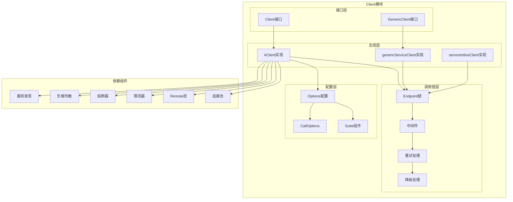

# Kitex-01-Client-概览

## 模块职责与边界

### 核心职责
Client模块是Kitex框架的客户端核心，负责发起RPC调用并处理响应。主要职责包括：
- **RPC调用管理**：提供统一的调用接口，支持同步和异步调用
- **连接管理**：维护与服务端的连接池，支持连接复用和负载均衡
- **请求路由**：根据服务发现结果选择合适的服务实例
- **协议处理**：支持多种RPC协议（Thrift、gRPC、Kitex Protobuf）
- **治理功能**：集成重试、熔断、限流、超时等服务治理能力

### 输入输出
- **输入**：业务请求对象、方法名、调用选项
- **输出**：业务响应对象或错误信息
- **上游依赖**：业务应用层
- **下游依赖**：Remote传输层、服务发现、负载均衡等治理组件

### 生命周期
1. **初始化阶段**：创建客户端实例，初始化各种组件
2. **运行阶段**：处理RPC调用请求，维护连接状态
3. **销毁阶段**：优雅关闭连接，清理资源

## 模块架构图



### 架构说明

**1. 分层设计**
- **接口层**：定义Client和GenericClient的核心接口，提供类型安全的调用方式
- **实现层**：提供不同场景下的客户端实现，支持普通调用和泛化调用
- **调用链层**：构建中间件调用链，支持重试、降级等处理逻辑
- **配置层**：管理客户端配置选项和调用时选项

**2. 组件交互**
- Client接口通过kClient实现与底层组件交互
- GenericClient支持无需代码生成的泛化调用
- serviceInlineClient用于内联服务调用优化
- 所有实现都通过Endpoint链处理请求

**3. 扩展点**
- 中间件机制支持自定义拦截器
- Suite模式支持组件化配置
- 多种负载均衡和服务发现策略

## 核心算法与流程

### 客户端初始化流程

```go
func (kc *kClient) init() (err error) {
    // 1. 初始化传输协议
    initTransportProtocol(kc.svcInfo, kc.opt.Configs)
    
    // 2. 检查配置选项
    if err = kc.checkOptions(); err != nil {
        return err
    }
    
    // 3. 初始化熔断器
    if err = kc.initCircuitBreaker(); err != nil {
        return err
    }
    
    // 4. 初始化重试器
    if err = kc.initRetryer(); err != nil {
        return err
    }
    
    // 5. 初始化代理
    if err = kc.initProxy(); err != nil {
        return err
    }
    
    // 6. 初始化连接池
    if err = kc.initConnPool(); err != nil {
        return err
    }
    
    // 7. 初始化负载均衡缓存
    if err = kc.initLBCache(); err != nil {
        return err
    }
    
    // 8. 构建调用链
    ctx := kc.initContext()
    mw := kc.initMiddlewares(ctx)
    kc.richRemoteOption()
    if err = kc.buildInvokeChain(mw); err != nil {
        return err
    }
    
    // 9. 预热连接
    if err = kc.warmingUp(); err != nil {
        return err
    }
    
    kc.inited = true
    return nil
}
```

**初始化流程说明**：
1. **协议初始化**：根据ServiceInfo设置传输协议类型
2. **配置验证**：检查必要配置项如服务名是否设置
3. **组件初始化**：按依赖顺序初始化各治理组件
4. **调用链构建**：组装中间件和端点处理器
5. **连接预热**：建立初始连接以减少首次调用延迟

### RPC调用核心流程

```go
func (kc *kClient) Call(ctx context.Context, method string, request, response interface{}) (err error) {
    // 1. 恢复上下文信息
    ctx = backup.RecoverCtxOnDemands(ctx, kc.opt.CtxBackupHandler)
    
    // 2. 校验调用状态
    validateForCall(ctx, kc.inited, kc.closed)
    
    // 3. 初始化RPC信息
    var ri rpcinfo.RPCInfo
    var callOpts *callopt.CallOptions
    ctx, ri, callOpts = kc.initRPCInfo(ctx, method, 0, nil, false)
    
    // 4. 启动链路追踪
    ctx = kc.opt.TracerCtl.DoStart(ctx, ri)
    
    // 5. 设置延迟清理逻辑
    defer func() {
        if panicInfo := recover(); panicInfo != nil {
            err = rpcinfo.ClientPanicToErr(ctx, panicInfo, ri, false)
        }
        kc.opt.TracerCtl.DoFinish(ctx, ri, err)
        if recycleRI {
            rpcinfo.PutRPCInfo(ri)
        }
        callOpts.Recycle()
    }()
    
    // 6. 准备重试上下文
    ctx = retry.PrepareRetryContext(ctx)
    
    // 7. 执行调用逻辑
    if mi := ri.Invocation().MethodInfo(); mi == nil {
        err = kerrors.ErrNonExistentMethod(kc.svcInfo.ServiceName, method)
    } else if kc.opt.UnaryOptions.RetryContainer == nil {
        // 无重试策略的调用
        err = kc.eps(ctx, request, response)
    } else {
        // 带重试策略的调用
        var lastRI rpcinfo.RPCInfo
        lastRI, recycleRI, err = kc.opt.UnaryOptions.RetryContainer.WithRetryIfNeeded(
            ctx, callOptRetry, kc.rpcCallWithRetry(ri, method), ri, request, response)
        ri = lastRI
    }
    
    // 8. 执行降级逻辑
    err, _ = doFallbackIfNeeded(ctx, ri, request, response, err, 
        kc.opt.UnaryOptions.Fallback, callOpts)
    
    return err
}
```

**调用流程说明**：
1. **上下文准备**：恢复备份上下文，构建RPCInfo
2. **状态检查**：确保客户端已初始化且未关闭
3. **链路追踪**：启动分布式追踪，记录调用信息
4. **重试处理**：根据策略决定是否启用重试机制
5. **端点调用**：通过中间件链执行实际的RPC调用
6. **错误处理**：处理panic和业务错误
7. **资源清理**：回收RPCInfo和CallOptions

### 端点调用处理

```go
func (kc *kClient) invokeHandleEndpoint() (endpoint.Endpoint, error) {
    transPipl, err := newCliTransHandler(kc.opt.RemoteOpt)
    if err != nil {
        return nil, err
    }
    
    return func(ctx context.Context, req, resp interface{}) (err error) {
        var sendMsg remote.Message
        var recvMsg remote.Message
        defer func() {
            remote.RecycleMessage(sendMsg)
            remote.RecycleMessage(recvMsg)
        }()
        
        ri := rpcinfo.GetRPCInfo(ctx)
        
        // 1. 创建远程客户端
        cli, err := remotecli.NewClient(ctx, ri, transPipl, kc.opt.RemoteOpt)
        if err != nil {
            return
        }
        defer cli.Recycle()
        
        // 2. 构建发送消息
        m := ri.Invocation().MethodInfo()
        if m.OneWay() {
            sendMsg = remote.NewMessage(req, ri, remote.Oneway, remote.Client)
        } else {
            sendMsg = remote.NewMessage(req, ri, remote.Call, remote.Client)
        }
        
        // 3. 发送请求
        if err = cli.Send(ctx, ri, sendMsg); err != nil {
            return
        }
        
        // 4. 接收响应（单向调用除外）
        if m.OneWay() {
            cli.Recv(ctx, ri, nil)
            return nil
        }
        
        recvMsg = remote.NewMessage(resp, ri, remote.Reply, remote.Client)
        err = cli.Recv(ctx, ri, recvMsg)
        return err
    }, nil
}
```

**端点处理说明**：
1. **传输管道**：创建客户端传输处理管道
2. **消息构建**：根据调用类型构建发送和接收消息
3. **远程通信**：通过Remote层发送请求并接收响应
4. **资源管理**：确保消息对象和客户端连接的正确回收

## 性能优化要点

### 1. 内存管理优化
- **对象池**：RPCInfo和CallOptions使用对象池减少GC压力
- **消息回收**：及时回收Message对象避免内存泄漏
- **连接复用**：维护连接池避免频繁建立连接

### 2. 并发安全设计
- **无锁操作**：使用原子操作和不可变对象
- **上下文隔离**：每次调用使用独立的上下文
- **资源竞争**：避免多协程间的资源竞争

### 3. 调用链优化
- **中间件缓存**：预构建中间件调用链
- **端点复用**：endpoint函数可重复调用
- **延迟初始化**：按需初始化非关键组件

### 4. 错误处理优化
- **快速失败**：配置检查阶段快速发现问题
- **panic恢复**：统一的panic处理避免程序崩溃
- **错误分类**：区分业务错误和框架错误

这个概览文档详细介绍了Client模块的架构设计、核心流程和性能优化策略。接下来将继续分析Client模块的API接口和数据结构。
