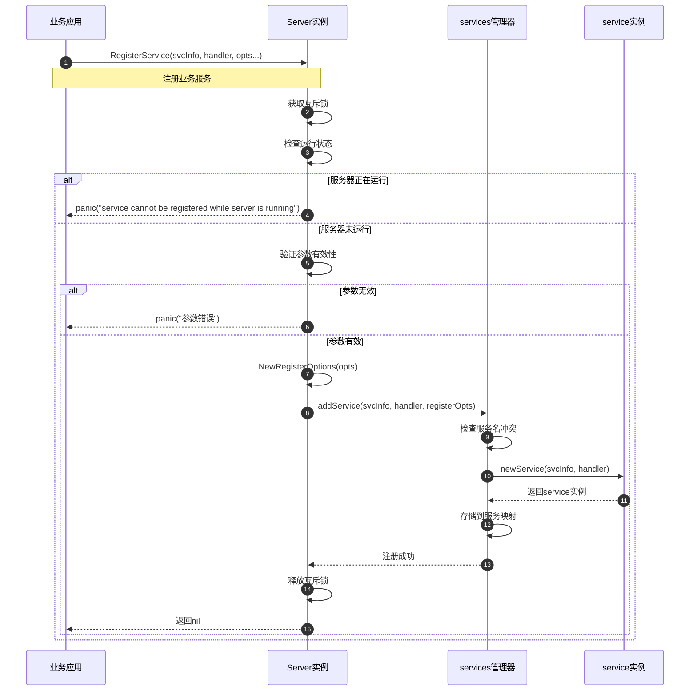
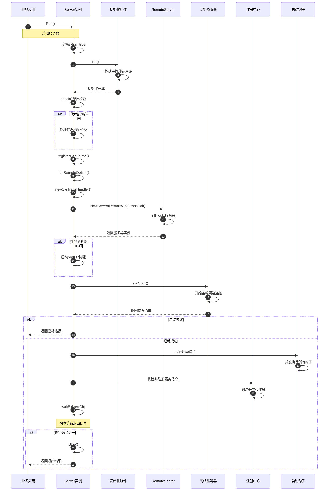

# Kitex-02-Server-API

## 基本接口定义

### Server核心接口

```go
// Server是RPC服务器的抽象接口
// 接受连接并将请求分发到注册的服务
type Server interface {
    RegisterService(svcInfo *serviceinfo.ServiceInfo, handler interface{}, opts ...RegisterOption) error
    GetServiceInfos() map[string]*serviceinfo.ServiceInfo
    Run() error
    Stop() error
}
```

| 方法 | 参数 | 返回值 | 说明 |
|------|------|--------|------|
| RegisterService | svcInfo, handler, opts | error | 注册业务服务和处理器 |
| GetServiceInfos | - | map[string]*serviceinfo.ServiceInfo | 获取已注册的服务信息 |
| Run | - | error | 启动服务器，阻塞直到停止 |
| Stop | - | error | 优雅停止服务器 |

## 服务器创建API

### NewServer - 创建标准服务器

```go
func NewServer(ops ...Option) Server
```

**功能说明**：
创建标准的Kitex服务器实例，支持多种配置选项。

**请求参数**：
| 参数 | 类型 | 必填 | 说明 |
|------|------|------|------|
| ops | ...Option | 否 | 服务器配置选项列表 |

**响应结果**：
| 字段 | 类型 | 说明 |
|------|------|------|
| Server | Server | 服务器实例 |

**核心实现代码**：
```go
func NewServer(ops ...Option) Server {
    s := &server{
        opt:  internal_server.NewOptions(ops),  // 解析配置选项
        svcs: newServices(),                     // 初始化服务管理器
    }
    return s
}
```

### NewGenericServer - 创建泛化服务器

```go
func NewServer(handler generic.Service, g generic.Generic, opts ...server.Option) server.Server
```

**功能说明**：
创建泛化服务器，支持动态服务处理，无需预生成代码。

**请求参数**：
| 参数 | 类型 | 必填 | 说明 |
|------|------|------|------|
| handler | generic.Service | 是 | 泛化服务处理器 |
| g | generic.Generic | 是 | 泛化处理器实例 |
| opts | ...server.Option | 否 | 服务器配置选项 |

**核心实现代码**：
```go
func NewServer(handler generic.Service, g generic.Generic, opts ...server.Option) server.Server {
    // 1. 生成泛化服务信息
    svcInfo := generic.ServiceInfoWithGeneric(g)
    
    // 2. 组装配置选项
    var options []server.Option
    options = append(options, server.WithGeneric(g))
    options = append(options, opts...)
    
    // 3. 创建服务器并注册服务
    svr := server.NewServer(options...)
    if err := svr.RegisterService(svcInfo, handler); err != nil {
        panic(err)
    }
    
    return svr
}
```

## 服务管理API

### RegisterService - 注册服务

```go
func (s *server) RegisterService(svcInfo *serviceinfo.ServiceInfo, handler interface{}, opts ...RegisterOption) error
```

**功能说明**：
向服务器注册业务服务和对应的处理器实现。

**请求参数**：
| 参数 | 类型 | 必填 | 说明 |
|------|------|------|------|
| svcInfo | *serviceinfo.ServiceInfo | 是 | 服务元信息，包含方法定义 |
| handler | interface{} | 是 | 业务处理器实现 |
| opts | ...RegisterOption | 否 | 服务注册选项 |

**核心实现代码**：
```go
func (s *server) RegisterService(svcInfo *serviceinfo.ServiceInfo, handler interface{}, opts ...RegisterOption) error {
    s.Lock()
    defer s.Unlock()
    
    // 1. 状态检查
    if s.isRun {
        panic("service cannot be registered while server is running")
    }
    if svcInfo == nil {
        panic("svcInfo is nil. please specify non-nil svcInfo")
    }
    if handler == nil || reflect.ValueOf(handler).IsNil() {
        panic("handler is nil. please specify non-nil handler")
    }
    
    // 2. 解析注册选项
    registerOpts := internal_server.NewRegisterOptions(opts)
    
    // 3. 添加服务到服务管理器
    if err := s.svcs.addService(svcInfo, handler, registerOpts); err != nil {
        panic(err.Error())
    }
    
    return nil
}
```

### GetServiceInfos - 获取服务信息

```go
func (s *server) GetServiceInfos() map[string]*serviceinfo.ServiceInfo
```

**功能说明**：
获取服务器上已注册的所有服务信息。

**响应结果**：
| 字段 | 类型 | 说明 |
|------|------|------|
| map[string]*serviceinfo.ServiceInfo | map | 服务名到服务信息的映射 |

## 生命周期管理API

### Run - 启动服务器

```go
func (s *server) Run() (err error)
```

**功能说明**：
启动服务器，开始监听网络连接并处理客户端请求。该方法会阻塞直到服务器停止。

**核心实现代码**：
```go
func (s *server) Run() (err error) {
    // 1. 设置运行状态
    s.Lock()
    s.isRun = true
    s.Unlock()
    
    // 2. 初始化服务器
    s.init()
    if err = s.check(); err != nil {
        return err
    }
    
    // 3. 处理代理配置
    svrCfg := s.opt.RemoteOpt
    addr := svrCfg.Address
    if s.opt.Proxy != nil {
        svrCfg.Address, err = s.opt.Proxy.Replace(addr)
        if err != nil {
            return
        }
    }
    
    // 4. 创建传输处理器和远程服务器
    s.registerDebugInfo()
    s.richRemoteOption()
    transHdlr, err := s.newSvrTransHandler()
    if err != nil {
        return err
    }
    svr, err := remotesvr.NewServer(s.opt.RemoteOpt, transHdlr)
    if err != nil {
        return err
    }
    
    // 5. 启动网络监听
    errCh := svr.Start()
    select {
    case err = <-errCh:
        return err
    default:
    }
    
    // 6. 执行启动钩子和服务注册
    // 执行启动钩子函数
    // 向注册中心注册服务
    
    // 7. 等待退出信号
    if err = s.waitExit(errCh); err != nil {
        // 处理退出错误
    }
    
    return
}
```

### Stop - 停止服务器

```go
func (s *server) Stop() (err error)
```

**功能说明**：
优雅停止服务器，清理资源并断开连接。

**核心实现代码**：
```go
func (s *server) Stop() (err error) {
    s.stopped.Do(func() {
        s.Lock()
        defer s.Unlock()
        
        // 1. 执行停机钩子
        muShutdownHooks.Lock()
        for i := range onShutdown {
            onShutdown[i]()
        }
        muShutdownHooks.Unlock()
        
        // 2. 从注册中心注销服务
        if s.opt.RegistryInfo != nil {
            err = s.opt.Registry.Deregister(s.opt.RegistryInfo)
            s.opt.RegistryInfo = nil
        }
        
        // 3. 停止远程服务器
        if s.svr != nil {
            if e := s.svr.Stop(); e != nil {
                err = e
            }
            s.svr = nil
        }
    })
    return
}
```

## 配置选项API

### 基础配置选项

#### WithServiceAddr - 设置服务地址

```go
func WithServiceAddr(addr net.Addr) Option
```

**功能说明**：设置服务器监听地址。

**参数说明**：
- addr：网络地址，支持TCP、Unix Socket等

#### WithMuxTransport - 多路复用传输

```go
func WithMuxTransport() Option
```

**功能说明**：启用多路复用传输，单连接支持并发请求。

**核心实现代码**：
```go
func WithMuxTransport() Option {
    return Option{F: func(o *internal_server.Options, di *utils.Slice) {
        // 设置多路复用传输处理器工厂
        o.RemoteOpt.SvrHandlerFactory = netpollmux.NewSvrTransHandlerFactory()
        // 设置QPS限流在解码后执行
        o.Limit.QPSLimitPostDecode = true
    }}
}
```

### 中间件配置

#### WithMiddleware - 添加中间件

```go
func WithMiddleware(mw endpoint.Middleware) Option
```

**功能说明**：添加请求处理中间件。

**中间件签名**：
```go
type Middleware func(endpoint.Endpoint) endpoint.Endpoint
type Endpoint func(ctx context.Context, req, resp interface{}) error
```

**核心实现代码**：
```go
func WithMiddleware(mw endpoint.Middleware) Option {
    mwb := func(ctx context.Context) endpoint.Middleware {
        return mw
    }
    return Option{F: func(o *internal_server.Options, di *utils.Slice) {
        o.MWBs = append(o.MWBs, mwb)
    }}
}
```

#### WithMiddlewareBuilder - 添加中间件构建器

```go
func WithMiddlewareBuilder(mwb endpoint.MiddlewareBuilder, funcName ...string) Option
```

**功能说明**：添加依赖上下文的中间件构建器。

#### WithUnaryMiddleware - 一元中间件

```go
func WithUnaryMiddleware(mw endpoint.UnaryMiddleware) UnaryOption
```

**功能说明**：添加专门用于一元调用的中间件。

#### WithStreamMiddleware - 流式中间件

```go
func WithStreamMiddleware(mw sep.StreamMiddleware) StreamOption
```

**功能说明**：添加专门用于流式调用的中间件。

### 服务治理配置

#### WithRegistry - 服务注册

```go
func WithRegistry(r registry.Registry) Option
```

**功能说明**：设置服务注册中心，用于服务发现。

#### WithRegistryInfo - 注册信息

```go
func WithRegistryInfo(info *registry.Info) Option
```

**功能说明**：设置服务注册信息，包含服务名、标签等。

#### WithLimit - 限流配置

```go
func WithLimit(lim *limit.Option) Option
```

**功能说明**：设置服务器限流策略。

**限流配置**：
```go
type Option struct {
    MaxConnections int    // 最大连接数
    MaxQPS         int    // 最大QPS
    UpdateControl  func(int) bool  // 动态更新控制
    QPSLimitPostDecode bool // QPS限流在解码后执行
}
```

#### WithLimiter - 限流器

```go
func WithLimiter(limiter limiter.Limiter) Option
```

**功能说明**：设置自定义限流器实现。

#### WithACLRules - 访问控制

```go
func WithACLRules(rules ...acl.RejectFunc) Option
```

**功能说明**：设置访问控制规则。

**ACL规则签名**：
```go
type RejectFunc func(ctx context.Context, request interface{}) (reason error)
```

### 链路追踪配置

#### WithTracer - 添加追踪器

```go
func WithTracer(c stats.Tracer) Option
```

**功能说明**：添加分布式链路追踪器。

#### WithStatsLevel - 统计级别

```go
func WithStatsLevel(level stats.Level) Option
```

**功能说明**：设置统计信息收集级别。

### 协议配置

#### WithTransportProtocol - 传输协议

```go
func WithTransportProtocol(tp transport.Protocol) Option
```

**功能说明**：设置传输协议类型。

#### WithTransHandlerFactory - 传输处理器工厂

```go
func WithTransHandlerFactory(f remote.ServerTransHandlerFactory) Option
```

**功能说明**：设置自定义传输处理器工厂。

#### WithTransServerFactory - 传输服务器工厂

```go
func WithTransServerFactory(f remote.TransServerFactory) Option
```

**功能说明**：设置自定义传输服务器工厂。

### 高级配置

#### WithProxy - 反向代理

```go
func WithProxy(p proxy.ReverseProxy) Option
```

**功能说明**：设置反向代理，用于地址替换。

#### WithMetaHandler - 元信息处理器

```go
func WithMetaHandler(h remote.MetaHandler) Option
```

**功能说明**：添加元信息处理器，处理协议头信息。

#### WithDiagnosisService - 诊断服务

```go
func WithDiagnosisService(ds diagnosis.Service) Option
```

**功能说明**：设置诊断服务，用于收集调试信息。

## 注册选项API

### RegisterOption - 服务注册选项

```go
type RegisterOption struct {
    F func(o *RegisterOptions)
}

type RegisterOptions struct {
    IsFallbackService bool  // 是否为降级服务
}
```

### WithFallbackService - 降级服务

```go
func WithFallbackService() RegisterOption
```

**功能说明**：将服务标记为降级服务，用于处理未知方法。

**核心实现代码**：
```go
func WithFallbackService() RegisterOption {
    return RegisterOption{F: func(o *internal_server.RegisterOptions) {
        o.IsFallbackService = true
    }}
}
```

## 时序图 - 服务器创建流程

```mermaid
sequenceDiagram
    autonumber
    participant APP as 业务应用
    participant SERVER as server包
    participant SERVERIMPL as server实现
    participant OPTIONS as Options
    parameter SERVICES as services管理器
    
    APP->>SERVER: NewServer(opts...)
    Note over APP,SERVER: 创建服务器实例
    
    SERVER->>OPTIONS: internal_server.NewOptions(opts)
    OPTIONS->>OPTIONS: 解析和验证配置选项
    OPTIONS-->>SERVER: 返回配置对象
    
    SERVER->>SERVICES: newServices()
    SERVICES->>SERVICES: 初始化服务管理器
    SERVICES-->>SERVER: 返回服务管理器
    
    SERVER->>SERVERIMPL: 创建server实例
    SERVERIMPL->>SERVERIMPL: 设置opt和svcs
    SERVERIMPL-->>SERVER: 返回server实例
    
    SERVER-->>APP: 返回Server接口
```

## 时序图 - 服务注册流程



## 时序图 - 服务器启动流程



## 异常处理与性能要点

### 异常处理策略

**1. 服务注册错误**
- 运行时注册：直接panic，快速失败
- 参数验证：严格检查svcInfo和handler有效性
- 服务冲突：检测服务名和方法名冲突

**2. 服务器启动错误**
- 地址绑定失败：返回具体的网络错误
- 组件初始化失败：逐步回滚已初始化的组件
- 注册中心连接失败：记录错误但不阻止启动

**3. 运行时错误**
- 请求处理错误：通过中间件统一处理
- 网络连接错误：自动重连和连接池管理
- 资源耗尽：触发限流和负载保护

### 性能优化要点

**1. 服务路由优化**
- 服务映射表预构建，O(1)查找复杂度
- 方法信息缓存，避免重复解析
- 读写锁优化，减少服务注册时的锁竞争

**2. 中间件性能优化**
- 中间件链预构建，避免运行时构建开销
- 条件中间件，根据配置按需添加
- 中间件缓存，复用中间件实例

**3. 网络处理优化**
- 基于Netpoll的高性能网络I/O
- 连接复用和多路复用支持
- 零拷贝数据传输

**4. 内存管理优化**
- 对象池复用频繁分配的对象
- 缓冲区池管理编解码缓冲区
- 及时回收请求上下文和响应对象

这个API文档详细介绍了Server模块的所有公开接口、配置选项、注册机制和使用方法，为开发者提供了完整的服务端开发指南。
