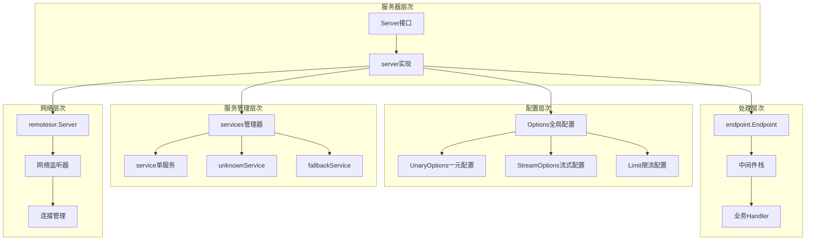

# Kitex-02-Server-数据结构

## 核心数据结构UML图

```mermaid
classDiagram
    class Server {
        <<interface>>
        +RegisterService(svcInfo *serviceinfo.ServiceInfo, handler interface{}, opts ...RegisterOption) error
        +GetServiceInfos() map[string]*serviceinfo.ServiceInfo
        +Run() error
        +Stop() error
    }
    
    class server {
        -opt *internal_server.Options
        -svcs *services
        -eps endpoint.Endpoint
        -svr remotesvr.Server
        -stopped sync.Once
        -isInit bool
        -isRun bool
        -sync.Mutex
        +RegisterService(svcInfo *serviceinfo.ServiceInfo, handler interface{}, opts ...RegisterOption) error
        +GetServiceInfos() map[string]*serviceinfo.ServiceInfo
        +Run() error
        +Stop() error
        -init()
        -buildInvokeChain(ctx context.Context)
        -buildMiddlewares(ctx context.Context) []endpoint.Middleware
    }
    
    class Options {
        +Svr *rpcinfo.EndpointBasicInfo
        +Configs rpcinfo.RPCConfig
        +LockBits int
        +Once *configutil.OptionOnce
        +UnaryOptions UnaryOptions
        +StreamOptions StreamOptions
        +MetaHandlers []remote.MetaHandler
        +RemoteOpt *remote.ServerOption
        +Registry registry.Registry
        +RegistryInfo *registry.Info
        +ACLRules []acl.RejectFunc
        +Limit Limit
        +MWBs []endpoint.MiddlewareBuilder
        +Bus event.Bus
        +Events event.Queue
        +TracerCtl *rpcinfo.TraceController
        +BackupOpt backup.Options
        +EnableContextTimeout bool
    }
    
    class services {
        -knownSvcMap map[string]*service
        -fallbackSvc *service
        -unknownSvc *unknownService
        +addService(svcInfo *serviceinfo.ServiceInfo, handler interface{}, opts *RegisterOptions) error
        +getKnownSvcInfoMap() map[string]*serviceinfo.ServiceInfo
        +getSvc(svcName string) *service
    }
    
    class service {
        -svcInfo *serviceinfo.ServiceInfo
        -handler interface{}
        -unknownMethodHandler interface{}
        +getHandler(methodName string) interface{}
    }
    
    class UnaryOptions {
        +UnaryMiddlewares []endpoint.UnaryMiddleware
        +UnaryMiddlewareBuilders []endpoint.UnaryMiddlewareBuilder
        +InitMiddlewares(ctx context.Context)
    }
    
    class StreamOptions {
        +EventHandler streaming.EventHandler
        +StreamMiddlewares []sep.StreamMiddleware
        +StreamMiddlewareBuilders []sep.StreamMiddlewareBuilder
        +StreamRecvMiddlewares []sep.StreamRecvMiddleware
        +StreamSendMiddlewares []sep.StreamSendMiddleware
        +InitMiddlewares(ctx context.Context)
    }
    
    class Limit {
        +Limits *limit.Option
        +LimitReporter limiter.LimitReporter
        +ConLimit limiter.ConcurrencyLimiter
        +QPSLimit limiter.RateLimiter
        +QPSLimitPostDecode bool
    }
    
    class RegisterOptions {
        +IsFallbackService bool
    }
    
    Server <|-- server
    server --> Options
    server --> services
    services --> service
    Options --> UnaryOptions
    Options --> StreamOptions
    Options --> Limit
    service --> RegisterOptions
```

## 主要数据结构详解

### 1. Server接口

```go
// Server是RPC服务器的抽象接口
// 接受连接并将请求分发到注册的服务
type Server interface {
    RegisterService(svcInfo *serviceinfo.ServiceInfo, handler interface{}, opts ...RegisterOption) error
    GetServiceInfos() map[string]*serviceinfo.ServiceInfo
    Run() error
    Stop() error
}
```

**接口说明**：
- 这是服务器的核心接口定义，所有服务器实现都必须实现这些方法
- 提供服务注册、获取服务信息、启动和停止的基本能力
- 支持多服务注册和管理

### 2. server核心实现

```go
type server struct {
    opt  *internal_server.Options  // 服务器配置选项
    svcs *services                 // 服务管理器
    
    // 实际的RPC服务实现
    eps     endpoint.Endpoint      // 端点处理链
    svr     remotesvr.Server      // 远程服务器实例
    stopped sync.Once             // 确保只停止一次
    isInit  bool                  // 初始化状态标记
    isRun   bool                  // 运行状态标记
    
    sync.Mutex                    // 并发保护锁
}
```

**字段映射与说明**：

| 字段 | 类型 | 必填 | 默认值 | 约束 | 说明 |
|------|------|------|--------|------|------|
| opt | *internal_server.Options | 是 | nil | 非空 | 服务器全局配置选项 |
| svcs | *services | 是 | nil | 非空 | 服务管理器，管理所有注册的服务 |
| eps | endpoint.Endpoint | 否 | nil | - | 端点处理链，包含中间件和业务逻辑 |
| svr | remotesvr.Server | 否 | nil | - | 远程服务器实例，处理网络通信 |
| stopped | sync.Once | - | - | - | 确保Stop方法只执行一次 |
| isInit | bool | - | false | - | 标记服务器是否已完成初始化 |
| isRun | bool | - | false | - | 标记服务器是否正在运行 |
| sync.Mutex | sync.Mutex | - | - | - | 保护并发访问的互斥锁 |

**生命周期管理**：
- **创建阶段**：通过NewServer函数创建，设置Options和services
- **注册阶段**：通过RegisterService注册业务服务
- **初始化阶段**：调用init()方法构建中间件调用链
- **运行阶段**：调用Run()方法启动网络监听
- **停止阶段**：调用Stop()方法优雅停机

### 3. Options配置结构

```go
type Options struct {
    // 基础信息
    Svr      *rpcinfo.EndpointBasicInfo  // 服务端端点信息
    Configs  rpcinfo.RPCConfig           // RPC配置信息
    LockBits int                         // 配置锁定位标记
    Once     *configutil.OptionOnce      // 一次性配置检查
    
    // 调用选项
    UnaryOptions  UnaryOptions           // 一元调用选项
    StreamOptions StreamOptions          // 流式调用选项
    
    // 扩展组件
    MetaHandlers []remote.MetaHandler    // 元信息处理器
    RemoteOpt    *remote.ServerOption    // 远程服务器选项
    ErrHandle    func(context.Context, error) error  // 错误处理函数
    ExitSignal   func() <-chan error     // 退出信号函数
    Proxy        proxy.ReverseProxy      // 反向代理
    
    // 服务注册
    Registry     registry.Registry       // 服务注册中心
    RegistryInfo *registry.Info          // 服务注册信息
    
    // 服务治理
    ACLRules []acl.RejectFunc           // 访问控制规则
    Limit    Limit                      // 限流配置
    
    // 中间件
    MWBs []endpoint.MiddlewareBuilder   // 中间件构建器
    
    // 事件系统
    Bus    event.Bus                    // 事件总线
    Events event.Queue                  // 事件队列
    
    // 调试与诊断
    DebugInfo    utils.Slice            // 调试信息
    DebugService diagnosis.Service      // 诊断服务
    
    // 可观测性
    TracerCtl  *rpcinfo.TraceController // 链路追踪控制器
    StatsLevel *stats.Level             // 统计级别
    
    // 其他配置
    BackupOpt                backup.Options  // 备份选项
    Streaming                stream.StreamingConfig  // 流式配置（已废弃）
    RefuseTrafficWithoutServiceName bool     // 拒绝无服务名流量
    EnableContextTimeout            bool     // 启用上下文超时
}
```

**关键字段说明**：

1. **基础配置**：
   - `Svr`：服务端端点信息，包含服务名、地址等
   - `Configs`：RPC配置，包含超时、协议等设置
   - `LockBits`：配置锁定机制，防止运行时修改关键配置

2. **服务治理**：
   - `Registry/RegistryInfo`：服务注册中心和注册信息
   - `ACLRules`：访问控制规则列表
   - `Limit`：限流配置，包含连接数和QPS限制

3. **扩展机制**：
   - `MWBs`：中间件构建器，支持请求拦截和处理
   - `MetaHandlers`：元信息处理器，处理协议头信息
   - `Proxy`：反向代理，支持地址替换

### 4. services服务管理器

```go
type services struct {
    knownSvcMap map[string]*service  // 已知服务映射表，key为服务名
    
    // fallbackSvc用于获取唯一的svcInfo
    // 当多个服务有相同方法时使用
    fallbackSvc *service
    
    // unknownSvc用于处理未知服务的请求
    unknownSvc *unknownService
}
```

**字段说明**：
- `knownSvcMap`：存储所有已注册的服务，支持O(1)查找
- `fallbackSvc`：降级服务，处理找不到具体服务的请求
- `unknownSvc`：未知服务处理器，支持动态服务创建

**核心方法**：
```go
// 添加服务到管理器
func (s *services) addService(svcInfo *serviceinfo.ServiceInfo, handler interface{}, opts *RegisterOptions) error

// 获取所有已知服务信息
func (s *services) getKnownSvcInfoMap() map[string]*serviceinfo.ServiceInfo

// 根据服务名获取服务实例
func (s *services) getSvc(svcName string) *service
```

### 5. service单服务结构

```go
type service struct {
    svcInfo              *serviceinfo.ServiceInfo  // 服务元信息
    handler              interface{}               // 业务处理器
    unknownMethodHandler interface{}               // 未知方法处理器
}
```

**字段映射与版本演进**：

| 字段 | 类型 | 版本 | 约束 | 说明 |
|------|------|------|------|------|
| svcInfo | *serviceinfo.ServiceInfo | v1.0+ | 非空 | 服务元信息，包含方法定义和协议类型 |
| handler | interface{} | v1.0+ | 非空 | 业务处理器实现，通常是生成的服务接口 |
| unknownMethodHandler | interface{} | v1.2+ | 可空 | 未知方法处理器，用于处理未定义的方法 |

**核心方法**：
```go
// 根据方法名获取对应的处理器
func (s *service) getHandler(methodName string) interface{} {
    if s.unknownMethodHandler == nil {
        return s.handler
    }
    if mi := s.svcInfo.MethodInfo(notAllowBinaryGenericCtx, methodName); mi != nil {
        return s.handler
    }
    return s.unknownMethodHandler
}
```

### 6. UnaryOptions一元调用选项

```go
type UnaryOptions struct {
    UnaryMiddlewares        []endpoint.UnaryMiddleware        // 一元中间件列表
    UnaryMiddlewareBuilders []endpoint.UnaryMiddlewareBuilder // 中间件构建器
}
```

**核心方法实现**：
```go
// 初始化中间件，将构建器转换为实际中间件
func (o *UnaryOptions) InitMiddlewares(ctx context.Context) {
    if len(o.UnaryMiddlewareBuilders) > 0 {
        unaryMiddlewares := make([]endpoint.UnaryMiddleware, 0, len(o.UnaryMiddlewareBuilders))
        for _, mwb := range o.UnaryMiddlewareBuilders {
            unaryMiddlewares = append(unaryMiddlewares, mwb(ctx))
        }
        o.UnaryMiddlewares = append(o.UnaryMiddlewares, unaryMiddlewares...)
    }
}
```

### 7. StreamOptions流式调用选项

```go
type StreamOptions struct {
    EventHandler                 streaming.EventHandler        // 事件处理器
    StreamMiddlewares            []sep.StreamMiddleware        // 流式中间件
    StreamMiddlewareBuilders     []sep.StreamMiddlewareBuilder // 流式中间件构建器
    StreamRecvMiddlewares        []sep.StreamRecvMiddleware    // 接收中间件
    StreamRecvMiddlewareBuilders []sep.StreamRecvMiddlewareBuilder // 接收中间件构建器
    StreamSendMiddlewares        []sep.StreamSendMiddleware    // 发送中间件
    StreamSendMiddlewareBuilders []sep.StreamSendMiddlewareBuilder // 发送中间件构建器
}
```

**中间件分类**：
- **StreamMiddleware**：通用流式中间件，处理流的创建和销毁
- **StreamRecvMiddleware**：接收中间件，处理从客户端接收的消息
- **StreamSendMiddleware**：发送中间件，处理向客户端发送的消息

### 8. Limit限流配置

```go
type Limit struct {
    Limits        *limit.Option              // 限流选项
    LimitReporter limiter.LimitReporter      // 限流报告器
    ConLimit      limiter.ConcurrencyLimiter // 并发限流器
    QPSLimit      limiter.RateLimiter        // QPS限流器
    
    // QPSLimitPostDecode为true表示QPS限流器在OnMessage回调中生效
    // 为false表示在OnRead回调中生效
    // 通常当服务器是多路复用时，Kitex默认设置为True
    QPSLimitPostDecode bool
}
```

**限流类型**：
- **连接数限流**：控制同时连接的客户端数量
- **并发限流**：控制同时处理的请求数量
- **QPS限流**：控制每秒处理的请求数量

### 9. RegisterOptions注册选项

```go
type RegisterOptions struct {
    IsFallbackService bool  // 是否为降级服务
}
```

**注册选项说明**：
- `IsFallbackService`：标记服务为降级服务，用于处理未知方法或服务

## 数据结构关系图



## 内存管理与性能优化

### 1. 服务映射优化

**服务查找优化**：
```go
// O(1)时间复杂度的服务查找
func (s *services) getSvc(svcName string) *service {
    // 直接从map中查找，避免遍历
    return s.knownSvcMap[svcName]
}
```

- 使用map结构实现O(1)查找复杂度
- 服务注册时预构建映射表
- 支持服务名和方法名的快速路由

### 2. 中间件性能优化

**中间件链预构建**：
```go
func (s *server) buildInvokeChain(ctx context.Context) {
    mws := s.buildMiddlewares(ctx)
    s.eps = endpoint.Chain(mws...)(s.unaryOrStreamEndpoint(ctx))
}
```

- 在初始化阶段预构建中间件调用链
- 避免每次请求重新构建中间件
- 支持中间件的条件添加和动态配置

### 3. 并发安全设计

**读写锁优化**：
```go
type unknownService struct {
    mutex   sync.RWMutex              // 读写锁
    svcs    map[string]*service       // 服务映射
    handler interface{}               // 处理器
}

func (u *unknownService) getSvc(svcName string) *service {
    u.mutex.RLock()                   // 读锁
    svc := u.svcs[svcName]
    u.mutex.RUnlock()
    return svc
}
```

- 服务查找使用读锁，支持并发读取
- 服务注册使用写锁，确保数据一致性
- 双重检查锁定模式避免重复创建

### 4. 资源生命周期管理

**优雅停机机制**：
```go
func (s *server) Stop() (err error) {
    s.stopped.Do(func() {
        // 1. 执行停机钩子
        // 2. 从注册中心注销服务
        // 3. 停止远程服务器
        // 4. 清理资源
    })
    return
}
```

- 使用sync.Once确保停机逻辑只执行一次
- 按顺序清理资源，避免资源泄漏
- 支持优雅停机和强制停机

### 5. 配置管理优化

**配置锁定机制**：
```go
type Options struct {
    LockBits int                      // 配置锁定位标记
    Once     *configutil.OptionOnce   // 一次性配置检查
}
```

- 防止运行时修改关键配置
- 支持配置项的细粒度锁定
- 一次性配置检查避免重复设置

这个数据结构文档详细介绍了Server模块的核心数据结构、字段含义、关系图和性能优化策略，为开发者理解和扩展Server功能提供了完整的参考。
