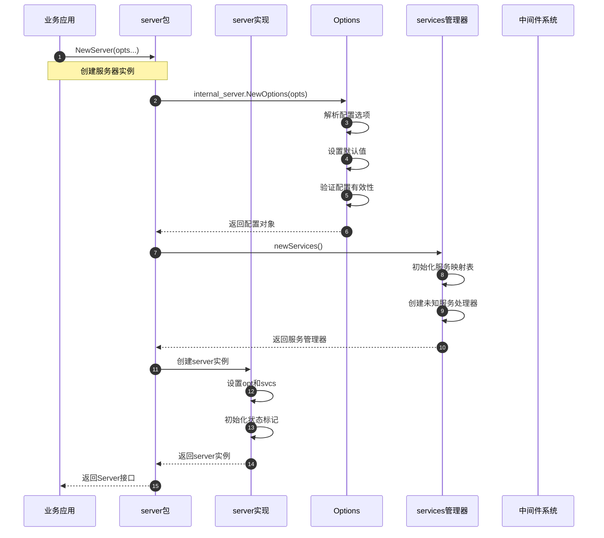
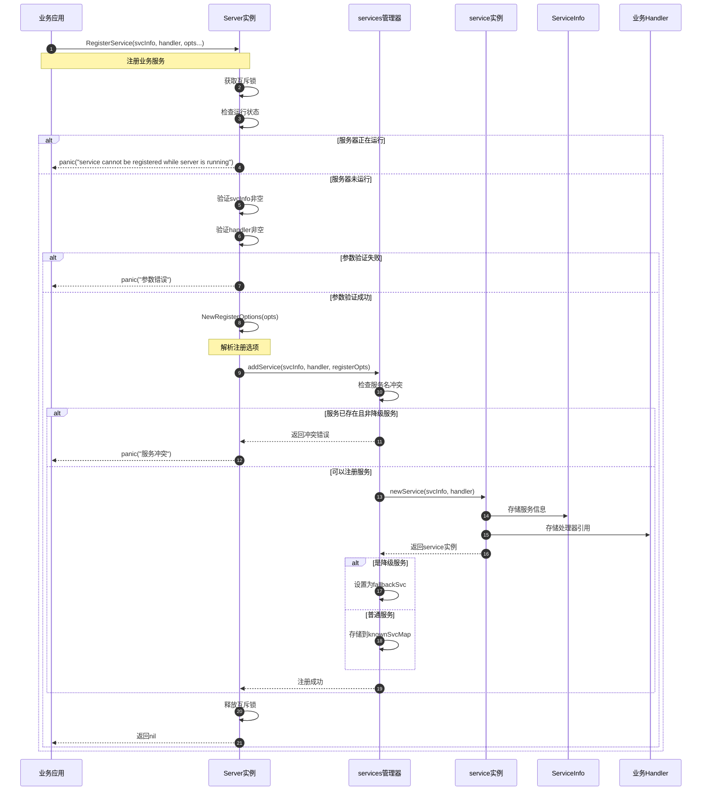
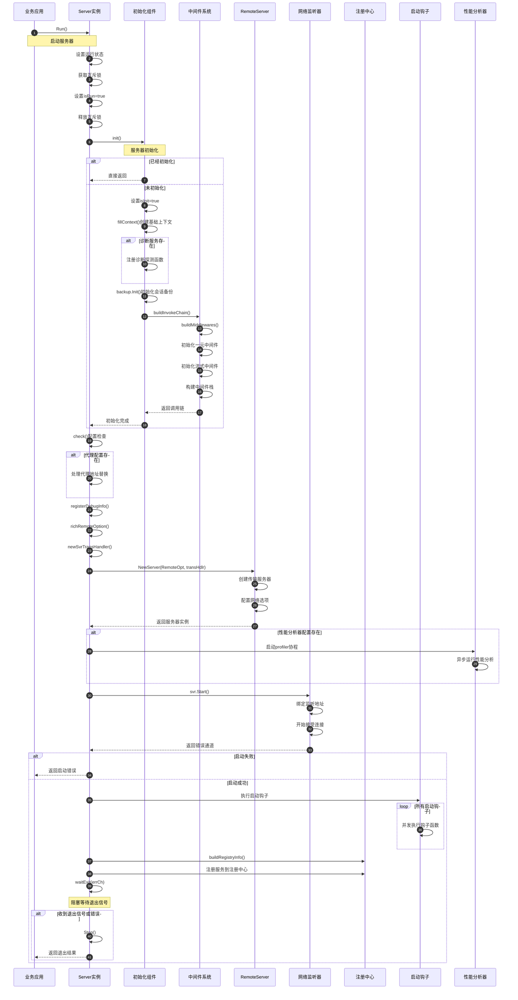
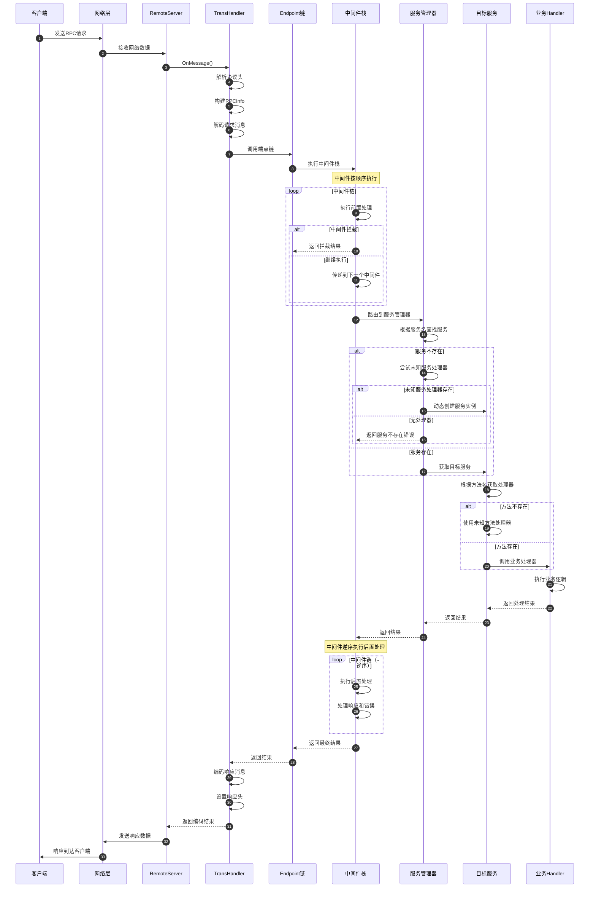
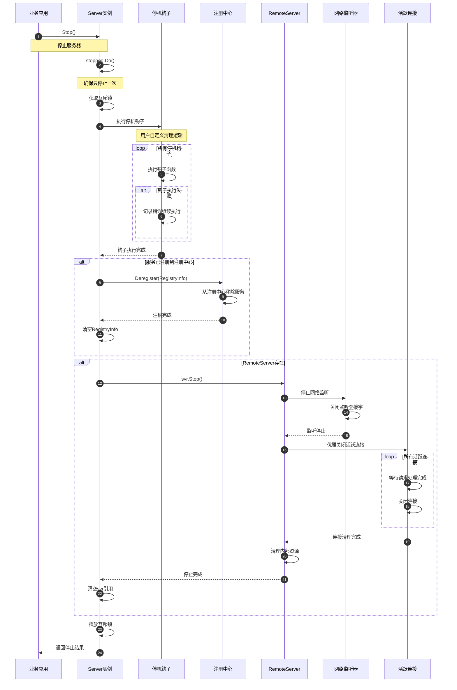
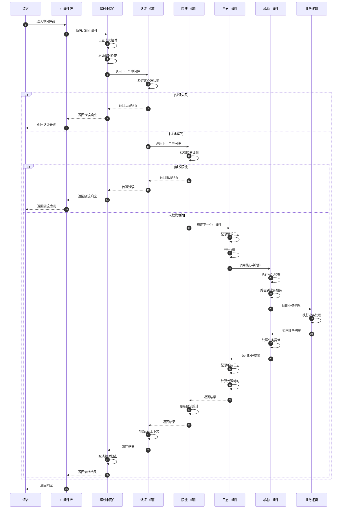

# Kitex-02-Server-时序图

## 1. 服务器创建与初始化时序图

### 创建时序说明

**1. 配置解析阶段（步骤1-4）**
- 业务应用调用NewServer创建服务器
- 解析传入的配置选项，设置默认值
- 验证配置的有效性和兼容性
- 构建完整的Options配置对象

**2. 组件初始化阶段（步骤5-8）**
- 创建服务管理器，初始化服务映射表
- 设置未知服务和降级服务处理器
- 准备中间件系统和事件总线

**3. 实例创建阶段（步骤9-12）**
- 创建server实现实例
- 设置配置和服务管理器引用
- 初始化状态标记和同步原语
- 返回Server接口给业务应用

## 2. 服务注册时序图

### 服务注册时序说明

**1. 状态检查阶段（步骤1-6）**
- 获取互斥锁保护并发安全
- 检查服务器运行状态，运行中不允许注册
- 验证服务信息和处理器的有效性

**2. 参数验证阶段（步骤7-10）**
- 严格验证ServiceInfo和Handler非空
- 解析注册选项，支持降级服务等特殊配置
- 参数无效时直接panic快速失败

**3. 服务存储阶段（步骤11-20）**
- 检查服务名冲突，防止重复注册
- 创建service实例，封装服务信息和处理器
- 根据注册选项决定存储位置（普通服务或降级服务）
- 更新服务映射表，支持快速查找

## 3. 服务器启动时序图

### 启动时序说明

**1. 状态设置阶段（步骤1-5）**
- 设置服务器运行状态标记
- 使用互斥锁保护状态变更
- 防止重复启动和并发问题

**2. 初始化阶段（步骤6-18）**
- 检查是否已初始化，支持幂等调用
- 创建基础上下文，包含事件总线和队列
- 构建完整的中间件调用链
- 初始化会话备份和诊断服务

**3. 网络启动阶段（步骤19-28）**
- 创建传输处理器和远程服务器
- 配置网络监听参数和协议选项
- 启动网络监听，开始接受客户端连接
- 可选启动性能分析器

**4. 服务注册阶段（步骤29-35）**
- 执行用户定义的启动钩子函数
- 构建服务注册信息
- 向注册中心注册服务实例
- 阻塞等待退出信号

## 4. 请求处理时序图

### 请求处理时序说明

**1. 网络接收阶段（步骤1-6）**
- 客户端发送RPC请求到服务器
- 网络层接收数据并传递给RemoteServer
- TransHandler解析协议头和请求消息
- 构建RPCInfo包含调用元信息

**2. 中间件处理阶段（步骤7-12）**
- 按配置顺序执行中间件栈
- 支持中间件拦截和短路返回
- 处理认证、限流、日志等横切关注点
- 传递请求到服务路由层

**3. 服务路由阶段（步骤13-22）**
- 根据服务名从映射表中查找服务
- 支持未知服务的动态处理
- 根据方法名获取具体的处理器
- 处理方法不存在的异常情况

**4. 业务处理阶段（步骤23-26）**
- 调用业务Handler执行具体逻辑
- 处理业务异常和返回结果
- 支持同步和异步处理模式

**5. 响应返回阶段（步骤27-35）**
- 中间件逆序执行后置处理
- 编码响应消息和设置响应头
- 通过网络层发送响应给客户端
- 完成一次完整的RPC调用

## 5. 服务器停止时序图

### 停止时序说明

**1. 停止保护阶段（步骤1-4）**
- 使用sync.Once确保Stop方法只执行一次
- 获取互斥锁保护停止过程
- 防止并发停止导致的资源竞争

**2. 钩子执行阶段（步骤5-9）**
- 执行用户注册的停机钩子函数
- 支持自定义的资源清理逻辑
- 即使某个钩子失败也继续执行其他钩子

**3. 服务注销阶段（步骤10-14）**
- 从注册中心注销服务实例
- 防止新的客户端发现和连接服务
- 清理注册信息，标记服务不可用

**4. 网络停止阶段（步骤15-25）**
- 停止网络监听，不再接受新连接
- 优雅关闭活跃连接，等待请求处理完成
- 清理网络资源和内部状态
- 确保所有连接正确关闭

**5. 资源清理阶段（步骤26-28）**
- 清空RemoteServer引用
- 释放互斥锁
- 返回停止结果给调用方

## 6. 中间件执行时序图

### 中间件执行时序说明

**1. 中间件顺序执行（步骤1-16）**
- 按配置顺序依次执行中间件
- 每个中间件可以选择继续或短路返回
- 支持条件执行和错误处理

**2. 核心业务处理（步骤17-22）**
- 核心中间件执行ACL检查和服务路由
- 调用实际的业务处理逻辑
- 处理业务异常和错误转换

**3. 中间件逆序清理（步骤23-32）**
- 按相反顺序执行中间件的后置处理
- 清理资源和更新统计信息
- 确保所有中间件正确完成处理

**4. 错误处理机制**
- 任何中间件都可以短路返回错误
- 错误会逐层向上传播
- 支持错误转换和包装

## 时序图总结

这些时序图展示了Kitex Server模块的完整生命周期：

1. **创建初始化**：展示了服务器从创建到可用的完整过程
2. **服务注册**：展示了业务服务注册和管理的详细流程
3. **服务器启动**：展示了网络监听和服务注册的启动过程
4. **请求处理**：展示了从请求接收到响应返回的完整链路
5. **服务器停止**：展示了优雅停机和资源清理过程
6. **中间件执行**：展示了中间件链的执行顺序和错误处理

每个时序图都包含了详细的步骤说明和关键节点分析，帮助开发者理解Server模块的内部工作机制、扩展点和最佳实践。
