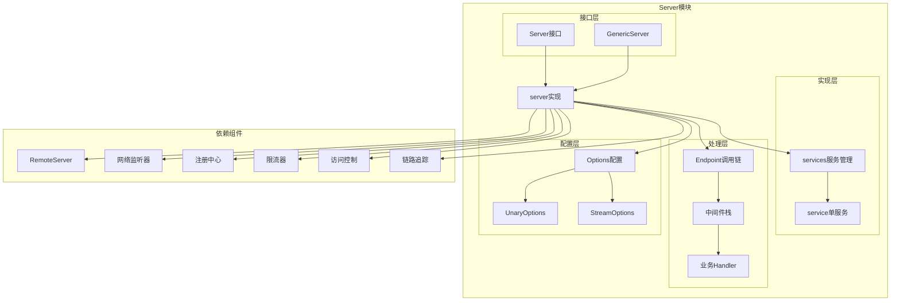

# Kitex-02-Server-概览

## 模块职责与边界

### 核心职责
Server模块是Kitex框架的服务端核心，负责接收和处理RPC请求。主要职责包括：
- **服务注册管理**：注册业务服务和处理器，支持多服务共存
- **请求接收处理**：监听网络连接，接收客户端请求
- **协议解析**：支持多种RPC协议（Thrift、gRPC、Kitex Protobuf）
- **中间件执行**：提供请求拦截和处理链，支持自定义扩展
- **治理功能集成**：集成限流、ACL、统计、链路追踪等治理能力
- **生命周期管理**：管理服务启动、运行和优雅停机

### 输入输出
- **输入**：客户端RPC请求、服务注册信息、配置选项
- **输出**：RPC响应结果、服务状态信息、统计数据
- **上游依赖**：业务Handler实现、IDL生成代码
- **下游依赖**：Remote传输层、网络监听器、注册中心

### 生命周期
1. **创建阶段**：通过NewServer创建服务器实例，设置配置选项
2. **注册阶段**：注册业务服务和处理器，构建服务映射
3. **初始化阶段**：初始化组件，构建中间件调用链
4. **运行阶段**：启动网络监听，处理客户端请求
5. **停机阶段**：优雅停止服务，清理资源和连接

## 模块架构图



### 架构说明

**1. 分层设计**
- **接口层**：定义Server和GenericServer的标准接口
- **实现层**：提供服务器核心实现和服务管理功能
- **处理层**：构建请求处理链，包含中间件和业务逻辑
- **配置层**：管理服务器配置选项和调用时选项

**2. 组件交互**
- Server接口通过server实现管理服务生命周期
- services负责多服务注册和路由分发
- Endpoint链串联中间件和业务Handler
- 各治理组件通过中间件机制集成

**3. 扩展机制**
- 中间件机制支持请求拦截和处理
- Suite模式支持组件化配置
- 多种传输协议和编解码器支持
- 插件化治理组件集成

## 核心算法与流程

### 服务器初始化流程

```go
func (s *server) init() {
    if s.isInit {
        return
    }
    s.isInit = true
    
    // 1. 填充基础上下文
    ctx := fillContext(s.opt)
    
    // 2. 注册诊断服务
    if ds := s.opt.DebugService; ds != nil {
        ds.RegisterProbeFunc(diagnosis.OptionsKey, diagnosis.WrapAsProbeFunc(s.opt.DebugInfo))
        ds.RegisterProbeFunc(diagnosis.ChangeEventsKey, s.opt.Events.Dump)
    }
    
    // 3. 初始化本地会话备份
    backup.Init(s.opt.BackupOpt)
    
    // 4. 构建调用链
    s.buildInvokeChain(ctx)
}
```

**初始化流程说明**：
1. **上下文准备**：创建包含事件总线和队列的基础上下文
2. **诊断注册**：注册调试和诊断相关的探测函数
3. **会话初始化**：初始化本地会话备份机制
4. **调用链构建**：构建包含所有中间件的请求处理链

### 中间件构建流程

```go
func (s *server) buildMiddlewares(ctx context.Context) []endpoint.Middleware {
    // 1. 初始化一元中间件
    s.opt.UnaryOptions.InitMiddlewares(ctx)
    
    // 2. 初始化流式中间件
    s.opt.Streaming.InitMiddlewares(ctx)
    s.opt.StreamOptions.EventHandler = s.opt.TracerCtl.GetStreamEventHandler()
    s.opt.StreamOptions.InitMiddlewares(ctx)
    
    // 3. 构建通用中间件栈
    var mws []endpoint.Middleware
    
    // 流式中间件包装器
    mws = append(mws, s.wrapStreamMiddleware())
    
    // 超时中间件（如果启用）
    if s.opt.EnableContextTimeout {
        mws = append(mws, serverTimeoutMW)
    }
    
    // 用户自定义中间件
    for i := range s.opt.MWBs {
        if mw := s.opt.MWBs[i](ctx); mw != nil {
            mws = append(mws, mw)
        }
    }
    
    // 核心中间件（必须是最后一个）
    mws = append(mws, s.buildCoreMiddleware())
    
    return mws
}
```

**中间件构建说明**：
1. **分类初始化**：分别初始化一元和流式中间件
2. **顺序组装**：按固定顺序组装中间件栈
3. **核心中间件**：包含ACL、错误处理等框架核心逻辑
4. **执行顺序**：外层中间件先执行，核心中间件最后执行

### 服务注册流程

```go
func (s *server) RegisterService(svcInfo *serviceinfo.ServiceInfo, handler interface{}, opts ...RegisterOption) error {
    s.Lock()
    defer s.Unlock()
    
    // 1. 状态检查
    if s.isRun {
        panic("service cannot be registered while server is running")
    }
    if svcInfo == nil {
        panic("svcInfo is nil. please specify non-nil svcInfo")
    }
    if handler == nil || reflect.ValueOf(handler).IsNil() {
        panic("handler is nil. please specify non-nil handler")
    }
    
    // 2. 解析注册选项
    registerOpts := internal_server.NewRegisterOptions(opts)
    
    // 3. 添加服务到服务管理器
    if err := s.svcs.addService(svcInfo, handler, registerOpts); err != nil {
        panic(err.Error())
    }
    
    return nil
}
```

**服务注册说明**：
1. **并发安全**：使用互斥锁保护服务注册过程
2. **状态验证**：确保服务器未运行时才能注册服务
3. **参数检查**：验证服务信息和处理器的有效性
4. **服务存储**：将服务添加到内部服务管理器

### 服务器启动流程

```go
func (s *server) Run() (err error) {
    // 1. 设置运行状态
    s.Lock()
    s.isRun = true
    s.Unlock()
    
    // 2. 初始化服务器
    s.init()
    if err = s.check(); err != nil {
        return err
    }
    
    // 3. 处理代理配置
    svrCfg := s.opt.RemoteOpt
    addr := svrCfg.Address
    if s.opt.Proxy != nil {
        svrCfg.Address, err = s.opt.Proxy.Replace(addr)
        if err != nil {
            return
        }
    }
    
    // 4. 注册调试信息和丰富远程选项
    s.registerDebugInfo()
    s.richRemoteOption()
    
    // 5. 创建传输处理器和远程服务器
    transHdlr, err := s.newSvrTransHandler()
    if err != nil {
        return err
    }
    svr, err := remotesvr.NewServer(s.opt.RemoteOpt, transHdlr)
    if err != nil {
        return err
    }
    s.Lock()
    s.svr = svr
    s.Unlock()
    
    // 6. 启动性能分析器（如果配置）
    if s.opt.RemoteOpt.Profiler != nil {
        gofunc.GoFunc(context.Background(), func() {
            err := s.opt.RemoteOpt.Profiler.Run(context.Background())
            if err != nil {
                klog.Errorf("KITEX: server started profiler error: error=%s", err.Error())
            }
        })
    }
    
    // 7. 启动服务器监听
    errCh := svr.Start()
    select {
    case err = <-errCh:
        klog.Errorf("KITEX: server start error: error=%s", err.Error())
        return err
    default:
    }
    
    // 8. 执行启动钩子
    muStartHooks.Lock()
    for i := range onServerStart {
        go onServerStart[i]()
    }
    muStartHooks.Unlock()
    
    // 9. 构建注册信息
    s.Lock()
    s.buildRegistryInfo(svr.Address())
    s.Unlock()
    
    // 10. 等待退出信号
    if err = s.waitExit(errCh); err != nil {
        klog.Errorf("KITEX: received error and exit: error=%s", err.Error())
    }
    
    // 11. 停止服务器
    if e := s.Stop(); e != nil && err == nil {
        err = e
        klog.Errorf("KITEX: stop server error: error=%s", e.Error())
    }
    
    return
}
```

**启动流程说明**：
1. **状态管理**：设置运行状态，防止重复启动
2. **初始化检查**：确保服务器完全初始化并通过检查
3. **代理处理**：如果配置了代理，替换监听地址
4. **组件创建**：创建传输处理器和远程服务器实例
5. **监听启动**：开始监听网络连接，处理客户端请求
6. **钩子执行**：执行用户注册的启动钩子函数
7. **服务注册**：向注册中心注册服务信息
8. **阻塞等待**：等待退出信号或错误发生
9. **优雅停机**：收到停止信号后执行清理逻辑

## 性能优化要点

### 1. 中间件性能优化
- **预构建调用链**：在初始化阶段构建完整的中间件调用链
- **中间件缓存**：避免每次请求重新构建中间件
- **条件中间件**：根据配置有条件地添加中间件
- **零分配设计**：中间件执行过程中尽量避免内存分配

### 2. 服务路由优化
- **服务映射缓存**：使用map快速查找服务和方法
- **读写锁优化**：服务注册使用读写锁，减少读取竞争
- **懒加载机制**：按需创建泛化服务实例
- **方法信息缓存**：缓存方法元信息避免重复解析

### 3. 网络处理优化
- **连接复用**：支持长连接和连接池
- **多路复用**：单连接支持并发请求处理
- **零拷贝**：基于Netpoll的零拷贝网络处理
- **批量处理**：支持批量读写网络数据

### 4. 内存管理优化
- **对象池**：复用频繁分配的对象
- **缓冲区复用**：编解码缓冲区复用
- **引用计数**：精确控制对象生命周期
- **垃圾回收优化**：减少GC压力和停顿时间

### 5. 并发安全设计
- **无锁数据结构**：使用原子操作和无锁算法
- **读写分离**：配置读多写少使用读写锁
- **协程池**：复用goroutine避免频繁创建
- **上下文隔离**：每个请求使用独立上下文

这个概览文档详细介绍了Server模块的架构设计、核心流程和性能优化策略。接下来将继续分析Server模块的API接口和数据结构。
