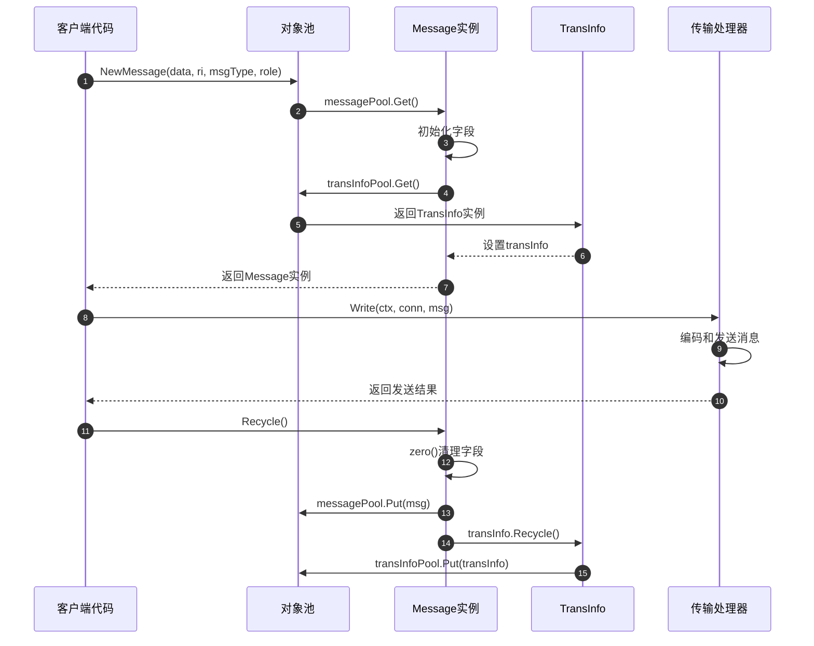
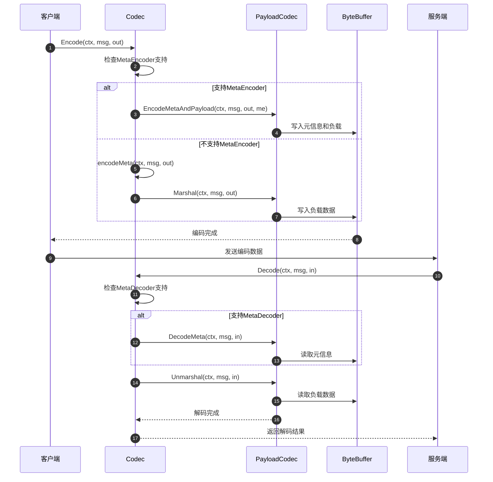
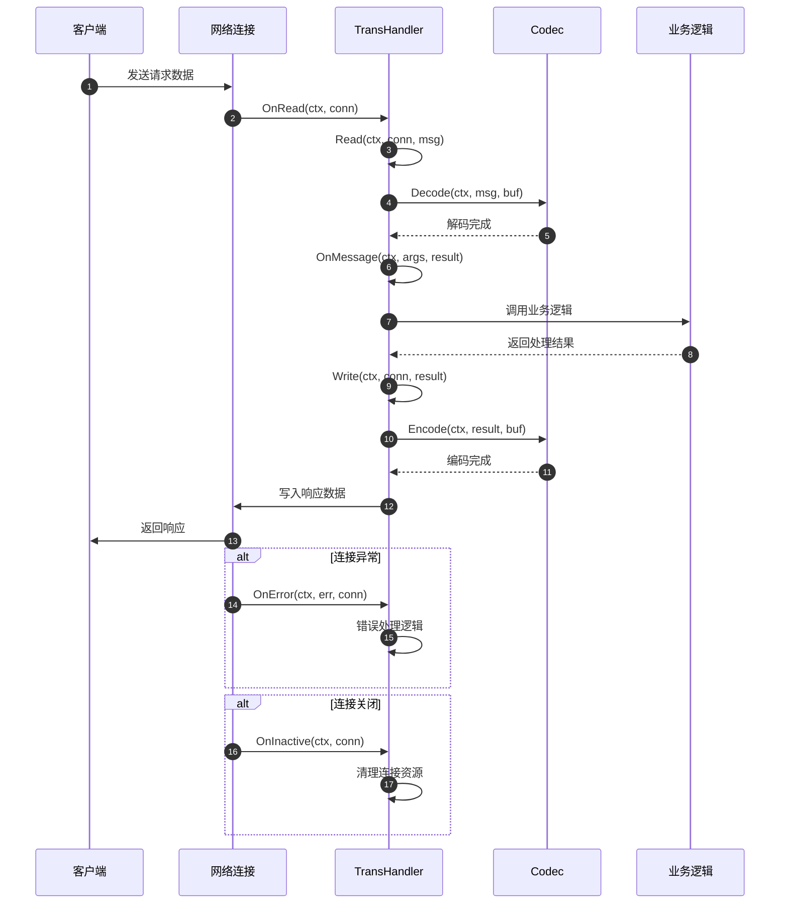
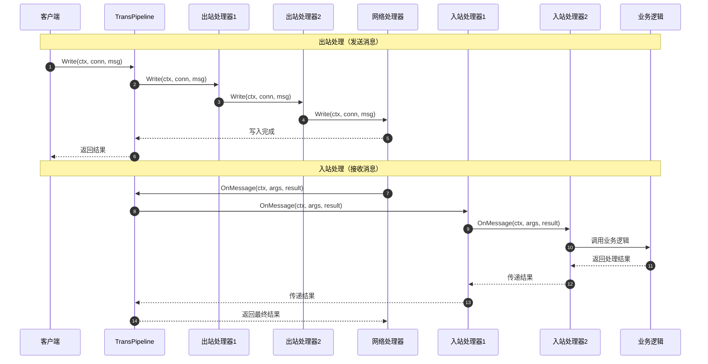
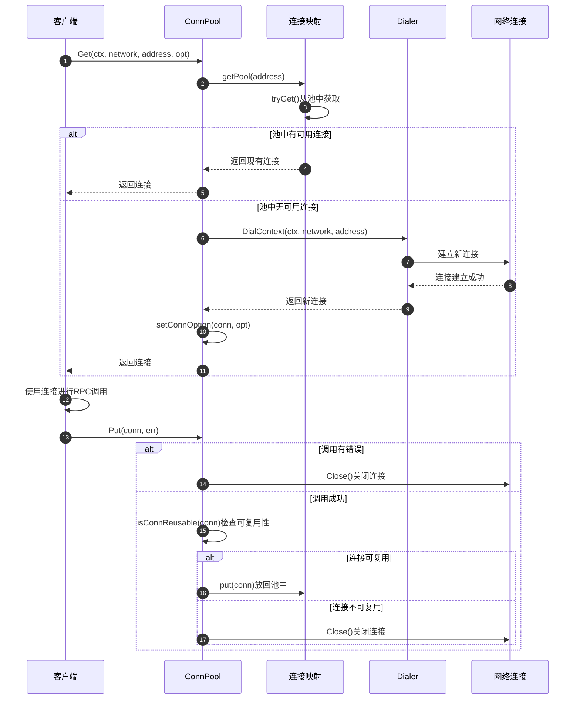

# Kitex-03-Remote-API

## API概览

Remote模块提供了传输层的核心API，主要包括：
- **Message API**：统一的消息抽象接口
- **Codec API**：编解码器接口
- **TransHandler API**：传输处理器接口
- **Pipeline API**：传输管道接口
- **ConnPool API**：连接池接口
- **Factory API**：各种工厂接口

## 1. Message消息接口

### 基本信息
- 名称：`Message`
- 协议/方法：接口定义
- 幂等性：否（状态可变）

### 接口定义
```go
// Message是Kitex消息的核心抽象
type Message interface {
    RPCInfo() rpcinfo.RPCInfo                    // 获取RPC调用信息
    Data() interface{}                           // 获取消息数据
    NewData(method string) (ok bool)             // 创建新的数据对象
    MessageType() MessageType                    // 获取消息类型
    SetMessageType(MessageType)                  // 设置消息类型
    RPCRole() RPCRole                           // 获取RPC角色
    PayloadLen() int                            // 获取负载长度
    SetPayloadLen(size int)                     // 设置负载长度
    TransInfo() TransInfo                       // 获取传输信息
    Tags() map[string]interface{}               // 获取标签信息
    PayloadCodec() PayloadCodec                 // 获取负载编解码器
    SetPayloadCodec(pc PayloadCodec)            // 设置负载编解码器
    Recycle()                                   // 回收消息对象
}
```

| 方法 | 返回类型 | 必填 | 约束 | 说明 |
|------|----------|------|------|------|
| RPCInfo | rpcinfo.RPCInfo | 是 | 非空 | 包含服务名、方法名、调用方信息 |
| Data | interface{} | 否 | - | 业务数据，请求参数或响应结果 |
| MessageType | MessageType | 是 | 枚举值 | Call/Reply/Exception/Oneway/Stream/Heartbeat |
| RPCRole | RPCRole | 是 | 枚举值 | Client/Server角色标识 |
| PayloadLen | int | 是 | >=0 | 序列化后的负载数据长度 |
| TransInfo | TransInfo | 是 | 非空 | 传输层元信息，包含协议头信息 |
| Tags | map[string]interface{} | 是 | 非空 | 用户自定义标签和框架内部标记 |

### 入口函数与关键代码
```go
// 创建新消息
func NewMessage(data interface{}, ri rpcinfo.RPCInfo, msgType MessageType, rpcRole RPCRole) Message {
    // 1. 从对象池获取消息实例
    msg := messagePool.Get().(*message)
    
    // 2. 初始化消息字段
    msg.data = data
    msg.rpcInfo = ri
    msg.msgType = msgType
    msg.rpcRole = rpcRole
    
    // 3. 获取传输信息对象
    msg.transInfo = transInfoPool.Get().(*transInfo)
    
    return msg
}

// 回收消息对象
func RecycleMessage(msg Message) {
    if msg != nil {
        msg.Recycle()
    }
}
```

### 上层适配/调用链核心代码
```go
// 在客户端发送消息时的使用
func (c *client) Send(ctx context.Context, ri rpcinfo.RPCInfo, req remote.Message) (err error) {
    // 通过传输处理器写入消息
    _, err = c.transHdlr.Write(ctx, c.conn, req)
    return err
}

// 在服务端处理消息时的使用
func (s *serverHandler) OnMessage(ctx context.Context, args, result Message) (context.Context, error) {
    // 处理接收到的消息
    return s.eps.Call(ctx, args, result)
}
```

### 时序图（消息创建→回收）


### 异常/回退与性能要点
- **对象池优化**：使用sync.Pool减少内存分配，提高性能
- **零值重置**：回收时清理所有字段，防止内存泄漏
- **并发安全**：Message实例在单个goroutine中使用，避免并发问题
- **内存管理**：及时回收Message和TransInfo，控制内存使用
- **标签管理**：合理使用Tags字段，避免过多的键值对

## 2. Codec编解码接口

### 基本信息
- 名称：`Codec`
- 协议/方法：接口定义
- 幂等性：是（相同输入产生相同输出）

### 接口定义
```go
// Codec是Kitex编解码层的抽象
type Codec interface {
    Encode(ctx context.Context, msg Message, out ByteBuffer) error  // 编码消息
    Decode(ctx context.Context, msg Message, in ByteBuffer) error   // 解码消息
    Name() string                                                   // 编解码器名称
}

// MetaEncoder是具有元信息和负载阶段的编码层抽象
type MetaEncoder interface {
    EncodeMetaAndPayload(ctx context.Context, msg Message, out ByteBuffer, me MetaEncoder) error
    EncodePayload(ctx context.Context, msg Message, out ByteBuffer) error
}

// MetaDecoder是具有元信息和负载阶段的解码层抽象
type MetaDecoder interface {
    DecodeMeta(ctx context.Context, msg Message, in ByteBuffer) error
    DecodePayload(ctx context.Context, msg Message, in ByteBuffer) error
}
```

| 方法 | 参数类型 | 必填 | 约束 | 说明 |
|------|----------|------|------|------|
| Encode | (context.Context, Message, ByteBuffer) | 是 | msg非空 | 将Message编码到ByteBuffer |
| Decode | (context.Context, Message, ByteBuffer) | 是 | in非空 | 从ByteBuffer解码到Message |
| Name | () | 是 | 非空字符串 | 返回编解码器的唯一标识 |
| EncodeMetaAndPayload | (context.Context, Message, ByteBuffer, MetaEncoder) | 是 | - | 编码元信息和负载 |
| EncodePayload | (context.Context, Message, ByteBuffer) | 是 | - | 仅编码负载数据 |
| DecodeMeta | (context.Context, Message, ByteBuffer) | 是 | - | 仅解码元信息 |
| DecodePayload | (context.Context, Message, ByteBuffer) | 是 | - | 仅解码负载数据 |

### 入口函数与关键代码
```go
// 默认编解码器实现
type defaultCodec struct {
    payloadCodec PayloadCodec
}

func (c *defaultCodec) Encode(ctx context.Context, msg Message, out ByteBuffer) error {
    // 1. 检查是否支持元信息编码
    if me, ok := c.payloadCodec.(MetaEncoder); ok {
        return me.EncodeMetaAndPayload(ctx, msg, out, me)
    }
    
    // 2. 分别编码元信息和负载
    if err := c.encodeMeta(ctx, msg, out); err != nil {
        return err
    }
    return c.payloadCodec.Marshal(ctx, msg, out)
}

func (c *defaultCodec) Decode(ctx context.Context, msg Message, in ByteBuffer) error {
    // 1. 检查是否支持元信息解码
    if md, ok := c.payloadCodec.(MetaDecoder); ok {
        if err := md.DecodeMeta(ctx, msg, in); err != nil {
            return err
        }
    }
    
    // 2. 解码负载数据
    return c.payloadCodec.Unmarshal(ctx, msg, in)
}

func (c *defaultCodec) Name() string {
    return c.payloadCodec.Name()
}
```

### 时序图（编码→解码）


### 异常/回退与性能要点
- **编码错误处理**：编码失败时返回具体错误信息，支持错误链追踪
- **解码错误处理**：解码失败时清理已解码的部分数据
- **缓冲区管理**：合理使用ByteBuffer，避免频繁的内存分配和拷贝
- **协议兼容性**：支持协议版本升级和向后兼容
- **性能优化**：使用高效的序列化库，如fast thrift、protobuf等

## 3. TransHandler传输处理器接口

### 基本信息
- 名称：`TransHandler`
- 协议/方法：接口定义
- 幂等性：否（有状态的网络操作）

### 接口定义
```go
// TransReadWriter定义读写操作
type TransReadWriter interface {
    Write(ctx context.Context, conn net.Conn, send Message) (nctx context.Context, err error)
    Read(ctx context.Context, conn net.Conn, msg Message) (nctx context.Context, err error)
}

// TransHandler类似Netty中的handler角色
type TransHandler interface {
    TransReadWriter
    OnInactive(ctx context.Context, conn net.Conn)                           // 连接关闭回调
    OnError(ctx context.Context, err error, conn net.Conn)                  // 错误处理回调
    OnMessage(ctx context.Context, args, result Message) (context.Context, error)  // 消息处理回调
    SetPipeline(pipeline *TransPipeline)                                    // 设置传输管道
}

// ClientTransHandler客户端传输处理器
type ClientTransHandler interface {
    TransHandler
}

// ServerTransHandler服务端传输处理器
type ServerTransHandler interface {
    TransHandler
    OnActive(ctx context.Context, conn net.Conn) (context.Context, error)   // 连接激活回调
    OnRead(ctx context.Context, conn net.Conn) (context.Context, error)     // 读取数据回调
}
```

| 方法 | 参数类型 | 必填 | 约束 | 说明 |
|------|----------|------|------|------|
| Write | (context.Context, net.Conn, Message) | 是 | conn非空 | 向连接写入消息 |
| Read | (context.Context, net.Conn, Message) | 是 | conn非空 | 从连接读取消息 |
| OnActive | (context.Context, net.Conn) | 否 | 仅服务端 | 连接建立时的回调 |
| OnInactive | (context.Context, net.Conn) | 是 | - | 连接关闭时的回调 |
| OnRead | (context.Context, net.Conn) | 否 | 仅服务端 | 有数据可读时的回调 |
| OnMessage | (context.Context, Message, Message) | 是 | - | 消息处理完成的回调 |
| OnError | (context.Context, error, net.Conn) | 是 | - | 发生错误时的回调 |

### 入口函数与关键代码
```go
// 默认服务端传输处理器
type svrTransHandler struct {
    opt      *ServerOption
    codec    Codec
    pipeline *TransPipeline
}

func (t *svrTransHandler) Write(ctx context.Context, conn net.Conn, send Message) (context.Context, error) {
    // 1. 获取写缓冲区
    buf := netpoll.NewLinkBuffer()
    defer buf.Release()
    
    // 2. 编码消息到缓冲区
    if err := t.codec.Encode(ctx, send, buf); err != nil {
        return ctx, err
    }
    
    // 3. 写入网络连接
    _, err := conn.Write(buf.Bytes())
    return ctx, err
}

func (t *svrTransHandler) Read(ctx context.Context, conn net.Conn, msg Message) (context.Context, error) {
    // 1. 获取读缓冲区
    buf := netpoll.NewLinkBuffer()
    defer buf.Release()
    
    // 2. 从连接读取数据
    if _, err := buf.ReadFrom(conn); err != nil {
        return ctx, err
    }
    
    // 3. 解码消息
    if err := t.codec.Decode(ctx, msg, buf); err != nil {
        return ctx, err
    }
    
    return ctx, nil
}

func (t *svrTransHandler) OnMessage(ctx context.Context, args, result Message) (context.Context, error) {
    // 业务逻辑处理
    return t.opt.SvcSearcher.Call(ctx, args, result)
}
```

### 时序图（请求处理）


### 异常/回退与性能要点
- **连接管理**：正确处理连接的生命周期，及时清理资源
- **错误处理**：区分不同类型的错误，采取相应的处理策略
- **缓冲区管理**：使用高效的缓冲区实现，减少内存分配
- **并发安全**：TransHandler实例可能被多个goroutine使用，需要保证并发安全
- **超时处理**：设置合理的读写超时，避免连接长时间阻塞

## 4. TransPipeline传输管道接口

### 基本信息
- 名称：`TransPipeline`
- 协议/方法：结构体和方法
- 幂等性：否（管道状态可变）

### 结构体定义
```go
// TransPipeline包含传输处理器链
type TransPipeline struct {
    netHdlr       TransHandler      // 网络处理器
    inboundHdrls  []InboundHandler  // 入站处理器列表
    outboundHdrls []OutboundHandler // 出站处理器列表
}

// BoundHandler是边界处理器的抽象
type BoundHandler interface{}

// OutboundHandler处理写事件
type OutboundHandler interface {
    BoundHandler
    Write(ctx context.Context, conn net.Conn, send Message) (context.Context, error)
}

// InboundHandler处理读事件
type InboundHandler interface {
    BoundHandler
    OnActive(ctx context.Context, conn net.Conn) (context.Context, error)
    OnInactive(ctx context.Context, conn net.Conn) context.Context
    OnRead(ctx context.Context, conn net.Conn) (context.Context, error)
    OnMessage(ctx context.Context, args, result Message) (context.Context, error)
}
```

| 字段 | 类型 | 必填 | 约束 | 说明 |
|------|------|------|------|------|
| netHdlr | TransHandler | 是 | 非空 | 网络层传输处理器 |
| inboundHdrls | []InboundHandler | 否 | - | 入站处理器链，按顺序执行 |
| outboundHdrls | []OutboundHandler | 否 | - | 出站处理器链，按顺序执行 |

### 入口函数与关键代码
```go
// 创建传输管道
func NewTransPipeline(netHdlr TransHandler) *TransPipeline {
    transPl := newTransPipeline()
    transPl.netHdlr = netHdlr
    netHdlr.SetPipeline(transPl)
    return transPl
}

// 添加入站处理器
func (p *TransPipeline) AddInboundHandler(hdlr InboundHandler) *TransPipeline {
    p.inboundHdrls = append(p.inboundHdrls, hdlr)
    return p
}

// 添加出站处理器
func (p *TransPipeline) AddOutboundHandler(hdlr OutboundHandler) *TransPipeline {
    p.outboundHdrls = append(p.outboundHdrls, hdlr)
    return p
}

// 写入消息（出站处理）
func (p *TransPipeline) Write(ctx context.Context, conn net.Conn, sendMsg Message) (nctx context.Context, err error) {
    // 1. 依次执行出站处理器
    for _, h := range p.outboundHdrls {
        ctx, err = h.Write(ctx, conn, sendMsg)
        if err != nil {
            return ctx, err
        }
    }
    // 2. 执行网络处理器
    return p.netHdlr.Write(ctx, conn, sendMsg)
}

// 消息处理（入站处理）
func (p *TransPipeline) OnMessage(ctx context.Context, args, result Message) (context.Context, error) {
    var err error
    // 1. 依次执行入站处理器
    for _, h := range p.inboundHdrls {
        ctx, err = h.OnMessage(ctx, args, result)
        if err != nil {
            return ctx, err
        }
    }
    // 2. 执行网络处理器
    return p.netHdlr.OnMessage(ctx, args, result)
}
```

### 时序图（管道处理）


### 异常/回退与性能要点
- **处理器顺序**：入站和出站处理器的执行顺序很重要，需要合理设计
- **错误传播**：任何处理器出错都会中断管道执行，错误会向上传播
- **性能优化**：避免在处理器中执行耗时操作，使用异步处理
- **资源管理**：处理器需要正确管理资源，避免内存泄漏
- **扩展性**：支持动态添加和移除处理器，提供良好的扩展性

## 5. ConnPool连接池接口

### 基本信息
- 名称：`ConnPool`
- 协议/方法：接口定义
- 幂等性：否（连接状态管理）

### 接口定义
```go
// ConnPool是连接池的抽象接口
type ConnPool interface {
    Get(ctx context.Context, network, address string, opt *ConnOption) (net.Conn, error)
    Put(net.Conn, error)
    Discard(net.Conn)
    Clean(network, address string)
    Reporter() ConnPoolReporter
}

// ConnOption连接选项
type ConnOption struct {
    Dialer    Dialer
    ConnectTimeout time.Duration
    ReadTimeout    time.Duration
    WriteTimeout   time.Duration
}
```

| 方法 | 参数类型 | 必填 | 约束 | 说明 |
|------|----------|------|------|------|
| Get | (context.Context, string, string, *ConnOption) | 是 | address非空 | 获取连接 |
| Put | (net.Conn, error) | 是 | conn非空 | 归还连接 |
| Discard | (net.Conn) | 是 | conn非空 | 丢弃连接 |
| Clean | (string, string) | 是 | - | 清理指定地址的连接 |
| Reporter | () | 否 | - | 获取连接池报告器 |

### 入口函数与关键代码
```go
// 长连接池实现
type LongPool struct {
    pools    sync.Map  // 地址到连接池的映射
    maxIdle  int       // 最大空闲连接数
    reporter ConnPoolReporter
}

func (p *LongPool) Get(ctx context.Context, network, address string, opt *ConnOption) (net.Conn, error) {
    // 1. 获取地址对应的连接池
    pool := p.getPool(address)
    
    // 2. 尝试从池中获取连接
    if conn := pool.tryGet(); conn != nil {
        return conn, nil
    }
    
    // 3. 池中无可用连接，创建新连接
    conn, err := opt.Dialer.DialContext(ctx, network, address)
    if err != nil {
        return nil, err
    }
    
    // 4. 设置连接选项
    if err := setConnOption(conn, opt); err != nil {
        conn.Close()
        return nil, err
    }
    
    return conn, nil
}

func (p *LongPool) Put(conn net.Conn, err error) {
    if err != nil {
        // 有错误时直接关闭连接
        conn.Close()
        return
    }
    
    // 检查连接是否可复用
    if !isConnReusable(conn) {
        conn.Close()
        return
    }
    
    // 放回连接池
    address := conn.RemoteAddr().String()
    pool := p.getPool(address)
    pool.put(conn)
}
```

### 时序图（连接获取→归还）


### 异常/回退与性能要点
- **连接复用**：合理管理连接的生命周期，最大化连接复用率
- **连接检查**：定期检查连接的健康状态，及时清理无效连接
- **并发安全**：连接池需要支持并发访问，使用适当的同步机制
- **资源限制**：设置合理的连接数上限，避免资源耗尽
- **监控统计**：通过Reporter接口提供连接池的使用统计信息

## API使用最佳实践

### 1. Message使用实践
```go
// 创建消息时指定正确的类型和角色
msg := remote.NewMessage(req, ri, remote.Call, remote.Client)
defer remote.RecycleMessage(msg)

// 设置必要的传输信息
msg.TransInfo().PutTransStrInfo(map[string]string{
    "custom-header": "value",
})
```

### 2. Codec扩展实践
```go
// 实现自定义编解码器
type CustomCodec struct {
    name string
}

func (c *CustomCodec) Encode(ctx context.Context, msg remote.Message, out remote.ByteBuffer) error {
    // 自定义编码逻辑
    return nil
}

func (c *CustomCodec) Decode(ctx context.Context, msg remote.Message, in remote.ByteBuffer) error {
    // 自定义解码逻辑
    return nil
}

func (c *CustomCodec) Name() string {
    return c.name
}
```

### 3. Pipeline扩展实践
```go
// 添加自定义处理器
type LoggingHandler struct{}

func (h *LoggingHandler) Write(ctx context.Context, conn net.Conn, send remote.Message) (context.Context, error) {
    // 记录发送日志
    log.Infof("Sending message: %+v", send)
    return ctx, nil
}

// 在创建TransPipeline时添加处理器
pipeline := remote.NewTransPipeline(netHandler)
pipeline.AddOutboundHandler(&LoggingHandler{})
```

这个API文档详细介绍了Remote模块的核心接口，包括接口定义、参数说明、实现示例和使用最佳实践，为开发者提供了完整的API参考。
