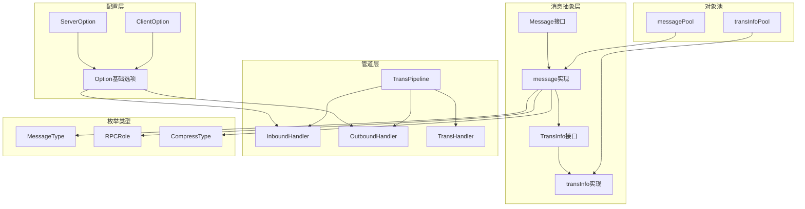

# Kitex-03-Remote-数据结构

## 核心数据结构UML图

```mermaid
classDiagram
    class Message {
        <<interface>>
        +RPCInfo() rpcinfo.RPCInfo
        +Data() interface{}
        +NewData(method string) bool
        +MessageType() MessageType
        +SetMessageType(MessageType)
        +RPCRole() RPCRole
        +PayloadLen() int
        +SetPayloadLen(size int)
        +TransInfo() TransInfo
        +Tags() map[string]interface{}
        +PayloadCodec() PayloadCodec
        +SetPayloadCodec(pc PayloadCodec)
        +Recycle()
    }
    
    class message {
        -msgType MessageType
        -data interface{}
        -rpcInfo rpcinfo.RPCInfo
        -rpcRole RPCRole
        -compressType CompressType
        -payloadSize int
        -transInfo TransInfo
        -tags map[string]interface{}
        -payloadCodec PayloadCodec
        +zero()
        +Recycle()
    }
    
    class TransInfo {
        <<interface>>
        +TransStrInfo() map[string]string
        +TransIntInfo() map[uint16]string
        +PutTransIntInfo(map[uint16]string)
        +PutTransStrInfo(kvInfo map[string]string)
        +Recycle()
    }
    
    class transInfo {
        -strInfo map[string]string
        -intInfo map[uint16]string
        +zero()
        +Recycle()
    }
    
    class ServerOption {
        +SvcSearcher ServiceSearcher
        +TransServerFactory TransServerFactory
        +SvrHandlerFactory ServerTransHandlerFactory
        +Codec Codec
        +PayloadCodec PayloadCodec
        +Listener net.Listener
        +Address net.Addr
        +ReusePort bool
        +ExitWaitTime time.Duration
        +AcceptFailedDelayTime time.Duration
        +MaxConnectionIdleTime time.Duration
        +ReadWriteTimeout time.Duration
        +TracerCtl *rpcinfo.TraceController
        +GRPCCfg *grpc.ServerConfig
        +TTHeaderStreamingOptions TTHeaderStreamingOptions
        +CompatibleMiddlewareForUnary bool
    }
    
    class ClientOption {
        +SvcInfo *serviceinfo.ServiceInfo
        +CliHandlerFactory ClientTransHandlerFactory
        +Codec Codec
        +PayloadCodec PayloadCodec
        +ConnPool ConnPool
        +Dialer Dialer
        +EnableConnPoolReporter bool
        +GRPCStreamingCliHandlerFactory ClientTransHandlerFactory
        +GRPCStreamingConnPool ConnPool
        +TTHeaderStreamingCliHandlerFactory ClientStreamFactory
    }
    
    class Option {
        +Outbounds []OutboundHandler
        +Inbounds []InboundHandler
        +StreamingMetaHandlers []StreamingMetaHandler
        +PrependBoundHandler(h BoundHandler)
        +AppendBoundHandler(h BoundHandler)
    }
    
    class TransPipeline {
        -netHdlr TransHandler
        -inboundHdrls []InboundHandler
        -outboundHdrls []OutboundHandler
        +AddInboundHandler(hdlr InboundHandler) *TransPipeline
        +AddOutboundHandler(hdlr OutboundHandler) *TransPipeline
        +Write(ctx context.Context, conn net.Conn, sendMsg Message) (context.Context, error)
        +OnMessage(ctx context.Context, args, result Message) (context.Context, error)
    }
    
    class MessageType {
        <<enumeration>>
        InvalidMessageType = 0
        Call = 1
        Reply = 2
        Exception = 3
        Oneway = 4
        Stream = 5
        Heartbeat = 6
    }
    
    class RPCRole {
        <<enumeration>>
        Client
        Server
    }
    
    class CompressType {
        <<enumeration>>
        NoCompress
        Gzip
        Snappy
    }
    
    Message <|-- message
    TransInfo <|-- transInfo
    message --> MessageType
    message --> RPCRole
    message --> CompressType
    message --> TransInfo
    ServerOption --> Option
    ClientOption --> Option
    TransPipeline --> TransHandler
    TransPipeline --> InboundHandler
    TransPipeline --> OutboundHandler
```

## 主要数据结构详解

### 1. Message消息核心结构

```go
// Message接口定义
type Message interface {
    RPCInfo() rpcinfo.RPCInfo                    // RPC调用信息
    Data() interface{}                           // 消息数据
    NewData(method string) (ok bool)             // 创建新数据
    MessageType() MessageType                    // 消息类型
    SetMessageType(MessageType)                  // 设置消息类型
    RPCRole() RPCRole                           // RPC角色
    PayloadLen() int                            // 负载长度
    SetPayloadLen(size int)                     // 设置负载长度
    TransInfo() TransInfo                       // 传输信息
    Tags() map[string]interface{}               // 标签信息
    PayloadCodec() PayloadCodec                 // 负载编解码器
    SetPayloadCodec(pc PayloadCodec)            // 设置编解码器
    Recycle()                                   // 回收消息
}

// message实现结构
type message struct {
    msgType      MessageType                    // 消息类型
    data         interface{}                    // 消息数据
    rpcInfo      rpcinfo.RPCInfo               // RPC信息
    rpcRole      RPCRole                       // RPC角色
    compressType CompressType                  // 压缩类型
    payloadSize  int                           // 负载大小
    transInfo    TransInfo                     // 传输信息
    tags         map[string]interface{}        // 标签映射
    payloadCodec PayloadCodec                  // 负载编解码器
}
```

**字段映射与说明**：

| 字段 | 类型 | 必填 | 默认值 | 约束 | 说明 |
|------|------|------|--------|------|------|
| msgType | MessageType | 是 | InvalidMessageType | 枚举值 | 消息类型：Call/Reply/Exception/Oneway/Stream/Heartbeat |
| data | interface{} | 否 | nil | - | 业务数据，请求参数或响应结果 |
| rpcInfo | rpcinfo.RPCInfo | 是 | nil | 非空 | RPC调用元信息，包含服务名、方法名等 |
| rpcRole | RPCRole | 是 | -1 | Client/Server | RPC调用中的角色标识 |
| compressType | CompressType | 否 | NoCompress | 枚举值 | 数据压缩类型 |
| payloadSize | int | 是 | 0 | >=0 | 序列化后的负载数据字节长度 |
| transInfo | TransInfo | 是 | nil | 非空 | 传输层元信息，协议头信息 |
| tags | map[string]interface{} | 是 | make(map) | 非空 | 用户自定义标签和框架内部标记 |
| payloadCodec | PayloadCodec | 否 | nil | - | 负载数据的编解码器 |

**生命周期管理**：
```go
// 创建消息
func NewMessage(data interface{}, ri rpcinfo.RPCInfo, msgType MessageType, rpcRole RPCRole) Message {
    msg := messagePool.Get().(*message)  // 从对象池获取
    msg.data = data
    msg.rpcInfo = ri
    msg.msgType = msgType
    msg.rpcRole = rpcRole
    msg.transInfo = transInfoPool.Get().(*transInfo)  // 获取传输信息
    return msg
}

// 回收消息
func (m *message) Recycle() {
    m.zero()              // 清零所有字段
    messagePool.Put(m)    // 放回对象池
}
```

### 2. TransInfo传输信息结构

```go
// TransInfo接口定义
type TransInfo interface {
    TransStrInfo() map[string]string             // 字符串类型传输信息
    TransIntInfo() map[uint16]string             // 整数类型传输信息
    PutTransIntInfo(map[uint16]string)           // 设置整数传输信息
    PutTransStrInfo(kvInfo map[string]string)    // 设置字符串传输信息
    Recycle()                                    // 回收传输信息
}

// transInfo实现结构
type transInfo struct {
    strInfo map[string]string    // 字符串键值对信息
    intInfo map[uint16]string    // 整数键值对信息
}
```

**字段说明与约束**：

| 字段 | 类型 | 用途 | 约束 | 说明 |
|------|------|------|------|------|
| strInfo | map[string]string | 协议头信息 | 键值对格式 | 存储字符串类型的传输元信息，如HTTP头 |
| intInfo | map[uint16]string | 协议标识 | 键为uint16 | 存储数字标识的传输信息，如协议ID |

**核心方法实现**：
```go
// 合并字符串传输信息
func (ti *transInfo) PutTransStrInfo(kvInfo map[string]string) {
    if kvInfo == nil {
        return
    }
    if len(ti.strInfo) == 0 {
        ti.strInfo = kvInfo  // 直接赋值
    } else {
        for k, v := range kvInfo {
            ti.strInfo[k] = v  // 逐个合并
        }
    }
}

// 回收传输信息
func (ti *transInfo) Recycle() {
    ti.zero()              // 清理映射
    transInfoPool.Put(ti)  // 放回对象池
}
```

### 3. ServerOption服务端配置结构

```go
type ServerOption struct {
    // 核心组件
    SvcSearcher       ServiceSearcher              // 服务搜索器
    TransServerFactory TransServerFactory          // 传输服务器工厂
    SvrHandlerFactory ServerTransHandlerFactory    // 服务端处理器工厂
    Codec             Codec                        // 编解码器
    PayloadCodec      PayloadCodec                 // 负载编解码器
    
    // 网络配置
    Listener          net.Listener                 // 网络监听器
    Address           net.Addr                     // 监听地址
    ReusePort         bool                         // 端口复用
    
    // 超时配置
    ExitWaitTime            time.Duration          // 优雅停机等待时间
    AcceptFailedDelayTime   time.Duration          // 接受连接失败延迟时间
    MaxConnectionIdleTime   time.Duration          // 连接最大空闲时间
    ReadWriteTimeout        time.Duration          // 读写超时时间
    
    // 功能组件
    InitOrResetRPCInfoFunc func(rpcinfo.RPCInfo, net.Addr) rpcinfo.RPCInfo  // RPC信息初始化函数
    TracerCtl              *rpcinfo.TraceController                          // 链路追踪控制器
    Profiler               profiler.Profiler                                 // 性能分析器
    
    // 协议支持
    GRPCCfg                        *grpc.ServerConfig                        // gRPC配置
    GRPCUnknownServiceHandler      func(ctx context.Context, method string, stream streaming.Stream) error  // gRPC未知服务处理器
    TTHeaderStreamingOptions       TTHeaderStreamingOptions                  // TTHeader流式选项
    CompatibleMiddlewareForUnary   bool                                      // 一元调用中间件兼容性
    
    // 基础选项
    Option  // 嵌入基础选项
}
```

**配置分类与说明**：

1. **核心组件配置**：
   - `SvcSearcher`：服务发现和路由组件
   - `TransServerFactory`：传输服务器创建工厂
   - `Codec/PayloadCodec`：消息编解码组件

2. **网络配置**：
   - `Listener/Address`：网络监听配置
   - `ReusePort`：支持端口复用，提高性能

3. **超时配置**：
   - `ExitWaitTime`：优雅停机等待时间
   - `ReadWriteTimeout`：读写操作超时时间
   - `MaxConnectionIdleTime`：连接空闲超时时间

4. **协议支持**：
   - `GRPCCfg`：gRPC协议特定配置
   - `TTHeaderStreamingOptions`：TTHeader流式协议配置

### 4. ClientOption客户端配置结构

```go
type ClientOption struct {
    // 服务信息
    SvcInfo *serviceinfo.ServiceInfo              // 服务信息
    
    // 核心组件
    CliHandlerFactory ClientTransHandlerFactory   // 客户端处理器工厂
    Codec             Codec                       // 编解码器
    PayloadCodec      PayloadCodec                // 负载编解码器
    
    // 连接管理
    ConnPool          ConnPool                    // 连接池
    Dialer            Dialer                      // 连接拨号器
    
    // 监控配置
    EnableConnPoolReporter bool                   // 启用连接池报告
    
    // 流式支持
    GRPCStreamingCliHandlerFactory    ClientTransHandlerFactory  // gRPC流式处理器工厂
    GRPCStreamingConnPool             ConnPool                   // gRPC流式连接池
    TTHeaderStreamingCliHandlerFactory ClientStreamFactory       // TTHeader流式工厂
    
    // 基础选项
    Option  // 嵌入基础选项
}
```

**客户端特定配置**：

| 配置项 | 类型 | 必填 | 说明 |
|--------|------|------|------|
| SvcInfo | *serviceinfo.ServiceInfo | 是 | 目标服务的元信息 |
| ConnPool | ConnPool | 是 | 连接池实现，管理到服务端的连接 |
| Dialer | Dialer | 是 | 网络连接拨号器 |
| EnableConnPoolReporter | bool | 否 | 是否启用连接池监控报告 |

### 5. Option基础选项结构

```go
type Option struct {
    Outbounds             []OutboundHandler        // 出站处理器列表
    Inbounds              []InboundHandler         // 入站处理器列表
    StreamingMetaHandlers []StreamingMetaHandler   // 流式元信息处理器
}

// 处理器管理方法
func (o *Option) PrependBoundHandler(h BoundHandler) {
    switch v := h.(type) {
    case DuplexBoundHandler:
        o.Inbounds = append([]InboundHandler{v}, o.Inbounds...)
        o.Outbounds = append([]OutboundHandler{v}, o.Outbounds...)
    case InboundHandler:
        o.Inbounds = append([]InboundHandler{v}, o.Inbounds...)
    case OutboundHandler:
        o.Outbounds = append([]OutboundHandler{v}, o.Outbounds...)
    }
}
```

**处理器类型**：
- **InboundHandler**：处理入站数据（接收）
- **OutboundHandler**：处理出站数据（发送）
- **DuplexBoundHandler**：同时处理入站和出站数据

### 6. TransPipeline传输管道结构

```go
type TransPipeline struct {
    netHdlr       TransHandler        // 网络处理器
    inboundHdrls  []InboundHandler    // 入站处理器链
    outboundHdrls []OutboundHandler   // 出站处理器链
}
```

**管道处理流程**：
```go
// 出站处理（发送消息）
func (p *TransPipeline) Write(ctx context.Context, conn net.Conn, sendMsg Message) (context.Context, error) {
    // 1. 依次执行出站处理器
    for _, h := range p.outboundHdrls {
        ctx, err = h.Write(ctx, conn, sendMsg)
        if err != nil {
            return ctx, err
        }
    }
    // 2. 执行网络处理器
    return p.netHdlr.Write(ctx, conn, sendMsg)
}

// 入站处理（接收消息）
func (p *TransPipeline) OnMessage(ctx context.Context, args, result Message) (context.Context, error) {
    var err error
    // 1. 依次执行入站处理器
    for _, h := range p.inboundHdrls {
        ctx, err = h.OnMessage(ctx, args, result)
        if err != nil {
            return ctx, err
        }
    }
    // 2. 执行网络处理器
    return p.netHdlr.OnMessage(ctx, args, result)
}
```

### 7. 枚举类型定义

#### MessageType消息类型
```go
type MessageType int32

const (
    InvalidMessageType MessageType = 0  // 无效消息类型
    Call               MessageType = 1  // 调用请求
    Reply              MessageType = 2  // 响应消息
    Exception          MessageType = 3  // 异常消息
    Oneway             MessageType = 4  // 单向调用（无需响应）
    Stream             MessageType = 5  // 流式消息
    Heartbeat          MessageType = 6  // 心跳消息
)
```

#### RPCRole角色类型
```go
type RPCRole int

const (
    Client RPCRole = 1  // 客户端角色
    Server RPCRole = 2  // 服务端角色
)
```

#### CompressType压缩类型
```go
type CompressType int

const (
    NoCompress CompressType = 0  // 无压缩
    Gzip       CompressType = 1  // Gzip压缩
    Snappy     CompressType = 2  // Snappy压缩
)
```

## 数据结构关系图



## 内存管理与性能优化

### 1. 对象池优化

**消息对象池**：
```go
var messagePool = &sync.Pool{
    New: func() interface{} {
        return &message{tags: make(map[string]interface{})}
    },
}

var transInfoPool = &sync.Pool{
    New: func() interface{} {
        return &transInfo{
            intInfo: make(map[uint16]string),
            strInfo: make(map[string]string),
        }
    },
}
```

**优化要点**：
- 使用sync.Pool减少GC压力
- 预分配map容量，减少扩容开销
- 及时回收对象，避免内存泄漏

### 2. 零值重置优化

**消息零值重置**：
```go
func (m *message) zero() {
    m.msgType = InvalidMessageType
    m.data = nil
    m.rpcInfo = nil
    m.rpcRole = -1
    m.compressType = NoCompress
    m.payloadSize = 0
    if m.transInfo != nil {
        m.transInfo.Recycle()  // 递归回收
        m.transInfo = nil
    }
    for k := range m.tags {
        delete(m.tags, k)      // 清理map
    }
}
```

**优化策略**：
- 彻底清理所有字段，防止数据泄漏
- 递归回收嵌套对象
- 高效清理map和slice

### 3. 配置结构优化

**嵌入式设计**：
```go
type ServerOption struct {
    // 具体字段...
    Option  // 嵌入基础选项，减少重复代码
}

type ClientOption struct {
    // 具体字段...
    Option  // 嵌入基础选项
}
```

**优化效果**：
- 减少代码重复，提高维护性
- 统一处理器管理接口
- 支持配置继承和扩展

### 4. 管道处理优化

**处理器链优化**：
```go
// 预分配处理器切片容量
func NewTransPipeline(netHdlr TransHandler) *TransPipeline {
    return &TransPipeline{
        netHdlr:       netHdlr,
        inboundHdrls:  make([]InboundHandler, 0, 4),   // 预分配容量
        outboundHdrls: make([]OutboundHandler, 0, 4),  // 预分配容量
    }
}
```

**性能优化**：
- 预分配切片容量，减少扩容开销
- 按顺序执行处理器，支持短路返回
- 错误快速传播，避免无效处理

### 5. 标签管理优化

**标签映射优化**：
```go
// 高效的标签操作
func (m *message) SetTag(key string, value interface{}) {
    if m.tags == nil {
        m.tags = make(map[string]interface{}, 4)  // 预分配容量
    }
    m.tags[key] = value
}

func (m *message) GetTag(key string) (interface{}, bool) {
    if m.tags == nil {
        return nil, false
    }
    value, exists := m.tags[key]
    return value, exists
}
```

**优化要点**：
- 延迟初始化标签映射
- 预分配合理的初始容量
- 提供高效的标签操作接口

这个数据结构文档详细介绍了Remote模块的核心数据结构、字段含义、关系图和性能优化策略，为开发者理解和扩展Remote功能提供了完整的参考。
