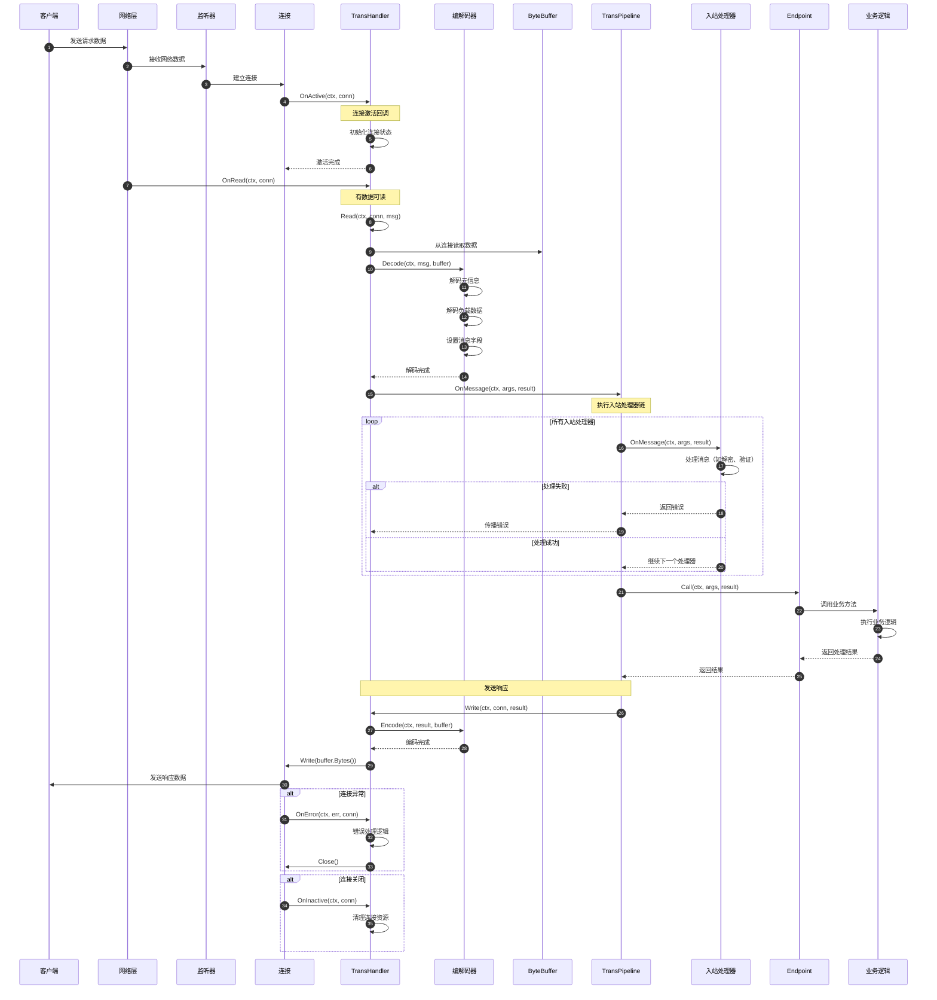

# Kitex-03-Remote-时序图

## 1. 消息创建与回收时序图

### 消息生命周期说明

**1. 创建阶段（步骤1-8）**
- 客户端调用NewMessage创建消息实例
- 从messagePool对象池获取message实例
- 初始化消息的基本字段（数据、RPC信息、类型、角色）
- 从transInfoPool获取TransInfo实例并关联

**2. 配置阶段（步骤9-12）**
- 设置负载编解码器
- 添加用户自定义标签
- 设置传输层元信息（如HTTP头）

**3. 使用阶段（步骤13-16）**
- 编解码器读取消息字段进行序列化
- 传输信息用于协议头构建
- 完成网络传输

**4. 回收阶段（步骤17-22）**
- 调用Recycle方法回收消息
- zero方法清理所有字段防止内存泄漏
- 递归回收TransInfo实例
- 将对象放回对象池供下次使用

## 2. 客户端消息发送时序图

### 发送流程说明

**1. 连接获取阶段（步骤1-8）**
- 客户端发起发送请求
- 从连接池获取到目标服务的连接
- 优先使用池中现有连接，无可用连接时创建新连接
- 设置连接的超时和缓冲区参数

**2. 管道处理阶段（步骤9-18）**
- 进入传输管道的出站处理流程
- 依次执行所有出站处理器（如加密、压缩、监控）
- 任何处理器失败都会中断管道执行
- 最后由TransHandler执行实际的网络写入

**3. 编码发送阶段（步骤19-27）**
- TransHandler调用编解码器编码消息
- 编码器分别处理元信息和负载数据
- 将编码结果写入网络连接
- 数据通过网络发送到服务端

**4. 结果处理阶段（步骤28-35）**
- 根据发送结果决定连接的处理方式
- 发送成功时保持连接供后续复用
- 发送失败时关闭连接并从池中移除
- 向客户端返回最终的发送结果

## 3. 服务端消息接收时序图

### 接收处理说明

**1. 连接建立阶段（步骤1-6）**
- 客户端发送请求到服务端
- 网络监听器接收连接请求
- TransHandler的OnActive回调处理连接激活
- 初始化连接相关的状态和资源

**2. 数据读取阶段（步骤7-13）**
- OnRead回调通知有数据可读
- TransHandler从连接读取原始数据
- 调用编解码器解码消息
- 设置Message对象的各个字段

**3. 管道处理阶段（步骤14-24）**
- 进入传输管道的入站处理流程
- 依次执行所有入站处理器（如解密、验证、日志）
- 处理器可以修改消息内容或中断处理
- 最终调用业务Endpoint处理请求

**4. 业务处理阶段（步骤25-29）**
- Endpoint调用具体的业务方法
- 执行业务逻辑并生成响应结果
- 将结果封装到响应Message中

**5. 响应发送阶段（步骤30-35）**
- 通过相同的管道发送响应消息
- 编码响应并写入网络连接
- 将响应数据发送回客户端

**6. 异常处理阶段（步骤36-42）**
- OnError处理各种网络和协议错误
- OnInactive处理连接关闭事件
- 正确清理连接相关的资源

## 4. 传输管道处理时序图

### 管道处理说明

**1. 出站处理流程（步骤1-23）**
- 请求进入传输管道进行出站处理
- 按顺序执行出站处理器：日志→压缩→加密
- 每个处理器都可能失败并中断后续处理
- 最终由网络处理器完成实际的网络发送
- 错误会逐层向上传播到管道调用方

**2. 入站处理流程（步骤24-47）**
- 网络数据进入管道进行入站处理
- 按顺序执行入站处理器：解密→解压缩→验证
- 处理顺序与出站相反，实现对称处理
- 最终调用业务逻辑处理请求
- 业务结果逐层返回到网络层

**3. 错误处理机制**
- 任何处理器失败都会中断管道执行
- 错误信息包含失败的具体原因和位置
- 支持错误恢复和降级处理策略
- 错误统计和监控便于问题排查

## 5. 连接池管理时序图

### 连接池管理说明

**1. 连接获取流程（步骤1-21）**
- 客户端请求获取到指定地址的连接
- 根据地址获取对应的连接池，不存在则创建
- 优先从池中获取可用连接，检查连接健康状态
- 池中无可用连接时通过Dialer创建新连接
- 设置连接参数并注册监控

**2. 连接使用阶段（步骤22-24）**
- 客户端使用连接执行RPC调用
- 连接承载实际的网络通信
- 记录连接的使用统计信息

**3. 连接归还流程（步骤25-35）**
- 客户端归还连接到连接池
- 根据调用结果决定连接的处理方式
- 有错误时直接关闭连接
- 无错误时检查连接可复用性，决定是否放回池中

**4. 后台清理流程（步骤36-46）**
- 定期扫描所有连接池
- 清理空闲超时的连接
- 删除长时间未使用的地址池
- 更新清理统计信息

**5. 监控统计**
- 连接创建、复用、关闭的统计
- 连接池大小和使用率监控
- 错误率和性能指标统计
- 支持连接池健康状态报告

## 6. 编解码处理时序图

### 编解码处理说明

**1. 编码流程（步骤1-20）**
- 客户端调用Codec进行消息编码
- 检查是否支持MetaEncoder接口
- 支持时使用统一的EncodeMetaAndPayload方法
- 不支持时分别编码元信息和负载
- 根据配置决定是否压缩负载数据
- 将完整的编码结果写入ByteBuffer

**2. 解码流程（步骤21-40）**
- 服务端调用Codec进行消息解码
- 检查是否支持MetaDecoder接口
- 首先解码协议头和元信息
- 然后解码负载数据
- 根据协议头信息决定是否解压缩
- 反序列化得到最终的业务对象

**3. 压缩处理**
- 编码时根据配置和数据大小决定是否压缩
- 支持多种压缩算法（Gzip、Snappy等）
- 解码时根据协议头标识进行相应解压缩
- 压缩可以显著减少网络传输数据量

**4. 协议适配**
- 支持不同协议的元信息格式
- 兼容协议版本升级和降级
- 处理协议特定的编解码逻辑
- 提供协议无关的统一接口

## 时序图总结

这些时序图展示了Remote模块的完整工作流程：

1. **消息生命周期**：从创建到回收的完整过程，展示了对象池的优化机制
2. **客户端发送**：从连接获取到数据发送的完整链路，包含管道处理
3. **服务端接收**：从数据接收到业务处理的完整流程，包含异常处理
4. **传输管道**：出站和入站处理器的执行顺序和错误传播机制
5. **连接池管理**：连接的获取、使用、归还和清理的完整生命周期
6. **编解码处理**：消息序列化和反序列化的详细过程，包含压缩处理

每个时序图都包含了详细的步骤说明和关键节点分析，帮助开发者理解Remote模块的内部工作机制、扩展点和性能优化策略。
