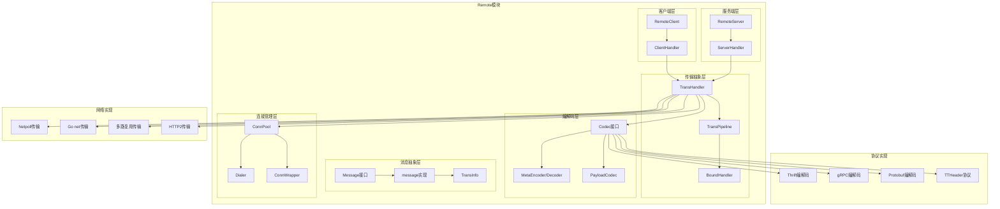

# Kitex-03-Remote-概览

## 模块职责与边界

### 核心职责
Remote模块是Kitex框架的传输层核心，负责处理网络通信和协议编解码。主要职责包括：
- **网络传输管理**：提供统一的网络I/O抽象，支持多种传输协议
- **协议编解码**：支持Thrift、gRPC、Protobuf等多种序列化协议
- **连接池管理**：管理客户端连接池，支持长连接和短连接
- **消息抽象**：提供统一的消息模型，封装请求和响应数据
- **传输管道**：支持可扩展的传输处理管道，类似Netty的Pipeline
- **多路复用**：支持连接多路复用，提高网络利用率

### 输入输出
- **输入**：业务请求对象、网络连接、配置选项
- **输出**：编码后的网络数据、解码后的业务对象、传输状态
- **上游依赖**：Client和Server模块的调用请求
- **下游依赖**：Netpoll网络库、具体的编解码器实现

### 生命周期
1. **初始化阶段**：创建传输处理器和编解码器
2. **连接建立**：建立网络连接，初始化传输管道
3. **消息传输**：处理请求和响应的编解码与传输
4. **连接管理**：维护连接状态，处理连接复用和回收
5. **资源清理**：关闭连接，清理传输资源

## 模块架构图



### 架构说明

**1. 分层设计**
- **传输抽象层**：定义传输处理器和管道的核心接口
- **消息抽象层**：提供统一的消息模型和传输信息
- **编解码层**：支持多种协议的编码和解码
- **连接管理层**：管理网络连接的创建、复用和回收
- **客户端/服务端层**：提供面向客户端和服务端的传输实现

**2. 组件交互**
- TransHandler是传输处理的核心接口
- TransPipeline提供可扩展的处理管道
- Message统一抽象请求和响应消息
- Codec提供协议无关的编解码接口
- ConnPool管理连接的生命周期

**3. 扩展机制**
- 支持自定义传输协议和编解码器
- 提供BoundHandler扩展点
- 支持多种网络传输实现
- 可插拔的连接池策略

## 核心算法与流程

### 消息传输核心流程

```go
// 客户端发送消息流程
func (c *client) Send(ctx context.Context, ri rpcinfo.RPCInfo, req remote.Message) (err error) {
    // 1. 通过传输处理器写入消息
    _, err = c.transHdlr.Write(ctx, c.conn, req)
    if err != nil {
        // 2. 发送失败时释放连接
        c.connManager.ReleaseConn(err, ri)
    }
    return err
}

// 客户端接收消息流程
func (c *client) Recv(ctx context.Context, ri rpcinfo.RPCInfo, resp remote.Message) (err error) {
    if resp != nil {
        // 1. 通过传输处理器读取消息
        ctx, err = c.transHdlr.Read(ctx, c.conn, resp)
        // 2. 处理接收到的消息
        c.transHdlr.OnMessage(ctx, nil, resp)
    } else {
        // 3. 单向调用等待数据刷新
        time.Sleep(time.Millisecond / 2)
    }
    
    // 4. 释放连接回连接池
    c.connManager.ReleaseConn(err, ri)
    return err
}
```

**传输流程说明**：
1. **消息发送**：通过TransHandler的Write方法发送消息
2. **消息接收**：通过TransHandler的Read方法接收消息
3. **消息处理**：通过OnMessage方法处理接收到的消息
4. **连接管理**：根据传输结果决定连接的复用或释放

### 传输管道处理流程

```go
func (p *TransPipeline) Write(ctx context.Context, conn net.Conn, sendMsg Message) (nctx context.Context, err error) {
    // 1. 依次执行出站处理器
    for _, h := range p.outboundHdrls {
        ctx, err = h.Write(ctx, conn, sendMsg)
        if err != nil {
            return ctx, err
        }
    }
    // 2. 执行网络处理器
    return p.netHdlr.Write(ctx, conn, sendMsg)
}

func (p *TransPipeline) OnMessage(ctx context.Context, args, result Message) (context.Context, error) {
    // 1. 依次执行入站处理器
    for _, h := range p.inboundHdrls {
        ctx, err = h.OnMessage(ctx, args, result)
        if err != nil {
            return ctx, err
        }
    }
    // 2. 执行网络处理器
    return p.netHdlr.OnMessage(ctx, args, result)
}
```

**管道处理说明**：
1. **出站处理**：消息发送时依次执行出站处理器
2. **入站处理**：消息接收时依次执行入站处理器
3. **网络处理**：最终由网络处理器执行实际的网络I/O
4. **错误处理**：任何处理器出错都会中断管道执行

### 消息编解码流程

```go
// 编码流程
func (c *defaultCodec) Encode(ctx context.Context, msg Message, out ByteBuffer) error {
    // 1. 编码元信息和负载
    if me, ok := c.payloadCodec.(MetaEncoder); ok {
        return me.EncodeMetaAndPayload(ctx, msg, out, me)
    }
    
    // 2. 分别编码元信息和负载
    if err := c.encodeMeta(ctx, msg, out); err != nil {
        return err
    }
    return c.payloadCodec.Marshal(ctx, msg, out)
}

// 解码流程
func (c *defaultCodec) Decode(ctx context.Context, msg Message, in ByteBuffer) error {
    // 1. 解码元信息
    if md, ok := c.payloadCodec.(MetaDecoder); ok {
        if err := md.DecodeMeta(ctx, msg, in); err != nil {
            return err
        }
    }
    
    // 2. 解码负载数据
    return c.payloadCodec.Unmarshal(ctx, msg, in)
}
```

**编解码流程说明**：
1. **元信息处理**：首先处理协议头和元信息
2. **负载处理**：然后处理实际的业务数据
3. **协议适配**：支持不同协议的编解码策略
4. **错误处理**：编解码失败时返回具体错误信息

### 连接池管理流程

```go
// 获取连接
func (p *LongPool) Get(ctx context.Context, network, address string, opt *ConnOption) (net.Conn, error) {
    // 1. 从连接池获取可用连接
    if conn := p.tryGetConn(address); conn != nil {
        return conn, nil
    }
    
    // 2. 连接池无可用连接，创建新连接
    conn, err := opt.Dialer.DialContext(ctx, network, address)
    if err != nil {
        return nil, err
    }
    
    // 3. 设置连接参数
    if err := p.setConnOptions(conn, opt); err != nil {
        conn.Close()
        return nil, err
    }
    
    return conn, nil
}

// 释放连接
func (p *LongPool) Put(conn net.Conn, err error) {
    if err != nil {
        // 1. 有错误时直接关闭连接
        conn.Close()
        return
    }
    
    // 2. 检查连接是否可复用
    if !p.isReusable(conn) {
        conn.Close()
        return
    }
    
    // 3. 放回连接池
    p.putConn(conn)
}
```

**连接池管理说明**：
1. **连接获取**：优先从池中获取，无可用连接时创建新连接
2. **连接配置**：设置超时、缓冲区等连接参数
3. **连接释放**：根据错误状态和连接状态决定复用或关闭
4. **连接清理**：定期清理空闲超时的连接

## 性能优化要点

### 1. 内存管理优化
- **对象池**：Message和TransInfo使用对象池减少分配
- **缓冲区复用**：ByteBuffer支持缓冲区复用和扩容
- **零拷贝**：支持零拷贝的网络数据传输
- **内存预分配**：预分配常用大小的缓冲区

### 2. 网络传输优化
- **连接复用**：长连接池减少连接建立开销
- **多路复用**：单连接支持并发请求处理
- **批量处理**：支持批量读写网络数据
- **异步I/O**：基于Netpoll的高性能异步网络处理

### 3. 编解码优化
- **快速编解码**：使用高性能的Thrift和Protobuf编解码器
- **流式处理**：支持流式编解码，减少内存占用
- **编解码缓存**：缓存编解码结果，避免重复计算
- **协议优化**：针对不同协议进行特定优化

### 4. 传输管道优化
- **管道缓存**：预构建传输管道，避免运行时创建
- **处理器复用**：复用BoundHandler实例
- **条件执行**：根据配置有条件地执行处理器
- **短路优化**：支持处理器短路返回

### 5. 连接管理优化
- **连接池分片**：使用分片连接池减少锁竞争
- **连接预热**：预创建连接避免首次调用延迟
- **健康检查**：定期检查连接健康状态
- **优雅关闭**：支持连接的优雅关闭和资源清理

### 6. 协议特定优化
- **TTHeader优化**：针对TTHeader协议的特定优化
- **gRPC兼容**：与标准gRPC协议的高效兼容
- **HTTP2支持**：原生支持HTTP2协议特性
- **压缩算法**：支持多种数据压缩算法

## 扩展点设计

### 1. 自定义传输协议
```go
// 实现自定义的传输处理器
type CustomTransHandler struct {
    // 自定义字段
}

func (h *CustomTransHandler) Write(ctx context.Context, conn net.Conn, send Message) (context.Context, error) {
    // 自定义写入逻辑
}

func (h *CustomTransHandler) Read(ctx context.Context, conn net.Conn, msg Message) (context.Context, error) {
    // 自定义读取逻辑
}
```

### 2. 自定义编解码器
```go
// 实现自定义的编解码器
type CustomCodec struct {
    // 自定义字段
}

func (c *CustomCodec) Encode(ctx context.Context, msg Message, out ByteBuffer) error {
    // 自定义编码逻辑
}

func (c *CustomCodec) Decode(ctx context.Context, msg Message, in ByteBuffer) error {
    // 自定义解码逻辑
}
```

### 3. 自定义BoundHandler
```go
// 实现自定义的边界处理器
type CustomBoundHandler struct {
    // 自定义字段
}

func (h *CustomBoundHandler) Write(ctx context.Context, conn net.Conn, send Message) (context.Context, error) {
    // 自定义出站处理逻辑
}

func (h *CustomBoundHandler) OnMessage(ctx context.Context, args, result Message) (context.Context, error) {
    // 自定义入站处理逻辑
}
```

这个概览文档详细介绍了Remote模块的架构设计、核心流程和性能优化策略。Remote模块作为Kitex的传输层核心，提供了高度可扩展和高性能的网络通信能力。
