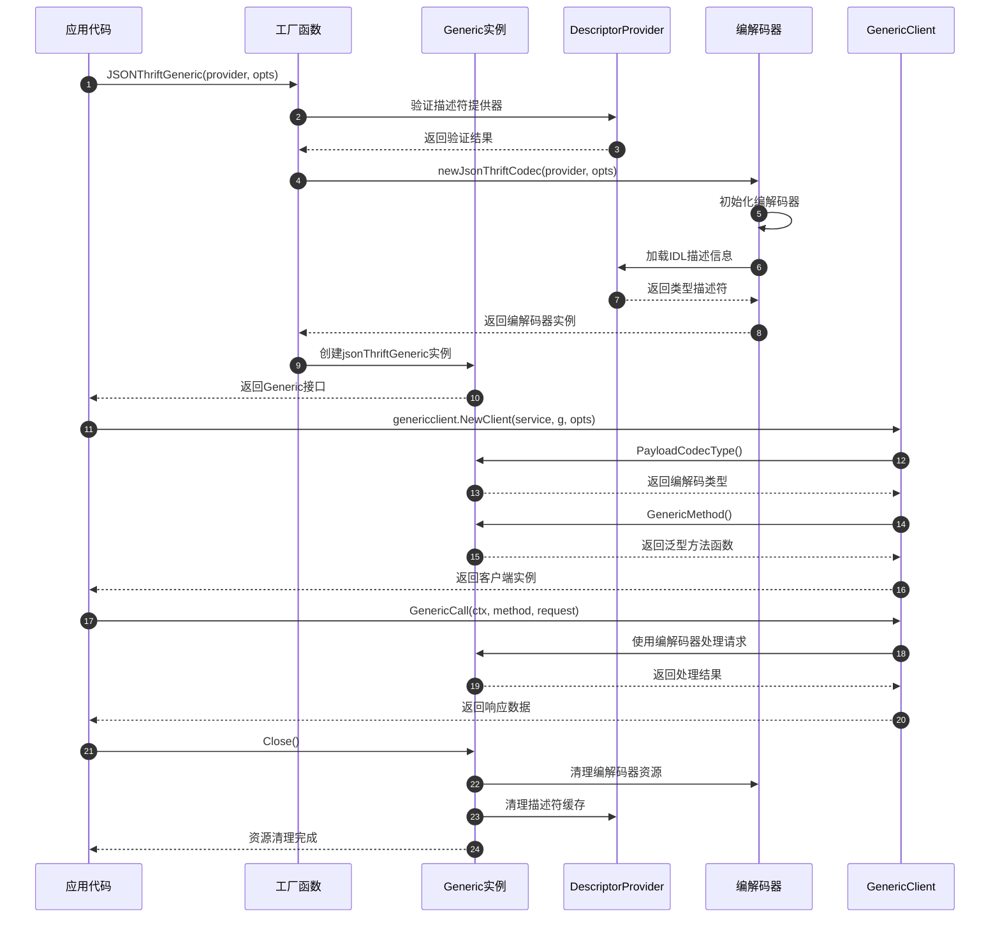
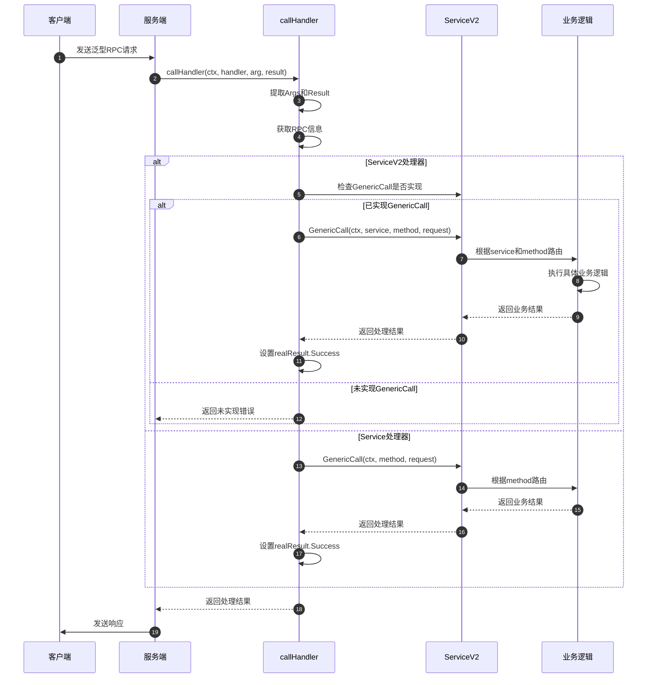
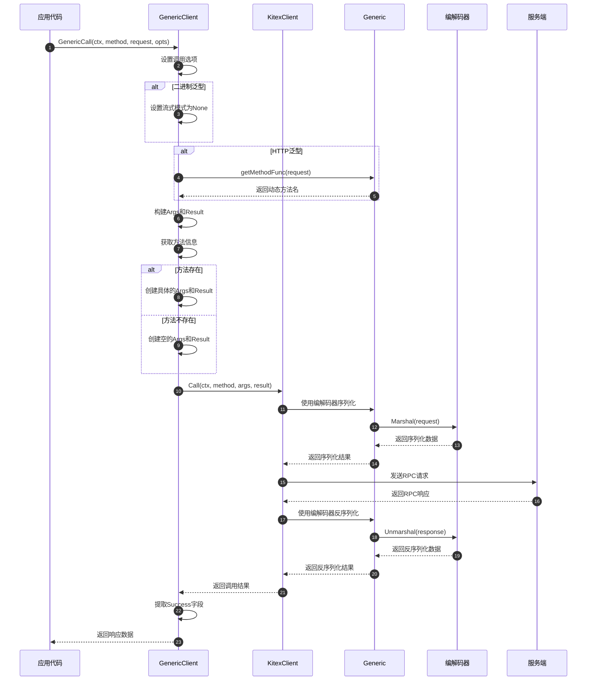

# Kitex-04-Generic-API

## API概览

Generic模块提供了泛型调用的核心API，主要包括：
- **Generic接口**：泛型调用的核心抽象接口
- **Service接口**：泛型服务处理接口
- **Client接口**：泛型客户端调用接口
- **工厂函数**：各种泛型实现的创建函数
- **配置函数**：泛型行为的配置函数

## 1. Generic核心接口

### 基本信息
- 名称：`Generic`
- 协议/方法：接口定义
- 幂等性：是（配置类接口）

### 接口定义
```go
// Generic是泛型调用的核心抽象接口
type Generic interface {
    Closer                                              // 资源清理接口
    PayloadCodecType() serviceinfo.PayloadCodec        // 获取编解码类型
    GenericMethod() serviceinfo.GenericMethodFunc      // 获取泛型方法处理函数
    IDLServiceName() string                            // 获取IDL服务名
    GetExtra(key string) interface{}                   // 获取扩展信息
}

// Closer资源清理接口
type Closer interface {
    Close() error
}
```

| 方法 | 返回类型 | 必填 | 约束 | 说明 |
|------|----------|------|------|------|
| PayloadCodecType | serviceinfo.PayloadCodec | 是 | 枚举值 | 返回支持的编解码类型：Thrift/Protobuf/JSON |
| GenericMethod | serviceinfo.GenericMethodFunc | 是 | 非空函数 | 返回泛型方法处理函数，用于处理泛型调用 |
| IDLServiceName | string | 是 | 非空字符串 | 返回IDL定义的服务名称 |
| GetExtra | interface{} | 否 | - | 根据键获取扩展配置信息 |
| Close | error | 是 | - | 清理Generic实例占用的资源 |

### 工厂函数与关键代码

#### BinaryThriftGenericV2创建
```go
// BinaryThriftGenericV2创建原始Thrift二进制泛型实例
func BinaryThriftGenericV2(serviceName string) Generic {
    return &binaryThriftGenericV2{
        codec: newBinaryThriftCodecV2(serviceName),
    }
}

// 使用示例
g := generic.BinaryThriftGenericV2("EchoService")
cli, err := genericclient.NewClient("destService", g, cliOpts...)
```

#### JSONThriftGeneric创建
```go
// JSONThriftGeneric创建JSON到Thrift的泛型实例
func JSONThriftGeneric(p DescriptorProvider, opts ...Option) (Generic, error) {
    gOpts := &Options{dynamicgoConvOpts: DefaultJSONDynamicGoConvOpts}
    gOpts.apply(opts)
    return &jsonThriftGeneric{codec: newJsonThriftCodec(p, gOpts)}, nil
}

// 使用示例
p, err := generic.NewThriftFileProvider("path/to/idl.thrift")
g, err := generic.JSONThriftGeneric(p)
cli, err := genericclient.NewClient("destService", g, cliOpts...)
```

#### HTTPThriftGeneric创建
```go
// HTTPThriftGeneric创建HTTP到Thrift的泛型实例
func HTTPThriftGeneric(p DescriptorProvider, opts ...Option) (Generic, error) {
    gOpts := &Options{dynamicgoConvOpts: DefaultHTTPDynamicGoConvOpts}
    gOpts.apply(opts)
    return &httpThriftGeneric{codec: newHTTPThriftCodec(p, gOpts)}, nil
}

// 使用示例
p, err := generic.NewThriftFileProvider("path/to/idl.thrift")
g, err := generic.HTTPThriftGeneric(p)
cli, err := genericclient.NewClient("destService", g, cliOpts...)
```

### 时序图（Generic创建→使用→清理）


### 异常/回退与性能要点
- **IDL加载失败**：提供清晰的错误信息，支持重试机制
- **编解码错误**：区分协议错误和数据错误，提供详细错误上下文
- **资源管理**：确保Close方法正确清理所有资源，防止内存泄漏
- **性能优化**：缓存IDL解析结果，复用编解码器实例
- **并发安全**：Generic实例支持并发使用，内部状态不可变

## 2. Service服务接口

### 基本信息
- 名称：`Service`和`ServiceV2`
- 协议/方法：接口定义和结构体
- 幂等性：否（业务逻辑相关）

### 接口定义
```go
// Service是v1版本的泛型服务接口
type Service interface {
    GenericCall(ctx context.Context, method string, request interface{}) (response interface{}, err error)
}

// ServiceV2是v2版本的泛型服务接口，支持流式调用和多服务
type ServiceV2 struct {
    // GenericCall处理一元请求
    GenericCall func(ctx context.Context, service, method string, request interface{}) (response interface{}, err error)
    
    // ClientStreaming处理客户端流式调用
    ClientStreaming func(ctx context.Context, service, method string, stream ClientStreamingServer) (err error)
    
    // ServerStreaming处理服务端流式调用
    ServerStreaming func(ctx context.Context, service, method string, request interface{}, stream ServerStreamingServer) (err error)
    
    // BidiStreaming处理双向流式调用
    BidiStreaming func(ctx context.Context, service, method string, stream BidiStreamingServer) (err error)
}
```

| 方法 | 参数类型 | 必填 | 约束 | 说明 |
|------|----------|------|------|------|
| GenericCall | (context.Context, string, interface{}) | 是 | method非空 | 处理一元泛型调用 |
| GenericCall(V2) | (context.Context, string, string, interface{}) | 否 | service和method非空 | V2版本支持多服务 |
| ClientStreaming | (context.Context, string, string, ClientStreamingServer) | 否 | - | 处理客户端流式调用 |
| ServerStreaming | (context.Context, string, string, interface{}, ServerStreamingServer) | 否 | - | 处理服务端流式调用 |
| BidiStreaming | (context.Context, string, string, BidiStreamingServer) | 否 | - | 处理双向流式调用 |

### 入口函数与关键代码
```go
// 服务处理器调用入口
func callHandler(ctx context.Context, handler, arg, result interface{}) error {
    realArg := arg.(*Args)
    realResult := result.(*Result)
    
    switch svc := handler.(type) {
    case *ServiceV2:
        // 1. 获取RPC调用信息
        ri := rpcinfo.GetRPCInfo(ctx)
        methodName := ri.Invocation().MethodName()
        serviceName := ri.Invocation().ServiceName()
        
        // 2. 检查处理器是否实现
        if svc.GenericCall == nil {
            return errGenericCallNotImplemented
        }
        
        // 3. 调用业务处理器
        success, err := svc.GenericCall(ctx, serviceName, methodName, realArg.Request)
        if err != nil {
            return err
        }
        
        // 4. 设置响应结果
        realResult.Success = success
        return nil
        
    case Service:
        // 兼容v1版本的Service接口
        success, err := handler.(Service).GenericCall(ctx, realArg.Method, realArg.Request)
        if err != nil {
            return err
        }
        realResult.Success = success
        return nil
        
    default:
        return fmt.Errorf("CallHandler: unknown handler type %T", handler)
    }
}
```

### 服务实现示例
```go
// 实现Service接口
type GenericServiceImpl struct{}

func (g *GenericServiceImpl) GenericCall(ctx context.Context, method string, request interface{}) (response interface{}, err error) {
    switch method {
    case "Echo":
        // 处理Echo方法
        return request, nil
    case "Add":
        // 处理Add方法
        req := request.(map[string]interface{})
        a := req["a"].(float64)
        b := req["b"].(float64)
        return map[string]interface{}{"result": a + b}, nil
    default:
        return nil, fmt.Errorf("unknown method: %s", method)
    }
}

// 实现ServiceV2接口
serviceV2 := &generic.ServiceV2{
    GenericCall: func(ctx context.Context, service, method string, request interface{}) (response interface{}, err error) {
        // 支持多服务的泛型调用处理
        switch service {
        case "EchoService":
            return handleEchoService(method, request)
        case "CalcService":
            return handleCalcService(method, request)
        default:
            return nil, fmt.Errorf("unknown service: %s", service)
        }
    },
}
```

### 时序图（服务请求处理）


### 异常/回退与性能要点
- **方法路由**：支持高效的方法名到处理函数的路由
- **错误处理**：提供清晰的错误信息和错误码
- **流式处理**：正确管理流式调用的生命周期
- **并发处理**：支持并发处理多个请求
- **资源管理**：及时清理请求相关的资源

## 3. Client客户端接口

### 基本信息
- 名称：`Client`
- 协议/方法：接口定义
- 幂等性：否（网络调用）

### 接口定义
```go
// Client泛型客户端接口
type Client interface {
    generic.Closer
    
    // GenericCall泛型调用
    GenericCall(ctx context.Context, method string, request interface{}, callOptions ...callopt.Option) (response interface{}, err error)
    
    // ClientStreaming创建客户端流式调用
    ClientStreaming(ctx context.Context, method string, callOptions ...streamcall.Option) (ClientStreamingClient, error)
    
    // ServerStreaming创建服务端流式调用
    ServerStreaming(ctx context.Context, method string, req interface{}, callOptions ...streamcall.Option) (ServerStreamingClient, error)
    
    // BidirectionalStreaming创建双向流式调用
    BidirectionalStreaming(ctx context.Context, method string, callOptions ...streamcall.Option) (BidiStreamingClient, error)
}
```

| 方法 | 参数类型 | 必填 | 约束 | 说明 |
|------|----------|------|------|------|
| GenericCall | (context.Context, string, interface{}, ...callopt.Option) | 是 | method非空 | 执行一元泛型调用 |
| ClientStreaming | (context.Context, string, ...streamcall.Option) | 否 | method非空 | 创建客户端流式调用 |
| ServerStreaming | (context.Context, string, interface{}, ...streamcall.Option) | 否 | method非空 | 创建服务端流式调用 |
| BidirectionalStreaming | (context.Context, string, ...streamcall.Option) | 否 | method非空 | 创建双向流式调用 |

### 入口函数与关键代码
```go
// 创建泛型客户端
func NewClient(destService string, g generic.Generic, opts ...client.Option) (Client, error) {
    // 1. 从Generic创建ServiceInfo
    svcInfo := generic.ServiceInfoWithGeneric(g)
    return NewClientWithServiceInfo(destService, g, svcInfo, opts...)
}

func NewClientWithServiceInfo(destService string, g generic.Generic, svcInfo *serviceinfo.ServiceInfo, opts ...client.Option) (Client, error) {
    // 1. 准备客户端选项
    var options []client.Option
    options = append(options, client.WithGeneric(g))
    options = append(options, client.WithDestService(destService))
    options = append(options, client.WithTransportProtocol(transport.TTHeaderStreaming))
    options = append(options, opts...)
    
    // 2. 创建底层客户端
    kc, err := client.NewClient(svcInfo, options...)
    if err != nil {
        return nil, err
    }
    
    // 3. 创建泛型客户端包装器
    cli := &genericServiceClient{
        svcInfo: svcInfo,
        kClient: kc,
        sClient: kc.(client.Streaming),
        g:       g,
    }
    
    // 4. 设置泛型特定配置
    cli.isBinaryGeneric, _ = g.GetExtra(igeneric.IsBinaryGeneric).(bool)
    cli.getMethodFunc, _ = g.GetExtra(igeneric.GetMethodNameByRequestFuncKey).(generic.GetMethodNameByRequestFunc)
    
    // 5. 设置资源清理
    runtime.SetFinalizer(cli, (*genericServiceClient).Close)
    return cli, nil
}
```

### 泛型调用实现
```go
func (gc *genericServiceClient) GenericCall(ctx context.Context, method string, request interface{}, callOptions ...callopt.Option) (response interface{}, err error) {
    // 1. 设置调用选项
    ctx = client.NewCtxWithCallOptions(ctx, callOptions)
    
    // 2. 处理二进制泛型特殊逻辑
    if gc.isBinaryGeneric {
        ctx = igeneric.WithGenericStreamingMode(ctx, serviceinfo.StreamingNone)
    }
    
    // 3. 动态获取方法名（HTTP泛型）
    if gc.getMethodFunc != nil {
        method, _ = gc.getMethodFunc(request)
    }
    
    // 4. 构建泛型参数和结果
    var _args *generic.Args
    var _result *generic.Result
    mtInfo := gc.svcInfo.MethodInfo(ctx, method)
    if mtInfo != nil {
        _args = mtInfo.NewArgs().(*generic.Args)
        _args.Method = method
        _args.Request = request
        _result = mtInfo.NewResult().(*generic.Result)
    } else {
        _args = &generic.Args{}
        _result = &generic.Result{}
    }
    
    // 5. 执行RPC调用
    if err = gc.kClient.Call(ctx, method, _args, _result); err != nil {
        return
    }
    
    // 6. 返回结果
    return _result.GetSuccess(), nil
}
```

### 时序图（客户端调用）


### 异常/回退与性能要点
- **连接管理**：复用底层客户端的连接池
- **超时控制**：支持调用级别的超时设置
- **重试机制**：支持调用失败的重试
- **负载均衡**：支持多种负载均衡策略
- **监控统计**：集成调用统计和监控

## 4. 工厂函数API

### 基本信息
- 名称：各种Generic创建函数
- 协议/方法：函数调用
- 幂等性：是（相同参数产生相同结果）

### 主要工厂函数

#### BinaryThriftGenericV2
```go
func BinaryThriftGenericV2(serviceName string) Generic
```
- **用途**：创建原始Thrift二进制泛型实例
- **参数**：serviceName - 服务名称
- **返回**：Generic接口实例
- **适用场景**：需要处理原始Thrift二进制数据

#### JSONThriftGeneric
```go
func JSONThriftGeneric(p DescriptorProvider, opts ...Option) (Generic, error)
```
- **用途**：创建JSON到Thrift的泛型实例
- **参数**：p - IDL描述符提供器，opts - 可选配置
- **返回**：Generic接口实例和错误
- **适用场景**：JSON格式的RPC调用

#### HTTPThriftGeneric
```go
func HTTPThriftGeneric(p DescriptorProvider, opts ...Option) (Generic, error)
```
- **用途**：创建HTTP到Thrift的泛型实例
- **参数**：p - IDL描述符提供器，opts - 可选配置
- **返回**：Generic接口实例和错误
- **适用场景**：HTTP请求到RPC调用的转换

#### MapThriftGeneric
```go
func MapThriftGeneric(p DescriptorProvider) (Generic, error)
```
- **用途**：创建Map到Thrift的泛型实例
- **参数**：p - IDL描述符提供器
- **返回**：Generic接口实例和错误
- **适用场景**：使用map[string]interface{}格式的调用

#### JSONPbGeneric
```go
func JSONPbGeneric(p PbDescriptorProviderDynamicGo, opts ...Option) (Generic, error)
```
- **用途**：创建JSON到Protobuf的泛型实例
- **参数**：p - Protobuf描述符提供器，opts - 可选配置
- **返回**：Generic接口实例和错误
- **适用场景**：JSON格式的Protobuf RPC调用

### 参数映射表

| 函数 | 参数 | 类型 | 必填 | 约束 | 说明 |
|------|------|------|------|------|------|
| BinaryThriftGenericV2 | serviceName | string | 是 | 非空 | 目标服务名称 |
| JSONThriftGeneric | p | DescriptorProvider | 是 | 非空 | IDL描述符提供器 |
| JSONThriftGeneric | opts | ...Option | 否 | - | 可选配置项 |
| HTTPThriftGeneric | p | DescriptorProvider | 是 | 非空 | IDL描述符提供器 |
| HTTPThriftGeneric | opts | ...Option | 否 | - | 可选配置项 |
| MapThriftGeneric | p | DescriptorProvider | 是 | 非空 | IDL描述符提供器 |
| JSONPbGeneric | p | PbDescriptorProviderDynamicGo | 是 | 非空 | Protobuf描述符提供器 |
| JSONPbGeneric | opts | ...Option | 否 | - | 可选配置项 |

## 5. 配置函数API

### 基本信息
- 名称：Generic配置函数
- 协议/方法：函数调用
- 幂等性：否（修改Generic状态）

### 主要配置函数

#### SetBinaryWithBase64
```go
func SetBinaryWithBase64(g Generic, enable bool) error
```
- **用途**：启用/禁用二进制字段的Base64编码
- **参数**：g - Generic实例，enable - 是否启用
- **返回**：错误信息
- **适用类型**：HTTPThriftGeneric、JSONThriftGeneric、MapThriftGeneric

#### SetBinaryWithByteSlice
```go
func SetBinaryWithByteSlice(g Generic, enable bool) error
```
- **用途**：启用/禁用二进制字段返回[]byte类型
- **参数**：g - Generic实例，enable - 是否启用
- **返回**：错误信息
- **适用类型**：MapThriftGeneric

#### EnableSetFieldsForEmptyStruct
```go
func EnableSetFieldsForEmptyStruct(g Generic, mode SetFieldsForEmptyStructMode) error
```
- **用途**：设置空结构体的字段填充模式
- **参数**：g - Generic实例，mode - 填充模式
- **返回**：错误信息
- **模式**：NotSetFields、SetNonOptionalFields、SetAllFields

### 配置示例
```go
// 创建JSON Thrift泛型实例
p, err := generic.NewThriftFileProvider("path/to/idl.thrift")
g, err := generic.JSONThriftGeneric(p)

// 禁用Base64编码
err = generic.SetBinaryWithBase64(g, false)

// 创建Map Thrift泛型实例
g2, err := generic.MapThriftGeneric(p)

// 启用[]byte返回类型
err = generic.SetBinaryWithByteSlice(g2, true)

// 设置空结构体字段填充
err = generic.EnableSetFieldsForEmptyStruct(g2, generic.SetAllFields)
```

## API使用最佳实践

### 1. Generic选择实践
```go
// 根据使用场景选择合适的Generic类型

// API网关场景：HTTP到RPC转换
p, _ := generic.NewThriftFileProvider("api.thrift")
g, _ := generic.HTTPThriftGeneric(p)

// JSON API场景：JSON格式调用
g, _ := generic.JSONThriftGeneric(p)

// 原始二进制场景：高性能调用
g := generic.BinaryThriftGenericV2("EchoService")

// 灵活数据格式场景：Map格式
g, _ := generic.MapThriftGeneric(p)
```

### 2. 客户端使用实践
```go
// 创建泛型客户端
cli, err := genericclient.NewClient("destService", g, 
    client.WithHostPorts("127.0.0.1:8888"),
    client.WithRPCTimeout(time.Second*3),
)
defer cli.Close()

// 执行泛型调用
resp, err := cli.GenericCall(ctx, "Echo", map[string]interface{}{
    "message": "hello world",
}, callopt.WithRPCTimeout(time.Second*5))
```

### 3. 服务端使用实践
```go
// 实现泛型服务
serviceV2 := &generic.ServiceV2{
    GenericCall: func(ctx context.Context, service, method string, request interface{}) (interface{}, error) {
        // 根据服务名和方法名路由到具体处理逻辑
        return handleRequest(service, method, request)
    },
}

// 创建泛型服务器
svr := genericserver.NewServerV2(serviceV2, g,
    server.WithServiceAddr(&net.TCPAddr{Port: 8888}),
)
```

### 4. 错误处理实践
```go
// 泛型调用错误处理
resp, err := cli.GenericCall(ctx, method, request)
if err != nil {
    // 区分不同类型的错误
    if kerrors.IsTimeoutError(err) {
        // 处理超时错误
    } else if kerrors.IsRemoteOrNetworkError(err) {
        // 处理网络错误
    } else {
        // 处理业务错误
    }
}
```

这个API文档详细介绍了Generic模块的核心接口、使用方法和最佳实践，为开发者提供了完整的API参考和使用指南。
