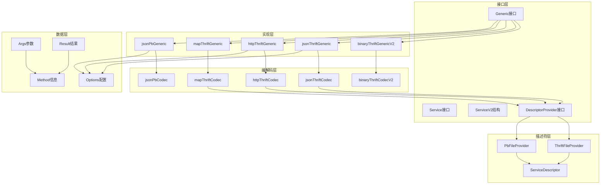

# Kitex-04-Generic-数据结构

## 核心数据结构UML图

```mermaid
classDiagram
    class Generic {
        <<interface>>
        +PayloadCodecType() serviceinfo.PayloadCodec
        +GenericMethod() serviceinfo.GenericMethodFunc
        +IDLServiceName() string
        +GetExtra(key string) interface{}
        +Close() error
    }
    
    class Service {
        <<interface>>
        +GenericCall(ctx context.Context, method string, request interface{}) (response interface{}, error)
    }
    
    class ServiceV2 {
        +GenericCall func(ctx context.Context, service, method string, request interface{}) (response interface{}, error)
        +ClientStreaming func(ctx context.Context, service, method string, stream ClientStreamingServer) error
        +ServerStreaming func(ctx context.Context, service, method string, request interface{}, stream ServerStreamingServer) error
        +BidiStreaming func(ctx context.Context, service, method string, stream BidiStreamingServer) error
    }
    
    class Args {
        +Method string
        +Request interface{}
        +GetFirstArgument() interface{}
    }
    
    class Result {
        +Success interface{}
        +GetResult() interface{}
        +GetSuccess() interface{}
        +SetSuccess(x interface{})
    }
    
    class binaryThriftGenericV2 {
        -codec *binaryThriftCodecV2
        +PayloadCodecType() serviceinfo.PayloadCodec
        +GenericMethod() serviceinfo.GenericMethodFunc
        +IDLServiceName() string
        +GetExtra(key string) interface{}
        +Close() error
    }
    
    class jsonThriftGeneric {
        -codec *jsonThriftCodec
        +PayloadCodecType() serviceinfo.PayloadCodec
        +GenericMethod() serviceinfo.GenericMethodFunc
        +IDLServiceName() string
        +GetExtra(key string) interface{}
        +Close() error
    }
    
    class httpThriftGeneric {
        -codec *httpThriftCodec
        +PayloadCodecType() serviceinfo.PayloadCodec
        +GenericMethod() serviceinfo.GenericMethodFunc
        +IDLServiceName() string
        +GetExtra(key string) interface{}
        +Close() error
    }
    
    class DescriptorProvider {
        <<interface>>
        +Provide(serviceName, methodName string) (*descriptor.ServiceDescriptor, error)
    }
    
    class Method {
        +Oneway bool
        +StreamingMode serviceinfo.StreamingMode
    }
    
    class Options {
        +dynamicgoConvOpts conv.Options
        +apply(opts []Option)
    }
    
    Generic <|-- binaryThriftGenericV2
    Generic <|-- jsonThriftGeneric
    Generic <|-- httpThriftGeneric
    
    binaryThriftGenericV2 --> binaryThriftCodecV2
    jsonThriftGeneric --> jsonThriftCodec
    httpThriftGeneric --> httpThriftCodec
    
    jsonThriftGeneric --> DescriptorProvider
    httpThriftGeneric --> DescriptorProvider
    
    Args --> Method
    Result --> Method
    
    Options --> conv.Options
```

## 主要数据结构详解

### 1. Generic接口核心结构

```go
// Generic泛型调用的核心抽象接口
type Generic interface {
    Closer                                              // 资源清理接口
    PayloadCodecType() serviceinfo.PayloadCodec        // 编解码类型
    GenericMethod() serviceinfo.GenericMethodFunc      // 泛型方法函数
    IDLServiceName() string                            // IDL服务名
    GetExtra(key string) interface{}                   // 扩展信息
}

// Closer资源清理接口
type Closer interface {
    Close() error
}
```

**接口设计说明**：
- **PayloadCodecType**：返回支持的编解码类型，用于协议适配
- **GenericMethod**：返回泛型方法处理函数，用于处理具体的RPC调用
- **IDLServiceName**：返回IDL定义的服务名，用于服务路由
- **GetExtra**：获取扩展配置信息，支持灵活的配置扩展
- **Close**：清理资源，防止内存泄漏

### 2. Args请求参数结构

```go
// Args泛型调用的请求参数结构
type Args struct {
    Method  string      // 方法名
    Request interface{} // 请求数据
}

// GetFirstArgument获取第一个参数
func (p *Args) GetFirstArgument() interface{} {
    return p.Request
}
```

**字段映射与说明**：

| 字段 | 类型 | 必填 | 默认值 | 约束 | 说明 |
|------|------|------|--------|------|------|
| Method | string | 是 | "" | 非空 | RPC方法名，用于方法路由 |
| Request | interface{} | 否 | nil | - | 请求数据，可以是任意类型 |

**使用场景**：
- 封装泛型调用的请求参数
- 在编解码过程中传递方法信息
- 支持不同格式的请求数据

### 3. Result响应结果结构

```go
// Result泛型调用的响应结果结构
type Result struct {
    Success interface{} // 成功响应数据
}

// GetResult获取结果
func (p *Result) GetResult() interface{} {
    return p.Success
}

// GetSuccess获取成功结果
func (p *Result) GetSuccess() interface{} {
    return p.Success
}

// SetSuccess设置成功结果
func (p *Result) SetSuccess(x interface{}) {
    p.Success = x
}
```

**字段映射与说明**：

| 字段 | 类型 | 必填 | 默认值 | 约束 | 说明 |
|------|------|------|--------|------|------|
| Success | interface{} | 否 | nil | - | 成功响应数据，可以是任意类型 |

**核心方法**：
- **GetResult/GetSuccess**：获取响应结果
- **SetSuccess**：设置响应结果，用于服务端处理

### 4. 具体Generic实现结构

#### binaryThriftGenericV2结构
```go
type binaryThriftGenericV2 struct {
    codec *binaryThriftCodecV2 // 二进制Thrift编解码器
}

func (g *binaryThriftGenericV2) PayloadCodecType() serviceinfo.PayloadCodec {
    return serviceinfo.Thrift
}

func (g *binaryThriftGenericV2) GenericMethod() serviceinfo.GenericMethodFunc {
    return genericMethod
}

func (g *binaryThriftGenericV2) IDLServiceName() string {
    return g.codec.svcName
}

func (g *binaryThriftGenericV2) GetExtra(key string) interface{} {
    switch key {
    case igeneric.IsBinaryGeneric:
        return true
    default:
        return nil
    }
}
```

#### jsonThriftGeneric结构
```go
type jsonThriftGeneric struct {
    codec *jsonThriftCodec // JSON Thrift编解码器
}

func (g *jsonThriftGeneric) PayloadCodecType() serviceinfo.PayloadCodec {
    return serviceinfo.Thrift
}

func (g *jsonThriftGeneric) GenericMethod() serviceinfo.GenericMethodFunc {
    return genericMethod
}

func (g *jsonThriftGeneric) IDLServiceName() string {
    return g.codec.svcName
}
```

#### httpThriftGeneric结构
```go
type httpThriftGeneric struct {
    codec *httpThriftCodec // HTTP Thrift编解码器
}

func (g *httpThriftGeneric) PayloadCodecType() serviceinfo.PayloadCodec {
    return serviceinfo.Thrift
}

func (g *httpThriftGeneric) GetExtra(key string) interface{} {
    switch key {
    case igeneric.GetMethodNameByRequestFuncKey:
        return g.codec.getMethodName
    default:
        return nil
    }
}
```

### 5. Service服务接口结构

#### Service v1接口
```go
// Service v1版本的泛型服务接口
type Service interface {
    GenericCall(ctx context.Context, method string, request interface{}) (response interface{}, error)
}
```

#### ServiceV2结构
```go
// ServiceV2 v2版本的泛型服务接口，支持流式调用和多服务
type ServiceV2 struct {
    // GenericCall处理一元请求
    GenericCall func(ctx context.Context, service, method string, request interface{}) (response interface{}, error)
    
    // ClientStreaming处理客户端流式调用
    ClientStreaming func(ctx context.Context, service, method string, stream ClientStreamingServer) error
    
    // ServerStreaming处理服务端流式调用
    ServerStreaming func(ctx context.Context, service, method string, request interface{}, stream ServerStreamingServer) error
    
    // BidiStreaming处理双向流式调用
    BidiStreaming func(ctx context.Context, service, method string, stream BidiStreamingServer) error
}
```

**版本对比**：

| 特性 | Service v1 | ServiceV2 |
|------|------------|-----------|
| 一元调用 | ✓ | ✓ |
| 多服务支持 | ✗ | ✓ |
| 客户端流式 | ✗ | ✓ |
| 服务端流式 | ✗ | ✓ |
| 双向流式 | ✗ | ✓ |
| 函数字段 | ✗ | ✓ |

### 6. DescriptorProvider描述符提供器

```go
// DescriptorProvider IDL描述符提供器接口
type DescriptorProvider interface {
    Provide(serviceName, methodName string) (*descriptor.ServiceDescriptor, error)
}

// ThriftFileProvider基于Thrift文件的描述符提供器
type ThriftFileProvider struct {
    svcs map[string]*descriptor.ServiceDescriptor // 服务描述符缓存
}

// PbDescriptorProvider Protobuf描述符提供器
type PbDescriptorProvider interface {
    Provide(serviceName, methodName string) (*descriptorpb.ServiceDescriptorProto, *descriptorpb.MethodDescriptorProto, error)
}
```

**提供器类型**：
- **ThriftFileProvider**：基于Thrift IDL文件
- **ThriftContentProvider**：基于Thrift IDL内容
- **PbFileProvider**：基于Protobuf IDL文件
- **PbContentProvider**：基于Protobuf IDL内容

### 7. Method方法信息结构

```go
// Method方法信息结构
type Method struct {
    Oneway        bool                        // 是否为单向调用
    StreamingMode serviceinfo.StreamingMode  // 流式模式
}
```

**流式模式枚举**：
```go
const (
    StreamingNone   StreamingMode = iota // 非流式
    StreamingUnary                       // 一元流式
    StreamingClient                      // 客户端流式
    StreamingServer                      // 服务端流式
    StreamingBidi                        // 双向流式
)
```

### 8. Options配置选项结构

```go
// Options泛型配置选项
type Options struct {
    dynamicgoConvOpts conv.Options // DynamicGo转换选项
}

// Option配置选项函数类型
type Option func(*Options)

// apply应用配置选项
func (o *Options) apply(opts []Option) {
    for _, opt := range opts {
        opt(o)
    }
}
```

**常用配置选项**：
```go
// WithDynamicGoConvOpts设置DynamicGo转换选项
func WithDynamicGoConvOpts(opts conv.Options) Option {
    return func(o *Options) {
        o.dynamicgoConvOpts = opts
    }
}

// 默认配置
var (
    DefaultJSONDynamicGoConvOpts = conv.Options{
        WriteRequiredField: true,
        WriteDefaultField:  true,
    }
    
    DefaultHTTPDynamicGoConvOpts = conv.Options{
        WriteRequiredField: true,
        WriteDefaultField:  false,
    }
)
```

## 数据结构关系图



## 内存管理与性能优化

### 1. 描述符缓存优化
```go
// ThriftFileProvider中的缓存机制
type ThriftFileProvider struct {
    svcs map[string]*descriptor.ServiceDescriptor
    mu   sync.RWMutex
}

func (p *ThriftFileProvider) Provide(serviceName, methodName string) (*descriptor.ServiceDescriptor, error) {
    p.mu.RLock()
    svc, exists := p.svcs[serviceName]
    p.mu.RUnlock()
    
    if exists {
        return svc, nil // 缓存命中
    }
    
    // 缓存未命中，加载并缓存
    p.mu.Lock()
    defer p.mu.Unlock()
    
    // 双重检查
    if svc, exists := p.svcs[serviceName]; exists {
        return svc, nil
    }
    
    // 加载描述符
    svc, err := p.loadServiceDescriptor(serviceName)
    if err != nil {
        return nil, err
    }
    
    p.svcs[serviceName] = svc
    return svc, nil
}
```

### 2. 编解码器复用
```go
// 编解码器实例复用
type codecPool struct {
    pool sync.Pool
}

func (p *codecPool) Get() *jsonThriftCodec {
    codec := p.pool.Get()
    if codec == nil {
        return newJsonThriftCodec()
    }
    return codec.(*jsonThriftCodec)
}

func (p *codecPool) Put(codec *jsonThriftCodec) {
    codec.reset() // 重置状态
    p.pool.Put(codec)
}
```

### 3. 参数对象池化
```go
// Args和Result对象池化
var (
    argsPool = sync.Pool{
        New: func() interface{} {
            return &Args{}
        },
    }
    
    resultPool = sync.Pool{
        New: func() interface{} {
            return &Result{}
        },
    }
)

func GetArgs() *Args {
    return argsPool.Get().(*Args)
}

func PutArgs(args *Args) {
    args.Method = ""
    args.Request = nil
    argsPool.Put(args)
}
```

### 4. 动态编解码优化
```go
// 使用DynamicGo进行高性能动态编解码
type jsonThriftCodec struct {
    provider         DescriptorProvider
    dynamicgoEnabled bool
    convOpts         conv.Options
}

func (c *jsonThriftCodec) Marshal(ctx context.Context, msg remote.Message, out remote.ByteBuffer) error {
    if c.dynamicgoEnabled {
        // 使用DynamicGo高性能转换
        return c.dynamicgoMarshal(ctx, msg, out)
    }
    // 使用传统方式
    return c.traditionalMarshal(ctx, msg, out)
}
```

这个数据结构文档详细介绍了Generic模块的核心数据结构、设计模式和性能优化策略，为开发者理解和扩展Generic功能提供了完整的参考。
