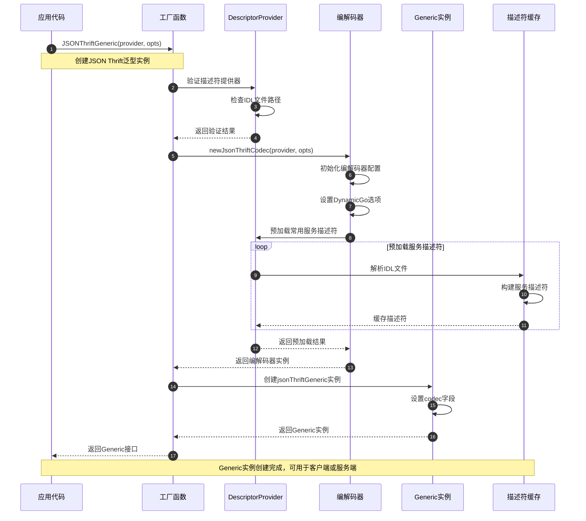
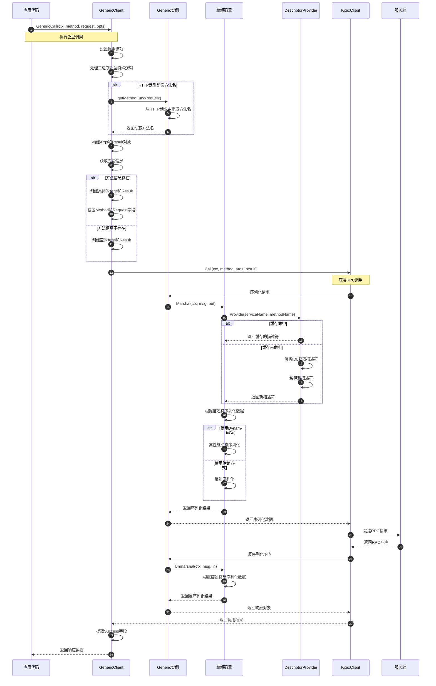
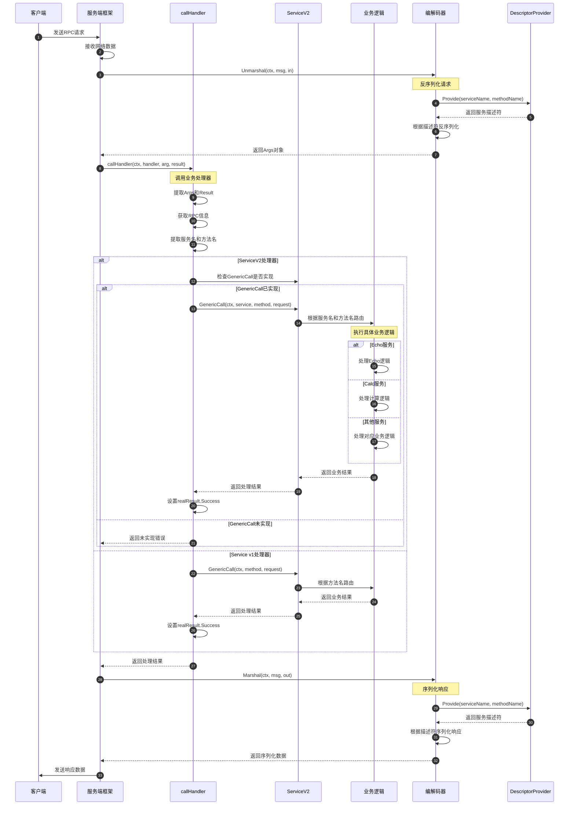
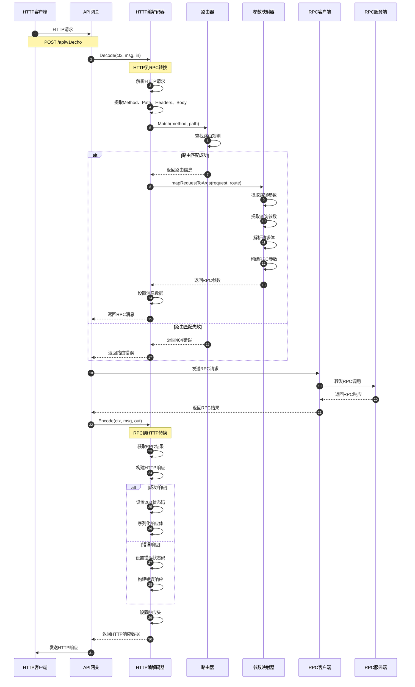
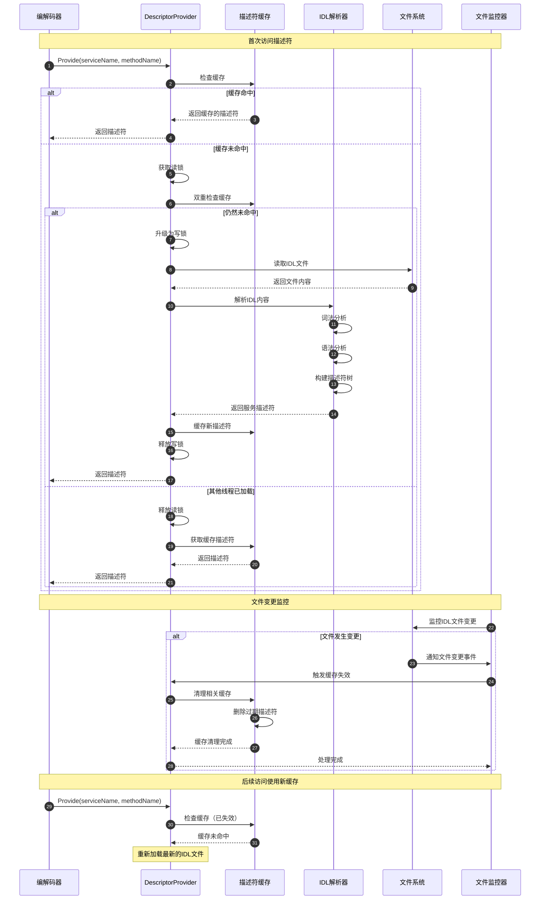
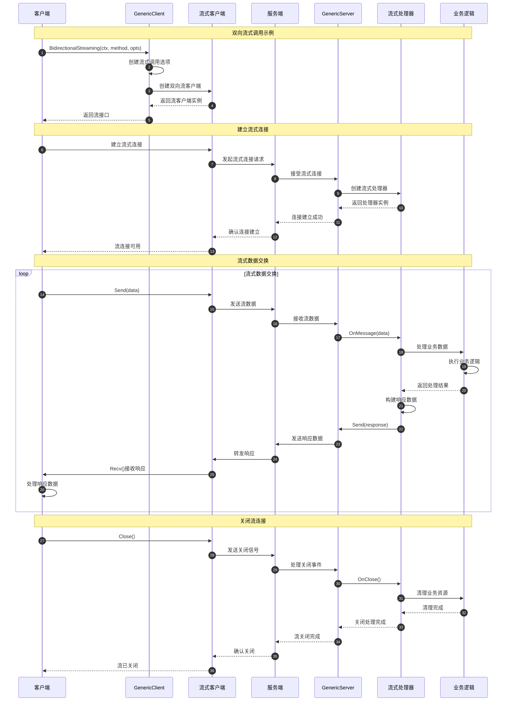

# Kitex-04-Generic-时序图

## 1. Generic创建与初始化时序图

### 创建时序说明

**1. 工厂函数调用阶段（步骤1-4）**
- 应用代码调用具体的Generic工厂函数
- 验证描述符提供器的有效性
- 检查IDL文件路径和内容的正确性

**2. 编解码器初始化阶段（步骤5-12）**
- 创建对应的编解码器实例
- 设置DynamicGo等性能优化选项
- 预加载常用的服务描述符到缓存

**3. Generic实例创建阶段（步骤13-16）**
- 创建具体的Generic实现实例
- 设置编解码器引用
- 返回Generic接口供后续使用

## 2. 泛型客户端调用时序图

### 客户端调用时序说明

**1. 调用准备阶段（步骤1-12）**
- 设置调用级别的配置选项
- 处理不同泛型类型的特殊逻辑
- 动态获取方法名（HTTP泛型）
- 构建泛型参数和结果容器

**2. 序列化阶段（步骤13-24）**
- 获取服务和方法的描述符信息
- 优先使用缓存的描述符，提高性能
- 根据配置选择高性能或传统序列化方式
- 将请求数据序列化为网络传输格式

**3. 网络传输阶段（步骤25-26）**
- 通过底层RPC客户端发送请求
- 接收服务端返回的响应数据

**4. 反序列化阶段（步骤27-32）**
- 使用相同的描述符反序列化响应
- 将网络数据转换为业务对象
- 提取业务结果返回给应用代码

## 3. 泛型服务端处理时序图

### 服务端处理时序说明

**1. 请求接收阶段（步骤1-6）**
- 服务端接收客户端的RPC请求
- 使用编解码器反序列化请求数据
- 获取服务描述符进行数据解析
- 构建Args参数对象

**2. 业务路由阶段（步骤7-12）**
- 调用callHandler进行请求分发
- 提取RPC调用的元信息
- 获取服务名和方法名用于路由

**3. 业务处理阶段（步骤13-26）**
- 根据处理器类型选择调用方式
- ServiceV2支持多服务路由
- 根据服务名和方法名路由到具体业务逻辑
- 执行业务处理并返回结果

**4. 响应发送阶段（步骤27-33）**
- 使用编解码器序列化响应数据
- 获取相同的服务描述符保证一致性
- 将响应数据发送回客户端

## 4. HTTP泛型映射时序图

### HTTP映射时序说明

**1. HTTP请求解析阶段（步骤1-6）**
- HTTP客户端发送RESTful API请求
- API网关接收HTTP请求
- HTTP编解码器解析请求的各个组成部分

**2. 路由匹配阶段（步骤7-16）**
- 根据HTTP方法和路径进行路由匹配
- 成功匹配时提取路由参数和查询参数
- 解析请求体并构建RPC调用参数
- 失败时返回404错误

**3. RPC调用阶段（步骤17-20）**
- 将HTTP请求转换为RPC调用
- 通过RPC客户端发送到目标服务
- 接收RPC服务的处理结果

**4. HTTP响应构建阶段（步骤21-30）**
- 将RPC结果转换为HTTP响应
- 根据结果类型设置相应的状态码
- 序列化响应体并设置响应头
- 发送HTTP响应给客户端

## 5. 描述符缓存管理时序图

### 描述符缓存管理说明

**1. 缓存查找阶段（步骤1-6）**
- 编解码器请求服务描述符
- 优先检查内存缓存
- 缓存命中时直接返回，提高性能

**2. 缓存加载阶段（步骤7-20）**
- 使用读写锁保证并发安全
- 双重检查避免重复加载
- 解析IDL文件构建描述符
- 将新描述符缓存供后续使用

**3. 文件监控阶段（步骤21-30）**
- 监控IDL文件的变更事件
- 文件变更时主动失效相关缓存
- 确保使用最新的IDL定义

**4. 缓存更新阶段（步骤31-35）**
- 后续访问时重新加载最新文件
- 更新缓存内容
- 保证服务定义的一致性

## 6. 流式调用处理时序图

### 流式调用处理说明

**1. 流连接建立阶段（步骤1-12）**
- 客户端创建流式调用客户端
- 建立到服务端的流式连接
- 服务端创建对应的流处理器
- 确认流连接建立成功

**2. 数据交换阶段（步骤13-25）**
- 客户端和服务端进行双向数据交换
- 支持并发的发送和接收操作
- 业务逻辑处理流式数据
- 实时响应和数据传输

**3. 流关闭阶段（步骤26-35）**
- 客户端主动关闭流连接
- 服务端处理关闭事件
- 清理流相关的业务资源
- 确认流连接完全关闭

## 时序图总结

这些时序图展示了Generic模块的完整工作流程：

1. **Generic创建**：从工厂函数到实例化的完整过程，包含描述符预加载
2. **客户端调用**：泛型客户端的完整调用链路，包含动态编解码
3. **服务端处理**：泛型服务的请求处理流程，支持多服务路由
4. **HTTP映射**：HTTP请求到RPC调用的完整转换过程
5. **描述符缓存**：IDL描述符的缓存管理和文件监控机制
6. **流式调用**：流式泛型调用的建立、数据交换和关闭过程

每个时序图都包含了详细的步骤说明和关键节点分析，帮助开发者理解Generic模块的内部工作机制、性能优化点和扩展方式。
