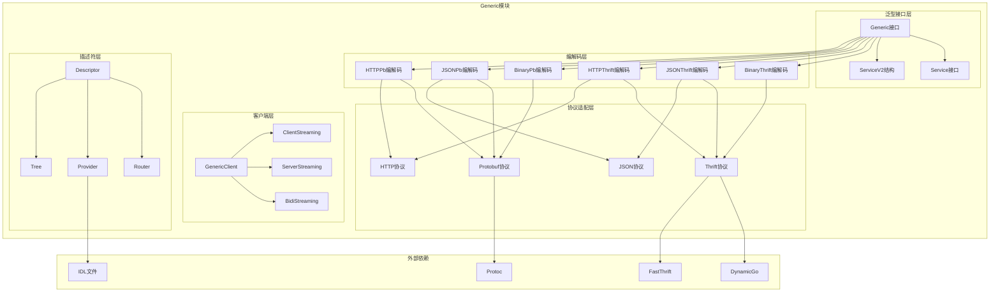

# Kitex-04-Generic-概览

## 模块职责与边界

### 核心职责
Generic模块是Kitex框架的泛型调用核心，负责处理无需IDL生成代码的动态RPC调用。主要职责包括：
- **泛型调用支持**：支持无IDL代码生成的动态RPC调用
- **多协议适配**：支持Thrift、Protobuf、JSON等多种序列化协议
- **动态编解码**：基于运行时信息进行消息编解码
- **HTTP映射**：支持HTTP请求到RPC调用的映射转换
- **流式调用**：支持客户端流、服务端流和双向流的泛型调用
- **服务发现**：支持动态服务名和方法名的解析

### 输入输出
- **输入**：泛型请求数据（JSON、二进制、Map等）、方法名、服务名
- **输出**：泛型响应数据、流式数据、错误信息
- **上游依赖**：Client和Server模块的泛型调用请求
- **下游依赖**：Remote模块的编解码器、IDL解析器

### 生命周期
1. **初始化阶段**：创建Generic实例，加载IDL信息或协议描述
2. **服务注册**：注册泛型服务处理器
3. **请求处理**：动态解析请求，执行业务逻辑
4. **响应编码**：将响应结果编码为目标格式
5. **资源清理**：清理IDL缓存和编解码器资源

## 模块架构图



### 架构说明

**1. 分层设计**
- **泛型接口层**：定义泛型调用的核心接口和服务抽象
- **客户端层**：提供泛型客户端和流式调用支持
- **编解码层**：支持多种协议和格式的编解码实现
- **描述符层**：管理IDL描述信息和路由规则
- **协议适配层**：适配不同的序列化协议

**2. 组件交互**
- Generic接口定义泛型调用的核心能力
- 编解码层根据协议类型选择具体实现
- 描述符层提供IDL信息和路由支持
- 协议适配层处理具体的序列化逻辑

**3. 扩展机制**
- 支持自定义Generic实现
- 可插拔的编解码器
- 灵活的描述符提供器
- 支持新协议的扩展

## 核心算法与流程

### 泛型调用核心流程

```go
// 泛型客户端调用流程
func (gc *genericServiceClient) GenericCall(ctx context.Context, method string, request interface{}, callOptions ...callopt.Option) (response interface{}, err error) {
    // 1. 设置调用选项
    ctx = client.NewCtxWithCallOptions(ctx, callOptions)
    
    // 2. 处理二进制泛型特殊逻辑
    if gc.isBinaryGeneric {
        ctx = igeneric.WithGenericStreamingMode(ctx, serviceinfo.StreamingNone)
    }
    
    // 3. 动态获取方法名（HTTP泛型）
    if gc.getMethodFunc != nil {
        method, _ = gc.getMethodFunc(request)
    }
    
    // 4. 构建泛型参数和结果
    var _args *generic.Args
    var _result *generic.Result
    mtInfo := gc.svcInfo.MethodInfo(ctx, method)
    if mtInfo != nil {
        _args = mtInfo.NewArgs().(*generic.Args)
        _args.Method = method
        _args.Request = request
        _result = mtInfo.NewResult().(*generic.Result)
    } else {
        _args = &generic.Args{}
        _result = &generic.Result{}
    }
    
    // 5. 执行RPC调用
    if err = gc.kClient.Call(ctx, method, _args, _result); err != nil {
        return
    }
    
    // 6. 返回结果
    return _result.GetSuccess(), nil
}
```

**调用流程说明**：
1. **选项处理**：设置调用级别的配置选项
2. **协议适配**：根据泛型类型设置特定的协议参数
3. **方法解析**：动态解析方法名，支持HTTP路由映射
4. **参数构建**：构建泛型参数和结果容器
5. **RPC执行**：通过底层客户端执行实际的RPC调用
6. **结果提取**：从泛型结果中提取业务数据

### 泛型服务处理流程

```go
func callHandler(ctx context.Context, handler, arg, result interface{}) error {
    realArg := arg.(*Args)
    realResult := result.(*Result)
    
    switch svc := handler.(type) {
    case *ServiceV2:
        // 1. 获取RPC信息
        ri := rpcinfo.GetRPCInfo(ctx)
        methodName := ri.Invocation().MethodName()
        serviceName := ri.Invocation().ServiceName()
        
        // 2. 检查处理器是否实现
        if svc.GenericCall == nil {
            return errGenericCallNotImplemented
        }
        
        // 3. 调用业务处理器
        success, err := svc.GenericCall(ctx, serviceName, methodName, realArg.Request)
        if err != nil {
            return err
        }
        
        // 4. 设置结果
        realResult.Success = success
        return nil
        
    case Service:
        // 兼容旧版本Service接口
        success, err := handler.(Service).GenericCall(ctx, realArg.Method, realArg.Request)
        if err != nil {
            return err
        }
        realResult.Success = success
        return nil
        
    default:
        return fmt.Errorf("CallHandler: unknown handler type %T", handler)
    }
}
```

**服务处理说明**：
1. **参数提取**：从泛型参数中提取实际的请求数据
2. **信息获取**：从RPC上下文获取服务名和方法名
3. **处理器调用**：根据处理器类型调用相应的业务逻辑
4. **结果封装**：将业务结果封装到泛型结果中
5. **版本兼容**：支持Service和ServiceV2两种接口

### HTTP映射处理流程

```go
// HTTP请求到RPC调用的映射
func (h *HTTPThriftCodec) Decode(ctx context.Context, msg remote.Message, in remote.ByteBuffer) error {
    // 1. 解析HTTP请求
    req, err := h.parseHTTPRequest(in)
    if err != nil {
        return err
    }
    
    // 2. 路由匹配
    route, err := h.router.Match(req.Method, req.URL.Path)
    if err != nil {
        return err
    }
    
    // 3. 参数映射
    args, err := h.mapRequestToArgs(req, route)
    if err != nil {
        return err
    }
    
    // 4. 设置消息数据
    msg.SetData(args)
    return nil
}

// RPC响应到HTTP响应的映射
func (h *HTTPThriftCodec) Encode(ctx context.Context, msg remote.Message, out remote.ByteBuffer) error {
    // 1. 获取RPC结果
    result := msg.Data()
    
    // 2. 构建HTTP响应
    resp := h.buildHTTPResponse(result)
    
    // 3. 序列化响应
    data, err := h.serializeResponse(resp)
    if err != nil {
        return err
    }
    
    // 4. 写入缓冲区
    _, err = out.Write(data)
    return err
}
```

**HTTP映射说明**：
1. **请求解析**：解析HTTP请求的方法、路径、参数等
2. **路由匹配**：根据路由规则匹配到对应的RPC方法
3. **参数映射**：将HTTP参数映射为RPC调用参数
4. **响应构建**：将RPC结果构建为HTTP响应格式

### 动态编解码流程

```go
// JSON Thrift动态编解码
func (c *jsonThriftCodec) Marshal(ctx context.Context, msg remote.Message, out remote.ByteBuffer) error {
    // 1. 获取方法信息
    method := msg.RPCInfo().Invocation().MethodName()
    svcInfo := msg.RPCInfo().Invocation().ServiceInfo()
    
    // 2. 获取类型描述符
    descriptor, err := c.provider.Provide(svcInfo.ServiceName, method)
    if err != nil {
        return err
    }
    
    // 3. 动态序列化
    data := msg.Data()
    jsonData, err := c.dynamicMarshal(data, descriptor)
    if err != nil {
        return err
    }
    
    // 4. 写入缓冲区
    _, err = out.Write(jsonData)
    return err
}

func (c *jsonThriftCodec) Unmarshal(ctx context.Context, msg remote.Message, in remote.ByteBuffer) error {
    // 1. 读取JSON数据
    jsonData, err := ioutil.ReadAll(in)
    if err != nil {
        return err
    }
    
    // 2. 获取类型描述符
    method := msg.RPCInfo().Invocation().MethodName()
    svcInfo := msg.RPCInfo().Invocation().ServiceInfo()
    descriptor, err := c.provider.Provide(svcInfo.ServiceName, method)
    if err != nil {
        return err
    }
    
    // 3. 动态反序列化
    data, err := c.dynamicUnmarshal(jsonData, descriptor)
    if err != nil {
        return err
    }
    
    // 4. 设置消息数据
    msg.SetData(data)
    return nil
}
```

**动态编解码说明**：
1. **描述符获取**：根据服务名和方法名获取类型描述符
2. **动态序列化**：使用描述符信息进行运行时序列化
3. **格式转换**：在不同格式间进行数据转换
4. **错误处理**：处理序列化过程中的各种异常

## 性能优化要点

### 1. 描述符缓存优化
- **IDL缓存**：缓存解析后的IDL描述信息
- **类型缓存**：缓存类型描述符，避免重复解析
- **路由缓存**：缓存HTTP路由匹配结果
- **编解码器复用**：复用编解码器实例

### 2. 动态编解码优化
- **DynamicGo集成**：使用高性能的动态编解码库
- **零拷贝优化**：减少数据拷贝操作
- **内存池**：使用对象池管理临时对象
- **流式处理**：支持流式编解码，减少内存占用

### 3. HTTP映射优化
- **路由树优化**：使用高效的路由匹配算法
- **参数解析优化**：优化HTTP参数解析性能
- **响应缓存**：缓存常见的HTTP响应格式
- **连接复用**：支持HTTP连接复用

### 4. 流式调用优化
- **背压控制**：实现流式调用的背压机制
- **批量处理**：支持批量发送和接收
- **异步处理**：异步处理流式数据
- **资源管理**：及时清理流式资源

### 5. 协议适配优化
- **协议检测**：快速检测协议类型
- **编解码选择**：根据性能需求选择编解码器
- **格式转换**：优化不同格式间的转换
- **兼容性处理**：高效处理协议版本兼容

## 扩展点设计

### 1. 自定义Generic实现
```go
// 实现自定义的Generic接口
type CustomGeneric struct {
    // 自定义字段
}

func (g *CustomGeneric) PayloadCodecType() serviceinfo.PayloadCodec {
    // 返回自定义的编解码类型
}

func (g *CustomGeneric) GenericMethod() serviceinfo.GenericMethodFunc {
    // 返回自定义的泛型方法处理函数
}

func (g *CustomGeneric) IDLServiceName() string {
    // 返回服务名
}
```

### 2. 自定义编解码器
```go
// 实现自定义的泛型编解码器
type CustomCodec struct {
    // 自定义字段
}

func (c *CustomCodec) Marshal(ctx context.Context, msg remote.Message, out remote.ByteBuffer) error {
    // 自定义序列化逻辑
}

func (c *CustomCodec) Unmarshal(ctx context.Context, msg remote.Message, in remote.ByteBuffer) error {
    // 自定义反序列化逻辑
}
```

### 3. 自定义描述符提供器
```go
// 实现自定义的描述符提供器
type CustomProvider struct {
    // 自定义字段
}

func (p *CustomProvider) Provide(serviceName, methodName string) (*descriptor.ServiceDescriptor, error) {
    // 提供自定义的服务描述符
}
```

### 4. 自定义路由器
```go
// 实现自定义的HTTP路由器
type CustomRouter struct {
    // 自定义字段
}

func (r *CustomRouter) Match(method, path string) (*Route, error) {
    // 自定义路由匹配逻辑
}
```

## 典型使用场景

### 1. API网关场景
- **协议转换**：HTTP到RPC的协议转换
- **动态路由**：基于HTTP路径的动态服务路由
- **格式转换**：JSON到Thrift/Protobuf的格式转换
- **参数映射**：HTTP参数到RPC参数的映射

### 2. 服务测试场景
- **接口测试**：无需生成代码的接口测试
- **数据模拟**：动态构造测试数据
- **协议验证**：验证不同协议的兼容性
- **性能测试**：泛型调用的性能测试

### 3. 服务代理场景
- **透明代理**：透明转发RPC请求
- **协议适配**：适配不同版本的协议
- **数据转换**：转换数据格式和结构
- **流量控制**：基于泛型调用的流量控制

### 4. 动态服务场景
- **配置驱动**：基于配置的动态服务调用
- **插件系统**：支持插件化的服务扩展
- **多租户**：支持多租户的动态服务
- **A/B测试**：支持A/B测试的动态切换

这个概览文档详细介绍了Generic模块的架构设计、核心流程和典型应用场景。Generic模块作为Kitex的泛型调用核心，提供了强大的动态RPC调用能力，支持多种协议和格式，是构建灵活RPC系统的重要组件。
