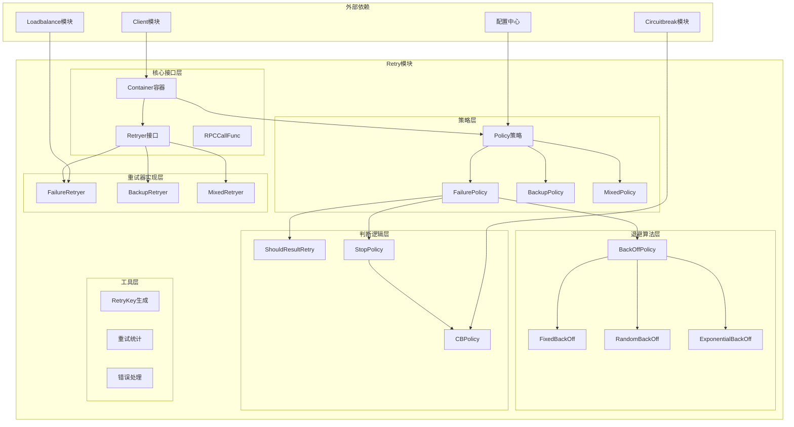

# Kitex-07-Retry-概览

## 模块职责与边界

### 核心职责
Retry模块是Kitex框架的重试机制核心，负责在RPC调用失败时执行重试策略。主要职责包括：
- **失败重试**：在调用失败时根据策略执行重试
- **备份请求**：发送备份请求以降低延迟
- **混合策略**：结合失败重试和备份请求的混合策略
- **退避算法**：实现指数退避、固定延迟等退避策略
- **熔断集成**：与熔断器集成，避免雪崩效应
- **结果判断**：判断调用结果是否需要重试

### 输入输出
- **输入**：RPC调用函数、请求参数、重试策略配置
- **输出**：最终调用结果、重试统计信息、错误信息
- **上游依赖**：Client模块的RPC调用
- **下游依赖**：Loadbalance模块的实例选择、Circuitbreak模块的熔断控制

### 生命周期
1. **策略配置**：配置重试策略和参数
2. **条件检查**：检查是否满足重试条件
3. **重试执行**：执行具体的重试逻辑
4. **退避等待**：根据退避策略等待重试
5. **结果判断**：判断是否需要继续重试
6. **统计记录**：记录重试次数和耗时统计

## 模块架构图



### 架构说明

**1. 分层设计**
- **核心接口层**：定义重试机制的核心抽象接口
- **策略层**：定义各种重试策略和配置
- **重试器实现层**：实现具体的重试算法
- **退避算法层**：实现不同的退避策略
- **判断逻辑层**：实现重试条件的判断逻辑
- **工具层**：提供辅助功能和统计工具

**2. 组件交互**
- Container管理重试器的创建和配置
- Retryer执行具体的重试逻辑
- Policy定义重试的策略和参数
- BackOffPolicy控制重试间隔时间

**3. 扩展机制**
- 支持自定义重试器实现
- 可配置的重试策略
- 灵活的结果判断逻辑
- 支持新退避算法的扩展

## 核心算法与流程

### 失败重试算法核心流程

```go
// 失败重试器的核心执行逻辑
func (r *failureRetryer) Do(ctx context.Context, rpcCall RPCCallFunc, firstRI rpcinfo.RPCInfo, req, resp interface{}) (rpcinfo.RPCInfo, bool, error) {
    // 1. 初始化重试参数
    retryTimes := r.policy.FailurePolicy.StopPolicy.MaxRetryTimes
    maxDuration := time.Duration(r.policy.FailurePolicy.StopPolicy.MaxDurationMS) * time.Millisecond
    startTime := time.Now()
    callTimes := 0
    
    var err error
    var cRI rpcinfo.RPCInfo
    var curResp interface{}
    newRespFunc := getNewRespFunc(firstRI.Invocation().MethodInfo())
    
    // 2. 执行重试循环
    for i := 0; i <= retryTimes; i++ {
        var callStart time.Time
        if i == 0 {
            callStart = startTime
        } else if i > 0 {
            // 3. 检查是否超过最大持续时间
            if ret, e := isExceedMaxDuration(ctx, startTime, maxDuration, callTimes); ret {
                err = e
                break
            }
            
            // 4. 判断是否应该重试
            if msg, ok := r.ShouldRetry(ctx, err, i, req, cbKey); !ok {
                if msg != "" {
                    appendMsg := fmt.Sprintf("retried %d, %s", i-1, msg)
                    appendErrMsg(err, appendMsg)
                }
                break
            }
            
            // 5. 执行退避等待
            if r.policy.FailurePolicy.BackOffPolicy != nil {
                backOffDuration := r.calculateBackOffDuration(i)
                time.Sleep(backOffDuration)
            }
            
            callStart = time.Now()
        }
        
        callTimes++
        
        // 6. 执行RPC调用
        curResp = newRespFunc()
        cRI, err = rpcCall(ctx, r, req, curResp)
        
        // 7. 判断是否需要继续重试
        if !r.isRetryResult(ctx, cRI, curResp, err, r.policy) {
            break
        }
    }
    
    // 8. 复制最终结果
    shallowCopyResults(curResp, resp)
    recordRetryInfo(cRI, callTimes, callCosts.String())
    
    if err == nil && callTimes == 1 {
        return cRI, true, nil
    }
    return cRI, false, err
}
```

**失败重试流程说明**：
1. **参数初始化**：设置重试次数、最大持续时间等参数
2. **重试循环**：在最大重试次数内循环执行调用
3. **时间检查**：检查是否超过最大允许的重试时间
4. **重试判断**：根据策略判断是否应该继续重试
5. **退避等待**：根据退避策略等待一定时间
6. **RPC调用**：执行实际的RPC调用
7. **结果判断**：判断调用结果是否需要继续重试
8. **结果返回**：返回最终的调用结果和统计信息

### 备份请求算法核心流程

```go
// 备份请求重试器的执行逻辑
func (r *backupRetryer) Do(ctx context.Context, rpcCall RPCCallFunc, firstRI rpcinfo.RPCInfo, req, resp interface{}) (rpcinfo.RPCInfo, bool, error) {
    // 1. 创建取消上下文
    ctx, cancel := context.WithCancel(ctx)
    defer cancel()
    
    // 2. 启动主请求
    mainCh := make(chan *callResult, 1)
    go func() {
        result := &callResult{}
        result.ri, result.err = rpcCall(ctx, r, req, resp)
        select {
        case mainCh <- result:
        case <-ctx.Done():
        }
    }()
    
    // 3. 设置备份请求延迟
    backupDelay := time.Duration(r.policy.BackupPolicy.RetryDelayMS) * time.Millisecond
    backupTimer := time.NewTimer(backupDelay)
    defer backupTimer.Stop()
    
    var backupCh <-chan *callResult
    
    select {
    case result := <-mainCh:
        // 4. 主请求先完成
        return result.ri, true, result.err
        
    case <-backupTimer.C:
        // 5. 启动备份请求
        backupCh = make(chan *callResult, 1)
        go func() {
            backupResp := getNewRespFunc(firstRI.Invocation().MethodInfo())()
            result := &callResult{}
            result.ri, result.err = rpcCall(ctx, r, req, backupResp)
            if result.err == nil {
                shallowCopyResults(backupResp, resp)
            }
            select {
            case backupCh <- result:
            case <-ctx.Done():
            }
        }()
    }
    
    // 6. 等待任一请求完成
    select {
    case result := <-mainCh:
        return result.ri, true, result.err
    case result := <-backupCh:
        return result.ri, false, result.err
    }
}
```

**备份请求流程说明**：
1. **上下文创建**：创建可取消的上下文，用于控制请求生命周期
2. **主请求启动**：在单独的goroutine中启动主请求
3. **延迟设置**：设置备份请求的延迟时间
4. **主请求优先**：如果主请求在延迟时间内完成，直接返回结果
5. **备份请求启动**：延迟时间到达后启动备份请求
6. **竞争完成**：等待主请求或备份请求中任一先完成的结果

### 退避算法实现

```go
// 指数退避算法
func (p *BackOffPolicy) calculateExponentialBackOff(retryTimes int) time.Duration {
    // 1. 计算基础延迟
    baseDelay := time.Duration(p.FixedBackOffMS) * time.Millisecond
    if baseDelay <= 0 {
        baseDelay = 10 * time.Millisecond // 默认10ms
    }
    
    // 2. 计算指数倍数
    multiplier := math.Pow(2, float64(retryTimes-1))
    delay := time.Duration(float64(baseDelay) * multiplier)
    
    // 3. 添加随机抖动
    if p.MaxJitterMS > 0 {
        jitter := time.Duration(fastrand.Uint32n(p.MaxJitterMS)) * time.Millisecond
        delay += jitter
    }
    
    // 4. 限制最大延迟
    maxDelay := time.Duration(p.MaxBackOffMS) * time.Millisecond
    if maxDelay > 0 && delay > maxDelay {
        delay = maxDelay
    }
    
    return delay
}

// 固定延迟退避
func (p *BackOffPolicy) calculateFixedBackOff() time.Duration {
    baseDelay := time.Duration(p.FixedBackOffMS) * time.Millisecond
    
    // 添加随机抖动
    if p.MaxJitterMS > 0 {
        jitter := time.Duration(fastrand.Uint32n(p.MaxJitterMS)) * time.Millisecond
        baseDelay += jitter
    }
    
    return baseDelay
}

// 随机延迟退避
func (p *BackOffPolicy) calculateRandomBackOff() time.Duration {
    minDelay := time.Duration(p.FixedBackOffMS) * time.Millisecond
    maxDelay := time.Duration(p.MaxBackOffMS) * time.Millisecond
    
    if maxDelay <= minDelay {
        return minDelay
    }
    
    // 在最小和最大延迟之间随机选择
    diff := maxDelay - minDelay
    randomDelay := time.Duration(fastrand.Int63n(int64(diff)))
    
    return minDelay + randomDelay
}
```

**退避算法说明**：
1. **指数退避**：延迟时间按指数增长，适用于临时性故障
2. **固定延迟**：每次重试使用相同的延迟时间
3. **随机延迟**：在指定范围内随机选择延迟时间
4. **抖动处理**：添加随机抖动避免惊群效应

### 重试条件判断

```go
// 判断是否应该重试
func (r *failureRetryer) ShouldRetry(ctx context.Context, err error, retryTimes int, req interface{}, cbKey string) (string, bool) {
    // 1. 检查熔断器状态
    if r.cbContainer.cbStat {
        if r.cbContainer.cbCtl.IsServiceCB(cbKey) {
            return "service circuit break", false
        }
    }
    
    // 2. 检查重试次数限制
    if retryTimes > r.policy.FailurePolicy.StopPolicy.MaxRetryTimes {
        return "exceed max retry times", false
    }
    
    // 3. 检查链路停止策略
    if !r.policy.FailurePolicy.StopPolicy.DisableChainStop {
        if isChainStop(ctx) {
            return "chain stop", false
        }
    }
    
    // 4. 检查DDL（截止时间）
    if isExceedDDL(ctx) {
        return "exceed ddl", false
    }
    
    // 5. 检查自定义重试条件
    if r.policy.FailurePolicy.ShouldResultRetry != nil {
        shouldRetry := r.policy.FailurePolicy.ShouldResultRetry.ErrorRetryWithCtx(ctx, err, ri)
        if !shouldRetry {
            return "custom should not retry", false
        }
    }
    
    // 6. 默认错误重试
    if err != nil {
        return "", true
    }
    
    return "no error", false
}
```

**重试条件说明**：
1. **熔断检查**：检查服务是否被熔断，熔断状态下不重试
2. **次数限制**：检查是否超过最大重试次数
3. **链路停止**：检查链路是否设置了停止标记
4. **时间限制**：检查是否超过截止时间
5. **自定义条件**：执行用户自定义的重试条件判断
6. **默认策略**：有错误时默认重试

## 性能优化要点

### 1. 重试器缓存优化
- **重试器复用**：缓存创建的重试器实例，避免重复创建
- **策略缓存**：缓存解析后的重试策略配置
- **对象池**：使用对象池管理重试过程中的临时对象
- **内存预分配**：预分配重试过程中需要的内存

### 2. 并发控制优化
- **Goroutine池**：使用协程池处理并发重试
- **背压控制**：控制并发重试的数量，避免系统过载
- **资源限制**：限制重试占用的系统资源
- **优雅降级**：在资源不足时优雅降级重试策略

### 3. 时间管理优化
- **高精度计时**：使用高精度的时间测量
- **Timer复用**：复用Timer对象，减少GC压力
- **退避优化**：优化退避算法的计算效率
- **超时控制**：精确控制重试的超时时间

### 4. 网络优化
- **连接复用**：复用网络连接，减少连接建立开销
- **请求合并**：在可能的情况下合并重试请求
- **快速失败**：快速检测网络故障，避免无效重试
- **负载均衡**：与负载均衡器配合，选择最优实例

### 5. 统计优化
- **异步统计**：异步记录重试统计信息
- **批量上报**：批量上报统计数据，减少网络开销
- **内存优化**：优化统计数据的内存使用
- **采样统计**：对高频调用进行采样统计

## 扩展点设计

### 1. 自定义重试器
```go
// 实现自定义的重试器
type CustomRetryer struct {
    policy Policy
    // 自定义字段
}

func (r *CustomRetryer) AllowRetry(ctx context.Context) (string, bool) {
    // 自定义重试允许逻辑
    return r.checkCustomConditions(ctx)
}

func (r *CustomRetryer) Do(ctx context.Context, rpcCall RPCCallFunc, firstRI rpcinfo.RPCInfo, req, resp interface{}) (rpcinfo.RPCInfo, bool, error) {
    // 自定义重试执行逻辑
    return r.executeCustomRetry(ctx, rpcCall, firstRI, req, resp)
}
```

### 2. 自定义退避策略
```go
// 实现自定义的退避策略
func CustomBackOffPolicy(retryTimes int, baseDelay time.Duration) time.Duration {
    // 自定义退避算法
    switch retryTimes {
    case 1:
        return baseDelay
    case 2:
        return baseDelay * 2
    case 3:
        return baseDelay * 4
    default:
        return baseDelay * 8
    }
}
```

### 3. 自定义结果判断
```go
// 自定义重试结果判断
func CustomShouldResultRetry() *ShouldResultRetry {
    return &ShouldResultRetry{
        ErrorRetryWithCtx: func(ctx context.Context, err error, ri rpcinfo.RPCInfo) bool {
            // 自定义重试条件判断
            if isTimeoutError(err) {
                return true
            }
            if isNetworkError(err) {
                return true
            }
            if isCustomRetryableError(err) {
                return true
            }
            return false
        },
    }
}
```

### 4. 自定义重试策略
```go
// 创建自定义重试策略
func NewCustomRetryPolicy() *Policy {
    return &Policy{
        Enable: true,
        Type:   FailureType,
        FailurePolicy: &FailurePolicy{
            StopPolicy: StopPolicy{
                MaxRetryTimes:    3,
                MaxDurationMS:    5000,
                DisableChainStop: false,
                CBPolicy: CBPolicy{
                    ErrorRate: 0.5,
                },
            },
            BackOffPolicy: &BackOffPolicy{
                BackOffType:   ExponentialBackOffType,
                FixedBackOffMS: 100,
                MaxBackOffMS:   1000,
                MaxJitterMS:    50,
            },
            RetrySameNode:     false,
            ShouldResultRetry: CustomShouldResultRetry(),
        },
    }
}
```

## 典型使用场景

### 1. 微服务容错
- **网络抖动**：处理网络临时性故障
- **服务过载**：在服务过载时进行重试
- **实例故障**：自动切换到健康实例
- **依赖服务恢复**：等待依赖服务恢复

### 2. 高可用架构
- **多活部署**：在多个数据中心间重试
- **灾备切换**：主备切换时的重试
- **服务降级**：重试失败后的服务降级
- **熔断恢复**：熔断器恢复时的重试

### 3. 性能优化
- **备份请求**：降低长尾延迟
- **预测性重试**：基于历史数据预测重试
- **自适应重试**：根据成功率调整重试策略
- **智能退避**：根据错误类型选择退避策略

### 4. 业务场景
- **支付重试**：支付失败时的安全重试
- **数据同步**：数据同步失败时的重试
- **消息投递**：消息投递失败时的重试
- **批处理任务**：批处理任务失败时的重试

这个概览文档详细介绍了Retry模块的架构设计、核心算法和典型应用场景。Retry模块作为Kitex的重试机制核心，提供了多种重试策略和退避算法，是构建高可用分布式系统的重要保障。
