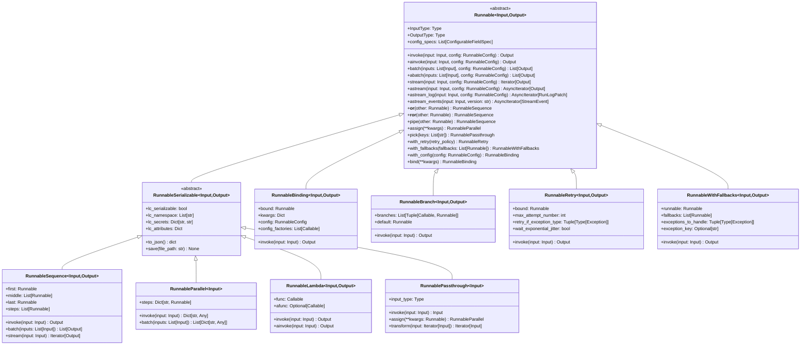
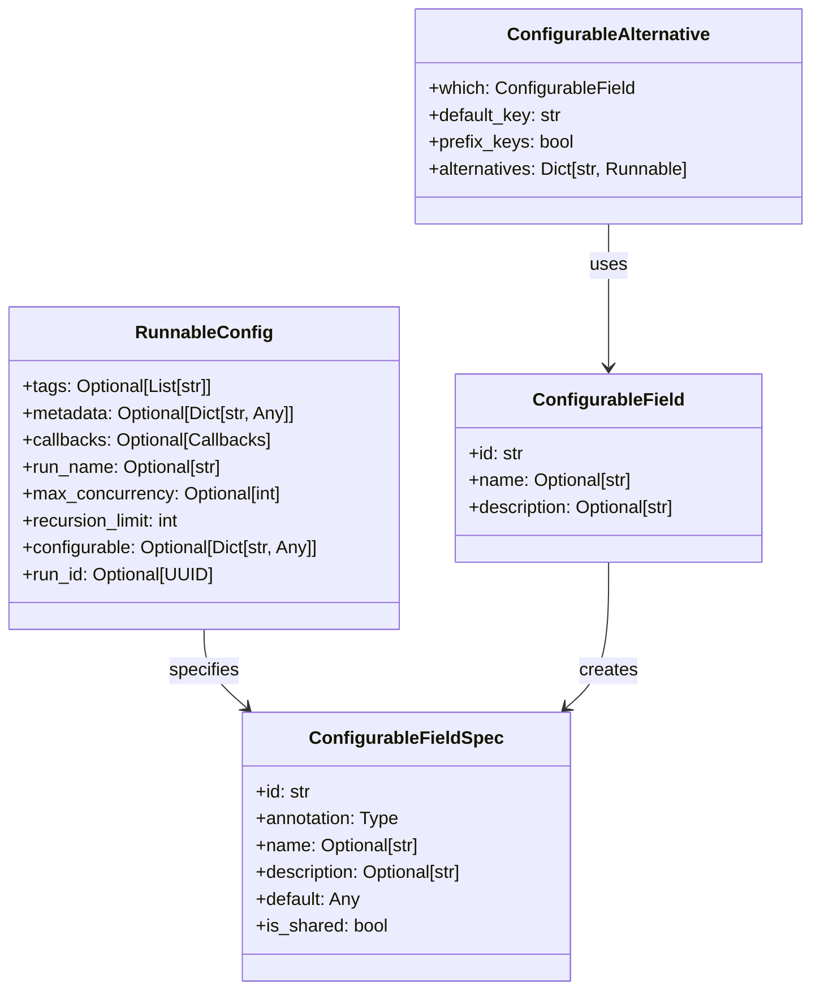
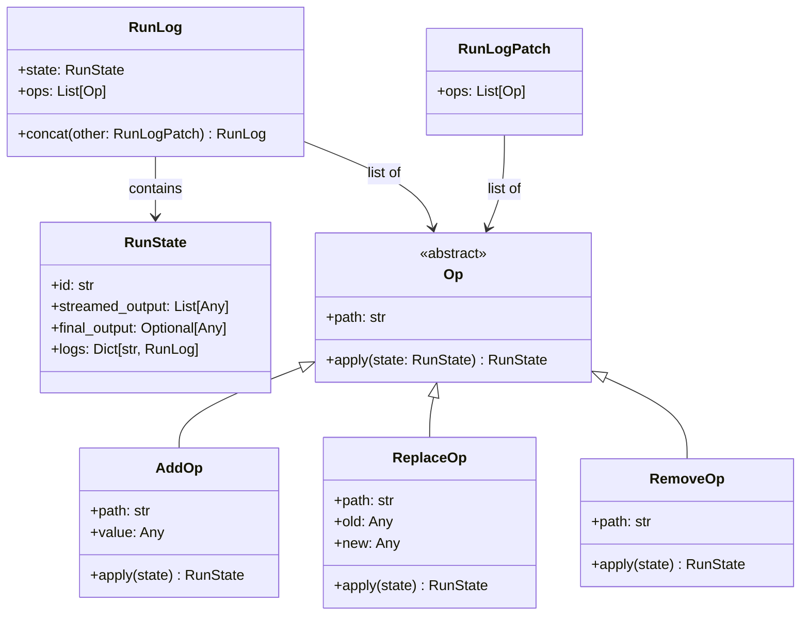
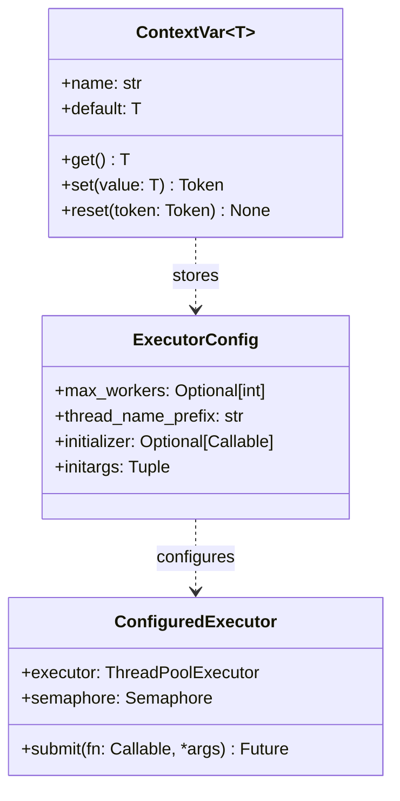
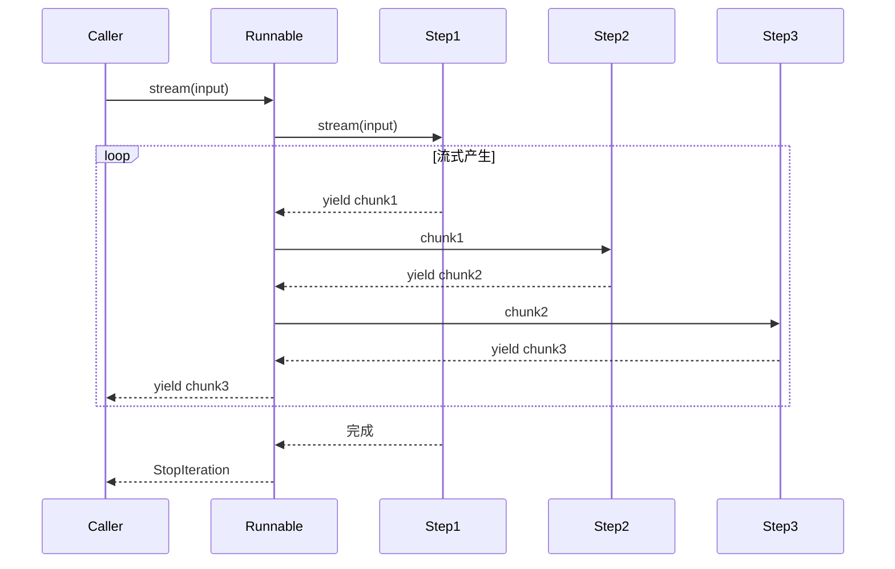
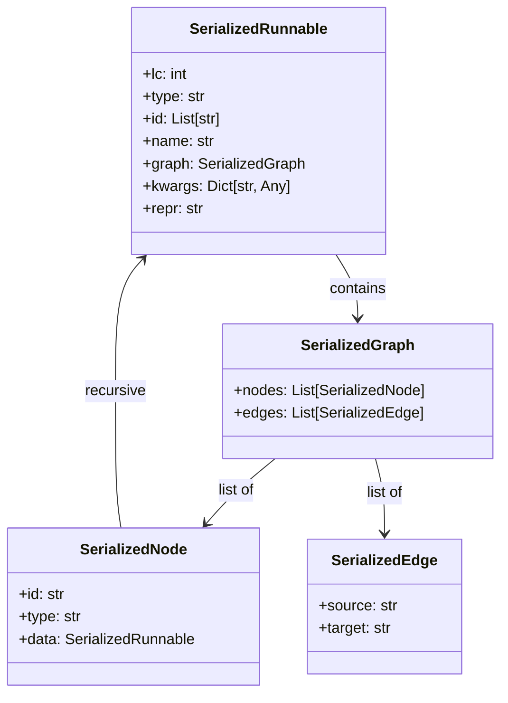
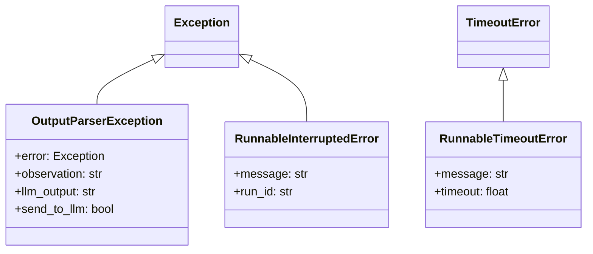

# LangChain-01-Runnables-数据结构

## 文档说明

本文档详细描述 **Runnables 模块**的核心数据结构，包括类层次结构、关键字段、类型定义和数据流转关系。所有结构均配备 UML 类图和详细的字段说明。

---

## 1. 核心类层次结构

### 1.1 Runnable 类层次 UML



**图解说明**：

1. **类层次**：
   - `Runnable` 是根抽象基类，定义了统一的调用接口（invoke/batch/stream）
   - `RunnableSerializable` 继承自 `Runnable`，增加序列化能力
   - 具体实现类分为两大类：可序列化（继承 `RunnableSerializable`）和不可序列化（直接继承 `Runnable`）

2. **泛型参数**：
   - `Input`：输入类型
   - `Output`：输出类型
   - 类型安全通过泛型在编译时保证

3. **组合方式**：
   - `RunnableSequence`：顺序组合（通过 `|` 操作符）
   - `RunnableParallel`：并行组合（通过字典字面量）
   - `RunnableBranch`：条件分支
   - `RunnableBinding`：配置绑定

4. **增强功能**：
   - `RunnableRetry`：重试包装器
   - `RunnableWithFallbacks`：回退包装器
   - `RunnableBinding`：参数和配置绑定

---

## 2. 配置相关数据结构

### 2.1 RunnableConfig 结构



**字段说明**：

#### RunnableConfig

| 字段 | 类型 | 必填 | 默认 | 说明 |
|-----|------|-----|------|------|
| tags | `List[str]` | 否 | `None` | 用于追踪和过滤的标签列表 |
| metadata | `Dict[str, Any]` | 否 | `None` | 附加元数据，传递给回调和追踪系统 |
| callbacks | `Callbacks` | 否 | `None` | 回调处理器列表，用于监控执行 |
| run_name | `str` | 否 | `None` | 运行名称，用于追踪标识 |
| max_concurrency | `int` | 否 | `None` | 并行执行的最大并发数 |
| recursion_limit | `int` | 否 | `25` | 递归调用深度限制，防止无限递归 |
| configurable | `Dict[str, Any]` | 否 | `None` | 可配置字段的值映射 |
| run_id | `UUID` | 否 | 自动生成 | 唯一运行标识符 |

**约束与边界**：
- `max_concurrency` 控制 `batch` 和 `RunnableParallel` 的并发度
- `recursion_limit` 默认 25 层，超出抛出 `RecursionError`
- `callbacks` 支持同步和异步处理器，按注册顺序调用

#### ConfigurableFieldSpec

| 字段 | 类型 | 必填 | 说明 |
|-----|------|-----|------|
| id | `str` | 是 | 字段唯一标识符，用于配置键 |
| annotation | `Type` | 是 | 字段类型注解 |
| name | `str` | 否 | 人类可读名称 |
| description | `str` | 否 | 字段用途描述 |
| default | `Any` | 否 | 默认值 |
| is_shared | `bool` | 否 | 是否在整个链中共享配置 |

---

## 3. 流式数据结构

### 3.1 流式事件类型

```mermaid
classDiagram
    class StreamEvent {
        <<abstract>>
        +event: str
        +name: str
        +run_id: str
        +tags: List[str]
        +metadata: Dict[str, Any]
        +data: Dict[str, Any]
    }

    class OnChainStart {
        +event: "on_chain_start"
        +data: {"input": Any}
    }

    class OnChainStream {
        +event: "on_chain_stream"
        +data: {"chunk": Any}
    }

    class OnChainEnd {
        +event: "on_chain_end"
        +data: {"output": Any}
    }

    class OnLLMStart {
        +event: "on_llm_start"
        +data: {"input": Any}
    }

    class OnLLMStream {
        +event: "on_llm_stream"
        +data: {"chunk": BaseMessageChunk}
    }

    class OnLLMEnd {
        +event: "on_llm_end"
        +data: {"output": Any}
    }

    class OnToolStart {
        +event: "on_tool_start"
        +data: {"input": Any}
    }

    class OnToolEnd {
        +event: "on_tool_end"
        +data: {"output": Any}
    }

    class OnRetrieverStart {
        +event: "on_retriever_start"
        +data: {"input": Any}
    }

    class OnRetrieverEnd {
        +event: "on_retriever_end"
        +data: {"output": List[Document]}
    }

    StreamEvent <|-- OnChainStart
    StreamEvent <|-- OnChainStream
    StreamEvent <|-- OnChainEnd
    StreamEvent <|-- OnLLMStart
    StreamEvent <|-- OnLLMStream
    StreamEvent <|-- OnLLMEnd
    StreamEvent <|-- OnToolStart
    StreamEvent <|-- OnToolEnd
    StreamEvent <|-- OnRetrieverStart
    StreamEvent <|-- OnRetrieverEnd
```

**事件流说明**：

| 事件类型 | 触发时机 | data 字段 | 用途 |
|---------|---------|-----------|------|
| `on_chain_start` | Runnable 开始执行 | `{"input": ...}` | 记录输入，初始化追踪 |
| `on_chain_stream` | Runnable 产生中间输出 | `{"chunk": ...}` | 流式传输中间结果 |
| `on_chain_end` | Runnable 执行完成 | `{"output": ...}` | 记录最终输出 |
| `on_llm_start` | LLM 开始生成 | `{"input": ...}` | 记录提示词 |
| `on_llm_stream` | LLM 生成 token | `{"chunk": BaseMessageChunk}` | 实时显示生成内容 |
| `on_llm_end` | LLM 生成完成 | `{"output": ...}` | 记录完整响应 |
| `on_tool_start` | 工具开始执行 | `{"input": ...}` | 记录工具输入 |
| `on_tool_end` | 工具执行完成 | `{"output": ...}` | 记录工具输出 |
| `on_retriever_start` | 检索器开始检索 | `{"input": str}` | 记录查询字符串 |
| `on_retriever_end` | 检索器完成检索 | `{"output": List[Document]}` | 记录检索结果 |

**使用模式**：

```python
# 订阅所有事件
async for event in chain.astream_events(input_data, version="v2"):
    event_type = event["event"]

    if event_type == "on_llm_stream":
        # 实时显示 LLM 输出
        print(event["data"]["chunk"].content, end="", flush=True)

    elif event_type == "on_tool_start":
        # 显示工具调用
        print(f"\nCalling tool: {event['name']}")

    elif event_type == "on_retriever_end":
        # 显示检索结果数量
        docs = event["data"]["output"]
        print(f"Retrieved {len(docs)} documents")
```

**性能考虑**：
- 事件流通过 `asyncio.Queue` 实现，零拷贝传递
- 每个事件约 500 字节（不含 data 字段）
- 建议使用 `include_names`/`include_types` 过滤无关事件

---

### 3.2 RunLog 和 Patch 结构



**字段说明**：

#### RunState

| 字段 | 类型 | 说明 |
|-----|------|------|
| id | `str` | 运行的唯一标识符 |
| streamed_output | `List[Any]` | 已流式输出的所有块 |
| final_output | `Optional[Any]` | 最终输出（完成后可用） |
| logs | `Dict[str, RunLog]` | 子运行的日志（键为子运行名称） |

#### Op 操作类型

| 操作 | 路径示例 | 语义 |
|-----|---------|------|
| `AddOp` | `/streamed_output/-` | 在数组末尾添加元素 |
| `ReplaceOp` | `/final_output` | 替换字段值 |
| `RemoveOp` | `/logs/step1` | 删除字段 |

**应用场景**：
- 用于 `astream_log()` API，增量返回执行状态
- 支持 JSON Patch 规范（RFC 6902）
- 适合构建实时调试 UI

---

## 4. 并发控制数据结构

### 4.1 线程池和信号量管理



**字段说明**：

#### ExecutorConfig

| 字段 | 类型 | 默认 | 说明 |
|-----|------|-----|------|
| max_workers | `int` | CPU 核数 + 4 | 线程池最大线程数 |
| thread_name_prefix | `str` | `"langchain-"` | 线程名称前缀 |
| initializer | `Callable` | `None` | 线程初始化函数 |
| initargs | `Tuple` | `()` | 初始化函数参数 |

**使用位置**：
- `Runnable.batch()` 并行处理多个输入
- `RunnableParallel` 并发执行多个步骤
- 通过 `RunnableConfig.max_concurrency` 限制并发数

**性能特征**：
- 线程池复用，避免频繁创建销毁
- 信号量控制最大并发数（防止 OOM）
- ContextVar 实现线程隔离的配置传递

---

## 5. 数据流转关系

### 5.1 RunnableSequence 数据流

```mermaid
flowchart LR
    Input[Input] --> Step1[first: Runnable]
    Step1 --> Mid1[middle[0]]
    Mid1 --> Mid2[middle[1]]
    Mid2 --> MidN[middle[n-1]]
    MidN --> StepN[last: Runnable]
    StepN --> Output[Output]

    style Input fill:#e1f5ff
    style Output fill:#ffe1f5
    style Step1 fill:#fff4e1
    style StepN fill:#fff4e1
```

**数据类型转换**：
- 每个步骤的 `Output` 必须与下一步的 `Input` 兼容
- 类型检查在组合时（`|` 操作符）进行
- 不兼容时抛出 `TypeError`

---

### 5.2 RunnableParallel 数据流

```mermaid
flowchart TB
    Input[Input: T] --> Fork{分发}
    Fork --> Step1[steps['a']: Runnable]
    Fork --> Step2[steps['b']: Runnable]
    Fork --> StepN[steps['n']: Runnable]
    Step1 --> Merge{合并}
    Step2 --> Merge
    StepN --> Merge
    Merge --> Output["Output: {'a': A, 'b': B, 'n': N}"]

    style Input fill:#e1f5ff
    style Output fill:#ffe1f5
    style Fork fill:#fff4e1
    style Merge fill:#f4ffe1
```

**并发策略**：
- 所有步骤同时启动（`asyncio.gather` 或 `ThreadPoolExecutor`）
- 等待所有步骤完成后合并结果
- 任一步骤失败则整体失败

---

### 5.3 流式数据流（Stream）



**流式特性**：
- 背压控制：下游未消费时上游暂停
- 变换链：每个步骤可转换或过滤块
- 错误传播：任一步骤异常立即抛出

---

## 6. 序列化格式

### 6.1 序列化 Schema



**字段说明**：

| 字段 | 类型 | 说明 |
|-----|------|------|
| lc | `int` | LangChain 序列化协议版本（当前为 1） |
| type | `str` | 类型标识（如 `"constructor"`） |
| id | `List[str]` | 完全限定类名（如 `["langchain", "schema", "runnable", "RunnableSequence"]`） |
| name | `str` | 实例名称 |
| graph | `SerializedGraph` | 执行图结构 |
| kwargs | `Dict` | 构造参数 |
| repr | `str` | 人类可读表示 |

**示例 JSON**：

```json
{
  "lc": 1,
  "type": "constructor",
  "id": ["langchain", "schema", "runnable", "RunnableSequence"],
  "kwargs": {
    "first": {
      "lc": 1,
      "type": "constructor",
      "id": ["langchain", "prompts", "chat", "ChatPromptTemplate"],
      "kwargs": {...}
    },
    "last": {
      "lc": 1,
      "type": "constructor",
      "id": ["langchain_openai", "chat_models", "ChatOpenAI"],
      "kwargs": {"model": "gpt-4"}
    }
  }
}
```

**使用场景**：
- 保存链配置到文件（`.json` 或 `.yaml`）
- 版本控制和审计
- 跨进程/跨语言传递链定义

**限制**：
- Lambda 函数无法序列化（`RunnableLambda` 除外）
- 非 JSON 可序列化对象需自定义序列化器
- 密钥类字段（如 API Key）会被标记为 `lc_secrets`

---

## 7. 错误类型和异常结构



**异常说明**：

| 异常类型 | 触发条件 | 处理建议 |
|---------|---------|---------|
| `OutputParserException` | 解析器无法解析 LLM 输出 | 使用 `OutputFixingParser` 或重试 |
| `RunnableInterruptedError` | 用户中断执行（Ctrl+C） | 清理资源，保存中间状态 |
| `RunnableTimeoutError` | 执行超时 | 检查 `max_execution_time` 配置 |

---

## 8. 关键数据结构映射表

### 8.1 DTO 与持久化模型映射

| DTO（内存模型） | 持久化模型（序列化） | 映射规则 |
|---------------|-------------------|---------|
| `RunnableSequence` | `SerializedRunnable` (type="constructor") | 递归序列化 first/middle/last |
| `RunnableConfig` | `Dict[str, Any]` | 扁平化为 JSON |
| `StreamEvent` | 不持久化 | 仅用于运行时传递 |
| `RunLog` | 不持久化 | 仅用于调试 |

---

## 9. 版本演进与兼容性

### 9.1 数据结构变更历史

| 版本 | 变更内容 | 兼容性影响 |
|-----|---------|-----------|
| v0.1.0 | 引入 `Runnable` 基类 | - |
| v0.2.0 | 增加 `astream_events` API | 向后兼容 |
| v0.3.0 | `RunnableConfig` 增加 `max_concurrency` | 向后兼容，默认值 `None` |
| v0.3.0 | `StreamEvent` 增加 `parent_ids` 字段 | 向后兼容 |

**兼容性策略**：
- 新增字段均有合理默认值
- 移除字段前至少保留两个大版本（标记为 `deprecated`）
- 序列化格式通过 `lc` 版本号区分

---

## 10. 性能特征总结

| 数据结构 | 时间复杂度 | 空间复杂度 | 并发安全 |
|---------|-----------|-----------|---------|
| `RunnableSequence` | O(n)（n 为步骤数） | O(1) | ✅ 是 |
| `RunnableParallel` | O(1)（并发执行） | O(k)（k 为并发数） | ✅ 是 |
| `RunnableConfig` | O(1)（字典查找） | O(m)（m 为配置项数） | ⚠️ 否（需拷贝） |
| `StreamEvent` | O(1)（创建和传递） | O(1) | ✅ 是 |

**优化建议**：
- 长序列链考虑拆分为子链并缓存中间结果
- 高并发场景调整 `max_concurrency` 避免线程爆炸
- 流式 API 优先（减少内存峰值）
- 使用 `RunnableConfig` 浅拷贝共享不可变配置

---

## 11. 总结

本文档详细描述了 **Runnables 模块**的核心数据结构，包括：

1. **类层次**：从 `Runnable` 抽象基类到各种具体实现的完整继承关系
2. **配置结构**：`RunnableConfig` 和可配置字段的管理机制
3. **流式结构**：`StreamEvent`、`RunLog` 等流式执行的数据载体
4. **并发控制**：线程池和信号量的配置管理
5. **数据流转**：顺序、并行、流式三种执行模式的数据传递
6. **序列化格式**：LangChain 序列化协议和 JSON Schema
7. **异常类型**：错误处理和异常传播机制
8. **性能特征**：各数据结构的复杂度和优化建议

所有结构均配备 UML 图、字段表、约束说明和实际应用示例，帮助开发者深入理解 Runnables 的内部实现和最佳实践。

